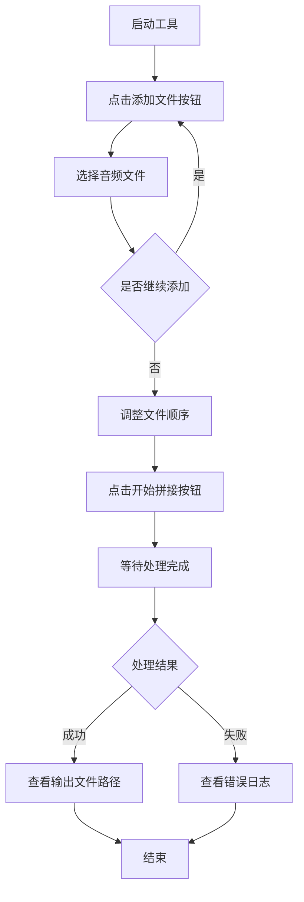

# AudioTool 用户使用说明

## 工具概述

AudioTool 是一款简洁高效的音频处理工具，专注于提供音频文件的拼接功能。该工具基于 FFmpeg 技术，能够快速、无损地将多个音频片段按指定顺序合并为一个完整的音频文件。

### 核心功能

- **音频拼接**：支持将多个音频文件按照指定顺序合并为单一文件
- **无损处理**：采用直接拷贝流的方式，保证音频质量不损失
- **批量操作**：支持同时添加多个音频文件进行拼接
- **实时反馈**：提供详细的操作日志和状态信息

### 支持的音频格式

- 主要支持：MP3 格式
- 其他格式：理论上支持 FFmpeg 可处理的所有音频格式

### 技术依赖

工具运行依赖于 FFmpeg 组件，该组件需要位于程序目录下的 `ffmpeg` 子文件夹中。

---

## 系统要求

### 运行环境

- 操作系统：Windows
- .NET Framework：需要安装相应版本的 .NET Framework 运行时
- 磁盘空间：足够存储合并后的音频文件

### 必要组件

- **FFmpeg**：必须在程序所在目录下的 `ffmpeg` 文件夹中包含 `ffmpeg.exe` 可执行文件

---

## 界面布局

### 主窗口结构

主窗口采用选项卡式布局，当前版本包含以下功能模块：

#### 音频拼接选项卡

| 界面元素 | 说明 |
|---------|------|
| 添加文件按钮 | 用于选择并添加需要拼接的音频文件 |
| 文件列表区域 | 显示已添加的音频文件完整路径，每行一个文件 |
| 开始拼接按钮 | 启动音频拼接操作 |
| 日志输出区域 | 显示操作进度、结果和错误信息 |

### 状态栏

状态栏位于窗口底部，包含以下元素：

| 元素 | 功能 |
|------|------|
| 赞赏图标按钮 | 点击跳转至赞赏页面 |
| 使用说明链接 | 点击查看在线使用文档 |
| 问题反馈链接 | 点击提交问题反馈 |

---

## 功能详细说明

### 音频拼接功能

#### 功能描述

音频拼接功能允许用户将多个音频片段按照添加的顺序首尾连接成一个完整的音频文件。拼接过程采用流拷贝技术，不会重新编码音频，因此速度快且无质量损失。

#### 操作流程



#### 详细操作步骤

##### 步骤一：添加音频文件

1. 点击界面左上角的"添加文件"按钮
2. 在弹出的文件选择对话框中，选择需要拼接的音频文件
   - 可以使用 Ctrl 或 Shift 键进行多选
   - 默认过滤器为 MP3 文件，也可选择"所有文件"查看其他格式
3. 点击"打开"确认选择
4. 选中的文件路径将按顺序显示在文件列表区域，每行一个文件
5. 重复上述步骤可继续添加更多文件

##### 步骤二：调整文件顺序

- 文件列表区域为可编辑文本框
- 可以手动编辑文件路径的顺序
- 每行代表一个音频文件的完整路径
- 拼接时将严格按照列表中从上到下的顺序进行

##### 步骤三：执行拼接操作

1. 确认文件列表无误后，点击"开始拼接"按钮
2. 按钮将变为禁用状态，防止重复操作
3. 日志区域将显示操作进度信息
4. 拼接过程在后台异步执行，界面不会冻结

##### 步骤四：查看结果

拼接完成后，日志区域会显示以下信息之一：

**成功情况**：
- 提示"拼接成功！"
- 显示输出文件的完整路径

**失败情况**：
- 提示"拼接失败！"
- 显示详细的错误信息

#### 输出文件规则

| 属性 | 说明 |
|------|------|
| 文件位置 | 与第一个输入文件位于同一目录 |
| 文件命名 | 格式为 `merged-{GUID}.mp3`，其中 GUID 为唯一标识符 |
| 文件格式 | MP3 格式 |
| 编码方式 | 直接流拷贝，保持原始编码参数 |

#### 技术实现原理

音频拼接功能的实现流程如下：


核心要点：

- 使用 FFmpeg 的 concat demuxer 功能
- 创建 UTF-8（无BOM）编码的临时文本文件，列出所有待拼接文件
- 执行命令：`ffmpeg -f concat -safe 0 -i {concat文件} -c copy {输出文件}`
- 采用 `-c copy` 参数实现无损拷贝，避免重新编码

---

## 常见问题与解决方案

### 问题一：提示找不到 FFmpeg 程序

**现象描述**：
- 日志显示：错误：找不到FFmpeg程序 {路径}

**原因分析**：
- FFmpeg 组件未正确部署

**解决方案**：
1. 确认程序安装目录下存在 `ffmpeg` 文件夹
2. 确认该文件夹内包含 `ffmpeg.exe` 可执行文件
3. 检查文件是否被安全软件拦截或删除
4. 尝试重新下载或安装工具

### 问题二：拼接失败，显示错误信息

**现象描述**：
- 操作执行后提示"拼接失败！"
- 日志区域显示 FFmpeg 的错误输出

**可能原因**：
- 输入文件编码参数不一致（如采样率、比特率、声道数不同）
- 输入文件损坏或格式不受支持
- 输出目录没有写入权限
- 磁盘空间不足

**解决方案**：
1. 检查所有待拼接文件的音频参数是否一致
2. 尝试使用音频转换工具统一文件格式
3. 确保输出目录有足够的读写权限
4. 检查磁盘剩余空间是否充足
5. 查看详细错误信息，针对性解决

### 问题三：文件列表为空，无法拼接

**现象描述**：
- 点击"开始拼接"后，日志提示"未添加需要拼接的音频文件"

**原因分析**：
- 文件列表区域内容为空或仅包含空行

**解决方案**：
- 使用"添加文件"按钮重新添加音频文件
- 检查文件列表区域是否被误清空
- 确保每个文件路径单独占一行

### 问题四：拼接后音频播放异常

**现象描述**：
- 拼接成功但播放时出现杂音、断断续续或无法播放

**可能原因**：
- 源文件编码参数差异过大
- 源文件本身存在问题
- 播放器兼容性问题

**解决方案**：
1. 使用专业音频工具检查源文件质量
2. 尝试使用其他播放器播放输出文件
3. 将所有源文件转换为统一的编码参数后再拼接
4. 考虑使用重新编码模式（需修改工具参数）

### 问题五：界面无响应

**现象描述**：
- 点击按钮后界面长时间无反应

**原因分析**：
- 虽然拼接操作在后台线程执行，但某些情况下可能导致界面刷新延迟

**解决方案**：
- 耐心等待操作完成
- 观察日志区域是否有新信息输出
- 如果长时间无响应，可通过任务管理器检查进程状态
- 必要时结束进程并重新启动工具

---

## 最佳实践建议

### 文件准备

1. **统一格式参数**：确保所有待拼接文件具有相同的采样率、比特率和声道数
2. **文件命名**：使用清晰的命名规则，便于在列表中识别和排序
3. **预先整理**：在添加前将文件按顺序重命名或分类存放

### 操作技巧

1. **顺序规划**：在添加文件前规划好拼接顺序，减少后期调整
2. **分批处理**：如果文件数量较多，可以考虑分批拼接，降低单次操作风险
3. **备份原文件**：在进行拼接操作前，建议备份原始音频文件

### 性能优化

1. **本地存储**：尽量使用本地硬盘上的文件，避免网络路径导致速度下降
2. **磁盘空间**：确保输出目录所在磁盘有足够空间（至少是所有输入文件大小之和）
3. **关闭干扰**：处理大文件时，关闭不必要的后台程序，提高系统资源可用性

### 质量保证

1. **测试拼接**：对于重要项目，先用少量文件测试拼接效果
2. **验证输出**：拼接完成后，播放完整文件检查是否符合预期
3. **保留日志**：如遇问题，保存日志信息以便排查

---

## 使用限制与注意事项

### 功能限制

| 限制项 | 说明 |
|--------|------|
| 文件格式一致性 | 拼接的文件应具有相同的编码参数，否则可能失败 |
| 输出格式固定 | 当前版本输出固定为 MP3 格式 |
| 无进度条 | 拼接过程无可视化进度，需通过日志判断状态 |
| 单任务执行 | 同一时间只能执行一个拼接任务 |

### 数据安全

- 工具不会修改或删除原始输入文件
- 输出文件名采用随机 GUID，避免覆盖现有文件
- 临时文件在操作完成后自动清理

### 法律与版权

- 用户应确保对拼接的音频文件拥有合法使用权
- 不得用于侵犯版权或其他违法用途
- 输出文件的版权归属遵循原始文件的授权条款

---

## 获取帮助

### 在线文档

点击状态栏的"使用说明"链接，访问在线文档获取最新的使用指南和更新信息。

### 问题反馈

如果遇到问题或有改进建议，可通过以下方式反馈：

- 点击状态栏的"问题反馈"链接提交反馈
- 详细描述问题现象、操作步骤和错误日志
- 提供截图或示例文件有助于快速定位问题

### 支持与赞赏

如果本工具对您有帮助，欢迎点击状态栏的红心图标进行赞赏，支持开发者持续改进和维护。

---

## 附录

### FFmpeg 命令参数说明

工具内部使用的 FFmpeg 命令结构：

| 参数 | 作用 |
|------|------|
| -f concat | 指定使用 concat demuxer |
| -safe 0 | 允许使用绝对路径 |
| -i {concat文件} | 指定输入的文件列表 |
| -c copy | 使用流拷贝模式，不重新编码 |
| {输出文件} | 指定输出文件路径 |

### Concat 文件格式示例

临时生成的 concat 文件内容格式：

```
file 'C:\path\to\audio1.mp3'
file 'C:\path\to\audio2.mp3'
file 'C:\path\to\audio3.mp3'
```

每行一个文件路径，使用单引号包裹，采用 UTF-8（无BOM）编码。

### 版本信息

工具版本号显示在主窗口标题栏中，格式为"音频工具 v{版本号}"。

### 快捷键

当前版本暂不支持快捷键操作，所有功能通过鼠标点击完成。
