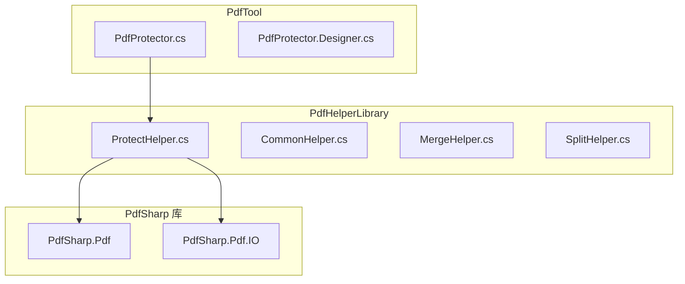
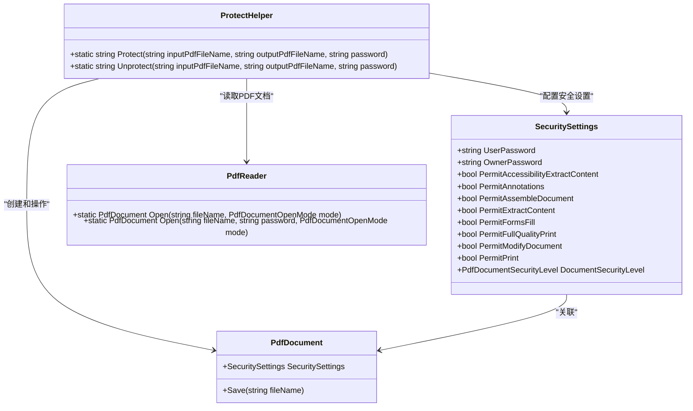
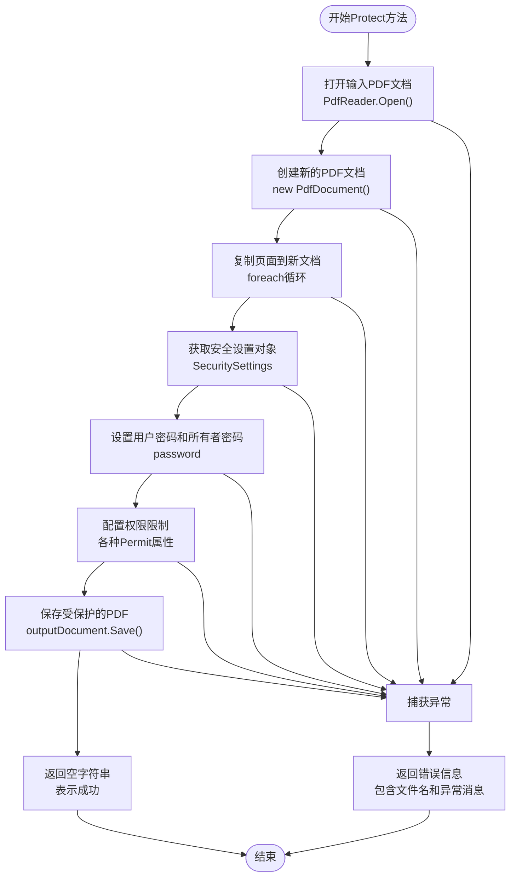
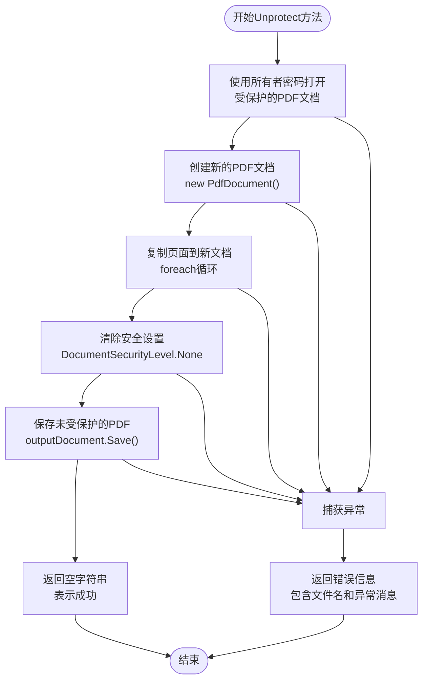
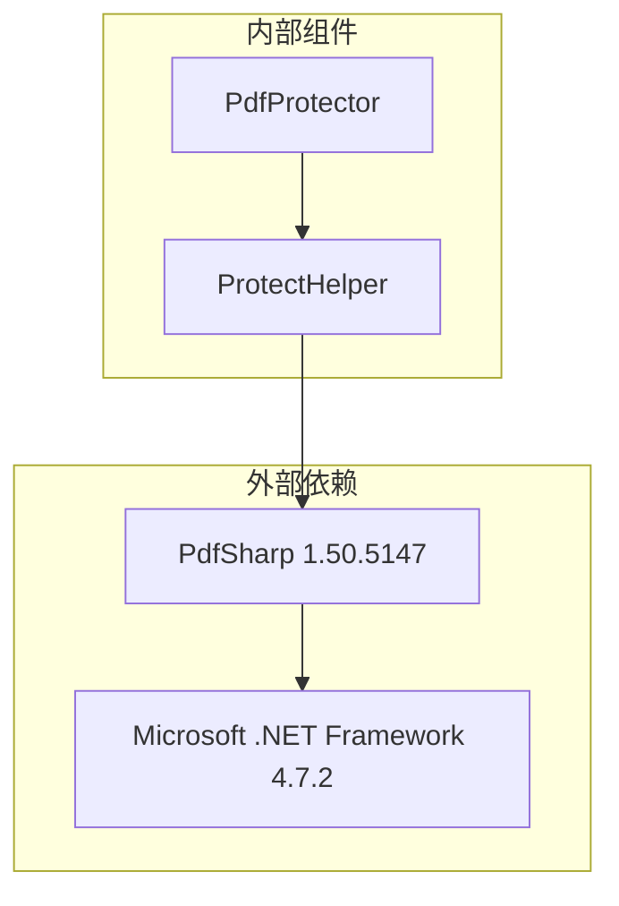

# PDF保护API

<cite>
**本文档中引用的文件**
- [ProtectHelper.cs](file://PdfHelperLibrary/ProtectHelper.cs)
- [PdfProtector.cs](file://PdfTool/PdfProtector.cs)
- [PdfProtector.Designer.cs](file://PdfTool/PdfProtector.Designer.cs)
- [PdfHelperLibrary.csproj](file://PdfHelperLibrary/PdfHelperLibrary.csproj)
</cite>

## 目录
1. [简介](#简介)
2. [项目结构](#项目结构)
3. [核心组件](#核心组件)
4. [架构概览](#架构概览)
5. [详细组件分析](#详细组件分析)
6. [依赖关系分析](#依赖关系分析)
7. [性能考虑](#性能考虑)
8. [故障排除指南](#故障排除指南)
9. [结论](#结论)

## 简介

ProtectHelper类是一个专门用于PDF文档保护和解除保护的静态工具类，基于PdfSharp库实现。该类提供了两个核心方法：`Protect`方法用于创建受密码保护的PDF文档，而`Unprotect`方法则用于移除现有PDF文档的安全设置。

该API设计简洁高效，通过统一的密码机制（用户密码和所有者密码相同）来简化使用流程，同时提供了细粒度的权限控制选项，允许开发者精确配置PDF文档的各种访问权限。

## 项目结构

ProtectHelper类位于PdfHelperLibrary项目中，作为PDF处理功能的核心组件之一。该项目采用标准的.NET类库结构，包含多个辅助工具类和处理器模块。



**图表来源**
- [ProtectHelper.cs](file://PdfHelperLibrary/ProtectHelper.cs#L1-L69)
- [PdfProtector.cs](file://PdfTool/PdfProtector.cs#L1-L171)

**章节来源**
- [ProtectHelper.cs](file://PdfHelperLibrary/ProtectHelper.cs#L1-L69)
- [PdfHelperLibrary.csproj](file://PdfHelperLibrary/PdfHelperLibrary.csproj#L1-L127)

## 核心组件

ProtectHelper类包含两个主要的静态方法，每个方法都针对不同的PDF保护需求进行了优化：

### Protect方法
负责创建新的受保护PDF文档，通过设置多种安全权限来限制文档的操作能力。

### Unprotect方法  
用于移除现有PDF文档的安全设置，生成完全开放的副本文档。

这两个方法都采用了异常处理机制，确保在遇到错误时能够提供清晰的错误信息。

**章节来源**
- [ProtectHelper.cs](file://PdfHelperLibrary/ProtectHelper.cs#L12-L66)

## 架构概览

ProtectHelper类采用简洁的静态方法设计模式，直接暴露核心功能供外部调用。整个架构围绕PdfSharp库构建，充分利用其提供的安全设置功能。



**图表来源**
- [ProtectHelper.cs](file://PdfHelperLibrary/ProtectHelper.cs#L12-L66)

## 详细组件分析

### Protect方法详细分析

Protect方法实现了完整的PDF加密流程，从文档读取到安全设置应用再到最终保存。

#### 方法流程图



**图表来源**
- [ProtectHelper.cs](file://PdfHelperLibrary/ProtectHelper.cs#L12-L42)

#### 权限限制配置

Protect方法设置了以下具体的权限限制：

| 权限名称 | 默认值 | 说明 |
|---------|--------|------|
| PermitAccessibilityExtractContent | false | 禁止无障碍内容提取 |
| PermitAnnotations | false | 禁止添加注释和评论 |
| PermitAssembleDocument | false | 禁止文档拼接和拆分 |
| PermitExtractContent | false | 禁止内容提取 |
| PermitFormsFill | true | 允许填写表单（默认开启） |
| PermitFullQualityPrint | false | 禁止高质量打印 |
| PermitModifyDocument | true | 允许修改文档（默认开启） |
| PermitPrint | false | 禁止打印 |

**章节来源**
- [ProtectHelper.cs](file://PdfHelperLibrary/ProtectHelper.cs#L23-L34)

### Unprotect方法详细分析

Unprotect方法实现了PDF文档安全设置的移除过程，通过使用所有者密码打开受保护文档，然后创建一个没有任何安全限制的新文档。

#### 方法流程图



**图表来源**
- [ProtectHelper.cs](file://PdfHelperLibrary/ProtectHelper.cs#L45-L66)

**章节来源**
- [ProtectHelper.cs](file://PdfHelperLibrary/ProtectHelper.cs#L45-L66)

### 密码机制分析

ProtectHelper类采用了简化的密码管理策略：

#### 密码设置策略
- **用户密码(UserPassword)**：设置为传入的密码参数
- **所有者密码(OwnerPassword)**：同样设置为传入的密码参数
- **统一密码机制**：用户密码和所有者密码使用相同的值，简化了用户的记忆负担

这种设计使得：
1. 用户只需要记住单一密码即可
2. 所有者权限和用户权限得到统一控制
3. 减少了密码管理的复杂性

**章节来源**
- [ProtectHelper.cs](file://PdfHelperLibrary/ProtectHelper.cs#L24-L25)

### 调用示例

#### Protect方法调用示例

```csharp
// 基本用法示例
string inputPdf = @"C:\Documents\original.pdf";
string outputPdf = @"C:\Documents\protected.pdf";
string password = "SecurePass123";

string result = PdfHelperLibrary.ProtectHelper.Protect(
    inputPdf, 
    outputPdf, 
    password
);

if (string.IsNullOrEmpty(result))
{
    Console.WriteLine("PDF保护成功完成");
}
else
{
    Console.WriteLine($"保护失败: {result}");
}
```

#### Unprotect方法调用示例

```csharp
// 基本用法示例
string inputPdf = @"C:\Documents\protected.pdf";
string outputPdf = @"C:\Documents\unprotected.pdf";
string password = "SecurePass123";

string result = PdfHelperLibrary.ProtectHelper.Unprotect(
    inputPdf, 
    outputPdf, 
    password
);

if (string.IsNullOrEmpty(result))
{
    Console.WriteLine("PDF解除保护成功完成");
}
else
{
    Console.WriteLine($"解除保护失败: {result}");
}
```

**章节来源**
- [PdfProtector.cs](file://PdfTool/PdfProtector.cs#L65-L67)
- [PdfProtector.cs](file://PdfTool/PdfProtector.cs#L99-L101)

## 依赖关系分析

ProtectHelper类依赖于PdfSharp库提供的PDF处理功能，具体依赖关系如下：



**图表来源**
- [PdfHelperLibrary.csproj](file://PdfHelperLibrary/PdfHelperLibrary.csproj#L43-L48)

### 关键依赖项

1. **PdfSharp.Pdf**：提供PDF文档对象模型
2. **PdfSharp.Pdf.IO**：提供PDF文档的读写功能
3. **System**：基础.NET框架支持

这些依赖确保了ProtectHelper类能够：
- 正确解析和创建PDF文档结构
- 实现PDF安全标准规范
- 提供跨平台的PDF处理能力

**章节来源**
- [ProtectHelper.cs](file://PdfHelperLibrary/ProtectHelper.cs#L1-L3)
- [PdfHelperLibrary.csproj](file://PdfHelperLibrary/PdfHelperLibrary.csproj#L43-L48)

## 性能考虑

### 内存使用优化
- **流式处理**：ProtectHelper采用逐页复制的方式，避免一次性加载整个大文档到内存
- **及时释放**：通过try-catch块确保异常情况下资源能够正确释放

### 处理速度优化
- **同步操作**：方法设计为同步执行，适合单个文档处理场景
- **最小化中间对象**：直接在内存中操作PDF对象，减少临时文件创建

### 大文件处理建议
对于大型PDF文档，建议：
1. 检查系统可用内存
2. 考虑分批处理策略
3. 监控处理时间，避免长时间阻塞UI线程

## 故障排除指南

### 常见问题及解决方案

#### 1. 密码验证失败
**症状**：Unprotect方法抛出异常
**原因**：提供的密码不正确或不是所有者密码
**解决方案**：确认使用正确的所有者密码

#### 2. 文件格式不支持
**症状**：打开PDF文件时出现格式错误
**原因**：PDF文件损坏或格式不受支持
**解决方案**：使用PDF修复工具检查文件完整性

#### 3. 权限冲突
**症状**：某些PDF阅读器无法正确应用权限限制
**原因**：不同阅读器对PDF安全标准的实现差异
**解决方案**：测试多种阅读器，选择兼容性最佳的方案

#### 4. 异常处理
ProtectHelper类提供了完善的异常处理机制，所有异常都会被捕获并返回包含详细信息的错误消息，便于调试和问题定位。

**章节来源**
- [ProtectHelper.cs](file://PdfHelperLibrary/ProtectHelper.cs#L41-L42)
- [ProtectHelper.cs](file://PdfHelperLibrary/ProtectHelper.cs#L64-L65)

### 注意事项

1. **权限执行一致性**：不同PDF阅读器对权限限制的执行可能存在差异，建议在目标环境中进行充分测试
2. **密码安全性**：虽然提供了统一密码机制，但用户仍应注意密码的安全性
3. **版本兼容性**：确保使用的PdfSharp版本与目标PDF标准兼容

## 结论

ProtectHelper类提供了一个简洁而强大的PDF保护解决方案，通过两个核心方法实现了完整的PDF安全生命周期管理。其设计特点包括：

### 主要优势
- **简单易用**：统一的密码机制降低了使用复杂度
- **功能完整**：提供了全面的权限控制选项
- **异常友好**：完善的错误处理机制
- **性能可靠**：优化的内存使用和处理流程

### 应用场景
- 文档安全保护
- 敏感信息隔离
- 版权保护
- 访问控制实施

该API为PDF文档的安全管理提供了坚实的基础，是构建更复杂PDF处理应用的理想起点。通过合理使用权限配置和密码策略，可以满足大多数PDF安全保护的需求。