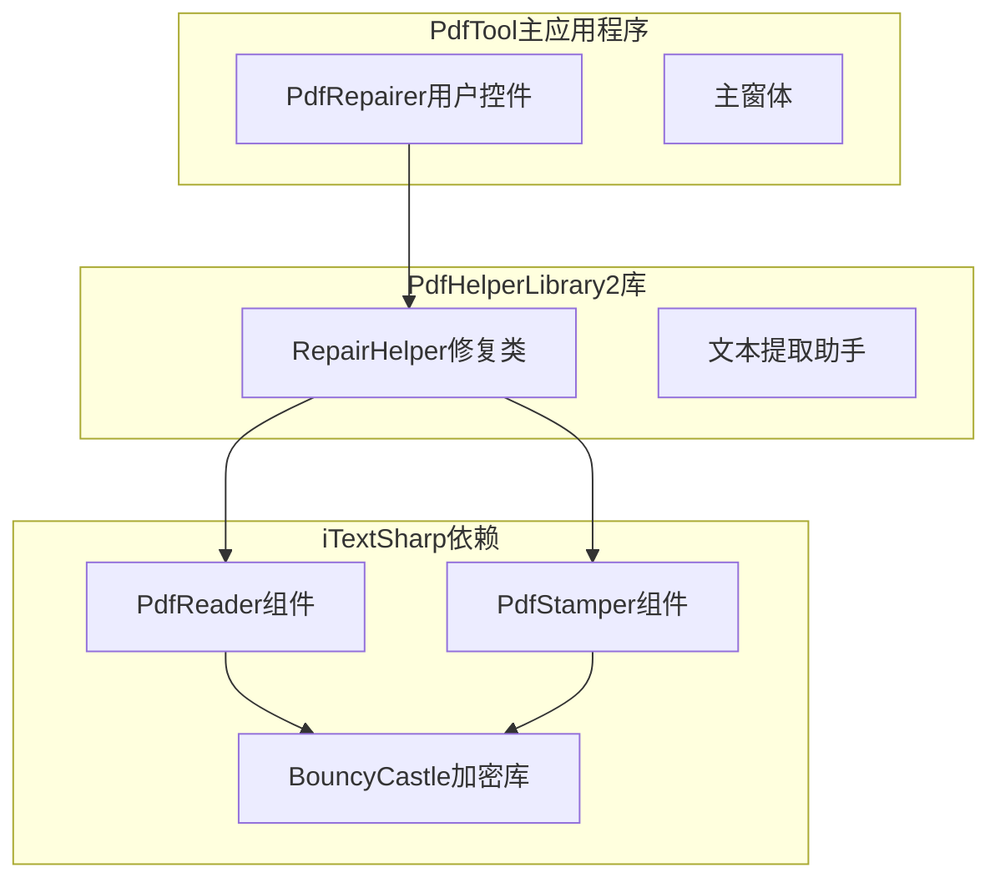
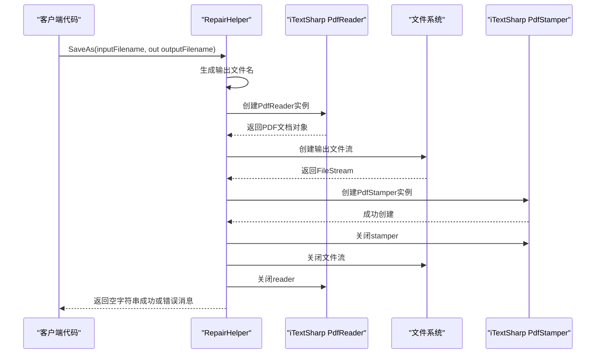
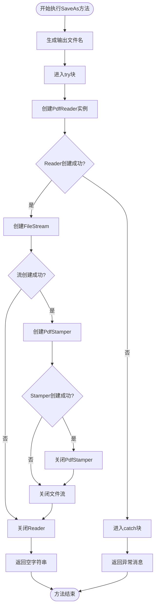
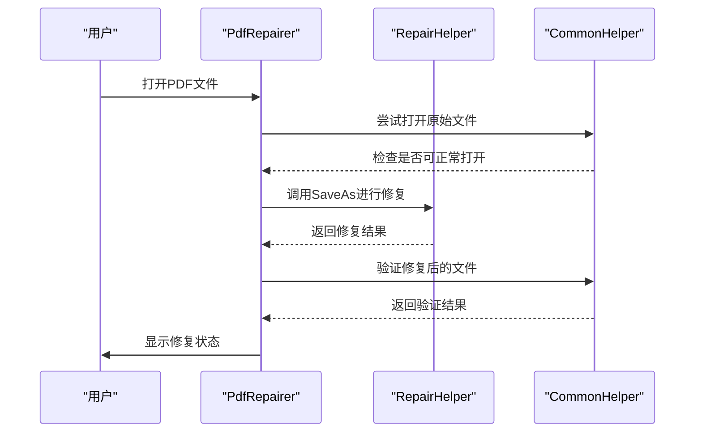
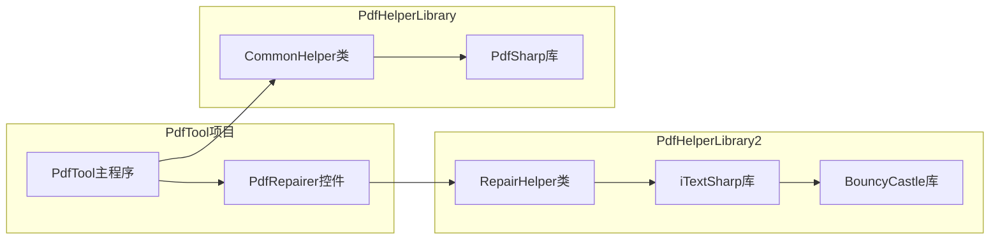

# PDF修复API文档

<cite>
**本文档中引用的文件**
- [RepairHelper.cs](file://PdfHelperLibrary2/RepairHelper.cs)
- [PdfRepairer.cs](file://PdfTool/PdfRepairer.cs)
- [PdfHelperLibrary2.csproj](file://PdfHelperLibrary2/PdfHelperLibrary2.csproj)
- [packages.config](file://PdfHelperLibrary2/packages.config)
- [CommonHelper.cs](file://PdfHelperLibrary/CommonHelper.cs)
</cite>

## 目录
1. [简介](#简介)
2. [项目结构](#项目结构)
3. [核心组件](#核心组件)
4. [架构概览](#架构概览)
5. [详细组件分析](#详细组件分析)
6. [依赖关系分析](#依赖关系分析)
7. [性能考虑](#性能考虑)
8. [故障排除指南](#故障排除指南)
9. [结论](#结论)

## 简介

RepairHelper类是PdfHelperLibrary2库中的一个专门用于修复损坏PDF文件的核心工具类。该类通过iTextSharp库提供的PdfReader和PdfStamper组件实现"另存为"操作，能够修复部分损坏的PDF文件结构，使其能够正常打开和使用。

该修复机制的工作原理是读取输入的损坏PDF文件，然后将其内容重新写入新的输出文件，从而清除潜在的损坏数据和结构问题。这种方法虽然简单，但对于许多常见的PDF损坏问题非常有效。

## 项目结构

PdfHelperLibrary2项目是一个独立的PDF处理库，专门负责PDF修复功能。该项目与其他PDF处理库（如PdfHelperLibrary）采用不同的技术栈，使用iTextSharp而非PdfSharp作为底层PDF处理引擎。



**图表来源**
- [PdfRepairer.cs](file://PdfTool/PdfRepairer.cs#L1-L111)
- [RepairHelper.cs](file://PdfHelperLibrary2/RepairHelper.cs#L1-L40)

**章节来源**
- [PdfHelperLibrary2.csproj](file://PdfHelperLibrary2/PdfHelperLibrary2.csproj#L1-L58)
- [packages.config](file://PdfHelperLibrary2/packages.config#L1-L5)

## 核心组件

RepairHelper类是整个PDF修复功能的核心，它提供了一个静态的SaveAs方法，该方法接受输入PDF文件路径并返回修复后的输出文件路径。

### 主要特性

- **简单易用**：提供单一的SaveAs方法进行PDF修复
- **自动命名**：自动生成包含时间戳的输出文件名
- **错误处理**：完善的异常捕获和错误消息返回
- **资源管理**：使用using语句确保资源正确释放

**章节来源**
- [RepairHelper.cs](file://PdfHelperLibrary2/RepairHelper.cs#L12-L36)

## 架构概览

RepairHelper类采用了经典的"读取-重建-写入"模式来修复PDF文件。这种架构设计简洁高效，能够处理大多数常见的PDF损坏问题。



**图表来源**
- [RepairHelper.cs](file://PdfHelperLibrary2/RepairHelper.cs#L12-L36)

## 详细组件分析

### SaveAs方法实现

SaveAs方法是RepairHelper类的核心功能，其实现逻辑清晰且易于理解：

#### 方法签名和参数
- **输入参数**：`string inputFilename` - 要修复的PDF文件路径
- **输出参数**：`out string outputFilename` - 修复后的PDF文件路径
- **返回值**：`string` - 错误消息（如果发生异常则返回非空字符串）

#### 输出文件名生成策略

输出文件名采用以下格式：
```
{原文件名}-repaired-{时间戳}.pdf
```

其中时间戳格式为：`yyyyMMddHHmmssfff`，确保文件名的唯一性。

#### 工作流程



**图表来源**
- [RepairHelper.cs](file://PdfHelperLibrary2/RepairHelper.cs#L12-L36)

#### 异常处理机制

RepairHelper类实现了完善的异常处理机制：

- **捕获所有异常**：使用通用的Exception类型捕获所有可能的错误
- **错误消息返回**：将异常消息作为字符串返回给调用者
- **资源安全释放**：使用using语句确保所有资源在异常情况下也能正确释放

**章节来源**
- [RepairHelper.cs](file://PdfHelperLibrary2/RepairHelper.cs#L12-L36)

### PdfTool集成使用

PdfTool主应用程序通过PdfRepairer用户控件集成了RepairHelper的功能：

#### 修复流程



**图表来源**
- [PdfRepairer.cs](file://PdfTool/PdfRepairer.cs#L32-L47)

**章节来源**
- [PdfRepairer.cs](file://PdfTool/PdfRepairer.cs#L32-L47)

## 依赖关系分析

RepairHelper类的依赖关系相对简单但关键：

### 外部依赖

| 依赖项 | 版本 | 用途 |
|--------|------|------|
| iTextSharp | 5.5.13.4 | PDF读取和写入核心功能 |
| BouncyCastle.Cryptography | 2.6.2 | 加密和数字签名支持 |

### 技术栈差异

值得注意的是，RepairHelper类使用iTextSharp库，而项目其他部分主要使用PdfSharp库。这种技术栈的选择导致了以下影响：

- **功能互补**：iTextSharp擅长处理复杂的PDF修复任务，而PdfSharp更适合常规的PDF操作
- **依赖管理**：需要单独管理iTextSharp相关的依赖包
- **性能差异**：两种库在处理大型PDF文件时的性能表现可能有所不同



**图表来源**
- [PdfHelperLibrary2.csproj](file://PdfHelperLibrary2/PdfHelperLibrary2.csproj#L33-L47)
- [CommonHelper.cs](file://PdfHelperLibrary/CommonHelper.cs#L1-L29)

**章节来源**
- [PdfHelperLibrary2.csproj](file://PdfHelperLibrary2/PdfHelperLibrary2.csproj#L33-L47)
- [packages.config](file://PdfHelperLibrary2/packages.config#L1-L5)

## 性能考虑

### 内存使用

- **流式处理**：iTextSharp采用流式处理方式，避免将整个PDF文件加载到内存
- **资源管理**：使用using语句确保及时释放不再需要的资源
- **临时文件**：修复过程中会创建临时输出文件，需要确保有足够的磁盘空间

### 处理速度

- **文件大小影响**：大文件的修复时间与文件大小成正比
- **复杂度因素**：包含大量嵌入对象或加密的PDF文件可能需要更长时间
- **I/O性能**：磁盘读写速度直接影响整体处理效率

### 最佳实践建议

1. **批量处理**：对于多个文件的修复，建议按批次处理以避免内存压力
2. **进度反馈**：在GUI应用中提供处理进度指示
3. **错误恢复**：实现重试机制处理临时性I/O错误

## 故障排除指南

### 常见问题及解决方案

#### 1. 修复失败
**症状**：SaveAs方法返回非空错误消息
**可能原因**：
- 输入文件严重损坏，无法解析
- 文件权限不足
- 磁盘空间不足

**解决方案**：
- 检查输入文件的完整性
- 确保有适当的文件访问权限
- 验证磁盘可用空间

#### 2. 修复后仍无法打开
**症状**：修复后的文件仍然无法正常打开
**可能原因**：
- PDF文件包含复杂的损坏结构
- 包含受保护的内容或加密
- 文件头信息严重损坏

**解决方案**：
- 尝试其他PDF修复工具
- 检查文件是否包含特殊内容
- 考虑手动修复或专业工具

#### 3. 依赖问题
**症状**：运行时出现找不到iTextSharp库的错误
**可能原因**：
- 缺少必要的NuGet包
- 版本不兼容
- 部署时缺少依赖DLL

**解决方案**：
- 确保安装了正确的iTextSharp版本
- 检查项目配置中的依赖设置
- 在部署包中包含所有必需的DLL

**章节来源**
- [RepairHelper.cs](file://PdfHelperLibrary2/RepairHelper.cs#L33-L36)
- [PdfRepairer.cs](file://PdfTool/PdfRepairer.cs#L40-L53)

## 结论

RepairHelper类提供了一个简单而有效的PDF修复解决方案。通过利用iTextSharp的强大功能，它能够处理大多数常见的PDF损坏问题。该类的设计遵循了良好的软件工程原则：

- **单一职责**：专注于PDF修复功能
- **简单接口**：提供直观的方法签名
- **完善异常处理**：确保错误情况下的稳定性
- **资源安全**：自动管理临时资源

虽然该方法对于某些复杂的PDF损坏问题可能效果有限，但它为PDFTool提供了重要的修复能力，特别是在处理轻微损坏的PDF文件时表现出色。开发者在使用时应注意其依赖iTextSharp库的特点，并根据具体需求选择合适的PDF处理方案。