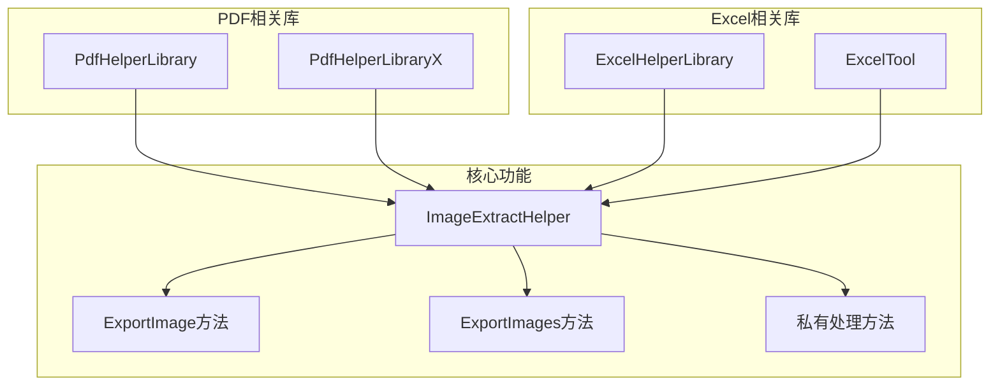
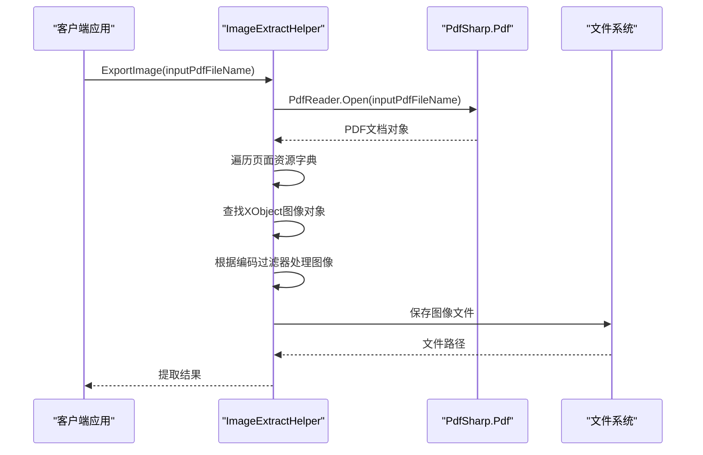
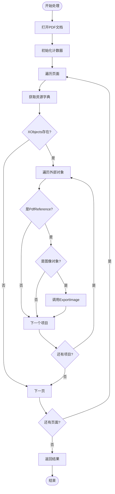
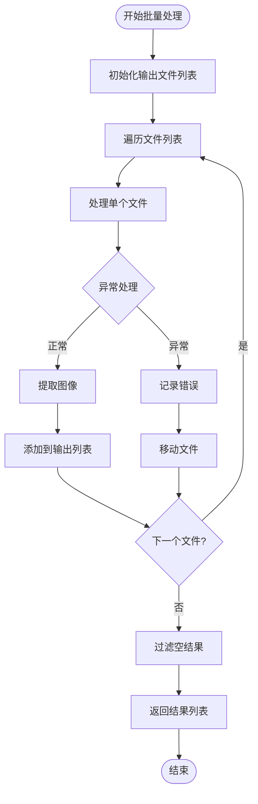
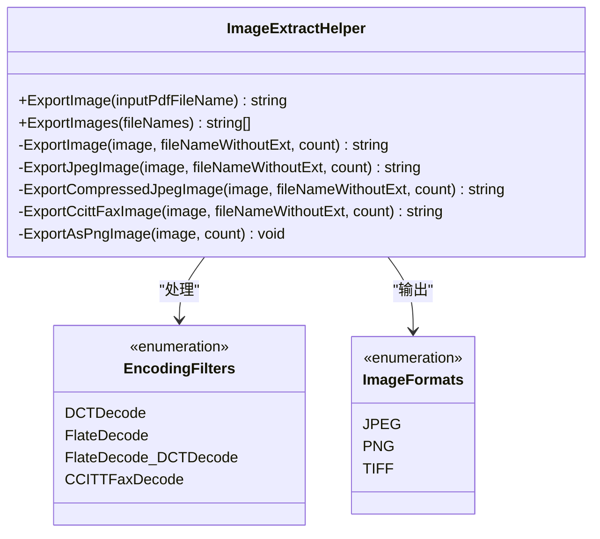
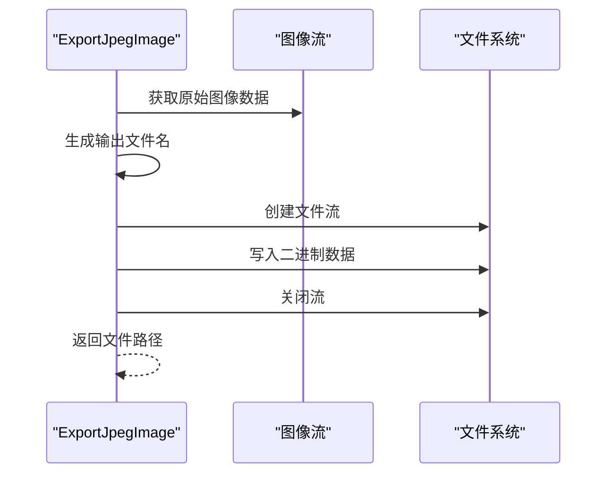
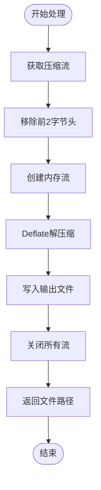
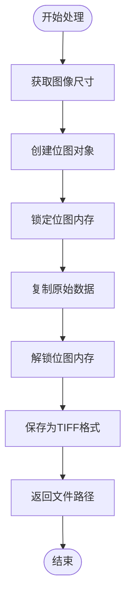
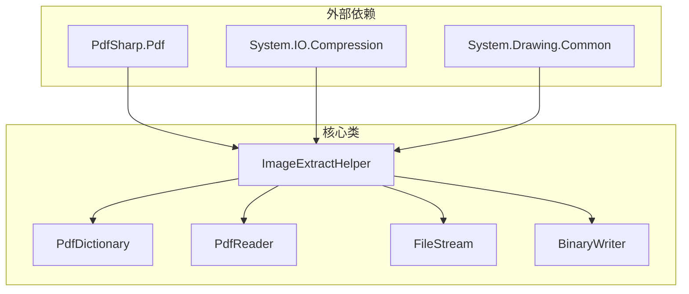

# ImageExtractHelper类全面API文档

<cite>
**本文档中引用的文件**
- [PdfHelperLibrary/ImageExtractHelper.cs](file://PdfHelperLibrary/ImageExtractHelper.cs)
- [PdfHelperLibraryX/ImageExtractHelper.cs](file://PdfHelperLibraryX/ImageExtractHelper.cs)
- [ExcelHelperLibrary/ImageExtractHelper.cs](file://ExcelHelperLibrary/ImageExtractHelper.cs)
- [ExcelTool/Helpers/ImageExtractHelper.cs](file://ExcelTool/Helpers/ImageExtractHelper.cs)
</cite>

## 目录
1. [简介](#简介)
2. [项目结构](#项目结构)
3. [核心组件](#核心组件)
4. [架构概览](#架构概览)
5. [详细组件分析](#详细组件分析)
6. [依赖关系分析](#依赖关系分析)
7. [性能考虑](#性能考虑)
8. [故障排除指南](#故障排除指南)
9. [结论](#结论)

## 简介

ImageExtractHelper类是一个专门用于从PDF和Excel文档中提取图像的工具类。该类提供了强大的图像提取功能，支持多种图像格式和编码方式，包括JPEG、PNG和TIFF格式。该类采用静态方法设计，便于在各种应用场景中直接调用。

## 项目结构

ImageExtractHelper类在PdfTool项目中有多个版本实现，分布在不同的库中：

**图表来源**
- [PdfHelperLibrary/ImageExtractHelper.cs](file://PdfHelperLibrary/ImageExtractHelper.cs#L1-L182)
- [PdfHelperLibraryX/ImageExtractHelper.cs](file://PdfHelperLibraryX/ImageExtractHelper.cs#L1-L152)

**章节来源**
- [PdfHelperLibrary/ImageExtractHelper.cs](file://PdfHelperLibrary/ImageExtractHelper.cs#L1-L182)
- [PdfHelperLibraryX/ImageExtractHelper.cs](file://PdfHelperLibraryX/ImageExtractHelper.cs#L1-L152)

## 核心组件

ImageExtractHelper类的核心功能围绕以下主要组件构建：

### 主要方法

1. **ExportImage方法** - 单个PDF文件图像提取
2. **ExportImages方法** - 批量PDF文件图像提取
3. **ExportJpegImage方法** - JPEG图像导出
4. **ExportCompressedJpegImage方法** - 压缩JPEG图像导出
5. **ExportCcittFaxImage方法** - CCITT Fax图像导出
6. **ExportAsPngImage方法** - PNG图像导出（待实现）

### 编码过滤器支持

该类支持多种PDF图像编码过滤器：
- `/DCTDecode` - JPEG编码
- `/FlateDecode` - 压缩编码
- `/FlateDecode /DCTDecode` - 压缩后JPEG编码
- `/CCITTFaxDecode` - CCITT传真编码

**章节来源**
- [PdfHelperLibrary/ImageExtractHelper.cs](file://PdfHelperLibrary/ImageExtractHelper.cs#L17-L46)
- [PdfHelperLibrary/ImageExtractHelper.cs](file://PdfHelperLibrary/ImageExtractHelper.cs#L48-L86)

## 架构概览

ImageExtractHelper类采用分层架构设计，从PDF文档解析到图像提取再到文件保存：

**图表来源**
- [PdfHelperLibrary/ImageExtractHelper.cs](file://PdfHelperLibrary/ImageExtractHelper.cs#L17-L46)

## 详细组件分析

### ExportImage方法分析

ExportImage方法是单个PDF文件图像提取的核心入口点：

**图表来源**
- [PdfHelperLibrary/ImageExtractHelper.cs](file://PdfHelperLibrary/ImageExtractHelper.cs#L17-L46)

**章节来源**
- [PdfHelperLibrary/ImageExtractHelper.cs](file://PdfHelperLibrary/ImageExtractHelper.cs#L17-L46)

### ExportImages批量处理方法

ExportImages方法提供了批量处理多个PDF文件的能力：

**图表来源**
- [PdfHelperLibrary/ImageExtractHelper.cs](file://PdfHelperLibrary/ImageExtractHelper.cs#L48-L86)

**章节来源**
- [PdfHelperLibrary/ImageExtractHelper.cs](file://PdfHelperLibrary/ImageExtractHelper.cs#L48-L86)

### 图像编码处理机制

ImageExtractHelper类根据不同编码过滤器采用相应的处理策略：

**图表来源**
- [PdfHelperLibrary/ImageExtractHelper.cs](file://PdfHelperLibrary/ImageExtractHelper.cs#L89-L104)

**章节来源**
- [PdfHelperLibrary/ImageExtractHelper.cs](file://PdfHelperLibrary/ImageExtractHelper.cs#L89-L104)

### JPEG图像处理

ExportJpegImage方法处理原生JPEG编码的图像：

**图表来源**
- [PdfHelperLibrary/ImageExtractHelper.cs](file://PdfHelperLibrary/ImageExtractHelper.cs#L107-L116)

**章节来源**
- [PdfHelperLibrary/ImageExtractHelper.cs](file://PdfHelperLibrary/ImageExtractHelper.cs#L107-L116)

### 压缩JPEG图像处理

ExportCompressedJpegImage方法处理经过Deflate压缩的JPEG图像：

**图表来源**
- [PdfHelperLibrary/ImageExtractHelper.cs](file://PdfHelperLibrary/ImageExtractHelper.cs#L134-L154)

**章节来源**
- [PdfHelperLibrary/ImageExtractHelper.cs](file://PdfHelperLibrary/ImageExtractHelper.cs#L134-L154)

### CCITT Fax图像处理

ExportCcittFaxImage方法处理CCITT Fax编码的图像，需要System.Drawing.Common依赖：

**图表来源**
- [PdfHelperLibrary/ImageExtractHelper.cs](file://PdfHelperLibrary/ImageExtractHelper.cs#L157-L177)

**章节来源**
- [PdfHelperLibrary/ImageExtractHelper.cs](file://PdfHelperLibrary/ImageExtractHelper.cs#L157-L177)

### PNG图像处理（待实现）

ExportAsPngImage方法目前处于TODO状态，计划实现PDF内部格式到PNG的转换：

| 特性 | 当前状态 | 实现计划 |
|------|----------|----------|
| 宽度获取 | ✅ 已实现 | 使用PdfImage.Keys.Width |
| 高度获取 | ✅ 已实现 | 使用PdfImage.Keys.Height |
| 位深度获取 | ✅ 已实现 | 使用PdfImage.Keys.BitsPerComponent |
| 格式转换 | ⚠️ 待实现 | 需要PDF内部格式到Windows位图的转换 |
| 文件保存 | ⚠️ 待实现 | 计划使用GDI+保存为PNG格式 |

**章节来源**
- [PdfHelperLibrary/ImageExtractHelper.cs](file://PdfHelperLibrary/ImageExtractHelper.cs#L119-L132)

## 依赖关系分析

ImageExtractHelper类的依赖关系展现了清晰的层次结构：

**图表来源**
- [PdfHelperLibrary/ImageExtractHelper.cs](file://PdfHelperLibrary/ImageExtractHelper.cs#L1-L9)

**章节来源**
- [PdfHelperLibrary/ImageExtractHelper.cs](file://PdfHelperLibrary/ImageExtractHelper.cs#L1-L9)

### 关键依赖说明

1. **PdfSharp.Pdf** - PDF文档解析和图像提取
2. **System.IO.Compression** - Deflate解压缩支持
3. **System.Drawing.Common** - CCITT Fax图像处理（可选）

## 性能考虑

### 内存管理

ImageExtractHelper类采用了适当的内存管理策略：

- 使用using语句确保资源及时释放
- 流操作采用BinaryWriter进行高效写入
- 对于大文件，建议使用ExportImages方法进行批量处理

### 并发处理

虽然当前实现是同步的，但ExportImages方法支持批量处理多个文件，可以在后台线程中运行以提高效率。

### 异常处理

类提供了完善的异常处理机制：
- 单个文件处理失败时继续处理其他文件
- 调试模式下的详细日志记录
- 文件移动到错误目录的备份机制

## 故障排除指南

### 常见问题及解决方案

| 问题类型 | 症状 | 解决方案 |
|----------|------|----------|
| CCITT Fax依赖缺失 | System.Drawing.Common相关错误 | 安装System.Drawing.Common NuGet包 |
| 权限不足 | 文件写入失败 | 检查目标目录写入权限 |
| PDF损坏 | 解析异常 | 验证PDF文件完整性 |
| 内存不足 | 大文件处理失败 | 分批处理或增加可用内存 |

### 调试技巧

1. **启用调试模式** - 在DEBUG编译配置下查看详细日志
2. **检查文件路径** - 确保输入文件路径正确
3. **监控临时文件** - 查看中间处理文件的状态
4. **异常信息分析** - 仔细阅读异常堆栈跟踪

**章节来源**
- [PdfHelperLibrary/ImageExtractHelper.cs](file://PdfHelperLibrary/ImageExtractHelper.cs#L74-L84)

## 结论

ImageExtractHelper类是一个功能强大且设计良好的图像提取工具，具有以下优势：

1. **多格式支持** - 支持JPEG、PNG和TIFF等多种图像格式
2. **编码兼容性** - 处理PDF中的各种图像编码方式
3. **批量处理能力** - 高效处理多个PDF文件
4. **健壮的异常处理** - 确保单个文件错误不影响整体处理
5. **清晰的架构设计** - 模块化的设计便于维护和扩展

需要注意的是，PNG图像导出功能仍处于开发阶段，而CCITT Fax图像处理需要额外的System.Drawing.Common依赖。这些特性在未来版本中有望得到完善。

该类为PDF文档处理提供了可靠的图像提取解决方案，特别适合需要批量处理PDF图像的应用场景。