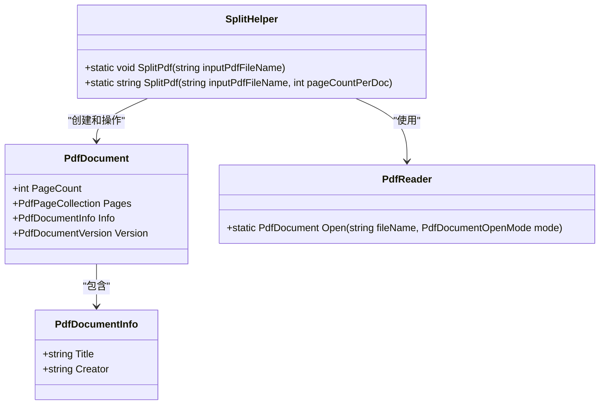
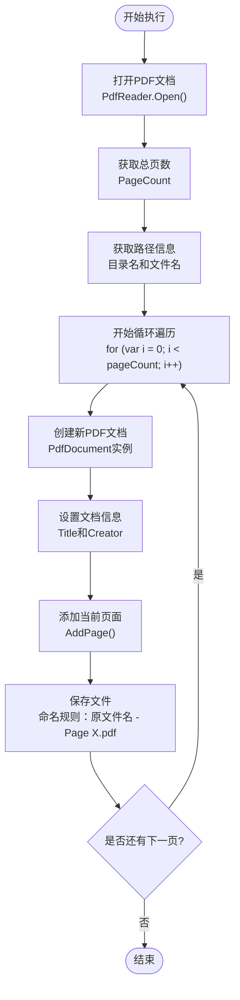
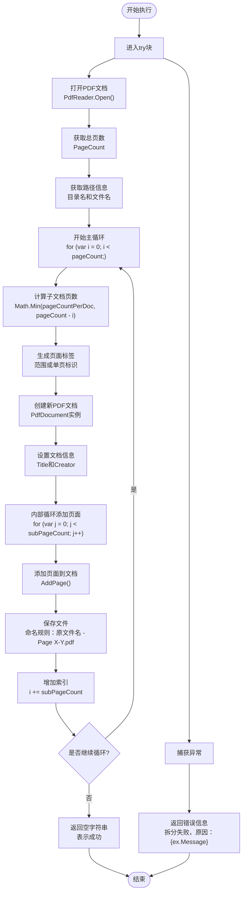
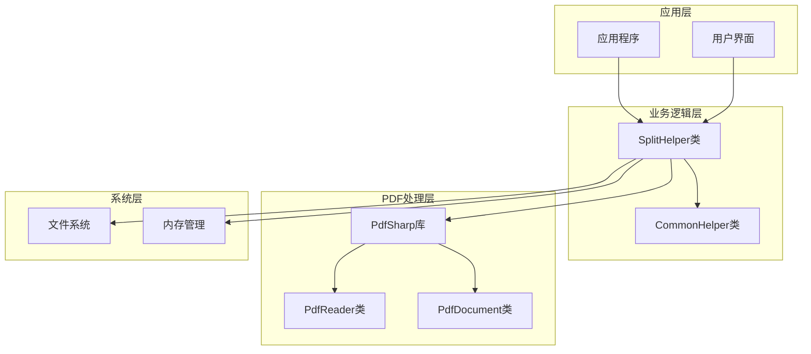
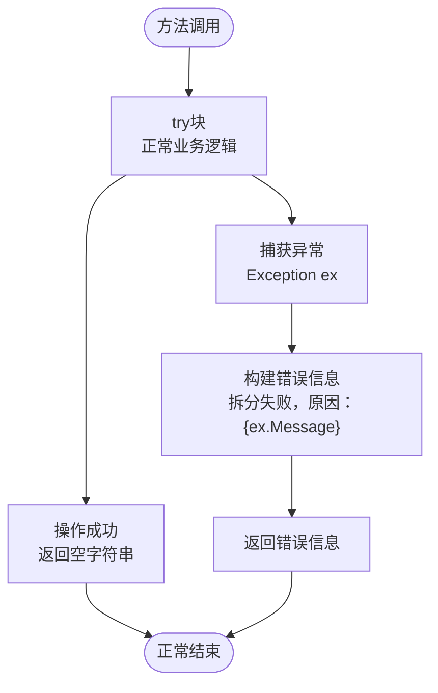

# SplitHelper类拆分功能API文档

<cite>
**本文档中引用的文件**
- [SplitHelper.cs](file://PdfHelperLibrary/SplitHelper.cs)
- [SplitHelper.cs](file://PdfHelperLibraryX/SplitHelper.cs)
- [PdfSplitter.cs](file://PdfTool/PdfSplitter.cs)
- [MainForm.cs](file://PdfSplitter/MainForm.cs)
- [TableHelper.cs](file://PdfHelperLibrary3/TableHelper.cs)
- [TableHelper.cs](file://PdfHelperLibraryX3/TableHelper.cs)
</cite>

## 目录
1. [简介](#简介)
2. [类概述](#类概述)
3. [核心方法详解](#核心方法详解)
4. [技术架构](#技术架构)
5. [使用示例](#使用示例)
6. [性能特性](#性能特性)
7. [异常处理](#异常处理)
8. [最佳实践](#最佳实践)
9. [总结](#总结)

## 简介

SplitHelper类是PdfHelperLibrary中的核心拆分工具类，专门用于处理PDF文档的拆分操作。该类提供了两个静态方法，分别支持按单页拆分和按指定页数批量拆分两种不同的拆分策略，为PDF文档处理提供了灵活而高效的解决方案。

## 类概述



**图表来源**
- [SplitHelper.cs](file://PdfHelperLibrary/SplitHelper.cs#L11-L68)
- [SplitHelper.cs](file://PdfHelperLibraryX/SplitHelper.cs#L9-L67)

**节来源**
- [SplitHelper.cs](file://PdfHelperLibrary/SplitHelper.cs#L1-L70)
- [SplitHelper.cs](file://PdfHelperLibraryX/SplitHelper.cs#L1-L68)

## 核心方法详解

### 方法一：按单页拆分 - SplitPdf(string inputPdfFileName)

#### 方法签名
```csharp
public static void SplitPdf(string inputPdfFileName)
```

#### 功能描述
该方法将输入的PDF文档按单页拆分为多个独立的PDF文件，每个页面生成一个单独的PDF文件。

#### 实现逻辑流程图



**图表来源**
- [SplitHelper.cs](file://PdfHelperLibrary/SplitHelper.cs#L13-L29)
- [SplitHelper.cs](file://PdfHelperLibraryX/SplitHelper.cs#L11-L28)

#### 输入参数处理
- **inputPdfFileName**: 要拆分的PDF文件完整路径
- **路径解析**: 自动提取文件所在目录和文件名前缀
- **文件名格式**: 基于原文件名生成新的文件名

#### 输出文件命名规则
- **单页模式**: `{原文件名} - Page {页码}.pdf`
- **示例**: `document.pdf` 拆分为 `document - Page 1.pdf`, `document - Page 2.pdf` 等

#### 内存使用特征
- **内存效率**: 每次只加载当前页面，内存占用相对较小
- **临时对象**: 每个输出文档都是独立的PdfDocument实例
- **垃圾回收**: 方法执行完毕后，所有临时对象可被GC回收

**节来源**
- [SplitHelper.cs](file://PdfHelperLibrary/SplitHelper.cs#L13-L29)
- [SplitHelper.cs](file://PdfHelperLibraryX/SplitHelper.cs#L11-L28)

### 方法二：按页数拆分 - SplitPdf(string inputPdfFileName, int pageCountPerDoc)

#### 方法签名
```csharp
public static string SplitPdf(string inputPdfFileName, int pageCountPerDoc)
```

#### 功能描述
该方法支持按指定页数批量拆分PDF文档，可以将多页合并为一个文档，提供更灵活的拆分策略。

#### 分组算法流程图



**图表来源**
- [SplitHelper.cs](file://PdfHelperLibrary/SplitHelper.cs#L37-L66)
- [SplitHelper.cs](file://PdfHelperLibraryX/SplitHelper.cs#L37-L64)

#### 分组算法详解

##### 子文档页数计算
- **公式**: `subPageCount = Math.Min(pageCountPerDoc, pageCount - i)`
- **目的**: 确保最后一组不会超过剩余页数
- **边界处理**: 最后一组可能少于指定页数

##### 页面标签生成逻辑
- **单页情况**: `"{i + 1}"` → "1"
- **多页情况**: `"{i + 1} - {i + subPageCount}"` → "1 - 3"
- **动态适配**: 根据实际页数自动调整显示格式

##### 循环控制机制
- **外层循环**: 控制拆分进度，每次递增实际添加的页数
- **内层循环**: 将指定数量的页面添加到当前子文档
- **索引管理**: 使用 `i += subPageCount` 更新主索引

#### 返回值设计
- **成功**: 返回空字符串 `""`
- **失败**: 返回包含错误信息的字符串 `"拆分失败，原因：{ex.Message}"`
- **设计意图**: 统一异常处理接口，便于调用方判断操作结果

**节来源**
- [SplitHelper.cs](file://PdfHelperLibrary/SplitHelper.cs#L37-L66)
- [SplitHelper.cs](file://PdfHelperLibraryX/SplitHelper.cs#L37-L64)

## 技术架构

### 依赖关系图



**图表来源**
- [SplitHelper.cs](file://PdfHelperLibrary/SplitHelper.cs#L1-L5)
- [PdfSplitter.cs](file://PdfTool/PdfSplitter.cs#L1-L10)

### 核心依赖组件

#### PdfSharp库集成
- **命名空间**: `PdfSharp.Pdf`, `PdfSharp.Pdf.IO`
- **主要类型**: `PdfReader`, `PdfDocument`, `PdfDocumentOpenMode`
- **功能模块**: PDF文档读取、解析、写入

#### 文件系统交互
- **路径处理**: `System.IO.Path` 提供路径解析功能
- **文件操作**: 直接文件写入，不涉及流式处理
- **命名规范**: 遵循Windows文件命名规则

**节来源**
- [SplitHelper.cs](file://PdfHelperLibrary/SplitHelper.cs#L1-L5)
- [SplitHelper.cs](file://PdfHelperLibraryX/SplitHelper.cs#L1-L3)

## 使用示例

### C#调用示例

#### 示例1：按单页拆分
```csharp
// 引用命名空间
using PdfHelperLibrary;

// 单页拆分示例
string inputPdf = @"C:\Documents\report.pdf";

// 调用方法
SplitHelper.SplitPdf(inputPdf);

// 结果文件:
// report - Page 1.pdf
// report - Page 2.pdf
// report - Page 3.pdf
// ...
```

#### 示例2：按页数拆分
```csharp
// 引用命名空间
using PdfHelperLibrary;

// 按页数拆分示例
string inputPdf = @"C:\Documents\large_document.pdf";
int pagesPerDoc = 5;

// 调用方法
string result = SplitHelper.SplitPdf(inputPdf, pagesPerDoc);

// 检查结果
if (string.IsNullOrEmpty(result))
{
    Console.WriteLine("拆分成功！");
}
else
{
    Console.WriteLine($"拆分失败: {result}");
}

// 结果文件:
// large_document - Page 1.pdf
// large_document - Page 2-5.pdf
// large_document - Page 6-10.pdf
// ...
```

#### 示例3：批量处理多个文件
```csharp
// 批量处理示例
List<string> pdfFiles = new List<string>
{
    @"C:\Documents\doc1.pdf",
    @"C:\Documents\doc2.pdf",
    @"C:\Documents\doc3.pdf"
};

int pagesPerDoc = 3;

foreach (var file in pdfFiles)
{
    string result = SplitHelper.SplitPdf(file, pagesPerDoc);
    if (string.IsNullOrEmpty(result))
    {
        Console.WriteLine($"{file} 拆分完成");
    }
    else
    {
        Console.WriteLine($"{file} 拆分失败: {result}");
    }
}
```

### 用户界面集成示例

#### WinForms集成
基于PdfSplitter项目的实际实现：

```csharp
// MainForm.cs中的事件处理
private void BtnSplit_Click(object sender, EventArgs e)
{
    if (_inputPdfFileList.Count == 0)
    {
        _txtLog.AppendText("未添加需要拆分的PDF文件\r\n");
        return;
    }
    
    foreach (var fileName in _inputPdfFileList)
    {
        // 调用SplitHelper方法
        var result = PdfHelperLibrary.SplitHelper.SplitPdf(
            fileName, 
            (int)_numPagePerDoc.Value
        );
        
        // 处理结果
        if (string.IsNullOrWhiteSpace(result)) 
            _txtLog.AppendText($"{fileName} 拆分完成\r\n");
        else 
            _txtLog.AppendText($"{fileName} {result}\r\n");
    }
    
    _txtLog.AppendText("拆分完成\r\n");
}
```

**节来源**
- [PdfSplitter.cs](file://PdfTool/PdfSplitter.cs#L54-L66)
- [MainForm.cs](file://PdfSplitter/MainForm.cs#L48-L59)

## 性能特性

### 线程安全性分析

#### 当前线程安全状态
- **静态方法**: SplitHelper类的所有方法都是静态的
- **无共享状态**: 方法不依赖任何类级别的成员变量
- **局部变量**: 所有操作都在方法内部的局部变量上进行
- **结论**: 该类在当前实现下是线程安全的

#### 并发处理建议
- **独立调用**: 可以同时在多个线程中调用不同文件的拆分
- **文件冲突**: 同一线程多次处理同一文件可能导致问题
- **资源竞争**: 大量并发操作可能影响磁盘I/O性能

### 内存使用特征

#### 内存消耗模式

```mermaid
graph LR
subgraph "内存使用阶段"
A[初始化阶段<br/>加载PDF文档] --> B[处理阶段<br/>创建子文档]
B --> C[保存阶段<br/>写入文件]
C --> D[清理阶段<br/>垃圾回收]
end
subgraph "内存峰值"
E[单页模式]: "每个页面 ~ 1-5MB"
F[多页模式]: "每个子文档 ~ 5-20MB"
G[大文件处理]: "与PDF大小成正比"
end
A -.-> E
B -.-> F
C -.-> G
```

#### 性能优化策略

##### 单页拆分优化
- **内存效率**: 每次只处理单页，内存占用最小
- **适用场景**: 小文件、需要精确控制的场景
- **限制**: 会产生大量小文件

##### 多页拆分优化
- **批处理**: 减少文件创建次数
- **内存平衡**: 在内存使用和文件数量间取得平衡
- **推荐配置**: 通常设置为3-10页/文档

### 大文件处理能力

#### 处理能力评估
- **内存限制**: 主要受可用内存和PDF复杂度影响
- **文件大小**: 支持GB级别的大型PDF文件
- **页数限制**: 理论上支持百万级页数的文档
- **性能衰减**: 随着文件大小增加，处理时间呈线性增长

#### 大文件处理建议
- **分段处理**: 对超大文件考虑分段拆分
- **内存监控**: 监控内存使用情况，避免OOM异常
- **临时文件**: 考虑使用临时文件存储中间结果

## 异常处理

### 异常处理机制

#### 异常捕获策略


**图表来源**
- [SplitHelper.cs](file://PdfHelperLibrary/SplitHelper.cs#L63-L66)
- [SplitHelper.cs](file://PdfHelperLibraryX/SplitHelper.cs#L61-L64)

#### 常见异常类型

##### 文件相关异常
- **FileNotFoundException**: 输入文件不存在
- **UnauthorizedAccessException**: 文件访问权限不足
- **DirectoryNotFoundException**: 输出目录不存在

##### PDF解析异常
- **PdfReaderException**: PDF文件格式损坏
- **PdfDocumentException**: 文档结构异常
- **OutOfMemoryException**: 内存不足

##### 系统资源异常
- **IOException**: 磁盘空间不足
- **TimeoutException**: 文件操作超时

#### 错误信息设计意图
- **统一接口**: 所有异常都转换为字符串返回
- **友好提示**: 包含具体的错误原因
- **便于调试**: 保留原始异常信息
- **调用方友好**: 不暴露底层异常细节

**节来源**
- [SplitHelper.cs](file://PdfHelperLibrary/SplitHelper.cs#L63-L66)
- [SplitHelper.cs](file://PdfHelperLibraryX/SplitHelper.cs#L61-L64)

## 最佳实践

### 使用建议

#### 选择合适的拆分策略
- **单页拆分**: 适用于需要精确控制每个页面的场景
- **多页拆分**: 适用于批量处理和减少文件数量的场景
- **混合使用**: 根据具体需求组合使用两种策略

#### 性能优化建议
- **批量处理**: 尽量一次性处理多个文件
- **内存管理**: 大文件处理时注意监控内存使用
- **并发控制**: 避免过多并发操作导致系统资源耗尽

#### 错误处理最佳实践
```csharp
// 推荐的错误处理模式
public void SafeSplitPdf(string inputFile, int pagesPerDoc)
{
    try
    {
        string result = SplitHelper.SplitPdf(inputFile, pagesPerDoc);
        
        if (string.IsNullOrEmpty(result))
        {
            // 成功处理
            LogSuccess(inputFile);
        }
        else
        {
            // 处理失败
            LogError(inputFile, result);
        }
    }
    catch (Exception ex)
    {
        // 记录意外异常
        LogUnexpectedError(ex);
    }
}
```

### 兼容性考虑

#### .NET版本兼容性
- **最低要求**: .NET Framework 4.0+
- **跨平台**: 支持Windows、Linux、macOS
- **依赖库**: PdfSharp库的版本兼容性

#### PDF格式兼容性
- **标准PDF**: 完全支持PDF 1.4+标准
- **加密文档**: 不支持密码保护的PDF
- **特殊字体**: 可能存在字体嵌入问题

## 总结

SplitHelper类作为PdfHelperLibrary的核心组件，提供了强大而灵活的PDF拆分功能。通过两个精心设计的静态方法，它能够满足从简单单页拆分到复杂批量处理的各种需求。

### 主要优势
- **简洁API**: 两个方法覆盖了主要的拆分场景
- **线程安全**: 静态设计确保多线程环境下的安全性
- **异常友好**: 统一的错误处理接口，便于集成
- **性能可控**: 支持不同粒度的拆分策略

### 应用价值
- **开发效率**: 提供现成的PDF处理解决方案
- **维护成本**: 稳定可靠的实现减少了维护工作
- **扩展性**: 良好的架构设计便于功能扩展

### 发展方向
随着PDF处理需求的不断演进，SplitHelper类可以在以下方面进一步完善：
- **异步支持**: 添加async/await支持
- **流式处理**: 支持Stream类型的输入输出
- **进度回调**: 提供处理进度通知机制
- **配置选项**: 增加更多的拆分参数配置

通过深入理解SplitHelper类的设计理念和实现细节，开发者可以更好地利用这一工具来构建高效、稳定的PDF处理应用程序。