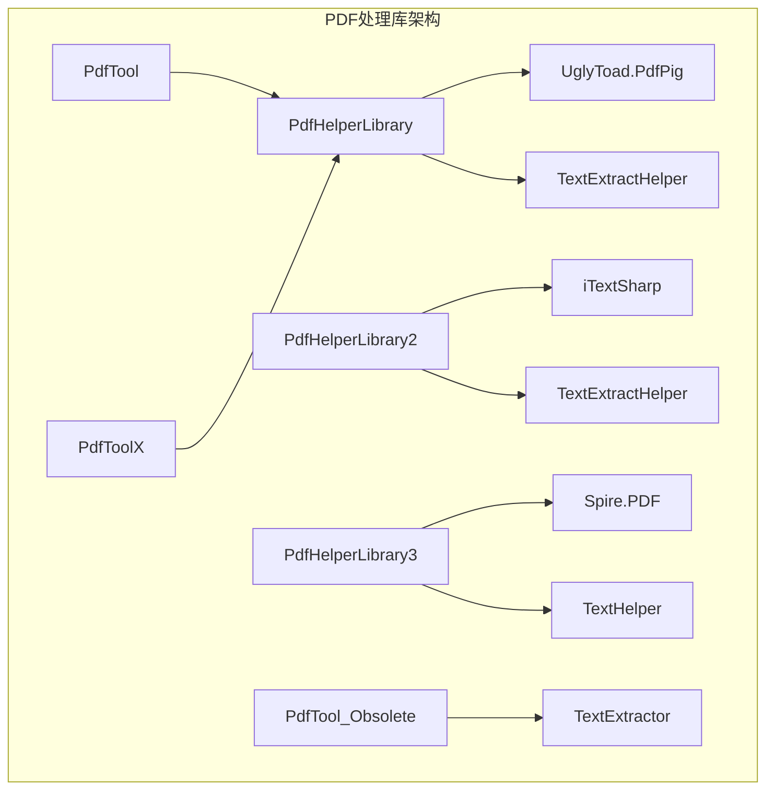
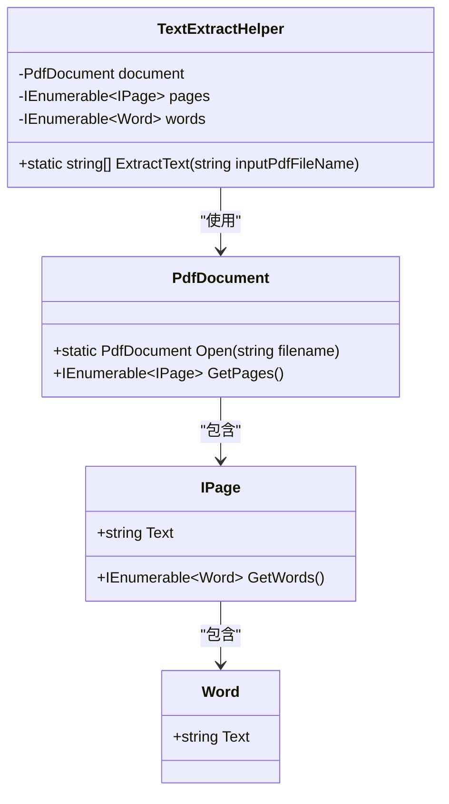
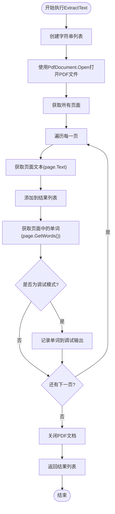
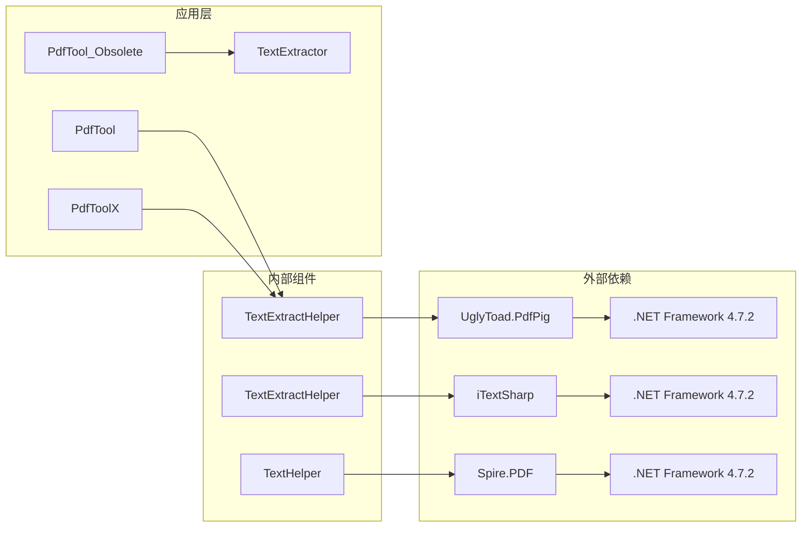

# 文本提取API文档

<cite>
**本文档中引用的文件**
- [TextExtractHelper.cs](file://PdfHelperLibrary/TextExtractHelper.cs)
- [TextExtractHelper.cs](file://PdfHelperLibrary2/TextExtractHelper.cs)
- [TextExtractHelper.cs](file://PdfHelperLibraryX/TextExtractHelper.cs)
- [TextHelper.cs](file://PdfHelperLibrary3/TextHelper.cs)
- [PdfTextExtracter.cs](file://PdfTool/PdfTextExtracter.cs)
- [PdfTextExtracter.axaml.cs](file://PdfToolX/PdfTextExtracter.axaml.cs)
- [PdfHelperLibrary.csproj](file://PdfHelperLibrary/PdfHelperLibrary.csproj)
- [PdfHelperLibrary2.csproj](file://PdfHelperLibrary2/PdfHelperLibrary2.csproj)
- [PdfHelperLibrary3.csproj](file://PdfHelperLibrary3/PdfHelperLibrary3.csproj)
</cite>

## 目录
1. [简介](#简介)
2. [项目结构](#项目结构)
3. [核心组件](#核心组件)
4. [架构概览](#架构概览)
5. [详细组件分析](#详细组件分析)
6. [依赖关系分析](#依赖关系分析)
7. [性能考虑](#性能考虑)
8. [故障排除指南](#故障排除指南)
9. [结论](#结论)

## 简介

TextExtractHelper类是一个专门用于从PDF文档中提取纯文本内容的工具类。该类使用UglyToad.PdfPig库作为底层PDF解析引擎，提供了简单易用的静态方法来提取PDF中的文本内容。该类设计简洁，专注于单一职责，即从PDF文档中提取纯文本，不保留原有的格式和布局信息。

## 项目结构

该项目包含多个版本的PDF处理库，每个库都提供了不同的PDF处理功能：



**图表来源**
- [PdfHelperLibrary.csproj](file://PdfHelperLibrary/PdfHelperLibrary.csproj#L74-L94)
- [PdfHelperLibrary2.csproj](file://PdfHelperLibrary2/PdfHelperLibrary2.csproj#L37-L42)
- [PdfHelperLibrary3.csproj](file://PdfHelperLibrary3/PdfHelperLibrary3.csproj#L40-L42)

**章节来源**
- [PdfHelperLibrary.csproj](file://PdfHelperLibrary/PdfHelperLibrary.csproj#L1-L127)
- [PdfHelperLibrary2.csproj](file://PdfHelperLibrary2/PdfHelperLibrary2.csproj#L1-L58)
- [PdfHelperLibrary3.csproj](file://PdfHelperLibrary3/PdfHelperLibrary3.csproj#L1-L62)

## 核心组件

### TextExtractHelper类概述

TextExtractHelper类是PDF文本提取的核心组件，提供了以下关键特性：

- **简单接口**：提供单个静态方法`ExtractText`，接受PDF文件路径作为输入
- **页面级提取**：按页面顺序提取文本，返回每个页面的文本内容
- **纯文本输出**：提取的文本不包含任何格式或布局信息
- **内存安全**：使用`using`语句确保PDF文档资源正确释放

### 主要方法

| 方法名 | 参数 | 返回值 | 描述 |
|--------|------|--------|------|
| ExtractText | string inputPdfFileName | List<string> | 从指定PDF文件提取所有页面的文本内容 |

**章节来源**
- [TextExtractHelper.cs](file://PdfHelperLibrary/TextExtractHelper.cs#L11-L31)
- [TextExtractHelper.cs](file://PdfHelperLibraryX/TextExtractHelper.cs#L10-L30)

## 架构概览

TextExtractHelper类采用简洁的设计模式，遵循单一职责原则：



**图表来源**
- [TextExtractHelper.cs](file://PdfHelperLibrary/TextExtractHelper.cs#L11-L31)
- [TextExtractHelper.cs](file://PdfHelperLibraryX/TextExtractHelper.cs#L10-L30)

## 详细组件分析

### ExtractText方法实现

ExtractText方法是TextExtractHelper类的核心功能，其实现逻辑如下：



**图表来源**
- [TextExtractHelper.cs](file://PdfHelperLibrary/TextExtractHelper.cs#L11-L31)
- [TextExtractHelper.cs](file://PdfHelperLibraryX/TextExtractHelper.cs#L10-L30)

### 内部GetWords方法的调试用途

在开发过程中，GetWords方法被用来获取页面中的单词对象，主要用于调试目的：

- **调试输出**：在DEBUG模式下，单词文本会被写入调试输出窗口
- **单词级别访问**：允许开发者访问单个单词的详细信息
- **开发辅助**：帮助理解PDF文档的内部结构和文本组织方式

**章节来源**
- [TextExtractHelper.cs](file://PdfHelperLibrary/TextExtractHelper.cs#L22-L28)
- [TextExtractHelper.cs](file://PdfHelperLibraryX/TextExtractHelper.cs#L21-L27)

### 使用UglyToad.PdfPig库的优势

该类选择UglyToad.PdfPig库作为PDF解析引擎，具有以下优势：

- **高性能**：专为.NET平台优化的PDF解析库
- **轻量级**：相比其他PDF库更加轻量，启动速度快
- **开源免费**：MIT许可证，适合商业和个人项目
- **稳定可靠**：经过广泛测试，在生产环境中稳定运行

**章节来源**
- [PdfHelperLibrary.csproj](file://PdfHelperLibrary/PdfHelperLibrary.csproj#L74-L94)

### C#调用示例

以下是TextExtractHelper类的标准使用方式：

```csharp
// 基本用法示例
using PdfHelperLibrary;

// 执行文本提取
List<string> extractedText = TextExtractHelper.ExtractText("document.pdf");

// 处理提取结果
foreach (string pageText in extractedText)
{
    Console.WriteLine($"页面内容: {pageText}");
}
```

**章节来源**
- [PdfTextExtracter.cs](file://PdfTool/PdfTextExtracter.cs#L61-L64)
- [PdfTextExtracter.axaml.cs](file://PdfToolX/PdfTextExtracter.axaml.cs#L48-L51)

## 依赖关系分析

### 库依赖关系图



**图表来源**
- [PdfHelperLibrary.csproj](file://PdfHelperLibrary/PdfHelperLibrary.csproj#L74-L94)
- [PdfHelperLibrary2.csproj](file://PdfHelperLibrary2/PdfHelperLibrary2.csproj#L37-L42)
- [PdfHelperLibrary3.csproj](file://PdfHelperLibrary3/PdfHelperLibrary3.csproj#L40-L42)

### 版本差异对比

| 特性 | PdfHelperLibrary | PdfHelperLibrary2 | PdfHelperLibrary3 |
|------|------------------|-------------------|-------------------|
| PDF库 | UglyToad.PdfPig | iTextSharp | Spire.PDF |
| 方法签名 | ExtractText(string) | Test(string) | Pdf2String(string) |
| 返回类型 | List<string> | void | List<string> |
| 功能范围 | 仅文本提取 | 测试功能 | 多种PDF操作 |
| 适用场景 | 轻量级文本提取 | 简单测试 | 综合PDF处理 |

**章节来源**
- [TextExtractHelper.cs](file://PdfHelperLibrary/TextExtractHelper.cs#L1-L35)
- [TextExtractHelper.cs](file://PdfHelperLibrary2/TextExtractHelper.cs#L1-L31)
- [TextHelper.cs](file://PdfHelperLibrary3/TextHelper.cs#L1-L104)

## 性能考虑

### 文本提取性能特点

- **内存效率**：一次性加载整个PDF文档到内存中进行处理
- **页面级处理**：按页面顺序处理，避免大量数据堆积
- **资源管理**：使用`using`语句确保及时释放PDF文档资源
- **并发友好**：静态方法设计支持多线程并发调用

### 性能优化建议

1. **批量处理**：对于大量PDF文件，建议使用后台任务或异步处理
2. **内存监控**：处理大型PDF文件时注意监控内存使用情况
3. **错误处理**：实现适当的异常处理机制以应对损坏的PDF文件

## 故障排除指南

### 常见问题及解决方案

#### 1. 扫描版PDF无法提取文本
**问题描述**：扫描版PDF（图像型PDF）无法提取有效文本内容
**解决方案**：此类PDF需要OCR技术进行文字识别，TextExtractHelper无法处理

#### 2. PDF文件损坏或格式不支持
**问题描述**：某些特殊格式的PDF文件可能导致解析失败
**解决方案**：检查PDF文件完整性，尝试使用其他PDF阅读器打开验证

#### 3. 内存不足错误
**问题描述**：处理大型PDF文件时出现OutOfMemoryException
**解决方案**：考虑分批处理或增加系统可用内存

#### 4. 编码问题
**问题描述**：提取的文本中出现乱码或字符编码错误
**解决方案**：确认PDF文件的字符编码设置，可能需要额外的编码转换

**章节来源**
- [TextExtractHelper.cs](file://PdfHelperLibrary/TextExtractHelper.cs#L13-L31)
- [TextExtractHelper.cs](file://PdfHelperLibraryX/TextExtractHelper.cs#L12-L30)

## 结论

TextExtractHelper类是一个设计简洁、功能明确的PDF文本提取工具。它成功地将复杂的PDF解析过程封装在一个简单的接口后面，为开发者提供了可靠的文本提取能力。该类的主要优势包括：

- **简单易用**：单一方法设计，易于集成和使用
- **性能可靠**：基于成熟的UglyToad.PdfPig库，性能稳定
- **资源安全**：自动管理PDF文档资源，避免内存泄漏
- **扩展性强**：清晰的架构设计便于功能扩展和维护

对于需要从PDF文档中提取纯文本的应用场景，TextExtractHelper类提供了一个理想的选择。它特别适用于文档处理、内容检索和数据分析等应用场景。