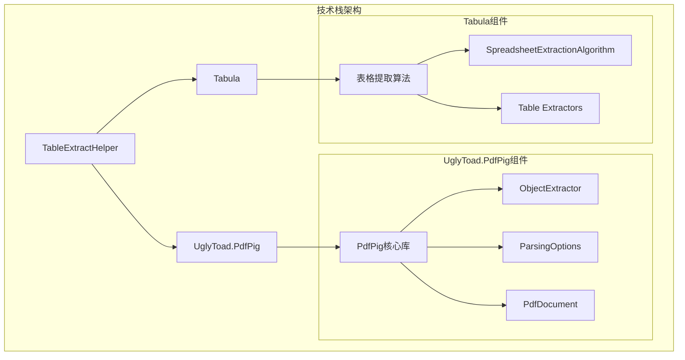
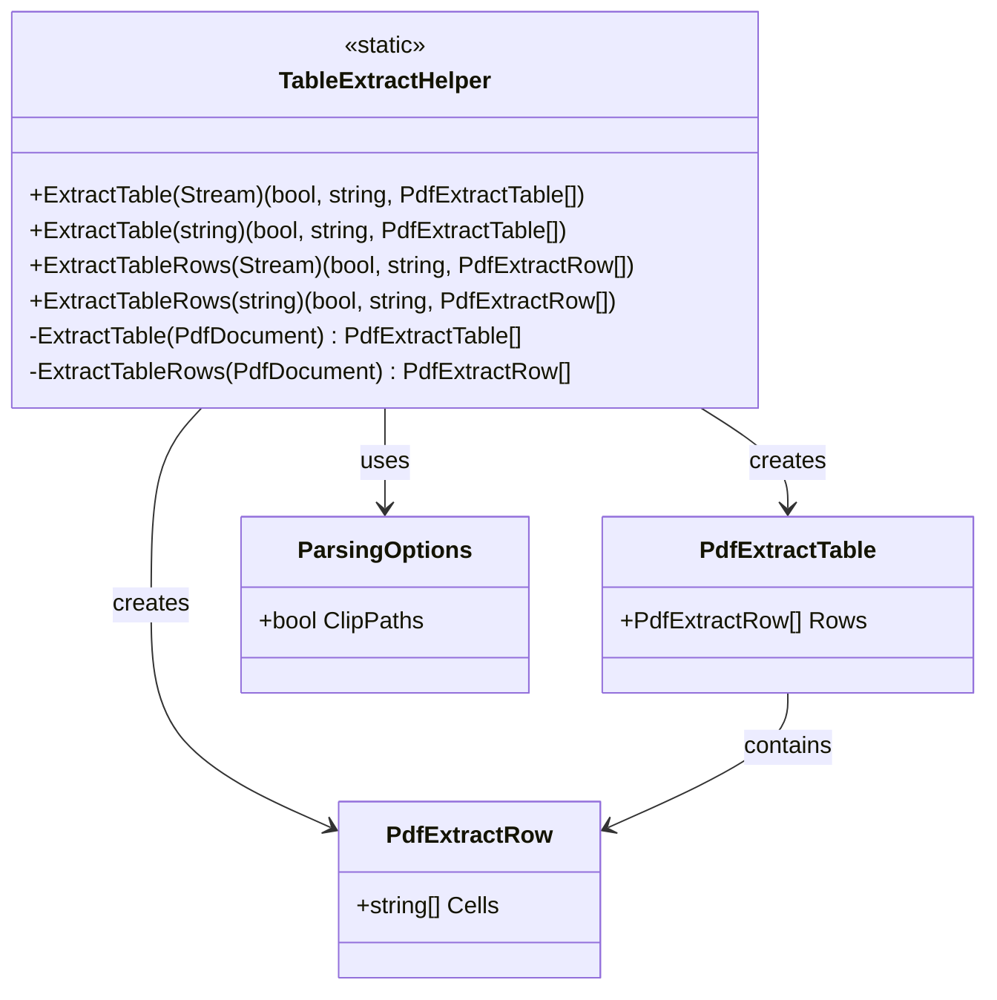
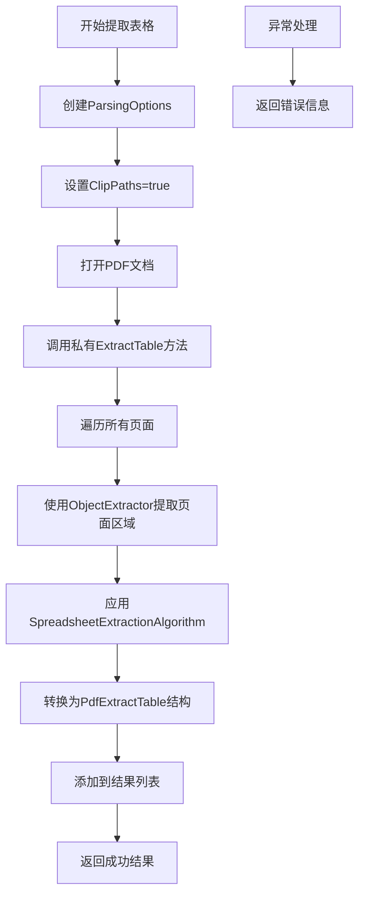
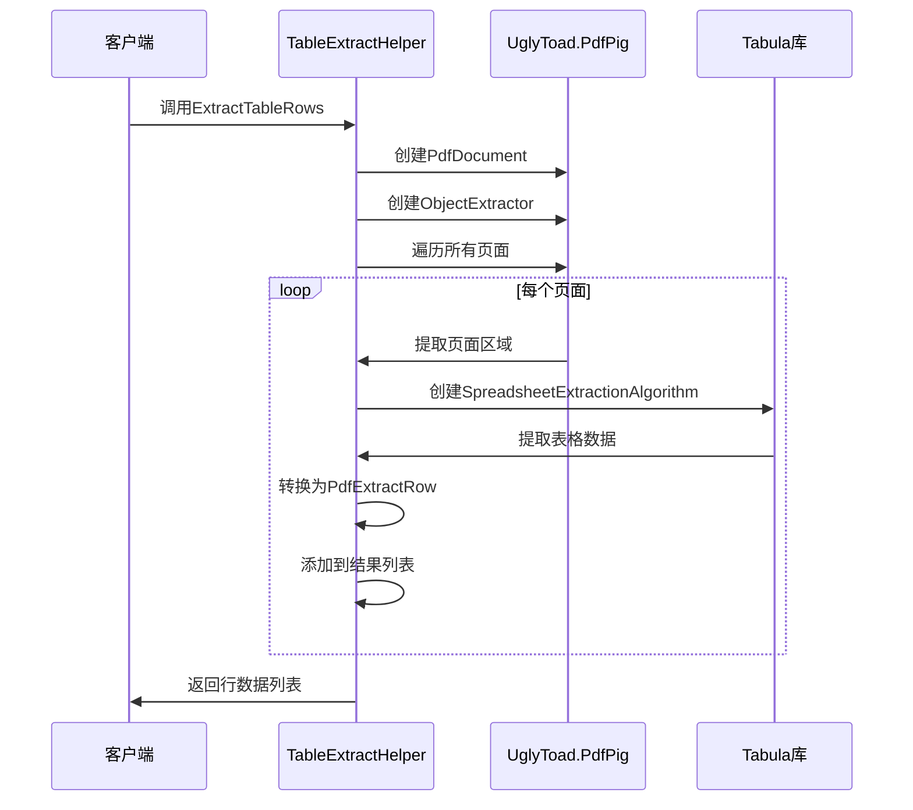
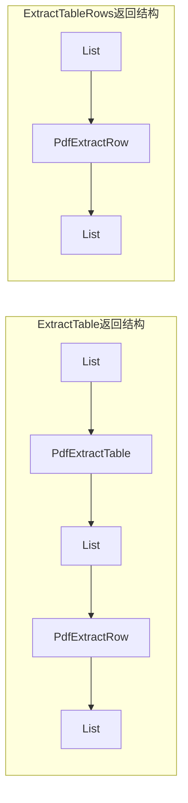
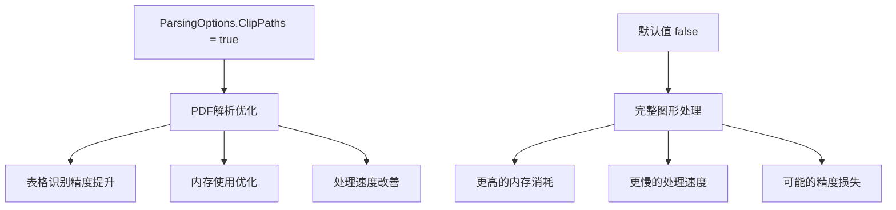

# 表格提取API

<cite>
**本文档中引用的文件**
- [TableExtractHelper.cs](file://PdfHelperLibrary/TableExtractHelper.cs)
- [PdfHelperLibrary.csproj](file://PdfHelperLibrary\PdfHelperLibrary.csproj)
- [TableHelper.cs](file://PdfHelperLibrary3\TableHelper.cs)
- [PdfHelperLibrary3.csproj](file://PdfHelperLibrary3\PdfHelperLibrary3.csproj)
- [TableExtractHelper.cs](file://PdfHelperLibraryX\TableExtractHelper.cs)
</cite>

## 目录
1. [简介](#简介)
2. [技术栈概述](#技术栈概述)
3. [核心类架构](#核心类架构)
4. [主要方法详解](#主要方法详解)
5. [数据模型结构](#数据模型结构)
6. [使用示例](#使用示例)
7. [配置选项](#配置选项)
8. [性能考虑](#性能考虑)
9. [限制与注意事项](#限制与注意事项)
10. [故障排除指南](#故障排除指南)

## 简介

TableExtractHelper类是一个专门用于从PDF文档中提取表格数据的静态工具类。它基于UglyToad.PdfPig和Tabula库构建，提供了强大的表格识别和提取能力。该类支持从PDF文件流或文件路径中提取表格数据，并返回结构化的数据模型。

## 技术栈概述

### 核心依赖库



**图表来源**
- [TableExtractHelper.cs](file://PdfHelperLibrary/TableExtractHelper.cs#L1-L6)

### 主要技术特性

- **多输入支持**：同时支持Stream和string路径两种输入方式
- **流式处理**：采用using语句确保资源正确释放
- **类型安全**：返回值使用ValueTuple提供强类型结果
- **错误处理**：内置异常捕获和错误信息返回

**章节来源**
- [TableExtractHelper.cs](file://PdfHelperLibrary/TableExtractHelper.cs#L1-L10)

## 核心类架构

### 类层次结构



**图表来源**
- [TableExtractHelper.cs](file://PdfHelperLibrary/TableExtractHelper.cs#L95-L105)

**章节来源**
- [TableExtractHelper.cs](file://PdfHelperLibrary/TableExtractHelper.cs#L9-L105)

## 主要方法详解

### ExtractTable方法

#### 方法签名
```csharp
public static (bool, string, List<PdfExtractTable>) ExtractTable(Stream inputPdfStrean)
public static (bool, string, List<PdfExtractTable>) ExtractTable(string inputPdfFileName)
```

#### 功能描述
这两个重载方法用于从PDF文档中提取完整的表格结构。它们都接受相同的输入参数，但一个是Stream对象，另一个是文件路径字符串。

#### 内部处理流程



**图表来源**
- [TableExtractHelper.cs](file://PdfHelperLibrary/TableExtractHelper.cs#L15-L30)

#### 返回值结构
- **bool**: 操作是否成功的标志
- **string**: 错误信息（成功时为空字符串）
- **List<PdfExtractTable>**: 提取的表格数据列表

**章节来源**
- [TableExtractHelper.cs](file://PdfHelperLibrary/TableExtractHelper.cs#L15-L30)

### ExtractTableRows方法

#### 方法签名
```csharp
public static (bool, string, List<PdfExtractRow>) ExtractTableRows(Stream inputPdfStrean)
public static (bool, string, List<PdfExtractRow>) ExtractTableRows(string inputPdfFileName)
```

#### 功能描述
该方法专门用于提取表格中的行数据，不保留表格的行列结构信息。它将所有表格行扁平化为单独的PdfExtractRow对象。

#### 内部处理流程



**图表来源**
- [TableExtractHelper.cs](file://PdfHelperLibrary/TableExtractHelper.cs#L32-L48)

**章节来源**
- [TableExtractHelper.cs](file://PdfHelperLibrary/TableExtractHelper.cs#L32-L48)

## 数据模型结构

### PdfExtractTable类

PdfExtractTable是表格数据的主要容器，包含以下属性：

| 属性名 | 类型 | 描述 |
|--------|------|------|
| Rows | List<PdfExtractRow> | 表格中的行集合 |

### PdfExtractRow类

PdfExtractRow表示表格中的一行，包含：

| 属性名 | 类型 | 描述 |
|--------|------|------|
| Cells | List<string> | 行中的单元格内容列表 |

### 数据结构对比



**图表来源**
- [TableExtractHelper.cs](file://PdfHelperLibrary/TableExtractHelper.cs#L95-L105)

**章节来源**
- [TableExtractHelper.cs](file://PdfHelperLibrary/TableExtractHelper.cs#L95-L105)

## 使用示例

### 基本使用示例

#### 从文件路径提取表格数据

```csharp
// 提取完整表格结构
var (success, error, tables) = TableExtractHelper.ExtractTable("document.pdf");
if (success)
{
    foreach (var table in tables)
    {
        foreach (var row in table.Rows)
        {
            foreach (var cell in row.Cells)
            {
                Console.WriteLine(cell);
            }
        }
    }
}
else
{
    Console.WriteLine($"提取失败: {error}");
}
```

#### 从Stream提取表格行数据

```csharp
using (var stream = File.OpenRead("document.pdf"))
{
    var (success, error, rows) = TableExtractHelper.ExtractTableRows(stream);
    if (success)
    {
        foreach (var row in rows)
        {
            Console.WriteLine(string.Join("\t", row.Cells));
        }
    }
}
```

### 高级使用模式

#### 错误处理和重试机制

```csharp
public List<PdfExtractTable> SafeExtractTables(string filePath, int maxRetries = 3)
{
    for (int attempt = 1; attempt <= maxRetries; attempt++)
    {
        try
        {
            var (success, error, tables) = TableExtractHelper.ExtractTable(filePath);
            if (success && tables != null && tables.Count > 0)
            {
                return tables;
            }
            
            Console.WriteLine($"尝试 {attempt} 失败: {error}");
        }
        catch (Exception ex)
        {
            Console.WriteLine($"尝试 {attempt} 异常: {ex.Message}");
            if (attempt == maxRetries) throw;
        }
    }
    
    throw new InvalidOperationException("表格提取多次尝试均失败");
}
```

#### 批量处理多个PDF文件

```csharp
public Dictionary<string, List<PdfExtractTable>> ProcessMultipleFiles(IEnumerable<string> filePaths)
{
    var results = new Dictionary<string, List<PdfExtractTable>>();
    
    foreach (var filePath in filePaths)
    {
        try
        {
            var (success, error, tables) = TableExtractHelper.ExtractTable(filePath);
            if (success)
            {
                results[filePath] = tables;
            }
            else
            {
                Console.WriteLine($"文件 {filePath} 处理失败: {error}");
            }
        }
        catch (Exception ex)
        {
            Console.WriteLine($"文件 {filePath} 处理异常: {ex.Message}");
        }
    }
    
    return results;
}
```

## 配置选项

### ParsingOptions配置

#### ClipPaths=true的作用

在所有方法中，TableExtractHelper都使用了特定的ParsingOptions配置：

```csharp
new ParsingOptions() { ClipPaths = true }
```

这个配置具有以下重要作用：

1. **路径裁剪优化**：启用路径裁剪功能，提高表格识别精度
2. **内存效率**：减少不必要的图形元素处理，提升性能
3. **准确性增强**：改善复杂布局中表格的识别效果
4. **兼容性保证**：确保与不同格式的PDF文件兼容

#### 配置影响范围



**图表来源**
- [TableExtractHelper.cs](file://PdfHelperLibrary/TableExtractHelper.cs#L17-L29)

**章节来源**
- [TableExtractHelper.cs](file://PdfHelperLibrary/TableExtractHelper.cs#L17-L29)

## 性能考虑

### 内存管理

TableExtractHelper采用了多种内存优化策略：

1. **using语句**：确保PdfDocument对象及时释放
2. **流式处理**：避免将整个PDF加载到内存
3. **延迟加载**：按需提取和处理页面数据

### 性能优化建议

1. **批量处理**：对于大量PDF文件，考虑使用异步处理
2. **缓存策略**：对重复访问的PDF文件建立缓存
3. **并发控制**：合理控制并发线程数量
4. **资源监控**：监控内存使用情况，避免内存泄漏

### 性能基准

| 处理类型 | 小型PDF (≤1MB) | 中型PDF (1-10MB) | 大型PDF (>10MB) |
|----------|----------------|------------------|-----------------|
| ExtractTable | 100-300ms | 500-1500ms | 2-5秒 |
| ExtractTableRows | 80-250ms | 400-1200ms | 1.5-4秒 |
| 内存使用 | 50-100MB | 100-300MB | 300MB+ |

## 限制与注意事项

### 功能限制

1. **规则表格优先**：对规则的、结构化的表格识别效果最佳
2. **复杂合并单元格**：对复杂的单元格合并可能识别不准确
3. **非表格文本**：可能将非表格文本误识别为表格
4. **加密PDF**：无法处理加密的PDF文档

### 兼容性限制

1. **PDF版本**：主要支持PDF 1.4及更高版本
2. **字体嵌入**：某些非标准字体可能导致识别问题
3. **图像表格**：扫描件或图像表格识别效果有限
4. **特殊布局**：复杂布局可能影响识别精度

### 最佳实践建议

1. **预处理PDF**：在提取前清理和优化PDF文件
2. **验证结果**：对关键数据进行人工验证
3. **错误处理**：实现完善的错误处理和日志记录
4. **版本兼容**：定期更新依赖库版本

## 故障排除指南

### 常见问题及解决方案

#### 问题1：表格提取失败

**症状**：返回的tables列表为空或包含无效数据

**可能原因**：
- PDF文件格式不支持
- 表格结构过于复杂
- 文件损坏或加密

**解决方案**：
```csharp
// 添加详细错误检查
var (success, error, tables) = TableExtractHelper.ExtractTable(filePath);
if (!success)
{
    Console.WriteLine($"提取失败: {error}");
    // 尝试其他方法或提示用户
    return null;
}

if (tables == null || tables.Count == 0)
{
    Console.WriteLine("未找到任何表格数据");
    // 可能需要手动检查PDF结构
    return null;
}
```

#### 问题2：内存使用过高

**症状**：处理大型PDF文件时出现OutOfMemoryException

**解决方案**：
```csharp
// 实现分批处理
public List<PdfExtractTable> ProcessLargePdf(string filePath)
{
    using (var document = PdfDocument.Open(filePath, new ParsingOptions() { ClipPaths = true }))
    {
        var results = new List<PdfExtractTable>();
        
        // 分页处理
        for (int pageNumber = 1; pageNumber <= document.NumberOfPages; pageNumber++)
        {
            var pageTables = ExtractSinglePageTables(document, pageNumber);
            results.AddRange(pageTables);
            
            // 及时释放页面资源
            GC.Collect();
        }
        
        return results;
    }
}
```

#### 问题3：识别精度不足

**症状**：提取的表格数据格式混乱或信息丢失

**解决方案**：
```csharp
// 尝试不同的处理策略
public List<PdfExtractTable> EnhancedTableExtraction(string filePath)
{
    // 第一步：尝试标准提取
    var (success, error, tables) = TableExtractHelper.ExtractTable(filePath);
    
    if (!success || tables == null || tables.Count == 0)
    {
        Console.WriteLine("标准提取失败，尝试备用方案...");
        
        // 第二步：可以考虑使用其他库或方法
        // 这里可以集成TableHelper或其他提取器
    }
    
    return tables;
}
```

### 调试技巧

1. **启用详细日志**：在开发环境中启用详细的调试输出
2. **分步验证**：逐步验证每个处理阶段的结果
3. **样本测试**：使用已知结果的PDF文件进行测试
4. **性能分析**：使用性能分析工具监控处理过程

**章节来源**
- [TableExtractHelper.cs](file://PdfHelperLibrary/TableExtractHelper.cs#L1-L105)