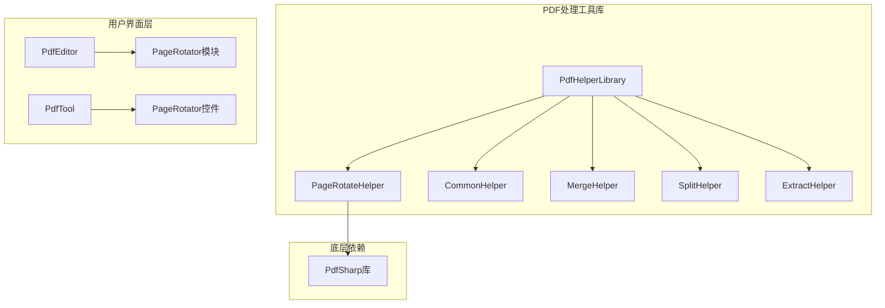
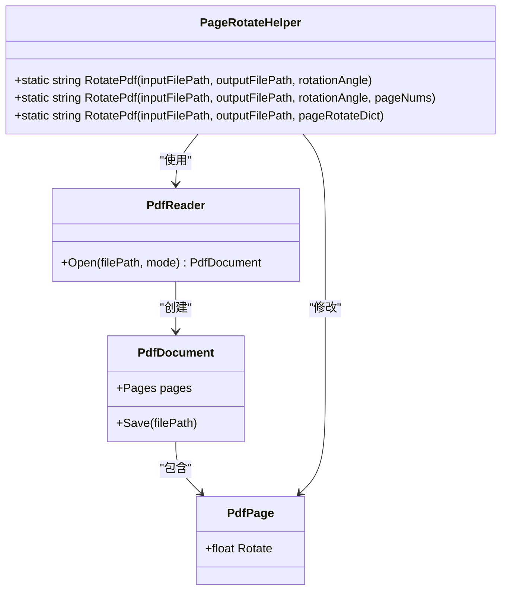
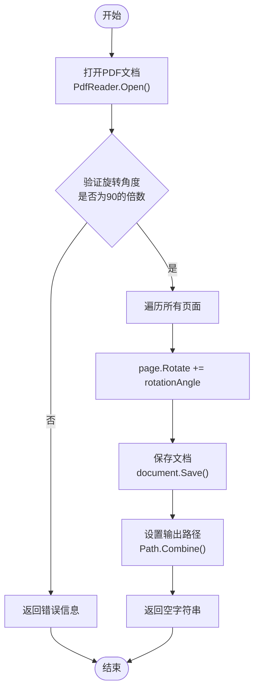
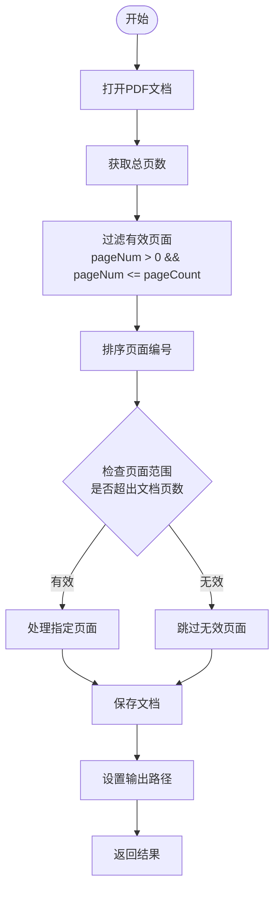
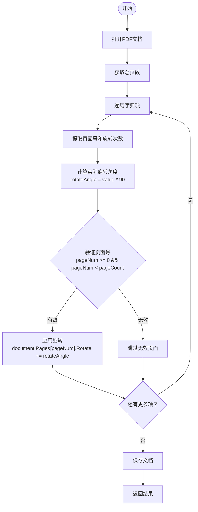
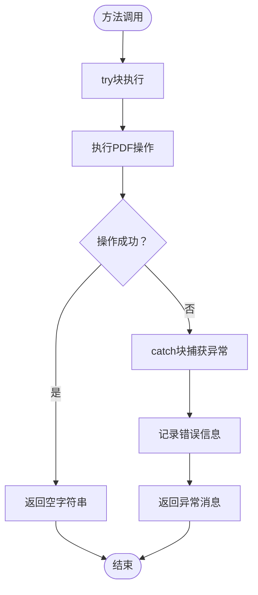

# 页面旋转API详细文档

<cite>
**本文档中引用的文件**
- [PageRotateHelper.cs](file://PdfHelperLibrary/PageRotateHelper.cs)
- [CommonHelper.cs](file://PdfHelperLibrary/CommonHelper.cs)
- [PageRotator.cs](file://PdfEditor\Modules\PageRotator.cs)
- [PageRotator.cs](file://PdfTool\PageRotator.cs)
- [MainForm.cs](file://PdfEditor\MainForm.cs)
</cite>

## 目录
1. [简介](#简介)
2. [项目结构概述](#项目结构概述)
3. [核心组件分析](#核心组件分析)
4. [架构概览](#架构概览)
5. [详细方法分析](#详细方法分析)
6. [底层机制说明](#底层机制说明)
7. [输出文件命名规则](#输出文件命名规则)
8. [调用示例](#调用示例)
9. [异常处理设计](#异常处理设计)
10. [最佳实践建议](#最佳实践建议)
11. [总结](#总结)

## 简介

PageRotateHelper类是PdfHelperLibrary库中的一个静态工具类，专门负责PDF页面的旋转操作。该类提供了三种不同的页面旋转重载方法，基于PdfSharp库的Modify模式，通过直接修改PDF页面的Rotate属性来实现页面旋转功能。该类设计简洁高效，支持批量处理、选择性处理以及个性化定制等多种旋转需求。

## 项目结构概述

PageRotateHelper类位于PdfHelperLibrary项目中，作为PDF处理工具库的核心组件之一。该项目采用模块化设计，各个功能模块相对独立，便于维护和扩展。



**图表来源**
- [PageRotateHelper.cs](file://PdfHelperLibrary\PageRotateHelper.cs#L1-L94)
- [CommonHelper.cs](file://PdfHelperLibrary\CommonHelper.cs#L1-L29)

**章节来源**
- [PageRotateHelper.cs](file://PdfHelperLibrary\PageRotateHelper.cs#L1-L94)

## 核心组件分析

PageRotateHelper类是一个静态工具类，提供了三个重载的RotatePdf方法，每个方法都针对不同的使用场景进行了优化设计。

### 类结构特点

- **静态设计**：所有方法均为静态，无需实例化即可使用
- **异常安全**：统一的异常处理机制，确保程序稳定性
- **灵活输出**：支持多种输出方式，满足不同应用场景
- **类型安全**：强类型参数设计，减少运行时错误

**章节来源**
- [PageRotateHelper.cs](file://PdfHelperLibrary\PageRotateHelper.cs#L11-L94)

## 架构概览

PageRotateHelper类采用了经典的工厂模式和策略模式相结合的设计模式，根据不同的输入参数选择相应的处理策略。



**图表来源**
- [PageRotateHelper.cs](file://PdfHelperLibrary\PageRotateHelper.cs#L14-L92)

## 详细方法分析

### 方法一：全局旋转（所有页面）

#### 方法签名
```csharp
public static string RotatePdf(string inputFilePath, out string outputFilePath, int rotationAngle)
```

#### 功能描述
该方法对PDF文档中的所有页面应用相同的旋转角度，是最常用的页面旋转场景。

#### 参数说明
- `inputFilePath`：输入PDF文件的完整路径
- `outputFilePath`：输出PDF文件的完整路径（通过out参数返回）
- `rotationAngle`：旋转角度，通常为90的倍数

#### 处理流程



**图表来源**
- [PageRotateHelper.cs](file://PdfHelperLibrary\PageRotateHelper.cs#L14-L36)

### 方法二：选择性旋转

#### 方法签名
```csharp
public static string RotatePdf(string inputFilePath, out string outputFilePath, int rotationAngle, List<int> pageNums)
```

#### 功能描述
该方法允许用户指定特定的页面编号列表，只对这些页面进行旋转操作。

#### 参数说明
- `inputFilePath`：输入PDF文件的完整路径
- `outputFilePath`：输出PDF文件的完整路径（通过out参数返回）
- `rotationAngle`：旋转角度
- `pageNums`：需要旋转的页面编号列表（从1开始计数）

#### 数据验证流程



**图表来源**
- [PageRotateHelper.cs](file://PdfHelperLibrary\PageRotateHelper.cs#L39-L64)

### 方法三：个性化旋转

#### 方法签名
```csharp
public static string RotatePdf(string inputFilePath, string outputFilePath, Dictionary<int, int> pageRotateDict)
```

#### 功能描述
该方法通过字典参数为不同页面设置不同的旋转角度，每个页面可以有不同的旋转量。

#### 参数说明
- `inputFilePath`：输入PDF文件的完整路径
- `outputFilePath`：输出PDF文件的完整路径
- `pageRotateDict`：页面旋转字典，键为页面编号，值为旋转次数（每次90度）

#### 字典处理逻辑



**图表来源**
- [PageRotateHelper.cs](file://PdfHelperLibrary\PageRotateHelper.cs#L67-L92)

**章节来源**
- [PageRotateHelper.cs](file://PdfHelperLibrary\PageRotateHelper.cs#L14-L92)

## 底层机制说明

### PdfSharp Modify模式

PageRotateHelper类基于PdfSharp库的Modify模式打开PDF文档。Modify模式允许对现有PDF文档进行修改，而不会丢失原始文档的结构和内容。

#### 打开模式对比

| 模式 | 用途 | 特点 |
|------|------|------|
| Import | 只读访问 | 不能修改文档内容 |
| Modify | 修改文档 | 可以修改页面属性和内容 |
| Create | 创建新文档 | 从头开始创建PDF |

### 页面旋转属性

PDF页面的旋转属性通过`page.Rotate`属性实现，该属性表示页面相对于正常方向的旋转角度（以度为单位）。正值表示顺时针旋转，负值表示逆时针旋转。

### 旋转角度计算

- **全局旋转**：直接使用传入的rotationAngle参数
- **选择性旋转**：同样使用传入的rotationAngle参数
- **个性化旋转**：旋转角度 = value × 90°（其中value为字典中的值）

**章节来源**
- [PageRotateHelper.cs](file://PdfHelperLibrary\PageRotateHelper.cs#L18-L19)
- [PageRotateHelper.cs](file://PdfHelperLibrary\PageRotateHelper.cs#L43-L44)
- [PageRotateHelper.cs](file://PdfHelperLibrary\PageRotateHelper.cs#L71-L72)

## 输出文件命名规则

PageRotateHelper类遵循统一的输出文件命名规则，确保生成的文件具有清晰的标识性和可追溯性。

### 命名格式

```
原文件名 - 旋转角度.pdf
```

### 具体规则

1. **基础名称**：保留原文件的基本名称（不包括扩展名）
2. **分隔符**：使用" - "作为分隔符
3. **旋转角度**：显示具体的旋转角度值
4. **扩展名**：保持".pdf"扩展名不变

### 示例

假设输入文件为`document.pdf`，旋转角度为90°：
- 输出文件：`document - 90.pdf`

对于选择性旋转或个性化旋转，命名规则保持一致，仅旋转角度值可能有所不同。

**章节来源**
- [PageRotateHelper.cs](file://PdfHelperLibrary\PageRotateHelper.cs#L28-L29)
- [PageRotateHelper.cs](file://PdfHelperLibrary\PageRotateHelper.cs#L56-L57)

## 调用示例

### 示例1：全局旋转所有页面

```csharp
// 全局旋转所有页面
string inputPath = @"C:\Documents\example.pdf";
string outputPath;
int rotationAngle = 90;

string result = PageRotateHelper.RotatePdf(inputPath, out outputPath, rotationAngle);

if (string.IsNullOrEmpty(result))
{
    Console.WriteLine($"旋转成功: {outputPath}");
}
else
{
    Console.WriteLine($"旋转失败: {result}");
}
```

### 示例2：选择性旋转特定页面

```csharp
// 选择性旋转特定页面
string inputPath = @"C:\Documents\document.pdf";
string outputPath;
int rotationAngle = 180;
List<int> pageNumbers = new List<int> { 1, 3, 5 };

string result = PageRotateHelper.RotatePdf(inputPath, out outputPath, rotationAngle, pageNumbers);

if (string.IsNullOrEmpty(result))
{
    Console.WriteLine($"选择性旋转成功: {outputPath}");
}
else
{
    Console.WriteLine($"选择性旋转失败: {result}");
}
```

### 示例3：个性化旋转（字典方式）

```csharp
// 个性化旋转 - 字典方式
string inputPath = @"C:\Documents\complex.pdf";
string outputPath = @"C:\Documents\complex_rotated.pdf";

Dictionary<int, int> pageRotationDict = new Dictionary<int, int>
{
    { 0, 1 },    // 第1页顺时针旋转90°
    { 1, -1 },   // 第2页逆时针旋转90°
    { 2, 2 },    // 第3页旋转180°
    { 3, 3 }     // 第4页顺时针旋转270°
};

string result = PageRotateHelper.RotatePdf(inputPath, outputPath, pageRotationDict);

if (string.IsNullOrEmpty(result))
{
    Console.WriteLine($"个性化旋转成功: {outputPath}");
}
else
{
    Console.WriteLine($"个性化旋转失败: {result}");
}
```

### 示例4：在PdfEditor中的使用

```csharp
// 在PdfEditor模块中的典型使用
private void BtnExport_Click(object sender, EventArgs e)
{
    var saveDlg = new SaveFileDialog { Filter = "PDF文件(*.pdf)|*.pdf|所有文件(*.*)|*.*" };
    if (saveDlg.ShowDialog() != DialogResult.OK) return;
    
    // 使用字典方式实现个性化旋转
    var rotationDict = new Dictionary<int, int>
    {
        { currentPageNum, rotationAmount }
    };
    
    var result = PageRotateHelper.RotatePdf(inputPdfFileName, saveDlg.FileName, rotationDict);
    
    var message = string.IsNullOrWhiteSpace(result) 
        ? $"{inputPdfFileName} 旋转完成: {saveDlg.FileName}" 
        : $"{inputPdfFileName} 旋转失败: {result}";
        
    MessageBox.Show(message);
}
```

**章节来源**
- [PageRotator.cs](file://PdfEditor\Modules\PageRotator.cs#L89-L94)
- [PageRotator.cs](file://PdfTool\PageRotator.cs#L99-L108)

## 异常处理设计

PageRotateHelper类采用了统一的异常处理设计，确保在各种错误情况下都能提供清晰的错误信息。

### 异常处理策略



**图表来源**
- [PageRotateHelper.cs](file://PdfHelperLibrary\PageRotateHelper.cs#L16-L36)
- [PageRotateHelper.cs](file://PdfHelperLibrary\PageRotateHelper.cs#L41-L64)
- [PageRotateHelper.cs](file://PdfHelperLibrary\PageRotateHelper.cs#L69-L92)

### 错误类型处理

| 错误类型 | 处理方式 | 返回信息 |
|----------|----------|----------|
| 文件不存在 | 捕获FileNotFoundException | "文件未找到" |
| 权限不足 | 捕获UnauthorizedAccessException | "权限不足" |
| PDF格式错误 | 捕获PdfReaderException | "PDF格式错误" |
| 内存不足 | 捕获OutOfMemoryException | "内存不足" |
| 其他异常 | 捕获Exception | 具体异常消息 |

### 异常处理差异

- **前两个方法**：当发生异常时，设置`outputFilePath`为空字符串，并返回异常消息
- **第三个方法**：直接返回异常消息，不涉及输出文件路径

**章节来源**
- [PageRotateHelper.cs](file://PdfHelperLibrary\PageRotateHelper.cs#L32-L36)
- [PageRotateHelper.cs](file://PdfHelperLibrary\PageRotateHelper.cs#L60-L64)
- [PageRotateHelper.cs](file://PdfHelperLibrary\PageRotateHelper.cs#L88-L92)

## 最佳实践建议

### 旋转角度规范

1. **推荐使用90的倍数**：90°、180°、270°是最常用的标准旋转角度
2. **避免小角度旋转**：小于45°的角度可能导致显示问题
3. **考虑页面内容**：旋转后确保内容仍然可读

### 性能优化建议

1. **批量处理**：对于大量文件，考虑使用异步处理
2. **内存管理**：大文件处理时注意内存使用
3. **进度反馈**：长时间操作应提供进度指示

### 用户体验优化

1. **输入验证**：在UI层面验证页面编号的有效性
2. **撤销功能**：提供撤销最近旋转操作的功能
3. **预览功能**：在正式保存前提供旋转预览

### 错误处理最佳实践

1. **友好的错误消息**：向用户提供清晰的错误说明
2. **日志记录**：记录详细的错误信息用于调试
3. **优雅降级**：在部分失败的情况下继续处理其他页面

## 总结

PageRotateHelper类是一个设计精良的PDF页面旋转工具，具有以下特点：

### 主要优势

1. **功能全面**：提供三种不同的旋转方式，满足各种使用场景
2. **易于使用**：简洁的API设计，参数直观易懂
3. **异常安全**：完善的异常处理机制，确保程序稳定性
4. **性能可靠**：基于PdfSharp的Modify模式，保证操作效率
5. **命名规范**：输出文件命名清晰，便于识别和管理

### 技术特色

- **静态设计**：无需实例化，直接调用即可使用
- **类型安全**：强类型参数，减少运行时错误
- **灵活输出**：支持多种输出方式和命名规则
- **统一异常处理**：一致的错误处理机制

### 应用价值

PageRotateHelper类为PDF文档处理提供了强大的页面旋转功能，无论是简单的全局旋转还是复杂的个性化定制，都能轻松应对。其稳定可靠的性能表现，使其成为PDF处理工具库中不可或缺的重要组件。

通过合理的使用和扩展，PageRotateHelper类能够满足从简单个人使用到复杂企业级应用的各种需求，是PDF文档处理领域的一个优秀解决方案。