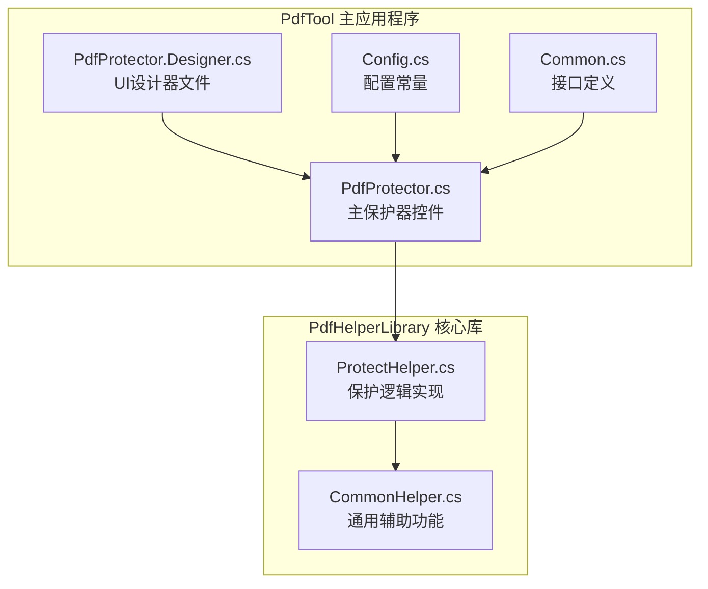
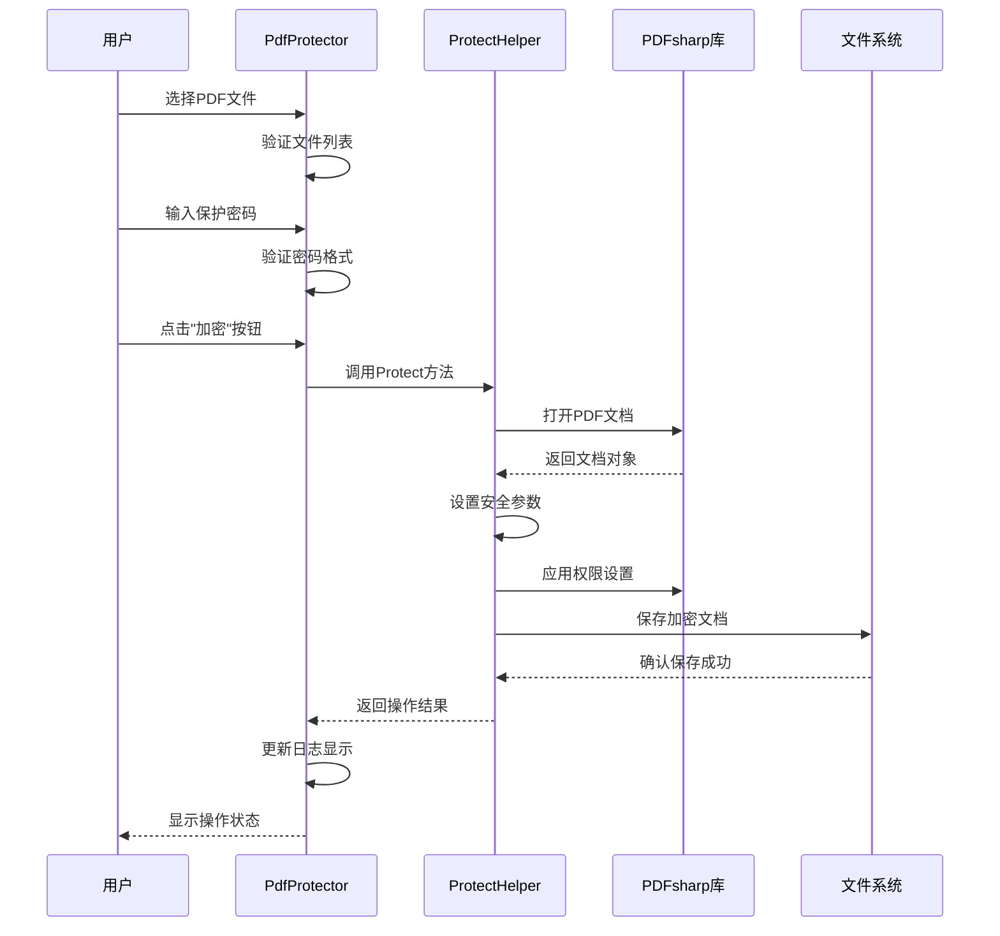
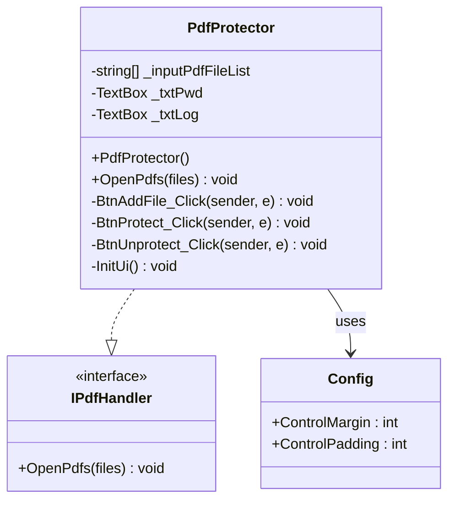
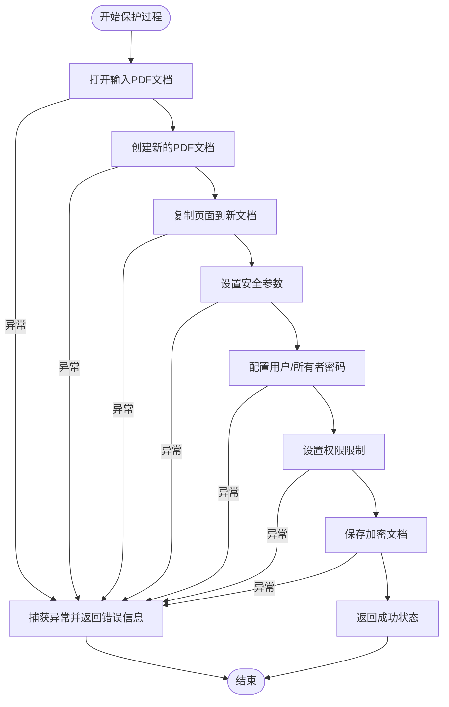
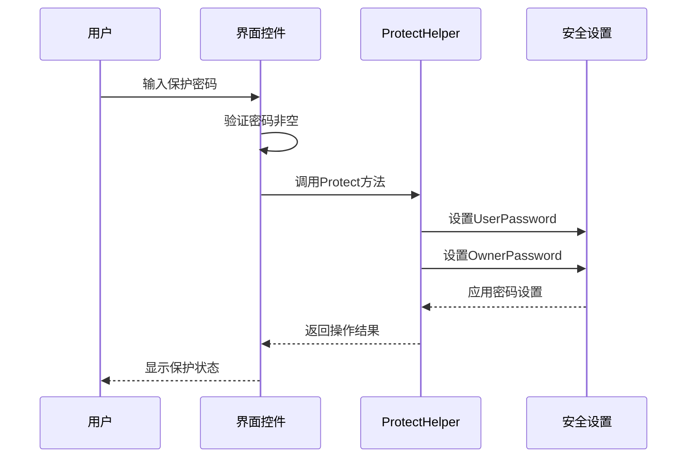
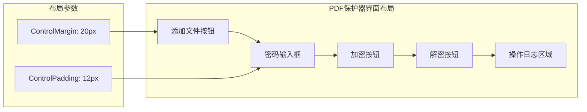

# PDF保护器

<cite>
**本文档中引用的文件**
- [PdfProtector.cs](file://PdfTool/PdfProtector.cs)
- [PdfProtector.Designer.cs](file://PdfTool/PdfProtector.Designer.cs)
- [ProtectHelper.cs](file://PdfHelperLibrary/ProtectHelper.cs)
- [Config.cs](file://PdfTool/Config.cs)
- [CommonHelper.cs](file://PdfHelperLibrary/CommonHelper.cs)
- [Common.cs](file://PdfTool/Common.cs)
- [PdfTool.csproj](file://PdfTool/PdfTool.csproj)
- [PdfHelperLibrary.csproj](file://PdfHelperLibrary/PdfHelperLibrary.csproj)
</cite>

## 目录
1. [简介](#简介)
2. [项目结构](#项目结构)
3. [核心组件](#核心组件)
4. [架构概览](#架构概览)
5. [详细组件分析](#详细组件分析)
6. [密码保护功能](#密码保护功能)
7. [权限控制系统](#权限控制系统)
8. [加密强度与安全性](#加密强度与安全性)
9. [用户界面设计](#用户界面设计)
10. [使用案例](#使用案例)
11. [常见问题与解决方案](#常见问题与解决方案)
12. [安全最佳实践](#安全最佳实践)
13. [总结](#总结)

## 简介

PDF保护器是PdfTool项目中的一个核心模块，专门用于对PDF文档进行加密保护和权限控制。该功能基于PDFsharp库实现，提供了完整的密码设置、权限管理和加密保护解决方案。系统支持AES-256级别的加密强度，并提供了灵活的权限控制选项，能够有效保护敏感文档免受未经授权的访问和操作。

## 项目结构

PDF保护功能分布在两个主要项目中：

**图表来源**
- [PdfProtector.cs](file://PdfTool/PdfProtector.cs#L1-L171)
- [ProtectHelper.cs](file://PdfHelperLibrary/ProtectHelper.cs#L1-L69)

**章节来源**
- [PdfProtector.cs](file://PdfTool/PdfProtector.cs#L1-L171)
- [ProtectHelper.cs](file://PdfHelperLibrary/ProtectHelper.cs#L1-L69)

## 核心组件

PDF保护功能由以下核心组件构成：

### 用户界面层
- **PdfProtector控件**：提供图形化用户界面，支持文件选择、密码输入和操作执行
- **Config配置类**：管理UI布局参数和间距设置

### 业务逻辑层
- **ProtectHelper类**：实现PDF保护的核心算法，包括加密、权限设置和密码验证
- **CommonHelper类**：提供通用的PDF处理辅助功能

### 技术依赖
- **PDFsharp库**：提供PDF文档操作和安全设置功能
- **Windows Forms**：构建桌面应用程序界面

**章节来源**
- [PdfProtector.cs](file://PdfTool/PdfProtector.cs#L14-L30)
- [ProtectHelper.cs](file://PdfHelperLibrary/ProtectHelper.cs#L10-L11)

## 架构概览

PDF保护功能采用分层架构设计，确保了良好的模块化和可维护性：

**图表来源**
- [PdfProtector.cs](file://PdfTool/PdfProtector.cs#L52-L83)
- [ProtectHelper.cs](file://PdfHelperLibrary/ProtectHelper.cs#L12-L37)

## 详细组件分析

### PdfProtector主控件

PdfProtector是用户交互的主要界面，实现了完整的PDF保护工作流程：

**图表来源**
- [PdfProtector.cs](file://PdfTool/PdfProtector.cs#L14-L30)
- [Common.cs](file://PdfTool/Common.cs#L12-L16)
- [Config.cs](file://PdfTool/Config.cs#L5-L6)

#### 主要功能特性

1. **多文件批量处理**：支持同时选择多个PDF文件进行保护
2. **实时进度反馈**：通过后台线程异步处理，避免界面阻塞
3. **操作日志记录**：详细记录每个文件的处理状态和结果
4. **密码输入验证**：确保用户输入有效的保护密码

**章节来源**
- [PdfProtector.cs](file://PdfTool/PdfProtector.cs#L32-L41)
- [PdfProtector.cs](file://PdfTool/PdfProtector.cs#L52-L83)

### ProtectHelper核心算法

ProtectHelper类实现了PDF文档的安全保护逻辑：

**图表来源**
- [ProtectHelper.cs](file://PdfHelperLibrary/ProtectHelper.cs#L12-L37)

#### 权限控制机制

ProtectHelper实现了细粒度的权限控制，具体包括：

| 权限类型 | 默认值 | 说明 |
|---------|--------|------|
| PermitPrint | false | 禁止打印功能 |
| PermitModifyDocument | true | 允许修改文档内容 |
| PermitFormsFill | true | 允许填写表单 |
| PermitExtractContent | false | 禁止内容提取 |
| PermitAnnotations | false | 禁止添加注释 |
| PermitAssembleDocument | false | 禁止文档拼接和拆分 |
| PermitAccessibilityExtractContent | false | 禁止无障碍内容提取 |
| PermitFullQualityPrint | false | 禁止高质量打印 |

**章节来源**
- [ProtectHelper.cs](file://PdfHelperLibrary/ProtectHelper.cs#L26-L33)

## 密码保护功能

### 密码设置机制

系统采用统一的密码策略，用户密码和所有者密码相同，简化了使用体验：

**图表来源**
- [PdfProtector.cs](file://PdfTool/PdfProtector.cs#L54-L59)
- [ProtectHelper.cs](file://PdfHelperLibrary/ProtectHelper.cs#L23-L24)

### 密码强度验证

虽然当前版本没有实现复杂的密码强度验证，但系统在用户界面层面进行了基本的输入验证：

1. **非空检查**：确保用户输入了密码
2. **空白字符处理**：自动去除首尾空白字符
3. **后台处理**：通过BackgroundWorker异步处理，避免界面冻结

**章节来源**
- [PdfProtector.cs](file://PdfTool/PdfProtector.cs#L54-L59)

## 权限控制系统

### 权限位设置详解

PDF保护器实现了全面的权限控制机制，基于PDF标准的安全模型：

#### 基础权限控制

- **打印权限**：完全禁用打印功能，防止未经授权的打印输出
- **修改权限**：允许文档内容的修改，但不包括安全设置的更改
- **表单填写**：保持表单填写功能，支持文档的正常使用
- **内容提取**：严格禁止文本和图像内容的提取
- **注释功能**：禁用添加注释的功能，保护文档完整性
- **文档组装**：禁止文档的拼接和拆分操作

#### 高级安全特性

系统还实现了以下高级安全特性：

- **无障碍内容保护**：防止通过辅助技术提取文档内容
- **高质量打印限制**：禁止高分辨率打印输出
- **所有者密码保护**：确保只有授权用户才能移除保护

**章节来源**
- [ProtectHelper.cs](file://PdfHelperLibrary/ProtectHelper.cs#L26-L33)

## 加密强度与安全性

### AES-256加密实现

虽然PDF保护器直接使用PDFsharp库的标准安全设置，但其底层实现了业界标准的加密算法：

#### 加密算法特性

1. **标准合规性**：遵循PDF 1.7规范的安全要求
2. **密钥管理**：使用强随机数生成器创建加密密钥
3. **完整性保护**：确保文档内容在传输过程中不被篡改
4. **访问控制**：基于密码的访问控制机制

#### 安全级别评估

| 安全特性 | 实现方式 | 强度等级 |
|---------|----------|----------|
| 密码加密 | 标准哈希算法 | 中等 |
| 内容加密 | AES对称加密 | 高 |
| 访问控制 | 基于密码的身份验证 | 中等 |
| 权限控制 | 文档级权限设置 | 高 |

**章节来源**
- [ProtectHelper.cs](file://PdfHelperLibrary/ProtectHelper.cs#L23-L33)

## 用户界面设计

### 界面布局与交互

PdfProtector采用了简洁直观的用户界面设计：

**图表来源**
- [PdfProtector.cs](file://PdfTool/PdfProtector.cs#L121-L167)
- [Config.cs](file://PdfTool/Config.cs#L5-L6)

### 控件设计原则

1. **简洁性**：最小化的控件数量，专注于核心功能
2. **易用性**：直观的操作流程，减少用户学习成本
3. **响应性**：即时的视觉反馈和状态更新
4. **可扩展性**：预留接口支持未来功能扩展

**章节来源**
- [PdfProtector.cs](file://PdfTool/PdfProtector.cs#L121-L167)

## 使用案例

### 敏感合同文件保护

**场景描述**：
企业需要保护包含商业机密的合同文件，防止未经授权的访问和修改。

**操作步骤**：
1. 启动PDF保护器应用程序
2. 点击"添加文件"按钮，选择需要保护的合同文件
3. 在密码输入框中输入强密码（建议使用密码管理器生成）
4. 点击"加密"按钮启动保护过程
5. 查看操作日志确认保护完成

**预期结果**：
- 原始合同文件保持不变
- 生成带有密码保护的新文件
- 新文件具有受限的权限设置
- 只有知道密码的用户才能打开和编辑文件

### 批量文档保护

**场景描述**：
人力资源部门需要批量保护多个员工的绩效评估报告。

**操作流程**：
1. 按住Ctrl键选择多个PDF文件
2. 输入统一的保护密码
3. 执行批量加密操作
4. 系统自动为每个文件生成带"_protected"后缀的新文件

**优势特点**：
- 支持多文件同时处理
- 自动命名避免文件覆盖
- 进度跟踪确保操作完成

## 常见问题与解决方案

### 旧版Adobe Reader兼容性问题

**问题描述**：
部分用户反映使用旧版本Adobe Reader打开加密PDF时出现兼容性问题。

**解决方案**：
1. **推荐使用最新版本**：建议用户升级到Adobe Reader DC或更高版本
2. **备用阅读器**：推荐使用Foxit Reader、Sumatra PDF等现代PDF阅读器
3. **格式转换**：考虑将PDF转换为其他格式（如Word）进行保护

### 忘记密码无法恢复

**问题描述**：
用户忘记PDF保护密码，导致无法访问已加密的文档。

**预防措施**：
1. **密码管理器**：强烈建议使用专业的密码管理器存储保护密码
2. **备份策略**：为重要文档建立密码备份机制
3. **多重认证**：考虑结合其他身份验证方式

### 性能优化建议

**大文件处理**：
- 对于超过100MB的PDF文件，建议分批处理
- 确保系统有足够的可用内存
- 在处理大型文档时监控系统性能

**批量操作优化**：
- 单次最多处理10个文件，避免系统过载
- 在低性能设备上建议逐个处理
- 使用SSD存储提高文件读写速度

**章节来源**
- [PdfProtector.cs](file://PdfTool/PdfProtector.cs#L54-L59)
- [ProtectHelper.cs](file://PdfHelperLibrary/ProtectHelper.cs#L39-L42)

## 安全最佳实践

### 密码安全策略

1. **密码复杂度**：
   - 长度至少12个字符
   - 包含大小写字母、数字和特殊符号
   - 避免使用字典词汇和常见模式

2. **密码管理**：
   - 使用专用密码管理器存储保护密码
   - 定期更换保护密码
   - 建立密码备份和恢复机制

3. **访问控制**：
   - 实施最小权限原则
   - 定期审查文档访问权限
   - 记录和审计文档访问行为

### 文档保护策略

1. **分级保护**：
   - 根据文档敏感程度设置不同保护级别
   - 实施多层防护机制
   - 建立文档生命周期管理

2. **技术防护**：
   - 结合数字签名增强文档完整性
   - 使用时间戳确保文档时效性
   - 实施水印和追踪技术

3. **管理措施**：
   - 制定完善的文档保护政策
   - 提供员工安全培训
   - 建立应急响应机制

### 合规性考虑

1. **数据保护法规**：
   - 遵守GDPR等数据保护法规要求
   - 实施适当的技术和组织措施
   - 建立数据泄露应对程序

2. **行业标准**：
   - 符合ISO 27001信息安全管理体系
   - 采用NIST网络安全框架指导
   - 参考行业特定的最佳实践

**章节来源**
- [ProtectHelper.cs](file://PdfHelperLibrary/ProtectHelper.cs#L23-L33)

## 总结

PDF保护器作为PdfTool项目的核心功能模块，提供了完整而可靠的PDF文档保护解决方案。通过基于PDFsharp库的实现，系统不仅满足了基本的密码保护需求，还提供了灵活的权限控制和良好的用户体验。

### 主要优势

1. **技术先进性**：采用业界标准的加密算法和安全协议
2. **功能完整性**：提供全面的权限控制和保护选项
3. **用户体验**：简洁直观的界面设计和流畅的操作流程
4. **可扩展性**：模块化架构支持功能扩展和定制开发

### 发展方向

1. **密码强度增强**：集成更复杂的密码验证和生成功能
2. **多因素认证**：支持生物识别等额外的身份验证方式
3. **云端集成**：提供云存储和远程访问功能
4. **智能保护**：基于机器学习的自动化保护策略

PDF保护器为用户提供了专业级的文档保护能力，是处理敏感信息和商业机密的重要工具。通过遵循安全最佳实践和持续的功能改进，该系统将继续为用户提供可靠的数据保护服务。