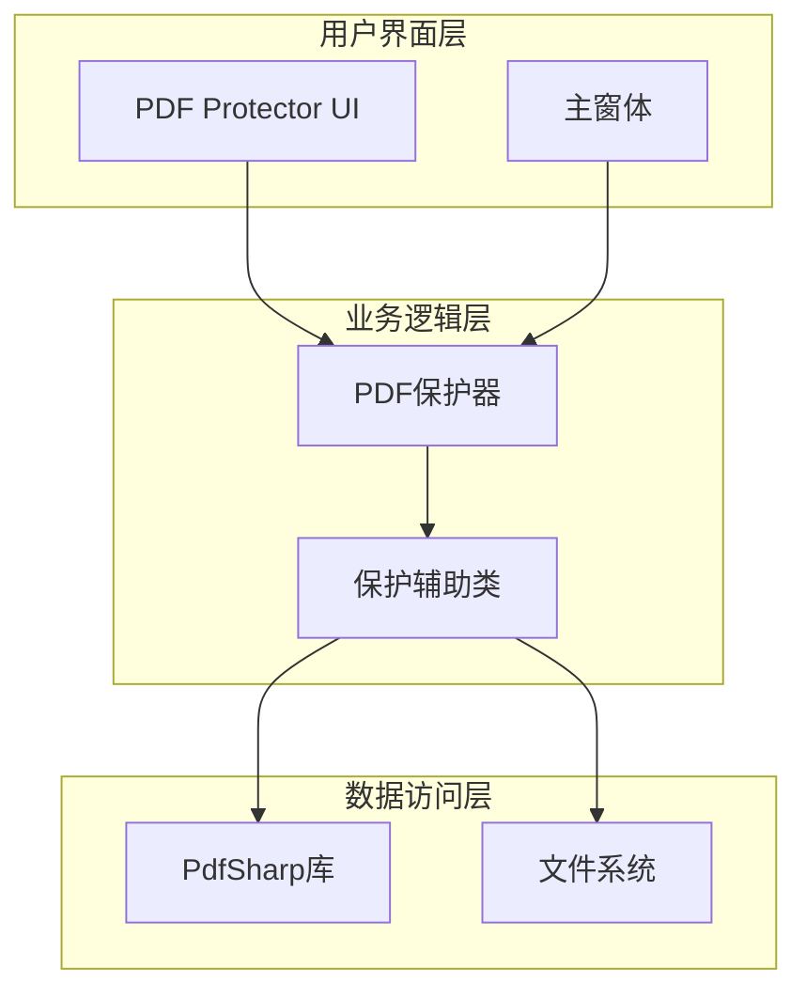
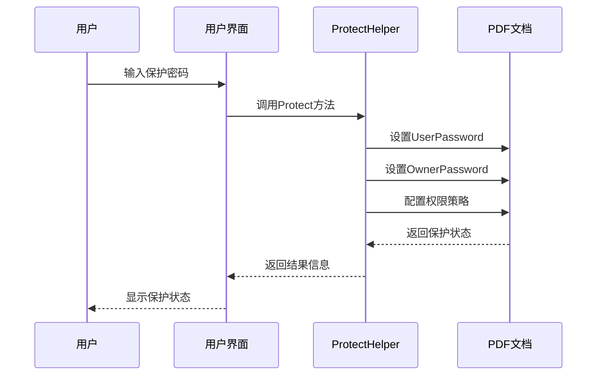
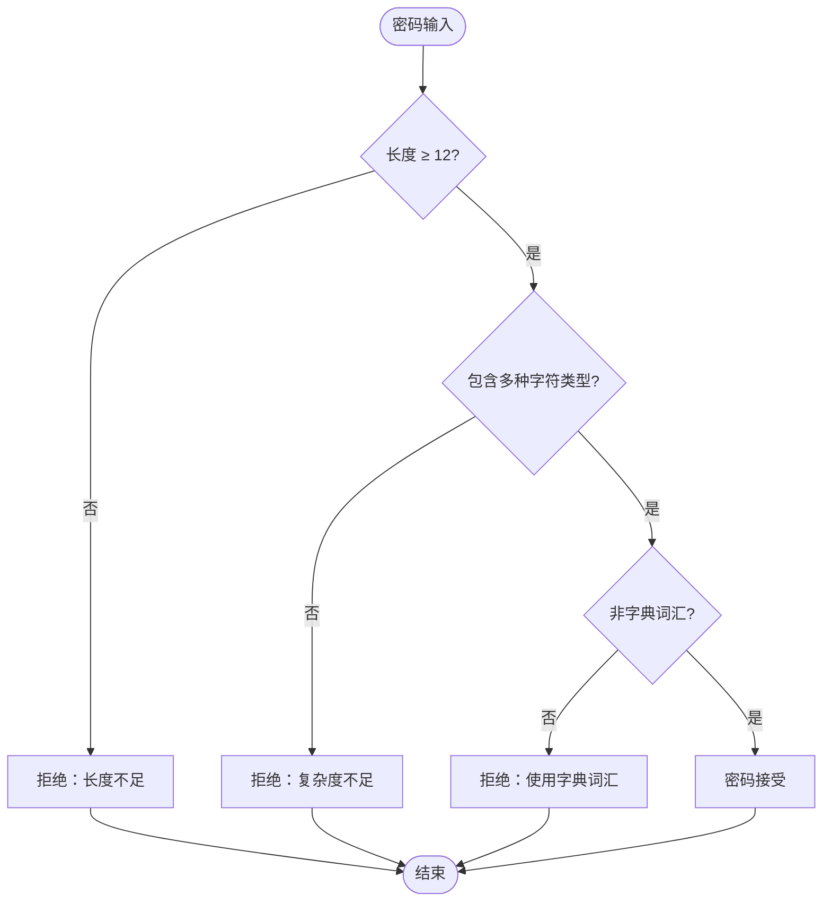
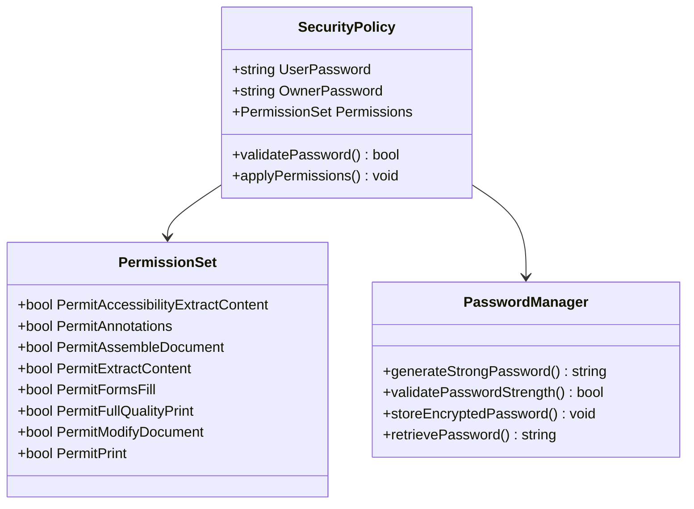
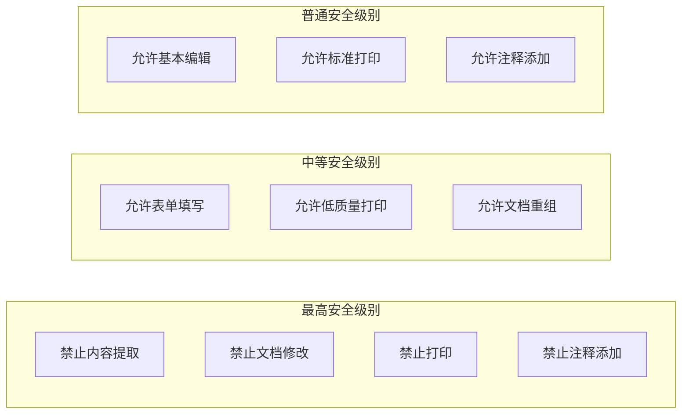
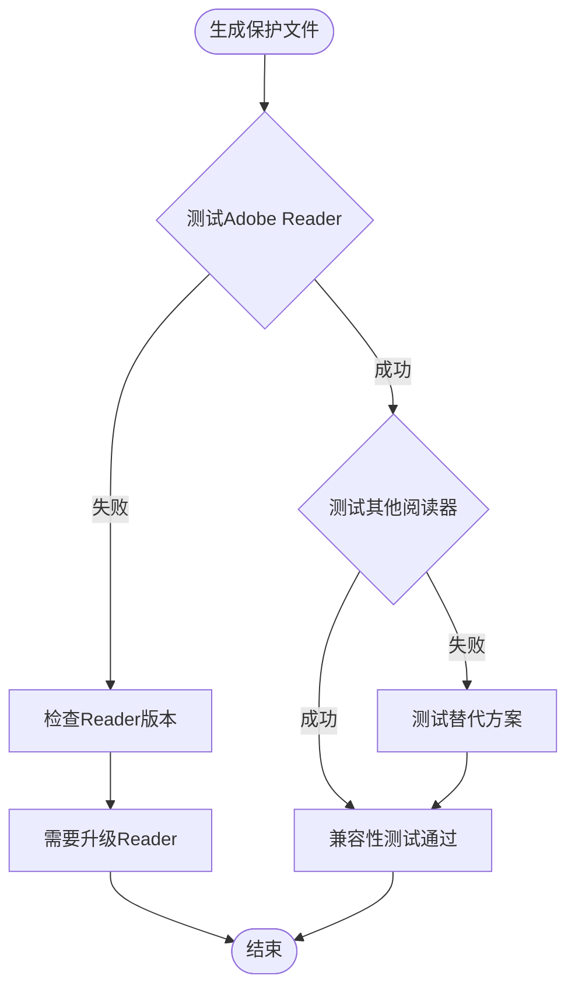
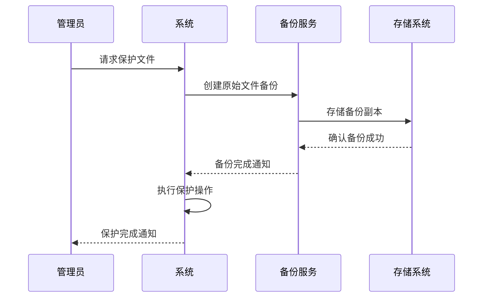
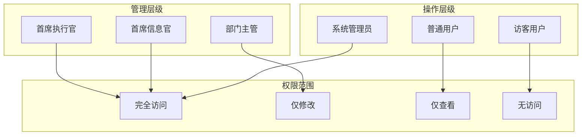
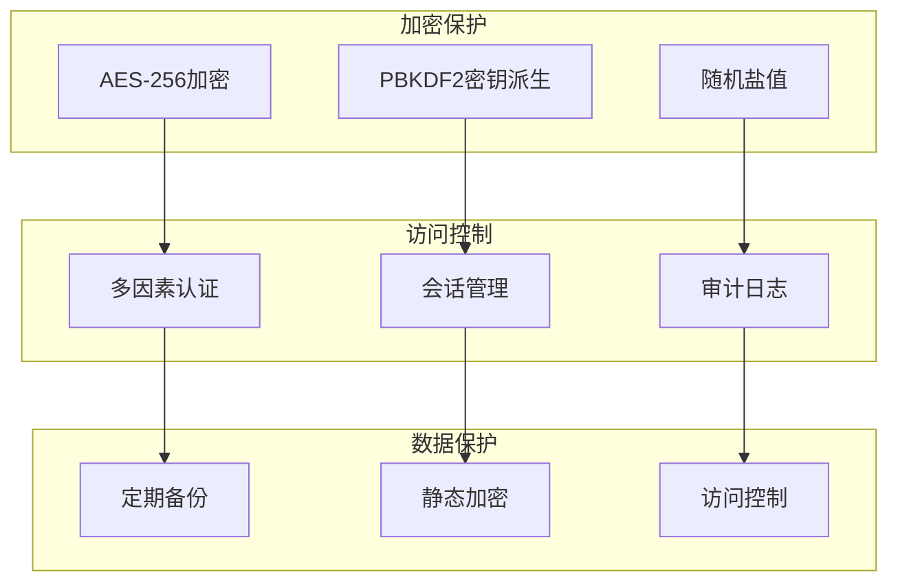
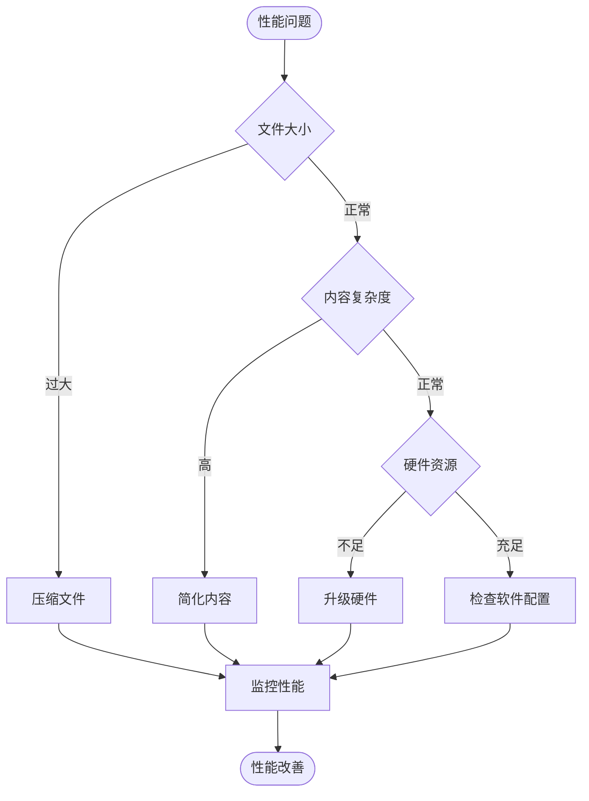

# PDF保护功能安全最佳实践指南

<cite>
**本文档引用的文件**
- [PdfProtector.cs](file://PdfTool/PdfProtector.cs)
- [ProtectHelper.cs](file://PdfHelperLibrary/ProtectHelper.cs)
- [PdfProtector.Designer.cs](file://PdfTool/PdfProtector.Designer.cs)
- [Config.cs](file://PdfTool/Config.cs)
- [Common.cs](file://PdfTool/Common.cs)
- [MainForm.cs](file://PdfTool/MainForm.cs)
- [PdfRepairer.cs](file://PdfTool/PdfRepairer.cs)
</cite>

## 目录
1. [简介](#简介)
2. [项目架构概览](#项目架构概览)
3. [核心安全组件分析](#核心安全组件分析)
4. [密码安全最佳实践](#密码安全最佳实践)
5. [权限控制策略](#权限控制策略)
6. [兼容性考虑](#兼容性考虑)
7. [企业级部署建议](#企业级部署建议)
8. [风险评估与缓解措施](#风险评估与缓解措施)
9. [故障排除指南](#故障排除指南)
10. [总结与建议](#总结与建议)

## 简介

PDF保护功能是现代文档安全管理的重要组成部分。本指南基于PdfTool项目的实际实现，深入分析了PDF文档加密保护的安全机制，提出了全面的安全最佳实践建议，旨在帮助用户在使用PDF保护功能时建立完善的安全防护体系。

PDF保护功能通过密码加密和权限控制双重机制，确保文档内容不被未经授权的访问和篡改。然而，这种保护的有效性很大程度上取决于密码强度、使用方式以及配套的安全策略。

## 项目架构概览

PdfTool项目采用模块化架构设计，将PDF处理功能分解为多个专门的组件：

**图表来源**
- [PdfProtector.cs](file://PdfTool/PdfProtector.cs#L1-L171)
- [ProtectHelper.cs](file://PdfHelperLibrary/ProtectHelper.cs#L1-L69)

**章节来源**
- [PdfProtector.cs](file://PdfTool/PdfProtector.cs#L1-L171)
- [ProtectHelper.cs](file://PdfHelperLibrary/ProtectHelper.cs#L1-L69)
- [MainForm.cs](file://PdfTool/MainForm.cs#L1-L171)

## 核心安全组件分析

### 密码设置机制

当前实现采用用户密码和所有者密码相同的策略，这种设计简化了用户体验，但也带来了安全隐患：

**图表来源**
- [PdfProtector.cs](file://PdfTool/PdfProtector.cs#L52-L82)
- [ProtectHelper.cs](file://PdfHelperLibrary/ProtectHelper.cs#L12-L42)

### 权限控制配置

系统提供了细粒度的权限控制选项，包括：

| 权限类型 | 默认状态 | 安全意义 |
|---------|---------|---------|
| PermitAccessibilityExtractContent | 禁止 | 防止屏幕阅读器提取内容 |
| PermitAnnotations | 禁止 | 防止添加恶意注释 |
| PermitAssembleDocument | 禁止 | 防止文档重组攻击 |
| PermitExtractContent | 禁止 | 防止内容盗取 |
| PermitFormsFill | 允许 | 支持合法表单填写 |
| PermitFullQualityPrint | 禁止 | 限制高质量打印 |
| PermitModifyDocument | 允许 | 允许合法编辑 |
| PermitPrint | 禁止 | 防止非法打印 |

**章节来源**
- [ProtectHelper.cs](file://PdfHelperLibrary/ProtectHelper.cs#L23-L35)

## 密码安全最佳实践

### 强度要求

密码强度是PDF保护安全性的第一道防线。建议采用以下密码策略：

#### 密码组成要素
- **长度要求**：至少12个字符
- **复杂度要求**：包含大写字母、小写字母、数字和特殊字符
- **避免字典词汇**：不使用常见单词或短语
- **定期更换**：建立密码轮换机制

#### 密码验证示例

### 密码管理策略

#### 推荐的密码存储方案

1. **密码管理器集成**
   - 使用专用密码管理软件
   - 实现自动填充功能
   - 提供密码生成器

2. **多因素认证**
   - 结合生物识别技术
   - 实现硬件令牌支持
   - 集成短信验证码

3. **密钥派生函数**
   - 使用PBKDF2算法
   - 配置足够迭代次数
   - 混入随机盐值

### 密码丢失风险

一旦密码丢失，受保护的PDF文件将永久无法访问。建议采取以下预防措施：

- 建立密码备份机制
- 实施多重授权策略
- 记录密码变更历史
- 提供密码重置流程

**章节来源**
- [PdfProtector.cs](file://PdfTool/PdfProtector.cs#L54-L58)
- [ProtectHelper.cs](file://PdfHelperLibrary/ProtectHelper.cs#L24-L25)

## 权限控制策略

### 当前实现的安全隐患

目前系统存在用户密码与所有者密码相同的问题，这可能导致以下风险：

1. **权限混淆**：用户密码和所有者密码具有相同权限
2. **安全边界模糊**：缺乏细粒度的权限分离
3. **审计困难**：难以区分不同级别的访问行为

### 改进后的权限模型

建议采用独立的用户密码和所有者密码策略：

**图表来源**
- [ProtectHelper.cs](file://PdfHelperLibrary/ProtectHelper.cs#L23-L35)

### 企业级权限配置范例

#### 敏感文档保护策略

对于机密文档，建议实施以下权限配置：

#### 权限矩阵配置

| 文档类型 | 内容提取 | 文档修改 | 打印权限 | 表单填写 | 注释添加 |
|---------|---------|---------|---------|---------|---------|
| 绝密文件 | ❌ | ❌ | ❌ | ❌ | ❌ |
| 机密文件 | ❌ | ❌ | ❌ | ✅ | ❌ |
| 秘密文件 | ❌ | ✅ | ✅ | ✅ | ❌ |
| 内部文件 | ✅ | ✅ | ✅ | ✅ | ✅ |

**章节来源**
- [ProtectHelper.cs](file://PdfHelperLibrary/ProtectHelper.cs#L27-L35)

## 兼容性考虑

### Adobe Reader版本兼容性

#### 已知兼容性问题

1. **旧版Adobe Reader限制**
   - 不支持AES加密算法
   - 对密码长度有限制
   - 可能出现解密失败

2. **推荐的最低版本**
   - Adobe Reader DC (2023年版)
   - Adobe Acrobat Reader XI (2013年版)
   - Foxit Reader 10.0+

#### 兼容性测试流程

### 输出文件可读性验证

建议在关键场景下实施输出文件的可读性测试：

1. **自动化测试**：集成到CI/CD流程
2. **手动验证**：重要文件的最终确认
3. **用户反馈**：收集实际使用体验

**章节来源**
- [PdfRepairer.cs](file://PdfTool/PdfRepairer.cs#L43-L84)

## 企业级部署建议

### 生产环境安全策略

#### 文件备份机制

在执行保护操作前，必须建立完善的备份策略：

#### 备份策略配置

1. **本地备份**：即时创建副本
2. **远程备份**：异地存储保护
3. **增量备份**：节省存储空间
4. **定期验证**：确保护备完整性

### 权限管理架构

#### 分层权限控制

### 审计与监控

#### 关键事件记录

1. **密码变更记录**
   - 变更时间
   - 变更人员
   - 新密码摘要
   - 变更原因

2. **访问日志**
   - 访问时间
   - 访问IP地址
   - 访问结果
   - 操作类型

3. **异常检测**
   - 多次失败登录
   - 异常访问模式
   - 大量文件访问

**章节来源**
- [PdfProtector.cs](file://PdfTool/PdfProtector.cs#L60-L82)

## 风险评估与缓解措施

### 主要安全风险

#### 密码泄露风险

| 风险等级 | 描述 | 影响程度 | 缓解措施 |
|---------|------|---------|---------|
| 高 | 密码被猜测或暴力破解 | 严重 | 强密码策略+账户锁定 |
| 中 | 密码存储安全性不足 | 严重 | 加密存储+密钥管理 |
| 中 | 密码传输过程被截获 | 严重 | TLS加密传输 |
| 低 | 密码记忆丢失 | 一般 | 密码管理器 |

#### 技术漏洞风险

1. **加密算法弱化**
   - 使用过时的加密标准
   - 密钥长度不足
   - 算法实现缺陷

2. **权限绕过**
   - 未授权的权限提升
   - 权限配置错误
   - 第三方工具利用

### 风险缓解策略

#### 技术层面

#### 管理层面

1. **定期安全评估**
   - 渗透测试
   - 代码审计
   - 合规检查

2. **员工培训计划**
   - 安全意识培训
   - 最佳实践教育
   - 应急响应演练

3. **政策更新机制**
   - 定期审查安全政策
   - 跟踪最新威胁情报
   - 更新防护措施

**章节来源**
- [ProtectHelper.cs](file://PdfHelperLibrary/ProtectHelper.cs#L12-L42)

## 故障排除指南

### 常见问题诊断

#### 密码相关问题

1. **密码无法解密**
   - 检查密码是否正确
   - 验证Adobe Reader版本
   - 尝试不同的解密方法

2. **权限配置失效**
   - 确认权限设置语法
   - 测试不同阅读器
   - 检查PDF格式兼容性

#### 性能优化建议

### 错误处理机制

当前实现提供了基础的错误处理，但可以进一步增强：

1. **详细错误信息**：提供具体的错误原因
2. **自动重试机制**：在网络不稳定时自动重试
3. **降级处理**：在部分功能失败时提供替代方案
4. **用户指导**：提供解决问题的操作指引

**章节来源**
- [ProtectHelper.cs](file://PdfHelperLibrary/ProtectHelper.cs#L39-L42)
- [PdfRepairer.cs](file://PdfTool/PdfRepairer.cs#L43-L84)

## 总结与建议

### 核心安全原则

1. **强密码策略**：采用高强度密码，结合密码管理器
2. **最小权限原则**：根据实际需求配置最严格的权限
3. **多重保护**：结合密码保护和物理安全措施
4. **持续监控**：建立完善的审计和监控机制

### 实施路线图

#### 短期改进（1-3个月）

1. 实施强密码策略
2. 增强错误处理机制
3. 建立基本的备份流程
4. 开展安全意识培训

#### 中期优化（3-6个月）

1. 升级到独立的用户/所有者密码模型
2. 实现多因素认证
3. 集成自动化测试流程
4. 完善审计日志系统

#### 长期演进（6-12个月）

1. 建立完整的安全管理体系
2. 实现智能化的安全监控
3. 集成先进的威胁检测技术
4. 建设安全运营中心

### 技术发展趋势

随着网络安全威胁的不断演变，PDF保护功能需要持续演进：

1. **量子计算防护**：准备应对量子计算时代的加密挑战
2. **零信任架构**：实施零信任安全模型
3. **AI驱动安全**：利用人工智能提升威胁检测能力
4. **区块链技术**：探索区块链在文档认证中的应用

通过遵循本指南的最佳实践，组织可以显著提升PDF文档保护的安全性，有效防范各种安全威胁，确保敏感信息得到妥善保护。