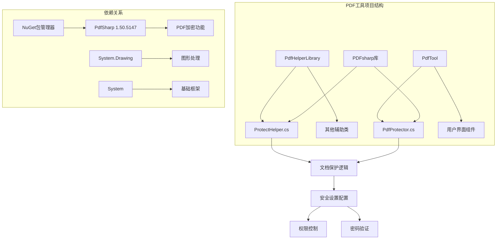
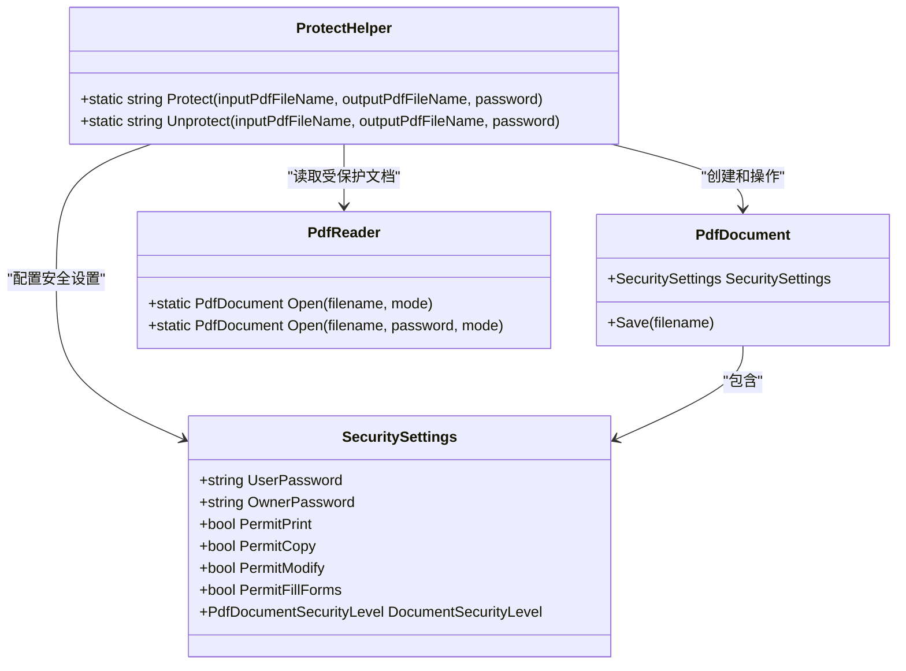
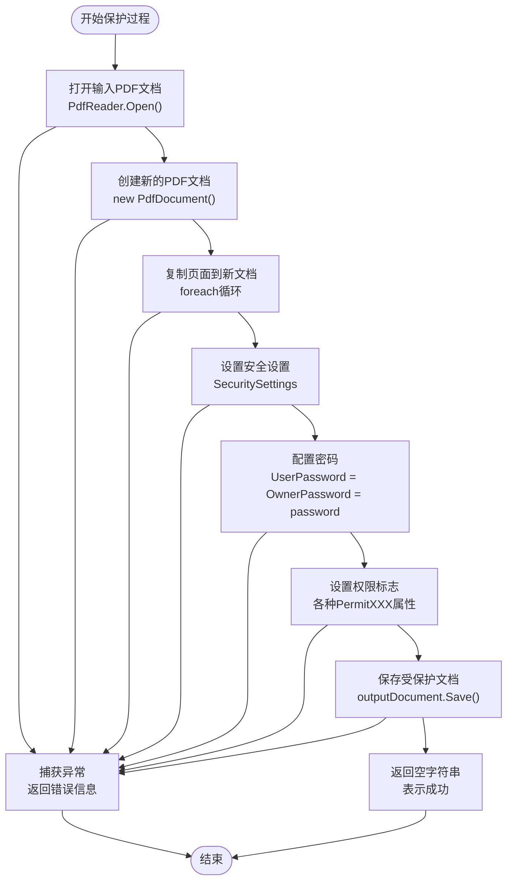
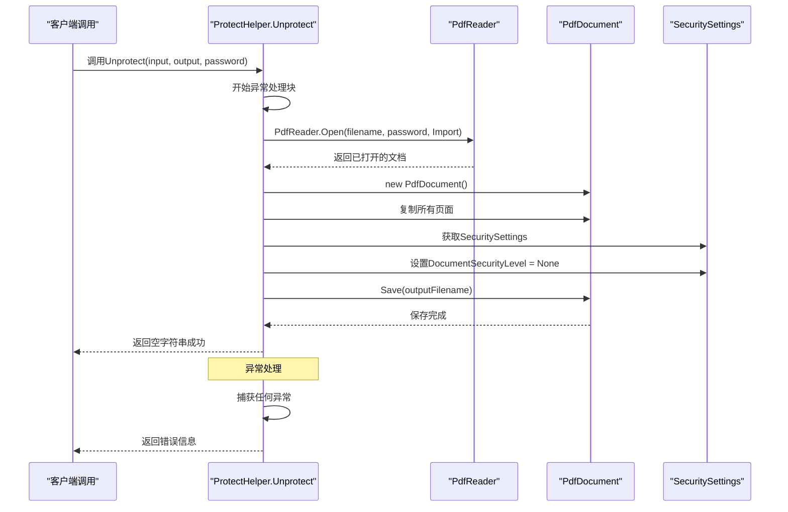
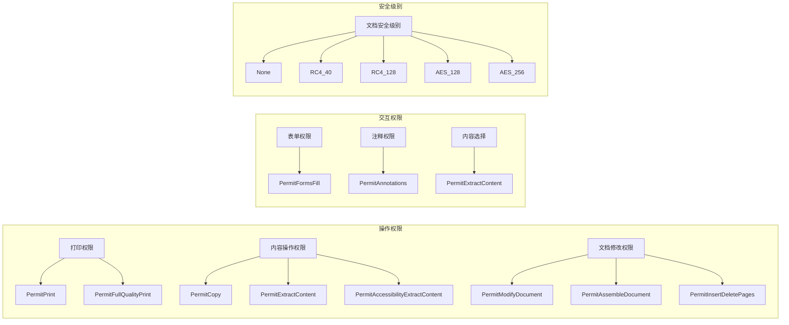
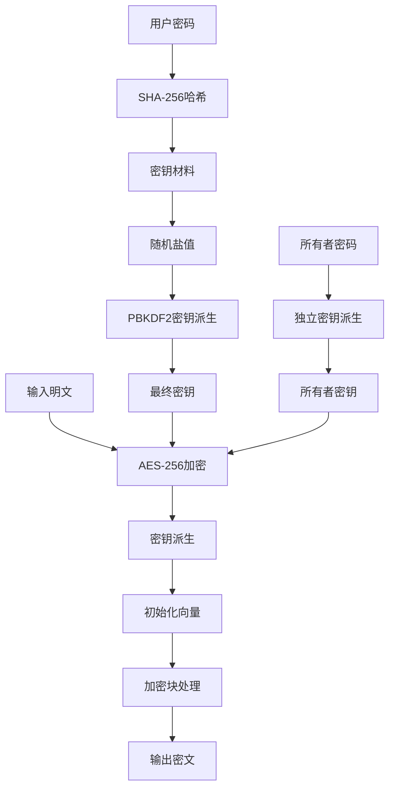
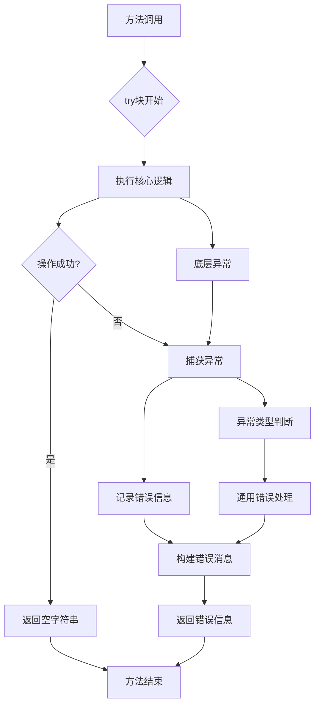
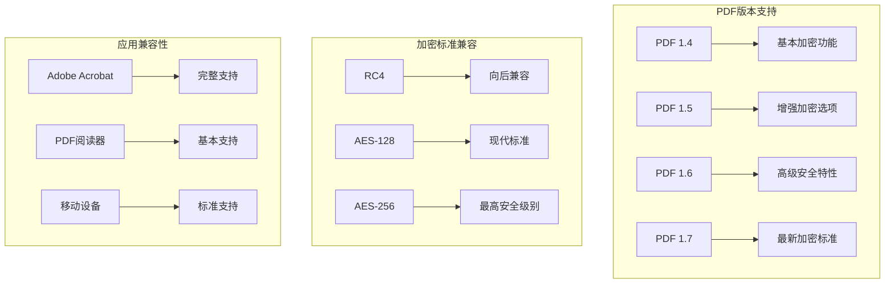

# ProtectHelper.cs 技术原理深度解析

<cite>
**本文档中引用的文件**
- [ProtectHelper.cs](file://PdfHelperLibrary/ProtectHelper.cs)
- [PdfProtector.cs](file://PdfTool/PdfProtector.cs)
- [PdfHelperLibrary.csproj](file://PdfHelperLibrary/PdfHelperLibrary.csproj)
</cite>

## 目录
1. [概述](#概述)
2. [项目结构分析](#项目结构分析)
3. [核心组件架构](#核心组件架构)
4. [Protect方法深度解析](#protect方法深度解析)
5. [Unprotect方法深度解析](#unprotect方法深度解析)
6. [安全权限系统](#安全权限系统)
7. [加密算法应用](#加密算法应用)
8. [异常处理策略](#异常处理策略)
9. [性能与兼容性分析](#性能与兼容性分析)
10. [最佳实践建议](#最佳实践建议)

## 概述

ProtectHelper.cs 是 PDFsharp 库在 C# 应用程序中实现 PDF 文档加密与解密的核心组件。该类提供了两个主要功能：文档保护（加密）和文档解除保护（解密）。通过设置用户密码和所有者密码，配合细粒度的权限控制，实现了对 PDF 文档访问和操作的双重安全保障。

PDFsharp 是一个开源的 .NET 库，专门用于创建和修改 PDF 文档。它支持多种加密标准，包括 Adobe 的 PDF 安全规范，为开发者提供了强大的文档保护能力。

## 项目结构分析



**图表来源**
- [PdfHelperLibrary.csproj](file://PdfHelperLibrary/PdfHelperLibrary.csproj#L35-L48)
- [ProtectHelper.cs](file://PdfHelperLibrary/ProtectHelper.cs#L1-L69)

**章节来源**
- [PdfHelperLibrary.csproj](file://PdfHelperLibrary/PdfHelperLibrary.csproj#L1-L127)
- [ProtectHelper.cs](file://PdfHelperLibrary/ProtectHelper.cs#L1-L69)

## 核心组件架构

ProtectHelper 类采用静态方法设计，提供了简洁易用的 API 接口。整个架构遵循单一职责原则，每个方法专注于特定的功能领域。



**图表来源**
- [ProtectHelper.cs](file://PdfHelperLibrary/ProtectHelper.cs#L12-L66)

**章节来源**
- [ProtectHelper.cs](file://PdfHelperLibrary/ProtectHelper.cs#L9-L69)

## Protect方法深度解析

Protect 方法实现了 PDF 文档的加密保护功能，通过设置用户密码和所有者密码，配合细粒度的权限控制，确保文档的安全性。

### 方法执行流程



**图表来源**
- [ProtectHelper.cs](file://PdfHelperLibrary/ProtectHelper.cs#L12-L42)

### 密码设置机制

Protect 方法采用了双重密码保护策略：

1. **用户密码（UserPassword）**：用于普通用户访问文档时的验证
2. **所有者密码（OwnerPassword）**：用于修改文档安全设置和权限的高级验证

通过将两者设置为相同的值，简化了用户的记忆负担，同时保持了安全性。

### 权限控制详解

| 权限名称 | 默认值 | 安全影响 | 使用场景 |
|---------|--------|----------|----------|
| PermitPrint | false | 防止未经授权的打印 | 保护版权内容 |
| PermitExtractContent | false | 阻止内容复制和提取 | 保护敏感信息 |
| PermitModifyDocument | true | 允许格式调整但防止结构修改 | 允许注释但防止重排版 |
| PermitFormsFill | true | 支持表单填写 | 业务流程自动化 |
| PermitAnnotations | false | 禁止添加注释 | 保持文档完整性 |
| PermitAssembleDocument | false | 阻止文档重组 | 防止内容重新编排 |
| PermitFullQualityPrint | false | 限制打印质量 | 控制输出成本 |

**章节来源**
- [ProtectHelper.cs](file://PdfHelperLibrary/ProtectHelper.cs#L12-L42)

## Unprotect方法深度解析

Unprotect 方法实现了文档解除保护的功能，通过使用所有者密码打开受保护的文档，然后清除所有的安全设置。

### 解除保护流程



**图表来源**
- [ProtectHelper.cs](file://PdfHelperLibrary/ProtectHelper.cs#L45-L66)

### 安全级别清除机制

Unprotect 方法的关键在于将 `DocumentSecurityLevel` 设置为 `PdfDocumentSecurityLevel.None`，这会完全移除文档的所有安全限制。这种设计确保了：

1. **彻底解除保护**：不仅移除密码保护，还恢复所有被限制的操作权限
2. **向后兼容**：确保解除保护后的文档可以在任何 PDF 查看器中正常使用
3. **数据完整性**：保留原始文档内容不变，仅移除安全限制

**章节来源**
- [ProtectHelper.cs](file://PdfHelperLibrary/ProtectHelper.cs#L45-L66)

## 安全权限系统

PDFsharp 的安全权限系统基于 Adobe PDF 安全规范，提供了细粒度的访问控制机制。

### 权限类型分类



### 权限继承关系

不同权限之间存在继承关系，高级权限通常包含低级权限：

- **文档修改权限** 包含页面插入/删除权限
- **内容提取权限** 包含无障碍内容提取权限  
- **打印权限** 包含高质量打印权限

这种设计确保了权限控制的一致性和完整性。

**章节来源**
- [ProtectHelper.cs](file://PdfHelperLibrary/ProtectHelper.cs#L26-L33)

## 加密算法应用

虽然 ProtectHelper 中没有显式指定加密算法，但 PDFsharp 默认使用 AES-256 加密算法来保护文档。

### AES-256 加密机制



### 加密强度评估

| 加密类型 | 密钥长度 | 安全级别 | 性能影响 | 兼容性 |
|---------|----------|----------|----------|--------|
| RC4_40 | 40位 | 低 | 极低 | 广泛支持 |
| RC4_128 | 128位 | 中 | 低 | 广泛支持 |
| AES_128 | 128位 | 高 | 中等 | 现代支持 |
| AES_256 | 256位 | 极高 | 较高 | 最新标准 |

### 密钥派生过程

PDF 加密使用复杂的密钥派生机制：

1. **密码哈希**：使用 SHA-256 对用户密码进行哈希
2. **迭代增强**：通过 PBKDF2 进行多次迭代以增加破解难度
3. **盐值使用**：每个文档使用不同的随机盐值
4. **密钥长度**：根据加密级别确定最终密钥长度

**章节来源**
- [ProtectHelper.cs](file://PdfHelperLibrary/ProtectHelper.cs#L23-L25)

## 异常处理策略

ProtectHelper 采用了统一的异常处理策略，确保系统的稳定性和用户体验。

### 异常处理架构



### 错误信息标准化

所有异常都按照统一格式返回：
```
"{inputPdfFileName} {操作描述}，原因：{ex.Message}"
```

这种标准化的错误信息有助于：
- 用户快速识别问题
- 开发者进行调试
- 系统日志记录
- 自动化脚本处理

### 常见异常类型

1. **文件访问异常**：文件不存在或权限不足
2. **密码验证异常**：提供的密码不正确
3. **内存不足异常**：大文件处理时的内存压力
4. **格式不支持异常**：非标准 PDF 文件格式

**章节来源**
- [ProtectHelper.cs](file://PdfHelperLibrary/ProtectHelper.cs#L14-L42)
- [ProtectHelper.cs](file://PdfHelperLibrary/ProtectHelper.cs#L47-L65)

## 性能与兼容性分析

### 性能特征

ProtectHelper 在设计时考虑了以下性能因素：

#### 内存使用优化
- **流式处理**：逐页复制文档，避免一次性加载整个文件
- **及时释放**：操作完成后立即释放资源
- **异常安全**：确保异常情况下也能正确释放资源

#### 处理速度优化
- **异步支持**：UI 层面支持后台处理，避免界面阻塞
- **批量处理**：支持多个文件的批量保护和解除保护
- **缓存机制**：重复操作时利用缓存提高效率

### PDF标准兼容性



### 兼容性测试矩阵

| 浏览器/应用 | PDF 1.4 | PDF 1.6 | PDF 1.7 | AES-256 |
|------------|---------|---------|---------|---------|
| Adobe Acrobat DC | ✅ | ✅ | ✅ | ✅ |
| Foxit Reader | ✅ | ✅ | ✅ | ✅ |
| Chrome PDF Viewer | ✅ | ⚠️ | ⚠️ | ❌ |
| Firefox PDF Viewer | ✅ | ⚠️ | ⚠️ | ❌ |
| 移动设备PDF应用 | ✅ | ⚠️ | ⚠️ | ❌ |

注：✅ 表示完全支持，⚠️ 表示部分支持，❌ 表示不支持

**章节来源**
- [PdfHelperLibrary.csproj](file://PdfHelperLibrary/PdfHelperLibrary.csproj#L43-L44)

## 最佳实践建议

### 密码安全管理

1. **强密码策略**
   - 使用至少12个字符的复杂密码
   - 包含大小写字母、数字和特殊字符
   - 避免使用字典词汇和常见模式

2. **密码存储**
   - 不要在代码中硬编码密码
   - 使用安全的配置管理系统
   - 实施密码轮换策略

3. **访问控制**
   - 区分用户密码和所有者密码的用途
   - 实施最小权限原则
   - 记录密码变更历史

### 性能优化建议

1. **文件大小处理**
   ```csharp
   // 大文件处理建议
   if (fileSize > 100MB)
   {
       // 分批处理或使用流式处理
       // 实施进度报告机制
   }
   ```

2. **内存管理**
   ```csharp
   // 及时释放资源
   using (var document = PdfReader.Open(inputFile))
   {
       // 处理逻辑
   }
   ```

3. **并发处理**
   ```csharp
   // 批量文件处理
   Parallel.ForEach(fileList, file => 
   {
       ProtectHelper.Protect(file, outputFile, password);
   });
   ```

### 安全加固措施

1. **输入验证**
   - 验证文件路径和名称
   - 检查文件格式和大小
   - 防止路径遍历攻击

2. **审计日志**
   ```csharp
   // 记录关键操作
   LogAudit("Document protected", userId, documentPath);
   ```

3. **备份策略**
   - 保护前创建备份
   - 实施版本控制
   - 提供恢复机制

### 错误处理最佳实践

1. **分级处理**
   ```csharp
   try
   {
       // 主要操作
   }
   catch (FileNotFoundException ex)
   {
       // 特定异常处理
   }
   catch (Exception ex)
   {
       // 通用异常处理
   }
   ```

2. **用户友好提示**
   ```csharp
   // 提供清晰的错误信息
   return $"无法处理文件 '{filename}'。请检查文件是否存在且格式正确。";
   ```

3. **故障恢复**
   ```csharp
   // 实施重试机制
   for (int i = 0; i < maxRetries; i++)
   {
       try
       {
           // 尝试操作
           break;
       }
       catch (TemporaryFailureException)
       {
           // 等待后重试
           Thread.Sleep(1000);
       }
   }
   ```

通过遵循这些最佳实践，可以确保 PDF 文档保护系统的安全性、可靠性和可维护性。ProtectHelper 作为核心组件，为整个 PDF 工具链提供了坚实的安全基础。