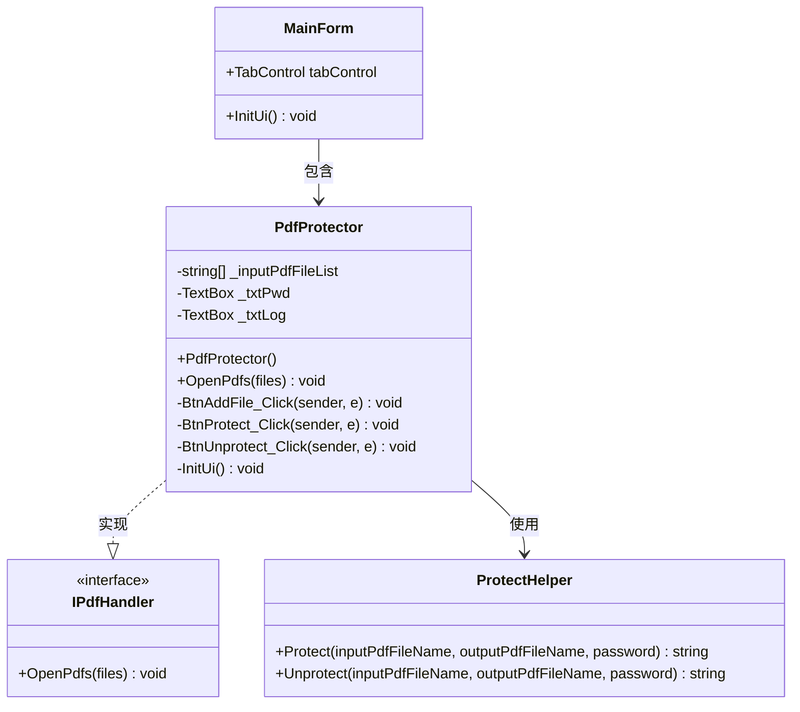
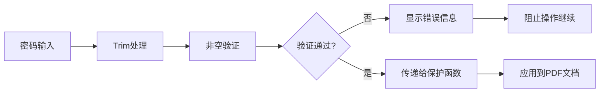
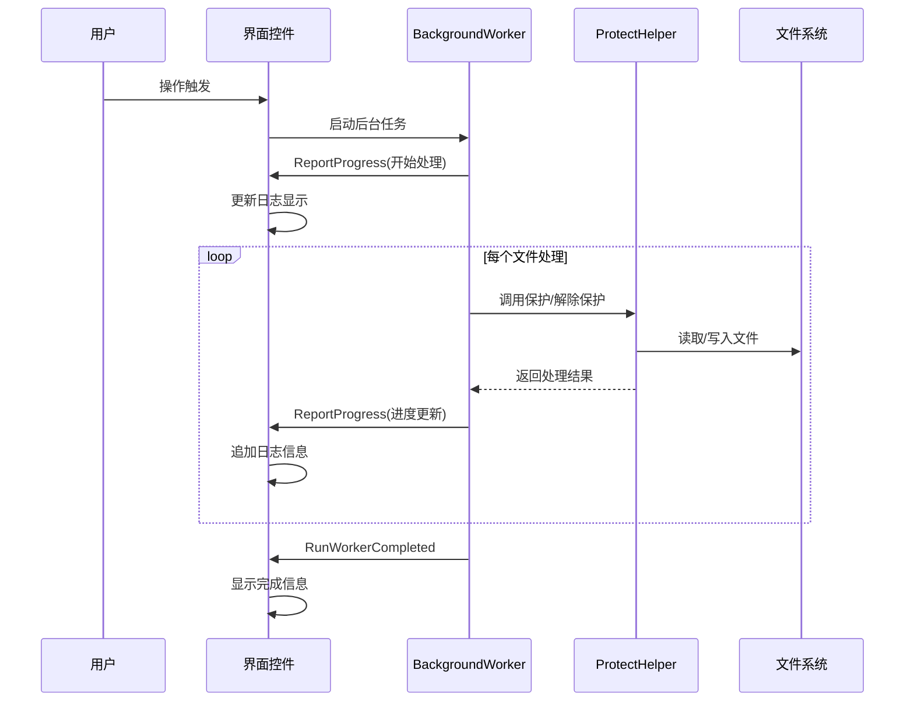
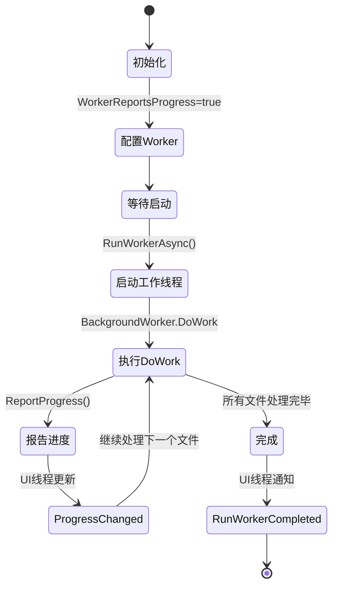

# PDF保护器操作使用指南

<cite>
**本文档引用的文件**
- [PdfProtector.cs](file://PdfTool/PdfProtector.cs)
- [PdfProtector.Designer.cs](file://PdfTool/PdfProtector.Designer.cs)
- [ProtectHelper.cs](file://PdfHelperLibrary/ProtectHelper.cs)
- [Common.cs](file://PdfTool/Common.cs)
- [Config.cs](file://PdfTool/Config.cs)
- [MainForm.cs](file://PdfTool/MainForm.cs)
</cite>

## 目录
1. [简介](#简介)
2. [系统架构概览](#系统架构概览)
3. [界面布局与控件说明](#界面布局与控件说明)
4. [核心功能操作流程](#核心功能操作流程)
5. [密码设置与验证](#密码设置与验证)
6. [日志输出与反馈信息](#日志输出与反馈信息)
7. [后台工作线程机制](#后台工作线程机制)
8. [实际应用场景示例](#实际应用场景示例)
9. [故障排除指南](#故障排除指南)
10. [最佳实践建议](#最佳实践建议)

## 简介

PDF保护器是PdfTool应用程序中的一个专门模块，用于对PDF文档进行加密保护和解除保护操作。该组件采用现代化的UI设计，支持批量处理、后台异步执行，并提供了直观的操作界面，确保用户能够轻松地保护敏感文档。

### 主要功能特性
- **双重保护模式**：支持PDF加密（添加密码保护）和解除保护（移除密码）
- **批量处理能力**：可同时处理多个PDF文件
- **后台异步处理**：避免界面冻结，提升用户体验
- **实时进度反馈**：详细的日志输出，显示处理状态和结果
- **智能文件命名**：自动生成保护后和解除保护后的文件名

## 系统架构概览

PDF保护器采用模块化设计，遵循Windows Forms应用程序的标准架构模式。



**图表来源**
- [PdfProtector.cs](file://PdfTool/PdfProtector.cs#L14-L171)
- [Common.cs](file://PdfTool/Common.cs#L13-L16)
- [ProtectHelper.cs](file://PdfHelperLibrary/ProtectHelper.cs#L10-L69)

**章节来源**
- [PdfProtector.cs](file://PdfTool/PdfProtector.cs#L1-L171)
- [Common.cs](file://PdfTool/Common.cs#L1-L18)

## 界面布局与控件说明

PDF保护器的界面设计简洁直观，主要包含以下核心控件：

### 控件布局结构

```mermaid
graph TB
subgraph "PDF保护器界面"
A[添加文件按钮] --> B[密码输入框]
B --> C[加密按钮]
C --> D[解密按钮]
D --> E[日志输出区域]
end
subgraph "控件属性"
F[AutoSize: True<br/>Location: 动态计算<br/>Parent: UserControl]
G[ReadOnly: False<br/>Multiline: False<br/>Width: 自适应]
H[AutoSize: True<br/>Location: 密码框右侧<br/>Text: "加密"]
I[AutoSize: True<br/>Location: 加密按钮右侧<br/>Text: "解密"]
J[Anchor: 四边锚定<br/>ReadOnly: True<br/>ScrollBars: Both<br/>WordWrap: False]
end
A -.-> F
B -.-> G
C -.-> H
D -.-> I
E -.-> J
```

**图表来源**
- [PdfProtector.cs](file://PdfTool/PdfProtector.cs#L121-L167)
- [Config.cs](file://PdfTool/Config.cs#L5-L6)

### 控件详细说明

| 控件名称 | 类型 | 位置计算 | 功能描述 |
|---------|------|----------|----------|
| 添加文件按钮 | Button | 左上角固定位置 | 打开文件选择对话框，支持多选PDF文件 |
| 密码输入框 | TextBox | 添加文件按钮右侧 | 输入保护密码，支持空白字符过滤 |
| 加密按钮 | Button | 密码框右侧 | 对选中的PDF文件应用密码保护 |
| 解密按钮 | Button | 加密按钮右侧 | 移除PDF文件的密码保护 |
| 日志输出区域 | TextBox | 底部全屏区域 | 显示操作过程和结果信息 |

**章节来源**
- [PdfProtector.cs](file://PdfTool/PdfProtector.cs#L121-L167)
- [Config.cs](file://PdfTool/Config.cs#L1-L9)

## 核心功能操作流程

### 添加文件操作流程

```mermaid
flowchart TD
Start([点击"添加文件"按钮]) --> OpenDialog[打开文件选择对话框]
OpenDialog --> CheckSelection{检查文件选择}
CheckSelection --> |取消选择| End([结束])
CheckSelection --> |确认选择| ValidateFiles[验证PDF文件格式]
ValidateFiles --> ClearLog[清空日志区域]
ClearLog --> ClearList[清空文件列表]
ClearList --> AddFiles[添加选中文件到列表]
AddFiles --> DisplayFiles[在日志中显示文件列表]
DisplayFiles --> End
```

**图表来源**
- [PdfProtector.cs](file://PdfTool/PdfProtector.cs#L45-L49)

### 加密操作流程

```mermaid
flowchart TD
Start([点击"加密"按钮]) --> CheckPassword{检查密码输入}
CheckPassword --> |密码为空| ShowError[显示错误信息："未输入保护密码"]
CheckPassword --> |密码有效| CreateWorker[创建BackgroundWorker]
CreateWorker --> SetupDoWork[设置DoWork事件处理器]
SetupDoWork --> SetupProgress[设置ProgressChanged事件]
SetupProgress --> SetupComplete[设置RunWorkerCompleted事件]
SetupComplete --> StartWorker[启动后台工作线程]
StartWorker --> ShowStatus[显示："正在保护，请稍候..."]
subgraph "后台处理流程"
LoopFiles[遍历文件列表]
LoopFiles --> BuildFileName[构建保护文件名<br/>原文件名+_protected.pdf]
BuildFileName --> CallProtect[调用ProtectHelper.Protect]
CallProtect --> CheckResult{检查处理结果}
CheckResult --> |成功| LogSuccess[记录成功信息]
CheckResult --> |失败| LogError[记录错误信息]
LogSuccess --> ReportProgress[报告进度更新]
LogError --> ReportProgress
ReportProgress --> NextFile{还有文件?}
NextFile --> |是| LoopFiles
NextFile --> |否| Complete[标记完成]
end
ShowError --> End([结束])
ShowStatus --> LoopFiles
Complete --> End
```

**图表来源**
- [PdfProtector.cs](file://PdfTool/PdfProtector.cs#L52-L83)
- [ProtectHelper.cs](file://PdfHelperLibrary/ProtectHelper.cs#L12-L37)

### 解密操作流程

```mermaid
flowchart TD
Start([点击"解密"按钮]) --> CheckPassword{检查密码输入}
CheckPassword --> |密码为空| ShowError[显示错误信息："未输入密码"]
CheckPassword --> |密码有效| CreateWorker[创建BackgroundWorker]
CreateWorker --> SetupDoWork[设置DoWork事件处理器]
SetupDoWork --> SetupProgress[设置ProgressChanged事件]
SetupProgress --> SetupComplete[设置RunWorkerCompleted事件]
SetupComplete --> StartWorker[启动后台工作线程]
StartWorker --> ShowStatus[显示："正在解除保护，请稍候..."]
subgraph "后台处理流程"
LoopFiles[遍历文件列表]
LoopFiles --> BuildFileName[构建解除保护文件名<br/>原文件名+_unprotected.pdf]
BuildFileName --> CallUnprotect[调用ProtectHelper.Unprotect]
CallUnprotect --> CheckResult{检查处理结果}
CheckResult --> |成功| LogSuccess[记录成功信息]
CheckResult --> |失败| LogError[记录错误信息]
LogSuccess --> ReportProgress[报告进度更新]
LogError --> ReportProgress
ReportProgress --> NextFile{还有文件?}
NextFile --> |是| LoopFiles
NextFile --> |否| Complete[标记完成]
end
ShowError --> End([结束])
ShowStatus --> LoopFiles
Complete --> End
```

**图表来源**
- [PdfProtector.cs](file://PdfTool/PdfProtector.cs#L86-L118)
- [ProtectHelper.cs](file://PdfHelperLibrary/ProtectHelper.cs#L45-L60)

**章节来源**
- [PdfProtector.cs](file://PdfTool/PdfProtector.cs#L45-L118)
- [ProtectHelper.cs](file://PdfHelperLibrary/ProtectHelper.cs#L12-L69)

## 密码设置与验证

### 密码输入规范

PDF保护器对密码输入有严格的验证机制：

#### 密码验证规则
- **非空检查**：密码不能为空，必须输入至少一个字符
- **空白字符处理**：自动去除首尾空白字符，但中间的空白字符会被保留
- **字符类型**：支持所有Unicode字符，包括特殊符号和空格

#### 密码安全性考虑



**图表来源**
- [PdfProtector.cs](file://PdfTool/PdfProtector.cs#L54-L57)
- [PdfProtector.cs](file://PdfTool/PdfProtector.cs#L88-L91)

### 密码确认的重要性

在处理敏感文档时，密码确认是至关重要的安全措施：

#### 密码确认最佳实践
1. **双重验证**：在输入密码后，建议用户重新输入确认
2. **密码强度**：推荐使用包含大小写字母、数字和特殊符号的组合
3. **密码记忆**：妥善保管密码，避免使用简单易猜的密码
4. **备份策略**：对于重要文档，建议建立密码备份机制

**章节来源**
- [PdfProtector.cs](file://PdfTool/PdfProtector.cs#L54-L91)

## 日志输出与反馈信息

### 日志系统架构

PDF保护器的日志系统采用实时更新机制，为用户提供详细的处理反馈：



**图表来源**
- [PdfProtector.cs](file://PdfTool/PdfProtector.cs#L60-L83)
- [PdfProtector.cs](file://PdfTool/PdfProtector.cs#L94-L118)

### 日志信息分类

#### 成功操作日志
- **文件添加**：显示成功添加的PDF文件路径
- **保护完成**：`{文件名} 保护完成，生成文件：{新文件名}`
- **解除保护完成**：`{文件名} 解除保护完成，生成文件：{新文件名}`
- **操作完成**：`保护完成` 或 `解除保护完成`

#### 错误信息日志
- **密码错误**：显示密码验证失败信息
- **文件访问错误**：如文件不存在、权限不足等
- **处理失败**：具体的技术错误信息

#### 状态提示日志
- **开始处理**：`正在保护，请稍候...` 或 `正在解除保护，请稍候...`
- **进度更新**：实时显示当前处理的文件状态

### 文件命名规则

#### 保护文件命名
- **原始文件**：`original.pdf`
- **保护后文件**：`original_protected.pdf`
- **命名策略**：在文件名后追加`_protected`后缀

#### 解除保护文件命名
- **原始文件**：`original_protected.pdf`（已加密的文件）
- **解除保护后文件**：`original_unprotected.pdf`
- **命名策略**：在文件名后追加`_unprotected`后缀

**章节来源**
- [PdfProtector.cs](file://PdfTool/PdfProtector.cs#L65-L67)
- [PdfProtector.cs](file://PdfTool/PdfProtector.cs#L99-L101)

## 后台工作线程机制

### BackgroundWorker架构

PDF保护器采用BackgroundWorker实现异步处理，确保界面响应性：



**图表来源**
- [PdfProtector.cs](file://PdfTool/PdfProtector.cs#L60-L83)
- [PdfProtector.cs](file://PdfTool/PdfProtector.cs#L94-L118)

### 异步处理优势

#### 性能优化
- **界面不冻结**：用户可以随时中断操作或进行其他操作
- **实时反馈**：处理进度实时更新，提升用户体验
- **资源管理**：合理利用系统资源，避免阻塞主线程

#### 错误处理机制
- **异常捕获**：后台线程中的异常不会影响主界面
- **状态恢复**：即使发生错误，界面也能正常关闭和恢复

### 多线程通信

#### 主线程与后台线程交互
- **DoWork事件**：后台线程执行耗时操作
- **ProgressChanged事件**：从后台线程向主线程传递进度信息
- **RunWorkerCompleted事件**：通知操作完成状态

**章节来源**
- [PdfProtector.cs](file://PdfTool/PdfProtector.cs#L60-L118)

## 实际应用场景示例

### 场景一：保护敏感合同文档

#### 操作步骤详解

1. **准备阶段**
   - 收集需要保护的合同PDF文件
   - 确保文件格式为标准PDF格式
   - 准备强密码（推荐包含字母、数字和特殊符号）

2. **添加文件**
   ```mermaid
flowchart LR
A[点击"添加文件"按钮] --> B[选择合同文件]
B --> C[确认多选]
C --> D[文件列表显示]
```
   **操作示例**：
   - 选择文件：`Contract_Agreement.pdf`, `Financial_Report.pdf`, `NDA_Contract.pdf`
   - 界面显示：每行显示一个文件路径

3. **设置密码**
   - 输入密码：`Secure@2024!Contract`
   - 确认密码：重新输入相同密码
   - 注意事项：密码区分大小写，包含特殊字符

4. **执行加密**
   - 点击"加密"按钮
   - 等待后台处理完成
   - 查看日志确认处理结果

5. **验证结果**
   - 新文件生成：`Contract_Agreement_protected.pdf`
   - 原始文件保持不变
   - 测试密码有效性

#### 实际效果展示

| 操作前 | 操作后 |
|--------|--------|
| `Contract_Agreement.pdf`（可编辑） | `Contract_Agreement_protected.pdf`（密码保护） |
| 可直接打开编辑 | 需要密码才能打开 |
| 允许复制内容 | 禁止复制内容 |
| 允许打印 | 禁止打印 |

### 场景二：批量解除保护财务报表

#### 操作步骤详解

1. **收集已加密文件**
   - 获取多个被密码保护的财务报表
   - 确保拥有正确的解锁密码

2. **批量处理流程**
   ```mermaid
graph TD
A[添加多个已加密报表] --> B[输入统一密码]
B --> C[点击"解密"按钮]
C --> D[后台批量处理]
D --> E[生成解除保护版本]
E --> F[验证文件可用性]
```

3. **处理结果**
   - 原文件：`Q1_Financial_Report_protected.pdf`
   - 新文件：`Q1_Financial_Report_unprotected.pdf`
   - 文件可直接编辑和打印

### 场景三：企业文档安全管理

#### 最佳实践流程

1. **文档分类**
   - 敏感文档：合同、财务、技术秘密
   - 一般文档：公告、培训资料

2. **保护策略**
   - 敏感文档：启用完整保护，禁止复制和打印
   - 一般文档：允许基本编辑，限制高级功能

3. **密码管理**
   - 建立密码库管理系统
   - 定期更换重要文档密码
   - 建立密码找回机制

**章节来源**
- [PdfProtector.cs](file://PdfTool/PdfProtector.cs#L32-L41)
- [ProtectHelper.cs](file://PdfHelperLibrary/ProtectHelper.cs#L12-L37)

## 故障排除指南

### 常见问题及解决方案

#### 问题1：密码输入无效

**症状表现**：
- 点击"加密"或"解密"按钮后无反应
- 日志显示"未输入保护密码"或"未输入密码"

**解决步骤**：
1. 检查密码输入框是否为空
2. 确认密码输入后按回车键确认
3. 验证密码长度是否符合要求（建议8位以上）

**预防措施**：
- 在输入密码前先选择文件
- 使用密码管理器辅助输入

#### 问题2：文件处理失败

**症状表现**：
- 日志显示"文件处理失败"或具体错误信息
- 新文件未生成

**可能原因**：
- 原始文件损坏或格式不正确
- 目标目录权限不足
- 磁盘空间不足

**解决步骤**：
1. 检查原始文件是否可正常打开
2. 确认目标目录有写入权限
3. 检查磁盘剩余空间
4. 尝试使用管理员权限运行程序

#### 问题3：界面无响应

**症状表现**：
- 点击按钮后界面卡死
- 无法进行其他操作

**原因分析**：
- 文件过大导致处理时间过长
- 系统资源不足
- 死锁或异常情况

**解决步骤**：
1. 等待处理完成（观察日志输出）
2. 如果长时间无响应，尝试关闭程序重启
3. 分批处理大文件

### 性能优化建议

#### 处理速度优化
- **文件大小控制**：单个文件建议不超过100MB
- **内存使用监控**：处理大量文件时注意内存占用
- **并发控制**：避免同时处理过多文件

#### 系统资源管理
- **CPU使用率**：合理安排系统负载
- **磁盘I/O**：选择SSD存储提高处理速度
- **网络资源**：确保网络连接稳定（如涉及远程文件）

**章节来源**
- [PdfProtector.cs](file://PdfTool/PdfProtector.cs#L54-L57)
- [PdfProtector.cs](file://PdfTool/PdfProtector.cs#L88-L91)

## 最佳实践建议

### 安全操作规范

#### 密码管理最佳实践
1. **密码复杂度**
   - 长度：至少8位字符
   - 包含：大小写字母、数字、特殊符号
   - 排除：常见单词、个人信息

2. **密码存储**
   - 使用密码管理器
   - 建立密码备份机制
   - 定期更换重要文档密码

3. **访问控制**
   - 限制密码知晓范围
   - 建立权限审批流程
   - 记录密码变更历史

### 文档管理策略

#### 文件组织规范
- **命名约定**：使用清晰的文件命名规则
- **版本控制**：建立文档版本管理机制
- **备份策略**：定期备份重要文档

#### 批量处理建议
- **文件分组**：按类型和重要性分组处理
- **进度监控**：关注处理进度，及时发现异常
- **质量检查**：处理完成后验证文件完整性

### 技术维护要点

#### 软件维护
- **定期更新**：保持软件版本最新
- **依赖管理**：确保相关库文件完整
- **性能监控**：关注处理效率和资源使用

#### 数据安全
- **加密传输**：重要文档传输时使用加密通道
- **访问审计**：记录文档访问和修改行为
- **灾难恢复**：建立数据恢复预案

### 用户体验优化

#### 操作便利性
- **快捷操作**：熟悉常用功能的快捷方式
- **批量处理**：充分利用批量处理功能
- **进度跟踪**：关注日志输出，及时了解处理状态

#### 故障应对
- **冷静处理**：遇到问题保持冷静，按步骤排查
- **记录问题**：详细记录遇到的问题和解决过程
- **寻求帮助**：必要时联系技术支持团队

通过遵循这些最佳实践，用户可以更安全、高效地使用PDF保护器功能，确保文档的安全性和处理效率。