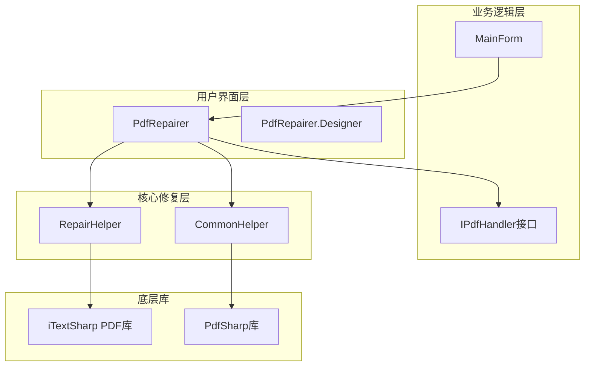
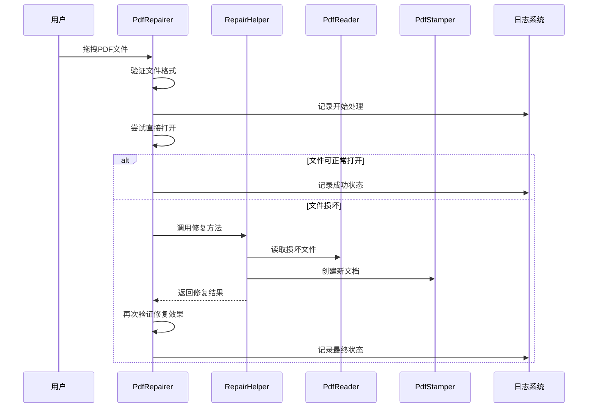
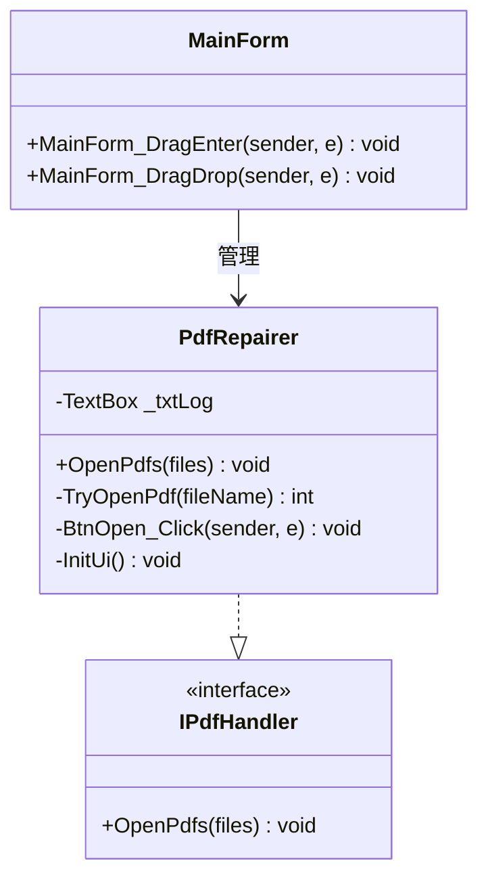
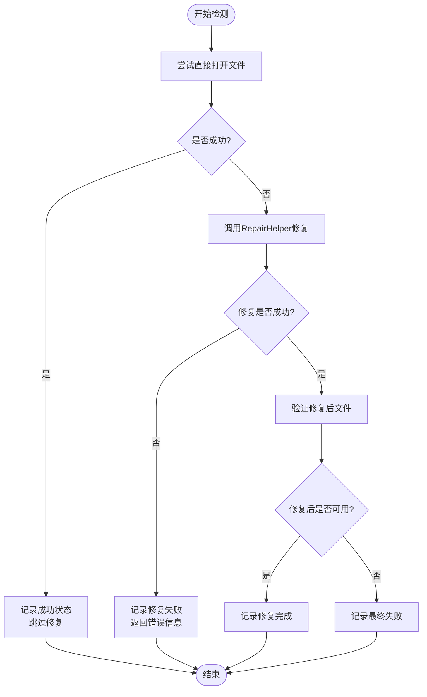
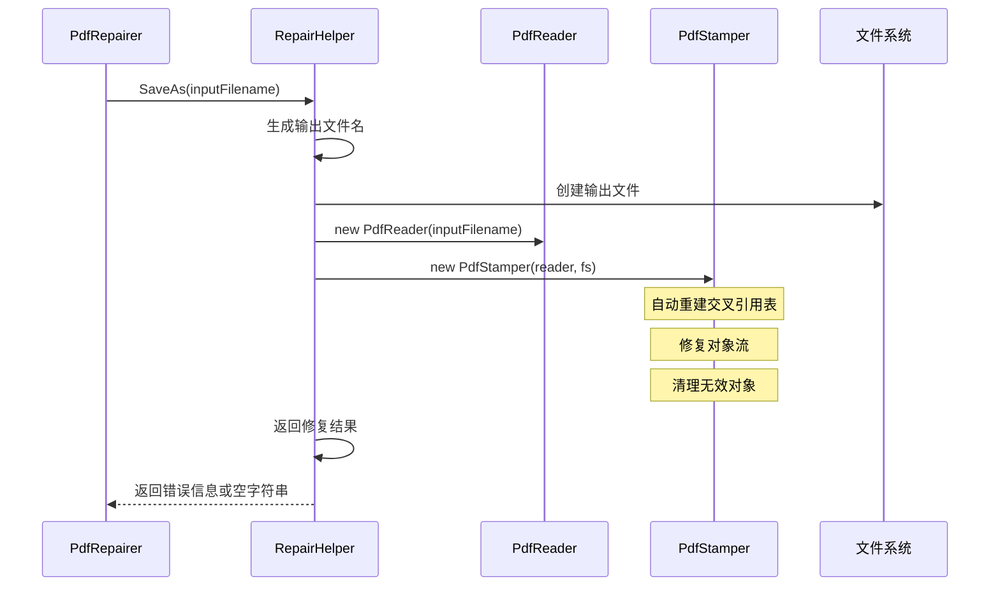
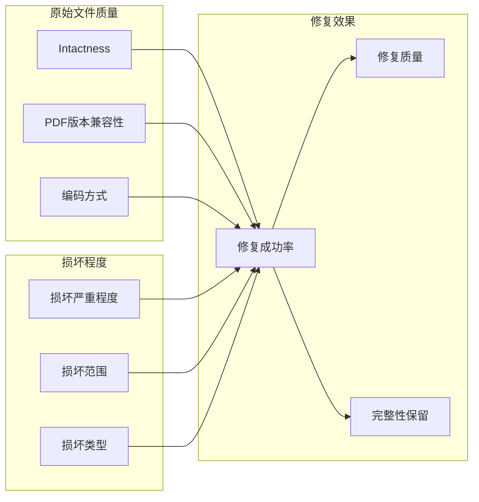
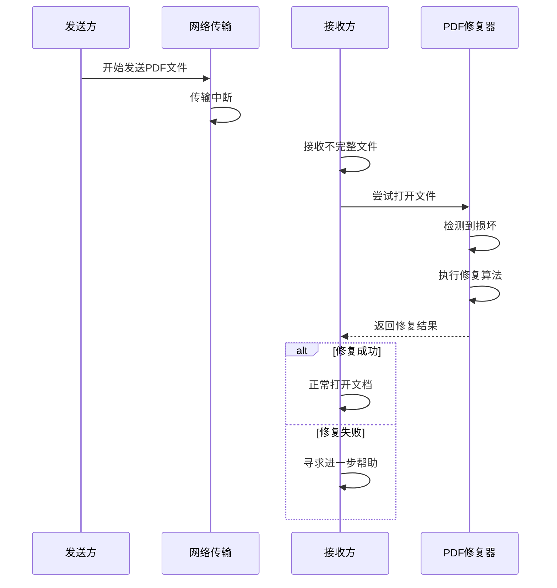

# PDF修复器

<cite>
**本文档中引用的文件**
- [PdfRepairer.cs](file://PdfTool/PdfRepairer.cs)
- [PdfRepairer.Designer.cs](file://PdfTool/PdfRepairer.Designer.cs)
- [RepairHelper.cs](file://PdfHelperLibrary2/RepairHelper.cs)
- [CommonHelper.cs](file://PdfHelperLibrary/CommonHelper.cs)
- [MainForm.cs](file://PdfTool/MainForm.cs)
- [Common.cs](file://PdfTool/Common.cs)
- [ImageExtractHelper.cs](file://PdfHelperLibrary/ImageExtractHelper.cs)
- [Program.cs](file://PdfConsoleApp/Program.cs)
</cite>

## 目录
1. [简介](#简介)
2. [项目结构](#项目结构)
3. [核心组件](#核心组件)
4. [架构概览](#架构概览)
5. [详细组件分析](#详细组件分析)
6. [损坏类型与修复策略](#损坏类型与修复策略)
7. [使用场景与最佳实践](#使用场景与最佳实践)
8. [性能考虑](#性能考虑)
9. [故障排除指南](#故障排除指南)
10. [结论](#结论)

## 简介

PDF修复器是PDF工具套件中的核心组件，专门用于检测和修复损坏的PDF文档。该系统采用双重检测机制，结合用户界面反馈和底层修复算法，能够有效处理多种类型的PDF损坏情况，包括头文件损坏、索引丢失、交叉引用表错误等常见问题。

## 项目结构

PDF修复器功能分布在多个模块中，形成了清晰的分层架构：

**图表来源**
- [PdfRepairer.cs](file://PdfTool/PdfRepairer.cs#L1-L111)
- [MainForm.cs](file://PdfTool/MainForm.cs#L1-L194)
- [RepairHelper.cs](file://PdfHelperLibrary2/RepairHelper.cs#L1-L40)

**章节来源**
- [PdfRepairer.cs](file://PdfTool/PdfRepairer.cs#L1-L111)
- [MainForm.cs](file://PdfTool/MainForm.cs#L1-L194)

## 核心组件

### PdfRepairer主控制器

PdfRepairer是PDF修复功能的主要用户界面组件，实现了IPdfHandler接口，提供直观的拖拽式操作和实时进度反馈。

主要功能特性：
- 支持多文件同时修复
- 实时日志记录和状态显示
- 拖拽式文件操作
- 自动备份和命名规则

### RepairHelper修复引擎

RepairHelper是底层修复算法的核心实现，基于iTextSharp库提供专业的PDF修复能力。

核心修复流程：
1. 文件读取和验证
2. 交叉引用表重建
3. 对象流修复
4. 无效对象清理
5. 新文档生成

### CommonHelper辅助工具

CommonHelper提供基础的PDF文档操作功能，特别是页数检测和基本格式验证。

**章节来源**
- [PdfRepairer.cs](file://PdfTool/PdfRepairer.cs#L15-L111)
- [RepairHelper.cs](file://PdfHelperLibrary2/RepairHelper.cs#L10-L40)
- [CommonHelper.cs](file://PdfHelperLibrary/CommonHelper.cs#L10-L29)

## 架构概览

PDF修复器采用分层架构设计，确保了良好的可维护性和扩展性：

**图表来源**
- [PdfRepairer.cs](file://PdfTool/PdfRepairer.cs#L32-L68)
- [RepairHelper.cs](file://PdfHelperLibrary2/RepairHelper.cs#L12-L36)

## 详细组件分析

### 用户界面设计

PdfRepairer采用了现代化的Windows Forms设计，提供了直观的操作体验：

**图表来源**
- [PdfRepairer.cs](file://PdfTool/PdfRepairer.cs#L15-L111)
- [Common.cs](file://PdfTool/Common.cs#L12-L16)
- [MainForm.cs](file://PdfTool/MainForm.cs#L32-L60)

#### 界面组件布局

用户界面包含以下关键元素：
- **打开按钮**：支持多选PDF文件
- **日志文本框**：实时显示处理状态和错误信息
- **拖拽区域**：支持直接拖拽文件到窗口
- **状态指示器**：显示当前处理进度

#### 进度反馈机制

系统实现了多层次的进度反馈：

1. **文件级反馈**：每个文件处理前后的状态变化
2. **操作级反馈**：修复过程中的关键步骤提示
3. **错误级反馈**：详细的错误信息和解决方案建议

**章节来源**
- [PdfRepairer.cs](file://PdfTool/PdfRepairer.cs#L74-L107)

### 损坏检测机制

PdfRepairer采用双重检测策略，确保准确识别损坏文件：

**图表来源**
- [PdfRepairer.cs](file://PdfTool/PdfRepairer.cs#L32-L68)

#### 检测算法实现

检测过程的核心逻辑体现在TryOpenPdf方法中：

- **页数检测**：通过CommonHelper.GetPageCount验证文档结构完整性
- **异常捕获**：捕获PdfReaderException等特定异常类型
- **错误分类**：根据异常类型判断损坏程度
- **状态返回**：返回-1表示失败，非负值表示成功页数

**章节来源**
- [PdfRepairer.cs](file://PdfTool/PdfRepairer.cs#L57-L70)
- [CommonHelper.cs](file://PdfHelperLibrary/CommonHelper.cs#L11-L28)

### 修复算法详解

RepairHelper实现了基于iTextSharp的专业修复算法：

**图表来源**
- [RepairHelper.cs](file://PdfHelperLibrary2/RepairHelper.cs#L12-L36)

#### 修复策略分析

RepairHelper采用的修复策略包括：

1. **重新构建交叉引用表**：自动扫描和重建对象引用关系
2. **对象流修复**：验证和修复压缩对象流的完整性
3. **无效对象清理**：移除损坏或孤立的对象引用
4. **元数据重建**：恢复丢失的文档元数据信息

#### 错误处理机制

修复过程实现了完善的错误处理：

- **异常捕获**：捕获所有可能的修复过程中异常
- **错误信息返回**：提供详细的错误描述和可能的解决方案
- **文件保护**：确保原文件在修复失败时不被修改

**章节来源**
- [RepairHelper.cs](file://PdfHelperLibrary2/RepairHelper.cs#L12-L40)

## 损坏类型与修复策略

### 支持的损坏类型

PDF修复器能够处理多种常见的PDF损坏类型：

| 损坏类型 | 描述 | 修复成功率 | 影响范围 |
|---------|------|-----------|----------|
| 头文件损坏 | PDF头部标识符丢失或损坏 | 高 | 全局 |
| 索引丢失 | 文档目录结构损坏 | 中 | 结构化内容 |
| 交叉引用表错误 | 对象引用关系混乱 | 中 | 对象访问 |
| 对象流损坏 | 压缩对象数据损坏 | 低 | 特定对象 |
| 字体嵌入问题 | 字体文件引用失效 | 高 | 文本渲染 |
| 图像数据损坏 | 图像流数据不完整 | 中 | 图像显示 |

### 修复成功率影响因素

修复成功率受到多种因素的影响：

#### 损坏程度评估

系统通过以下指标评估损坏程度：

- **页数完整性**：文档总页数是否可正常读取
- **对象可访问性**：关键对象是否可正常访问
- **数据流完整性**：压缩数据流是否可解压
- **元数据可用性**：文档属性和结构信息是否完整

#### 预防措施建议

为了提高PDF文档的可靠性，建议采取以下预防措施：

1. **定期备份**：建立完整的文档备份策略
2. **版本控制**：对重要文档实施版本管理
3. **传输安全**：使用可靠的传输协议
4. **格式标准化**：统一PDF生成标准
5. **定期检查**：建立文档健康检查机制

## 使用场景与最佳实践

### 典型使用场景

#### 传输中断的PDF文件修复

当PDF文件在网络传输过程中发生中断时，经常会出现各种损坏现象：

**图表来源**
- [PdfRepairer.cs](file://PdfTool/PdfRepairer.cs#L32-L68)

#### 批量文档修复

对于大量文档的批量修复，系统提供了高效的处理机制：

- **并发处理**：支持多文件同时处理
- **进度跟踪**：实时显示处理进度
- **错误汇总**：集中显示所有错误信息
- **自动重试**：对部分失败的文件提供重试机制

#### 文档迁移后的修复

在不同系统间迁移PDF文档时，经常会出现兼容性问题：

- **格式转换**：处理不同PDF版本间的差异
- **字体映射**：解决字体缺失问题
- **图像优化**：修复图像数据损坏
- **元数据同步**：保持文档属性一致性

### 最佳实践建议

#### 修复前准备

1. **文件备份**：在修复前创建原始文件的备份副本
2. **环境检查**：确保系统环境满足修复要求
3. **空间预留**：为修复后的文件预留足够的存储空间
4. **权限确认**：确认对相关文件的读写权限

#### 修复过程监控

1. **实时监控**：密切关注修复过程中的日志输出
2. **进度跟踪**：记录修复进度和时间消耗
3. **错误记录**：详细记录遇到的所有错误信息
4. **性能监控**：观察系统资源使用情况

#### 修复后验证

1. **功能验证**：检查文档的基本功能是否正常
2. **内容完整性**：验证文档内容是否完整无缺
3. **格式正确性**：确认文档格式符合预期
4. **性能测试**：测试文档的打开和浏览性能

**章节来源**
- [PdfRepairer.cs](file://PdfTool/PdfRepairer.cs#L32-L68)
- [Program.cs](file://PdfConsoleApp/Program.cs#L20-L42)

## 性能考虑

### 处理效率优化

PDF修复器在设计时充分考虑了性能优化：

- **内存管理**：采用流式处理减少内存占用
- **异步处理**：支持后台修复避免界面阻塞
- **缓存机制**：缓存频繁访问的数据结构
- **资源复用**：复用PDF读写器实例

### 大文件处理能力

对于大型PDF文件，系统采用了特殊的处理策略：

- **分块处理**：将大文件分割为较小的处理单元
- **增量修复**：优先修复关键部分，次要部分延后处理
- **进度报告**：提供详细的处理进度信息
- **容错机制**：在部分损坏情况下仍能处理可修复部分

### 并发处理支持

系统支持多线程并发处理多个文件：

- **线程池管理**：合理分配系统资源
- **锁机制**：防止并发访问冲突
- **资源隔离**：确保各处理任务相互独立
- **进度同步**：协调多个并发任务的状态

## 故障排除指南

### 常见问题及解决方案

#### 修复失败问题

**问题描述**：PDF修复器无法修复损坏的文件

**可能原因**：
- 文件损坏过于严重
- 系统资源不足
- PDF版本不兼容
- 缺少必要的依赖库

**解决方案**：
1. 检查系统磁盘空间和内存使用情况
2. 尝试使用其他PDF修复工具
3. 检查PDF文件的版本兼容性
4. 更新iTextSharp和PdfSharp库版本

#### 性能问题

**问题描述**：修复过程速度过慢

**可能原因**：
- 文件过大
- 系统资源紧张
- 网络驱动器访问
- 病毒扫描干扰

**解决方案**：
1. 分批处理大型文件
2. 关闭不必要的后台程序
3. 将文件移动到本地磁盘
4. 暂时禁用实时病毒扫描

#### 兼容性问题

**问题描述**：修复后的文件在某些阅读器中无法正常显示

**可能原因**：
- PDF版本不匹配
- 字体嵌入问题
- 图像格式不支持
- 安全设置冲突

**解决方案**：
1. 尝试使用不同版本的PDF阅读器
2. 检查字体嵌入设置
3. 验证图像格式兼容性
4. 调整文档的安全设置

### 调试和诊断

#### 日志分析

系统提供了详细的日志记录功能，有助于问题诊断：

- **操作日志**：记录所有用户操作和系统响应
- **错误日志**：详细记录错误信息和堆栈跟踪
- **性能日志**：记录处理时间和资源使用情况
- **调试日志**：提供开发人员专用的调试信息

#### 诊断工具

系统内置了多种诊断工具：

- **文件完整性检查**：验证PDF文件的基本结构
- **对象引用分析**：检查对象间的引用关系
- **元数据验证**：验证文档元数据的完整性
- **版本兼容性检查**：评估PDF版本兼容性

**章节来源**
- [PdfRepairer.cs](file://PdfTool/PdfRepairer.cs#L57-L70)
- [CommonHelper.cs](file://PdfHelperLibrary/CommonHelper.cs#L17-L28)

## 结论

PDF修复器作为PDF工具套件的核心组件，展现了优秀的架构设计和实用功能。通过双重检测机制、专业修复算法和完善的用户界面，它能够有效处理多种类型的PDF损坏问题。

### 主要优势

1. **技术先进性**：基于iTextSharp和PdfSharp的专业库
2. **用户体验**：直观的拖拽式操作和实时反馈
3. **修复能力**：支持多种常见损坏类型的修复
4. **稳定性**：完善的错误处理和恢复机制
5. **可扩展性**：模块化设计便于功能扩展

### 应用价值

PDF修复器在实际应用中具有重要的价值：

- **企业文档管理**：保障企业文档的长期可用性
- **数字档案保护**：维护历史文档的完整性
- **数据恢复服务**：提供专业的数据恢复解决方案
- **技术支持**：为用户提供可靠的技术支持

### 发展方向

未来的发展可以考虑以下方向：

- **机器学习增强**：利用AI技术提高损坏识别精度
- **云端修复服务**：提供在线PDF修复服务
- **批量处理优化**：进一步提升大批量处理效率
- **格式扩展支持**：支持更多文档格式的修复

通过持续的技术创新和功能完善，PDF修复器将继续为用户提供更加可靠和高效的PDF文档修复服务。