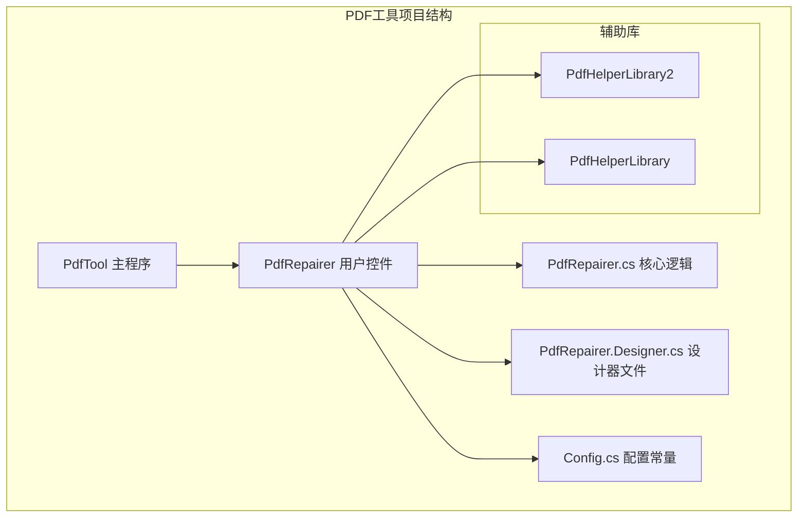
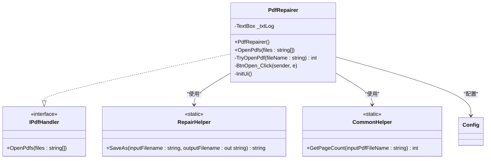
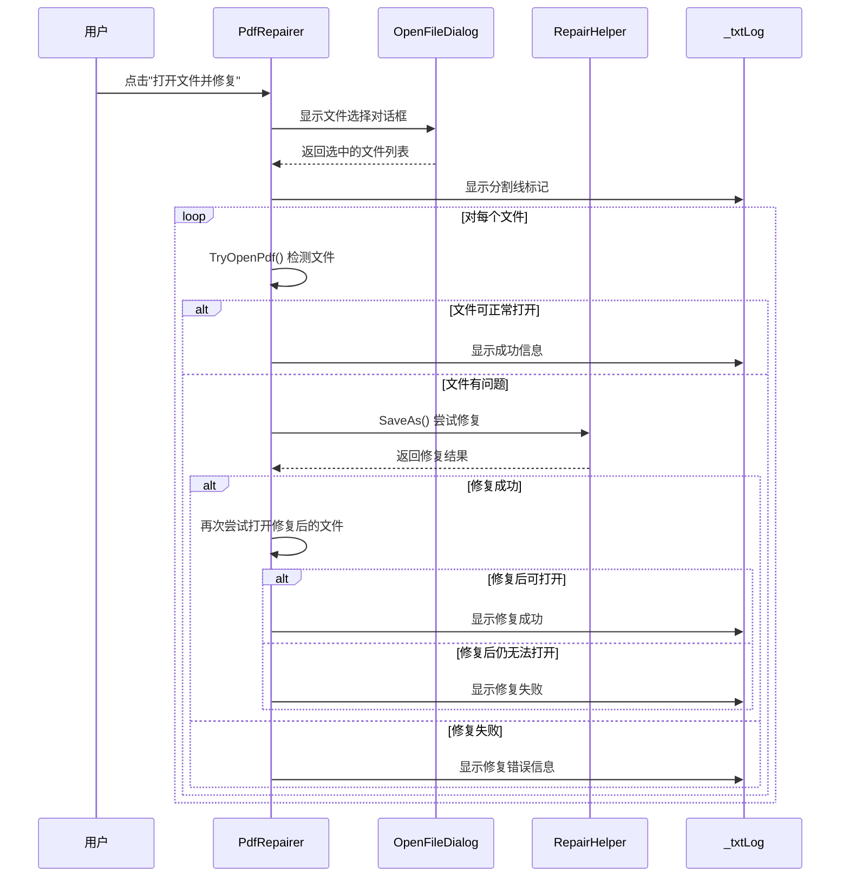
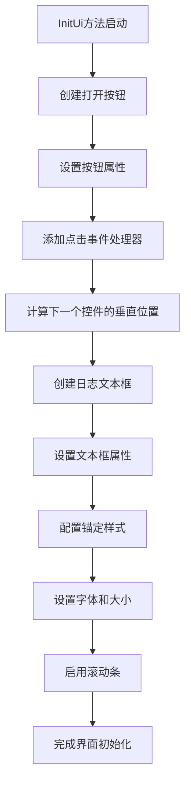
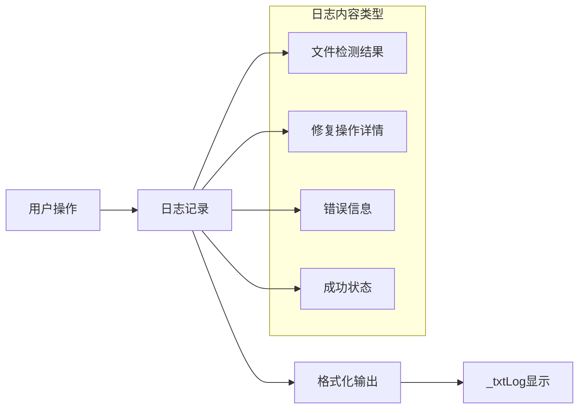

# 使用方法

<cite>
**本文档中引用的文件**
- [PdfRepairer.cs](file://PdfTool/PdfRepairer.cs)
- [PdfRepairer.Designer.cs](file://PdfTool/PdfRepairer.Designer.cs)
- [Config.cs](file://PdfTool/Config.cs)
- [MainForm.cs](file://PdfTool/MainForm.cs)
- [RepairHelper.cs](file://PdfHelperLibrary2/RepairHelper.cs)
- [CommonHelper.cs](file://PdfHelperLibrary/CommonHelper.cs)
- [IPdfHandler.cs](file://PdfTool/Common.cs)
</cite>

## 目录
1. [简介](#简介)
2. [项目结构](#项目结构)
3. [核心组件](#核心组件)
4. [架构概览](#架构概览)
5. [详细组件分析](#详细组件分析)
6. [使用流程详解](#使用流程详解)
7. [界面设计与交互](#界面设计与交互)
8. [日志系统](#日志系统)
9. [实际使用场景](#实际使用场景)
10. [故障排除指南](#故障排除指南)
11. [总结](#总结)

## 简介

PdfRepairer是PDF工具套件中的一个专门用于修复损坏或不完整PDF文件的用户控件。该控件提供了直观的图形界面，支持通过OpenFileDialog进行多文件选择，并通过智能算法自动检测和修复PDF文件中的各种问题。修复后的文件会保存为新的文件名，确保原始文件的安全性。

## 项目结构

PdfRepairer控件在PDF工具项目中的组织结构如下：



**图表来源**
- [PdfRepairer.cs](file://PdfTool/PdfRepairer.cs#L1-L111)
- [PdfRepairer.Designer.cs](file://PdfTool/PdfRepairer.Designer.cs#L1-L38)
- [Config.cs](file://PdfTool/Config.cs#L1-L9)

**章节来源**
- [PdfRepairer.cs](file://PdfTool/PdfRepairer.cs#L1-L111)
- [PdfRepairer.Designer.cs](file://PdfTool/PdfRepairer.Designer.cs#L1-L38)

## 核心组件

PdfRepairer控件包含以下核心组件：

### 主要类和接口
- **PdfRepairer**: 主要的用户控件类，继承自UserControl并实现IPdfHandler接口
- **IPdfHandler**: 定义了PDF处理的标准接口
- **RepairHelper**: 提供PDF修复的核心算法
- **CommonHelper**: 提供PDF文件的基本操作功能

### 关键属性和方法
- `_txtLog`: 日志文本框，用于实时显示修复进度和结果
- `OpenPdfs()`: 处理多个PDF文件的主要方法
- `BtnOpen_Click()`: 文件选择按钮的事件处理程序
- `TryOpenPdf()`: 尝试打开PDF文件并检测其完整性

**章节来源**
- [PdfRepairer.cs](file://PdfTool/PdfRepairer.cs#L16-L111)
- [Common.cs](file://PdfTool/Common.cs#L12-L15)

## 架构概览

PdfRepairer采用模块化架构设计，各组件职责明确：



**图表来源**
- [PdfRepairer.cs](file://PdfTool/PdfRepairer.cs#L16-L111)
- [RepairHelper.cs](file://PdfHelperLibrary2/RepairHelper.cs#L8-L39)
- [CommonHelper.cs](file://PdfHelperLibrary/CommonHelper.cs#L8-L28)

## 详细组件分析

### PdfRepairer类分析

PdfRepairer类是整个修复功能的核心，实现了完整的PDF修复流程：



**图表来源**
- [PdfRepairer.cs](file://PdfTool/PdfRepairer.cs#L32-L54)
- [RepairHelper.cs](file://PdfHelperLibrary2/RepairHelper.cs#L10-L39)

### InitUi方法分析

InitUi方法负责动态构建用户界面元素，确保界面布局的一致性和美观性：



**图表来源**
- [PdfRepairer.cs](file://PdfTool/PdfRepairer.cs#L83-L106)
- [Config.cs](file://PdfTool/Config.cs#L5-L6)

**章节来源**
- [PdfRepairer.cs](file://PdfTool/PdfRepairer.cs#L83-L106)
- [Config.cs](file://PdfTool/Config.cs#L5-L6)

## 使用流程详解

### 第一步：文件选择

用户通过点击"打开文件并修复"按钮启动文件选择过程：

1. **OpenFileDialog初始化**: 设置过滤器为"PDF文件(*.pdf)|*.pdf|所有文件(*.*)|*.*"，启用多选功能
2. **文件筛选**: 只允许选择PDF文件，其他类型文件会被自动过滤
3. **文件验证**: 确保用户选择了至少一个有效的PDF文件

### 第二步：文件检测

系统会对每个选中的文件执行完整性检测：

1. **TryOpenPdf方法**: 尝试打开PDF文件并获取页数信息
2. **异常处理**: 捕获并记录打开过程中出现的任何异常
3. **结果判断**: 根据返回值判断文件是否可正常打开

### 第三步：修复处理

对于检测出有问题的文件，系统会执行修复操作：

1. **RepairHelper.SaveAs()**: 调用修复服务尝试修复文件
2. **修复策略**: 使用iTextSharp库重新构建PDF文档
3. **输出文件命名**: 自动生成带有时间戳的修复文件名

### 第四步：修复验证

修复完成后，系统会再次验证修复效果：

1. **二次检测**: 尝试打开修复后的文件
2. **结果评估**: 判断修复是否成功
3. **日志记录**: 记录完整的修复过程和结果

**章节来源**
- [PdfRepairer.cs](file://PdfTool/PdfRepairer.cs#L74-L78)
- [PdfRepairer.cs](file://PdfTool/PdfRepairer.cs#L32-L54)

## 界面设计与交互

### 控件布局参数

PdfRepairer使用统一的布局参数确保界面的一致性：

| 参数名称 | 值 | 用途 |
|---------|-----|------|
| ControlMargin | 20 | 控件边缘与容器边缘的距离 |
| ControlPadding | 12 | 控件之间的间距 |

这些参数定义了：
- **边距控制**: 确保控件不会紧贴容器边缘，提供舒适的视觉空间
- **间距协调**: 保持控件之间的一致性间距，避免视觉混乱
- **响应式设计**: 支持不同尺寸的窗口，界面元素能够自适应调整

### 用户交互设计

1. **直观的操作流程**: 通过简单的按钮点击即可启动复杂的修复过程
2. **实时反馈机制**: 日志文本框提供即时的状态更新
3. **拖拽支持**: 支持直接拖拽PDF文件到主窗口进行处理
4. **多文件处理**: 一次选择多个文件，系统自动批量处理

### 界面元素特性

- **按钮**: 自动调整大小，适应不同语言的文本长度
- **文本框**: 多行显示，支持水平和垂直滚动
- **字体**: 使用11号字体，确保良好的可读性
- **只读模式**: 文本框设置为只读，防止意外修改

**章节来源**
- [Config.cs](file://PdfTool/Config.cs#L5-L6)
- [PdfRepairer.cs](file://PdfTool/PdfRepairer.cs#L83-L106)

## 日志系统

### 日志文本框(_txtLog)设计

日志系统是PdfRepairer的重要组成部分，提供完整的操作跟踪：



**图表来源**
- [PdfRepairer.cs](file://PdfTool/PdfRepairer.cs#L36-L53)

### 日志输出格式

系统使用标准化的日志格式来确保信息的清晰性和一致性：

#### 成功修复的格式
```
---------------------------------------------
【页数：{pageCount}】{inputFilename}
{inputFilename} 修复完成: {outputFilename}
```

#### 修复失败的格式
```
---------------------------------------------
【页数：{pageCount}】{inputFilename}
{inputFilename} 修复失败: {errorMessage}
```

#### 修复后仍无法加载的格式
```
---------------------------------------------
【页数：{pageCount}】{inputFilename}
{inputFilename} 修复失败: 修复后仍无法顺利加载
```

#### 文件加载失败的格式
```
{inputFilename} 加载失败: {exceptionMessage}
```

### 实时反馈机制

1. **即时更新**: 每个操作步骤都会立即更新日志
2. **状态标识**: 使用不同的前缀标识不同类型的信息
3. **分隔符**: 使用"---------------------------------------------"分隔不同文件的处理记录
4. **页数信息**: 在文件检测阶段显示页数，帮助用户了解文件状态

**章节来源**
- [PdfRepairer.cs](file://PdfTool/PdfRepairer.cs#L36-L53)
- [PdfRepairer.cs](file://PdfTool/PdfRepairer.cs#L57-L69)

## 实际使用场景

### 场景一：网络传输中断导致的PDF修复

**背景**: 用户在通过网络下载PDF文件时发生中断，导致文件损坏

**操作步骤**:
1. 打开PdfRepairer控件
2. 点击"打开文件并修复"按钮
3. 选择损坏的PDF文件
4. 等待修复过程完成
5. 查看日志确认修复结果

**预期日志输出**:
```
---------------------------------------------
test-document.pdf 加载失败: 文件格式无效
test-document.pdf 修复失败: 修复后仍无法顺利加载
```

### 场景二：批量修复多个损坏文件

**背景**: 用户需要修复多个从不同来源获得的损坏PDF文件

**操作步骤**:
1. 同时选择多个PDF文件
2. 系统自动逐个处理
3. 查看完整日志了解每个文件的修复情况

**预期日志输出**:
```
---------------------------------------------
document1.pdf 加载失败: 文件头损坏
document1.pdf 修复完成: document1-repaired-20240115143022567.pdf
---------------------------------------------
document2.pdf 加载失败: 页面对象缺失
document2.pdf 修复失败: 修复后仍无法顺利加载
---------------------------------------------
document3.pdf 【页数：15】document3.pdf
document3.pdf 已经是完整文件，无需修复
```

### 场景三：拖拽文件修复

**背景**: 用户可以直接将PDF文件拖拽到主窗口进行修复

**操作步骤**:
1. 打开主窗口
2. 将PDF文件拖拽到任意标签页
3. 系统自动识别并处理文件

**预期行为**:
- 文件会被正确识别为PDF格式
- 自动调用PdfRepairer的OpenPdfs方法
- 修复过程在PDF修复标签页中进行

**章节来源**
- [MainForm.cs](file://PdfTool/MainForm.cs#L41-L58)
- [PdfRepairer.cs](file://PdfTool/PdfRepairer.cs#L32-L54)

## 故障排除指南

### 常见问题及解决方案

#### 问题1：文件无法打开
**症状**: 日志显示"加载失败"信息
**可能原因**:
- 文件完全损坏
- 文件不是有效的PDF格式
- 文件被其他程序占用

**解决方案**:
1. 确认文件确实为PDF格式
2. 检查文件是否被其他程序打开
3. 尝试使用其他PDF阅读器打开文件

#### 问题2：修复后仍无法加载
**症状**: 修复后的文件仍然显示"修复失败: 修复后仍无法顺利加载"
**可能原因**:
- PDF文件损坏程度过于严重
- 缺少关键的PDF结构信息

**解决方案**:
1. 尝试使用专业的PDF修复工具
2. 联系文件提供者重新发送文件
3. 检查是否有备份文件可用

#### 问题3：修复速度过慢
**症状**: 大文件修复过程耗时过长
**可能原因**:
- 文件包含大量图像或复杂内容
- 系统性能不足

**解决方案**:
1. 分批处理大文件
2. 关闭其他占用系统资源的程序
3. 考虑升级硬件配置

### 性能优化建议

1. **文件大小限制**: 对于特别大的PDF文件，考虑先进行拆分
2. **内存管理**: 确保系统有足够的可用内存
3. **临时文件清理**: 定期清理临时修复文件

**章节来源**
- [PdfRepairer.cs](file://PdfTool/PdfRepairer.cs#L57-L69)
- [RepairHelper.cs](file://PdfHelperLibrary2/RepairHelper.cs#L25-L39)

## 总结

PdfRepairer用户控件为PDF文件修复提供了一个完整、易用的解决方案。通过直观的界面设计、智能的修复算法和详细的日志反馈，用户可以轻松地修复各种损坏的PDF文件。

### 主要优势

1. **简单易用**: 直观的界面设计，只需点击按钮即可开始修复
2. **智能检测**: 自动识别损坏文件并提供修复建议
3. **实时反馈**: 详细的日志系统让用户随时了解修复进度
4. **批量处理**: 支持一次性处理多个文件
5. **安全可靠**: 修复后的文件保存为新文件，保护原始文件安全

### 技术特点

- **模块化设计**: 清晰的组件分离，便于维护和扩展
- **异常处理**: 完善的错误处理机制，确保程序稳定性
- **配置统一**: 使用集中配置管理界面参数
- **接口标准化**: 实现IPdfHandler接口，支持多种处理方式

PdfRepairer控件作为PDF工具套件的重要组成部分，为用户提供了专业级的PDF修复能力，是处理PDF文件问题的理想选择。