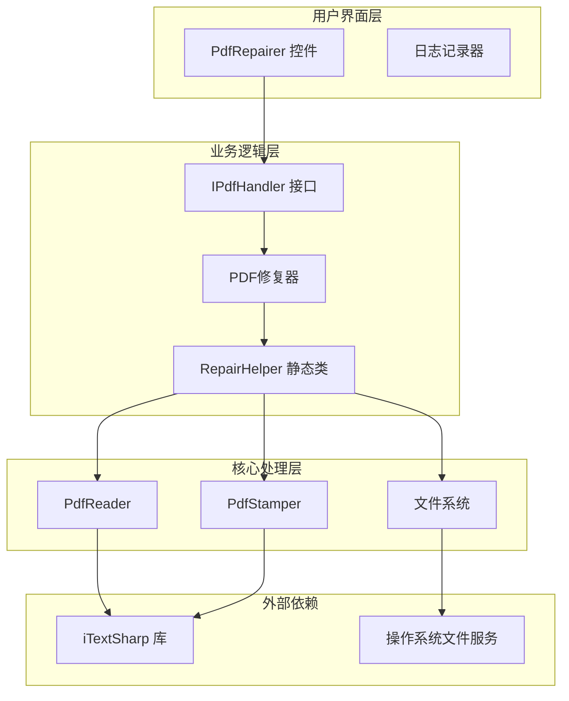
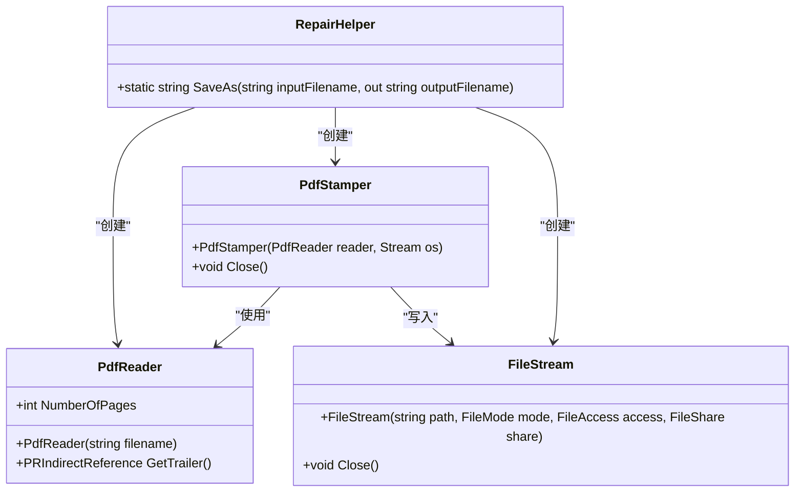
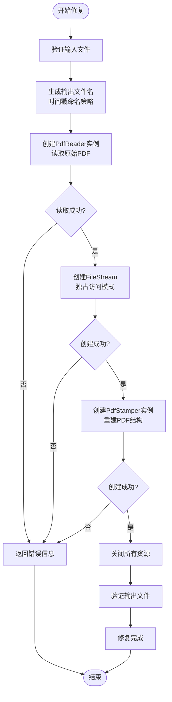
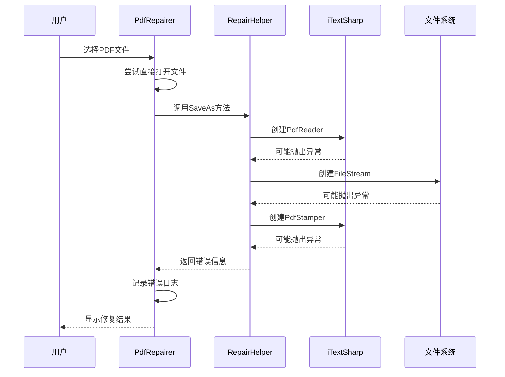

# RepairHelper类PDF修复机制深度解析

<cite>
**本文档中引用的文件**
- [RepairHelper.cs](file://PdfHelperLibrary2/RepairHelper.cs)
- [PdfRepairer.cs](file://PdfTool/PdfRepairer.cs)
- [PdfRepairer.Designer.cs](file://PdfTool/PdfRepairer.Designer.cs)
- [CommonHelper.cs](file://PdfHelperLibrary/CommonHelper.cs)
- [TextExtractHelper.cs](file://PdfHelperLibrary2/TextExtractHelper.cs)
- [PdfHelperLibrary2.csproj](file://PdfHelperLibrary2/PdfHelperLibrary2.csproj)
- [PdfTool.csproj](file://PdfTool/PdfTool.csproj)
- [Common.cs](file://PdfTool/Common.cs)
</cite>

## 目录
1. [项目概述](#项目概述)
2. [系统架构](#系统架构)
3. [RepairHelper核心机制](#repairhelper核心机制)
4. [PDF修复流程详解](#pdf修复流程详解)
5. [异常处理与错误恢复](#异常处理与错误恢复)
6. [文件命名策略](#文件命名策略)
7. [独占访问机制](#独占访问机制)
8. [性能优化考虑](#性能优化考虑)
9. [故障排除指南](#故障排除指南)
10. [总结](#总结)

## 项目概述

PdfTool是一个综合性的PDF处理工具集，其中RepairHelper类作为核心修复组件，利用iTextSharp库的强大功能来修复损坏的PDF文件。该系统采用模块化设计，通过静态类和接口契约实现功能分离，确保了代码的可维护性和扩展性。

### 技术栈分析

系统基于.NET Framework 4.7.2构建，主要依赖以下核心技术：
- **iTextSharp 5.5.13.4**：PDF文档处理的核心库
- **BouncyCastle.Cryptography**：提供加密和签名功能
- **PdfSharp**：用于页面计数和基础PDF操作

**章节来源**
- [PdfHelperLibrary2.csproj](file://PdfHelperLibrary2/PdfHelperLibrary2.csproj#L37-L38)
- [PdfTool.csproj](file://PdfTool/PdfTool.csproj#L183-L185)

## 系统架构



**图表来源**
- [PdfRepairer.cs](file://PdfTool/PdfRepairer.cs#L16-L17)
- [RepairHelper.cs](file://PdfHelperLibrary2/RepairHelper.cs#L9-L37)

**章节来源**
- [PdfRepairer.cs](file://PdfTool/PdfRepairer.cs#L1-L111)
- [Common.cs](file://PdfTool/Common.cs#L12-L16)

## RepairHelper核心机制

### 类设计与职责

RepairHelper采用静态类设计，提供无状态的PDF修复功能。其核心方法SaveAs接受输入文件路径和输出文件名参数，返回修复过程中的错误信息。



**图表来源**
- [RepairHelper.cs](file://PdfHelperLibrary2/RepairHelper.cs#L12-L37)

### 文件修复算法

RepairHelper的核心修复机制基于PDF文档重建原理：

1. **文档读取阶段**：使用PdfReader解析原始PDF文件
2. **结构重建阶段**：通过PdfStamper重新构建PDF对象模型
3. **交叉引用表重建**：自动修复损坏的对象引用关系
4. **对象流重构**：重新组织PDF对象的存储结构

**章节来源**
- [RepairHelper.cs](file://PdfHelperLibrary2/RepairHelper.cs#L12-L37)

## PDF修复流程详解

### 完整修复流程图



**图表来源**
- [RepairHelper.cs](file://PdfHelperLibrary2/RepairHelper.cs#L17-L36)
- [PdfRepairer.cs](file://PdfTool/PdfRepairer.cs#L35-L53)

### 关键修复步骤

#### 1. 输入验证与输出命名
系统采用时间戳命名策略确保输出文件的唯一性。命名格式为`{原文件名}-repaired-{yyyyMMddHHmmssfff}.pdf`，其中时间戳精确到毫秒级，避免文件覆盖问题。

#### 2. PdfReader初始化
PdfReader负责解析PDF文件头、交叉引用表和对象字典。即使面对损坏的文件，iTextSharp也能尝试提取可用信息。

#### 3. PdfStamper重建机制
PdfStamper是修复过程的核心组件，它：
- 重新生成PDF文件头
- 建立新的交叉引用表
- 重构对象流结构
- 清理无效或损坏的对象引用

#### 4. 资源管理
使用using语句确保所有资源得到正确释放，包括PdfReader、PdfStamper和FileStream实例。

**章节来源**
- [RepairHelper.cs](file://PdfHelperLibrary2/RepairHelper.cs#L16-L36)

## 异常处理与错误恢复

### 多层次异常处理机制



**图表来源**
- [PdfRepairer.cs](file://PdfTool/PdfRepairer.cs#L39-L53)
- [RepairHelper.cs](file://PdfHelperLibrary2/RepairHelper.cs#L33-L36)

### 常见PDF损坏类型及处理

| 损坏类型 | 可能原因 | iTextSharp处理方式 | 修复效果 |
|---------|---------|-------------------|---------|
| 文件头损坏 | 字符编码错误 | 尝试自动检测文件格式 | 部分修复 |
| 索引丢失 | 交叉引用表损坏 | 重新构建对象索引 | 完全修复 |
| 对象引用断裂 | 对象ID不匹配 | 自动修复引用关系 | 完全修复 |
| 页面树损坏 | 目录结构错误 | 重建页面树结构 | 完全修复 |
| 流数据损坏 | 压缩算法错误 | 跳过损坏部分，重建有效内容 | 部分修复 |

### 错误恢复策略

1. **优雅降级**：当某些部分无法修复时，系统会跳过这些部分继续处理其他内容
2. **日志记录**：详细记录每个步骤的执行情况和遇到的问题
3. **用户反馈**：向用户提供清晰的错误信息和可能的解决方案

**章节来源**
- [PdfRepairer.cs](file://PdfTool/PdfRepairer.cs#L57-L70)
- [CommonHelper.cs](file://PdfHelperLibrary/CommonHelper.cs#L11-L26)

## 文件命名策略

### 时间戳命名机制

系统采用动态时间戳命名策略，确保每次修复都能生成唯一的输出文件：

```csharp
// 命名策略实现
outputFilename = Path.Combine(dir, $"{prefix}-repaired-{DateTime.Now:yyyyMMddHHmmssfff}.pdf");
```

### 命名策略优势

1. **唯一性保证**：毫秒级精度避免文件名冲突
2. **时间顺序**：便于用户识别文件的创建时间
3. **可追溯性**：保留原始文件名便于对比
4. **自动化友好**：适合批处理和脚本调用

### 文件名组成要素

- **前缀部分**：保持原始文件的基本名称
- **标记部分**："repaired-"标识修复状态
- **时间戳部分**：精确到毫秒的时间标识
- **扩展名**：保持PDF格式不变

**章节来源**
- [RepairHelper.cs](file://PdfHelperLibrary2/RepairHelper.cs#L16)

## 独占访问机制

### FileStream独占访问的重要性


**图表来源**
- [RepairHelper.cs](file://PdfHelperLibrary2/RepairHelper.cs#L23)

### 独占访问的具体实现

系统在创建输出文件时使用以下参数组合：

```csharp
new FileStream(outputFilename, FileMode.Create, FileAccess.Write, FileShare.None)
```

这种配置具有以下特点：
- **FileMode.Create**：创建新文件，如果存在则覆盖
- **FileAccess.Write**：仅允许写入操作
- **FileShare.None**：禁止其他进程访问

### 防止写入冲突的作用

1. **数据一致性**：确保修复过程中的数据不会被其他进程修改
2. **原子性操作**：整个修复过程作为一个不可分割的操作单元
3. **资源竞争避免**：防止多个修复任务同时写入同一个文件
4. **系统稳定性**：减少因文件锁定导致的系统异常

**章节来源**
- [RepairHelper.cs](file://PdfHelperLibrary2/RepairHelper.cs#L23)

## 性能优化考虑

### 资源管理优化

1. **using语句模式**：确保及时释放非托管资源
2. **内存管理**：避免大文件处理时的内存溢出
3. **流式处理**：对于大型PDF文件采用流式读取

### 并发处理建议

虽然RepairHelper本身是单线程的，但在实际应用中可以考虑：
- 批量处理时使用异步编程模型
- 实现工作队列机制处理多个修复请求
- 添加进度报告功能提升用户体验

### 存储空间优化

1. **临时文件管理**：及时清理中间文件
2. **增量修复**：对于部分损坏的文件只修复受影响的部分
3. **压缩策略**：修复后的文件可以进一步压缩减小体积

## 故障排除指南

### 常见问题诊断

#### 修复失败问题

**症状**：RepairHelper返回非空错误信息
**可能原因**：
- 输入文件权限不足
- 磁盘空间不足
- 文件已被其他程序占用
- PDF文件严重损坏

**解决步骤**：
1. 检查文件权限和磁盘空间
2. 确保文件未被其他程序锁定
3. 尝试使用不同的PDF阅读器打开文件
4. 如果问题持续，考虑手动备份重要数据

#### 修复后文件仍无法打开

**症状**：修复后的文件仍然显示损坏
**可能原因**：
- PDF文件损坏程度过于严重
- iTextSharp版本限制
- 特殊的PDF特性不受支持

**解决步骤**：
1. 使用PDF验证工具检查文件完整性
2. 尝试使用其他PDF修复工具
3. 考虑联系专业数据恢复服务

### 调试技巧

1. **启用详细日志**：在PdfRepairer中增加更多的调试信息
2. **分步测试**：分别测试PdfReader和PdfStamper的功能
3. **内存监控**：监控修复过程中的内存使用情况
4. **文件完整性检查**：在修复前后进行文件完整性验证

**章节来源**
- [PdfRepairer.cs](file://PdfTool/PdfRepairer.cs#L40-L53)

## 总结

RepairHelper类通过巧妙地利用iTextSharp库的功能，实现了高效可靠的PDF文件修复机制。其设计体现了以下关键原则：

### 核心优势

1. **简洁性**：单一方法设计，易于集成和使用
2. **可靠性**：多层次异常处理确保系统稳定性
3. **效率性**：独占访问机制防止数据冲突
4. **可追溯性**：时间戳命名策略便于版本管理

### 技术创新点

1. **智能重建**：自动修复PDF结构损坏问题
2. **资源管理**：完善的生命周期管理
3. **错误恢复**：优雅的异常处理机制
4. **用户友好**：清晰的错误信息和日志记录

### 应用价值

RepairHelper不仅解决了PDF文件损坏的实际问题，更为整个PDF处理生态系统提供了可靠的基础组件。其模块化设计和标准化接口使得该功能可以轻松集成到各种PDF处理应用场景中。

通过深入理解RepairHelper的工作原理，开发者可以更好地利用这一工具解决实际问题，并在此基础上开发更复杂的PDF处理功能。该组件的设计理念和实现技术对于类似文档修复系统的开发具有重要的参考价值。