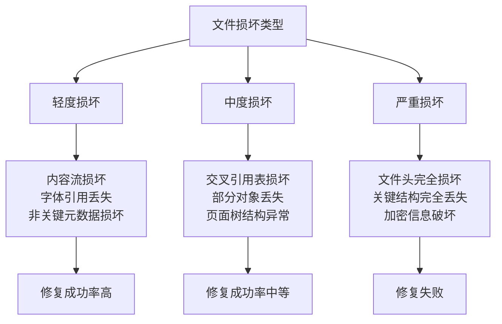
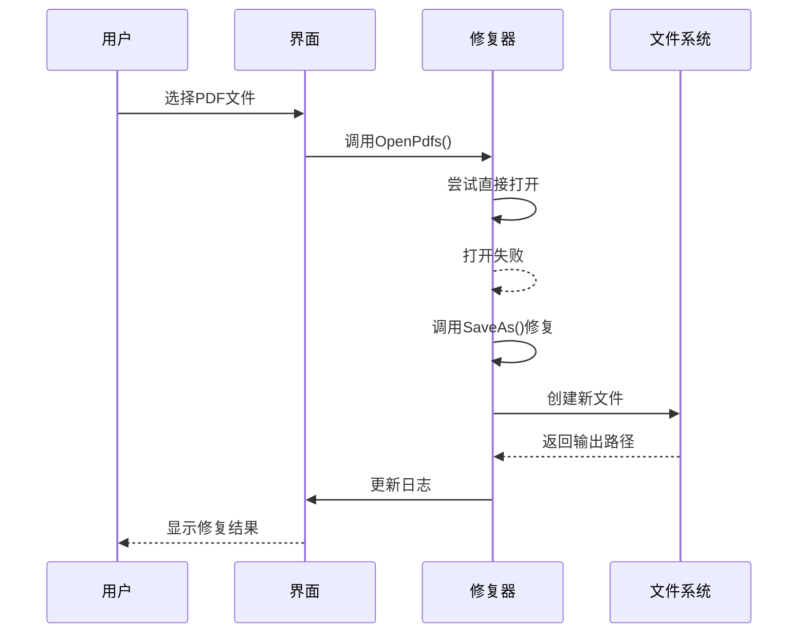

# 限制与注意事项

<cite>
**本文档引用的文件**  
- [RepairHelper.cs](file://PdfHelperLibrary2/RepairHelper.cs)
- [PdfRepairer.cs](file://PdfTool/PdfRepairer.cs)
- [CommonHelper.cs](file://PdfHelperLibrary/CommonHelper.cs)
</cite>

## 目录
1. [简介](#简介)
2. [修复机制的技术限制](#修复机制的技术限制)
3. [文件损坏程度的影响](#文件损坏程度的影响)
4. [使用PdfStamper导致的特性丢失](#使用pdfstamper导致的特性丢失)
5. [修复过程的文件处理方式](#修复过程的文件处理方式)
6. [预防性措施建议](#预防性措施建议)
7. [敏感文件处理安全提醒](#敏感文件处理安全提醒)

## 简介
本文件全面记录PDF修复功能的技术限制和使用注意事项。通过分析代码实现，说明当前修复机制的工作原理、适用范围以及潜在风险，为用户提供安全有效的使用指导。

## 修复机制的技术限制

PDF修复功能基于iTextSharp库的`PdfStamper`组件实现，其核心原理是通过读取原始PDF文件并创建一个新的PDF文档来实现"修复"。这种机制本质上是一种重建过程，而非原地修复。

修复成功率受多种因素影响：
- **原始文件完整性**：文件头部、交叉引用表（xref）和对象流的完整性直接影响读取成功率
- **损坏位置**：关键结构（如目录、页面树）的损坏比内容流损坏更难恢复
- **文件大小**：大文件在重建过程中可能面临内存不足或超时问题

当文件损坏严重到无法被`PdfReader`初始化时，修复将失败。代码中通过捕获异常来处理此类情况，并返回具体的错误信息。

**Section sources**
- [RepairHelper.cs](file://PdfHelperLibrary2/RepairHelper.cs#L1-L39)
- [CommonHelper.cs](file://PdfHelperLibrary/CommonHelper.cs#L11-L26)

## 文件损坏程度的影响

修复功能对损坏程度有明确的适用范围：

**Diagram sources**
- [RepairHelper.cs](file://PdfHelperLibrary2/RepairHelper.cs#L20-L30)
- [PdfRepairer.cs](file://PdfTool/PdfRepairer.cs#L38-L53)

**Section sources**
- [RepairHelper.cs](file://PdfHelperLibrary2/RepairHelper.cs#L1-L39)
- [PdfRepairer.cs](file://PdfTool/PdfRepairer.cs#L38-L53)

## 使用PdfStamper导致的特性丢失

使用`PdfStamper`重建文档时，以下高级特性可能丢失：

- **数字签名**：签名信息与原始文档的字节流绑定，重建后的新文件会破坏签名完整性
- **表单字段状态**：交互式表单的当前填写状态和计算逻辑可能无法完全保留
- **注释和标记**：某些类型的注释（如富媒体注释）可能无法正确迁移
- **书签和超链接**：复杂的书签结构和内部链接可能需要重新建立

代码实现中，`PdfStamper`仅执行基本的文档重建，未包含特殊处理逻辑来保留这些高级特性。

**Section sources**
- [RepairHelper.cs](file://PdfHelperLibrary2/RepairHelper.cs#L25-L28)

## 修复过程的文件处理方式

修复过程会产生新文件而非原地修改，具体特点包括：

**Diagram sources**
- [PdfRepairer.cs](file://PdfTool/PdfRepairer.cs#L32-L54)
- [RepairHelper.cs](file://PdfHelperLibrary2/RepairHelper.cs#L13-L16)

**Section sources**
- [PdfRepairer.cs](file://PdfTool/PdfRepairer.cs#L32-L54)
- [RepairHelper.cs](file://PdfHelperLibrary2/RepairHelper.cs#L13-L16)

## 预防性措施建议

为降低PDF文件损坏风险，建议采取以下预防性措施：

| 措施类型 | 具体建议 | 实施频率 |
|---------|--------|--------|
| 备份策略 | 定期备份重要PDF文件到多个位置 | 每周/每次修改后 |
| 传输验证 | 使用校验和（如MD5、SHA-256）验证文件传输完整性 | 每次传输后 |
| 写入安全 | 避免非正常关闭写入操作，确保程序正常退出 | 始终 |
| 存储环境 | 使用可靠的存储介质，避免在不稳定环境中保存重要文件 | 始终 |
| 版本控制 | 对重要文档实施版本控制，保留历史版本 | 每次修改后 |

**Section sources**
- [PdfRepairer.cs](file://PdfTool/PdfRepairer.cs#L37-L38)

## 敏感文件处理安全提醒

在处理敏感PDF文件时，需特别注意输出路径的安全性：

- **输出路径**：修复后的文件默认保存在原文件目录下，文件名格式为`{原文件名}-repaired-{时间戳}.pdf`
- **临时文件**：修复过程可能产生临时文件，需确保系统临时目录的安全性
- **权限控制**：确保输出目录具有适当的访问权限，防止未授权访问
- **清理策略**：建议在确认修复成功后，及时清理原始损坏文件

代码中未实现自定义输出路径功能，所有修复文件均按固定规则生成。

**Section sources**
- [RepairHelper.cs](file://PdfHelperLibrary2/RepairHelper.cs#L14-L16)