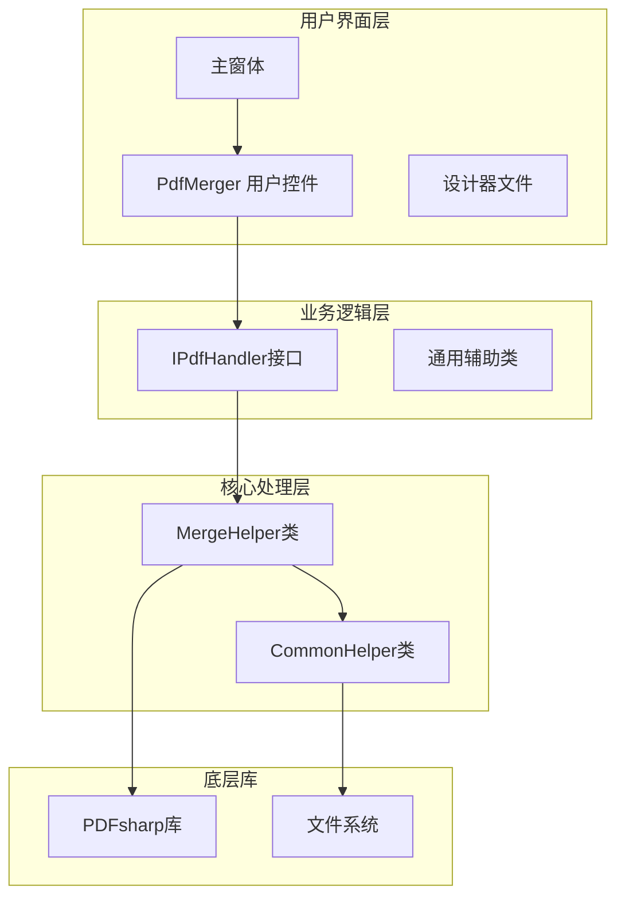
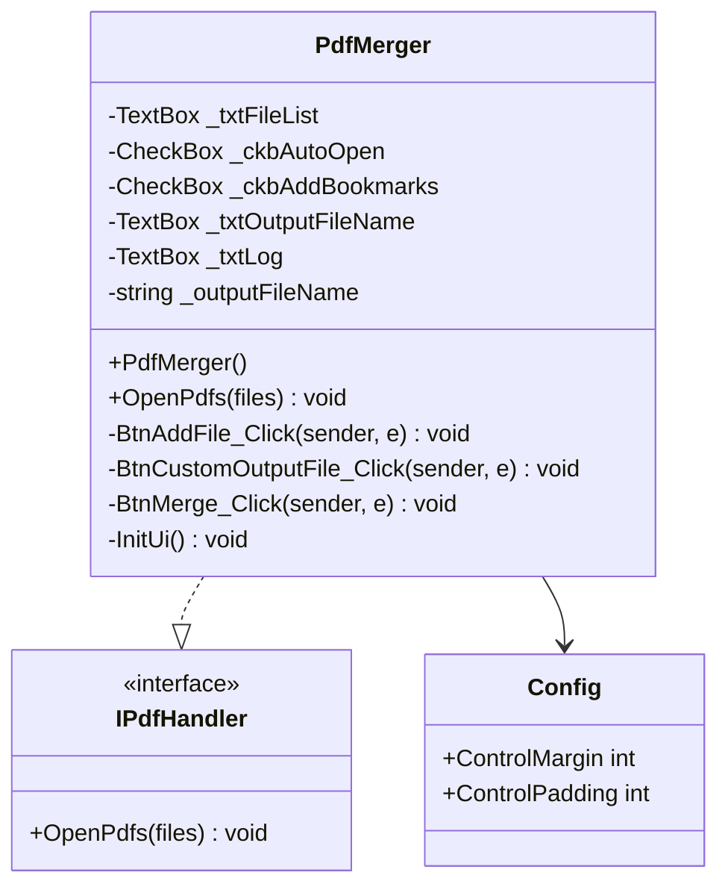
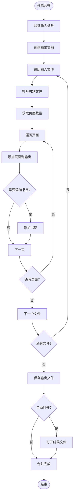
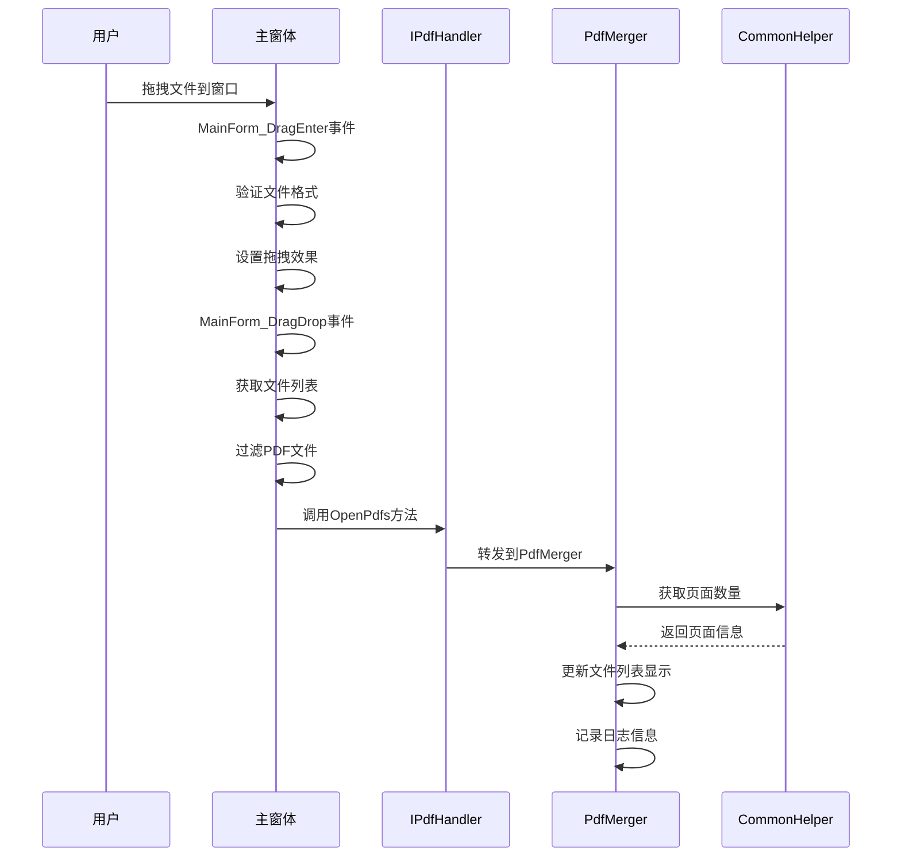
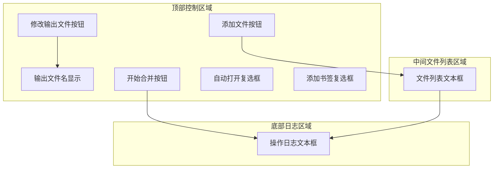
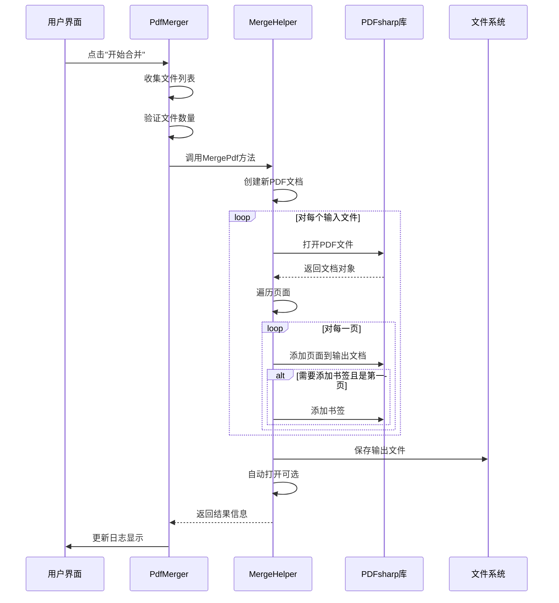
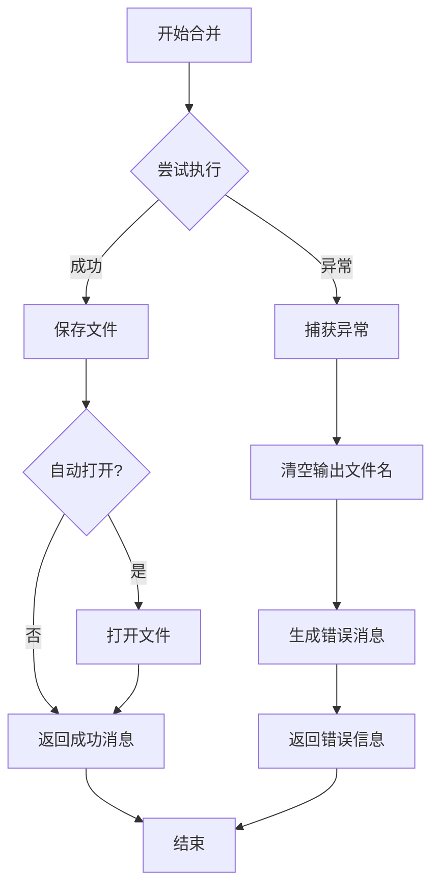
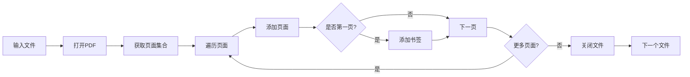
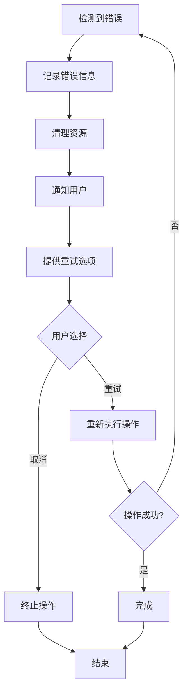
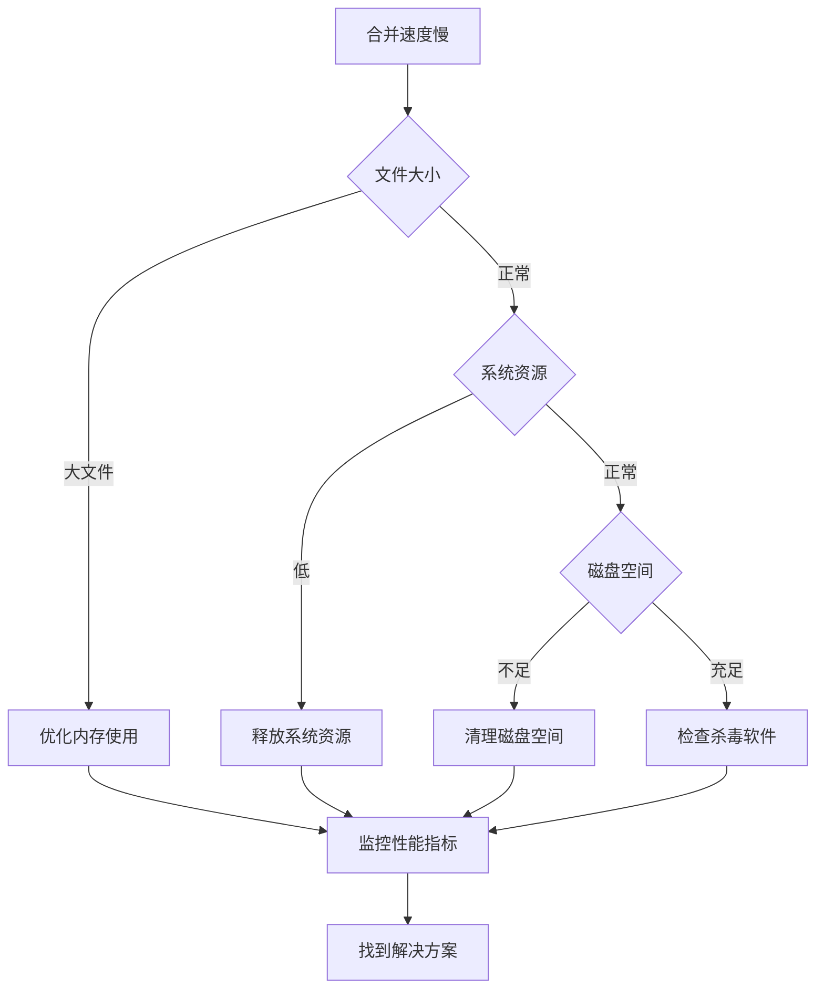

# PDF合并器功能实现详细文档

<cite>
**本文档引用的文件**
- [PdfMerger.cs](file://PdfTool/PdfMerger.cs)
- [MergeHelper.cs](file://PdfHelperLibrary/MergeHelper.cs)
- [CommonHelper.cs](file://PdfHelperLibrary/CommonHelper.cs)
- [MainForm.cs](file://PdfTool/MainForm.cs)
- [Common.cs](file://PdfTool/Common.cs)
- [Config.cs](file://PdfTool/Config.cs)
- [PdfMerger.Designer.cs](file://PdfTool/PdfMerger.Designer.cs)
</cite>

## 目录
1. [项目概述](#项目概述)
2. [系统架构](#系统架构)
3. [核心组件分析](#核心组件分析)
4. [文件拖拽上传功能](#文件拖拽上传功能)
5. [用户界面设计](#用户界面设计)
6. [合并执行流程](#合并执行流程)
7. [PDFsharp集成与实现](#pdfsharp集成与实现)
8. [错误处理与异常管理](#错误处理与异常管理)
9. [性能优化与最佳实践](#性能优化与最佳实践)
10. [故障排除指南](#故障排除指南)
11. [总结](#总结)

## 项目概述

PDF合并器是PDFTool项目中的核心功能模块，专门用于将多个PDF文档合并为单个完整的PDF文件。该系统采用模块化设计，通过分离的UI层和业务逻辑层实现高效的功能组织。

### 主要特性
- **文件拖拽上传**：支持直接拖拽PDF文件到界面
- **多文件选择**：支持同时选择多个PDF文件
- **顺序调整**：允许用户调整文件合并顺序
- **书签保留**：可选择是否为每个文件添加书签
- **自动打开**：合并完成后自动打开结果文件
- **进度监控**：实时显示合并进度和状态信息

## 系统架构

PDF合并器采用分层架构设计，确保代码的可维护性和扩展性：

**图表来源**
- [PdfMerger.cs](file://PdfTool/PdfMerger.cs#L1-L154)
- [MergeHelper.cs](file://PdfHelperLibrary/MergeHelper.cs#L1-L75)
- [CommonHelper.cs](file://PdfHelperLibrary/CommonHelper.cs#L1-L29)

## 核心组件分析

### PdfMerger用户控件

PdfMerger是PDF合并器的主要用户界面组件，实现了IPdfHandler接口，提供完整的PDF合并功能。

#### 类结构设计

**图表来源**
- [PdfMerger.cs](file://PdfTool/PdfMerger.cs#L12-L30)
- [Common.cs](file://PdfTool/Common.cs#L13-L16)
- [Config.cs](file://PdfTool/Config.cs#L3-L8)

#### 关键属性和方法

| 属性/方法 | 类型 | 描述 | 默认值 |
|-----------|------|------|--------|
| `_txtFileList` | TextBox | 显示待合并文件列表 | 空 |
| `_ckbAutoOpen` | CheckBox | 自动打开选项 | 未选中 |
| `_ckbAddBookmarks` | CheckBox | 添加书签选项 | 未选中 |
| `_txtOutputFileName` | TextBox | 输出文件名显示 | 默认名称 |
| `_txtLog` | TextBox | 操作日志显示 | 只读 |
| `OpenPdfs()` | 方法 | 批量添加PDF文件 | 多文件支持 |

**节来源**
- [PdfMerger.cs](file://PdfTool/PdfMerger.cs#L24-L39)

### MergeHelper核心处理类

MergeHelper是PDF合并的核心业务逻辑类，封装了PDFsharp库的调用，提供简洁的合并接口。

#### 合并算法流程

**图表来源**
- [MergeHelper.cs](file://PdfHelperLibrary/MergeHelper.cs#L16-L74)

**节来源**
- [MergeHelper.cs](file://PdfHelperLibrary/MergeHelper.cs#L16-L74)

## 文件拖拽上传功能

### 拖拽事件处理机制

系统实现了完整的文件拖拽上传功能，支持多种文件类型的处理。

#### 拖拽流程设计

**图表来源**
- [MainForm.cs](file://PdfTool/MainForm.cs#L33-L60)
- [PdfMerger.cs](file://PdfTool/PdfMerger.cs#L33-L40)

#### 文件类型过滤机制

系统通过文件扩展名进行智能过滤，确保只处理有效的PDF文件：

| 文件类型 | 支持格式 | 过滤条件 |
|----------|----------|----------|
| PDF文档 | *.pdf | 完整的PDF格式 |
| 其他文件 | *.* | 显示所有文件供用户选择 |

**节来源**
- [MainForm.cs](file://PdfTool/MainForm.cs#L46-L47)

## 用户界面设计

### 控件布局与交互

PdfMerger采用现代化的Windows Forms设计，提供直观的用户界面。

#### 界面元素分布

**图表来源**
- [PdfMerger.cs](file://PdfTool/PdfMerger.cs#L75-L150)

#### 布局配置参数

| 参数名称 | 数值 | 用途 |
|----------|------|------|
| `ControlMargin` | 20 | 控件边距 |
| `ControlPadding` | 12 | 控件间距 |
| `ClientSize` | 1000x800 | 主窗体尺寸 |

**节来源**
- [Config.cs](file://PdfTool/Config.cs#L5-L6)
- [PdfMerger.cs](file://PdfTool/PdfMerger.cs#L75-L150)

### 事件处理机制

#### 主要事件处理器

| 事件名称 | 触发方式 | 功能描述 |
|----------|----------|----------|
| `BtnAddFile_Click` | 点击"添加文件"按钮 | 打开文件选择对话框 |
| `BtnCustomOutputFile_Click` | 点击"修改"按钮 | 自定义输出文件路径 |
| `BtnMerge_Click` | 点击"开始合并"按钮 | 执行PDF合并操作 |
| `MainForm_DragEnter` | 文件拖拽进入 | 验证文件格式并设置效果 |
| `MainForm_DragDrop` | 文件拖拽释放 | 处理拖拽的文件列表 |

**节来源**
- [PdfMerger.cs](file://PdfTool/PdfMerger.cs#L44-L71)
- [MainForm.cs](file://PdfTool/MainForm.cs#L33-L60)

## 合并执行流程

### 完整合并流程

PDF合并器的合并过程包含多个关键步骤，确保数据的完整性和用户体验。

#### 合并执行序列图

**图表来源**
- [PdfMerger.cs](file://PdfTool/PdfMerger.cs#L59-L71)
- [MergeHelper.cs](file://PdfHelperLibrary/MergeHelper.cs#L16-L74)

#### 错误处理流程

**图表来源**
- [MergeHelper.cs](file://PdfHelperLibrary/MergeHelper.cs#L37-L41)

**节来源**
- [PdfMerger.cs](file://PdfTool/PdfMerger.cs#L59-L71)
- [MergeHelper.cs](file://PdfHelperLibrary/MergeHelper.cs#L16-L74)

## PDFsharp集成与实现

### PDF文档操作

MergeHelper深度集成了PDFsharp库，实现了高效的PDF文档处理。

#### 文档创建与页面操作

| 操作类型 | PDFsharp方法 | 功能描述 |
|----------|--------------|----------|
| 创建新文档 | `new PdfDocument()` | 初始化输出PDF文档 |
| 打开现有文档 | `PdfReader.Open()` | 以导入模式打开PDF文件 |
| 添加页面 | `outputDocument.AddPage()` | 将页面添加到输出文档 |
| 创建书签 | `outputDocument.Outlines.Add()` | 为文档添加书签结构 |

#### 页面处理策略

**图表来源**
- [MergeHelper.cs](file://PdfHelperLibrary/MergeHelper.cs#L21-L30)

**节来源**
- [MergeHelper.cs](file://PdfHelperLibrary/MergeHelper.cs#L16-L74)

### 元数据处理

系统在合并过程中会保留原始PDF文档的基本元数据，包括：

- **页面尺寸**：保持原始页面的物理尺寸
- **页面方向**：保留横版/竖版设置
- **书签结构**：可选择性保留原始书签
- **字体信息**：自动处理字体嵌入

## 错误处理与异常管理

### 异常类型与处理策略

PDF合并器实现了完善的异常处理机制，能够优雅地处理各种错误情况。

#### 异常分类处理

| 异常类型 | 处理策略 | 用户反馈 |
|----------|----------|----------|
| 文件不存在 | 提示用户检查文件路径 | 显示具体文件名 |
| 文件格式错误 | 验证文件格式 | 显示格式不支持 |
| 内存不足 | 释放资源重试 | 显示内存警告 |
| 权限不足 | 检查文件访问权限 | 显示权限错误 |
| PDFsharp异常 | 包装为友好错误信息 | 显示技术细节 |

#### 错误恢复机制

**节来源**
- [MergeHelper.cs](file://PdfHelperLibrary/MergeHelper.cs#L37-L41)

## 性能优化与最佳实践

### 性能优化策略

#### 内存管理优化

1. **及时释放资源**：使用`using`语句确保PDF文档对象及时释放
2. **流式处理**：对大型PDF文件采用流式读取方式
3. **批量操作**：将多个小操作合并为批量处理

#### 最佳实践建议

| 实践领域 | 建议措施 | 预期效果 |
|----------|----------|----------|
| 文件预检查 | 在合并前验证文件完整性 | 减少合并失败率 |
| 内存监控 | 监控可用内存使用情况 | 防止内存溢出 |
| 并发控制 | 限制同时处理的文件数量 | 提高系统稳定性 |
| 缓存策略 | 缓存常用操作结果 | 提升响应速度 |

### 字体嵌入冲突处理

#### 冲突检测与解决

当合并的PDF文件包含不同字体时，系统采用以下策略：

1. **字体兼容性检查**：预先检查字体兼容性
2. **字体替换策略**：自动替换不兼容字体
3. **字体嵌入验证**：确保最终文档字体完整性

#### 加密文件处理

对于加密的PDF文件，系统提供以下解决方案：

- **密码验证**：支持常见密码格式
- **解密处理**：自动解密受保护的文档
- **权限检查**：验证合并权限

**节来源**
- [CommonHelper.cs](file://PdfHelperLibrary/CommonHelper.cs#L11-L26)

## 故障排除指南

### 常见问题与解决方案

#### 合并失败问题

| 问题症状 | 可能原因 | 解决方案 |
|----------|----------|----------|
| 文件无法打开 | 文件损坏或格式不正确 | 使用PDF修复工具修复文件 |
| 内存不足 | 文件过大或系统内存不足 | 分批处理或增加系统内存 |
| 权限错误 | 文件被其他程序占用 | 关闭相关程序后重试 |
| 字体缺失 | PDF中引用的字体不可用 | 使用系统标准字体替换 |

#### 性能问题诊断

### 预检查清单

在执行合并操作前，建议进行以下预检查：

1. **文件完整性检查**：验证所有输入文件可正常打开
2. **系统资源检查**：确保有足够的内存和磁盘空间
3. **权限验证**：确认有文件读写权限
4. **依赖项检查**：验证PDFsharp库版本兼容性

**节来源**
- [CommonHelper.cs](file://PdfHelperLibrary/CommonHelper.cs#L11-L26)

## 总结

PDF合并器是一个功能完善、设计精良的文档处理工具。通过模块化的架构设计、完善的错误处理机制和优化的性能策略，它能够满足各种PDF合并需求。

### 核心优势

1. **易用性**：直观的拖拽界面和清晰的操作流程
2. **可靠性**：完善的异常处理和错误恢复机制
3. **性能**：优化的内存管理和并发处理能力
4. **扩展性**：模块化设计便于功能扩展和维护

### 应用场景

- **文档整合**：将多个扫描件合并为完整文档
- **报告生成**：将不同章节的PDF文档组合成完整报告
- **档案管理**：批量处理和归档PDF文件
- **工作流程**：作为PDF处理流水线的重要环节

通过持续的优化和改进，PDF合并器将继续为用户提供高效、可靠的PDF文档处理服务。