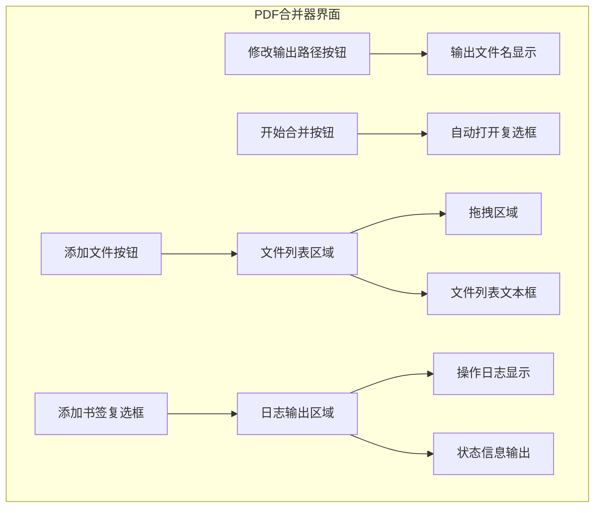
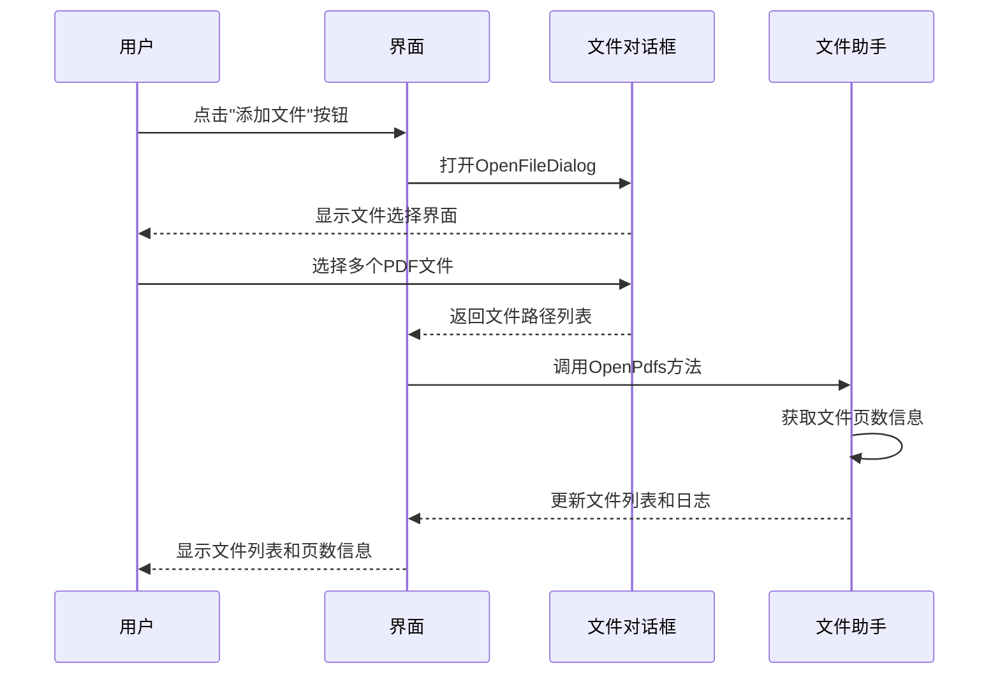
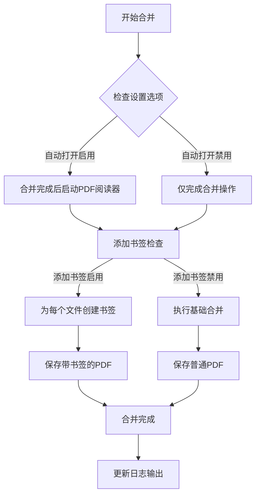
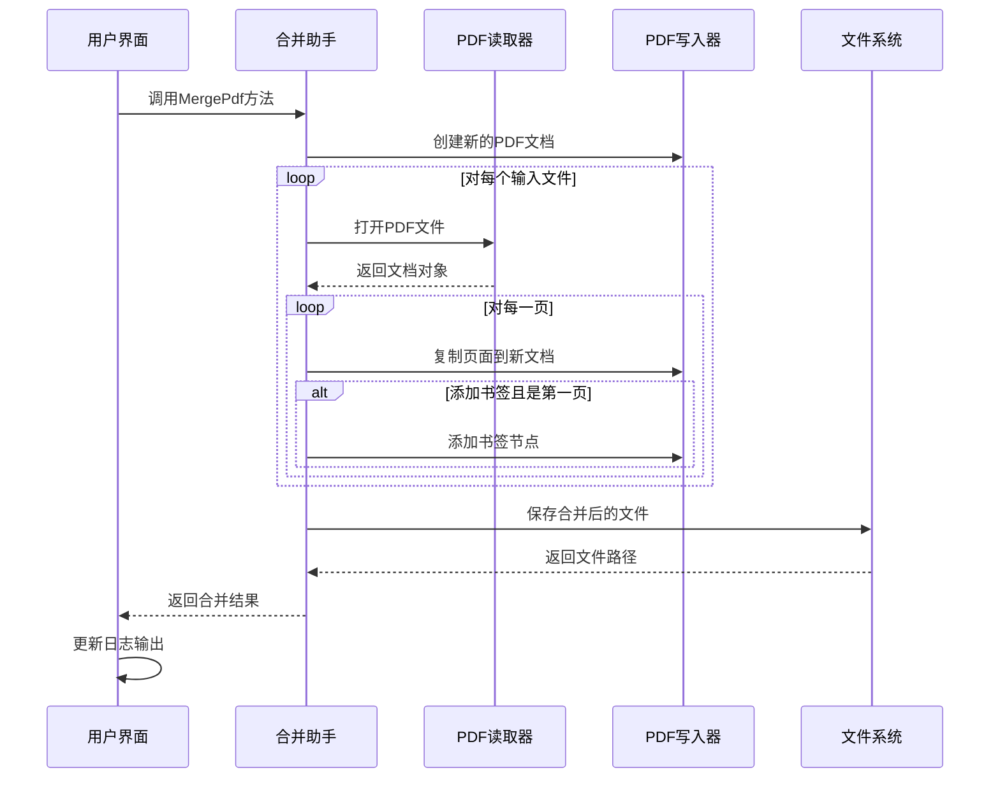
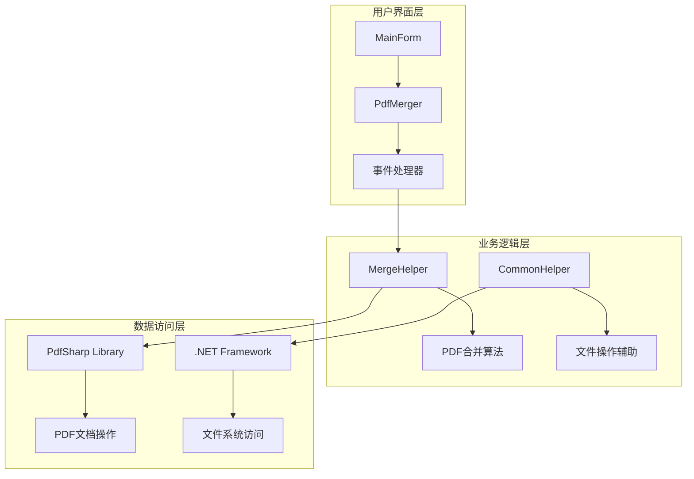

# PDF合并器使用指南

<cite>
**本文档中引用的文件**
- [PdfMerger.cs](file://PdfTool/PdfMerger.cs)
- [MainForm.cs](file://PdfTool/MainForm.cs)
- [MainForm.Designer.cs](file://PdfTool/MainForm.Designer.cs)
- [PdfMerger.Designer.cs](file://PdfTool/PdfMerger.Designer.cs)
- [Config.cs](file://PdfTool/Config.cs)
- [Common.cs](file://PdfTool/Common.cs)
- [MergeHelper.cs](file://PdfHelperLibrary/MergeHelper.cs)
- [CommonHelper.cs](file://PdfHelperLibrary/CommonHelper.cs)
</cite>

## 目录
1. [简介](#简介)
2. [界面布局概览](#界面布局概览)
3. [文件导入方式](#文件导入方式)
4. [文件列表管理](#文件列表管理)
5. [合并设置选项](#合并设置选项)
6. [合并操作流程](#合并操作流程)
7. [实际应用场景](#实际应用场景)
8. [故障排除指南](#故障排除指南)
9. [技术架构说明](#技术架构说明)

## 简介

PDF合并器是PDF工具箱中的核心组件，专门用于将多个PDF文件按照用户指定的顺序合并成一个完整的文档。该工具提供了直观的图形界面，支持多种文件导入方式，并具备灵活的合并配置选项。

### 主要功能特性
- 支持拖拽和手动选择两种文件导入方式
- 实时显示文件页数信息
- 自定义合并顺序调整
- 输出路径自定义设置
- 合并后自动打开功能
- 可选添加书签功能

## 界面布局概览

PDF合并器采用简洁直观的界面设计，主要包含以下核心区域：

**图表来源**
- [PdfMerger.cs](file://PdfTool/PdfMerger.cs#L75-L150)

### 界面元素说明

| 元素名称 | 功能描述 | 位置关系 |
|---------|---------|---------|
| 添加文件按钮 | 打开文件选择对话框，支持多选 | 界面左上角第一行 |
| 文件列表文本框 | 显示已添加的PDF文件列表，支持拖拽排序 | 添加文件按钮下方 |
| 修改输出路径按钮 | 设置合并后的PDF文件保存位置 | 文件列表下方 |
| 输出文件名显示 | 显示当前输出文件的完整路径 | 修改按钮右侧 |
| 开始合并按钮 | 执行PDF文件合并操作 | 输出设置下方 |
| 自动打开复选框 | 合并完成后自动打开生成的PDF文件 | 开始合并按钮右侧 |
| 添加书签复选框 | 为每个合并的PDF文件添加书签导航 | 自动打开复选框右侧 |
| 日志输出区域 | 显示合并过程中的详细信息和状态 | 界面底部 |

**章节来源**
- [PdfMerger.cs](file://PdfTool/PdfMerger.cs#L75-L150)

## 文件导入方式

PDF合并器提供两种便捷的文件导入方式，满足不同用户的操作习惯。

### 方式一：点击添加文件按钮

这是最直接的文件导入方式：

1. **触发操作**：点击界面上的"添加文件"按钮
2. **文件选择对话框**：系统弹出标准的Windows文件选择对话框
3. **多选支持**：用户可以按住Ctrl键选择多个PDF文件
4. **文件验证**：系统自动验证文件格式并显示页数信息
5. **实时更新**：文件信息即时显示在文件列表中

**图表来源**
- [PdfMerger.cs](file://PdfTool/PdfMerger.cs#L44-L48)

### 方式二：拖拽文件导入

拖拽功能提供了更加直观的操作体验：

1. **拖拽准备**：用户可以直接从文件资源管理器拖拽PDF文件到界面
2. **视觉反馈**：当文件进入界面时，会显示拖拽效果提示
3. **自动识别**：系统自动识别PDF文件并过滤其他类型文件
4. **无缝集成**：拖拽的文件会立即出现在文件列表中

**章节来源**
- [MainForm.cs](file://PdfTool/MainForm.cs#L41-L52)

## 文件列表管理

文件列表是PDF合并器的核心功能区域，提供了完整的文件管理和顺序控制能力。

### 文件信息显示

每个添加到列表中的文件都会显示以下信息：
- **文件路径**：完整的文件存储路径
- **页数信息**：括号内显示PDF文件的总页数
- **序号标识**：自动为每个文件分配序号

### 拖拽排序功能

文件列表支持直观的拖拽排序：
1. **选择文件**：点击文件列表中的任意文件
2. **拖拽操作**：按住鼠标左键拖拽文件到目标位置
3. **视觉指示**：系统会显示插入位置的参考线
4. **实时更新**：排序完成后文件列表会立即更新

### 文件移除操作

用户可以通过以下方式移除不需要的文件：
- **全选删除**：在文件列表中全选后按Delete键
- **单个删除**：选中特定文件后按Delete键
- **清空列表**：使用快捷键或菜单命令清空所有文件

**章节来源**
- [PdfMerger.cs](file://PdfTool/PdfMerger.cs#L33-L39)

## 合并设置选项

PDF合并器提供了两个重要的可选设置，用户可以根据具体需求进行配置。

### 自动打开复选框

**功能描述**：勾选此选项后，合并完成后系统会自动打开生成的PDF文件。

**使用场景**：
- 需要立即查看合并结果
- 验证合并质量
- 进一步编辑合并后的文档

**技术实现**：通过调用系统进程启动PDF阅读器

### 添加书签复选框

**功能描述**：勾选此选项后，系统会在合并后的PDF中为每个原始文件添加书签导航。

**技术原理**：
- 为每个PDF文件创建独立的书签节点
- 使用文件名作为书签标题
- 在每本书签下建立页面链接
- 提供快速跳转到各部分的功能

**使用场景**：
- 长篇文档合并（如合同、报告）
- 需要快速定位特定部分内容
- 提高文档的可导航性

**图表来源**
- [MergeHelper.cs](file://PdfHelperLibrary/MergeHelper.cs#L16-L41)

**章节来源**
- [PdfMerger.cs](file://PdfTool/PdfMerger.cs#L124-L137)

## 合并操作流程

PDF合并器的合并操作遵循标准化的工作流程，确保合并质量和用户体验。

### 合并前检查

系统在执行合并操作前会进行多项检查：

1. **文件数量验证**：确认至少有一个PDF文件被添加
2. **文件有效性检查**：验证PDF文件格式和完整性
3. **权限检查**：确认有权限读取输入文件和写入输出文件
4. **内存空间检查**：评估系统可用内存是否足够处理大文件

### 核心合并算法

合并过程采用高效的逐页复制策略：

**图表来源**
- [MergeHelper.cs](file://PdfHelperLibrary/MergeHelper.cs#L16-L41)

### 输出文件管理

系统提供灵活的输出文件管理机制：

1. **默认命名**：使用"MergedFile - 时间戳.pdf"格式
2. **自定义路径**：用户可指定特定的保存位置
3. **冲突处理**：自动处理同名文件的重命名
4. **路径验证**：确保输出路径的有效性和可写性

### 错误处理机制

系统实现了完善的错误处理和恢复机制：

- **文件损坏检测**：自动识别和跳过损坏的PDF文件
- **内存不足处理**：提供友好的错误提示和建议
- **权限问题解决**：指导用户解决访问权限问题
- **网络异常处理**：支持离线环境下的稳定运行

**章节来源**
- [PdfMerger.cs](file://PdfTool/PdfMerger.cs#L59-L70)
- [MergeHelper.cs](file://PdfHelperLibrary/MergeHelper.cs#L16-L71)

## 实际应用场景

### 合同文档合并场景

假设您需要将多个合同扫描件合并为一个完整的合同文档：

**操作步骤**：
1. **准备文件**：将所有合同扫描件整理好并放置在同一个文件夹中
2. **导入文件**：使用拖拽方式将合同文件全部导入到合并器
3. **调整顺序**：根据合同签署的时间顺序重新排列文件
4. **设置选项**：勾选"添加书签"以便后续查阅
5. **执行合并**：点击"开始合并"按钮完成操作

**预期效果**：
- 生成的PDF文件包含所有合同内容
- 每个合同都有独立的书签导航
- 合并后的文档保持原始扫描质量
- 支持快速定位到特定合同条款

### 报告文档整合场景

对于需要整合多个部门报告的场景：

**优势特点**：
- 支持跨部门的文档统一管理
- 保留原始文档的格式和内容
- 提供清晰的章节导航结构
- 便于后续的版本管理和存档

### 学术论文整合场景

适用于整合多章节学术论文：

**专业应用**：
- 保持学术论文的引用格式
- 维护章节间的逻辑关系
- 提供完整的参考文献导航
- 支持学术审查和存档需求

## 故障排除指南

### 常见问题及解决方案

#### 问题1：无法添加某些PDF文件
**可能原因**：
- 文件被其他程序占用
- 文件损坏或格式不正确
- 文件权限不足

**解决方法**：
1. 关闭可能占用文件的程序
2. 尝试重新扫描或下载文件
3. 检查文件权限设置

#### 问题2：合并过程中出现错误
**可能原因**：
- 内存不足
- 磁盘空间不够
- PDF文件过大

**解决方法**：
1. 关闭不必要的程序释放内存
2. 清理磁盘空间
3. 分批处理大文件

#### 问题3：合并后的文件无法打开
**可能原因**：
- PDF版本兼容性问题
- 文件损坏
- 编码问题

**解决方法**：
1. 使用最新版本的PDF阅读器
2. 重新生成合并文件
3. 检查文件编码设置

### 性能优化建议

#### 大文件处理
- 分批处理超过100MB的PDF文件
- 定期清理临时文件
- 确保充足的系统内存

#### 频繁使用场景
- 定期更新软件版本
- 优化文件组织结构
- 建立文件备份机制

**章节来源**
- [MergeHelper.cs](file://PdfHelperLibrary/MergeHelper.cs#L37-L41)

## 技术架构说明

PDF合并器采用了模块化的架构设计，确保了良好的可维护性和扩展性。

### 架构层次

**图表来源**
- [PdfMerger.cs](file://PdfTool/PdfMerger.cs#L1-L154)
- [MergeHelper.cs](file://PdfHelperLibrary/MergeHelper.cs#L1-L75)

### 核心组件说明

#### PdfMerger类
负责用户界面的初始化和事件处理，实现了IPdfHandler接口。

#### MergeHelper类
封装了PDF合并的核心算法，提供了多种重载方法以适应不同的使用场景。

#### CommonHelper类
提供了通用的PDF文件操作辅助功能，如获取文件页数等。

### 设计模式应用

#### MVC模式
- Model：MergeHelper和CommonHelper
- View：PdfMerger用户界面
- Controller：事件处理器和业务逻辑

#### 工厂模式
通过静态方法提供PDF操作服务，简化了客户端代码

#### 观察者模式
事件驱动的用户交互处理

**章节来源**
- [PdfMerger.cs](file://PdfTool/PdfMerger.cs#L12-L154)
- [Common.cs](file://PdfTool/Common.cs#L12-L17)

## 结论

PDF合并器作为PDF工具箱的核心组件，通过简洁直观的界面设计和强大的功能特性，为用户提供了高效便捷的PDF文档合并解决方案。其模块化的设计架构确保了系统的可维护性和扩展性，而丰富的配置选项则满足了不同场景下的个性化需求。

无论是日常办公中的文档整合，还是专业领域的复杂文档处理，PDF合并器都能提供稳定可靠的服务。随着技术的不断发展，该工具将继续优化性能，增强功能，为用户提供更好的使用体验。