# 参数配置

<cite>
**本文档中引用的文件**
- [PdfTool/PdfMerger.cs](file://PdfTool/PdfMerger.cs)
- [PdfHelperLibrary/MergeHelper.cs](file://PdfHelperLibrary/MergeHelper.cs)
- [PdfHelperLibraryX/MergeHelper.cs](file://PdfHelperLibraryX/MergeHelper.cs)
- [PdfHelperLibrary/CommonHelper.cs](file://PdfHelperLibrary/CommonHelper.cs)
- [PdfTool/Config.cs](file://PdfTool/Config.cs)
- [PdfTool/MainForm.cs](file://PdfTool/MainForm.cs)
</cite>

## 目录
1. [概述](#概述)
2. [核心参数架构](#核心参数架构)
3. [autoOpen参数配置](#autoopen参数配置)
4. [addBookmarks参数配置](#addbookmarks参数配置)
5. [outputPdfFilename参数配置](#outputpdffilename参数配置)
6. [UI状态管理机制](#ui状态管理机制)
7. [参数组合行为分析](#参数组合行为分析)
8. [错误处理与验证](#错误处理与验证)
9. [最佳实践建议](#最佳实践建议)

## 概述

PDF合并功能是PDF工具包中的核心模块，通过MergeHelper.MergePdf方法实现多个PDF文件的合并操作。该方法提供了三个关键参数配置：autoOpen（自动打开）、addBookmarks（添加书签）和outputPdfFilename（输出文件名），这些参数共同决定了合并后的PDF文件的行为和特性。

## 核心参数架构

PDF合并过程采用分层参数传递架构，从UI界面到底层库函数形成完整的参数链路：

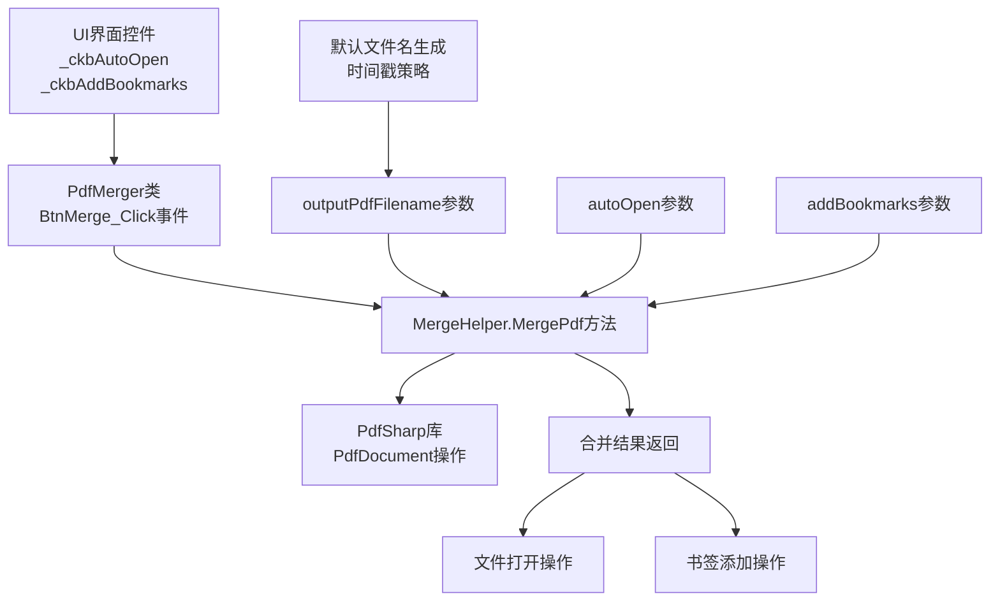

**图表来源**
- [PdfTool/PdfMerger.cs](file://PdfTool/PdfMerger.cs#L68)
- [PdfHelperLibrary/MergeHelper.cs](file://PdfHelperLibrary/MergeHelper.cs#L43-L71)

**章节来源**
- [PdfTool/PdfMerger.cs](file://PdfTool/PdfMerger.cs#L24-L29)
- [PdfHelperLibrary/MergeHelper.cs](file://PdfHelperLibrary/MergeHelper.cs#L16-L42)

## autoOpen参数配置

### 参数作用机制

autoOpen参数控制合并完成后是否自动打开生成的PDF文件。该参数通过UI界面上的复选框控件进行配置，用户可以选择是否启用自动打开功能。

### 实现逻辑分析

在MergeHelper.MergePdf方法中，autoOpen参数的处理逻辑如下：

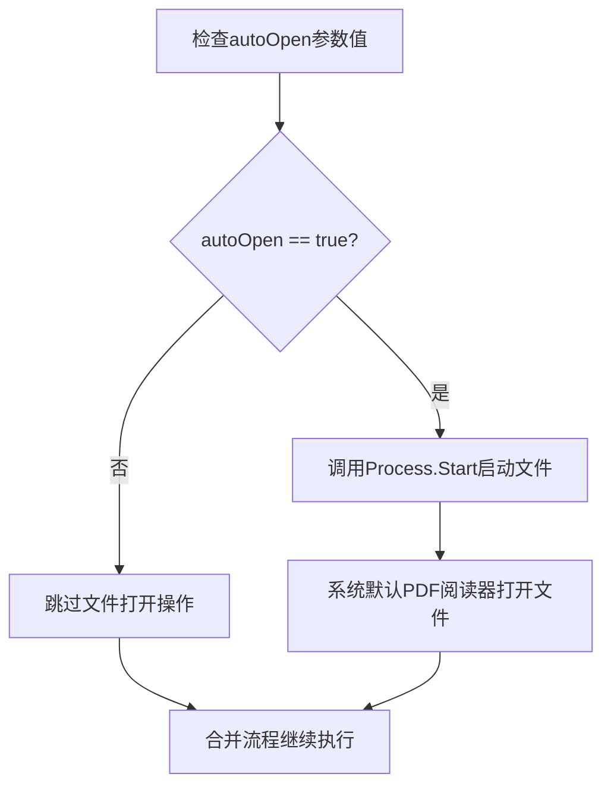

**图表来源**
- [PdfHelperLibrary/MergeHelper.cs](file://PdfHelperLibrary/MergeHelper.cs#L34)

### UI状态获取方式

PdfMerger类通过以下方式获取autoOpen参数的UI状态：

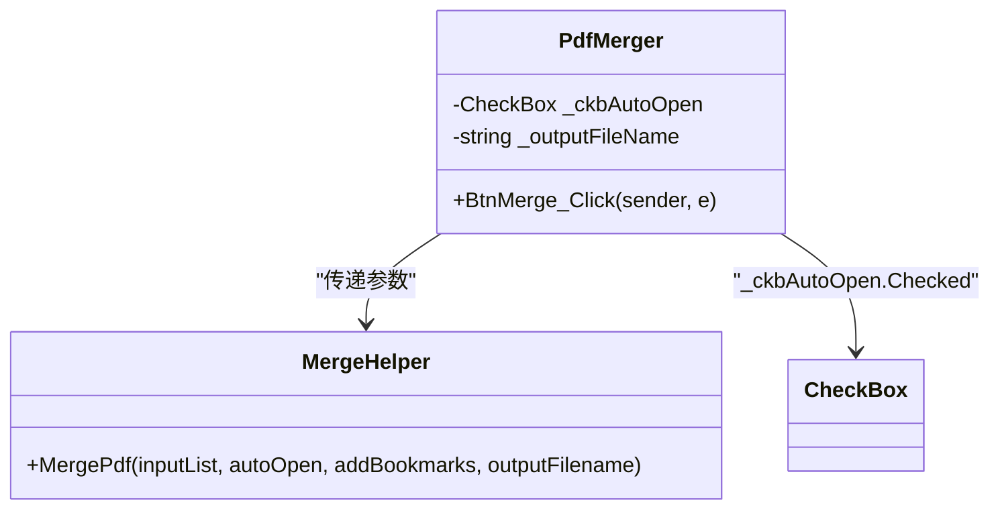

**图表来源**
- [PdfTool/PdfMerger.cs](file://PdfTool/PdfMerger.cs#L25)
- [PdfTool/PdfMerger.cs](file://PdfTool/PdfMerger.cs#L68)

### 自动打开行为特点

1. **系统集成性**：利用操作系统默认PDF阅读器打开文件
2. **异步执行**：Process.Start是非阻塞调用，不影响合并流程
3. **错误容错**：即使文件打开失败，也不会中断合并操作
4. **用户体验**：提供即时反馈，让用户快速查看合并结果

**章节来源**
- [PdfHelperLibrary/MergeHelper.cs](file://PdfHelperLibrary/MergeHelper.cs#L34)
- [PdfTool/PdfMerger.cs](file://PdfTool/PdfMerger.cs#L68)

## addBookmarks参数配置

### 书签添加机制

addBookmarks参数控制是否在合并后的PDF中为每个源文件创建书签节点。书签功能通过PdfSharp库的Outlines集合实现，为用户提供导航便利。

### 书签创建逻辑

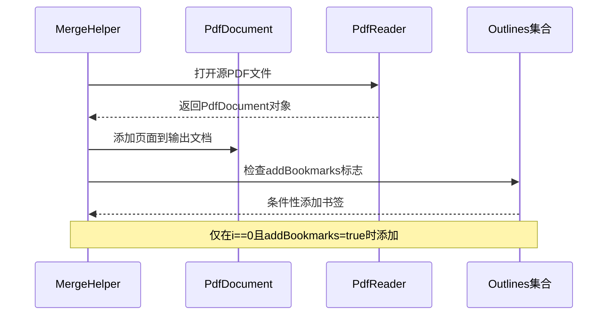

**图表来源**
- [PdfHelperLibrary/MergeHelper.cs](file://PdfHelperLibrary/MergeHelper.cs#L28)
- [PdfHelperLibrary/MergeHelper.cs](file://PdfHelperLibrary/MergeHelper.cs#L56)

### 书签内容生成规则

书签标题基于源文件名生成，具体规则如下：

1. **文件名提取**：使用Path.GetFileNameWithoutExtension()去除扩展名
2. **唯一性保证**：确保每个书签名称在当前PDF中唯一
3. **导航功能**：书签指向对应源文件的第一页（索引0）
4. **层次结构**：所有书签作为顶级节点添加到PDF大纲

### 书签实现细节

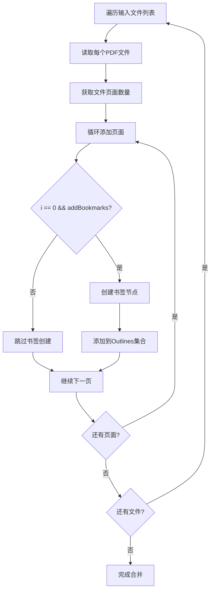

**图表来源**
- [PdfHelperLibrary/MergeHelper.cs](file://PdfHelperLibrary/MergeHelper.cs#L21-L29)
- [PdfHelperLibrary/MergeHelper.cs](file://PdfHelperLibrary/MergeHelper.cs#L51-L58)

**章节来源**
- [PdfHelperLibrary/MergeHelper.cs](file://PdfHelperLibrary/MergeHelper.cs#L28)
- [PdfHelperLibrary/MergeHelper.cs](file://PdfHelperLibrary/MergeHelper.cs#L56)

## outputPdfFilename参数配置

### 默认文件名生成机制

当未指定输出文件名时，系统采用时间戳策略生成默认文件名。这种设计确保每次合并都能产生唯一的输出文件。

### 文件名生成算法

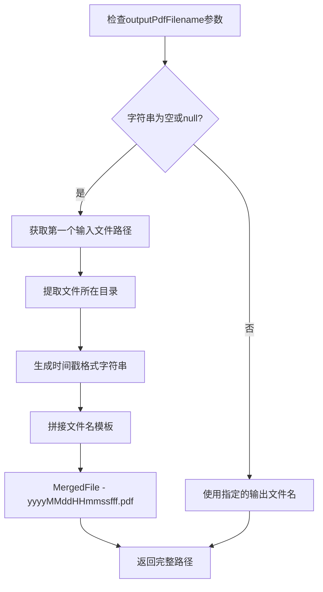

**图表来源**
- [PdfHelperLibrary/MergeHelper.cs](file://PdfHelperLibrary/MergeHelper.cs#L61-L62)
- [PdfHelperLibrary/MergeHelper.cs](file://PdfHelperLibrary/MergeHelper.cs#L31-L32)

### 时间戳格式规范

默认文件名采用以下格式：
- **前缀**：`MergedFile - `
- **时间戳**：`yyyyMMddHHmmssfff`（年月日时分秒毫秒）
- **扩展名**：`.pdf`
- **示例**：`MergedFile - 20241215143025123.pdf`

### 用户自定义输出路径

系统提供自定义输出路径的功能，允许用户指定特定的保存位置和文件名：

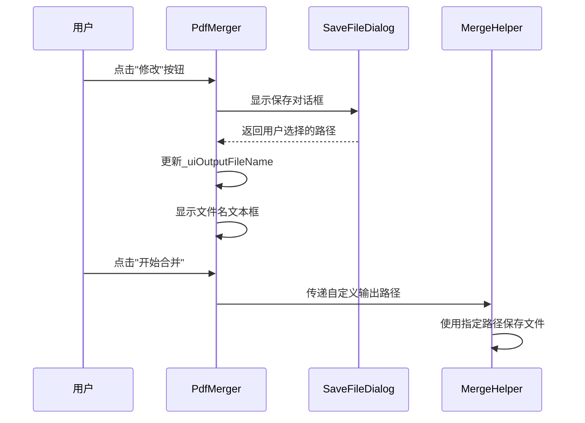

**图表来源**
- [PdfTool/PdfMerger.cs](file://PdfTool/PdfMerger.cs#L51-L57)
- [PdfTool/PdfMerger.cs](file://PdfTool/PdfMerger.cs#L68)

### 路径处理策略

1. **相对路径处理**：自动转换为绝对路径
2. **目录验证**：确保目标目录存在
3. **权限检查**：验证写入权限
4. **冲突避免**：防止覆盖现有文件

**章节来源**
- [PdfHelperLibrary/MergeHelper.cs](file://PdfHelperLibrary/MergeHelper.cs#L61-L62)
- [PdfTool/PdfMerger.cs](file://PdfTool/PdfMerger.cs#L51-L57)
- [PdfTool/PdfMerger.cs](file://PdfTool/PdfMerger.cs#L32-L39)

## UI状态管理机制

### 控件状态同步

PdfMerger类通过私有字段管理UI控件的状态，确保参数配置的一致性和可靠性：

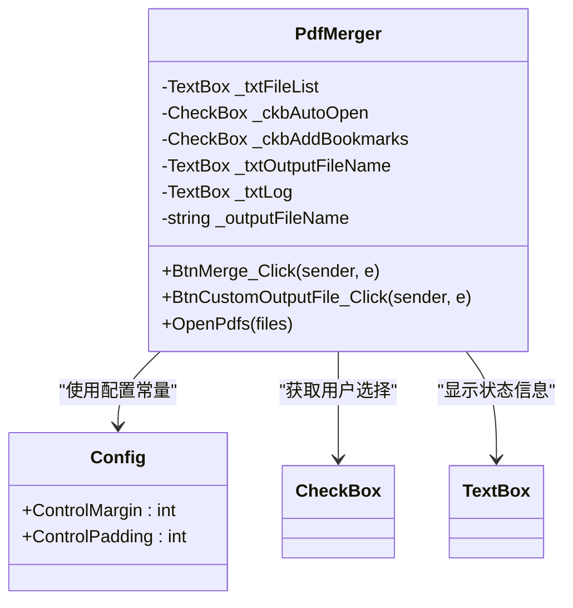

**图表来源**
- [PdfTool/PdfMerger.cs](file://PdfTool/PdfMerger.cs#L24-L29)
- [PdfTool/Config.cs](file://PdfTool/Config.cs#L4-L6)

### 状态获取实现

UI状态通过以下方式传递给底层库：

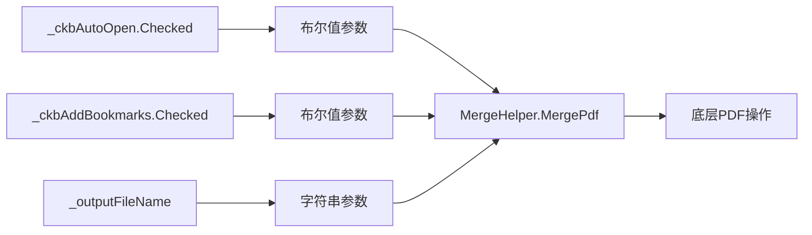

**图表来源**
- [PdfTool/PdfMerger.cs](file://PdfTool/PdfMerger.cs#L68)

### 用户界面布局

UI控件按照功能分组排列，提供直观的操作体验：

| 控件类型 | 功能描述 | 默认状态 | 用户交互 |
|---------|---------|---------|---------|
| CheckBox | 自动打开选项 | 未勾选 | 勾选/取消勾选 |
| CheckBox | 添加书签选项 | 未勾选 | 勾选/取消勾选 |
| TextBox | 输出文件名显示 | 默认路径 | 只读显示 |
| Button | 修改输出路径 | - | 弹出保存对话框 |

**章节来源**
- [PdfTool/PdfMerger.cs](file://PdfTool/PdfMerger.cs#L124-L137)
- [PdfTool/PdfMerger.cs](file://PdfTool/PdfMerger.cs#L51-L57)

## 参数组合行为分析

### 不同配置组合的效果

系统支持多种参数组合，每种组合产生不同的合并行为：

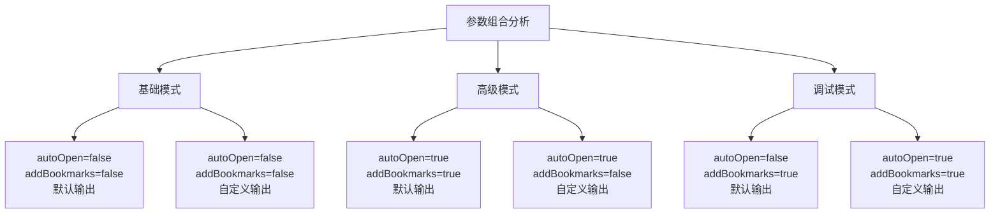

### 行为矩阵表

| autoOpen | addBookmarks | 输出文件名 | 合并结果 |
|---------|-------------|-----------|---------|
| false | false | 默认 | 静默合并，无额外操作 |
| true | false | 默认 | 合并后自动打开文件 |
| false | true | 默认 | 合并后添加书签导航 |
| true | true | 默认 | 合并后自动打开并添加书签 |
| true | false | 自定义 | 自定义路径合并并打开 |
| false | true | 自定义 | 自定义路径合并并添加书签 |

### 性能影响分析

不同参数组合对性能的影响：

1. **autoOpen参数**：
   - 启用时增加系统进程启动开销
   - 对合并速度影响微小
   - 提升用户体验价值显著

2. **addBookmarks参数**：
   - 启用时增加PDF大纲构建时间
   - 复杂度与源文件数量成正比
   - 对最终文件大小影响较小

3. **outputPdfFilename参数**：
   - 默认路径生成无额外开销
   - 自定义路径需要路径验证
   - 主要影响用户体验而非性能

**章节来源**
- [PdfHelperLibrary/MergeHelper.cs](file://PdfHelperLibrary/MergeHelper.cs#L34)
- [PdfHelperLibrary/MergeHelper.cs](file://PdfHelperLibrary/MergeHelper.cs#L28)

## 错误处理与验证

### 异常处理机制

MergeHelper.MergePdf方法实现了完善的异常处理机制：

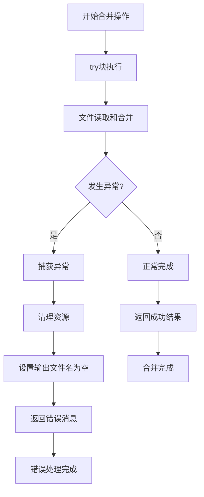

**图表来源**
- [PdfHelperLibrary/MergeHelper.cs](file://PdfHelperLibrary/MergeHelper.cs#L37-L41)
- [PdfHelperLibrary/MergeHelper.cs](file://PdfHelperLibrary/MergeHelper.cs#L68-L71)

### 错误类型分类

系统识别并处理以下类型的错误：

1. **文件访问错误**：
   - 文件不存在
   - 权限不足
   - 文件被占用

2. **PDF格式错误**：
   - 文件损坏
   - 格式不支持
   - 读取异常

3. **内存和资源错误**：
   - 内存不足
   - 文件句柄泄漏
   - 系统资源限制

### 错误恢复策略

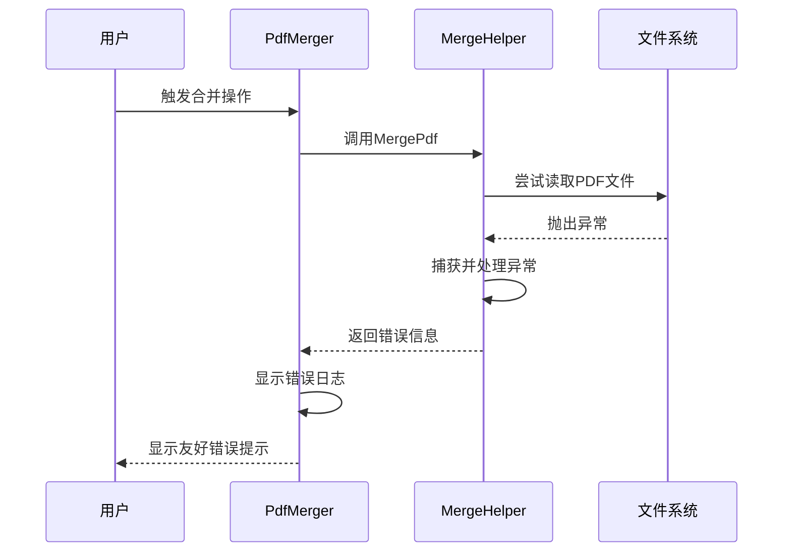

**图表来源**
- [PdfHelperLibrary/MergeHelper.cs](file://PdfHelperLibrary/MergeHelper.cs#L37-L41)

### 日志记录机制

系统提供详细的日志记录功能，帮助用户理解合并过程：

| 日志级别 | 记录内容 | 触发条件 |
|---------|---------|---------|
| 成功信息 | 合并完成路径 | 正常完成时 |
| 错误信息 | 具体异常原因 | 发生异常时 |
| 进度信息 | 页面处理状态 | 处理过程中 |
| 用户信息 | 操作结果反馈 | 重要操作后 |

**章节来源**
- [PdfHelperLibrary/MergeHelper.cs](file://PdfHelperLibrary/MergeHelper.cs#L37-L41)
- [PdfTool/PdfMerger.cs](file://PdfTool/PdfMerger.cs#L68-L70)

## 最佳实践建议

### 参数配置建议

1. **autoOpen参数使用建议**：
   - 在开发和测试环境中启用，便于快速验证
   - 在生产环境或批量处理中禁用，避免干扰用户工作流
   - 考虑用户的PDF阅读器配置，确保兼容性

2. **addBookmarks参数使用建议**：
   - 对于包含多个源文件的合并，强烈建议启用
   - 单文件合并场景可考虑禁用以减少文件大小
   - 复杂文档结构推荐启用，提升用户体验

3. **outputPdfFilename参数使用建议**：
   - 优先使用默认路径，避免路径冲突
   - 在自动化脚本中指定明确的输出路径
   - 考虑文件命名规范，便于后续管理

### 性能优化建议

1. **大文件处理**：
   - 分批处理大型PDF文件列表
   - 监控内存使用情况，及时释放资源
   - 考虑使用异步处理提高响应性

2. **并发安全**：
   - 确保UI线程不会被长时间阻塞
   - 使用进度条或状态指示器提升用户体验
   - 实现取消机制处理长时间运行的操作

### 用户体验优化

1. **界面设计**：
   - 提供清晰的参数说明和默认值提示
   - 实现实时预览功能（如可能）
   - 保持界面简洁，避免参数过多导致混乱

2. **错误处理**：
   - 提供具体的错误解决方案
   - 记录详细的错误日志便于调试
   - 实现自动重试机制处理临时性错误

3. **功能扩展**：
   - 考虑添加批量处理功能
   - 支持拖拽文件直接合并
   - 提供合并结果的预览功能

通过合理配置这些参数，用户可以充分利用PDF合并功能的各种特性，在满足业务需求的同时获得良好的使用体验。