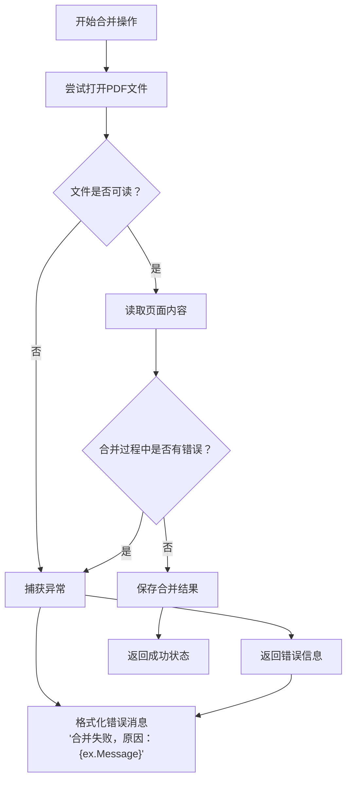
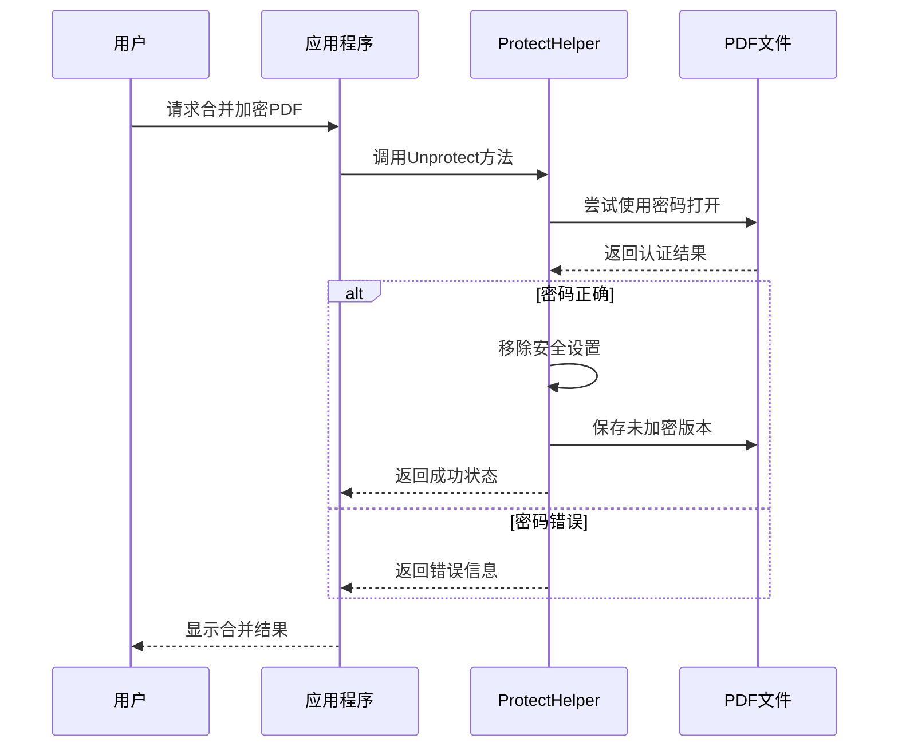
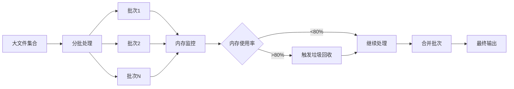
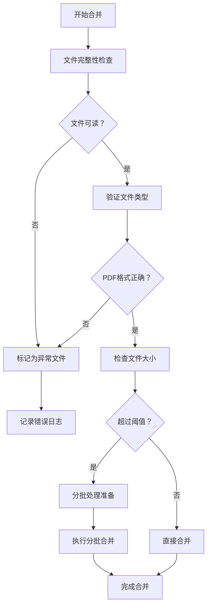
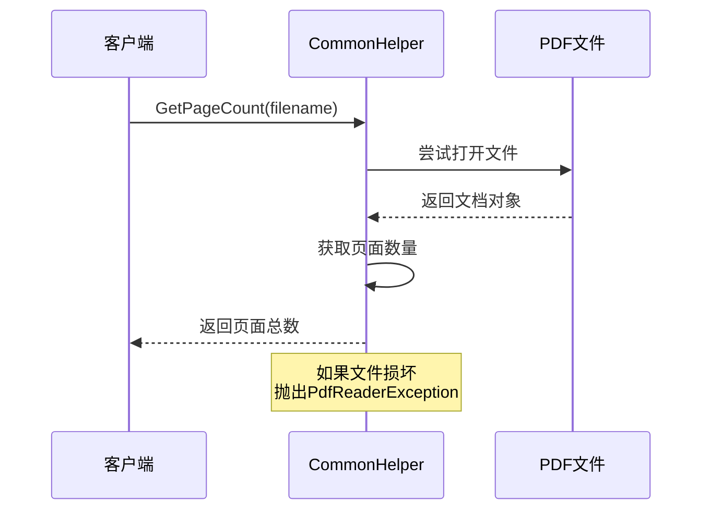

# PDF合并问题排查指南

<cite>
**本文档引用的文件**
- [MergeHelper.cs](file://PdfHelperLibrary/MergeHelper.cs)
- [MergeHelper.cs](file://PdfHelperLibraryX/MergeHelper.cs)
- [CommonHelper.cs](file://PdfHelperLibrary/CommonHelper.cs)
- [ProtectHelper.cs](file://PdfHelperLibrary/ProtectHelper.cs)
- [PdfMerger.cs](file://PdfTool/PdfMerger.cs)
- [PdfRepairer.cs](file://PdfTool/PdfRepairer.cs)
- [WordHelperLibrary/MergeHelper.cs](file://WordHelperLibrary/MergeHelper.cs)
- [WordHelperLibrary/MergeHelper2.cs](file://WordHelperLibrary/MergeHelper2.cs)
</cite>

## 目录
1. [概述](#概述)
2. [异常捕获机制分析](#异常捕获机制分析)
3. [常见问题及解决方案](#常见问题及解决方案)
4. [加密PDF文件处理](#加密pdf文件处理)
5. [字体嵌入与跨平台兼容性](#字体嵌入与跨平台兼容性)
6. [大文件合并性能优化](#大文件合并性能优化)
7. [错误日志解读指南](#错误日志解读指南)
8. [最佳实践建议](#最佳实践建议)
9. [故障排除流程](#故障排除流程)

## 概述

PDF合并是文档处理中的核心功能，但在实际应用中可能遇到各种技术挑战。本指南基于项目中的MergeHelper类实现，详细分析了PDF合并过程中可能出现的问题及其解决方案。

## 异常捕获机制分析

### 核心异常处理架构

项目中的PDF合并操作采用了统一的异常捕获机制，主要体现在以下两个版本的MergeHelper类中：

**图表来源**
- [MergeHelper.cs](file://PdfHelperLibrary/MergeHelper.cs#L16-L40)
- [MergeHelper.cs](file://PdfHelperLibraryX/MergeHelper.cs#L11-L34)

### 异常类型分类

根据代码分析，主要的异常类型包括：

1. **文件访问异常**：文件不存在、权限不足、文件被占用
2. **PDF格式异常**：文件损坏、格式不支持、版本不兼容
3. **内存异常**：大文件导致的内存溢出
4. **安全异常**：加密文件需要密码验证

**章节来源**
- [MergeHelper.cs](file://PdfHelperLibrary/MergeHelper.cs#L37-L40)
- [MergeHelper.cs](file://PdfHelperLibraryX/MergeHelper.cs#L31-L34)

## 常见问题及解决方案

### 文件读取失败

**问题表现**：
- 合并失败，提示"合并失败，原因：无法读取文件"
- 文件路径正确但无法打开

**根本原因**：
- 文件被其他程序占用
- 文件权限不足
- 文件已损坏或格式不正确

**解决方案**：
1. 确保目标文件未被其他PDF阅读器打开
2. 检查文件读写权限
3. 验证文件完整性

### 页面复制错误

**问题表现**：
- 部分页面合并失败
- 合并后的PDF出现空白页面

**根本原因**：
- PDF页面对象损坏
- 字体或图像资源缺失
- 页面结构复杂度超出处理能力

**解决方案**：
1. 使用PDF修复工具预处理文件
2. 分批次合并大型文件集
3. 检查并修复损坏的页面对象

### 内存溢出问题

**问题表现**：
- 大文件合并时程序崩溃
- 系统响应缓慢
- OutOfMemoryException异常

**根本原因**：
- 单次合并文件过多
- 单个文件过大
- 内存管理不当

**解决方案**：
1. 实施分批处理策略
2. 增加内存监控和垃圾回收
3. 使用流式处理减少内存占用

## 加密PDF文件处理

### 加密文件读取失败

**问题表现**：
- 提示"合并失败，原因：需要密码才能打开此文档"
- 无法读取加密PDF的内容

**根本原因**：
- PDF文件设置了用户密码或所有者密码
- 缺少正确的解密凭据
- 密码验证失败

**解决方案**：

**图表来源**
- [ProtectHelper.cs](file://PdfHelperLibrary/ProtectHelper.cs#L47-L67)

**处理策略**：
1. **预先解密**：在合并前使用ProtectHelper.Unprotect方法
2. **密码管理**：建立安全的密码存储和传递机制
3. **批量处理**：对多个加密文件实施统一的解密策略

**章节来源**
- [ProtectHelper.cs](file://PdfHelperLibrary/ProtectHelper.cs#L47-L67)

## 字体嵌入与跨平台兼容性

### 字体冲突问题

**问题表现**：
- 合并后字体显示异常
- 文字重叠或错位
- 特殊字符显示为方块

**根本原因**：
- 源PDF使用了本地字体
- 目标系统缺少相应字体
- 字体嵌入不完整

**解决方案**：
1. **字体预检查**：使用CommonHelper.GetPageCount验证文件可读性
2. **字体嵌入**：确保源PDF包含完整的字体信息
3. **跨平台适配**：选择广泛支持的标准字体

### 跨平台兼容性问题

**问题表现**：
- 在不同操作系统上显示效果不一致
- 字体渲染质量差异明显
- 页面布局偏移

**解决方案**：
1. **标准化处理**：统一使用PDF/A标准格式
2. **测试验证**：在目标平台上进行预览测试
3. **降级处理**：对不兼容的字体进行替换

**章节来源**
- [CommonHelper.cs](file://PdfHelperLibrary/CommonHelper.cs#L11-L25)

## 大文件合并性能优化

### 内存管理策略

**图表来源**
- [PdfMerger.cs](file://PdfTool/PdfMerger.cs#L61-L68)

### 性能优化建议

1. **分批处理**：将大文件集分割为合理大小的批次
2. **流式处理**：采用流式读取减少内存占用
3. **异步处理**：使用后台线程进行合并操作
4. **资源清理**：及时释放不再使用的PDF对象

**章节来源**
- [PdfMerger.cs](file://PdfTool/PdfMerger.cs#L61-L68)

## 错误日志解读指南

### 日志格式分析

根据代码实现，错误信息遵循统一格式："合并失败，原因：{ex.Message}"。这种标准化的日志格式便于问题定位和自动化处理。

### 常见错误消息解析

| 错误消息模式 | 可能原因 | 解决方案 |
|-------------|----------|----------|
| "无法读取文件" | 文件不存在或权限不足 | 检查文件路径和权限 |
| "需要密码才能打开此文档" | PDF文件加密 | 使用Unprotect方法解密 |
| "文件格式不支持" | PDF版本过旧或格式损坏 | 更新PDF版本或修复文件 |
| "内存不足" | 文件过大或内存泄漏 | 分批处理或增加内存 |

### 调试技巧

1. **启用详细日志**：记录完整的异常堆栈信息
2. **文件验证**：使用CommonHelper.GetPageCount预检查
3. **环境隔离**：在独立环境中测试可疑文件
4. **版本对比**：比较正常和异常文件的属性差异

**章节来源**
- [CommonHelper.cs](file://PdfHelperLibrary/CommonHelper.cs#L11-L25)
- [PdfRepairer.cs](file://PdfTool/PdfRepairer.cs#L55-L65)

## 最佳实践建议

### 预检查流程

### 推荐配置

1. **文件大小限制**：单个文件不超过50MB
2. **批次大小**：每批不超过10个文件
3. **内存阈值**：监控内存使用率在80%以下
4. **超时设置**：设置合理的操作超时时间

### 安全考虑

1. **输入验证**：严格验证文件来源和内容
2. **权限控制**：限制合并操作的文件访问范围
3. **备份策略**：合并前创建原始文件备份
4. **审计日志**：记录所有合并操作的详细信息

**章节来源**
- [PdfMerger.cs](file://PdfTool/PdfMerger.cs#L33-L39)

## 故障排除流程

### 诊断步骤

1. **基础检查**
   - 验证文件是否存在且可访问
   - 检查文件是否被其他程序占用
   - 确认文件格式为标准PDF

2. **功能测试**
   - 单独打开每个PDF文件
   - 测试CommonHelper.GetPageCount功能
   - 验证文件的基本可读性

3. **合并测试**
   - 尝试合并少量文件
   - 逐步增加文件数量
   - 监控内存使用情况

4. **高级诊断**
   - 分析详细的错误日志
   - 使用专门的PDF分析工具
   - 检查系统环境和依赖项

### 自动化检测

项目提供了内置的文件验证机制，通过CommonHelper.GetPageCount方法可以快速检测文件的可读性：

**图表来源**
- [CommonHelper.cs](file://PdfHelperLibrary/CommonHelper.cs#L11-L25)

### 紧急恢复措施

当合并操作失败时，可以采取以下紧急措施：

1. **回滚操作**：撤销部分合并结果
2. **增量合并**：重新从失败点继续
3. **手动修复**：使用专业工具单独处理问题文件
4. **系统重启**：清除内存缓存和临时文件

**章节来源**
- [CommonHelper.cs](file://PdfHelperLibrary/CommonHelper.cs#L11-L25)
- [PdfRepairer.cs](file://PdfTool/PdfRepairer.cs#L43-L84)

## 结论

PDF合并过程中的问题通常源于文件格式、安全性、性能和兼容性等方面。通过理解MergeHelper类的异常处理机制，结合项目提供的预检查工具和最佳实践建议，可以有效预防和解决大多数合并问题。

关键要点：
- 建立完善的预检查流程
- 实施分批处理策略
- 重视错误日志的收集和分析
- 保持系统的稳定性和可维护性

定期更新和维护合并工具，确保其能够适应不断变化的PDF标准和业务需求。