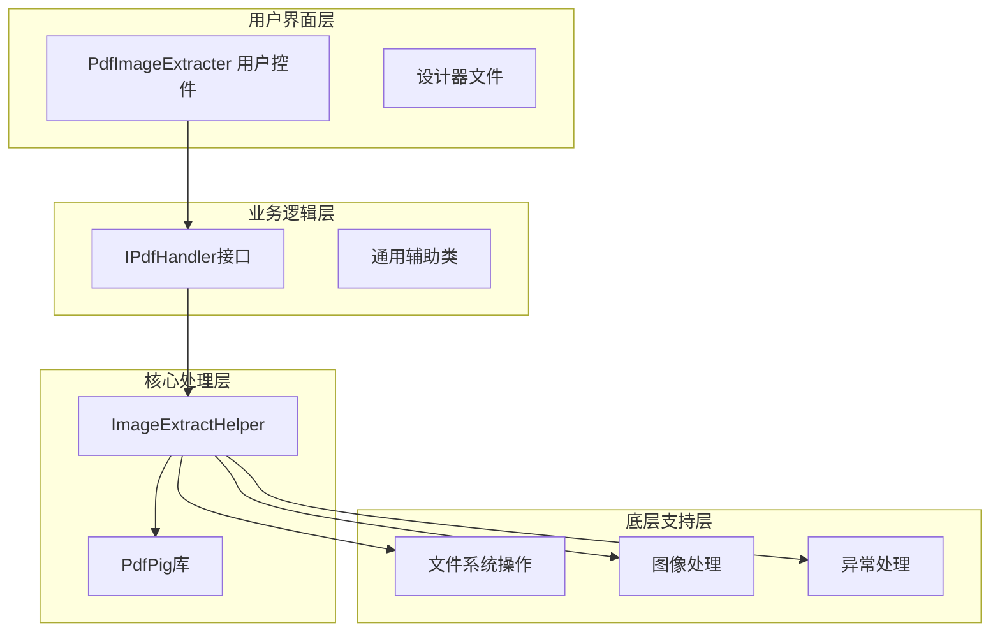
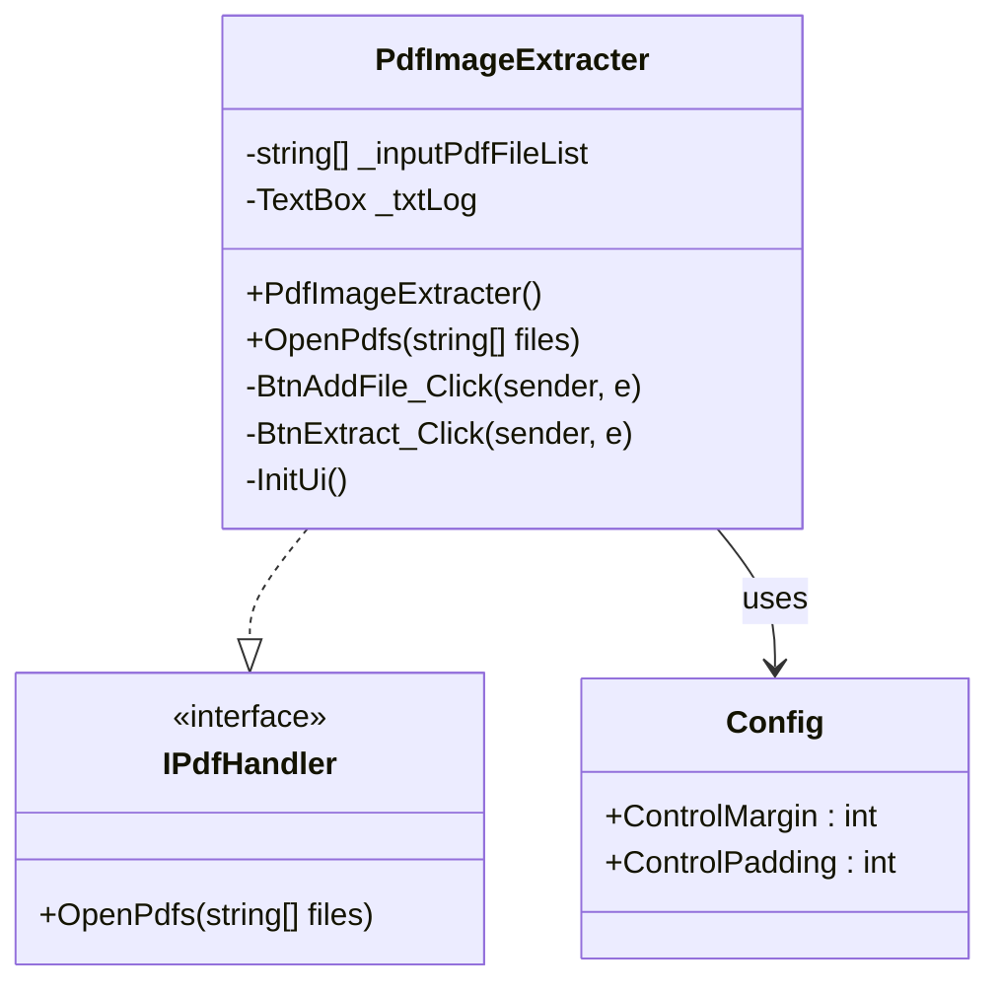
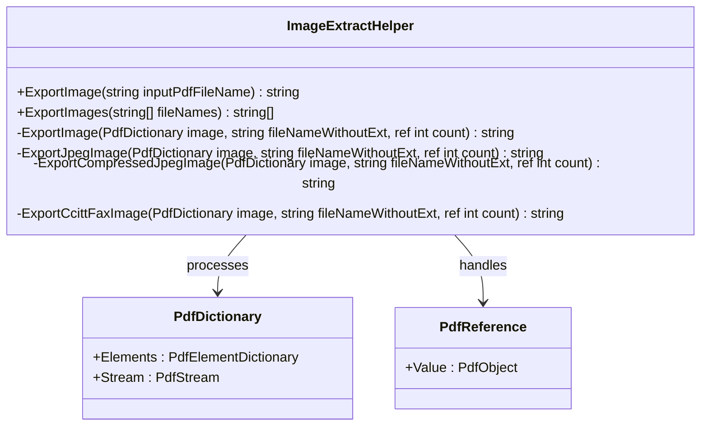
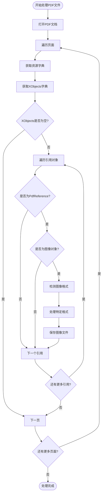
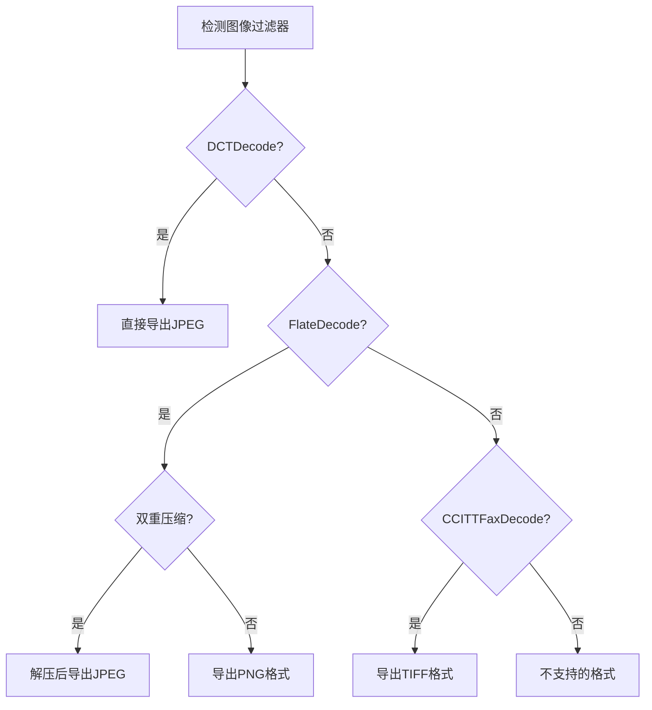
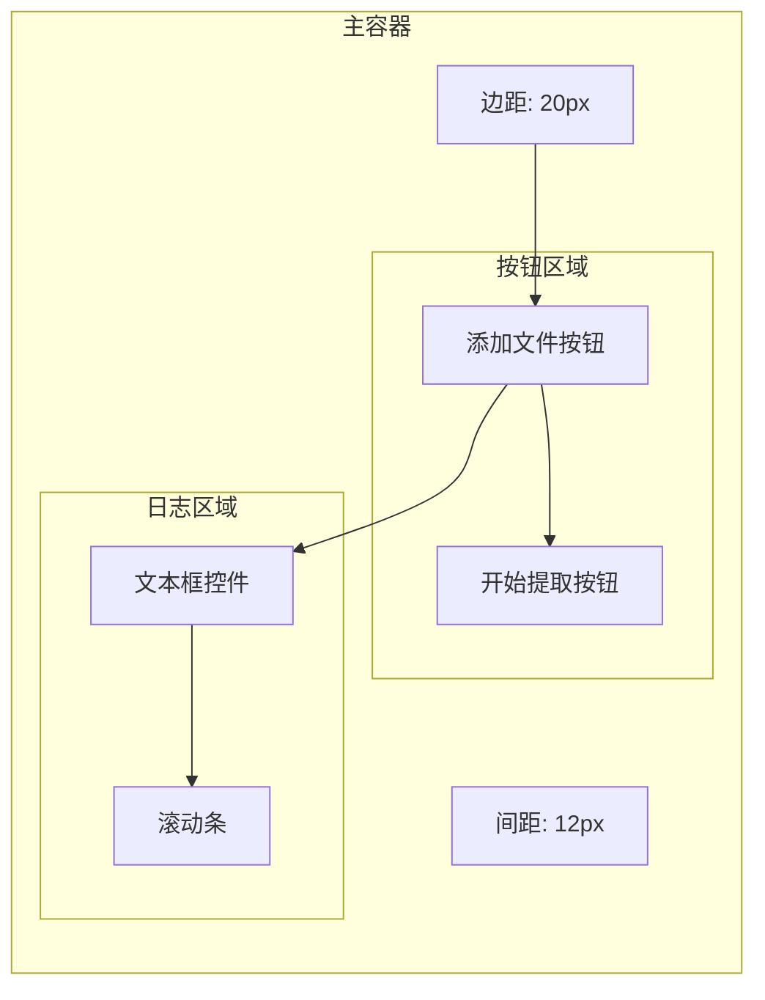
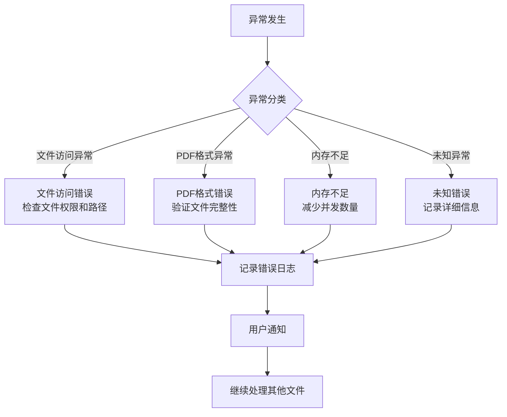
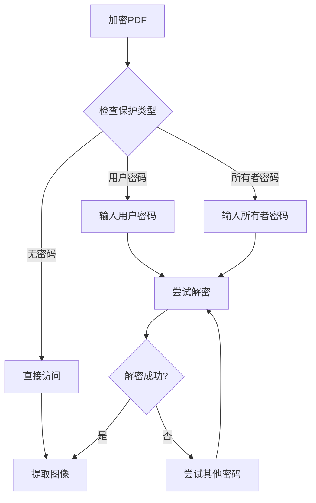

# PDF图片提取器

<cite>
**本文档中引用的文件**
- [PdfImageExtracter.cs](file://PdfTool/PdfImageExtracter.cs)
- [ImageExtractHelper.cs](file://PdfHelperLibrary/ImageExtractHelper.cs)
- [PdfImageExtracter.Designer.cs](file://PdfTool/PdfImageExtracter.Designer.cs)
- [Common.cs](file://PdfTool/Common.cs)
- [PdfHelperLibrary.csproj](file://PdfHelperLibrary/PdfHelperLibrary.csproj)
- [ProtectHelper.cs](file://PdfHelperLibrary/ProtectHelper.cs)
- [PdfProtector.cs](file://PdfTool/PdfProtector.cs)
</cite>

## 目录
1. [简介](#简介)
2. [系统架构](#系统架构)
3. [核心组件分析](#核心组件分析)
4. [PDF图片提取机制](#pdf图片提取机制)
5. [用户界面设计](#用户界面设计)
6. [图像格式处理](#图像格式处理)
7. [错误处理与异常管理](#错误处理与异常管理)
8. [实际应用案例](#实际应用案例)
9. [常见问题与解决方案](#常见问题与解决方案)
10. [性能优化建议](#性能优化建议)
11. [总结](#总结)

## 简介

PDF图片提取器是一个基于.NET框架开发的专业工具，专门用于从PDF文档中提取嵌入的图像资源。该系统采用模块化设计，集成了PdfPig库的强大功能，能够处理各种复杂的PDF文档结构，支持多种图像格式的解码和导出。

系统的核心优势在于其高效的图像提取算法、完善的错误处理机制以及直观的用户界面设计。通过深度解析PDF文档的内部结构，特别是XObject（外部对象）的处理，实现了对嵌入图像的精确识别和提取。

## 系统架构

PDF图片提取器采用分层架构设计，主要包含以下几个层次：

**图表来源**
- [PdfImageExtracter.cs](file://PdfTool/PdfImageExtracter.cs#L1-L119)
- [ImageExtractHelper.cs](file://PdfHelperLibrary/ImageExtractHelper.cs#L1-L182)
- [Common.cs](file://PdfTool/Common.cs#L12-L15)

**章节来源**
- [PdfImageExtracter.cs](file://PdfTool/PdfImageExtracter.cs#L1-L119)
- [ImageExtractHelper.cs](file://PdfHelperLibrary/ImageExtractHelper.cs#L1-L182)

## 核心组件分析

### PdfImageExtracter 主控组件

PdfImageExtracter是整个图片提取功能的主要入口点，实现了IPdfHandler接口，负责协调用户交互和后台处理流程。

**图表来源**
- [PdfImageExtracter.cs](file://PdfTool/PdfImageExtracter.cs#L13-L119)
- [Common.cs](file://PdfTool/Common.cs#L12-L15)
- [PdfImageExtracter.Designer.cs](file://PdfTool/PdfImageExtracter.Designer.cs#L1-L38)

该组件的主要职责包括：
- 文件选择和管理
- 用户界面初始化和布局
- 后台任务执行和进度反馈
- 错误信息显示和日志记录

### ImageExtractHelper 核心处理引擎

ImageExtractHelper是系统的核心处理引擎，负责具体的PDF文档解析和图像提取工作。

**图表来源**
- [ImageExtractHelper.cs](file://PdfHelperLibrary/ImageExtractHelper.cs#L15-L182)

**章节来源**
- [PdfImageExtracter.cs](file://PdfTool/PdfImageExtracter.cs#L1-L119)
- [ImageExtractHelper.cs](file://PdfHelperLibrary/ImageExtractHelper.cs#L1-L182)

## PDF图片提取机制

### 基于PdfPig库的图像数据解析

系统采用PdfPig库作为底层PDF解析引擎，通过以下步骤实现图像提取：

**图表来源**
- [ImageExtractHelper.cs](file://PdfHelperLibrary/ImageExtractHelper.cs#L17-L40)

### XObject处理机制

XObject（外部对象）是PDF文档中存储图像、字体、颜色空间等资源的关键机制。系统通过以下方式处理XObject：

1. **资源字典解析**：从每个页面的资源字典中提取"/Resources"键值
2. **XObjects字典定位**：在资源字典中查找"/XObject"子字典
3. **引用对象遍历**：迭代处理XObjects字典中的所有引用对象
4. **类型验证**：确认对象类型为"/Image"的图像对象

### 图像流解码过程

系统支持多种图像编码格式，每种格式都有相应的解码策略：

**图表来源**
- [ImageExtractHelper.cs](file://PdfHelperLibrary/ImageExtractHelper.cs#L92-L122)

**章节来源**
- [ImageExtractHelper.cs](file://PdfHelperLibrary/ImageExtractHelper.cs#L17-L182)

## 用户界面设计

### 界面布局与控件组织

PdfImageExtracter采用现代化的Windows Forms设计，提供直观的操作界面：

**图表来源**
- [PdfImageExtracter.cs](file://PdfTool/PdfImageExtracter.cs#L83-L116)

### 批量提取功能

系统支持批量处理多个PDF文件，通过BackgroundWorker实现异步处理：

- **多文件选择**：支持Ctrl+点击或Shift+点击进行多选
- **进度反馈**：实时显示处理进度和状态信息
- **并发控制**：避免界面冻结，保持响应性
- **结果汇总**：统一显示处理结果和错误信息

### 进度反馈机制

系统实现了完善的进度反馈机制：

1. **实时更新**：处理过程中实时更新日志窗口
2. **状态指示**：显示当前处理的文件名和进度
3. **错误报告**：详细记录处理过程中的异常信息
4. **完成通知**：处理完成后给出明确的完成提示

**章节来源**
- [PdfImageExtracter.cs](file://PdfTool/PdfImageExtracter.cs#L42-L82)

## 图像格式处理

### 支持的图像格式

系统支持多种常见的PDF图像格式：

| 格式 | 编码器 | 输出扩展名 | 处理方式 |
|------|--------|------------|----------|
| JPEG | DCTDecode | .jpeg | 直接写入原始流 |
| 压缩JPEG | FlateDecode + DCTDecode | .jpeg | 先解压后写入 |
| PNG | FlateDecode | .png | 需要格式转换 |
| TIFF | CCITTFaxDecode | .tiff | 特殊解码处理 |

### 文件命名规则

系统采用智能的文件命名策略，确保文件唯一性和可追溯性：

- **基础命名**：`原文件名_序号.扩展名`
- **序号递增**：同一PDF中的图像按顺序编号
- **格式标识**：根据图像格式自动添加相应扩展名
- **冲突避免**：确保文件名在目标目录中唯一

### 图像质量保证

系统在处理过程中注重图像质量的保持：

- **无损解码**：对于支持的格式尽量保持原始质量
- **格式转换**：对于不支持的格式提供最佳转换方案
- **元数据保留**：尽可能保留原始图像的元数据信息

**章节来源**
- [ImageExtractHelper.cs](file://PdfHelperLibrary/ImageExtractHelper.cs#L92-L178)

## 错误处理与异常管理

### 异常分类与处理策略

系统建立了完善的异常处理体系：

**图表来源**
- [ImageExtractHelper.cs](file://PdfHelperLibrary/ImageExtractHelper.cs#L39-L45)

### 错误恢复机制

系统提供了多层次的错误恢复机制：

1. **文件级恢复**：单个文件处理失败不影响其他文件
2. **格式降级**：不支持的格式尝试降级处理
3. **资源清理**：异常情况下自动清理已分配的资源
4. **状态重置**：处理中断后可以重新开始

### 调试与诊断支持

系统内置了丰富的调试和诊断功能：

- **DEBUG模式输出**：编译时启用详细日志记录
- **异常堆栈跟踪**：提供完整的异常信息
- **性能监控**：记录处理时间和资源使用情况
- **状态快照**：异常时保存当前处理状态

**章节来源**
- [ImageExtractHelper.cs](file://PdfHelperLibrary/ImageExtractHelper.cs#L42-L87)

## 实际应用案例

### 产品手册高清图片提取

以产品手册为例，展示系统的实际应用价值：

**应用场景**：
- 从技术文档中提取产品图片
- 为电商平台准备商品图片素材
- 制作产品演示所需的高清图像

**处理流程**：
1. **批量导入**：一次性导入多个产品手册PDF
2. **自动识别**：系统自动识别并提取所有嵌入图片
3. **质量保证**：确保提取的图片保持原始分辨率和色彩
4. **格式统一**：将不同格式的图片转换为标准格式

**预期效果**：
- 提高图片素材收集效率
- 保证图片质量和一致性
- 减少人工筛选的工作量

### 教育资料图片整理

在教育领域，系统可以用于整理和提取教学资料中的图片：

**应用场景**：
- 从教材PDF中提取插图和图表
- 为在线课程准备配套图片
- 整理考试题库中的图形题目

**处理特点**：
- 支持复杂布局的PDF文档
- 保持数学公式和图表的清晰度
- 自动生成索引和分类

## 常见问题与解决方案

### 加密PDF无法提取

**问题描述**：遇到加密或受保护的PDF文档时，系统无法正常提取图像。

**解决方案**：
1. **预解密处理**：使用PdfProtector模块先解除PDF保护
2. **密码验证**：确保输入正确的解密密码
3. **权限检查**：确认PDF的提取权限设置

**图表来源**
- [ProtectHelper.cs](file://PdfHelperLibrary/ProtectHelper.cs#L42-L68)

### 图像压缩损失问题

**问题描述**：提取的图像出现质量下降或细节丢失。

**解决方案**：
1. **格式选择**：优先选择无损压缩格式
2. **参数调整**：优化图像处理参数
3. **质量评估**：建立图像质量检查机制

### 大文件处理性能

**问题描述**：处理大型PDF文档时出现内存不足或处理缓慢。

**解决方案**：
1. **分块处理**：将大文件分割为小块处理
2. **内存优化**：及时释放不需要的资源
3. **并发控制**：合理设置并发处理数量

**章节来源**
- [ProtectHelper.cs](file://PdfHelperLibrary/ProtectHelper.cs#L1-L68)
- [PdfProtector.cs](file://PdfTool/PdfProtector.cs#L1-L144)

## 性能优化建议

### 内存管理优化

1. **流式处理**：采用流式读取方式，避免一次性加载整个文件
2. **及时释放**：处理完成后立即释放相关资源
3. **缓存策略**：合理使用缓存减少重复计算

### 并发处理优化

1. **线程池管理**：使用ThreadPool提高并发效率
2. **负载均衡**：根据系统资源动态调整并发数量
3. **进度同步**：确保多线程环境下的进度更新正确性

### 文件I/O优化

1. **批量操作**：减少频繁的文件读写操作
2. **临时文件**：合理使用临时文件提高处理速度
3. **磁盘空间**：预留足够的磁盘空间用于中间处理

## 总结

PDF图片提取器是一个功能完善、设计精良的专业工具，通过集成PdfPig库的强大功能，实现了对PDF文档中嵌入图像的高效提取。系统具有以下突出特点：

**技术优势**：
- 基于成熟的PdfPig库，确保解析的准确性和稳定性
- 支持多种图像格式，适应不同的应用场景
- 完善的错误处理机制，提高系统的可靠性

**用户体验**：
- 直观的界面设计，易于操作和理解
- 实时的进度反馈，让用户随时掌握处理状态
- 批量处理功能，提高工作效率

**应用价值**：
- 在文档数字化、内容整理等领域有广泛应用
- 可以为各种媒体制作流程提供高质量的图像素材
- 支持大规模的图像提取需求

通过持续的技术改进和功能扩展，PDF图片提取器将继续为用户提供更加专业和便捷的图像提取服务，成为PDF文档处理领域的重要工具。