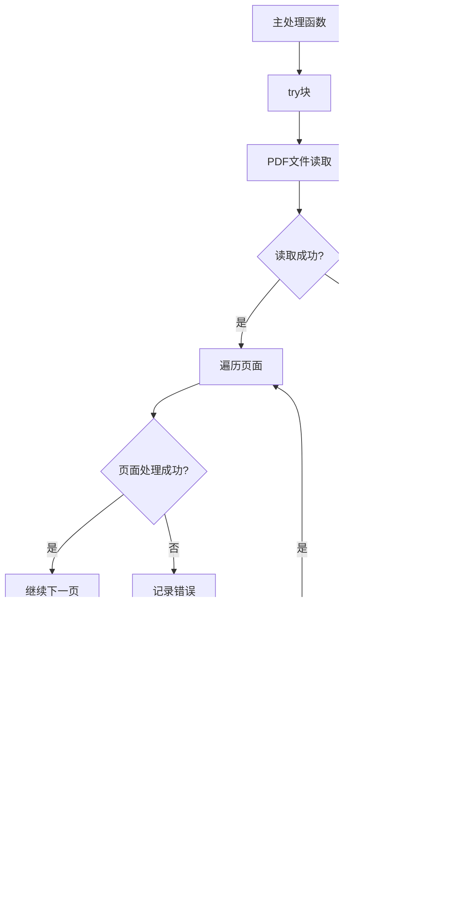

# 技术原理

<cite>
**本文档中引用的文件**
- [ImageExtractHelper.cs](file://PdfHelperLibrary/ImageExtractHelper.cs)
- [PdfImageExtracter.cs](file://PdfTool/PdfImageExtracter.cs)
- [CommonHelper.cs](file://PdfHelperLibrary/CommonHelper.cs)
- [PdfHelperLibrary.csproj](file://PdfHelperLibrary/PdfHelperLibrary.csproj)
- [ExcelHelperLibrary/ImageExtractHelper.cs](file://ExcelHelperLibrary/ImageExtractHelper.cs)
</cite>

## 目录
1. [引言](#引言)
2. [项目结构概述](#项目结构概述)
3. [核心组件分析](#核心组件分析)
4. [架构概览](#架构概览)
5. [详细组件分析](#详细组件分析)
6. [图像编码格式处理](#图像编码格式处理)
7. [文件命名与计数机制](#文件命名与计数机制)
8. [错误处理与异常管理](#错误处理与异常管理)
9. [性能考虑](#性能考虑)
10. [故障排除指南](#故障排除指南)
11. [结论](#结论)

## 引言

本文档深入解析了基于PDFsharp库的图像提取机制，详细阐述了如何通过遍历PDF页面资源字典和XObject对象识别嵌入图像的技术原理。该系统支持多种图像编码格式的处理，包括JPEG原始流直接输出、Flate压缩JPEG解码流程以及CCITT Fax图像转换为TIFF的实现方式。

## 项目结构概述

PDF工具项目采用模块化架构设计，主要包含以下核心模块：

**图表来源**
- [PdfHelperLibrary.csproj](file://PdfHelperLibrary/PdfHelperLibrary.csproj#L35-L95)
- [PdfImageExtracter.cs](file://PdfTool/PdfImageExtracter.cs#L1-L119)

**章节来源**
- [PdfHelperLibrary.csproj](file://PdfHelperLibrary/PdfHelperLibrary.csproj#L1-L127)

## 核心组件分析

### ImageExtractHelper类架构

ImageExtractHelper是整个图像提取系统的核心类，提供了静态方法来处理PDF文件中的图像提取操作。

**图表来源**
- [ImageExtractHelper.cs](file://PdfHelperLibrary/ImageExtractHelper.cs#L15-L182)

**章节来源**
- [ImageExtractHelper.cs](file://PdfHelperLibrary/ImageExtractHelper.cs#L1-L182)

## 架构概览

图像提取系统采用分层架构设计，从PDF文件读取到最终图像输出形成完整的处理流水线：

**图表来源**
- [ImageExtractHelper.cs](file://PdfHelperLibrary/ImageExtractHelper.cs#L17-L40)
- [ImageExtractHelper.cs](file://PdfHelperLibrary/ImageExtractHelper.cs#L89-L104)

## 详细组件分析

### PDF页面遍历与资源字典访问

系统首先通过PDFsharp库打开PDF文件，然后逐页遍历以访问每个页面的资源字典：

**图表来源**
- [ImageExtractHelper.cs](file://PdfHelperLibrary/ImageExtractHelper.cs#L21-L39)
- [PdfImageExtracter.cs](file://PdfTool/PdfImageExtracter.cs#L60-L65)

### 图像过滤与类型识别

系统通过检查XObject对象的Subtype属性来识别图像对象：

**图表来源**
- [ImageExtractHelper.cs](file://PdfHelperLibrary/ImageExtractHelper.cs#L36-L37)
- [ImageExtractHelper.cs](file://PdfHelperLibrary/ImageExtractHelper.cs#L69-L71)

**章节来源**
- [ImageExtractHelper.cs](file://PdfHelperLibrary/ImageExtractHelper.cs#L24-L39)
- [ImageExtractHelper.cs](file://PdfHelperLibrary/ImageExtractHelper.cs#L64-L77)

## 图像编码格式处理

### DCTDecode格式处理

DCTDecode是最常见的JPEG图像编码格式，PDF文件中的JPEG图像通常采用这种编码：

**图表来源**
- [ImageExtractHelper.cs](file://PdfHelperLibrary/ImageExtractHelper.cs#L107-L117)

### FlateDecode格式处理

FlateDecode用于压缩的图像数据，系统目前对此格式的处理处于待办状态：

**图表来源**
- [ImageExtractHelper.cs](file://PdfHelperLibrary/ImageExtractHelper.cs#L119-L132)

### 组合编码格式处理

对于FlateDecode后接DCTDecode的组合格式，系统实现了专门的解压流程：

**图表来源**
- [ImageExtractHelper.cs](file://PdfHelperLibrary/ImageExtractHelper.cs#L134-L155)

### CCITTFaxDecode格式处理

CCITTFaxDecode主要用于黑白文档扫描，系统将其转换为TIFF格式：

**图表来源**
- [ImageExtractHelper.cs](file://PdfHelperLibrary/ImageExtractHelper.cs#L157-L178)

**章节来源**
- [ImageExtractHelper.cs](file://PdfHelperLibrary/ImageExtractHelper.cs#L89-L104)
- [ImageExtractHelper.cs](file://PdfHelperLibrary/ImageExtractHelper.cs#L107-L178)

## 文件命名与计数机制

系统采用统一的文件命名规则来组织提取的图像文件：

### 命名规则

文件名格式为：`原文件名_序号.扩展名`

其中：
- **原文件名**：来自输入PDF文件的基本名称
- **序号**：从0开始的递增计数器
- **扩展名**：根据图像编码格式自动确定

### 计数机制

计数器在每次成功提取图像时递增，确保文件名的唯一性：

**图表来源**
- [ImageExtractHelper.cs](file://PdfHelperLibrary/ImageExtractHelper.cs#L22-L40)
- [ImageExtractHelper.cs](file://PdfHelperLibrary/ImageExtractHelper.cs#L111-L116)

**章节来源**
- [ImageExtractHelper.cs](file://PdfHelperLibrary/ImageExtractHelper.cs#L111-L116)
- [ImageExtractHelper.cs](file://PdfHelperLibrary/ImageExtractHelper.cs#L148-L152)
- [ImageExtractHelper.cs](file://PdfHelperLibrary/ImageExtractHelper.cs#L166-L177)

## 错误处理与异常管理

系统实现了多层次的错误处理机制：

### 异常捕获层次

**图表来源**
- [ImageExtractHelper.cs](file://PdfHelperLibrary/ImageExtractHelper.cs#L18-L45)
- [ImageExtractHelper.cs](file://PdfHelperLibrary/ImageExtractHelper.cs#L54-L86)

### 错误恢复策略

系统采用文件移动的方式进行错误恢复，避免损坏的PDF文件影响后续处理。

**章节来源**
- [ImageExtractHelper.cs](file://PdfHelperLibrary/ImageExtractHelper.cs#L18-L45)
- [ImageExtractHelper.cs](file://PdfHelperLibrary/ImageExtractHelper.cs#L54-L86)

## 性能考虑

### 内存管理

系统在处理大型PDF文件时采用了流式处理方式，避免一次性加载整个文件到内存：

- **流式读取**：直接从PDF流中读取图像数据
- **及时释放**：使用using语句确保资源及时释放
- **内存优化**：针对大图像采用分块处理

### 并发处理

虽然当前实现是单线程的，但系统架构支持并发处理多个PDF文件的能力。

## 故障排除指南

### 常见问题与解决方案

| 问题类型 | 可能原因 | 解决方案 |
|---------|---------|---------|
| 图像提取失败 | PDF文件损坏 | 检查文件完整性，尝试修复 |
| PNG格式不支持 | 功能待实现 | 使用JPEG或TIFF格式替代 |
| 内存不足 | 大型图像文件 | 分批处理或增加内存限制 |
| 权限错误 | 文件访问权限 | 检查文件读写权限 |

### 调试支持

系统在调试模式下提供详细的进度信息，便于问题诊断。

**章节来源**
- [ImageExtractHelper.cs](file://PdfHelperLibrary/ImageExtractHelper.cs#L74-L86)

## 结论

基于PDFsharp库的图像提取机制展现了现代PDF处理技术的强大能力。通过深入理解PDF文件结构和图像编码格式，系统能够高效地识别、解码和导出嵌入图像。尽管PNG格式的支持仍处于待开发阶段，但系统的模块化设计为未来的功能扩展提供了良好的基础。

该技术方案的主要优势包括：
- 支持多种标准图像编码格式
- 采用流式处理保证内存效率
- 完善的错误处理和恢复机制
- 清晰的文件命名和组织结构

随着PDF技术的不断发展，该系统框架也为进一步的功能扩展和技术升级奠定了坚实的基础。