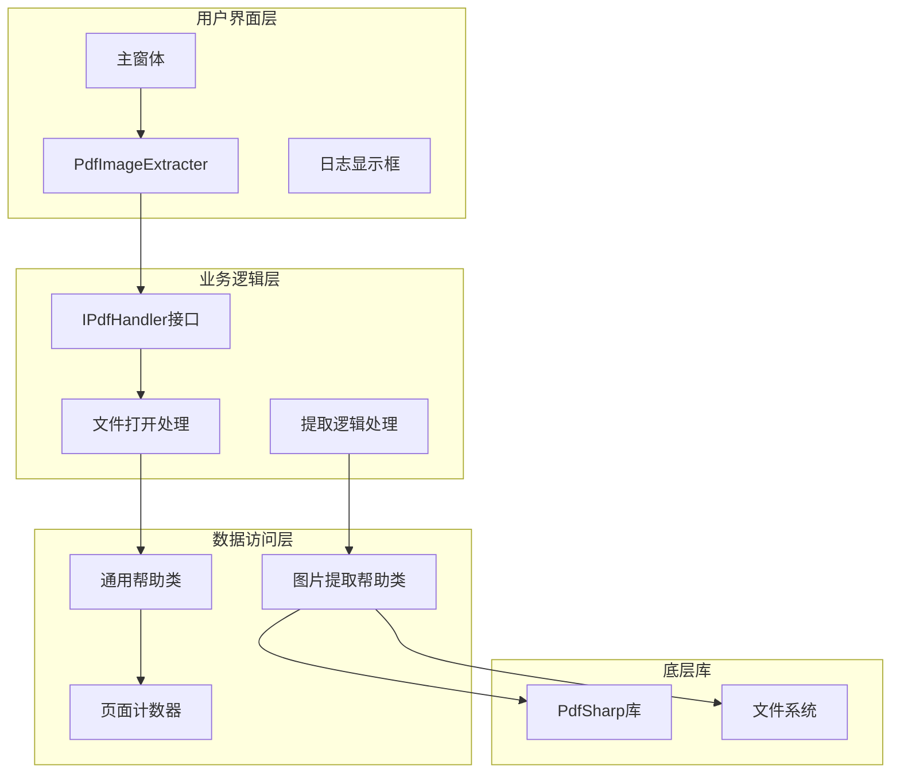
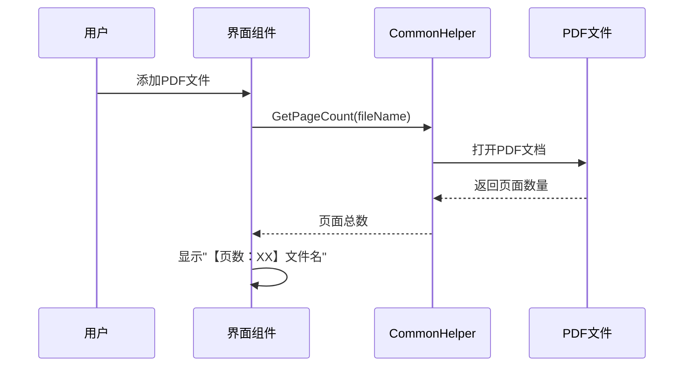
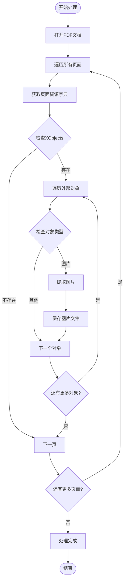
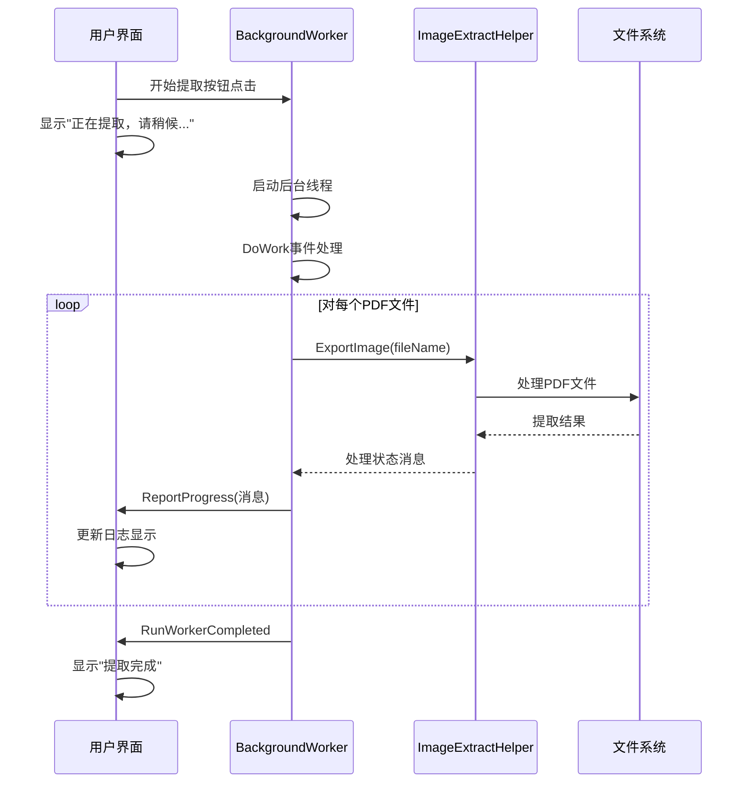
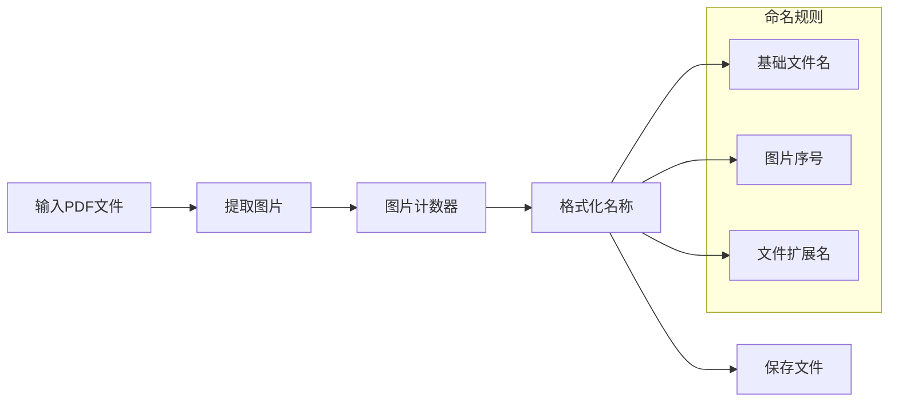
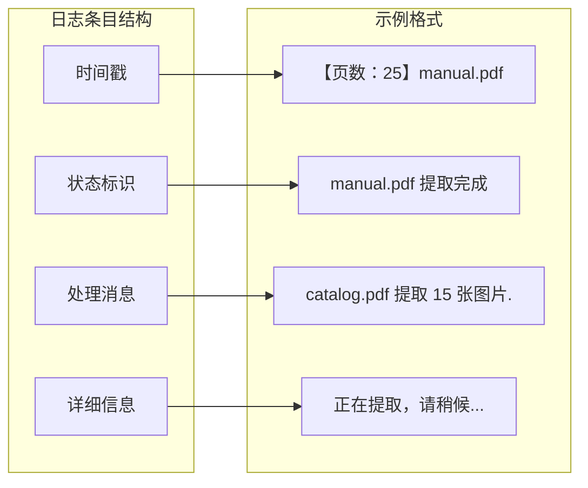

# PDF图片提取器操作指南

<cite>
**本文档中引用的文件**
- [PdfImageExtracter.cs](file://PdfTool/PdfImageExtracter.cs)
- [PdfImageExtracter.Designer.cs](file://PdfTool/PdfImageExtracter.Designer.cs)
- [MainForm.cs](file://PdfTool/MainForm.cs)
- [Config.cs](file://PdfTool/Config.cs)
- [Common.cs](file://PdfTool/Common.cs)
- [CommonHelper.cs](file://PdfHelperLibrary/CommonHelper.cs)
- [ImageExtractHelper.cs](file://PdfHelperLibrary/ImageExtractHelper.cs)
- [PdfTool.csproj](file://PdfTool/PdfTool.csproj)
</cite>

## 目录
1. [简介](#简介)
2. [系统架构概览](#系统架构概览)
3. [界面操作指南](#界面操作指南)
4. [核心功能详解](#核心功能详解)
5. [后台处理机制](#后台处理机制)
6. [输出文件管理](#输出文件管理)
7. [批量处理操作](#批量处理操作)
8. [日志监控系统](#日志监控系统)
9. [典型使用场景](#典型使用场景)
10. [故障排除指南](#故障排除指南)

## 简介

PDF图片提取器是PdfTool应用程序中的一个核心模块，专门用于从PDF文档中提取嵌入的图片资源。该工具采用现代化的异步处理架构，支持单文件和批量处理模式，能够高效地识别、提取并保存PDF中的各种类型图片。

### 主要特性
- **多格式支持**：支持JPEG、PNG等常见图片格式的提取
- **异步处理**：采用BackgroundWorker实现非阻塞式后台处理
- **批量操作**：支持同时处理多个PDF文件
- **实时监控**：提供详细的处理进度和状态信息
- **智能命名**：自动为提取的图片生成有序文件名

## 系统架构概览

PDF图片提取器采用分层架构设计，确保了良好的可维护性和扩展性。

**图表来源**
- [PdfImageExtracter.cs](file://PdfTool/PdfImageExtracter.cs#L1-L119)
- [MainForm.cs](file://PdfTool/MainForm.cs#L1-L194)
- [Common.cs](file://PdfTool/Common.cs#L12-L17)

**章节来源**
- [PdfImageExtracter.cs](file://PdfTool/PdfImageExtracter.cs#L1-L119)
- [MainForm.cs](file://PdfTool/MainForm.cs#L1-L194)

## 界面操作指南

### 启动应用程序

1. **运行程序**：双击可执行文件启动PDF工具
2. **选择标签页**：在主界面中切换到"PDF图片提取"标签页
3. **界面布局**：
   - 左上角："添加文件"按钮
   - 右上角："开始提取"按钮  
   - 底部：日志显示区域

### 添加PDF文件

#### 单文件添加
1. 点击"添加文件"按钮
2. 在弹出的文件选择对话框中
   - 选择"PDF文件(*.pdf)"过滤器
   - 勾选"多选"选项
   - 选择目标PDF文件
3. 确认选择，文件列表会显示在日志区域

#### 拖拽添加
1. 直接将PDF文件拖拽到主窗体
2. 系统会自动识别并添加PDF文件
3. 支持批量拖拽多个文件

**章节来源**
- [PdfImageExtracter.cs](file://PdfTool/PdfImageExtracter.cs#L43-L48)
- [MainForm.cs](file://PdfTool/MainForm.cs#L33-L60)

## 核心功能详解

### 文件信息显示机制

当添加PDF文件时，系统会自动显示详细的页面信息：

**图表来源**
- [PdfImageExtracter.cs](file://PdfTool/PdfImageExtracter.cs#L36-L37)
- [CommonHelper.cs](file://PdfHelperLibrary/CommonHelper.cs#L10-L20)

#### 页面信息含义
- **格式**：`【页数：{页面数量}】{文件名}`
- **示例**：`【页数：25】产品手册.pdf`
- **作用**：帮助用户确认文件包含的页面数量，便于评估处理时间

### 图片提取算法

系统采用深度遍历算法扫描PDF文档中的所有图片资源：

**图表来源**
- [ImageExtractHelper.cs](file://PdfHelperLibrary/ImageExtractHelper.cs#L15-L65)

**章节来源**
- [PdfImageExtracter.cs](file://PdfTool/PdfImageExtracter.cs#L30-L40)
- [CommonHelper.cs](file://PdfHelperLibrary/CommonHelper.cs#L1-L28)
- [ImageExtractHelper.cs](file://PdfHelperLibrary/ImageExtractHelper.cs#L1-L122)

## 后台处理机制

### 异步处理架构

PDF图片提取器采用BackgroundWorker实现真正的异步处理，确保用户界面不会被阻塞：

**图表来源**
- [PdfImageExtracter.cs](file://PdfTool/PdfImageExtracter.cs#L57-L78)

### 处理流程详解

#### 1. 初始化阶段
- 创建BackgroundWorker实例
- 设置WorkerReportsProgress = true
- 注册事件处理器

#### 2. 执行阶段
- 遍历输入文件列表
- 调用ImageExtractHelper处理每个文件
- 实时报告处理进度

#### 3. 完成阶段
- 显示总体完成状态
- 允许用户再次操作

**章节来源**
- [PdfImageExtracter.cs](file://PdfTool/PdfImageExtracter.cs#L50-L80)

## 输出文件管理

### 保存位置规则

提取的图片文件遵循严格的保存规则：

#### 默认保存策略
- **位置**：与原PDF文件相同的目录
- **命名格式**：`{原文件名}_{图片序号}.{扩展名}`
- **示例**：
  - 输入：`product_manual.pdf`
  - 输出：`product_manual_0.jpg`, `product_manual_1.png`, `product_manual_2.jpeg`

#### 文件格式支持
- **JPEG**：原始JPEG格式，保持高质量
- **PNG**：透明度支持，适用于复杂图形
- **其他格式**：根据PDF中图片的实际编码格式自动选择

### 文件命名机制

**图表来源**
- [ImageExtractHelper.cs](file://PdfHelperLibrary/ImageExtractHelper.cs#L92-L122)

**章节来源**
- [ImageExtractHelper.cs](file://PdfHelperLibrary/ImageExtractHelper.cs#L92-L122)

## 批量处理操作

### 批量处理优势

批量处理模式允许用户一次性处理多个PDF文件，显著提高工作效率：

#### 操作步骤
1. **添加多个文件**：使用"添加文件"按钮或拖拽操作
2. **确认文件列表**：检查日志区域显示的所有文件
3. **启动批量处理**：点击"开始提取"按钮
4. **监控进度**：实时查看处理状态

#### 性能优化
- **内存管理**：及时释放已处理文件的内存
- **并发控制**：合理利用系统资源
- **错误隔离**：单个文件错误不影响其他文件处理

### 批量处理示例

假设用户添加了以下三个PDF文件：
- `manual.pdf` (25页)
- `catalog.pdf` (15页)  
- `brochure.pdf` (8页)

系统将按顺序处理：
1. 处理`manual.pdf`，提取所有图片
2. 处理`catalog.pdf`，提取所有图片  
3. 处理`brochure.pdf`，提取所有图片

每个文件的处理状态都会实时更新到日志窗口。

**章节来源**
- [PdfImageExtracter.cs](file://PdfTool/PdfImageExtracter.cs#L30-L40)
- [PdfImageExtracter.cs](file://PdfTool/PdfImageExtracter.cs#L50-L80)

## 日志监控系统

### 日志显示机制

系统提供了完善的日志监控功能，帮助用户实时跟踪处理进度：

#### 日志内容层次
1. **文件信息**：添加文件时显示页面数量
2. **处理状态**：实时显示每个文件的处理进度
3. **完成通知**：处理完成后显示总结信息
4. **错误信息**：记录处理过程中的异常情况

#### 日志格式规范

**图表来源**
- [PdfImageExtracter.cs](file://PdfTool/PdfImageExtracter.cs#L36-L37)
- [PdfImageExtracter.cs](file://PdfTool/PdfImageExtracter.cs#L62-L64)

### 进度监控功能

#### 实时更新机制
- **事件驱动**：通过ProgressChanged事件实时更新
- **状态同步**：确保UI线程的安全更新
- **用户体验**：提供流畅的交互体验

#### 监控指标
- **当前处理文件**：显示正在处理的文件名
- **处理进度**：实时反映处理状态
- **统计信息**：显示成功/失败的文件数量

**章节来源**
- [PdfImageExtracter.cs](file://PdfTool/PdfImageExtracter.cs#L67-L77)

## 典型使用场景

### 场景一：产品手册图片提取

**应用场景**：从产品说明书PDF中提取所有产品图片，用于产品展示或在线商城

**操作流程**：
1. 添加产品手册PDF文件
2. 确认页面数量（如25页）
3. 点击"开始提取"
4. 等待处理完成
5. 查看输出文件（如`product_manual_0.jpg`, `product_manual_1.png`）

**预期结果**：
- 成功提取所有产品图片
- 保持原始图片质量
- 自动生成有序文件名

### 场景二：扫描文档图片分离

**应用场景**：从扫描的纸质文档PDF中提取可编辑的文字内容

**操作流程**：
1. 添加扫描文档PDF
2. 观察页面信息（如50页）
3. 执行批量提取
4. 分析提取结果
5. 整理图片文件

**注意事项**：
- 扫描质量会影响提取效果
- 可能需要后续OCR处理
- 注意版权和隐私问题

### 场景三：教学材料图片整理

**应用场景**：从电子教材PDF中提取所有图表和插图

**操作流程**：
1. 批量添加多个教材PDF
2. 启动批量处理
3. 自动整理提取的图片
4. 按章节分类存储

**优势特点**：
- 提高学习资料的可编辑性
- 便于制作教学辅助材料
- 支持多种图片格式

## 故障排除指南

### 常见问题及解决方案

#### 问题1：文件无法添加
**症状**：点击"添加文件"无响应或报错
**可能原因**：
- 文件已被其他程序占用
- 文件损坏或格式不正确
- 权限不足

**解决方法**：
1. 关闭占用文件的程序
2. 检查文件完整性
3. 以管理员权限运行程序

#### 问题2：提取速度过慢
**症状**：处理大文件时响应缓慢
**可能原因**：
- PDF文件过大或包含大量图片
- 系统资源不足
- 磁盘写入速度慢

**解决方法**：
1. 分批处理大型文件
2. 关闭不必要的后台程序
3. 使用SSD硬盘存储

#### 问题3：部分图片未提取
**症状**：某些图片没有出现在输出文件夹
**可能原因**：
- 图片格式不支持
- 图片被加密或保护
- PDF版本兼容性问题

**解决方法**：
1. 尝试不同的PDF版本
2. 检查图片是否被嵌入
3. 联系技术支持

### 性能优化建议

#### 系统要求
- **操作系统**：Windows 7 SP1或更高版本
- **内存**：至少2GB可用内存
- **磁盘空间**：足够的临时存储空间

#### 最佳实践
1. **定期清理**：清理临时文件和缓存
2. **合理分批**：避免同时处理过多文件
3. **备份重要文件**：处理前做好文件备份
4. **监控资源**：关注系统资源使用情况

**章节来源**
- [PdfImageExtracter.cs](file://PdfTool/PdfImageExtracter.cs#L52-L56)
- [ImageExtractHelper.cs](file://PdfHelperLibrary/ImageExtractHelper.cs#L38-L42)

## 结论

PDF图片提取器是一个功能强大且用户友好的工具，它通过现代化的异步处理架构和直观的用户界面，为用户提供了高效的PDF图片提取解决方案。无论是个人用户还是企业用户，都可以通过本工具轻松完成复杂的图片提取任务。

随着技术的不断发展，该工具将继续优化性能、扩展功能，为用户提供更加优质的PDF处理体验。建议用户在使用过程中注意文件版权问题，遵守相关法律法规，合理合法地使用提取的图片资源。