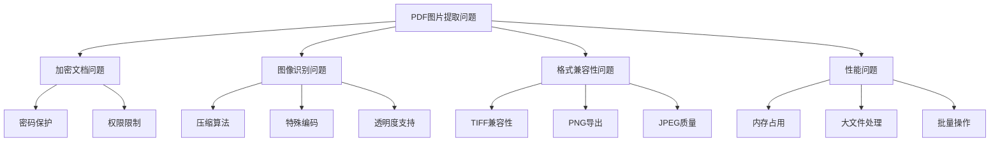
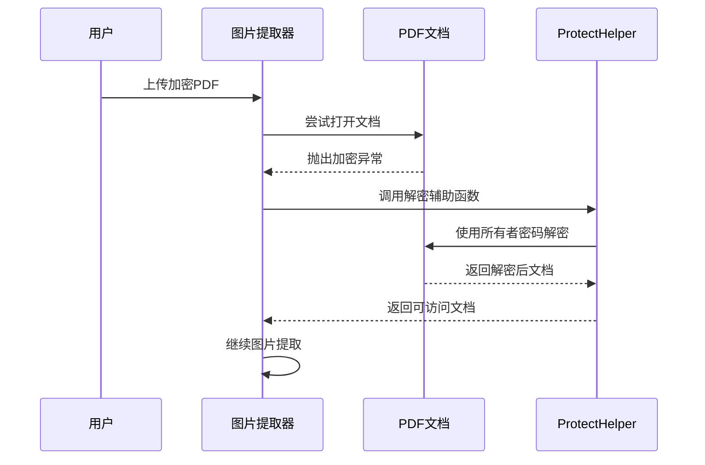
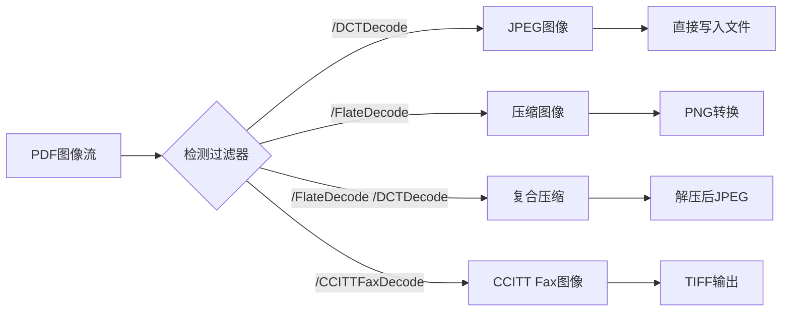
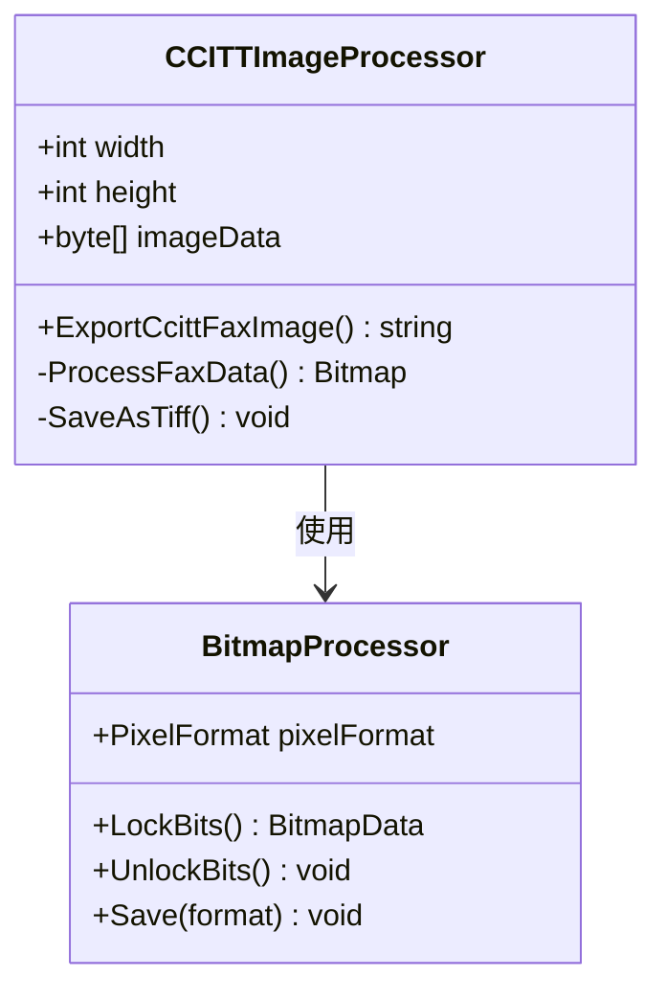
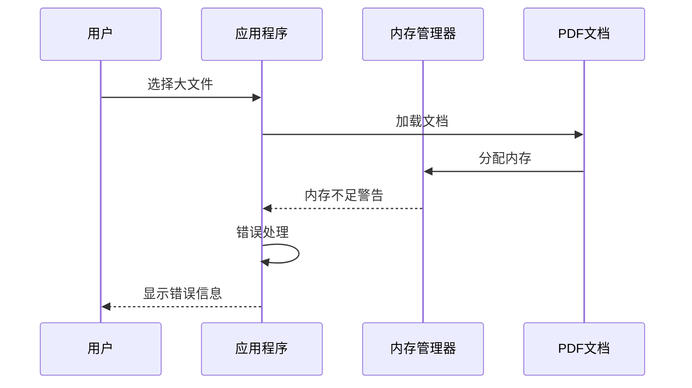
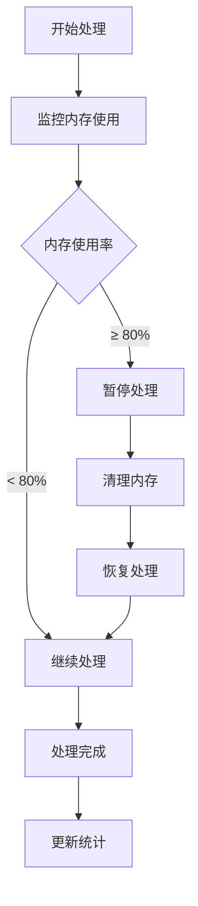

# PDF图片提取器问题解决指南

<cite>
**本文档引用的文件**
- [PdfImageExtracter.cs](file://PdfTool/PdfImageExtracter.cs)
- [ImageExtractHelper.cs](file://PdfHelperLibrary/ImageExtractHelper.cs)
- [ImageExtractHelper.cs](file://PdfHelperLibraryX/ImageExtractHelper.cs)
- [CommonHelper.cs](file://PdfHelperLibrary/CommonHelper.cs)
- [ProtectHelper.cs](file://PdfHelperLibrary/ProtectHelper.cs)
- [PdfProtector.cs](file://PdfTool/PdfProtector.cs)
- [ExtractHelper.cs](file://PdfHelperLibrary/ExtractHelper.cs)
- [PdfRepairer.cs](file://PdfTool/PdfRepairer.cs)
- [Config.cs](file://PdfTool/Config.cs)
</cite>

## 目录
1. [简介](#简介)
2. [常见问题概述](#常见问题概述)
3. [加密PDF处理问题](#加密pdf处理问题)
4. [图像识别问题](#图像识别问题)
5. [TIFF格式兼容性问题](#tiff格式兼容性问题)
6. [内存管理问题](#内存管理问题)
7. [已知限制与解决方案](#已知限制与解决方案)
8. [故障排除指南](#故障排除指南)
9. [最佳实践建议](#最佳实践建议)
10. [总结](#总结)

## 简介

PDF图片提取器是一个专门用于从PDF文档中提取嵌入图像的强大工具。然而，在实际使用过程中，用户可能会遇到各种技术挑战和限制。本指南旨在系统性地分析这些问题，并提供相应的解决方案。

## 常见问题概述

PDF图片提取器在处理不同类型和格式的PDF文档时，可能遇到以下主要问题类别：



## 加密PDF处理问题

### 问题描述

许多PDF文档受到密码保护或权限限制，这会阻止图片提取器正常访问和提取嵌入的图像。

### 根本原因分析

根据代码分析，PDF文档的加密状态直接影响图片提取过程：



**图表来源**
- [ProtectHelper.cs](file://PdfHelperLibrary/ProtectHelper.cs#L30-L68)
- [PdfProtector.cs](file://PdfTool/PdfProtector.cs#L48-L106)

### 解决方案

#### 预先解密文档

1. **使用内置解密功能**
   - 利用`PdfHelperLibrary.ProtectHelper.Unprotect()`方法
   - 需要提供正确的所有者密码
   - 自动移除文档的安全设置

2. **手动预处理步骤**
   ```csharp
   // 示例：预先解密PDF文档
   string decryptedFile = ProtectHelper.Unprotect(
       encryptedPdfPath, 
       tempDecryptedPath, 
       ownerPassword
   );
   ```

3. **批量处理策略**
   - 开发自动化脚本处理多个加密文档
   - 实现密码字典攻击（需谨慎使用）
   - 使用第三方解密服务

**章节来源**
- [ProtectHelper.cs](file://PdfHelperLibrary/ProtectHelper.cs#L30-L68)
- [PdfProtector.cs](file://PdfTool/PdfProtector.cs#L48-L106)

## 图像识别问题

### 压缩算法识别问题

PDF文档可能使用多种压缩算法来存储图像数据，这些算法的识别和处理是提取过程的关键。



**图表来源**
- [ImageExtractHelper.cs](file://PdfHelperLibrary/ImageExtractHelper.cs#L89-L104)

### 特殊编码处理

#### FlateDecode图像处理

对于使用FlateDecode压缩的图像，当前实现存在局限性：

1. **PNG导出限制**
   - 当前版本仅标记为TODO功能
   - 需要实现PDF内部格式到Windows位图的转换
   - 使用GDI+保存为PNG格式

2. **临时解决方案**
   - 使用外部工具进行格式转换
   - 开发自定义转换器
   - 导出为中间格式再处理

#### 复合压缩处理

对于同时使用FlateDecode和DCTDecode的图像：

1. **数据预处理**
   - 移除前两个字节的标记
   - 应用Deflate解压缩
   - 保存为标准JPEG格式

2. **代码实现要点**
   - 正确处理字节流
   - 确保解压缩完整性
   - 验证输出文件有效性

**章节来源**
- [ImageExtractHelper.cs](file://PdfHelperLibrary/ImageExtractHelper.cs#L89-L154)
- [ImageExtractHelper.cs](file://PdfHelperLibraryX/ImageExtractHelper.cs#L87-L98)

## TIFF格式兼容性问题

### CCITT Fax编码问题

CCITT Fax编码是PDF中常见的黑白扫描图像压缩方式，但其处理存在特定挑战。



**图表来源**
- [ImageExtractHelper.cs](file://PdfHelperLibrary/ImageExtractHelper.cs#L157-L177)

### 兼容性问题分析

1. **像素格式限制**
   - 使用Format1bppIndexed格式
   - 黑白图像的位深度限制
   - 颜色映射表问题

2. **TIFF格式约束**
   - 不同TIFF实现的兼容性差异
   - 压缩选项的选择
   - 元数据保留问题

### 解决方案

#### 变通方案

1. **替代输出格式**
   - 导出为PNG格式（需要开发转换器）
   - 使用其他位图格式
   - 开发自定义TIFF处理器

2. **外部工具集成**
   - 调用ImageMagick进行格式转换
   - 使用专业图像处理软件
   - 开发批处理脚本

**章节来源**
- [ImageExtractHelper.cs](file://PdfHelperLibrary/ImageExtractHelper.cs#L157-L177)

## 内存管理问题

### 大文件处理挑战

当PDF文档包含大量图像时，内存使用量可能急剧增加，导致应用程序崩溃或性能下降。



### 内存优化策略

#### 分批处理机制

1. **页面级处理**
   - 逐页加载和处理
   - 及时释放已处理页面的内存
   - 实现进度报告机制

2. **图像级优化**
   - 流式处理大型图像
   - 使用临时文件存储中间结果
   - 实现内存监控和清理

#### 性能监控



### 最佳实践

1. **合理设置阈值**
   - 根据系统内存动态调整
   - 实现自适应处理策略
   - 提供用户配置选项

2. **错误恢复机制**
   - 实现断点续传功能
   - 保存处理进度状态
   - 提供手动恢复选项

**章节来源**
- [PdfImageExtracter.cs](file://PdfTool/PdfImageExtracter.cs#L57-L78)
- [ExtractHelper.cs](file://PdfHelperLibrary/ExtractHelper.cs#L22-L43)

## 已知限制与解决方案

### 功能限制清单

| 限制类型 | 具体问题 | 影响范围 | 临时解决方案 |
|---------|---------|---------|-------------|
| PNG透明度 | 不支持透明PNG导出 | 所有FlateDecode图像 | 导出为其他格式后转换 |
| 编码支持 | 需要额外编码支持 | 特定压缩算法 | 使用外部工具处理 |
| 格式兼容 | TIFF格式兼容性问题 | CCITT Fax图像 | 替换输出格式 |
| 性能限制 | 大文件内存占用高 | 大型PDF文档 | 分批处理 |

### 临时变通方案

#### PNG导出问题

1. **开发转换器**
   ```csharp
   // 示例：PNG转换器架构
   public static class PngConverter
   {
       public static string ConvertToPng(PdfDictionary image, ref int count)
       {
           // 实现PDF内部格式到PNG的转换逻辑
           // 需要开发完整的转换算法
       }
   }
   ```

2. **外部工具集成**
   - ImageMagick命令行工具
   - GIMP批量处理脚本
   - Photoshop自动化脚本

#### 编码支持问题

1. **依赖库扩展**
   - 添加额外的压缩库
   - 实现自定义解码器
   - 集成第三方图像处理库

2. **格式转换流程**
   ```mermaid
flowchart LR
A["原始图像"] --> B["检测编码"]
B --> C{"需要转换?"}
C --> |是| D["应用解码器"]
C --> |否| E["直接输出"]
D --> F["格式转换"]
F --> G["目标格式"]
E --> G
```

**章节来源**
- [ImageExtractHelper.cs](file://PdfHelperLibrary/ImageExtractHelper.cs#L119-L130)
- [ImageExtractHelper.cs](file://PdfHelperLibraryX/ImageExtractHelper.cs#L113-L125)

## 故障排除指南

### 常见错误诊断

#### 文档加载失败

1. **错误类型识别**
   - `PdfReaderException`: 文档格式错误
   - `UnauthorizedAccessException`: 权限不足
   - `IOException`: 文件损坏或访问问题

2. **诊断步骤**
   ```mermaid
flowchart TD
A["文档加载失败"] --> B{"检查文件路径"}
B --> |无效| C["修正路径"]
B --> |有效| D{"检查文件权限"}
D --> |无权限| E["提升权限"]
D --> |有权限| F{"验证文件完整性"}
F --> |损坏| G["修复文档"]
F --> |完整| H["检查加密状态"]
```

#### 图像提取失败

1. **过滤器识别问题**
   - 检查图像流的过滤器属性
   - 验证PDFSharp库的支持范围
   - 实现自定义过滤器处理

2. **内存溢出处理**
   - 监控内存使用情况
   - 实现渐进式处理
   - 提供错误恢复机制

### 调试技巧

#### 日志记录

1. **详细日志级别**
   - 记录每一步的处理状态
   - 保存错误堆栈信息
   - 跟踪内存使用变化

2. **性能监控**
   - 记录处理时间
   - 监控内存峰值
   - 统计成功/失败比率

**章节来源**
- [CommonHelper.cs](file://PdfHelperLibrary/CommonHelper.cs#L11-L25)
- [PdfRepairer.cs](file://PdfTool/PdfRepairer.cs#L43-L84)

## 最佳实践建议

### 预处理建议

1. **文档验证**
   - 在提取前验证PDF完整性
   - 检查加密状态和权限
   - 预估处理时间和资源需求

2. **环境准备**
   - 确保足够的磁盘空间
   - 配置适当的内存限制
   - 安装必要的依赖库

### 批量处理策略

1. **任务调度**
   - 实现队列管理系统
   - 支持优先级处理
   - 提供进度跟踪功能

2. **错误处理**
   - 实现自动重试机制
   - 生成详细的错误报告
   - 提供手动干预选项

### 性能优化

1. **资源管理**
   - 及时释放不再需要的对象
   - 使用对象池模式
   - 实现缓存机制

2. **并发处理**
   - 利用多线程提高效率
   - 实现异步处理模式
   - 合理分配系统资源

## 总结

PDF图片提取器虽然功能强大，但在处理复杂PDF文档时确实面临诸多挑战。通过理解这些问题的根本原因，并采用适当的解决方案，可以显著提高工具的可靠性和适用性。

### 关键要点回顾

1. **加密文档处理**：预先解密是确保成功提取的关键步骤
2. **图像识别**：不同压缩算法需要针对性的处理策略
3. **格式兼容性**：了解输出格式的限制并准备变通方案
4. **内存管理**：合理设计处理流程以避免内存溢出
5. **错误处理**：建立完善的错误诊断和恢复机制

### 未来发展方向

1. **功能增强**
   - 完善PNG透明度支持
   - 扩展格式兼容性
   - 优化大文件处理能力

2. **用户体验改进**
   - 提供更直观的错误信息
   - 实现智能预处理建议
   - 增强批量处理功能

通过持续的技术改进和用户反馈收集，PDF图片提取器将能够更好地满足各种复杂的文档处理需求。