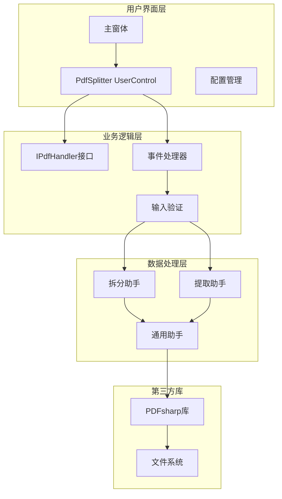
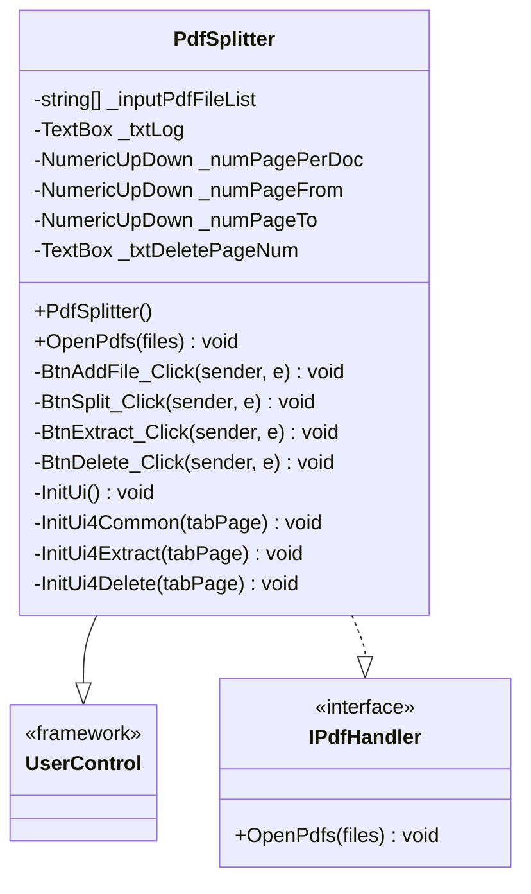
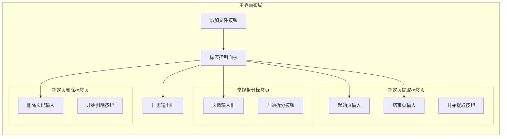
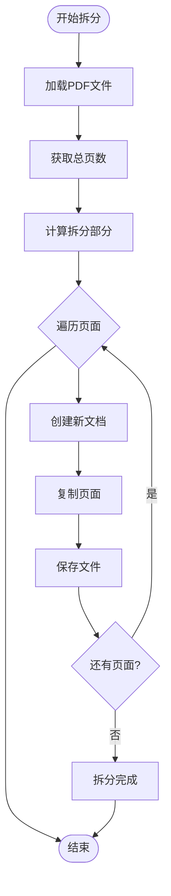
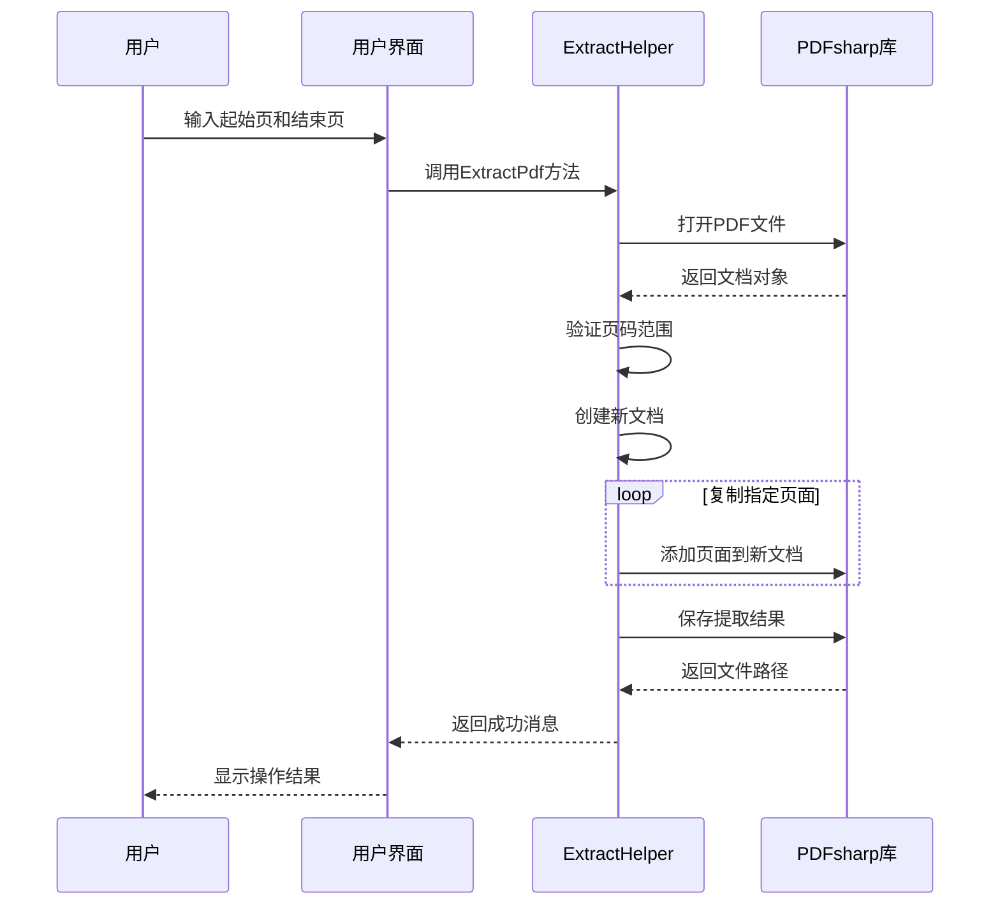
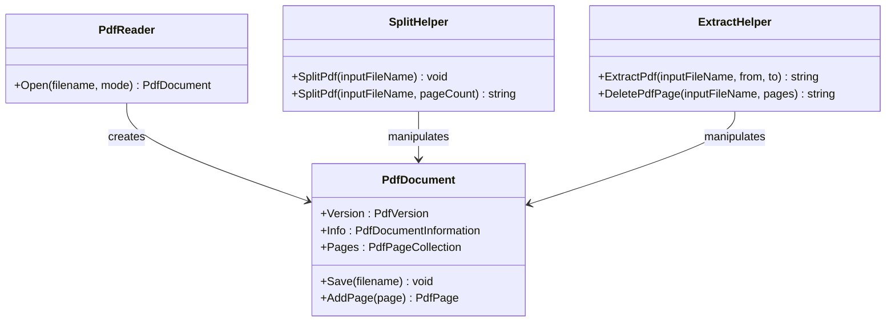
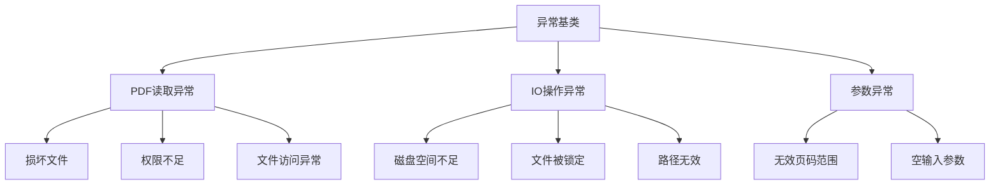
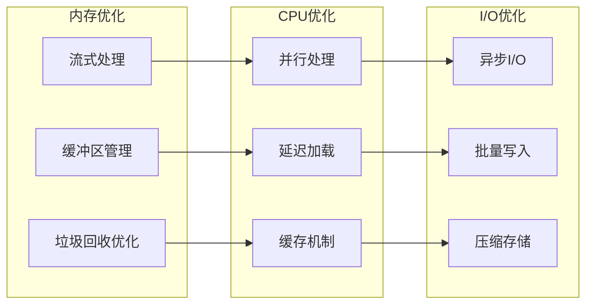

# PDF拆分器详细文档

<cite>
**本文档中引用的文件**
- [PdfSplitter.cs](file://PdfTool/PdfSplitter.cs)
- [SplitHelper.cs](file://PdfHelperLibrary/SplitHelper.cs)
- [ExtractHelper.cs](file://PdfHelperLibrary/ExtractHelper.cs)
- [CommonHelper.cs](file://PdfHelperLibrary/CommonHelper.cs)
- [Common.cs](file://PdfTool/Common.cs)
- [Config.cs](file://PdfTool/Config.cs)
- [MainForm.cs](file://PdfTool/MainForm.cs)
- [MergeHelper.cs](file://PdfHelperLibrary/MergeHelper.cs)
- [CompressHelper.cs](file://PdfHelperLibrary/CompressHelper.cs)
</cite>

## 目录
1. [项目概述](#项目概述)
2. [系统架构](#系统架构)
3. [核心组件分析](#核心组件分析)
4. [用户界面设计](#用户界面设计)
5. [拆分模式实现](#拆分模式实现)
6. [底层处理机制](#底层处理机制)
7. [异常处理与错误管理](#异常处理与错误管理)
8. [性能优化策略](#性能优化策略)
9. [典型使用场景](#典型使用场景)
10. [故障排除指南](#故障排除指南)
11. [总结](#总结)

## 项目概述

PDF拆分器是PDF工具套件中的核心组件，专门用于处理PDF文档的拆分、提取和页面管理操作。该系统采用模块化设计，通过继承UserControl并实现IPdfHandler接口的方式集成到主应用程序中，提供了直观易用的用户界面和强大的PDF处理能力。

### 主要功能特性

- **多模式拆分**：支持按页数、按范围、提取单页等多种拆分模式
- **页面管理**：提供删除指定页面、提取特定范围等功能
- **批量处理**：支持同时处理多个PDF文件
- **实时预览**：显示文件页数信息，便于用户确认
- **异常处理**：完善的错误处理机制，确保操作稳定性

## 系统架构

PDF拆分器采用分层架构设计，清晰分离了用户界面层、业务逻辑层和数据处理层。

**图表来源**
- [PdfSplitter.cs](file://PdfTool/PdfSplitter.cs#L12-L13)
- [Common.cs](file://PdfTool/Common.cs#L13-L16)
- [SplitHelper.cs](file://PdfHelperLibrary/SplitHelper.cs#L11-L12)

**章节来源**
- [PdfSplitter.cs](file://PdfTool/PdfSplitter.cs#L1-L230)
- [Common.cs](file://PdfTool/Common.cs#L1-L18)

## 核心组件分析

### PdfSplitter类设计

PdfSplitter类是整个拆分器的核心控制器，继承自UserControl并实现了IPdfHandler接口，负责协调用户交互和底层处理逻辑。

**图表来源**
- [PdfSplitter.cs](file://PdfTool/PdfSplitter.cs#L12-L13)
- [Common.cs](file://PdfTool/Common.cs#L13-L16)

### 接口设计模式

系统采用接口驱动的设计模式，通过IPdfHandler接口定义统一的PDF处理契约：

| 方法名称 | 参数类型 | 返回类型 | 功能描述 |
|---------|---------|---------|----------|
| OpenPdfs | List\<string\> | void | 批量打开PDF文件，更新文件列表和页数信息 |

**章节来源**
- [PdfSplitter.cs](file://PdfTool/PdfSplitter.cs#L33-L42)
- [Common.cs](file://PdfTool/Common.cs#L13-L16)

## 用户界面设计

### 控件布局架构

PDF拆分器采用标签页式界面设计，将不同功能划分为独立的子界面：

**图表来源**
- [PdfSplitter.cs](file://PdfTool/PdfSplitter.cs#L109-L151)
- [Config.cs](file://PdfTool/Config.cs#L4-L6)

### 控件属性配置

系统使用统一的配置常量来管理控件间距和布局：

| 配置项 | 值 | 用途 |
|--------|---|------|
| ControlMargin | 20 | 控件边距 |
| ControlPadding | 12 | 控件内边距 |

### 事件处理机制

界面采用事件驱动模式，主要事件处理器包括：

- **文件添加事件**：BtnAddFile_Click - 处理文件选择和加载
- **拆分执行事件**：BtnSplit_Click - 执行按页数拆分操作  
- **提取执行事件**：BtnExtract_Click - 执行指定范围提取
- **删除执行事件**：BtnDelete_Click - 执行指定页面删除

**章节来源**
- [PdfSplitter.cs](file://PdfTool/PdfSplitter.cs#L46-L105)
- [Config.cs](file://PdfTool/Config.cs#L1-L9)

## 拆分模式实现

### 按页数拆分模式

系统支持按指定页数将PDF文档拆分为多个独立文件：

**图表来源**
- [SplitHelper.cs](file://PdfHelperLibrary/SplitHelper.cs#L37-L61)

### 指定范围提取模式

提取功能允许用户从PDF中提取指定范围的页面：

**图表来源**
- [ExtractHelper.cs](file://PdfHelperLibrary/ExtractHelper.cs#L20-L38)

### 页面删除模式

删除功能支持一次性删除多个指定页面：

| 功能特性 | 实现方式 | 支持格式 |
|---------|---------|----------|
| 多页面删除 | 数组过滤算法 | 逗号、分号分隔 |
| 范围删除 | 范围验证机制 | 连续数字范围 |
| 单页面删除 | 精确匹配 | 单个页码 |

**章节来源**
- [PdfSplitter.cs](file://PdfTool/PdfSplitter.cs#L85-L105)
- [ExtractHelper.cs](file://PdfHelperLibrary/ExtractHelper.cs#L47-L74)

## 底层处理机制

### PDFsharp库集成

系统基于PDFsharp库构建底层处理逻辑，提供了完整的PDF文档操作能力：

**图表来源**
- [SplitHelper.cs](file://PdfHelperLibrary/SplitHelper.cs#L1-L70)
- [ExtractHelper.cs](file://PdfHelperLibrary/ExtractHelper.cs#L1-L77)

### 文件处理流程

底层处理遵循严格的文件操作流程，确保数据完整性和操作安全性：

1. **文件验证**：检查文件存在性和可读性
2. **文档加载**：使用PDFsharp的PdfReader.Open方法
3. **内容复制**：逐页复制到新的PDF文档
4. **元数据保留**：保持原始文档的标题、作者等信息
5. **文件保存**：将处理后的文档写入磁盘

### 内存管理策略

系统采用流式处理和及时释放的内存管理策略：

| 处理阶段 | 内存策略 | 优化措施 |
|---------|---------|----------|
| 文档加载 | 流式读取 | 按需加载页面 |
| 内容处理 | 及时释放 | 使用using语句 |
| 文件保存 | 缓冲写入 | 分块保存大文件 |

**章节来源**
- [SplitHelper.cs](file://PdfHelperLibrary/SplitHelper.cs#L13-L30)
- [ExtractHelper.cs](file://PdfHelperLibrary/ExtractHelper.cs#L22-L37)

## 异常处理与错误管理

### 异常分类体系

系统建立了完善的异常分类和处理体系：

**图表来源**
- [CommonHelper.cs](file://PdfHelperLibrary/CommonHelper.cs#L13-L25)

### 错误处理机制

系统在各个层面实现了多层次的错误处理：

| 处理层次 | 实现方式 | 错误类型 |
|---------|---------|----------|
| UI层 | 用户友好的错误提示 | 文件选择错误 |
| 业务层 | 参数验证和转换 | 输入格式错误 |
| 服务层 | 异常捕获和包装 | 系统级异常 |
| 数据层 | 原始异常捕获 | 底层I/O异常 |

### 常见错误场景

系统针对常见的错误场景提供了专门的处理逻辑：

- **文件被占用**：检测文件锁定状态，提示用户关闭其他程序
- **权限不足**：检查文件访问权限，提供权限申请指导
- **磁盘空间不足**：预检查可用空间，避免操作失败
- **文件损坏**：提供文件完整性验证和修复建议

**章节来源**
- [CommonHelper.cs](file://PdfHelperLibrary/CommonHelper.cs#L13-L25)
- [SplitHelper.cs](file://PdfHelperLibrary/SplitHelper.cs#L63-L66)

## 性能优化策略

### 大文件处理优化

针对大文件处理场景，系统采用了多种性能优化策略：

### 内存管理最佳实践

系统在内存管理方面遵循以下最佳实践：

1. **及时释放资源**：使用using语句确保资源及时释放
2. **分批处理**：对大文件采用分批处理策略
3. **流式操作**：避免将整个文件加载到内存
4. **缓存策略**：合理使用缓存减少重复操作

### 性能监控指标

| 性能指标 | 监控方法 | 优化目标 |
|---------|---------|----------|
| 处理速度 | 时间戳记录 | 减少处理时间 |
| 内存占用 | 内存监控 | 控制峰值内存 |
| CPU使用率 | 性能计数器 | 平衡CPU负载 |
| 磁盘I/O | I/O计数器 | 优化读写效率 |

**章节来源**
- [MergeHelper.cs](file://PdfHelperLibrary\MergeHelper.cs#L16-L35)
- [CompressHelper.cs](file://PdfHelperLibrary\CompressHelper.cs#L12-L22)

## 典型使用场景

### 合同文件批量拆分

**场景描述**：企业需要将大型合同文件按章节拆分为独立文档，便于管理和归档。

**操作步骤**：
1. 选择包含多个合同的大型PDF文件
2. 设置每份合同的页数（如每份合同10页）
3. 点击"开始拆分"按钮
4. 系统自动将文件拆分为多个独立合同文档

**预期结果**：
- 原始文件：LargeContract.pdf (100页)
- 输出文件：LargeContract - Page 1-10.pdf, LargeContract - Page 11-20.pdf, ...

### 特定页面提取

**场景描述**：从会议纪要中提取特定时间段的讨论内容。

**操作步骤**：
1. 选择会议纪要PDF文件
2. 在提取页面标签页设置起始页为20，结束页为35
3. 点击"开始提取"按钮
4. 系统提取第20-35页内容生成新文件

**预期结果**：
- 输出文件：MeetingMinutes - Page 20 to 35.pdf

### 批量页面删除

**场景描述**：清理扫描文档中的空白页和水印页。

**操作步骤**：
1. 选择待处理的扫描文档
2. 在删除页面标签页输入要删除的页码：5,10,15,20
3. 点击"开始删除"按钮
4. 系统移除指定页面生成新文件

**预期结果**：
- 删除前：Document.pdf (25页)
- 删除后：Document - DeletePageFile - 20240101120000000.pdf (21页)

### 教育资料整理

**场景描述**：教师需要将教材PDF拆分为独立章节，便于学生下载。

**操作流程**：
1. 导入教材PDF文件
2. 根据章节长度设置拆分参数
3. 自动拆分生成独立章节文件
4. 批量上传到学习管理系统

## 故障排除指南

### 常见问题诊断

| 问题症状 | 可能原因 | 解决方案 |
|---------|---------|----------|
| 文件无法打开 | 文件损坏或格式不支持 | 使用PDF修复工具或重新获取文件 |
| 拆分失败 | 内存不足或磁盘空间不够 | 关闭其他程序释放内存，清理磁盘空间 |
| 页码范围错误 | 输入页码超出文件范围 | 检查文件实际页数，调整输入范围 |
| 权限错误 | 文件被其他程序占用 | 关闭占用程序，以管理员身份运行 |

### 错误代码参考

系统返回的错误信息具有明确的格式和含义：

- **"拆分失败，原因：..."**：底层处理异常，具体原因在括号内说明
- **"未添加需要拆分的PDF文件"**：用户未选择任何文件
- **"未输入要删除的页码"**：删除操作缺少必要参数

### 性能问题排查

当遇到性能问题时，可以按照以下步骤进行排查：

1. **检查系统资源**：监控CPU、内存、磁盘使用情况
2. **验证文件大小**：确认文件是否过大导致处理缓慢
3. **检查网络连接**：对于云存储文件，确保网络稳定
4. **更新软件版本**：使用最新版本获得性能优化

**章节来源**
- [SplitHelper.cs](file://PdfHelperLibrary\SplitHelper.cs#L63-L66)
- [ExtractHelper.cs](file://PdfHelperLibrary\ExtractHelper.cs#L40-L44)

## 总结

PDF拆分器作为PDF工具套件的核心组件，展现了优秀的软件设计原则和工程实践。通过模块化架构、接口驱动设计和完善的异常处理机制，系统实现了功能强大且稳定可靠的PDF处理能力。

### 技术亮点

1. **架构设计**：采用分层架构和接口抽象，确保系统的可扩展性和可维护性
2. **用户体验**：直观的标签页界面和实时操作反馈，提升用户操作体验
3. **性能优化**：流式处理和内存管理策略，支持大文件高效处理
4. **错误处理**：多层次异常处理和用户友好的错误提示
5. **功能完整性**：覆盖PDF处理的各种场景需求

### 应用价值

PDF拆分器不仅满足了日常办公中的PDF处理需求，更为企业级应用提供了可靠的技术基础。其模块化的设计理念也为后续功能扩展和系统升级奠定了坚实的基础。

通过持续的优化和完善，PDF拆分器将继续为用户提供更加高效、稳定的PDF处理解决方案，成为PDF工具套件中不可或缺的重要组成部分。