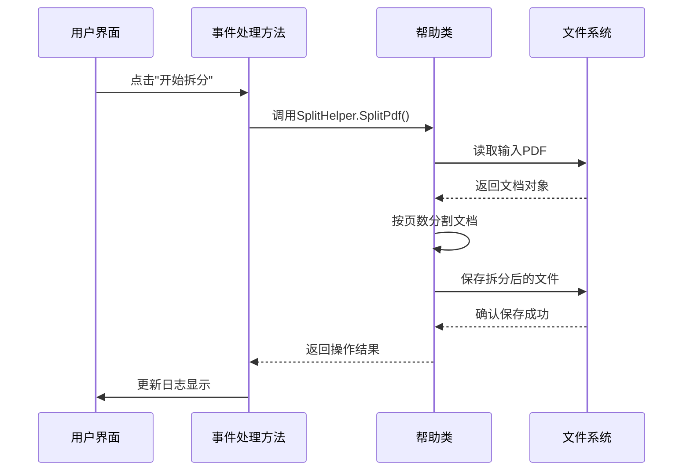
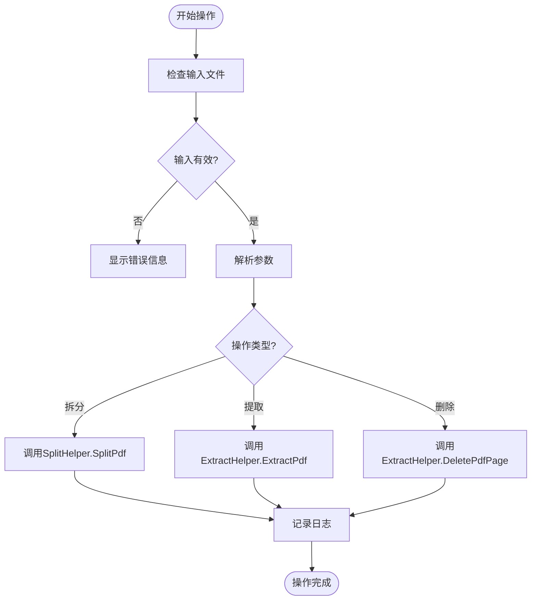
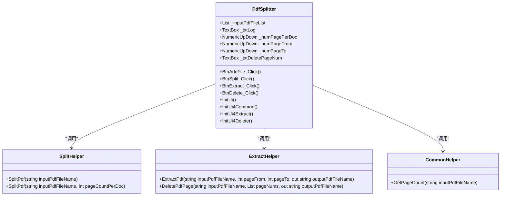

# 使用示例

<cite>
**本文档中引用的文件**  
- [PdfSplitter.cs](file://PdfTool/PdfSplitter.cs)
- [SplitHelper.cs](file://PdfHelperLibrary/SplitHelper.cs)
- [ExtractHelper.cs](file://PdfHelperLibrary/ExtractHelper.cs)
- [CommonHelper.cs](file://PdfHelperLibrary/CommonHelper.cs)
</cite>

## 目录
1. [简介](#简介)
2. [典型使用场景](#典型使用场景)
3. [操作流程详解](#操作流程详解)
4. [输入准备与参数设置](#输入准备与参数设置)
5. [输出结果格式说明](#输出结果格式说明)
6. [日志输出与结果反馈](#日志输出与结果反馈)
7. [多文件批量处理](#多文件批量处理)

## 简介
本文档基于PdfTool项目中的PDF拆分器功能，详细说明其三种核心操作：按固定页数批量拆分、提取指定页面范围和删除特定页码。通过分析`BtnSplit_Click`、`BtnExtract_Click`和`BtnDelete_Click`事件处理方法，展示实际应用场景和操作流程。

**Section sources**
- [PdfSplitter.cs](file://PdfTool/PdfSplitter.cs#L1-L230)

## 典型使用场景
PDF拆分器适用于以下三种典型场景：

### 按固定页数批量拆分合同文件
当需要将大型合同文档按固定页数（如每5页）拆分为多个独立文件时，使用"常规拆分"功能。此场景常见于归档系统中对长文档进行分段管理。

### 提取报告中的特定章节页面
从完整报告中提取特定章节（如第3-7页的财务分析部分），使用"指定页提取"功能。这在共享敏感信息时特别有用，可避免泄露无关内容。

### 删除扫描件中的空白页或重复页
扫描纸质文档时常会产生空白页或重复页，使用"指定页删除"功能可批量移除这些不需要的页面，提高文档质量。

**Section sources**
- [PdfSplitter.cs](file://PdfTool/PdfSplitter.cs#L53-L105)

## 操作流程详解
### 拆分操作流程 (BtnSplit_Click)
1. 验证是否已添加输入文件
2. 遍历所有输入文件
3. 调用`SplitHelper.SplitPdf`方法进行拆分
4. 记录操作日志

### 提取操作流程 (BtnExtract_Click)
1. 验证是否已添加输入文件
2. 遍历所有输入文件
3. 调用`ExtractHelper.ExtractPdf`方法提取指定页面
4. 记录操作日志

### 删除操作流程 (BtnDelete_Click)
1. 验证是否已添加输入文件
2. 解析用户输入的页码列表
3. 验证页码输入有效性
4. 调用`ExtractHelper.DeletePdfPage`方法删除指定页面
5. 记录操作日志



**Diagram sources**
- [PdfSplitter.cs](file://PdfTool/PdfSplitter.cs#L53-L67)
- [SplitHelper.cs](file://PdfHelperLibrary/SplitHelper.cs#L37-L67)

## 输入准备与参数设置
### 拆分操作参数
- **输入文件**: 通过"添加文件"按钮选择一个或多个PDF文件
- **页数/文档**: 设置每个输出文件包含的页数（默认值为1）

### 提取操作参数
- **输入文件**: 选择需要提取页面的PDF文件
- **从**: 设置提取起始页码（从1开始）
- **到**: 设置提取结束页码

### 删除操作参数
- **输入文件**: 选择需要删除页面的PDF文件
- **删除页码**: 输入要删除的页码，支持逗号、分号或中文标点分隔多个页码



**Diagram sources**
- [PdfSplitter.cs](file://PdfTool/PdfSplitter.cs#L53-L105)
- [SplitHelper.cs](file://PdfHelperLibrary/SplitHelper.cs#L37-L67)
- [ExtractHelper.cs](file://PdfHelperLibrary/ExtractHelper.cs#L20-L76)

## 输出结果格式说明
### 拆分操作输出格式
使用`SplitHelper.SplitPdf`生成的文件遵循以下命名规则：
- 单页文件：`文件名 - Page X.pdf`
- 多页文件：`文件名 - Page X - Y.pdf`

例如，将"合同.pdf"按每3页拆分，会生成：
- 合同 - Page 1 - 3.pdf
- 合同 - Page 4 - 6.pdf
- 合同 - Page 7.pdf

### 提取操作输出格式
使用`ExtractHelper.ExtractPdf`创建的文件命名规则为：
- `文件名 - Page X to Y.pdf`

例如，从"年度报告.pdf"提取第5到第8页，会生成：
- 年度报告 - Page 5 to 8.pdf

### 删除操作输出格式
使用`ExtractHelper.DeletePdfPage`生成的文件采用时间戳命名：
- `文件名 - DeletePageFile - YYYYMMDDHHmmssfff.pdf`

这种命名方式确保了文件名的唯一性，避免覆盖原始文件。

**Section sources**
- [SplitHelper.cs](file://PdfHelperLibrary/SplitHelper.cs#L28-L59)
- [ExtractHelper.cs](file://PdfHelperLibrary/ExtractHelper.cs#L36-L37)
- [ExtractHelper.cs](file://PdfHelperLibrary/ExtractHelper.cs#L65-L66)

## 日志输出与结果反馈
系统通过文本日志提供详细的操作反馈：

### 拆分操作日志示例
```
【页数：15】C:\合同.pdf
合同.pdf 拆分完成
拆分完成
```

### 提取操作日志示例
```
【页数：20】C:\年度报告.pdf
年度报告.pdf 提取完成: C:\年度报告 - Page 5 to 8.pdf
提取完成
```

### 删除操作日志示例
```
【页数：12】C:\扫描件.pdf
扫描件.pdf 删页完成: C:\扫描件 - DeletePageFile - 20240115143025123.pdf
删页完成
```

错误情况下的日志输出包含具体错误信息：
```
合同.pdf 拆分失败，原因：文件被占用
```

**Section sources**
- [PdfSplitter.cs](file://PdfTool/PdfSplitter.cs#L55-L65)
- [PdfSplitter.cs](file://PdfTool/PdfSplitter.cs#L71-L81)
- [PdfSplitter.cs](file://PdfTool/PdfSplitter.cs#L87-L103)

## 多文件批量处理
系统支持对多个PDF文件进行批量操作：

### 批量拆分流程
1. 通过"添加文件"一次性选择多个PDF文件
2. 设置统一的每文件页数
3. 点击"开始拆分"，系统依次处理每个文件
4. 在日志中逐条显示每个文件的处理结果

### 批量提取注意事项
虽然界面允许添加多个文件，但提取功能设计为只处理第一个文件，以避免用户误操作导致大量文件被修改。

### 批量删除实现
支持对多个文件执行相同的页码删除操作，适用于统一格式的扫描文档批量清理。



**Diagram sources**
- [PdfSplitter.cs](file://PdfTool/PdfSplitter.cs#L1-L230)
- [SplitHelper.cs](file://PdfHelperLibrary/SplitHelper.cs#L1-L70)
- [ExtractHelper.cs](file://PdfHelperLibrary/ExtractHelper.cs#L1-L77)
- [CommonHelper.cs](file://PdfHelperLibrary/CommonHelper.cs#L1-L29)