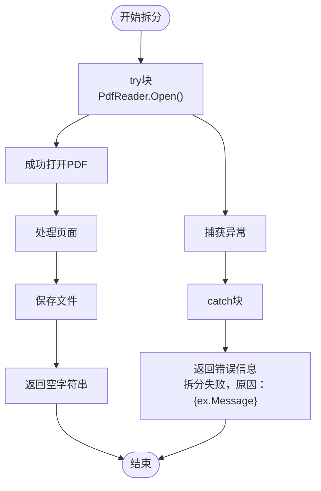
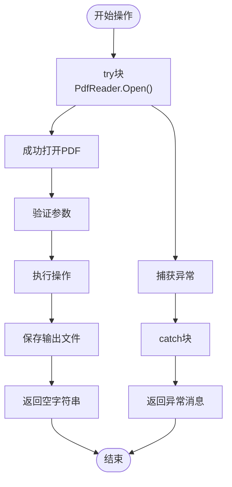
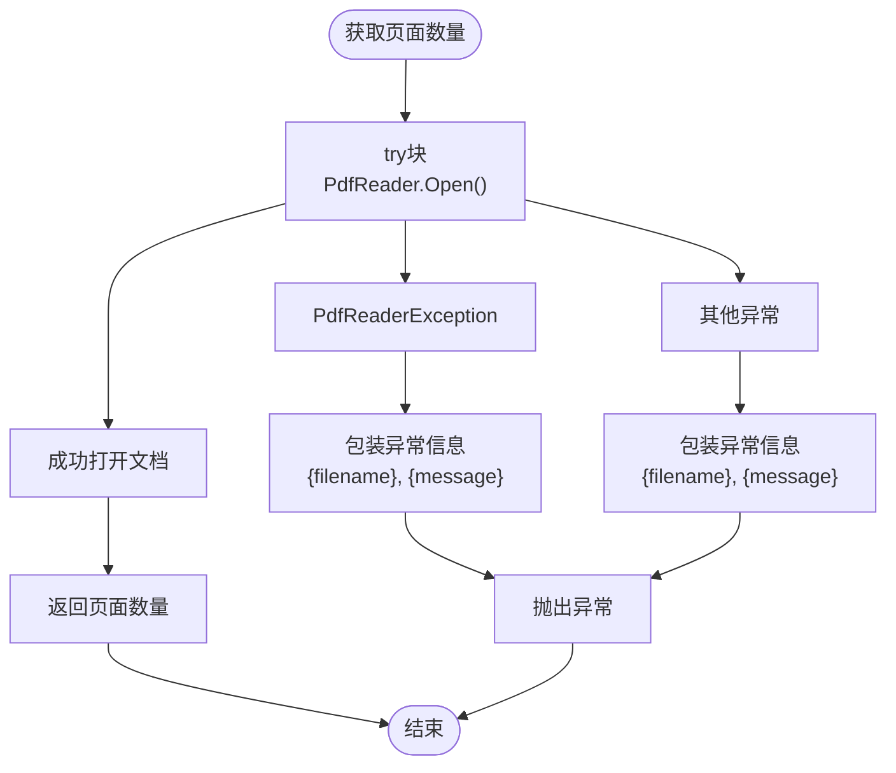
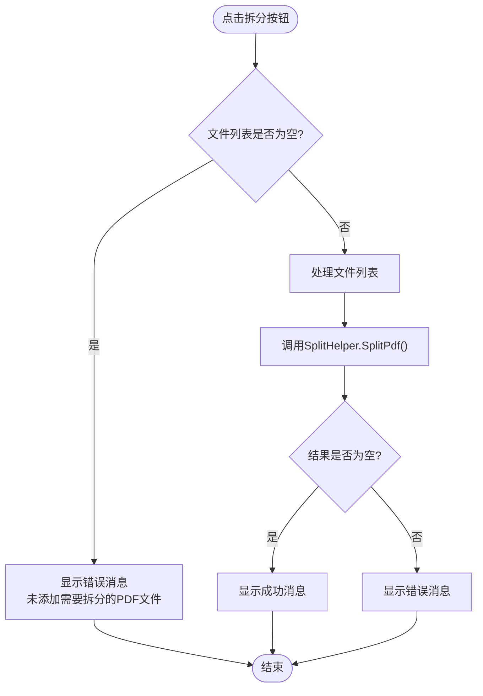
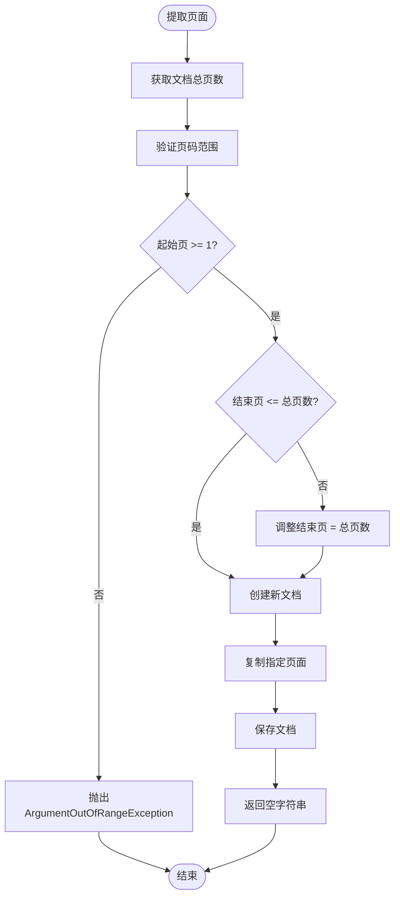
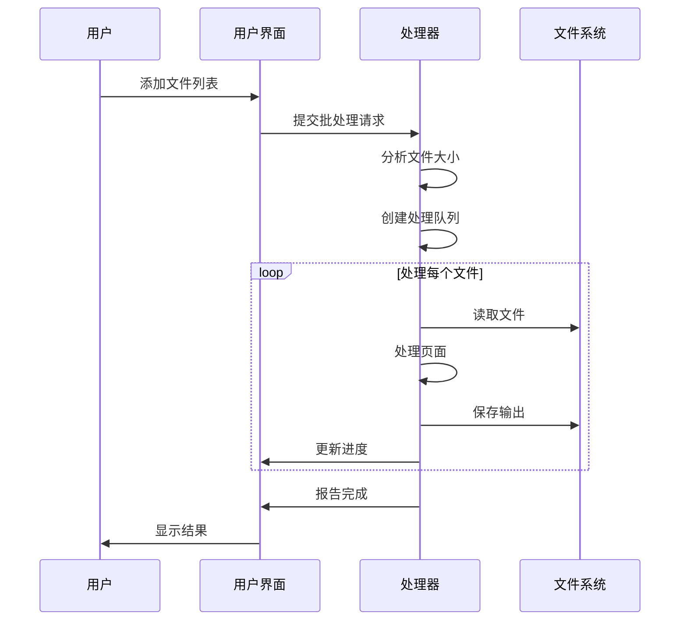
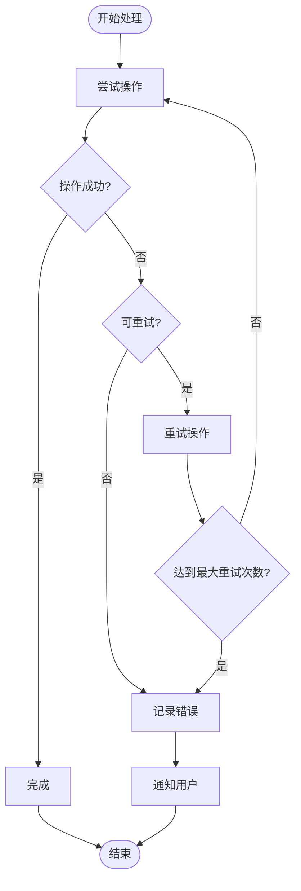

# PDF拆分器故障排除指南

<cite>
**本文档中引用的文件**
- [SplitHelper.cs](file://PdfHelperLibrary/SplitHelper.cs)
- [ExtractHelper.cs](file://PdfHelperLibrary/ExtractHelper.cs)
- [CommonHelper.cs](file://PdfHelperLibrary/CommonHelper.cs)
- [PdfSplitter.cs](file://PdfTool/PdfSplitter.cs)
- [Program.cs](file://PdfConsoleApp/Program.cs)
- [PdfRepairer.cs](file://PdfTool/PdfRepairer.cs)
- [Config.cs](file://PdfTool/Config.cs)
</cite>

## 目录
1. [简介](#简介)
2. [常见问题类型](#常见问题类型)
3. [异常捕获机制分析](#异常捕获机制分析)
4. [边界条件验证](#边界条件验证)
5. [详细故障排除指南](#详细故障排除指南)
6. [性能优化建议](#性能优化建议)
7. [预防措施](#预防措施)
8. [总结](#总结)

## 简介

PDF拆分器是PDF工具包中的核心功能模块，负责将大型PDF文档拆分为多个较小的文档。本指南详细分析了拆分过程中可能遇到的各种问题及其解决方案，包括文件访问冲突、权限问题、格式损坏等常见故障场景。

## 常见问题类型

### 文件访问问题
- **文件被占用**：目标文件正在被其他程序使用
- **权限不足**：没有足够的文件系统权限
- **磁盘空间不足**：目标目录空间不够

### PDF格式问题
- **文件损坏**：PDF文件结构不完整或已损坏
- **格式不支持**：PDF版本过旧或使用特殊编码
- **加密保护**：PDF文件受密码保护

### 参数验证问题
- **空文件列表**：未选择任何PDF文件
- **无效页码范围**：起始页大于结束页
- **页码超出范围**：指定页码超过文档总页数

## 异常捕获机制分析

### SplitHelper.cs中的异常处理

SplitHelper类提供了两个主要的拆分方法，都包含了完善的异常捕获机制：



**图表来源**
- [SplitHelper.cs](file://PdfHelperLibrary/SplitHelper.cs#L39-L66)

**节来源**
- [SplitHelper.cs](file://PdfHelperLibrary/SplitHelper.cs#L39-L66)

### ExtractHelper.cs中的异常处理

ExtractHelper类在提取和删除页面功能中也实现了类似的异常处理模式：



**图表来源**
- [ExtractHelper.cs](file://PdfHelperLibrary/ExtractHelper.cs#L22-L43)
- [ExtractHelper.cs](file://PdfHelperLibrary/ExtractHelper.cs#L49-L73)

**节来源**
- [ExtractHelper.cs](file://PdfHelperLibrary/ExtractHelper.cs#L22-L43)
- [ExtractHelper.cs](file://PdfHelperLibrary/ExtractHelper.cs#L49-L73)

### CommonHelper.cs中的页面计数验证

CommonHelper类提供了统一的页面计数验证机制，用于检测PDF文件的完整性：



**图表来源**
- [CommonHelper.cs](file://PdfHelperLibrary/CommonHelper.cs#L11-L25)

**节来源**
- [CommonHelper.cs](file://PdfHelperLibrary/CommonHelper.cs#L11-L25)

## 边界条件验证

### PdfSplitter.cs中的输入验证

PdfSplitter类在用户界面层面实现了多层验证机制：

#### 空文件列表检查


**图表来源**
- [PdfSplitter.cs](file://PdfTool/PdfSplitter.cs#L55-L65)

#### 数值范围验证
界面控件设置了严格的数值范围限制：
- **页/文档**：最小值1，最大值100000
- **起始页**：最小值1，最大值100000  
- **结束页**：最小值1，最大值100000

**节来源**
- [PdfSplitter.cs](file://PdfTool/PdfSplitter.cs#L55-L65)
- [PdfSplitter.cs](file://PdfTool/PdfSplitter.cs#L156-L165)
- [PdfSplitter.cs](file://PdfTool/PdfSplitter.cs#L178-L198)

### 页面范围验证逻辑

在ExtractHelper中实现了动态的页面范围验证：



**图表来源**
- [ExtractHelper.cs](file://PdfHelperLibrary/ExtractHelper.cs#L24-L37)

**节来源**
- [ExtractHelper.cs](file://PdfHelperLibrary/ExtractHelper.cs#L24-L37)

## 详细故障排除指南

### 文件被占用问题

**症状表现**：
- 错误消息："拆分失败，原因：文件正在使用中"
- 程序无法写入目标文件

**诊断步骤**：
1. 检查是否有其他PDF阅读器打开源文件
2. 确认杀毒软件正在扫描文件
3. 验证文件是否在网络驱动器上

**解决方案**：
1. **关闭占用程序**：关闭所有可能占用PDF文件的程序
2. **重新启动应用程序**：以管理员身份运行程序
3. **等待文件解锁**：给系统时间释放文件句柄

**预防措施**：
- 在开始处理前关闭所有PDF阅读器
- 使用文件监控工具检测文件占用情况

### 权限不足问题

**症状表现**：
- "拒绝访问"错误
- 无法创建输出文件

**诊断步骤**：
1. 尝试手动创建文件
2. 检查目标目录权限
3. 验证用户账户权限级别

**解决方案**：
1. **以管理员身份运行**：右键选择"以管理员身份运行"
2. **更改目标目录**：选择有写入权限的目录
3. **修改文件权限**：调整目标文件夹的访问权限

### PDF格式损坏问题

**症状表现**：
- "PDF格式无效"错误
- 无法读取页面信息

**诊断步骤**：
1. 使用其他PDF阅读器打开文件
2. 检查文件大小是否异常
3. 尝试修复PDF文件

**解决方案**：
1. **使用PDF修复工具**：利用内置的修复功能
2. **重新下载文件**：从原始来源重新获取
3. **转换格式**：使用在线工具转换为标准PDF

**节来源**
- [PdfRepairer.cs](file://PdfTool/PdfRepairer.cs#L43-L84)

### 大文件处理问题

**症状表现**：
- 内存占用过高
- 处理速度缓慢
- 程序无响应

**诊断步骤**：
1. 监控内存使用情况
2. 检查CPU使用率
3. 观察程序响应状态

**解决方案**：
1. **分批处理策略**：
   ```mermaid
flowchart TD
Start([开始处理]) --> CheckFileSize{"文件大小 > 100MB?"}
CheckFileSize --> |否| DirectProcess["直接处理"]
CheckFileSize --> |是| BatchProcess["分批处理"]
DirectProcess --> ProcessComplete["处理完成"]
BatchProcess --> SplitIntoBatches["分割为小批次"]
SplitIntoBatches --> ProcessBatch["处理单个批次"]
ProcessBatch --> WaitMemory["等待内存释放"]
WaitMemory --> NextBatch{"还有批次?"}
NextBatch --> |是| ProcessBatch
NextBatch --> |否| ProcessComplete
ProcessComplete --> End([结束])
```

2. **增加系统内存**：升级计算机内存
3. **优化处理参数**：减少单次处理的页面数量

### 磁盘空间不足问题

**症状表现**：
- "磁盘空间不足"错误
- 无法保存输出文件

**诊断步骤**：
1. 检查目标磁盘剩余空间
2. 验证临时文件夹空间
3. 确认有足够的空间存储输出文件

**解决方案**：
1. **清理磁盘空间**：删除不必要的文件
2. **更换目标位置**：选择有足够空间的磁盘
3. **压缩输出文件**：启用压缩选项

## 性能优化建议

### 内存管理优化

**当前实现的问题**：
- 单次加载整个PDF文档到内存
- 大量页面操作可能导致内存峰值

**优化建议**：
1. **流式处理**：逐页读取和处理
2. **内存回收**：及时释放不再需要的对象
3. **异步处理**：使用后台线程处理大文件

### 批处理策略



**图表来源**
- [PdfSplitter.cs](file://PdfTool/PdfSplitter.cs#L55-L65)

### 并发处理优化

对于多个独立文件的处理，可以考虑并发处理：
- 使用Task Parallel Library (TPL)
- 限制并发线程数量
- 实现进度跟踪机制

**节来源**
- [PdfSplitter.cs](file://PdfTool/PdfSplitter.cs#L55-L65)

## 预防措施

### 输入验证增强

1. **文件存在性检查**：在处理前验证文件路径
2. **文件类型验证**：确保是有效的PDF文件
3. **文件可读性检查**：验证文件是否可读

### 错误恢复机制



### 日志记录改进

建议增强日志记录功能：
- 记录详细的错误堆栈信息
- 跟踪文件处理进度
- 存储处理历史记录

**节来源**
- [Program.cs](file://PdfConsoleApp/Program.cs#L20-L35)

## 总结

PDF拆分器的故障排除需要从多个层面进行分析和处理：

1. **异常捕获机制**：SplitHelper和ExtractHelper提供了完善的异常处理
2. **边界条件验证**：PdfSplitter实现了严格的输入验证
3. **性能优化**：针对大文件处理需要采用分批和流式处理策略
4. **预防措施**：通过输入验证和错误恢复机制提高系统稳定性

通过理解这些机制和实施相应的解决方案，可以有效解决PDF拆分过程中的各种问题，提高系统的可靠性和用户体验。