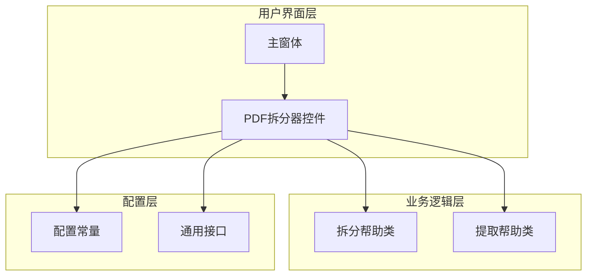
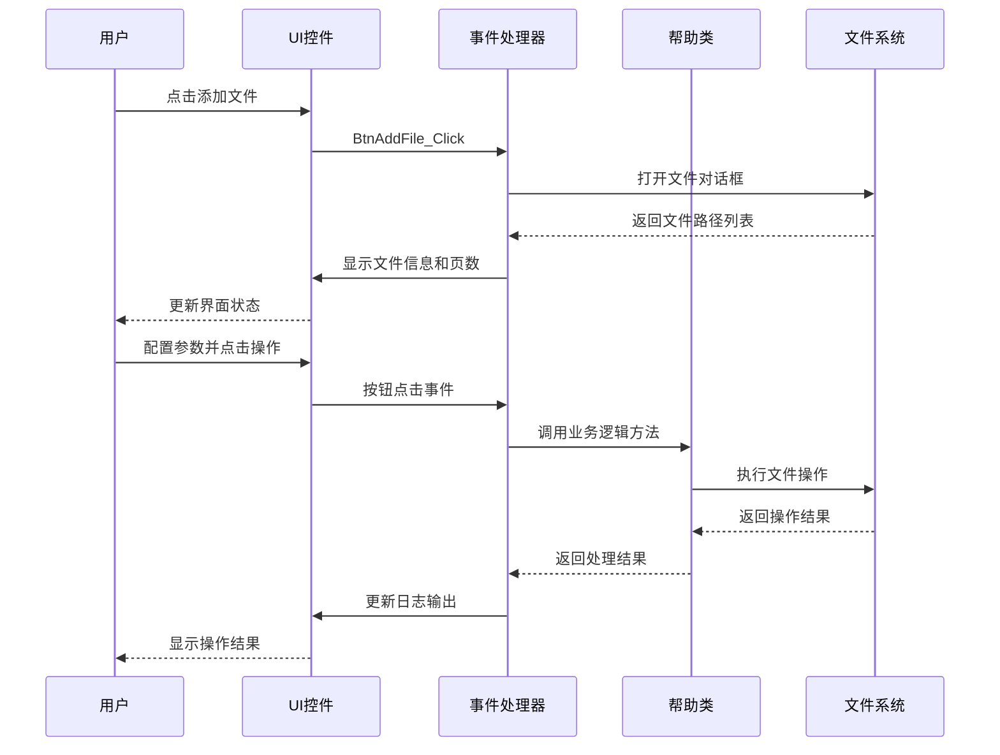
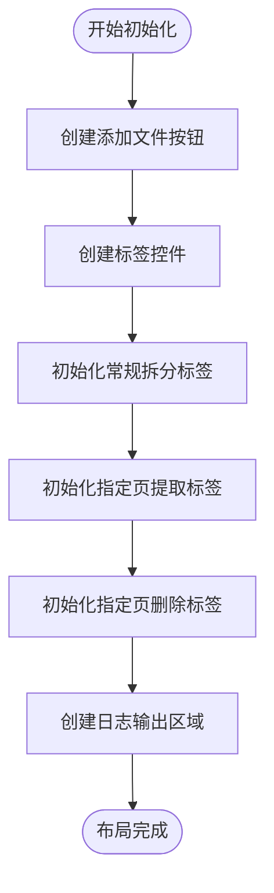
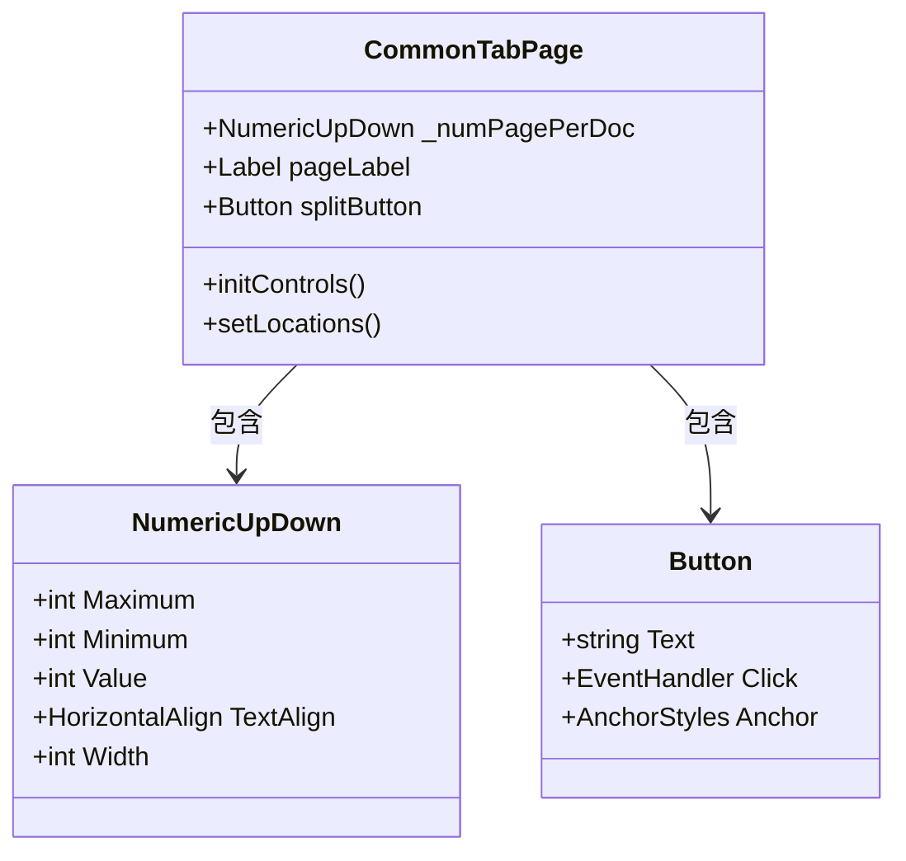
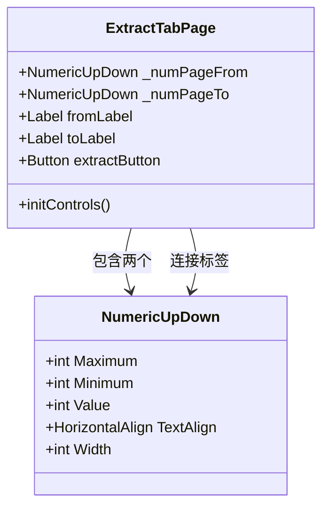
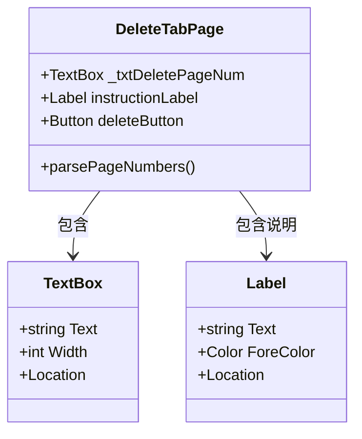
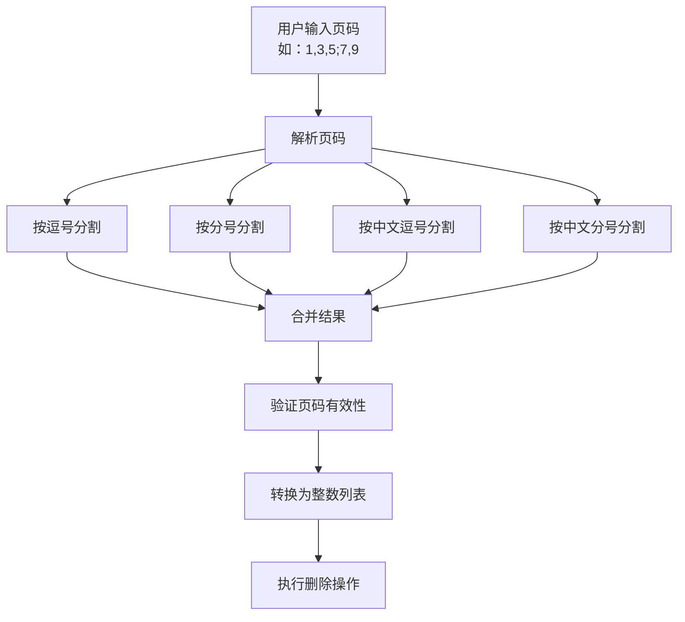
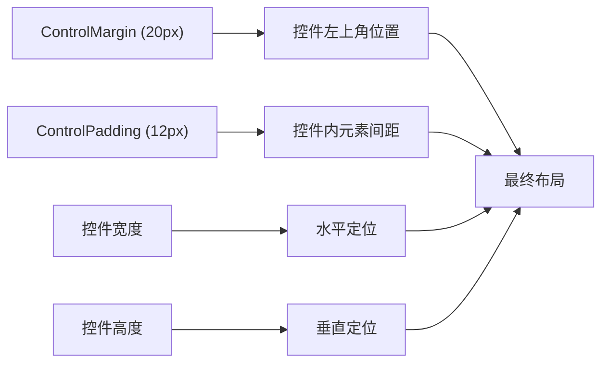
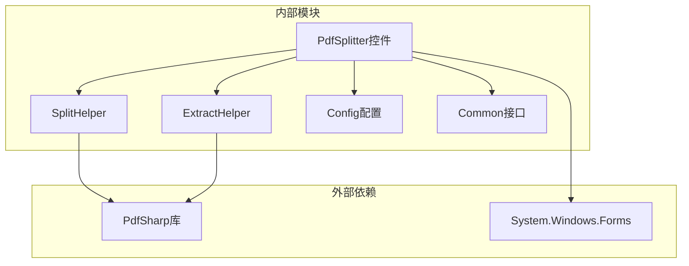
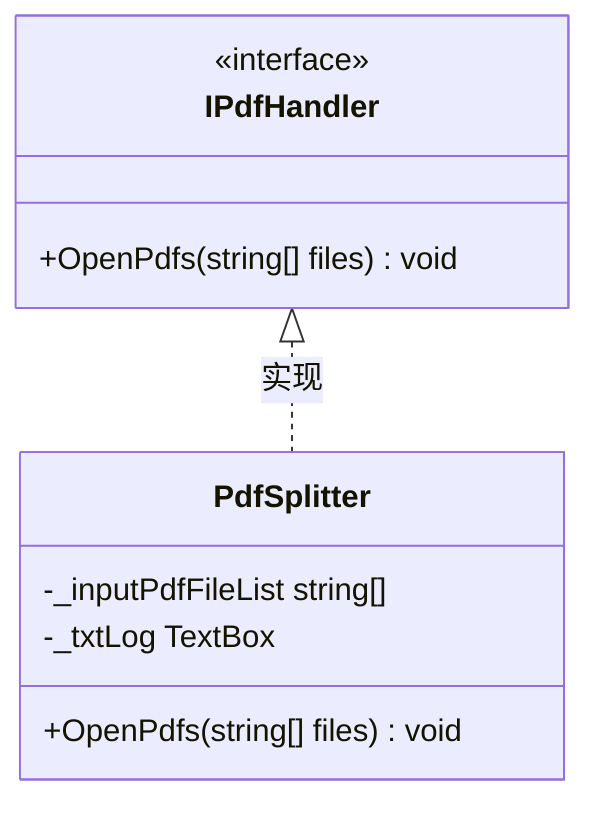

# PDF拆分器用户界面配置和参数设置详细说明

<cite>
**本文档引用的文件**
- [PdfSplitter.cs](file://PdfTool/PdfSplitter.cs)
- [PdfSplitter.Designer.cs](file://PdfTool/PdfSplitter.Designer.cs)
- [Config.cs](file://PdfTool/Config.cs)
- [MainForm.cs](file://PdfTool/MainForm.cs)
- [Common.cs](file://PdfTool/Common.cs)
- [SplitHelper.cs](file://PdfHelperLibrary/SplitHelper.cs)
- [ExtractHelper.cs](file://PdfHelperLibrary/ExtractHelper.cs)
</cite>

## 目录
1. [简介](#简介)
2. [项目结构概述](#项目结构概述)
3. [核心组件分析](#核心组件分析)
4. [架构概览](#架构概览)
5. [详细组件分析](#详细组件分析)
6. [依赖关系分析](#依赖关系分析)
7. [性能考虑](#性能考虑)
8. [故障排除指南](#故障排除指南)
9. [结论](#结论)

## 简介

PDF拆分器是PDF工具套件中的核心组件，提供了三种主要的PDF处理功能：常规拆分、指定页提取和指定页删除。该组件采用模块化设计，通过动态UI构建机制实现了灵活的用户界面配置和参数设置。

本文档详细说明了PdfSplitter.cs中通过InitUi、InitUi4Common、InitUi4Extract和InitUi4Delete方法动态构建UI控件的实现机制，包括三个标签页的布局设计、关键控件的作用及其与底层功能的绑定关系，以及界面布局一致性设计的实现。

## 项目结构概述

PDF工具套件采用分层架构设计，主要包含以下核心模块：



**图表来源**
- [MainForm.cs](file://PdfTool/MainForm.cs#L1-L194)
- [PdfSplitter.cs](file://PdfTool/PdfSplitter.cs#L1-L230)

**章节来源**
- [MainForm.cs](file://PdfTool/MainForm.cs#L1-L194)
- [PdfSplitter.cs](file://PdfTool/PdfSplitter.cs#L1-L230)

## 核心组件分析

### PdfSplitter类结构

PdfSplitter类是PDF拆分器的核心控制器，继承自UserControl并实现了IPdfHandler接口。该类负责管理整个PDF处理流程的用户界面和业务逻辑。

#### 主要属性和字段

| 属性名称 | 类型 | 描述 | 默认值 |
|---------|------|------|--------|
| _inputPdfFileList | List<string> | 输入的PDF文件列表 | 空列表 |
| _txtLog | TextBox | 日志输出控件 | 未初始化 |
| _numPagePerDoc | NumericUpDown | 每份文档页数控件 | 1 |
| _numPageFrom | NumericUpDown | 起始页码控件 | 1 |
| _numPageTo | NumericUpDown | 结束页码控件 | 1 |
| _txtDeletePageNum | TextBox | 删除页码输入框 | 空字符串 |

#### 关键方法

| 方法名称 | 功能描述 | 参数类型 | 返回类型 |
|---------|----------|----------|----------|
| OpenPdfs | 打开PDF文件并显示页数信息 | List<string> files | void |
| BtnAddFile_Click | 添加文件按钮事件处理器 | object sender, EventArgs e | void |
| BtnSplit_Click | 开始拆分按钮事件处理器 | object sender, EventArgs e | void |
| BtnExtract_Click | 开始提取按钮事件处理器 | object sender, EventArgs e | void |
| BtnDelete_Click | 开始删除按钮事件处理器 | object sender, EventArgs e | void |

**章节来源**
- [PdfSplitter.cs](file://PdfTool/PdfSplitter.cs#L23-L30)
- [PdfSplitter.cs](file://PdfTool/PdfSplitter.cs#L45-L106)

## 架构概览

PDF拆分器采用三层架构模式，实现了清晰的职责分离：



**图表来源**
- [PdfSplitter.cs](file://PdfTool/PdfSplitter.cs#L46-L106)
- [SplitHelper.cs](file://PdfHelperLibrary/SplitHelper.cs#L37-L67)
- [ExtractHelper.cs](file://PdfHelperLibrary/ExtractHelper.cs#L20-L44)

## 详细组件分析

### UI初始化机制

#### InitUi方法 - 主界面布局

InitUi方法负责初始化整个PDF拆分器的主界面布局，采用动态控件创建的方式实现：



**图表来源**
- [PdfSplitter.cs](file://PdfTool/PdfSplitter.cs#L109-L152)

#### InitUi4Common方法 - 常规拆分界面

常规拆分界面提供按固定页数拆分PDF的功能：



**图表来源**
- [PdfSplitter.cs](file://PdfTool/PdfSplitter.cs#L154-L172)

#### InitUi4Extract方法 - 指定页提取界面

指定页提取界面允许用户精确选择页码范围进行提取：



**图表来源**
- [PdfSplitter.cs](file://PdfTool/PdfSplitter.cs#L174-L203)

#### InitUi4Delete方法 - 指定页删除界面

指定页删除界面提供灵活的页码输入方式，支持多种分隔符：



**图表来源**
- [PdfSplitter.cs](file://PdfTool/PdfSplitter.cs#L205-L226)

### 控件作用与绑定关系

#### NumPagePerDoc控件

NumPagePerDoc控件用于设置每份拆分后的文档包含的页数：

| 属性 | 值 | 说明 |
|------|----|----- |
| Maximum | 100000 | 最大页数限制 |
| Minimum | 1 | 最小页数限制 |
| Value | 1 | 默认值 |
| Width | 50 | 控件宽度 |
| TextAlign | Right | 右对齐显示 |

该控件直接绑定到SplitHelper.SplitPdf方法的第一个参数，实现按固定页数拆分PDF的功能。

#### NumPageFrom和NumPageTo控件

这两个控件配合使用，定义PDF提取的页码范围：

| 控件 | 功能 | 约束条件 |
|------|------|----------|
| NumPageFrom | 起始页码 | 必须 ≥ 1 |
| NumPageTo | 结束页码 | 必须 ≥ NumPageFrom |

它们绑定到ExtractHelper.ExtractPdf方法的pageFrom和pageTo参数，实现精确的页码范围提取。

#### TxtDeletePageNum控件

TxtDeletePageNum控件允许用户输入要删除的页码列表，支持多种分隔符：



**图表来源**
- [PdfSplitter.cs](file://PdfTool/PdfSplitter.cs#L92-L104)

**章节来源**
- [PdfSplitter.cs](file://PdfTool/PdfSplitter.cs#L154-L226)

### 界面布局一致性设计

#### Config.cs中的控制间距常量

Config类定义了全局的界面布局常量，确保整个应用程序界面风格的一致性：

| 常量名称 | 数值 | 用途 |
|---------|------|------|
| ControlMargin | 20 | 控件与边框的外边距 |
| ControlPadding | 12 | 控件内部元素的间距 |

这些常量在所有UI控件的定位和布局计算中被广泛使用，保证了界面元素之间的一致性间距。

#### 布局计算机制



**图表来源**
- [Config.cs](file://PdfTool/Config.cs#L5-L6)
- [PdfSplitter.cs](file://PdfTool/PdfSplitter.cs#L114-L149)

**章节来源**
- [Config.cs](file://PdfTool/Config.cs#L1-L9)
- [PdfSplitter.cs](file://PdfTool/PdfSplitter.cs#L109-L152)

### 多分隔符页码输入解析逻辑

#### 解析算法实现

TxtDeletePageNum控件支持多种分隔符的页码输入，解析逻辑如下：

```mermaid
sequenceDiagram
participant User as 用户输入
participant Parser as 解析器
participant Validator as 验证器
participant Executor as 执行器
User->>Parser : 输入页码字符串
Parser->>Parser : Split(',', ';', '，', '；')
Parser->>Parser : RemoveEmptyEntries()
Parser->>Validator : Select(int.Parse)
Validator->>Validator : 验证页码有效性
Validator->>Executor : 返回整数列表
Executor->>Executor : 执行删除操作
Executor-->>User : 返回操作结果
```

**图表来源**
- [PdfSplitter.cs](file://PdfTool/PdfSplitter.cs#L92-L104)

#### 支持的分隔符类型

| 分隔符类型 | 符号表示 | 使用场景 |
|-----------|----------|----------|
| 英文逗号 | , | 标准ASCII输入 |
| 英文分号 | ; | 替代逗号选项 |
| 中文逗号 | ， | 中文输入法 |
| 中文分号 | ； | 中文输入法 |

这种设计考虑了不同用户的输入习惯和输入法环境，提高了用户体验。

**章节来源**
- [PdfSplitter.cs](file://PdfTool/PdfSplitter.cs#L92-L104)

## 依赖关系分析

### 组件间依赖关系



**图表来源**
- [PdfSplitter.cs](file://PdfTool/PdfSplitter.cs#L1-L10)
- [SplitHelper.cs](file://PdfHelperLibrary/SplitHelper.cs#L1-L10)
- [ExtractHelper.cs](file://PdfHelperLibrary/ExtractHelper.cs#L1-L10)

### 接口契约

PdfSplitter实现了IPdfHandler接口，建立了统一的文件处理契约：



**图表来源**
- [Common.cs](file://PdfTool/Common.cs#L13-L16)
- [PdfSplitter.cs](file://PdfTool/PdfSplitter.cs#L12)

**章节来源**
- [Common.cs](file://PdfTool/Common.cs#L1-L18)
- [PdfSplitter.cs](file://PdfTool/PdfSplitter.cs#L12)

## 性能考虑

### 内存管理优化

1. **控件生命周期管理**：所有动态创建的控件都正确设置了Parent属性，确保垃圾回收器能够及时回收不再使用的控件资源。

2. **文件列表管理**：使用List<string>存储文件路径，避免重复加载相同文件。

3. **异常处理**：在文件操作过程中实现了完善的异常捕获机制，防止内存泄漏。

### 用户体验优化

1. **即时反馈**：每次操作都会更新日志输出，让用户了解当前进度。

2. **输入验证**：对用户输入进行实时验证，减少无效操作。

3. **拖拽支持**：支持拖拽PDF文件到界面，提高操作便捷性。

## 故障排除指南

### 常见问题及解决方案

#### 问题1：添加文件后不显示页数信息

**可能原因**：
- PDF文件损坏或格式不正确
- PdfSharp库版本不兼容

**解决方案**：
- 验证PDF文件完整性
- 检查PdfSharp库版本是否匹配

#### 问题2：拆分操作失败

**可能原因**：
- 输入文件权限不足
- 输出目录不存在或不可写

**解决方案**：
- 检查文件访问权限
- 确保输出目录存在且可写

#### 问题3：页码输入无效

**可能原因**：
- 页码超出PDF总页数
- 输入格式不符合要求

**解决方案**：
- 验证页码范围
- 检查输入格式

**章节来源**
- [PdfSplitter.cs](file://PdfTool/PdfSplitter.cs#L33-L41)
- [SplitHelper.cs](file://PdfHelperLibrary/SplitHelper.cs#L39-L67)
- [ExtractHelper.cs](file://PdfHelperLibrary/ExtractHelper.cs#L22-L44)

## 结论

PDF拆分器通过精心设计的UI配置和参数设置机制，实现了功能丰富且用户友好的PDF处理工具。其主要特点包括：

1. **模块化设计**：通过InitUi系列方法实现了清晰的界面组织结构
2. **一致性布局**：通过Config类统一管理界面间距，确保视觉一致性
3. **灵活输入**：支持多种分隔符的页码输入，适应不同用户习惯
4. **强类型绑定**：关键控件与底层功能直接绑定，保证数据准确性
5. **健壮性设计**：完善的错误处理和输入验证机制

该设计模式不仅适用于PDF拆分器，也为其他类似工具的开发提供了良好的参考范例。通过合理的架构设计和细节优化，成功地平衡了功能复杂性和用户体验之间的关系。