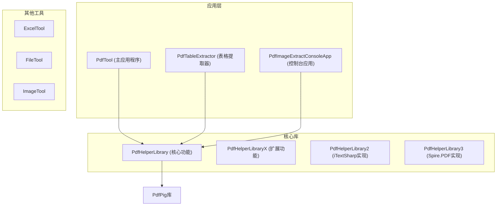
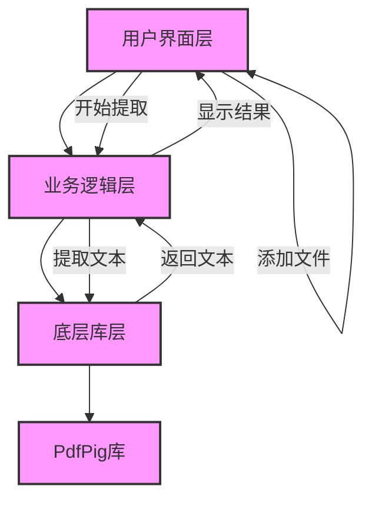
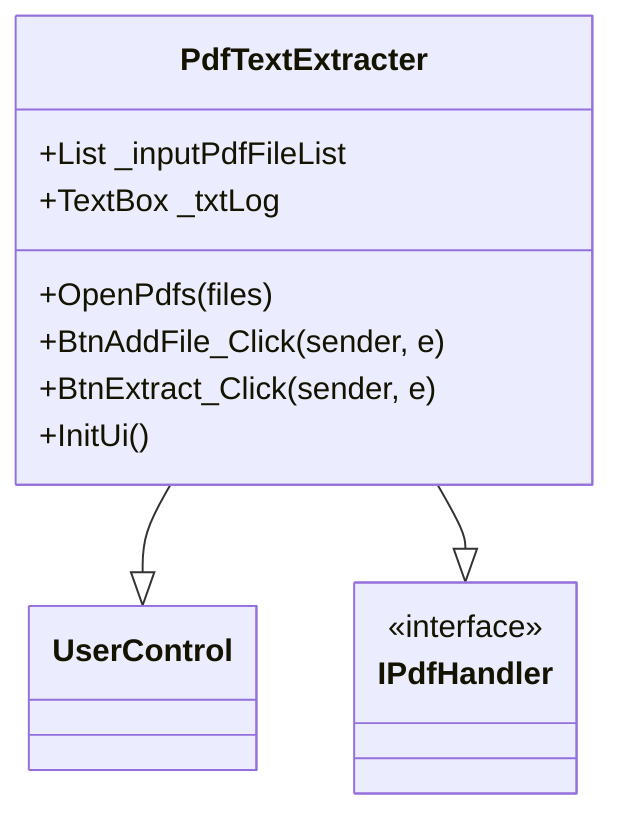
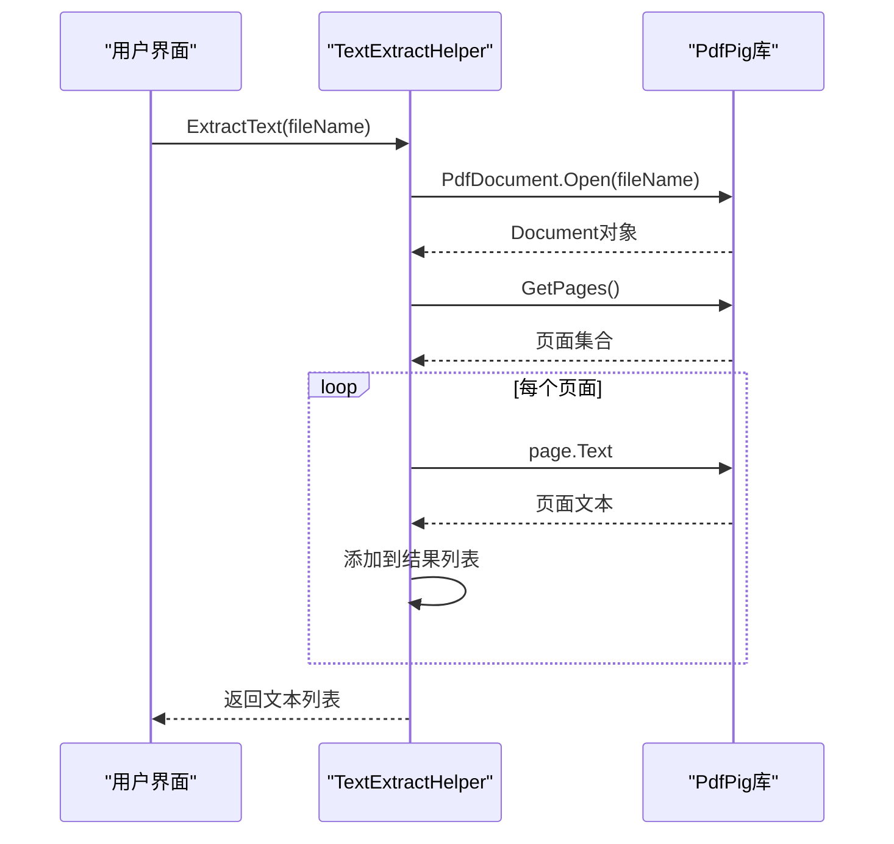
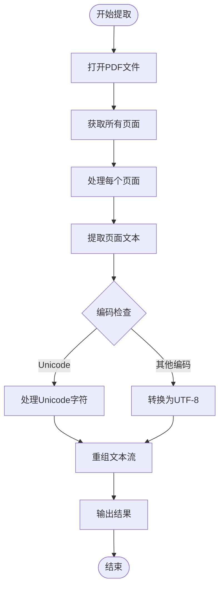
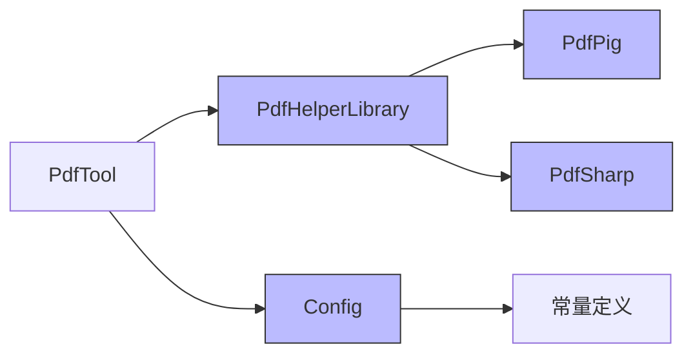
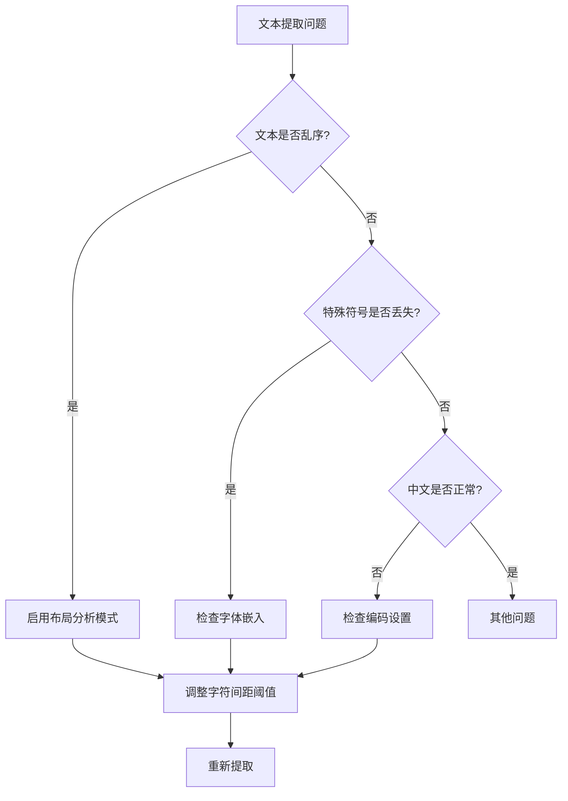

# PDF文本提取器

<cite>
**本文档引用的文件**
- [PdfTextExtracter.cs](file://PdfTool/PdfTextExtracter.cs)
- [PdfTextExtracter.Designer.cs](file://PdfTool/PdfTextExtracter.Designer.cs)
- [TextExtractHelper.cs](file://PdfHelperLibrary/TextExtractHelper.cs)
- [CommonHelper.cs](file://PdfHelperLibrary/CommonHelper.cs)
- [Config.cs](file://PdfTool/Config.cs)
- [TextHelper.cs](file://PdfHelperLibrary3/TextHelper.cs)
</cite>

## 目录
1. [简介](#简介)
2. [项目结构](#项目结构)
3. [核心组件](#核心组件)
4. [架构概述](#架构概述)
5. [详细组件分析](#详细组件分析)
6. [依赖分析](#依赖分析)
7. [性能考虑](#性能考虑)
8. [故障排除指南](#故障排除指南)
9. [结论](#结论)

## 简介
本文档详细记录了PDF文本提取器的功能实现，重点描述了用户界面设计、文本提取逻辑、多语言支持以及常见问题的解决方案。系统基于PdfPig库实现文本解析，提供了从PDF文档中提取文本的完整功能。

## 项目结构
项目采用模块化设计，将PDF处理功能分解为多个独立的工具库和应用程序。核心文本提取功能位于PdfHelperLibrary中，而用户界面则在PdfTool项目中实现。

**图表来源**
- [PdfTool](file://PdfTool)
- [PdfHelperLibrary](file://PdfHelperLibrary)

**章节来源**
- [PdfTextExtracter.cs](file://PdfTool/PdfTextExtracter.cs)
- [TextExtractHelper.cs](file://PdfHelperLibrary/TextExtractHelper.cs)

## 核心组件
系统的核心组件包括用户界面模块PdfTextExtracter.cs和文本提取逻辑模块TextExtractHelper.cs。前者负责提供用户交互界面，后者负责实际的文本提取工作。

**章节来源**
- [PdfTextExtracter.cs](file://PdfTool/PdfTextExtracter.cs#L1-L119)
- [TextExtractHelper.cs](file://PdfHelperLibrary/TextExtractHelper.cs#L1-L34)

## 架构概述
系统采用分层架构，分为用户界面层、业务逻辑层和底层库层。用户界面层负责与用户交互，业务逻辑层处理具体的PDF操作，底层库层依赖第三方库实现PDF解析。

**图表来源**
- [PdfTextExtracter.cs](file://PdfTool/PdfTextExtracter.cs#L1-L119)
- [TextExtractHelper.cs](file://PdfHelperLibrary/TextExtractHelper.cs#L1-L34)

## 详细组件分析

### 文本提取器用户界面分析
PdfTextExtracter组件提供了直观的用户界面，允许用户添加PDF文件并提取文本。界面包含添加文件按钮、开始提取按钮和日志显示区域。

**图表来源**
- [PdfTextExtracter.cs](file://PdfTool/PdfTextExtracter.cs#L1-L119)
- [PdfTextExtracter.Designer.cs](file://PdfTool/PdfTextExtracter.Designer.cs#L1-L38)

**章节来源**
- [PdfTextExtracter.cs](file://PdfTool/PdfTextExtracter.cs#L1-L119)

### 文本提取逻辑分析
TextExtractHelper类使用PdfPig库解析PDF文档，提取文本内容。该组件负责打开PDF文件、获取页面和提取文本。

**图表来源**
- [TextExtractHelper.cs](file://PdfHelperLibrary/TextExtractHelper.cs#L1-L34)
- [PdfHelperLibrary.csproj](file://PdfHelperLibrary/PdfHelperLibrary.csproj#L74-L94)

**章节来源**
- [TextExtractHelper.cs](file://PdfHelperLibrary/TextExtractHelper.cs#L1-L34)

### 多语言文本处理分析
系统通过PdfPig库支持多语言文本提取，包括中文等复杂文字系统。库内部处理字符编码和字形定位，确保正确提取各种语言的文本。

**图表来源**
- [TextExtractHelper.cs](file://PdfHelperLibrary/TextExtractHelper.cs#L1-L34)
- [TextHelper.cs](file://PdfHelperLibrary3/TextHelper.cs#L1-L104)

**章节来源**
- [TextExtractHelper.cs](file://PdfHelperLibrary/TextExtractHelper.cs#L1-L34)
- [TextHelper.cs](file://PdfHelperLibrary3/TextHelper.cs#L1-L104)

## 依赖分析
系统依赖多个第三方库来实现PDF处理功能，主要依赖PdfPig库进行文本提取。

**图表来源**
- [PdfHelperLibrary.csproj](file://PdfHelperLibrary/PdfHelperLibrary.csproj#L74-L94)
- [Config.cs](file://PdfTool/Config.cs#L1-L9)

**章节来源**
- [PdfHelperLibrary.csproj](file://PdfHelperLibrary/PdfHelperLibrary.csproj#L1-L127)
- [Config.cs](file://PdfTool/Config.cs#L1-L9)

## 性能考虑
文本提取器在处理大型PDF文件时需要考虑性能优化。系统使用BackgroundWorker实现异步处理，避免界面冻结。

### 提取性能优化建议
- 对于大型文档，建议分页提取而非一次性提取所有页面
- 启用布局分析模式以提高文本重组的准确性
- 调整字符间距阈值以改善文本连贯性
- 使用流式处理而非加载整个文档到内存

## 故障排除指南
### 常见问题及解决方案

| 问题现象 | 可能原因 | 解决方案 |
|---------|--------|---------|
| 文本乱序 | PDF文档布局复杂 | 启用布局分析模式 |
| 特殊符号丢失 | 字体嵌入问题 | 检查PDF字体嵌入情况 |
| 中文显示异常 | 编码问题 | 确保使用UTF-8编码 |
| 提取速度慢 | 文档过大 | 分页提取或优化阈值 |

### 文本提取问题诊断流程

**章节来源**
- [TextExtractHelper.cs](file://PdfHelperLibrary/TextExtractHelper.cs#L1-L34)
- [CommonHelper.cs](file://PdfHelperLibrary/CommonHelper.cs#L1-L29)

## 结论
PDF文本提取器成功实现了从PDF文档中提取文本的核心功能。系统基于PdfPig库构建，提供了稳定的文本提取能力，支持多语言文本处理。通过合理的架构设计，系统实现了用户界面与业务逻辑的分离，便于维护和扩展。对于复杂的PDF文档，建议调整提取参数以获得最佳效果。