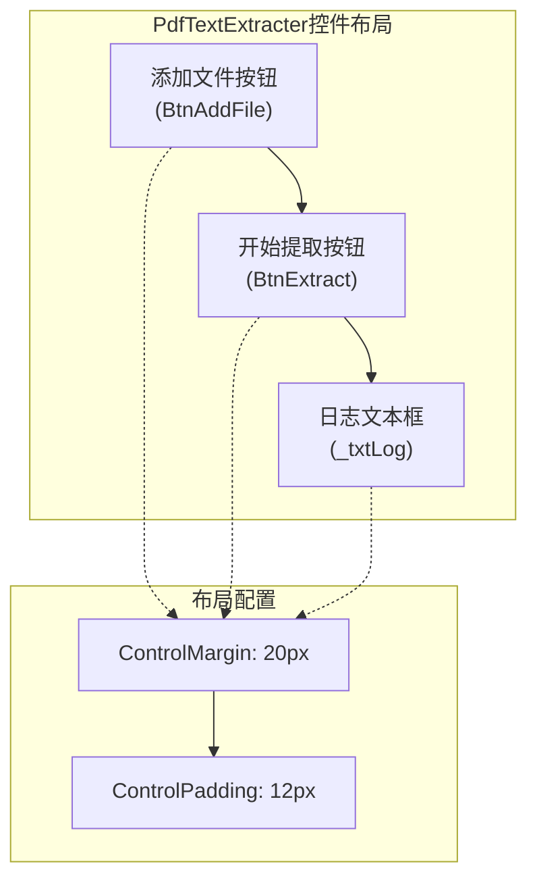
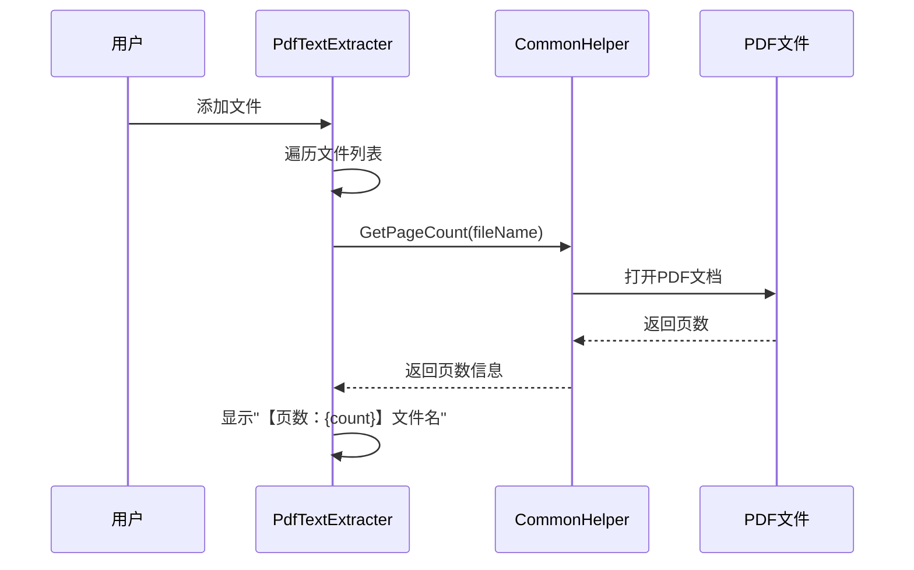
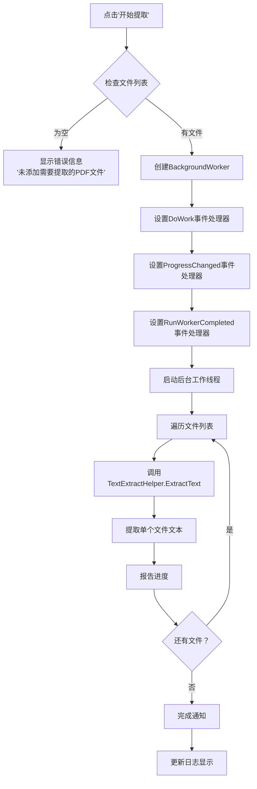
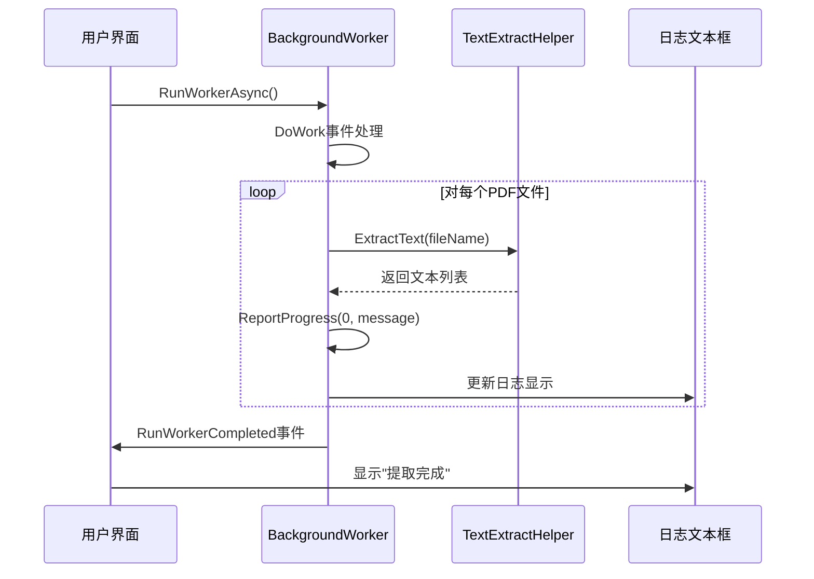
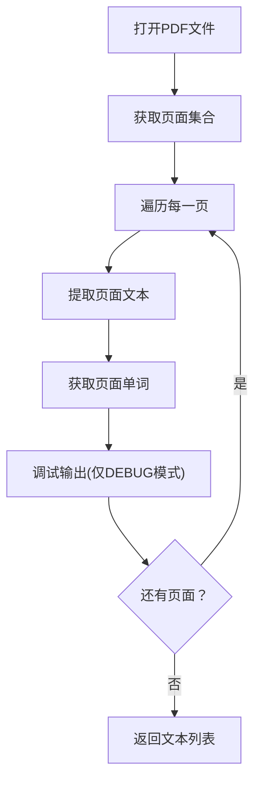
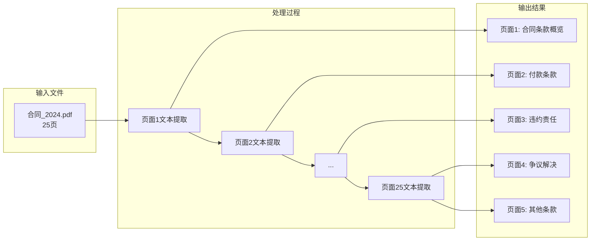

# PdfTextExtracter用户控件操作使用指南

<cite>
**本文档中引用的文件**
- [PdfTextExtracter.cs](file://PdfTool/PdfTextExtracter.cs)
- [PdfTextExtracter.Designer.cs](file://PdfTool/PdfTextExtracter.Designer.cs)
- [Config.cs](file://PdfTool/Config.cs)
- [CommonHelper.cs](file://PdfHelperLibrary/CommonHelper.cs)
- [TextExtractHelper.cs](file://PdfHelperLibrary/TextExtractHelper.cs)
- [MainForm.cs](file://PdfTool/MainForm.cs)
- [Common.cs](file://PdfTool/Common.cs)
</cite>

## 目录
1. [简介](#简介)
2. [界面布局与控件说明](#界面布局与控件说明)
3. [操作流程详解](#操作流程详解)
4. [核心功能实现机制](#核心功能实现机制)
5. [配置参数说明](#配置参数说明)
6. [实际操作示例](#实际操作示例)
7. [输出格式与结果解读](#输出格式与结果解读)
8. [故障排除指南](#故障排除指南)
9. [总结](#总结)

## 简介

PdfTextExtracter是PdfTool项目中的一个专门用于PDF文本提取的用户控件。该控件提供了直观的图形界面，允许用户通过简单的拖拽或文件选择方式导入PDF文档，实时显示文档页数信息，并通过异步处理机制高效地提取文本内容。控件采用BackgroundWorker模式实现非阻塞式操作，确保用户界面的响应性。

## 界面布局与控件说明

PdfTextExtracter控件采用简洁直观的布局设计，主要包含以下核心组件：

### 主要控件元素



**图表来源**
- [PdfTextExtracter.cs](file://PdfTool/PdfTextExtracter.cs#L84-L115)
- [Config.cs](file://PdfTool/Config.cs#L5-L6)

### 控件属性与特性

| 控件名称 | 类型 | 位置计算 | 功能描述 |
|---------|------|----------|----------|
| 添加文件按钮 | Button | 左上角固定位置 | 打开文件对话框，支持多选PDF文件 |
| 开始提取按钮 | Button | 添加文件按钮右侧 | 触发后台文本提取任务 |
| 日志文本框 | TextBox | 底部占据大部分区域 | 显示提取进度、状态信息和结果 |

**节来源**
- [PdfTextExtracter.cs](file://PdfTool/PdfTextExtracter.cs#L84-L115)

## 操作流程详解

### 第一步：添加PDF文件

用户可以通过两种方式添加PDF文件：

#### 方法一：点击"添加文件"按钮
1. 点击界面上的"添加文件"按钮
2. 弹出标准Windows文件选择对话框
3. 在过滤器中选择"PDF文件(*.pdf)"类型
4. 支持多选模式，可同时选择多个PDF文件
5. 文件列表会自动更新，显示每个文件的页数信息

#### 方法二：拖拽文件
1. 直接将PDF文件拖拽到主窗口
2. 系统会自动识别PDF文件并添加到处理队列
3. 同样会显示页数信息和文件名

### 第二步：检查文件信息

系统会自动调用`CommonHelper.GetPageCount`方法获取每个PDF文件的页数信息：



**图表来源**
- [PdfTextExtracter.cs](file://PdfTool/PdfTextExtracter.cs#L35-L37)
- [CommonHelper.cs](file://PdfHelperLibrary/CommonHelper.cs#L11-L26)

### 第三步：启动文本提取

当用户点击"开始提取"按钮时，系统执行以下操作流程：



**图表来源**
- [PdfTextExtracter.cs](file://PdfTool/PdfTextExtracter.cs#L50-L79)

**节来源**
- [PdfTextExtracter.cs](file://PdfTool/PdfTextExtracter.cs#L43-L79)

## 核心功能实现机制

### BackgroundWorker异步处理机制

PdfTextExtracter采用BackgroundWorker实现异步处理，确保界面不会因为长时间的文件处理而冻结：

#### 异步处理流程



**图表来源**
- [PdfTextExtracter.cs](file://PdfTool/PdfTextExtracter.cs#L57-L79)

#### 进度报告机制

系统通过ProgressChanged事件实时更新用户界面：

- **进度报告**：每次成功提取一个文件后，系统会报告进度并更新日志
- **状态反馈**：显示当前正在处理的文件名和提取状态
- **完成通知**：所有文件处理完成后显示完成状态

### 文本提取算法

TextExtractHelper使用PdfSharp库进行PDF文本提取：



**图表来源**
- [TextExtractHelper.cs](file://PdfHelperLibrary/TextExtractHelper.cs#L8-L32)

**节来源**
- [PdfTextExtracter.cs](file://PdfTool/PdfTextExtracter.cs#L57-L79)
- [TextExtractHelper.cs](file://PdfHelperLibrary/TextExtractHelper.cs#L8-L32)

## 配置参数说明

PdfTextExtracter的布局和外观由Config类中的静态常量控制：

### 布局配置参数

| 参数名称 | 默认值 | 单位 | 作用说明 |
|---------|--------|------|----------|
| ControlMargin | 20 | 像素 | 控件与容器边缘的边距 |
| ControlPadding | 12 | 像素 | 控件之间的间距 |

### 布局计算逻辑

控件的位置和大小计算遵循以下公式：

- **按钮位置**：基于ControlMargin和ControlPadding动态计算
- **文本框大小**：根据父容器尺寸减去边距和控件高度计算
- **响应式布局**：支持窗体大小调整，控件自动重新定位

**节来源**
- [Config.cs](file://PdfTool/Config.cs#L5-L6)
- [PdfTextExtracter.cs](file://PdfTool/PdfTextExtracter.cs#L84-L115)

## 实际操作示例

### 示例场景：提取合同文档的关键条款

假设用户需要从一份合同PDF文件中提取关键条款信息：

#### 步骤1：准备合同文档
- 准备一份包含多个条款的PDF合同文档
- 确保文档结构清晰，有明确的标题和段落分隔

#### 步骤2：添加合同文件
1. 点击"添加文件"按钮
2. 选择合同PDF文件
3. 系统显示："【页数：25】合同_2024.pdf"

#### 步骤3：开始提取
1. 点击"开始提取"按钮
2. 界面显示："正在提取，请稍候..."

#### 步骤4：监控提取过程
在提取过程中，日志文本框会显示：
```
正在提取，请稍候...
合同_2024.pdf 提取完成
第1页文本内容...
第2页文本内容...
...
提取完成
```

#### 步骤5：分析提取结果
提取的文本将以页面为单位返回，用户可以：
- 查看每个页面的原始文本内容
- 根据文本结构识别关键条款
- 导出文本进行进一步分析

### 实际效果展示



**图表来源**
- [PdfTextExtracter.cs](file://PdfTool/PdfTextExtracter.cs#L62-L64)

## 输出格式与结果解读

### 文本提取结果格式

PdfTextExtracter返回的文本数据具有以下特点：

#### 数据结构
- **返回类型**：List<string>
- **每个元素**：对应PDF文档中一页的完整文本内容
- **顺序**：按照PDF页面顺序排列

#### 输出示例格式
```
合同_2024.pdf 提取完成
第1页文本内容...
第2页文本内容...
第3页文本内容...
...
```

### 结果解读指南

#### 文本质量评估
1. **完整性**：检查是否所有页面都被正确提取
2. **准确性**：验证文本内容与原PDF的一致性
3. **格式保留**：注意换行符和空格的处理

#### 关键信息提取策略
- **按页分析**：逐页检查重要条款
- **关键词搜索**：在提取的文本中搜索特定关键词
- **结构化处理**：根据文本结构进行分类整理

**节来源**
- [PdfTextExtracter.cs](file://PdfTool/PdfTextExtracter.cs#L62-L64)
- [TextExtractHelper.cs](file://PdfHelperLibrary/TextExtractHelper.cs#L8-L32)

## 故障排除指南

### 常见问题及解决方案

#### 问题1：无法添加PDF文件
**症状**：点击"添加文件"按钮无反应
**原因**：文件权限或文件损坏
**解决方案**：
1. 检查文件是否被其他程序占用
2. 验证PDF文件完整性
3. 尝试使用不同版本的PDF阅读器打开文件

#### 问题2：提取过程中界面无响应
**症状**：点击"开始提取"后界面冻结
**原因**：BackgroundWorker配置问题或文件过大
**解决方案**：
1. 等待处理完成，不要重复点击
2. 如果文件过大，考虑分批处理
3. 检查系统内存使用情况

#### 问题3：提取结果不完整
**症状**：某些页面文本缺失或乱码
**原因**：PDF加密、字体嵌入问题或扫描件
**解决方案**：
1. 确认PDF文件未加密
2. 检查是否为扫描件（需要OCR处理）
3. 尝试使用不同的PDF处理库

### 性能优化建议

#### 大文件处理
- 分批处理大型PDF文件
- 监控内存使用情况
- 考虑使用流式处理方式

#### 批量处理
- 利用多文件选择功能
- 设置合理的等待时间
- 定期保存中间结果

**节来源**
- [PdfTextExtracter.cs](file://PdfTool/PdfTextExtracter.cs#L52-L56)
- [CommonHelper.cs](file://PdfHelperLibrary/CommonHelper.cs#L13-L26)

## 总结

PdfTextExtracter用户控件为PDF文本提取提供了完整、易用的解决方案。通过直观的界面设计、可靠的异步处理机制和灵活的配置选项，用户可以轻松地从PDF文档中提取文本内容。

### 主要优势
- **用户友好**：简洁直观的操作界面
- **性能可靠**：异步处理确保界面响应性
- **功能完整**：支持多文件处理和实时进度反馈
- **配置灵活**：基于Config类的参数化设计

### 适用场景
- 合同文档分析
- 报告内容提取
- 学术论文文本挖掘
- 企业文档管理

通过本指南的学习，用户可以熟练掌握PdfTextExtracter的各项功能，高效地完成PDF文本提取任务。如需更深入的功能了解，建议参考相关源代码和配置文件的具体实现。