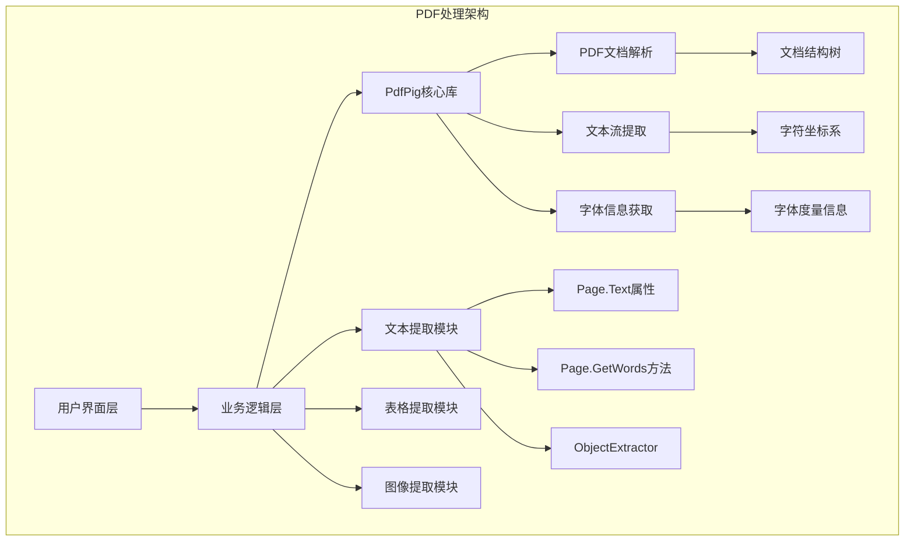
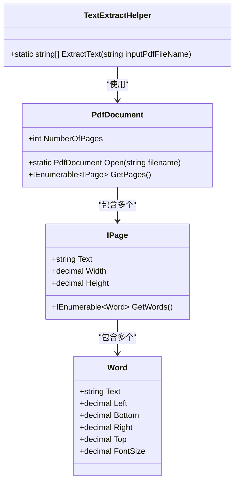
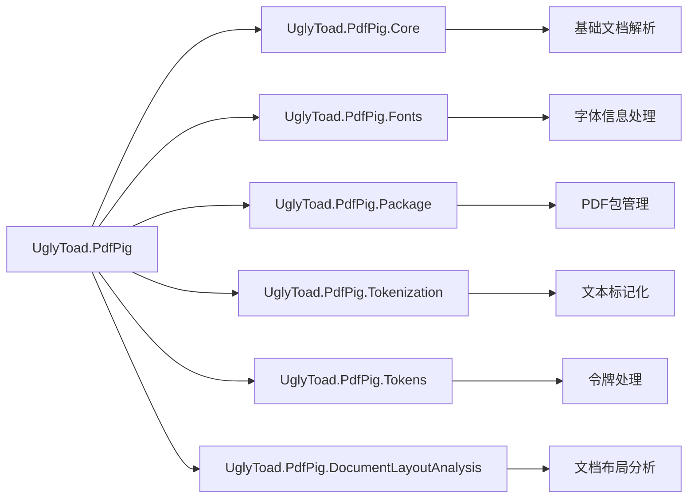
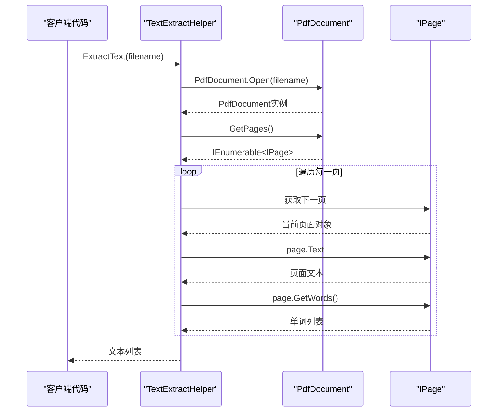
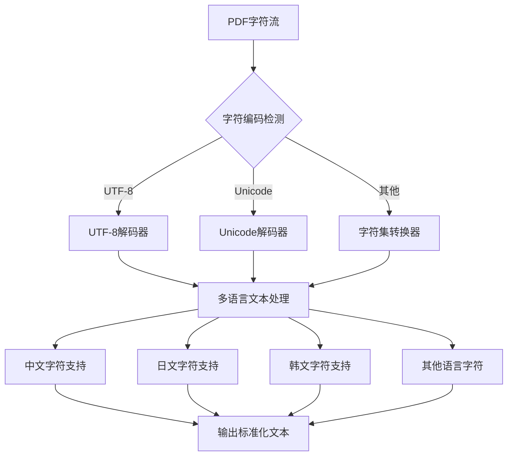
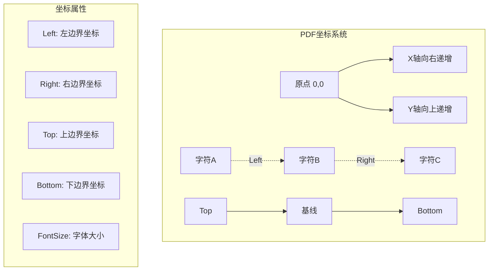
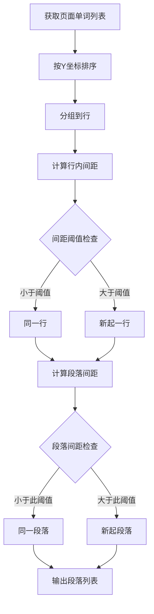
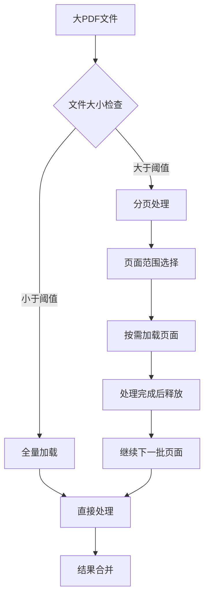
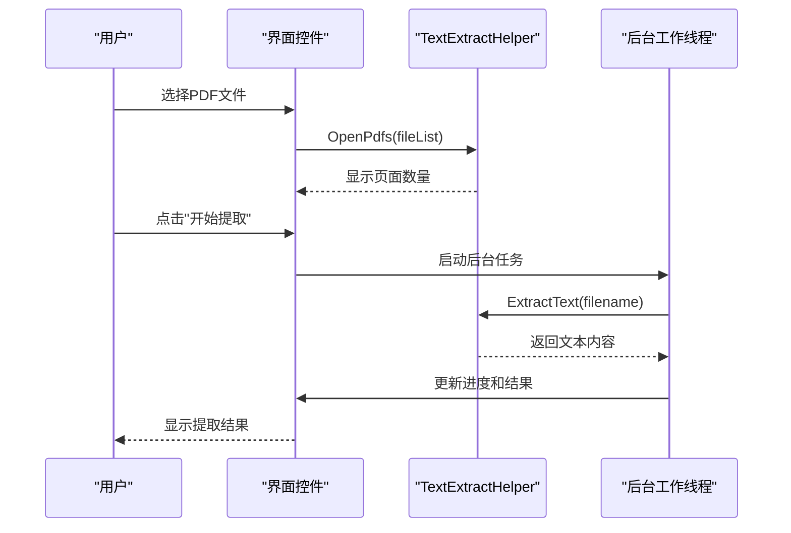

# 文本提取原理

<cite>
**本文档中引用的文件**
- [TextExtractHelper.cs](file://PdfHelperLibrary/TextExtractHelper.cs)
- [PdfHelperLibrary.csproj](file://PdfHelperLibrary/PdfHelperLibrary.csproj)
- [CommonHelper.cs](file://PdfHelperLibrary/CommonHelper.cs)
- [PdfTextExtracter.cs](file://PdfTool/PdfTextExtracter.cs)
- [TableExtractHelper.cs](file://PdfHelperLibrary/TableExtractHelper.cs)
- [CellItem.cs](file://PdfDesignHelper/CellItem.cs)
- [MainForm.cs](file://PdfTool/MainForm.cs)
</cite>

## 目录
1. [引言](#引言)
2. [项目架构概述](#项目架构概述)
3. [核心组件分析](#核心组件分析)
4. [PdfPig库集成机制](#pdfpig库集成机制)
5. [文本提取流程详解](#文本提取流程详解)
6. [字符编码与多语言支持](#字符编码与多语言支持)
7. [文本布局还原挑战](#文本布局还原挑战)
8. [段落分割算法](#段落分割算法)
9. [性能优化策略](#性能优化策略)
10. [实际应用案例](#实际应用案例)
11. [总结](#总结)

## 引言

本文档深入解析基于PdfPig库的PDF文本提取机制，重点阐述TextExtractHelper.cs中的核心实现原理。PdfPig是一个高性能的C# PDF库，专门用于解析PDF文档结构并提取文本内容。通过分析该库的实现，我们将深入了解PDF文档解析的技术细节，包括文档结构解析、文本流提取、字符编码处理以及文本布局还原等关键概念。

## 项目架构概述

PdfHelperLibrary项目采用模块化设计，提供了完整的PDF处理功能集合。该项目的核心优势在于集成了PdfPig库，为开发者提供了简洁而强大的PDF文本提取接口。

**图表来源**
- [TextExtractHelper.cs](file://PdfHelperLibrary/TextExtractHelper.cs#L1-L35)
- [PdfHelperLibrary.csproj](file://PdfHelperLibrary/PdfHelperLibrary.csproj#L74-L94)

**章节来源**
- [PdfHelperLibrary.csproj](file://PdfHelperLibrary/PdfHelperLibrary.csproj#L1-L127)

## 核心组件分析

### TextExtractHelper类设计

TextExtractHelper类是PDF文本提取的核心入口点，采用了静态方法设计模式，提供了简洁的API接口。

**图表来源**
- [TextExtractHelper.cs](file://PdfHelperLibrary/TextExtractHelper.cs#L11-L31)

### 主要方法实现

TextExtractHelper类的核心方法实现了以下功能：

1. **文档打开**：使用`PdfDocument.Open()`方法加载PDF文件
2. **页面遍历**：通过`GetPages()`方法获取所有页面
3. **文本提取**：
   - `page.Text`：获取页面的完整文本内容
   - `page.GetWords()`：获取页面中的独立单词列表
4. **资源管理**：使用`using`语句确保资源正确释放

**章节来源**
- [TextExtractHelper.cs](file://PdfHelperLibrary/TextExtractHelper.cs#L11-L31)

## PdfPig库集成机制

### 库依赖关系

PdfPig库通过多个DLL组件提供不同的功能模块：

**图表来源**
- [PdfHelperLibrary.csproj](file://PdfHelperLibrary/PdfHelperLibrary.csproj#L74-L94)

### PdfDocument.Open方法解析

`PdfDocument.Open()`方法是PDF文档解析的起点，它负责：

1. **文件验证**：检查PDF文件格式的有效性
2. **目录解析**：读取PDF文件的目录结构
3. **对象加载**：加载文档中的各种对象
4. **内存映射**：建立文档内容的内存表示

该方法支持多种重载形式，包括指定解析选项的能力，这对于处理复杂的PDF文档至关重要。

**章节来源**
- [TextExtractHelper.cs](file://PdfHelperLibrary/TextExtractHelper.cs#L14-L15)

## 文本提取流程详解

### 页面遍历机制

GetPages()方法提供了对PDF文档中所有页面的迭代访问：

**图表来源**
- [TextExtractHelper.cs](file://PdfHelperLibrary/TextExtractHelper.cs#L16-L29)

### page.Text vs page.GetWords的区别

两种文本提取方式各有特点：

| 特性 | page.Text | page.GetWords |
|------|-----------|---------------|
| **数据类型** | 完整的字符串 | Word对象集合 |
| **文本格式** | 原始文本，可能包含空白字符 | 结构化单词数据 |
| **位置信息** | 不包含坐标信息 | 包含精确的坐标和字体信息 |
| **性能开销** | 较低 | 较高（需要解析每个单词） |
| **应用场景** | 快速文本提取 | 精确的文本布局分析 |

**章节来源**
- [TextExtractHelper.cs](file://PdfHelperLibrary/TextExtractHelper.cs#L19-L28)

## 字符编码与多语言支持

### UTF-8编码处理策略

PdfPig库内置了对多种字符编码的支持，特别强调UTF-8编码的处理：

### 中文支持机制

对于中文等多语言文本，PdfPig库通过以下机制确保正确处理：

1. **字体识别**：自动识别包含中文字符的字体
2. **编码转换**：将PDF内部编码转换为标准UTF-8
3. **字形映射**：处理复杂的汉字字形映射
4. **双向文本**：支持中英文混合文本的正确显示

**章节来源**
- [TextExtractHelper.cs](file://PdfHelperLibrary/TextExtractHelper.cs#L22-L28)

## 文本布局还原挑战

### 字符定位坐标系统

PDF文档中的字符定位采用基于左下角的坐标系统：

### 字体信息获取方式

字体信息的获取对于准确的文本布局重建至关重要：

| 属性 | 描述 | 用途 |
|------|------|------|
| **FontName** | 字体名称 | 字体识别和样式匹配 |
| **FontSize** | 字体大小 | 行高计算和比例调整 |
| **CharacterSpacing** | 字符间距 | 文本对齐和排版 |
| **WordSpacing** | 单词间距 | 段落分割和语义分析 |
| **HorizontalScaling** | 水平缩放 | 字体变形处理 |

**章节来源**
- [CellItem.cs](file://PdfDesignHelper/CellItem.cs#L1-L31)

## 段落分割算法

### 基于单词间距的分割策略

段落分割是文本提取中的关键挑战，主要通过分析单词间的空间关系来实现：

### 行高判断算法

行高的计算考虑了多种因素：

1. **最大字符高度**：取行内所有字符的最大高度
2. **基线距离**：考虑字体的基线偏移
3. **行间距因子**：根据字体特性调整行间距
4. **视觉间距**：考虑字符间的实际视觉间隔

**章节来源**
- [TableExtractHelper.cs](file://PdfHelperLibrary/TableExtractHelper.cs#L66-L105)

## 性能优化策略

### 大文件分页处理策略

对于大型PDF文档，采用分页处理可以显著提高性能：

### 内存优化技术

1. **流式处理**：避免一次性加载整个文档到内存
2. **延迟加载**：只在需要时解析特定页面
3. **资源池化**：重用解析器和缓冲区
4. **垃圾回收优化**：及时释放不再使用的对象

### 并发处理策略

对于多文档处理场景，可以采用以下并发策略：

- **页面级并行**：同时处理不同页面
- **文档级并行**：同时处理不同文档
- **异步处理**：使用BackgroundWorker避免UI阻塞

**章节来源**
- [PdfTextExtracter.cs](file://PdfTool/PdfTextExtracter.cs#L57-L78)

## 实际应用案例

### 用户界面集成

在PdfTool项目中，文本提取功能通过图形界面提供给用户：

**图表来源**
- [PdfTextExtracter.cs](file://PdfTool/PdfTextExtracter.cs#L30-L78)
- [MainForm.cs](file://PdfTool/MainForm.cs#L135-L163)

### 错误处理机制

系统实现了完善的错误处理机制：

1. **文件格式验证**：检查PDF文件的完整性
2. **内存不足处理**：大文件时的内存管理
3. **异常捕获**：捕获并记录解析过程中的异常
4. **用户友好提示**：提供清晰的错误信息

**章节来源**
- [CommonHelper.cs](file://PdfHelperLibrary/CommonHelper.cs#L11-L26)

## 总结

基于PdfPig库的PDF文本提取机制展现了现代PDF处理技术的精髓。通过深入分析TextExtractHelper.cs的实现，我们可以看到：

1. **模块化设计**：清晰的职责分离和简洁的API设计
2. **性能优化**：合理的资源管理和内存控制策略
3. **多语言支持**：完善的字符编码和字体处理机制
4. **扩展性**：灵活的插件架构和可扩展的设计

该实现不仅解决了PDF文本提取的核心技术问题，还为后续的功能扩展奠定了坚实的基础。随着PDF技术的不断发展，这种基于底层库的解决方案将继续发挥重要作用，为开发者提供强大而可靠的PDF处理能力。