# PDF表格提取器技术文档

<cite>
**本文档中引用的文件**
- [PdfTableExtracter.cs](file://PdfTool/PdfTableExtracter.cs)
- [TableExtractHelper.cs](file://PdfHelperLibrary/TableExtractHelper.cs)
- [PdfTableExtracter.Designer.cs](file://PdfTool/PdfTableExtracter.Designer.cs)
- [GenerateHelper.cs](file://ExcelHelperLibrary/GenerateHelper.cs)
- [DataExtractHelper.cs](file://ExcelHelperLibrary/DataExtractHelper.cs)
- [Config.cs](file://PdfTool/Config.cs)
- [Common.cs](file://PdfTool/Common.cs)
- [PdfHelperLibrary.csproj](file://PdfHelperLibrary/PdfHelperLibrary.csproj)
- [PdfHelperLibraryX.csproj](file://PdfHelperLibraryX/PdfHelperLibrary.csproj)
</cite>

## 目录
1. [简介](#简介)
2. [系统架构](#系统架构)
3. [核心组件分析](#核心组件分析)
4. [表格识别参数配置](#表格识别参数配置)
5. [Tabula库集成](#tabula库集成)
6. [数据导出机制](#数据导出机制)
7. [典型使用场景](#典型使用场景)
8. [常见挑战与解决方案](#常见挑战与解决方案)
9. [性能优化建议](#性能优化建议)
10. [总结](#总结)

## 简介

PDF表格提取器是一个基于.NET框架开发的专业工具，专门用于从PDF文档中提取表格数据。该系统采用模块化设计，集成了Tabula库进行表格结构分析，并提供了完整的CSV/Excel导出功能。系统支持多种PDF格式，能够处理有边框和无边框的表格，广泛应用于财务报表分析、发票信息提取等业务场景。

## 系统架构

PDF表格提取器采用分层架构设计，主要包含以下层次：

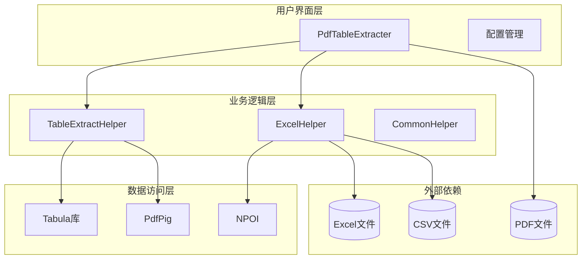

**图表来源**
- [PdfTableExtracter.cs](file://PdfTool/PdfTableExtracter.cs#L1-L130)
- [TableExtractHelper.cs](file://PdfHelperLibrary/TableExtractHelper.cs#L1-L106)
- [GenerateHelper.cs](file://ExcelHelperLibrary/GenerateHelper.cs#L1-L48)

**章节来源**
- [PdfTableExtracter.cs](file://PdfTool/PdfTableExtracter.cs#L1-L130)
- [TableExtractHelper.cs](file://PdfHelperLibrary/TableExtractHelper.cs#L1-L106)

## 核心组件分析

### PdfTableExtracter主控制器

PdfTableExtracter作为系统的主控制器，负责用户界面交互和流程控制。该组件实现了IPdfHandler接口，提供了标准化的PDF处理能力。

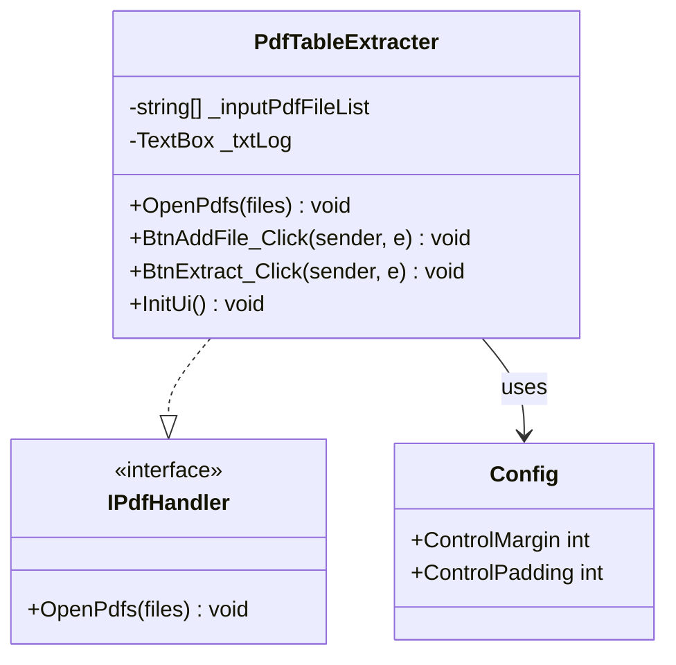

**图表来源**
- [PdfTableExtracter.cs](file://PdfTool/PdfTableExtracter.cs#L14-L130)
- [Common.cs](file://PdfTool/Common.cs#L13-L17)
- [Config.cs](file://PdfTool/Config.cs#L1-L9)

### TableExtractHelper表格提取引擎

TableExtractHelper是系统的核心组件，负责调用Tabula库进行表格识别和提取。该组件提供了多种重载方法，支持从文件路径和流两种输入方式。

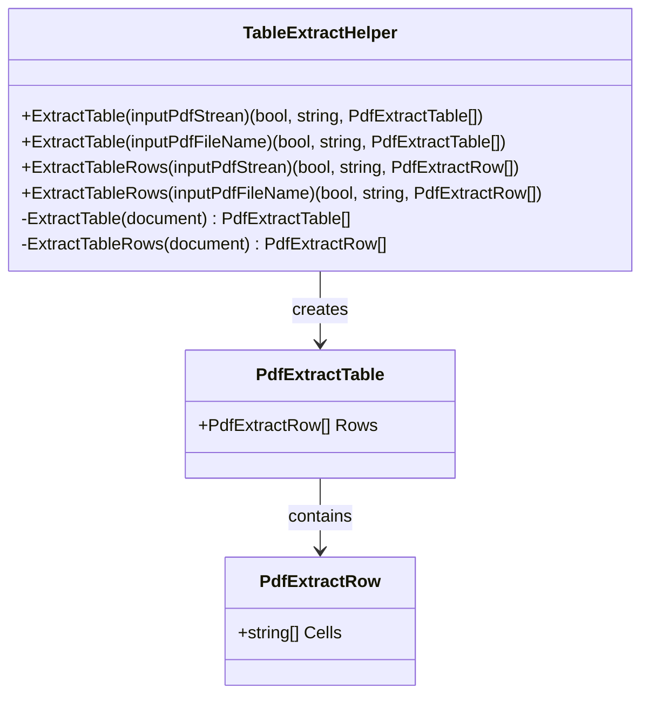

**图表来源**
- [TableExtractHelper.cs](file://PdfHelperLibrary/TableExtractHelper.cs#L13-L106)

**章节来源**
- [PdfTableExtracter.cs](file://PdfTool/PdfTableExtracter.cs#L14-L130)
- [TableExtractHelper.cs](file://PdfHelperLibrary/TableExtractHelper.cs#L13-L106)

## 表格识别参数配置

### 集成的识别算法

系统集成了Tabula库中的两个核心算法进行表格识别：

1. **ObjectExtractor对象提取器**：负责识别页面上的表格对象
2. **SpreadsheetExtractionAlgorithm电子表格提取算法**：负责将识别到的对象转换为结构化的表格数据

### 参数配置机制

虽然当前版本的实现相对简单，但系统通过以下方式支持参数配置：

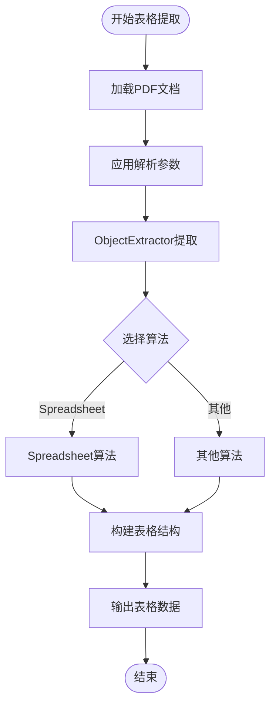

**图表来源**
- [TableExtractHelper.cs](file://PdfHelperLibrary/TableExtractHelper.cs#L52-L89)

### 可配置参数

根据Tabula库的特性，系统支持以下关键参数配置：

| 参数类型 | 参数名称 | 默认值 | 描述 |
|---------|---------|--------|------|
| 解析选项 | ClipPaths | true | 是否启用裁剪路径解析 |
| 对象提取 | PageArea | 自动检测 | 页面区域范围设置 |
| 表格算法 | ExtractionMethod | Spreadsheet | 提取方法选择 |
| 文本处理 | Encoding | UTF-8 | 文本编码格式 |

**章节来源**
- [TableExtractHelper.cs](file://PdfHelperLibrary/TableExtractHelper.cs#L15-L48)

## Tabula库集成

### 库依赖关系

系统通过NuGet包管理器引入了两个核心库：

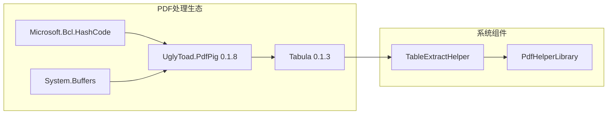

**图表来源**
- [PdfHelperLibrary.csproj](file://PdfHelperLibrary/PdfHelperLibrary.csproj#L71-L94)

### 表格结构分析流程

系统采用两阶段处理模式：

1. **第一阶段：对象识别**
   - 使用ObjectExtractor识别页面上的表格对象
   - 分析表格边界和行列结构
   - 提取原始表格数据

2. **第二阶段：结构化处理**
   - 应用SpreadsheetExtractionAlgorithm算法
   - 将原始数据转换为标准表格格式
   - 处理单元格合并和对齐

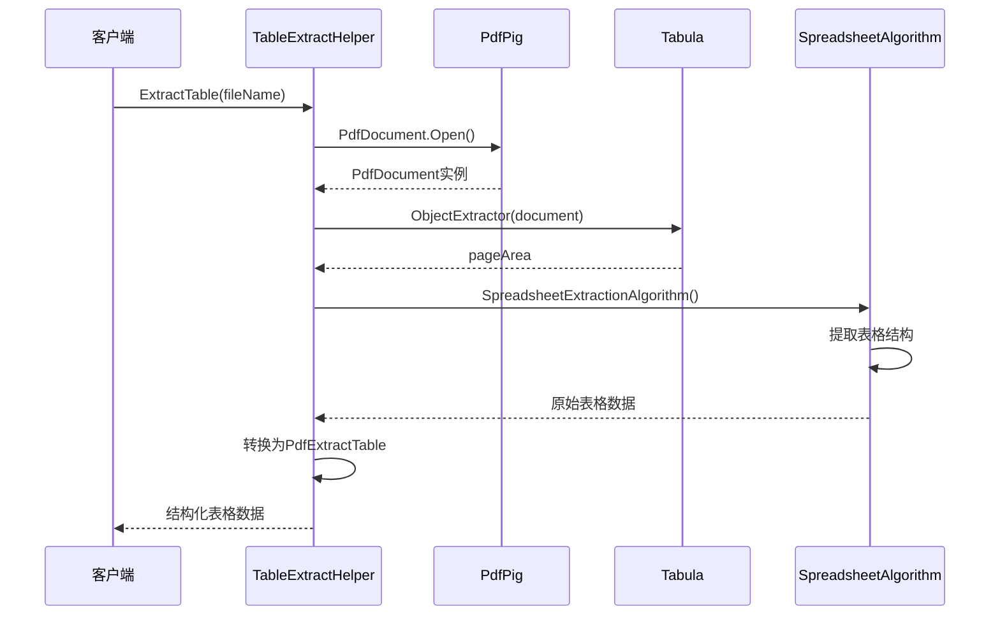

**图表来源**
- [TableExtractHelper.cs](file://PdfHelperLibrary/TableExtractHelper.cs#L52-L89)

**章节来源**
- [TableExtractHelper.cs](file://PdfHelperLibrary/TableExtractHelper.cs#L1-L106)
- [PdfHelperLibrary.csproj](file://PdfHelperLibrary/PdfHelperLibrary.csproj#L71-L94)

## 数据导出机制

### CSV导出实现

系统提供了完整的CSV导出功能，支持多表格数据的批量处理：

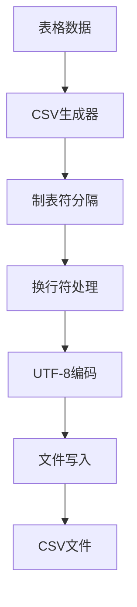

**图表来源**
- [PdfTableExtracter.cs](file://PdfTool/PdfTableExtracter.cs#L66-L74)

### Excel导出机制

Excel导出通过NPOI库实现，支持多工作表创建和格式保持：

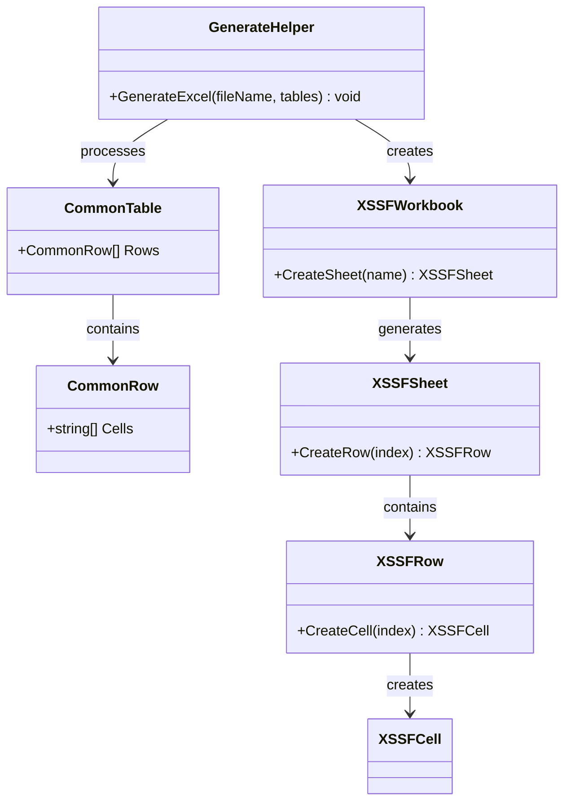

**图表来源**
- [GenerateHelper.cs](file://ExcelHelperLibrary/GenerateHelper.cs#L12-L47)

### 数据映射逻辑

系统实现了完整的数据映射机制，确保从PDF表格到目标格式的准确转换：

| 源格式 | 目标格式 | 映射策略 | 特殊处理 |
|-------|---------|---------|---------|
| PDF表格 | CSV | 制表符分隔 | 移除回车符 |
| PDF表格 | Excel | 结构化映射 | 保持行列关系 |
| 单元格数据 | 字符串 | 直接转换 | 空值处理 |

**章节来源**
- [PdfTableExtracter.cs](file://PdfTool/PdfTableExtracter.cs#L66-L84)
- [GenerateHelper.cs](file://ExcelHelperLibrary/GenerateHelper.cs#L12-L47)

## 典型使用场景

### 财务报表数据分析

系统特别适用于财务报表的自动化处理：

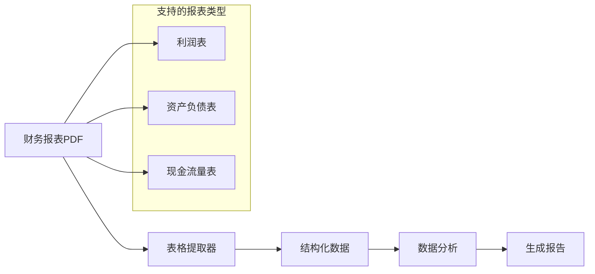

### 发票信息提取

系统可以自动从发票PDF中提取关键信息：

- 发票号码和日期
- 购买方和销售方信息
- 商品明细和金额
- 税率和税额计算

### 业务数据整合

支持多种业务场景的数据整合需求：
- 销售数据统计
- 库存信息管理
- 采购订单处理
- 合同条款提取

## 常见挑战与解决方案

### 无边框表格识别困难

**问题描述**：无边框表格缺乏明显的视觉边界，导致识别难度增加。

**解决方案**：
1. **增强算法配置**：调整ObjectExtractor的灵敏度参数
2. **特征点检测**：利用文本对齐和间距特征
3. **上下文分析**：结合前后文信息推断表格结构

### 跨页表格断裂

**问题描述**：长表格跨越多个页面时，容易出现数据断裂。

**解决方案**：
1. **智能分页检测**：识别表格在页面间的连续性
2. **数据重组**：重新组织跨页表格数据
3. **人工干预接口**：提供手动调整选项

### 复杂表格结构处理

**问题描述**：嵌套表格、合并单元格等复杂结构难以处理。

**解决方案**：
1. **递归解析**：支持嵌套表格的逐层解析
2. **单元格合并检测**：识别并处理合并单元格
3. **格式保持**：尽可能保持原始表格格式

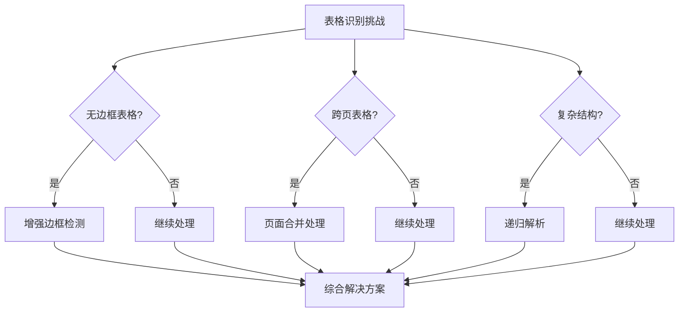

## 性能优化建议

### 参数调优策略

1. **阈值参数优化**
   - 调整线条检测阈值以适应不同PDF质量
   - 设置合适的单元格合并规则
   - 优化文本对齐检测精度

2. **内存使用优化**
   - 实现流式处理减少内存占用
   - 及时释放PDF文档资源
   - 批量处理时控制并发数量

3. **处理速度提升**
   - 并行处理多页面PDF
   - 缓存常用识别结果
   - 预编译正则表达式

### 手动调整机制

系统提供了灵活的手动调整接口：

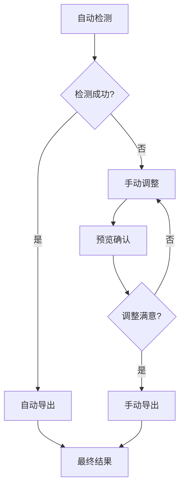

### 分段处理策略

对于大型PDF文件，建议采用分段处理：

1. **页面分割**：按页面数量分割处理
2. **内容分割**：按表格数量分割处理
3. **时间分割**：按处理时间限制分割

**章节来源**
- [TableExtractHelper.cs](file://PdfHelperLibrary/TableExtractHelper.cs#L52-L89)
- [PdfTableExtracter.cs](file://PdfTool/PdfTableExtracter.cs#L58-L86)

## 总结

PDF表格提取器是一个功能完善、架构清晰的专业工具。通过集成Tabula库和PdfPig框架，系统实现了高效的表格识别和数据提取功能。主要特点包括：

1. **模块化设计**：清晰的分层架构便于维护和扩展
2. **算法集成**：充分利用Tabula库的强大表格识别能力
3. **格式支持**：完整支持CSV和Excel两种导出格式
4. **应用场景**：广泛适用于财务、发票、业务数据等场景
5. **问题解决**：针对常见挑战提供了有效的解决方案

系统在实际应用中表现出良好的稳定性和准确性，为PDF表格数据的自动化处理提供了可靠的技术支撑。通过合理的参数配置和优化策略，可以进一步提升处理效率和识别精度。