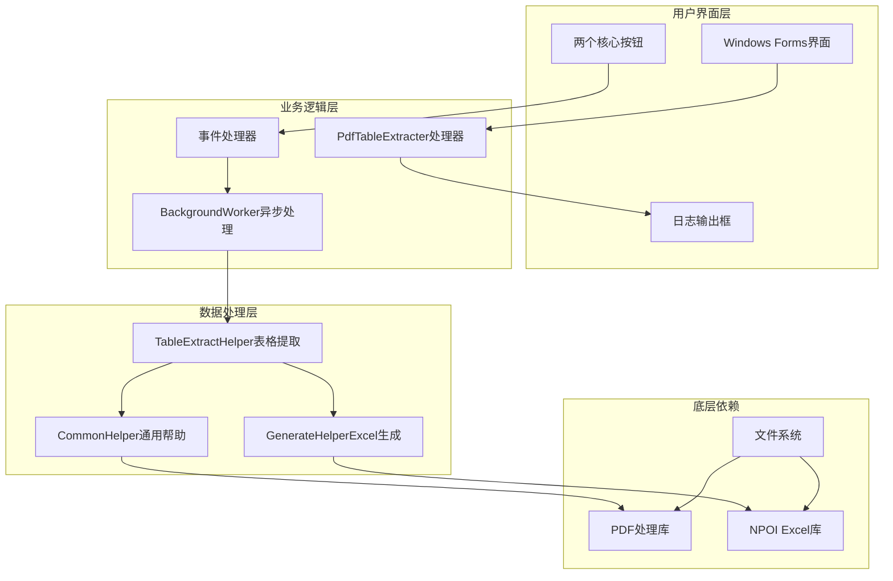
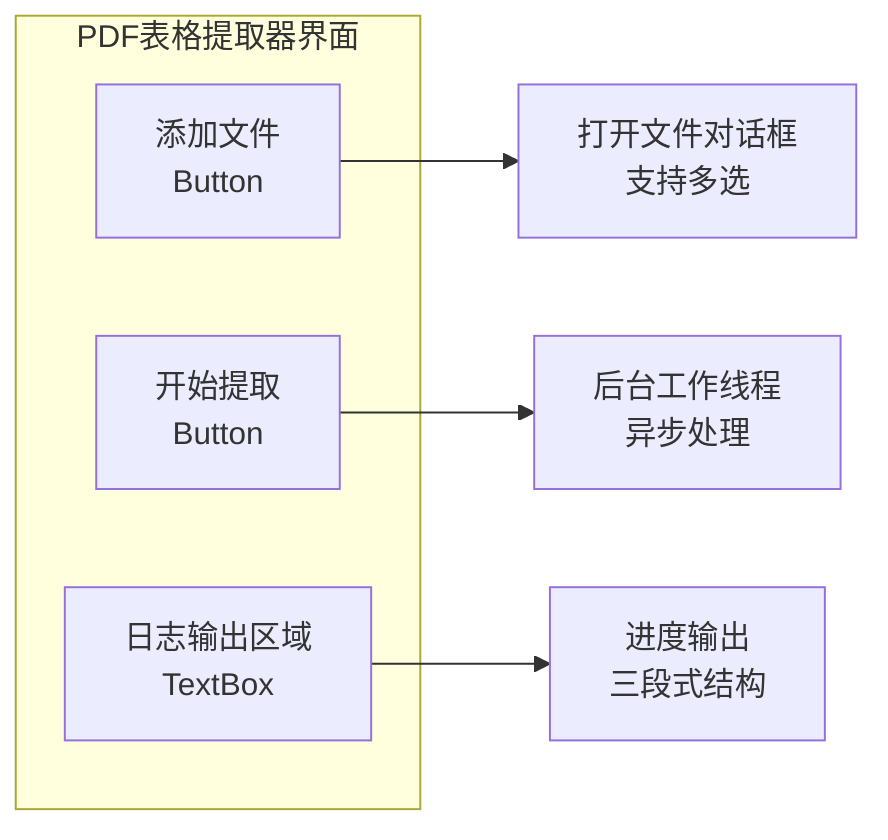
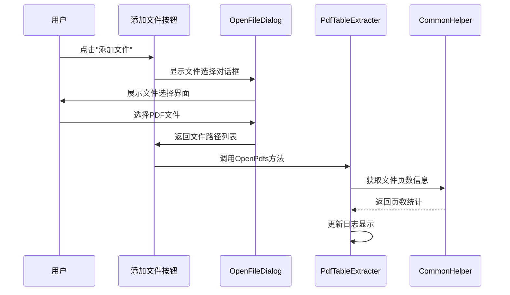
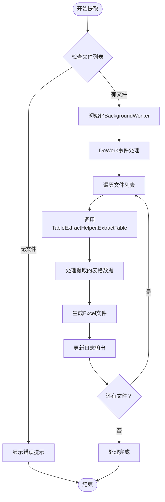
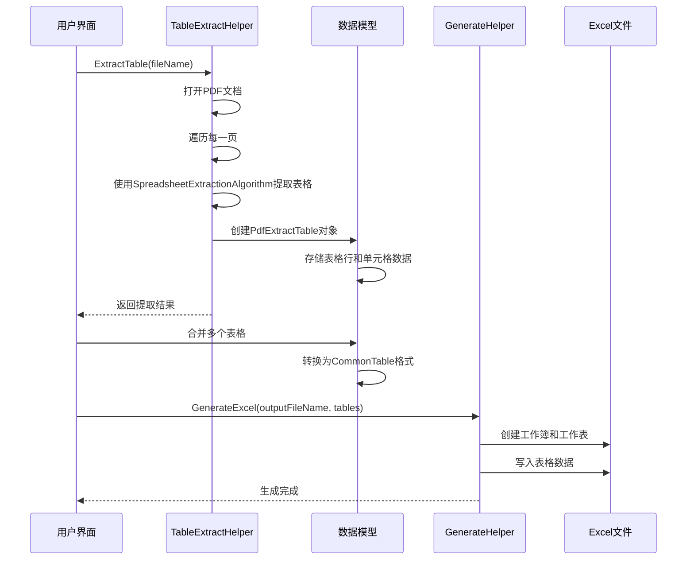
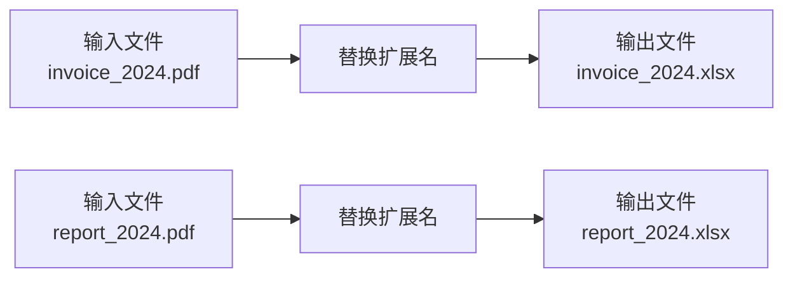

# 使用示例与操作指南

<cite>
**本文档引用的文件**
- [PdfTableExtracter.cs](file://PdfTool/PdfTableExtracter.cs)
- [PdfTableExtracter.Designer.cs](file://PdfTool/PdfTableExtracter.Designer.cs)
- [TableExtractHelper.cs](file://PdfHelperLibrary/TableExtractHelper.cs)
- [GenerateHelper.cs](file://ExcelHelperLibrary/GenerateHelper.cs)
- [CommonHelper.cs](file://PdfHelperLibrary/CommonHelper.cs)
- [MainForm.cs](file://PdfTool/MainForm.cs)
- [Config.cs](file://PdfTool/Config.cs)
- [Common.cs](file://PdfTool/Common.cs)
</cite>

## 目录
1. [简介](#简介)
2. [系统架构概览](#系统架构概览)
3. [界面操作指南](#界面操作指南)
4. [核心功能详解](#核心功能详解)
5. [数据流转过程](#数据流转过程)
6. [典型应用场景](#典型应用场景)
7. [文件命名与输出规则](#文件命名与输出规则)
8. [代码复用指南](#代码复用指南)
9. [故障排除](#故障排除)
10. [总结](#总结)

## 简介

PDF表格提取器是PDF工具套件中的核心组件，专门用于从PDF文档中提取表格数据并转换为Excel格式。该工具采用Windows Forms界面设计，提供了直观的操作体验和强大的异步处理能力，能够有效处理各种复杂的PDF表格结构。

## 系统架构概览

PDF表格提取器采用模块化架构设计，主要由以下核心组件构成：



**图表来源**
- [PdfTableExtracter.cs](file://PdfTool/PdfTableExtracter.cs#L1-L130)
- [TableExtractHelper.cs](file://PdfHelperLibrary/TableExtractHelper.cs#L1-L106)
- [GenerateHelper.cs](file://ExcelHelperLibrary/GenerateHelper.cs#L1-L48)

**章节来源**
- [PdfTableExtracter.cs](file://PdfTool/PdfTableExtracter.cs#L1-L130)
- [MainForm.cs](file://PdfTool/MainForm.cs#L1-L194)

## 界面操作指南

### 主界面布局

PDF表格提取器位于主窗体的"PDF表格提取"标签页中，界面简洁直观，包含以下核心元素：



**图表来源**
- [PdfTableExtracter.cs](file://PdfTool/PdfTableExtracter.cs#L95-L126)

### 操作步骤详解

#### 步骤1：添加PDF文件
- 点击"添加文件"按钮
- 弹出标准Windows文件选择对话框
- 支持单个或批量选择多个PDF文件
- 自动检测并显示每个文件的页数信息

#### 步骤2：开始提取
- 确认已添加至少一个PDF文件
- 点击"开始提取"按钮启动处理
- 界面保持响应，不会出现卡顿现象
- 处理过程中实时更新日志信息

**章节来源**
- [PdfTableExtracter.cs](file://PdfTool/PdfTableExtracter.cs#L44-L91)

## 核心功能详解

### 添加文件功能

添加文件功能通过`BtnAddFile_Click`事件处理器实现，其核心逻辑包括：



**图表来源**
- [PdfTableExtracter.cs](file://PdfTool/PdfTableExtracter.cs#L44-L49)
- [CommonHelper.cs](file://PdfHelperLibrary/CommonHelper.cs#L11-L26)

#### 关键特性
- **多文件支持**：支持Ctrl+点击或Shift+点击选择多个文件
- **页数预览**：自动调用`CommonHelper.GetPageCount`获取文件页数
- **即时反馈**：选择后立即在日志区域显示文件信息

### 开始提取功能

开始提取功能通过`BtnExtract_Click`事件处理器实现，采用BackgroundWorker模式确保UI不被阻塞：



**图表来源**
- [PdfTableExtracter.cs](file://PdfTool/PdfTableExtracter.cs#L51-L91)

#### 异步处理机制
- **BackgroundWorker**：避免UI线程阻塞
- **ProgressChanged事件**：实时更新处理进度
- **RunWorkerCompleted事件**：处理完成后通知用户

**章节来源**
- [PdfTableExtracter.cs](file://PdfTool/PdfTableExtracter.cs#L51-L91)

## 数据流转过程

### 完整的数据处理流程

PDF表格提取器的数据处理遵循严格的流程，确保数据的准确性和完整性：



**图表来源**
- [TableExtractHelper.cs](file://PdfHelperLibrary/TableExtractHelper.cs#L51-L71)
- [GenerateHelper.cs](file://ExcelHelperLibrary/GenerateHelper.cs#L12-L35)

### 日志输出的三段式结构

系统采用标准化的日志输出格式，便于用户跟踪处理进度：

#### 第一段：处理状态
```
【页数：23】C:\Documents\report.pdf
```
- 文件名前显示页数信息
- 方便用户确认文件基本信息

#### 第二段：提取的原始表格数据
```
姓名	部门	职位	薪资
张三	研发部	工程师	15000
李四	市场部	经理	20000
```
- 使用制表符分隔的表格格式
- 保留原始数据结构
- 易于后续处理和验证

#### 第三段：Excel生成结果
```
C:\Documents\report.xlsx 生成完成
```
- 显示输出文件路径
- 确认生成操作成功

**章节来源**
- [PdfTableExtracter.cs](file://PdfTool/PdfTableExtracter.cs#L37-L85)

## 典型应用场景

### 财务报表批量处理

**场景描述**：
企业需要定期从多个PDF格式的财务报表中提取关键数据，用于财务分析和决策支持。

**操作流程**：
1. 将所有财务报表PDF文件拖拽到界面
2. 点击"开始提取"按钮
3. 系统自动识别并提取所有表格
4. 每个PDF生成对应的.xlsx文件
5. 导入Excel进行进一步分析

**预期效果**：
- 自动生成标准化的Excel文件
- 保留原始表格结构和数据格式
- 支持批量处理大量报表文件

### 合同条款提取

**场景描述**：
法律团队需要从大量PDF格式的合同文件中提取关键条款信息。

**操作流程**：
1. 选择包含合同条款的PDF文件
2. 系统提取所有表格形式的条款
3. 生成Excel文件便于人工审核
4. 可结合正则表达式进行二次处理

**预期效果**：
- 提取合同中的关键信息表格
- 便于人工核对和确认
- 支持后续自动化处理

### 产品目录整理

**场景描述**：
电商公司需要从供应商提供的PDF产品目录中提取商品信息。

**操作流程**：
1. 批量添加供应商PDF目录
2. 系统自动识别产品表格
3. 生成结构化的Excel文件
4. 导入数据库或电商平台

**预期效果**：
- 自动生成标准的商品信息表
- 支持快速导入和更新
- 减少人工录入错误

## 文件命名与输出规则

### 命名规则

系统采用智能的文件命名策略，确保输出文件的可识别性和一致性：



**图表来源**
- [PdfTableExtracter.cs](file://PdfTool/PdfTableExtracter.cs#L76)

### 输出路径约定

系统严格遵循输入文件路径约定，确保文件组织的合理性：

- **输出路径**：与输入文件相同的目录
- **文件名**：保持原文件名，仅替换扩展名为.xlsx
- **文件覆盖**：如存在同名文件，会直接覆盖

### 文件管理建议

1. **备份重要文件**：处理前建议备份原始PDF文件
2. **分类存储**：按项目或日期建立子目录
3. **版本控制**：对于重要数据，考虑添加版本号后缀

**章节来源**
- [PdfTableExtracter.cs](file://PdfTool/PdfTableExtracter.cs#L76)

## 代码复用指南

### 在其他项目中集成

PDF表格提取器的核心功能可以通过以下方式在其他项目中复用：

#### 方法一：直接引用DLL

```csharp
// 引用必要的命名空间
using PdfHelperLibrary;
using ExcelHelperLibrary;

// 调用表格提取功能
var (success, message, tables) = TableExtractHelper.ExtractTable("input.pdf");

if (success)
{
    // 创建CommonTable对象
    var commonTable = new CommonTable
    {
        Rows = tables.SelectMany(table => table.Rows)
                   .Select(row => new CommonRow { Cells = row.Cells })
                   .ToList()
    };
    
    // 生成Excel文件
    GenerateHelper.GenerateExcel("output.xlsx", new List<CommonTable> { commonTable });
}
```

#### 方法二：封装自定义处理器

```csharp
public class CustomPdfProcessor
{
    public void ProcessPdfBatch(List<string> pdfFiles, string outputDirectory)
    {
        foreach (var pdfFile in pdfFiles)
        {
            // 调用核心提取功能
            var (success, _, tables) = TableExtractHelper.ExtractTable(pdfFile);
            
            if (success)
            {
                // 构建输出文件路径
                var outputFileName = Path.Combine(
                    outputDirectory, 
                    Path.GetFileNameWithoutExtension(pdfFile) + ".xlsx"
                );
                
                // 生成Excel文件
                var commonTable = ConvertToCommonTable(tables);
                GenerateHelper.GenerateExcel(outputFileName, new List<CommonTable> { commonTable });
            }
        }
    }
    
    private CommonTable ConvertToCommonTable(List<PdfExtractTable> tables)
    {
        // 实现表格格式转换逻辑
        return new CommonTable
        {
            Rows = tables.SelectMany(t => t.Rows)
                       .Select(r => new CommonRow { Cells = r.Cells })
                       .ToList()
        };
    }
}
```

### 性能优化建议

#### 批量处理优化
```csharp
// 使用Parallel处理提高效率
Parallel.ForEach(pdfFiles, pdfFile =>
{
    try
    {
        var (success, _, tables) = TableExtractHelper.ExtractTable(pdfFile);
        if (success)
        {
            // 并行生成Excel文件
            GenerateHelper.GenerateExcel(GetOutputPath(pdfFile), ConvertToCommonTable(tables));
        }
    }
    catch (Exception ex)
    {
        // 记录错误但继续处理其他文件
        LogError(ex, pdfFile);
    }
});
```

#### 内存管理优化
```csharp
// 使用using语句确保资源及时释放
public void ProcessLargePdfFiles(List<string> pdfFiles)
{
    foreach (var pdfFile in pdfFiles)
    {
        // 使用using确保PDF文档及时释放
        using (var document = PdfDocument.Open(pdfFile, new ParsingOptions()))
        {
            // 处理逻辑
        }
        
        // 手动触发垃圾回收（谨慎使用）
        GC.Collect();
        GC.WaitForPendingFinalizers();
    }
}
```

**章节来源**
- [TableExtractHelper.cs](file://PdfHelperLibrary/TableExtractHelper.cs#L15-L30)
- [GenerateHelper.cs](file://ExcelHelperLibrary/GenerateHelper.cs#L12-L35)

## 故障排除

### 常见问题及解决方案

#### 问题1：文件无法打开
**症状**：选择PDF文件后显示"文件不存在"或"权限不足"错误

**解决方案**：
1. 确认文件路径正确且文件未被其他程序占用
2. 检查文件权限设置
3. 尝试复制文件到本地磁盘再进行处理

#### 问题2：表格提取不完整
**症状**：某些表格未能正确识别或数据丢失

**解决方案**：
1. 检查PDF文件是否为扫描件，考虑OCR处理
2. 确认表格结构清晰，避免复杂嵌套表格
3. 尝试调整PDF的分辨率和质量设置

#### 问题3：Excel生成失败
**症状**：日志显示"生成完成"但文件不存在

**解决方案**：
1. 检查目标目录写入权限
2. 确认磁盘空间充足
3. 验证文件名是否包含非法字符

#### 问题4：处理速度过慢
**症状**：大文件处理时间过长

**解决方案**：
1. 分批处理大型PDF文件
2. 考虑升级硬件配置
3. 使用多线程并行处理（注意内存限制）

### 调试技巧

#### 启用详细日志
```csharp
// 在开发环境中启用详细日志记录
private void EnableDebugLogging()
{
    _txtLog.AppendText($"调试信息：开始处理文件 {fileName}\n");
    _txtLog.AppendText($"文件大小：{new FileInfo(fileName).Length} 字节\n");
    _txtLog.AppendText($"页面数量：{PdfHelperLibrary.CommonHelper.GetPageCount(fileName)}\n");
}
```

#### 错误处理最佳实践
```csharp
try
{
    var (success, message, tables) = TableExtractHelper.ExtractTable(fileName);
    
    if (!success)
    {
        _txtLog.AppendText($"处理失败：{message}\n");
        return;
    }
    
    // 处理成功逻辑
}
catch (Exception ex)
{
    _txtLog.AppendText($"异常错误：{ex.Message}\n");
    _txtLog.AppendText($"堆栈跟踪：{ex.StackTrace}\n");
}
```

## 总结

PDF表格提取器是一个功能强大且易于使用的工具，它通过直观的Windows Forms界面和可靠的后台处理机制，为用户提供了高效的PDF表格数据提取解决方案。

### 主要优势

1. **用户友好**：简洁直观的界面设计，操作简单易懂
2. **性能优异**：采用异步处理机制，保证UI响应性
3. **功能完整**：支持多种PDF表格类型和复杂数据结构
4. **扩展性强**：提供标准接口，便于集成到其他应用
5. **输出规范**：生成标准化的Excel文件，便于后续处理

### 最佳实践建议

1. **文件准备**：确保PDF文件质量良好，表格结构清晰
2. **批量处理**：合理规划处理批次，避免系统资源过度消耗
3. **结果验证**：对提取结果进行人工核对，确保数据准确性
4. **定期备份**：重要数据处理前后做好文件备份
5. **持续优化**：根据实际使用情况调整处理参数和流程

通过本指南的学习，用户可以充分掌握PDF表格提取器的各项功能，并在实际工作中灵活运用，提高工作效率和数据处理质量。