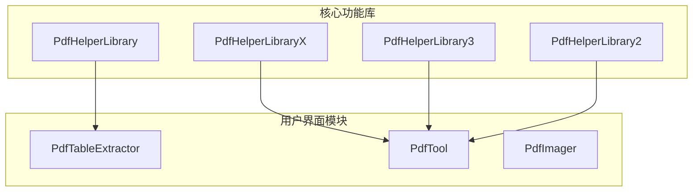
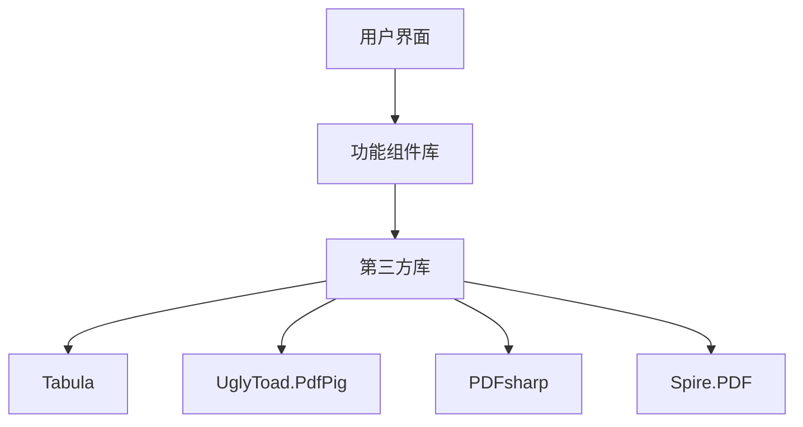
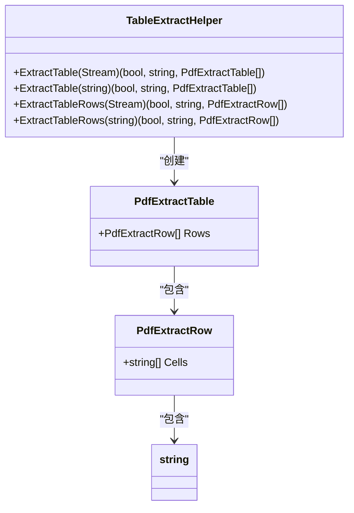
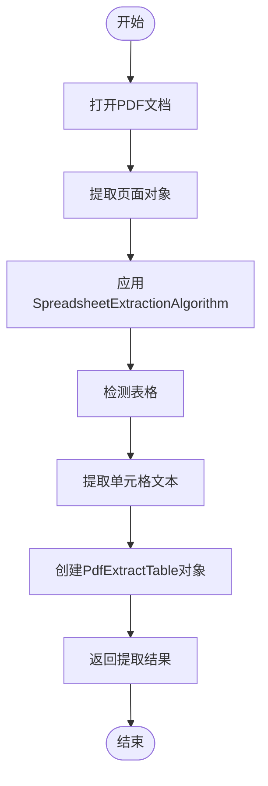
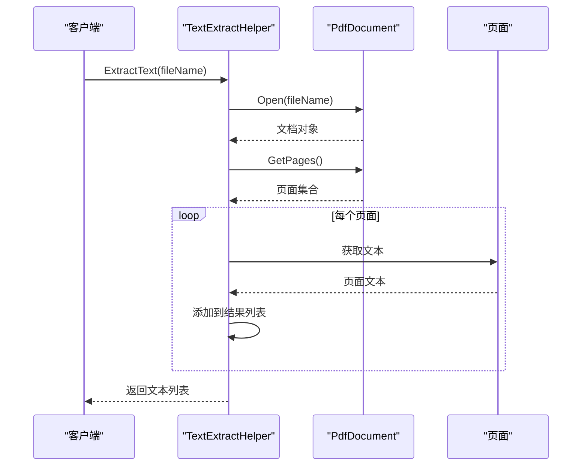
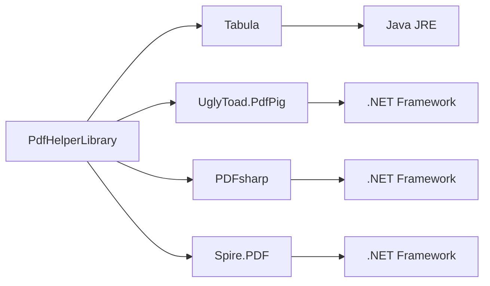

# 故障排除与精度调优

<cite>
**本文档引用的文件**   
- [TableExtractHelper.cs](file://PdfHelperLibrary/TableExtractHelper.cs)
- [TextExtractHelper.cs](file://PdfHelperLibrary/TextExtractHelper.cs)
- [PdfHelperLibrary.csproj](file://PdfHelperLibrary/PdfHelperLibrary.csproj)
- [PdfTool.csproj](file://PdfTool/PdfTool.csproj)
- [PdfTableExtracter.cs](file://PdfTool/PdfTableExtracter.cs)
- [TableHelper.cs](file://PdfHelperLibrary3/TableHelper.cs)
- [RepairHelper.cs](file://PdfHelperLibrary2/RepairHelper.cs)
- [Config.cs](file://PdfTool/Config.cs)
- [MainForm.cs](file://PdfTool/MainForm.cs)
</cite>

## 目录
1. [引言](#引言)
2. [项目结构](#项目结构)
3. [核心组件](#核心组件)
4. [架构概述](#架构概述)
5. [详细组件分析](#详细组件分析)
6. [依赖分析](#依赖分析)
7. [性能考虑](#性能考虑)
8. [故障排除指南](#故障排除指南)
9. [结论](#结论)

## 引言
本文档系统性地列出PDF表格提取过程中常见的问题及其解决方案。针对无边框表格、跨页表格、文本错位等常见问题，提供具体的调优策略和故障排除方法。文档基于PdfTool代码库的分析，重点关注表格提取功能的实现机制和优化方案。

## 项目结构
项目包含多个PDF处理相关的库和工具模块，主要分为核心功能库和用户界面模块。核心功能库包括PdfHelperLibrary、PdfHelperLibraryX等，提供表格提取、文本提取、图像提取等基础功能。用户界面模块如PdfTableExtractor提供图形化操作界面。

**图表来源**
- [PdfHelperLibrary.csproj](file://PdfHelperLibrary/PdfHelperLibrary.csproj)
- [PdfTool.csproj](file://PdfTool/PdfTool.csproj)

**章节来源**
- [PdfHelperLibrary](file://PdfHelperLibrary)
- [PdfTool](file://PdfTool)

## 核心组件
核心组件包括表格提取、文本提取和PDF处理功能。表格提取主要依赖Tabula和PdfPig库，通过SpreadsheetExtractionAlgorithm算法识别表格结构。文本提取使用PdfPig的内置文本提取功能。PDF处理功能包括压缩、修复、打印等操作。

**章节来源**
- [TableExtractHelper.cs](file://PdfHelperLibrary/TableExtractHelper.cs)
- [TextExtractHelper.cs](file://PdfHelperLibrary/TextExtractHelper.cs)
- [CompressHelper.cs](file://PdfHelperLibrary/CompressHelper.cs)

## 架构概述
系统采用分层架构，上层为用户界面模块，中层为功能组件库，底层为第三方PDF处理库。这种架构实现了功能复用和模块解耦，便于维护和扩展。

**图表来源**
- [PdfHelperLibrary.csproj](file://PdfHelperLibrary/PdfHelperLibrary.csproj)
- [PdfHelperLibraryX.csproj](file://PdfHelperLibraryX/PdfHelperLibraryX.csproj)

## 详细组件分析

### 表格提取组件分析
表格提取功能是系统的核心功能之一，支持多种提取模式和算法。

#### 表格提取类图

**图表来源**
- [TableExtractHelper.cs](file://PdfHelperLibrary/TableExtractHelper.cs#L14-L105)

#### 表格提取流程图

**图表来源**
- [TableExtractHelper.cs](file://PdfHelperLibrary/TableExtractHelper.cs#L51-L70)

### 文本提取组件分析
文本提取功能提供基础的文本内容提取能力，支持逐页提取和全文提取。

#### 文本提取序列图

**图表来源**
- [TextExtractHelper.cs](file://PdfHelperLibrary/TextExtractHelper.cs#L11-L31)

## 依赖分析
系统依赖多个第三方库来实现PDF处理功能，主要依赖包括Tabula用于表格提取，UglyToad.PdfPig用于PDF解析，PDFsharp用于PDF操作，Spire.PDF用于高级PDF功能。

**图表来源**
- [PdfHelperLibrary.csproj](file://PdfHelperLibrary/PdfHelperLibrary.csproj#L64-L83)
- [PdfHelperLibraryX.csproj](file://PdfHelperLibraryX/PdfHelperLibraryX.csproj#L1-L17)

**章节来源**
- [PdfHelperLibrary.csproj](file://PdfHelperLibrary/PdfHelperLibrary.csproj)
- [PdfHelperLibraryX.csproj](file://PdfHelperLibraryX/PdfHelperLibraryX.csproj)

## 性能考虑
对于大型PDF文档的处理，系统提供了多种性能优化策略。建议对超百页文档实施分批处理，或限制提取页码范围。内存管理方面，建议启用64位运行环境以避免内存溢出问题。

## 故障排除指南

### 无边框表格无法识别
当遇到无边框表格无法识别的问题时，建议调整Tabula的DetectionAlgorithm参数。可以尝试使用不同的检测算法，或对PDF进行预处理添加虚拟边框来提高识别率。

**章节来源**
- [TableExtractHelper.cs](file://PdfHelperLibrary/TableExtractHelper.cs#L58-L60)

### 跨页表格断裂
对于跨页表格断裂问题，建议采用分段提取后手动合并的策略。另一种解决方案是开发续表识别逻辑，自动检测并合并跨页表格。

**章节来源**
- [TableHelper.cs](file://PdfHelperLibrary3/TableHelper.cs#L111-L140)

### 文本错位或乱码
处理文本错位或乱码问题时，首先检查PDF字体嵌入情况。可以尝试不同的文本提取模式，如使用PdfPig的基本提取模式或表格提取模式。

**章节来源**
- [TextExtractHelper.cs](file://PdfHelperLibrary/TextExtractHelper.cs#L14-L16)

### 性能低下
解决性能低下问题，建议对超百页文档实施分批处理，或限制提取页码范围。可以通过配置文件设置处理参数，优化处理效率。

**章节来源**
- [Config.cs](file://PdfTool/Config.cs)
- [MainForm.cs](file://PdfTool/MainForm.cs)

### 内存溢出
当出现内存溢出时，指导用户启用64位运行环境或优化BackgroundWorker的并发策略。可以调整批处理大小，减少单次处理的数据量。

**章节来源**
- [MainForm.cs](file://PdfTool/MainForm.cs#L63-L98)
- [WordToPdf/Helper.cs](file://WordToPdf/Helper.cs#L36-L63)

### 合并单元格识别错误
针对合并单元格识别错误问题，需要了解当前算法的局限性。建议提供后处理脚本，对提取结果进行二次处理和修正。

**章节来源**
- [TableExtractHelper.cs](file://PdfHelperLibrary/TableExtractHelper.cs#L60-L61)

### 调试技巧
提供以下调试技巧：启用PdfPig的详细日志、可视化页面区域划分、对比不同提取算法（Spreadsheet vs Basic）的结果差异。这些技巧有助于定位和解决提取问题。

**章节来源**
- [TableExtractHelper.cs](file://PdfHelperLibrary/TableExtractHelper.cs#L58-L60)
- [TextExtractHelper.cs](file://PdfHelperLibrary/TextExtractHelper.cs#L14-L16)

## 结论
本文档系统性地分析了PDF表格提取过程中常见的问题及其解决方案。通过调整算法参数、优化处理策略和使用适当的调试技巧，可以显著提高表格提取的准确性和可靠性。建议用户根据具体需求选择合适的解决方案，并持续优化提取流程。