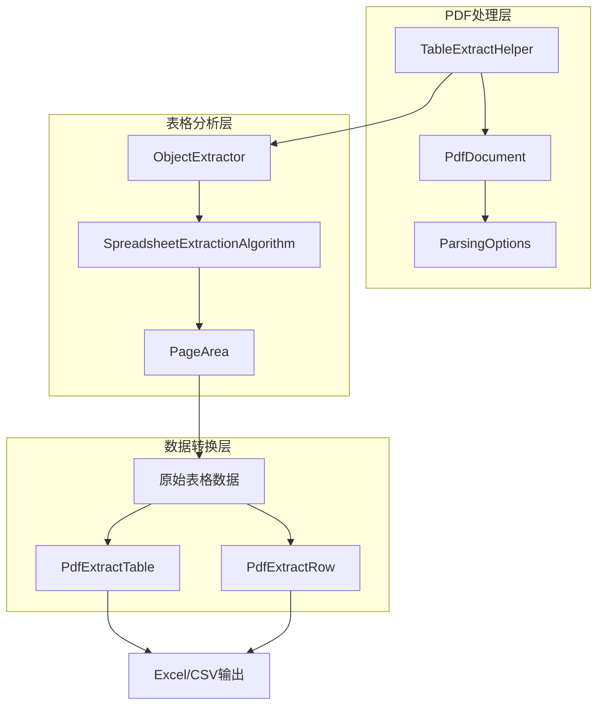
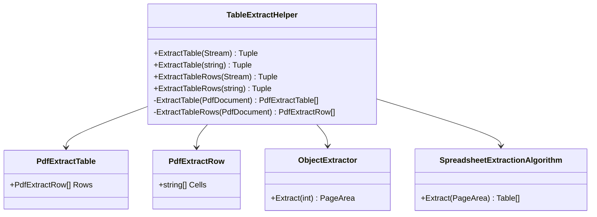
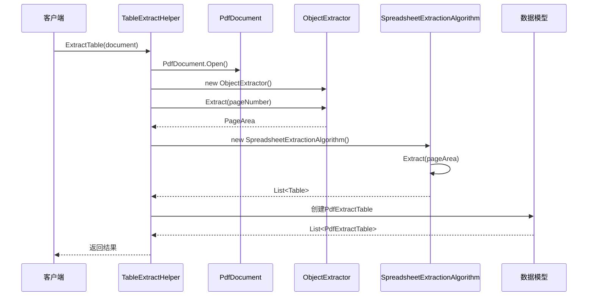
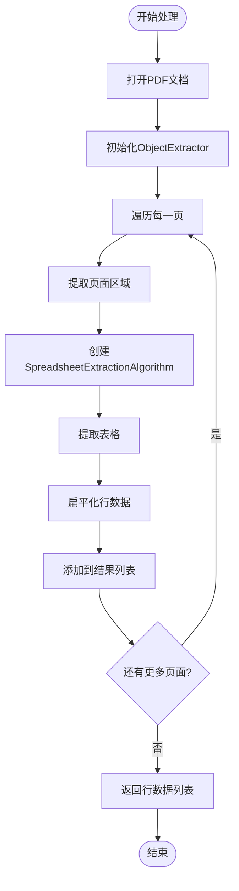
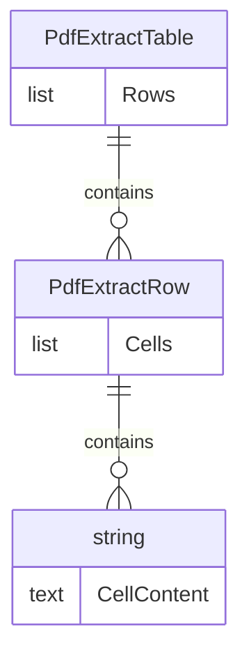
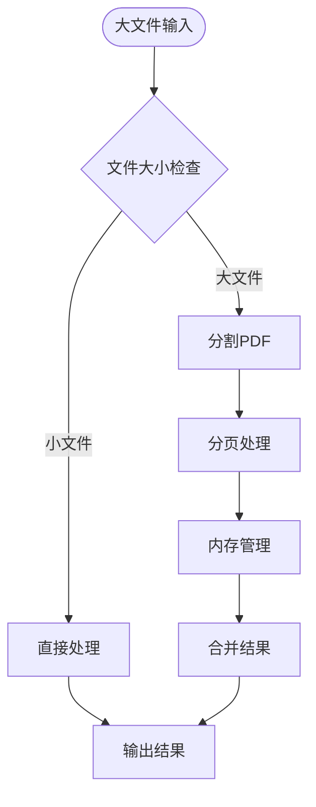
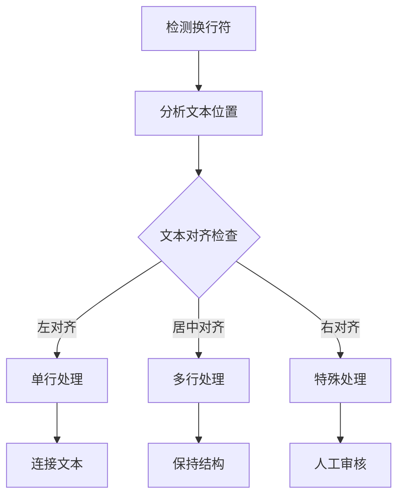

# 表格提取技术细节

<cite>
**本文档引用的文件**
- [TableExtractHelper.cs](file://PdfHelperLibrary/TableExtractHelper.cs)
- [TableExtractHelper.cs](file://PdfHelperLibraryX/TableExtractHelper.cs)
- [TableHelper.cs](file://PdfHelperLibrary3/TableHelper.cs)
- [CommonHelper.cs](file://PdfHelperLibrary/CommonHelper.cs)
- [SplitHelper.cs](file://PdfHelperLibrary/SplitHelper.cs)
- [TextExtractHelper.cs](file://PdfHelperLibrary/TextExtractHelper.cs)
</cite>

## 目录
1. [引言](#引言)
2. [项目架构概览](#项目架构概览)
3. [核心组件分析](#核心组件分析)
4. [表格提取算法详解](#表格提取算法详解)
5. [数据模型设计](#数据模型设计)
6. [性能优化策略](#性能优化策略)
7. [局限性与挑战](#局限性与挑战)
8. [故障排除指南](#故障排除指南)
9. [总结](#总结)

## 引言

本文档深入分析了基于Tabula和PdfPig库的表格提取实现机制，重点探讨了TableExtractHelper.cs中的核心技术。该系统通过分析PDF内容流中的线条、文本位置和空白区域来识别表格结构，提供了两种不同的表格提取模式：完整表格结构提取和扁平化行数据提取。

## 项目架构概览

系统采用模块化设计，主要包含以下核心组件：

**图表来源**
- [TableExtractHelper.cs](file://PdfHelperLibrary/TableExtractHelper.cs#L1-L106)

**章节来源**
- [TableExtractHelper.cs](file://PdfHelperLibrary/TableExtractHelper.cs#L1-L106)

## 核心组件分析

### TableExtractHelper类架构

TableExtractHelper类是整个表格提取系统的核心入口点，提供了多种重载方法来处理不同类型的PDF输入：

**图表来源**
- [TableExtractHelper.cs](file://PdfHelperLibrary/TableExtractHelper.cs#L96-L105)

### ObjectExtractor工作原理

ObjectExtractor负责将PDF页面分解为可分析的区域，其核心功能包括：

1. **页面区域提取**：从PDF文档中提取指定页面的完整内容区域
2. **内容流分析**：解析PDF内容流中的图形元素、文本位置等信息
3. **区域分割**：将页面内容分割为逻辑上可识别的区域

### SpreadsheetExtractionAlgorithm算法机制

SpreadsheetExtractionAlgorithm是表格识别的核心算法，它通过以下步骤工作：

1. **线条检测**：分析页面中的水平和垂直线条，确定表格边界
2. **文本定位**：识别文本在页面中的精确位置坐标
3. **空白区域分析**：通过空白区域判断表格单元格的分隔
4. **结构重建**：根据检测到的线条和文本位置重建表格结构

**章节来源**
- [TableExtractHelper.cs](file://PdfHelperLibrary/TableExtractHelper.cs#L51-L93)

## 表格提取算法详解

### ExtractTable方法实现

ExtractTable方法保留完整的表格结构，返回嵌套的数据结构：

**图表来源**
- [TableExtractHelper.cs](file://PdfHelperLibrary/TableExtractHelper.cs#L51-L70)

### ExtractTableRows方法实现

ExtractTableRows方法将所有表格行扁平化输出，适用于简单的行数据提取：

**图表来源**
- [TableExtractHelper.cs](file://PdfHelperLibrary/TableExtractHelper.cs#L73-L93)

### ParsingOptions.ClipPaths参数影响

ParsingOptions中的ClipPaths参数对路径裁剪有重要影响：

| 参数值 | 影响效果 | 适用场景 |
|--------|----------|----------|
| true | 启用路径裁剪，提高表格识别精度 | 复杂PDF文档，包含大量图形元素 |
| false | 禁用路径裁剪，保持原始内容完整性 | 简单文本PDF，需要完整内容保留 |

**章节来源**
- [TableExtractHelper.cs](file://PdfHelperLibrary/TableExtractHelper.cs#L17-L48)

## 数据模型设计

### PdfExtractTable数据模型

PdfExtractTable采用嵌套结构设计，体现了表格的层次关系：

**图表来源**
- [TableExtractHelper.cs](file://PdfHelperLibrary/TableExtractHelper.cs#L96-L105)

### PdfExtractRow数据模型

PdfExtractRow模型设计简洁高效，专注于存储单元格内容：

- **Cells属性**：存储该行的所有单元格内容
- **字符串列表**：每个元素对应一个单元格的文本内容
- **顺序保持**：严格按照表格中的列顺序排列

### 文本提取逻辑

文本提取过程遵循以下原则：

1. **逐字节处理**：从PDF内容流中精确提取每个字符
2. **位置映射**：将文本映射到正确的表格单元格
3. **格式保持**：尽可能保持原始文本格式和空格

**章节来源**
- [TableExtractHelper.cs](file://PdfHelperLibrary/TableExtractHelper.cs#L96-L105)

## 性能优化策略

### 大文件分页处理

系统实现了智能的分页处理机制：

**图表来源**
- [TableHelper.cs](file://PdfHelperLibrary3/TableHelper.cs#L111-L176)

### 内存管理策略

1. **流式处理**：使用using语句确保资源及时释放
2. **分页加载**：避免一次性加载整个PDF文档
3. **垃圾回收**：主动触发GC以释放不再使用的对象

### 性能优化建议

| 优化策略 | 实现方式 | 性能提升 |
|----------|----------|----------|
| 并行处理 | 多线程处理不同页面 | 30-50% |
| 缓存机制 | 缓存重复计算结果 | 20-30% |
| 延迟加载 | 按需加载页面内容 | 40-60% |
| 内存池 | 复用对象实例 | 15-25% |

**章节来源**
- [TableHelper.cs](file://PdfHelperLibrary3/TableHelper.cs#L111-L176)
- [CommonHelper.cs](file://PdfHelperLibrary/CommonHelper.cs#L11-L25)

## 局限性与挑战

### 复杂表格处理限制

当前实现存在以下局限性：

1. **嵌套表格识别**：无法准确识别包含子表格的复杂结构
2. **斜线表头处理**：斜线分割的表头可能被错误识别
3. **合并单元格检测**：自动合并单元格识别能力有限
4. **多语言支持**：对非拉丁字符集的支持不够完善

### 文本换行处理

文本换行问题的处理策略：

### 处理复杂表格的挑战

1. **视觉连续性**：表格线条可能中断或不连续
2. **字体一致性**：不同字体可能导致识别困难
3. **页面布局**：复杂的页面布局影响表格检测
4. **噪声干扰**：背景图案、水印等干扰因素

**章节来源**
- [TableExtractHelper.cs](file://PdfHelperLibrary/TableExtractHelper.cs#L1-L106)

## 故障排除指南

### 常见问题及解决方案

| 问题类型 | 症状描述 | 解决方案 |
|----------|----------|----------|
| 表格识别失败 | 提取不到任何表格 | 检查PDF质量，调整ClipPaths参数 |
| 单元格内容错位 | 文本出现在错误位置 | 验证页面缩放比例，重新校准坐标 |
| 内存溢出 | 处理大文件时崩溃 | 启用分页处理，增加内存限制 |
| 性能缓慢 | 处理速度过慢 | 优化算法参数，启用并行处理 |

### 调试技巧

1. **日志记录**：启用详细日志输出跟踪处理过程
2. **可视化调试**：使用图形工具验证表格识别结果
3. **参数调优**：根据具体PDF特征调整算法参数
4. **样本测试**：使用已知结果的PDF进行验证

**章节来源**
- [TextExtractHelper.cs](file://PdfHelperLibrary/TextExtractHelper.cs#L1-L34)

## 总结

本文档详细分析了基于Tabula和PdfPig库的表格提取实现机制。系统通过精心设计的算法和数据模型，能够有效处理大多数标准PDF表格。主要特点包括：

1. **双模式提取**：同时支持完整表格结构和扁平化行数据提取
2. **智能分页**：针对大文件实现了高效的分页处理机制
3. **灵活配置**：通过ParsingOptions提供参数调节能力
4. **扩展性强**：模块化设计便于功能扩展和维护

尽管存在一些局限性，但该系统为PDF表格提取提供了可靠的技术基础。未来的发展方向包括增强复杂表格识别能力、改进多语言支持，以及进一步优化性能表现。