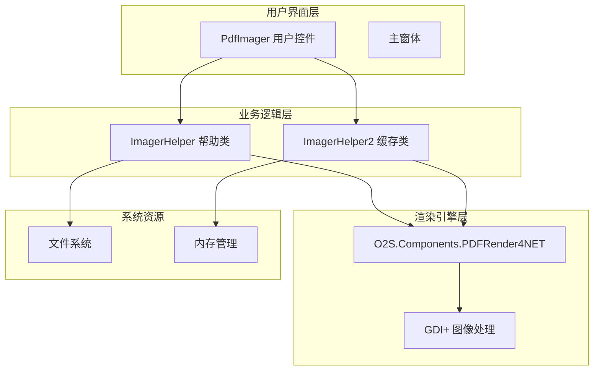
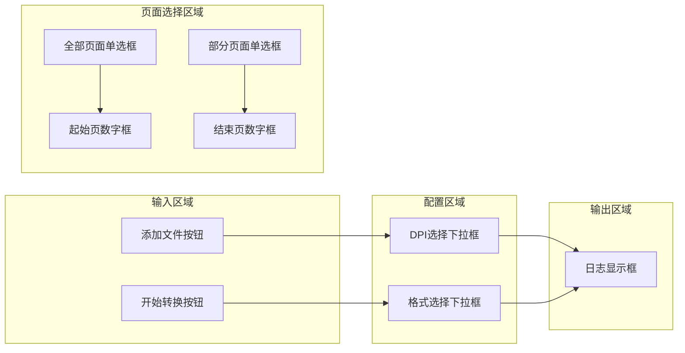
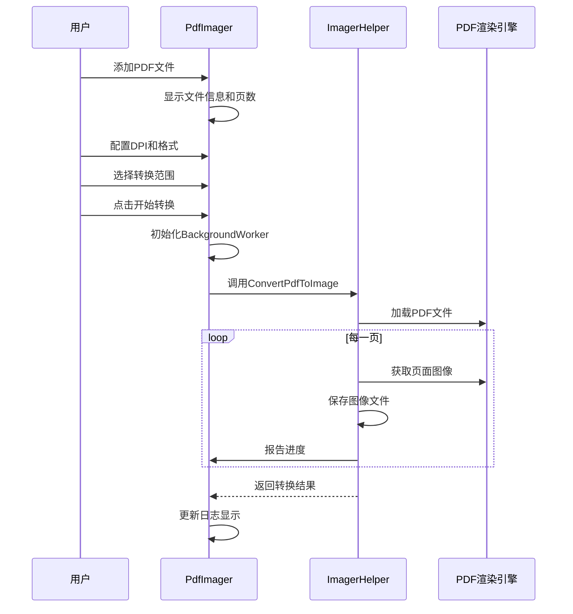
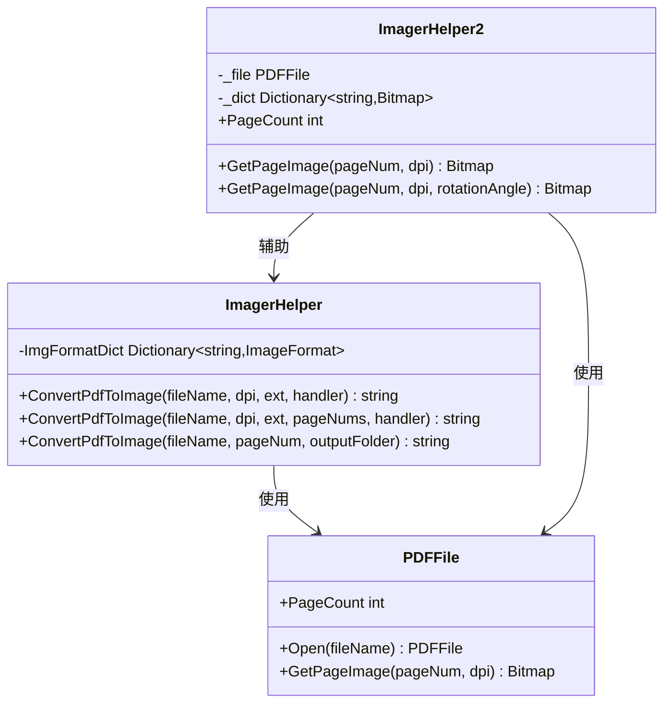
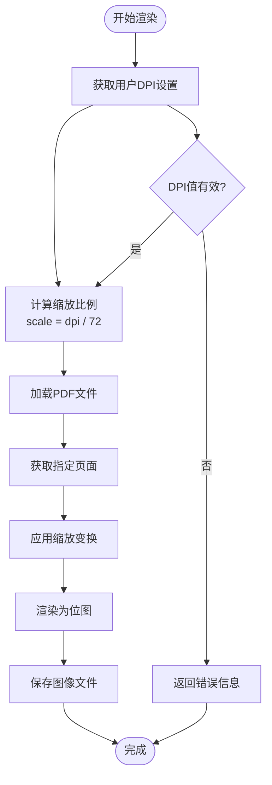
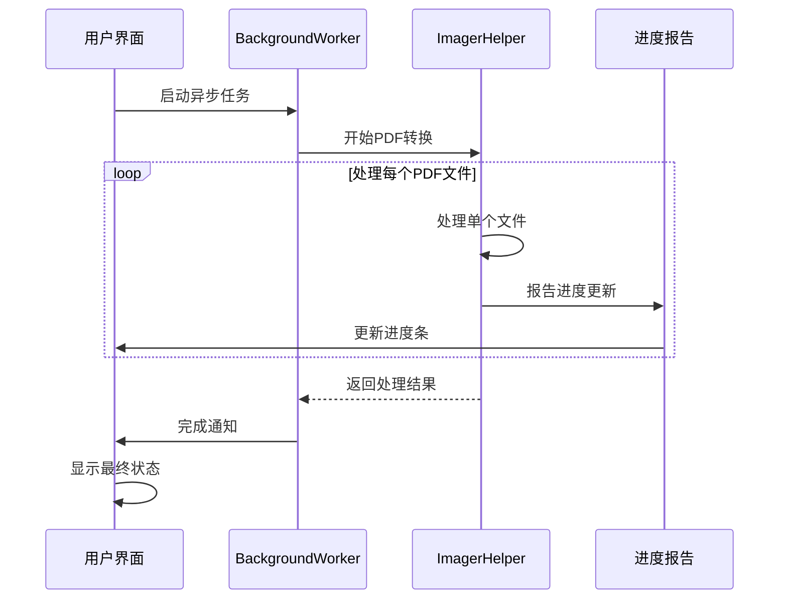

# PDF转图器功能实现文档

<cite>
**本文档引用的文件**
- [PdfImager.cs](file://PdfTool/PdfImager.cs)
- [ImagerHelper.cs](file://PdfHelperLibrary/ImagerHelper.cs)
- [PdfImager.Designer.cs](file://PdfTool/PdfImager.Designer.cs)
- [Config.cs](file://PdfTool/Config.cs)
- [Common.cs](file://PdfTool/Common.cs)
- [MainForm.cs](file://PdfTool/MainForm.cs)
- [ImageExtractHelper.cs](file://PdfHelperLibrary/ImageExtractHelper.cs)
- [PdfHelperLibrary.csproj](file://PdfHelperLibrary/PdfHelperLibrary.csproj)
</cite>

## 目录
1. [项目概述](#项目概述)
2. [系统架构](#系统架构)
3. [用户界面设计](#用户界面设计)
4. [核心功能实现](#核心功能实现)
5. [PDF渲染引擎](#pdf渲染引擎)
6. [性能优化策略](#性能优化策略)
7. [典型应用场景](#典型应用场景)
8. [故障排除指南](#故障排除指南)
9. [总结](#总结)

## 项目概述

PDF转图器是PdfTool项目中的核心模块，专门负责将PDF文档转换为高质量图像文件。该模块采用现代化的WinForms架构，集成了O2S.Components.PDFRender4NET渲染引擎，提供了直观的用户界面和强大的转换功能。

### 主要特性
- 支持多种图像格式（PNG、JPG、BMP等）
- 可配置的DPI设置范围（100-1200）
- 全页和部分页面转换模式
- 异步处理机制确保UI响应性
- 内存管理和资源优化

## 系统架构

PDF转图器采用分层架构设计，清晰分离了用户界面层、业务逻辑层和数据访问层。

**图表来源**
- [PdfImager.cs](file://PdfTool/PdfImager.cs#L1-L218)
- [ImagerHelper.cs](file://PdfHelperLibrary/ImagerHelper.cs#L1-L192)

**章节来源**
- [PdfImager.cs](file://PdfTool/PdfImager.cs#L1-L218)
- [ImagerHelper.cs](file://PdfHelperLibrary/ImagerHelper.cs#L1-L192)

## 用户界面设计

### 界面组件布局

PdfImager用户控件采用流式布局设计，主要包含以下核心组件：

**图表来源**
- [PdfImager.cs](file://PdfTool/PdfImager.cs#L105-L214)

### DPI设置配置

DPI（每英寸点数）设置直接影响输出图像的质量和文件大小：

| DPI值 | 分辨率等级 | 适用场景 | 文件大小 |
|-------|------------|----------|----------|
| 100 | 标准 | 屏幕显示、快速预览 | 最小 |
| 200 | 中等 | 打印、一般展示 | 较小 |
| 300 | 高清 | 精确展示、Web发布 | 中等 |
| 600 | 超高 | 专业出版、放大查看 | 较大 |
| 900 | 极高 | 科研、精密分析 | 很大 |
| 1200 | 最高 | 专业印刷、细节分析 | 最大 |

### 图像格式选择

系统支持多种主流图像格式，每种格式具有不同的特性和用途：

| 格式 | 扩展名 | 特点 | 适用场景 |
|------|--------|------|----------|
| PNG | .png | 无损压缩、支持透明度 | Web展示、图标制作 |
| JPEG | .jpg/.jpeg | 有损压缩、文件小 | 照片、网页图片 |
| BMP | .bmp | 无压缩、质量最高 | 原始图像处理 |
| GIF | .gif | 支持动画、色彩少 | 简单图形、动画 |
| TIFF | .tiff/.tif | 支持多页、高质量 | 专业出版 |
| EMF | .emf | 向量格式、可缩放 | 图形设计 |
| WMF | .wmf | 位图格式、兼容性好 | 通用存储 |

**章节来源**
- [PdfImager.cs](file://PdfTool/PdfImager.cs#L133-L155)

## 核心功能实现

### 用户交互逻辑

PdfImager类实现了完整的用户交互逻辑，通过事件驱动的方式处理用户操作：

**图表来源**
- [PdfImager.cs](file://PdfTool/PdfImager.cs#L49-L101)
- [ImagerHelper.cs](file://PdfHelperLibrary/ImagerHelper.cs#L36-L96)

### 页面范围选择机制

系统提供了灵活的页面选择机制，支持两种模式：

1. **全页转换模式**：自动处理PDF文档的所有页面
2. **部分页面转换模式**：允许用户指定具体的页面范围

页面验证逻辑确保用户输入的有效性：
- 起始页必须小于等于结束页
- 页面号不能超出PDF的实际页数范围
- 自动过滤无效的页面请求

**章节来源**
- [PdfImager.cs](file://PdfTool/PdfImager.cs#L63-L67)
- [ImagerHelper.cs](file://PdfHelperLibrary/ImagerHelper.cs#L70-L96)

## PDF渲染引擎

### O2S.Components.PDFRender4NET集成

ImagerHelper类深度集成了O2S.Components.PDFRender4NET渲染引擎，该引擎提供了高性能的PDF页面渲染能力：

**图表来源**
- [ImagerHelper.cs](file://PdfHelperLibrary/ImagerHelper.cs#L14-L192)
- [PdfHelperLibrary.csproj](file://PdfHelperLibrary/PdfHelperLibrary.csproj#L35-L37)

### 缩放比例计算

PDF渲染过程中的缩放比例计算是确保输出质量的关键环节：

**图表来源**
- [ImagerHelper.cs](file://PdfHelperLibrary/ImagerHelper.cs#L41-L53)

### 背景色处理

虽然当前实现主要关注图像内容的渲染，但系统架构为后续的背景色处理预留了扩展空间。GDI+框架提供了丰富的颜色处理能力，可以轻松实现：

- 白色背景填充
- 透明背景支持
- 自定义背景色
- 渐变背景效果

**章节来源**
- [ImagerHelper.cs](file://PdfHelperLibrary/ImagerHelper.cs#L16-L27)

## 性能优化策略

### 分页异步处理

为了确保用户界面的响应性，系统采用了BackgroundWorker异步处理机制：

**图表来源**
- [PdfImager.cs](file://PdfTool/PdfImager.cs#L67-L101)

### 内存释放策略

系统实现了多层次的内存管理策略：

1. **及时释放资源**：使用using语句确保资源的及时释放
2. **缓存管理**：ImagerHelper2类实现了智能缓存机制
3. **垃圾回收优化**：避免创建不必要的临时对象
4. **大文件处理**：对超大PDF文件采用流式处理

### 大尺寸PDF转换优化

针对大尺寸PDF文档的转换，系统采用了以下优化策略：

| 优化策略 | 实现方式 | 效果 |
|----------|----------|------|
| 流式处理 | 使用MemoryStream处理大文件 | 减少内存占用 |
| 分块渲染 | 将大页面分解为小块处理 | 提高稳定性 |
| 缓存机制 | ImagerHelper2的字典缓存 | 避免重复计算 |
| 异步处理 | BackgroundWorker并发处理 | 提升用户体验 |

**章节来源**
- [ImagerHelper.cs](file://PdfHelperLibrary/ImagerHelper.cs#L129-L191)

## 典型应用场景

### PDF演示文稿转换

**场景描述**：将PowerPoint PDF转换为高清图片用于网页展示

**配置建议**：
- DPI设置：300-600（根据展示分辨率调整）
- 图像格式：PNG（支持透明背景）
- 页面范围：全部页面或特定幻灯片

**预期效果**：
- 保持原始设计完整性
- 支持在线浏览和分享
- 便于嵌入到网站或博客

### 学术论文扫描件处理

**场景描述**：将学术论文PDF转换为图像用于OCR识别

**配置建议**：
- DPI设置：600+（确保文字清晰）
- 图像格式：PNG（无损压缩）
- 页面范围：全文或特定章节

**技术优势**：
- 高质量的文字识别基础
- 保留原始排版格式
- 便于后续文字提取

### 技术图纸数字化

**场景描述**：将技术图纸PDF转换为矢量图像

**配置建议**：
- DPI设置：1200（专业精度要求）
- 图像格式：TIFF（支持多页和高质量）
- 页面范围：单页或多页

**应用价值**：
- 便于CAD软件导入
- 支持进一步编辑和标注
- 便于归档和检索

## 故障排除指南

### 常见问题及解决方案

#### 字体渲染失真

**问题现象**：转换后的图像中文字显示不清晰或变形

**可能原因**：
- PDF中使用了特殊字体
- 渲染引擎字体映射问题
- DPI设置过低

**解决方案**：
1. 检查PDF文件的字体嵌入情况
2. 提高DPI设置（至少300）
3. 使用PNG格式获得更好的抗锯齿效果
4. 考虑使用专业的PDF阅读器预处理

#### 颜色偏差

**问题现象**：转换后图像的颜色与原PDF存在差异

**可能原因**：
- PDF的颜色配置文件
- 显示器校准问题
- 渲染引擎的颜色处理

**解决方案**：
1. 使用ICC颜色配置文件
2. 在不同设备上测试显示效果
3. 考虑使用Adobe Acrobat进行预处理
4. 检查系统的颜色管理设置

#### 性能瓶颈

**问题现象**：大文件转换速度慢或内存占用过高

**诊断步骤**：
1. 检查系统可用内存
2. 监控CPU使用率
3. 分析PDF文件复杂度

**优化方案**：
1. 分批处理大文件
2. 增加系统内存
3. 使用SSD存储提升I/O性能
4. 调整DPI设置平衡质量和性能

#### 内存泄漏

**问题现象**：长时间运行后程序内存占用持续增长

**排查方法**：
- 使用性能分析工具监控内存使用
- 检查是否有未释放的GDI+资源
- 验证异常处理是否完整

**修复措施**：
1. 确保所有Bitmap对象都正确释放
2. 使用using语句管理资源
3. 实现适当的垃圾回收触发
4. 考虑使用弱引用模式

**章节来源**
- [ImagerHelper.cs](file://PdfHelperLibrary/ImagerHelper.cs#L56-L59)
- [ImagerHelper.cs](file://PdfHelperLibrary/ImagerHelper.cs#L93-L96)

## 总结

PDF转图器作为PdfTool项目的核心组件，展现了现代.NET应用程序的设计精髓。通过精心设计的架构和优化的算法，它成功地解决了PDF文档向图像格式转换这一复杂任务。

### 技术亮点

1. **模块化设计**：清晰分离的UI层和业务逻辑层，便于维护和扩展
2. **异步处理**：确保用户界面的响应性，提升用户体验
3. **资源管理**：完善的内存管理和资源释放机制
4. **格式支持**：广泛的图像格式支持，满足不同应用场景需求
5. **性能优化**：多层次的性能优化策略，适应各种规模的PDF文件

### 应用价值

PDF转图器不仅是一个实用的工具，更是现代文档处理技术的典型代表。它在教育、出版、设计等多个领域都有广泛的应用前景，为数字化转型提供了强有力的技术支撑。

随着技术的不断发展，该模块还有很大的优化空间，如引入GPU加速、支持更多图像格式、增强AI辅助的图像优化等功能，将进一步提升其应用价值和技术竞争力。