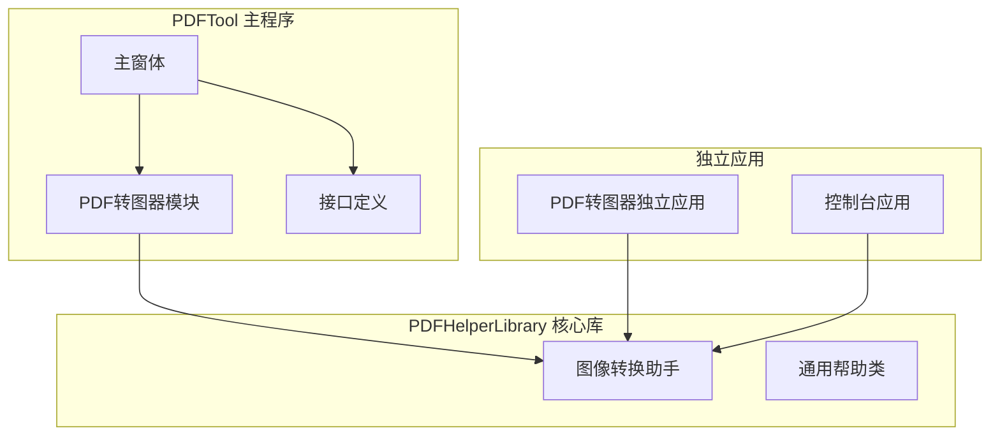
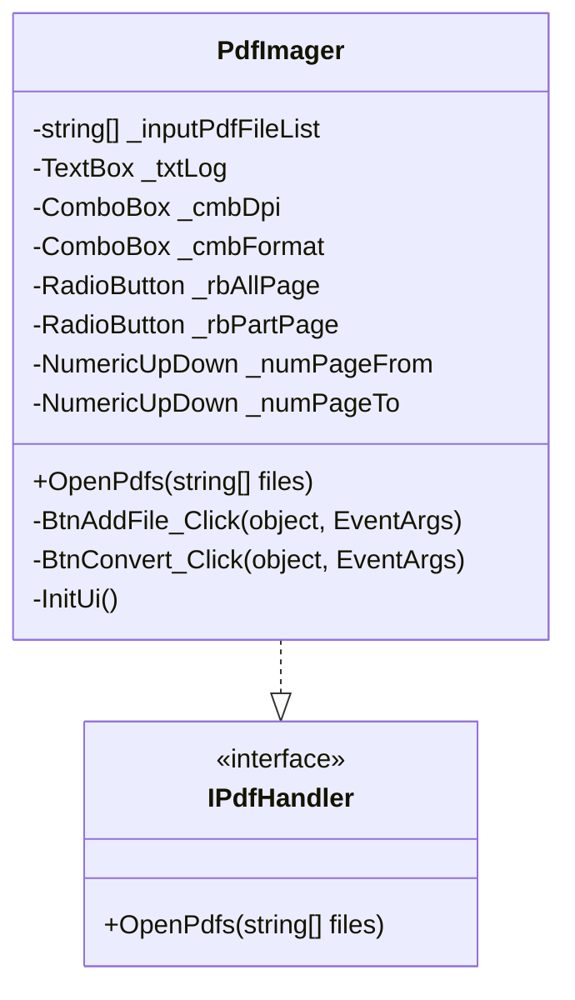
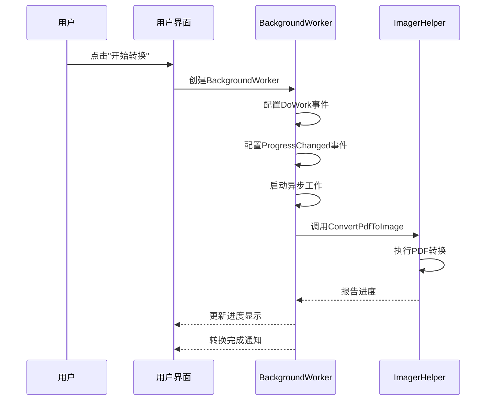
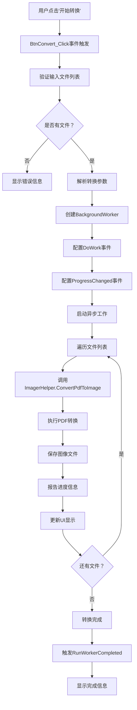

# PDF转图器使用示例

<cite>
**本文档中引用的文件**
- [ImagerHelper.cs](file://PdfHelperLibrary/ImagerHelper.cs)
- [PdfImager.cs](file://PdfTool/PdfImager.cs)
- [MainForm.cs](file://PdfImager/MainForm.cs)
- [MainForm.cs](file://PdfTool/MainForm.cs)
- [Common.cs](file://PdfTool/Common.cs)
- [CommonHelper.cs](file://PdfHelperLibrary/CommonHelper.cs)
- [Program.cs](file://PdfTool/Program.cs)
- [Program.cs](file://PdfConsoleApp/Program.cs)
</cite>

## 目录
1. [简介](#简介)
2. [项目结构概览](#项目结构概览)
3. [核心组件分析](#核心组件分析)
4. [典型使用场景](#典型使用场景)
5. [代码调用示例](#代码调用示例)
6. [核心调用链路](#核心调用链路)
7. [程序化调用示例](#程序化调用示例)
8. [异常处理建议](#异常处理建议)
9. [总结](#总结)

## 简介

PDF转图器是PDFTool项目中的一个核心功能模块，专门用于将PDF文档转换为图像文件。该模块提供了多种转换模式，包括全页转换、指定页码范围转换和单页转换，并支持多种图像格式输出。系统采用异步处理机制，确保大文件转换时不会阻塞用户界面。

## 项目结构概览

PDFTool项目采用模块化架构设计，主要包含以下核心组件：



**图表来源**
- [MainForm.cs](file://PdfTool/MainForm.cs#L1-L194)
- [PdfImager.cs](file://PdfTool/PdfImager.cs#L1-L218)
- [ImagerHelper.cs](file://PdfHelperLibrary/ImagerHelper.cs#L1-L192)

## 核心组件分析

### ImagerHelper 类

ImagerHelper是PDF转图器的核心静态类，提供了三种主要的转换方法：

#### 方法重载分析

| 方法签名 | 功能描述 | 参数说明 |
|---------|---------|---------|
| `ConvertPdfToImage(string, int, string, InfoHandler)` | 全页转换 | 输入文件路径、DPI、输出格式、进度回调 |
| `ConvertPdfToImage(string, int, string, List<int>, InfoHandler)` | 指定页转换 | 输入文件路径、DPI、输出格式、页码列表、进度回调 |
| `ConvertPdfToImage(string, int, string)` | 单页转换 | 输入文件路径、页码、输出目录 |

#### 支持的图像格式

系统支持多种图像格式输出：
- PNG (推荐高质量输出)
- JPEG/JPG (适合压缩率要求高的场景)
- BMP (无损位图格式)
- GIF (支持动画效果)
- TIFF/TIF (专业图像格式)
- EMF (矢量图形格式)
- WMF (Windows元文件格式)

**节来源**
- [ImagerHelper.cs](file://PdfHelperLibrary/ImagerHelper.cs#L13-L126)

### 用户界面组件

#### PdfImager 控制器

PdfImager作为Windows Forms的UserControl组件，实现了完整的图形界面交互：



**图表来源**
- [PdfImager.cs](file://PdfTool/PdfImager.cs#L13-L218)
- [Common.cs](file://PdfTool/Common.cs#L12-L15)

#### 异步处理机制

系统采用BackgroundWorker实现异步转换，避免UI线程阻塞：



**图表来源**
- [PdfImager.cs](file://PdfTool/PdfImager.cs#L56-L101)
- [MainForm.cs](file://PdfImager/MainForm.cs#L46-L76)

**节来源**
- [PdfImager.cs](file://PdfTool/PdfImager.cs#L56-L101)
- [MainForm.cs](file://PdfImager/MainForm.cs#L46-L76)

## 典型使用场景

### 场景一：通过图形界面添加PDF文件并执行全页转换

这是最常用的使用场景，适用于大多数用户需求：

#### 操作步骤
1. **添加PDF文件**：点击"添加文件"按钮，选择需要转换的PDF文件
2. **配置转换参数**：设置DPI质量和输出格式
3. **启动转换**：点击"开始转换"按钮，系统自动处理所有选中的文件

#### 界面元素说明
- **DPI选项**：100、200、300、600、900、1200，默认300
- **格式选项**：PNG、JPG、BMP等
- **进度显示**：实时显示转换进度和状态信息

### 场景二：指定页码范围进行部分转换

当只需要转换PDF的特定页面时使用：

#### 配置方法
1. 勾选"仅部分页面"选项
2. 设置起始页码和结束页码
3. 系统将只转换指定范围内的页面

#### 优势特点
- 节省转换时间和存储空间
- 提高处理效率
- 精确控制输出内容

### 场景三：单文件多页转换

对于需要批量处理多个PDF文件的场景：

#### 实现方式
系统支持多文件选择，每个文件会独立进行转换处理。

**节来源**
- [PdfImager.cs](file://PdfTool/PdfImager.cs#L44-L101)
- [MainForm.cs](file://PdfImager/MainForm.cs#L33-L43)

## 代码调用示例

### 图形界面操作示例

以下是通过图形界面操作的具体代码流程：

#### 添加文件事件处理
```csharp
private void BtnAddFile_Click(object sender, EventArgs e)
{
    var openDlg = new OpenFileDialog 
    { 
        Filter = "PDF文件(*.pdf)|*.pdf|所有文件(*.*)|*.*", 
        Multiselect = true 
    };
    if (openDlg.ShowDialog() != DialogResult.OK) return;
    
    OpenPdfs(openDlg.FileNames.ToList());
}
```

#### 开始转换事件处理
```csharp
private void BtnConvert_Click(object sender, EventArgs e)
{
    if (_inputPdfFileList.Count == 0)
    {
        _txtLog.Text = "未添加需要转换的PDF文件\r\n";
        return;
    }
    
    var dpi = int.Parse(_cmbDpi.Text);
    var format = _cmbFormat.Text;
    var allPage = _rbAllPage.Checked;
    var pageNums = allPage ? null : 
        Enumerable.Range((int)_numPageFrom.Value, 
        (int)_numPageTo.Value - (int)_numPageFrom.Value + 1).ToList();
    
    // 创建BackgroundWorker进行异步处理
    var background = new BackgroundWorker { WorkerReportsProgress = true };
    // ... 后续异步处理逻辑
}
```

**节来源**
- [PdfImager.cs](file://PdfTool/PdfImager.cs#L49-L101)
- [MainForm.cs](file://PdfImager/MainForm.cs#L33-L76)

### 控制台应用程序示例

控制台应用展示了如何在非GUI环境中使用PDF转图器：

#### 基本转换示例
```csharp
// 全页转换示例
var result = PdfHelperLibrary.ImagerHelper.ConvertPdfToImage(
    "input.pdf", 
    300,          // DPI质量
    "png",        // 输出格式
    info => Console.WriteLine(info)  // 进度回调
);

if (!string.IsNullOrEmpty(result))
{
    Console.WriteLine($"转换失败：{result}");
}
else
{
    Console.WriteLine("转换成功完成");
}
```

#### 指定页码转换示例
```csharp
// 指定页码转换
var pages = new List<int> { 1, 3, 5 };  // 转换第1、3、5页
var result = PdfHelperLibrary.ImagerHelper.ConvertPdfToImage(
    "input.pdf", 
    600,          // 高质量DPI
    "jpg",        // JPEG格式
    pages,        // 指定页码
    info => Console.WriteLine(info)
);
```

**节来源**
- [Program.cs](file://PdfConsoleApp/Program.cs#L1-L88)

## 核心调用链路

PDF转图器的完整调用链路展现了系统的异步处理架构：



**图表来源**
- [PdfImager.cs](file://PdfTool/PdfImager.cs#L56-L101)
- [MainForm.cs](file://PdfImager/MainForm.cs#L46-L76)

### 关键节点说明

1. **事件触发阶段**：用户界面响应用户操作
2. **参数验证阶段**：确保输入数据的有效性
3. **异步初始化阶段**：建立后台处理环境
4. **文件处理阶段**：逐个处理PDF文件
5. **转换执行阶段**：调用核心转换方法
6. **进度报告阶段**：实时更新用户界面
7. **完成通知阶段**：告知用户操作完成

**节来源**
- [PdfImager.cs](file://PdfTool/PdfImager.cs#L56-L101)
- [MainForm.cs](file://PdfImager/MainForm.cs#L46-L76)

## 程序化调用示例

### 在其他代码中直接引用ImagerHelper

#### 单文件转换示例
```csharp
using PdfHelperLibrary;

public class PdfConverter
{
    public static void ConvertSingleFile(string inputPath, string outputPath, int dpi = 300, string format = "png")
    {
        try
        {
            // 调用静态方法进行转换
            string result = ImagerHelper.ConvertPdfToImage(inputPath, dpi, format, 
                info => Console.WriteLine($"[INFO] {info}"));
                
            if (string.IsNullOrEmpty(result))
            {
                Console.WriteLine($"文件 {inputPath} 转换成功，输出到 {outputPath}");
            }
            else
            {
                Console.WriteLine($"文件 {inputPath} 转换失败：{result}");
            }
        }
        catch (Exception ex)
        {
            Console.WriteLine($"转换过程中发生异常：{ex.Message}");
        }
    }
}
```

#### 多文件批量转换示例
```csharp
public static void BatchConvertFiles(List<string> inputFiles, string outputDir, int dpi = 300, string format = "png")
{
    if (!Directory.Exists(outputDir))
    {
        Directory.CreateDirectory(outputDir);
    }
    
    foreach (var inputFile in inputFiles)
    {
        if (!File.Exists(inputFile))
        {
            Console.WriteLine($"文件不存在：{inputFile}");
            continue;
        }
        
        try
        {
            // 获取文件名但保留扩展名
            string fileName = Path.GetFileName(inputFile);
            string outputName = Path.GetFileNameWithoutExtension(inputFile);
            
            // 构建输出路径
            string outputPath = Path.Combine(outputDir, $"{outputName}.{format}");
            
            // 执行转换
            string result = ImagerHelper.ConvertPdfToImage(inputFile, dpi, format, 
                info => Console.WriteLine($"[{fileName}] {info}"));
                
            if (string.IsNullOrEmpty(result))
            {
                Console.WriteLine($"✓ {fileName} -> 成功");
            }
            else
            {
                Console.WriteLine($"✗ {fileName} -> 失败：{result}");
            }
        }
        catch (Exception ex)
        {
            Console.WriteLine($"✗ {Path.GetFileName(inputFile)} -> 异常：{ex.Message}");
        }
    }
}
```

#### 指定页码转换示例
```csharp
public static void ConvertSpecificPages(string inputFile, List<int> pageNumbers, int dpi = 300, string format = "png")
{
    try
    {
        // 调用指定页码转换方法
        string result = ImagerHelper.ConvertPdfToImage(inputFile, dpi, format, pageNumbers,
            info => Console.WriteLine($"[PAGE] {info}"));
            
        if (string.IsNullOrEmpty(result))
        {
            Console.WriteLine($"指定页面转换成功");
        }
        else
        {
            Console.WriteLine($"转换失败：{result}");
        }
    }
    catch (Exception ex)
    {
        Console.WriteLine($"指定页面转换异常：{ex.Message}");
    }
}
```

### 高级使用模式

#### 自定义进度处理
```csharp
public class ProgressTracker
{
    private readonly Dictionary<string, int> _progressMap = new();
    
    public void TrackConversion(string fileName)
    {
        _progressMap[fileName] = 0;
        Console.WriteLine($"开始处理文件：{fileName}");
    }
    
    public void UpdateProgress(string fileName, int progress)
    {
        if (_progressMap.ContainsKey(fileName))
        {
            _progressMap[fileName] = progress;
            Console.WriteLine($"文件 {fileName} 进度：{progress}%");
        }
    }
    
    public void CompleteFile(string fileName)
    {
        if (_progressMap.ContainsKey(fileName))
        {
            Console.WriteLine($"文件 {fileName} 处理完成");
            _progressMap.Remove(fileName);
        }
    }
}

// 使用示例
var tracker = new ProgressTracker();
var result = ImagerHelper.ConvertPdfToImage(
    "large_document.pdf",
    600,
    "png",
    info => tracker.UpdateProgress("large_document.pdf", CalculateProgress(info))
);
```

**节来源**
- [ImagerHelper.cs](file://PdfHelperLibrary/ImagerHelper.cs#L36-L96)
- [Program.cs](file://PdfConsoleApp/Program.cs#L71-L87)

## 异常处理建议

### 常见异常类型及处理策略

#### 文件访问异常
```csharp
try
{
    // 尝试打开PDF文件
    using (var file = PDFFile.Open(inputFilePath))
    {
        // 执行转换操作
    }
}
catch (FileNotFoundException)
{
    Console.WriteLine("指定的PDF文件不存在");
    return "文件未找到";
}
catch (UnauthorizedAccessException)
{
    Console.WriteLine("没有权限访问该文件");
    return "访问被拒绝";
}
```

#### 内存不足异常
```csharp
try
{
    // 大文件转换可能需要大量内存
    var result = ImagerHelper.ConvertPdfToImage(inputFile, dpi, format, handler);
    return result;
}
catch (OutOfMemoryException)
{
    Console.WriteLine("内存不足，请尝试降低DPI或分批处理");
    // 可以提示用户降低DPI设置
    return "内存不足";
}
catch (InsufficientMemoryException)
{
    Console.WriteLine("系统内存不足，建议关闭其他程序后重试");
    return "系统内存不足";
}
```

#### PDF格式异常
```csharp
try
{
    // 获取页面数量前先验证PDF有效性
    int pageCount = CommonHelper.GetPageCount(inputFile);
    Console.WriteLine($"PDF包含 {pageCount} 页");
    
    // 执行转换
    var result = ImagerHelper.ConvertPdfToImage(inputFile, dpi, format, handler);
    return result;
}
catch (PdfReaderException ex)
{
    Console.WriteLine($"PDF文件格式不正确：{ex.Message}");
    return $"PDF格式错误：{ex.Message}";
}
catch (Exception ex)
{
    Console.WriteLine($"未知错误：{ex.Message}");
    return $"转换失败：{ex.Message}";
}
```

### 异常处理最佳实践

#### 分层异常处理
```csharp
public class SafePdfConverter
{
    public static ConversionResult SafeConvert(string inputFile, int dpi, string format)
    {
        try
        {
            // 第一层：文件存在性检查
            if (!File.Exists(inputFile))
            {
                return new ConversionResult(false, "文件不存在");
            }
            
            // 第二层：权限检查
            if (!IsFileAccessible(inputFile))
            {
                return new ConversionResult(false, "文件不可访问");
            }
            
            // 第三层：PDF有效性检查
            int pageCount;
            try
            {
                pageCount = CommonHelper.GetPageCount(inputFile);
            }
            catch (Exception ex)
            {
                return new ConversionResult(false, $"PDF格式错误：{ex.Message}");
            }
            
            // 第四层：实际转换
            var result = ImagerHelper.ConvertPdfToImage(inputFile, dpi, format, 
                info => Console.WriteLine($"[INFO] {info}"));
                
            return new ConversionResult(string.IsNullOrEmpty(result), result);
        }
        catch (Exception ex)
        {
            // 最终异常捕获
            return new ConversionResult(false, $"严重错误：{ex.Message}");
        }
    }
    
    private static bool IsFileAccessible(string filePath)
    {
        try
        {
            using (FileStream fs = File.Open(filePath, FileMode.Open, FileAccess.Read))
            {
                return true;
            }
        }
        catch
        {
            return false;
        }
    }
}

public class ConversionResult
{
    public bool Success { get; }
    public string Message { get; }
    
    public ConversionResult(bool success, string message)
    {
        Success = success;
        Message = message;
    }
}
```

#### 日志记录策略
```csharp
public class LoggingPdfConverter
{
    private static readonly ILogger Logger = LoggerFactory.CreateLogger<LoggingPdfConverter>();
    
    public static async Task<ConversionResult> LoggableConvertAsync(string inputFile, int dpi, string format)
    {
        var stopwatch = Stopwatch.StartNew();
        var logEntry = new ConversionLog
        {
            InputFile = inputFile,
            StartTime = DateTime.UtcNow,
            Dpi = dpi,
            Format = format
        };
        
        try
        {
            Logger.LogInformation("开始转换文件：{InputFile}", inputFile);
            
            var result = await Task.Run(() => 
                ImagerHelper.ConvertPdfToImage(inputFile, dpi, format, 
                    info => Logger.LogInformation("{InputFile}: {Message}", inputFile, info)));
                    
            stopwatch.Stop();
            logEntry.Duration = stopwatch.Elapsed;
            logEntry.Success = string.IsNullOrEmpty(result);
            logEntry.ErrorMessage = result;
            
            Logger.LogInformation("转换完成，耗时：{Duration}", logEntry.Duration);
            return new ConversionResult(logEntry.Success, logEntry.ErrorMessage);
        }
        catch (Exception ex)
        {
            stopwatch.Stop();
            logEntry.Duration = stopwatch.Elapsed;
            logEntry.Success = false;
            logEntry.ErrorMessage = ex.Message;
            
            Logger.LogError(ex, "转换文件时发生异常：{InputFile}", inputFile);
            return new ConversionResult(false, $"转换失败：{ex.Message}");
        }
        finally
        {
            // 记录转换日志
            SaveConversionLog(logEntry);
        }
    }
}
```

**节来源**
- [ImagerHelper.cs](file://PdfHelperLibrary/ImagerHelper.cs#L56-L96)
- [CommonHelper.cs](file://PdfHelperLibrary/CommonHelper.cs#L10-L28)

## 总结

PDF转图器作为PDFTool项目的核心功能模块，提供了完整而灵活的PDF图像转换解决方案。通过本文档的详细分析，我们可以看到：

### 主要特性总结

1. **多模式转换支持**：全页转换、指定页码转换、单页转换满足不同需求
2. **丰富的输出格式**：支持PNG、JPEG、BMP等多种图像格式
3. **异步处理机制**：采用BackgroundWorker确保UI响应性
4. **灵活的编程接口**：提供静态方法和面向对象两种使用方式
5. **完善的异常处理**：多层次的异常捕获和处理机制

### 使用建议

1. **性能优化**：对于大文件转换，建议使用较低的DPI值（如150-300）
2. **内存管理**：大批量转换时注意监控内存使用情况
3. **格式选择**：PNG格式适合高质量需求，JPEG适合存储空间敏感场景
4. **错误处理**：始终检查返回结果，妥善处理异常情况

### 扩展方向

该PDF转图器模块具有良好的扩展性，可以进一步增强功能：
- 支持更多图像格式（WebP、HEIF等）
- 添加图像后处理功能（裁剪、调整大小等）
- 实现并行处理以提高转换速度
- 提供Web API接口支持远程调用

通过合理使用这些功能和遵循最佳实践，开发者可以构建出高效、稳定的PDF图像转换应用程序。