# 故障排除

<cite>
**本文档中引用的文件**
- [ImagerHelper.cs](file://PdfHelperLibrary/ImagerHelper.cs)
- [ImageExtractHelper.cs](file://PdfHelperLibrary/ImageExtractHelper.cs)
- [CommonHelper.cs](file://PdfHelperLibrary/CommonHelper.cs)
- [PdfImager.cs](file://PdfTool/PdfImager.cs)
- [PdfHelperLibrary.csproj](file://PdfHelperLibrary/PdfHelperLibrary.csproj)
</cite>

## 目录
1. [概述](#概述)
2. [常见问题类型](#常见问题类型)
3. [字体渲染问题](#字体渲染问题)
4. [颜色偏差问题](#颜色偏差问题)
5. [大文件转换问题](#大文件转换问题)
6. [特定PDF无法打开](#特定pdf无法打开)
7. [O2S.Components.PDFRender4NET兼容性问题](#o2scomponentspdfrender4net兼容性问题)
8. [高DPI性能瓶颈](#高dpi性能瓶颈)
9. [内存管理优化](#内存管理优化)
10. [错误处理机制](#错误处理机制)
11. [日志输出与问题定位](#日志输出与问题定位)
12. [解决方案与最佳实践](#解决方案与最佳实践)

## 概述

PDF转图器是基于O2S.Components.PDFRender4NET库构建的核心组件，负责将PDF文档转换为图像格式。该系统在处理过程中可能遇到多种技术挑战，包括字体渲染失真、颜色偏差、内存溢出、性能瓶颈等问题。本文档系统性地分析这些问题的成因，并提供相应的解决方案。

## 常见问题类型

### 字体渲染失真
- **问题表现**：转换后的图像中文字显示模糊、变形或缺失
- **常见场景**：包含复杂字体、特殊字符集或嵌入字体的PDF文档
- **影响因素**：字体嵌入完整性、渲染引擎限制

### 颜色偏差
- **问题表现**：图像颜色与原始PDF存在明显差异
- **常见场景**：专业印刷文档、彩色图表、渐变效果
- **影响因素**：色彩空间转换、DPI设置不当

### 内存溢出
- **问题表现**：大文件转换时出现OutOfMemoryException
- **常见场景**：高分辨率PDF、多页文档、复杂图形
- **影响因素**：内存分配策略、Bitmap对象生命周期

### 性能瓶颈
- **问题表现**：转换速度缓慢、界面卡顿
- **常见场景**：批量处理、高DPI设置
- **影响因素**：同步处理模式、资源回收不及时

## 字体渲染问题

### 问题分析

字体渲染失真是PDF转图过程中的常见问题，主要源于以下原因：

1. **字体嵌入完整性**：某些PDF文档可能只嵌入了部分字符子集
2. **渲染引擎限制**：O2S.Components.PDFRender4NET对某些字体格式支持有限
3. **字符编码问题**：Unicode字符映射不准确

### 解决方案

#### 1. 字体预处理
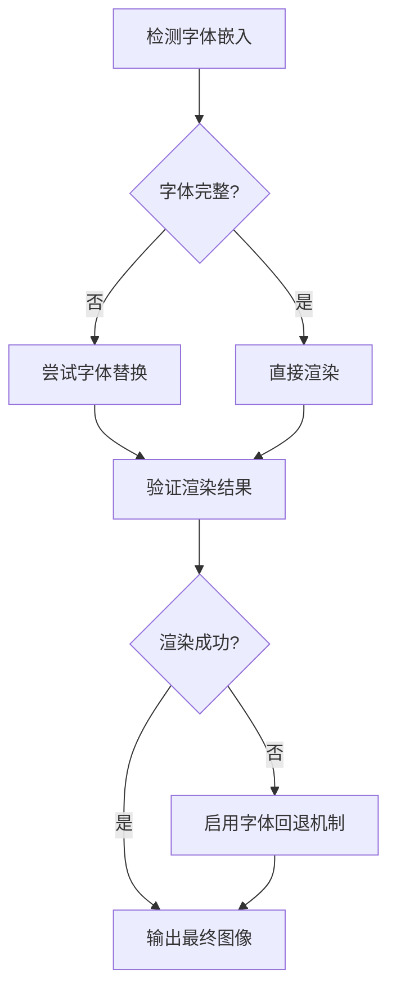

#### 2. 渲染参数优化
- **抗锯齿设置**：启用高质量渲染
- **字体缓存**：预加载常用字体
- **字符映射表**：建立自定义字符映射

### 最佳实践
- 在转换前检查PDF字体嵌入状态
- 为特殊字体准备备用字体文件
- 实施字体渲染质量评估机制

## 颜色偏差问题

### 问题分析

颜色偏差通常由以下因素引起：

1. **色彩空间转换**：PDF原生色彩空间与RGB转换损失
2. **伽马校正**：不同设备间的伽马值差异
3. **DPI设置影响**：高DPI下颜色采样精度下降

### 解决方案

#### 1. 色彩管理流程

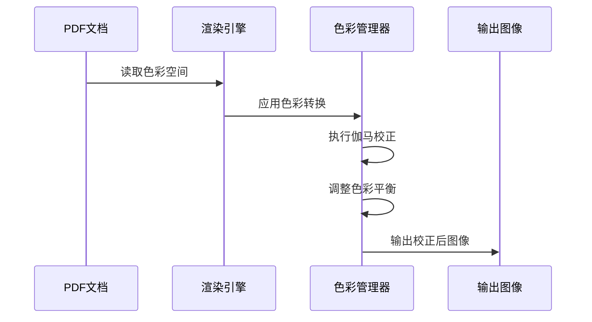

#### 2. 配置建议
- 使用sRGB色彩空间作为标准输出
- 启用ICC色彩配置文件支持
- 实施色彩空间自动检测

### 实施要点
- 建立色彩测试基准
- 提供色彩校正选项
- 记录色彩转换日志

## 大文件转换问题

### 问题分析

大文件转换内存溢出的根本原因是：

1. **Bitmap内存占用**：每个页面的Bitmap对象占用大量内存
2. **同步处理模式**：一次性加载所有页面
3. **垃圾回收延迟**：及时释放资源的机制不足

### 内存使用模型

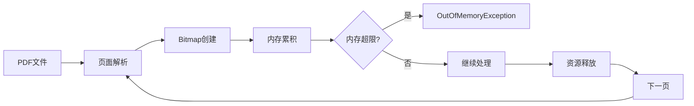

### 解决方案

#### 1. 分页异步处理
实现页面级别的异步处理，避免同时加载多个页面：

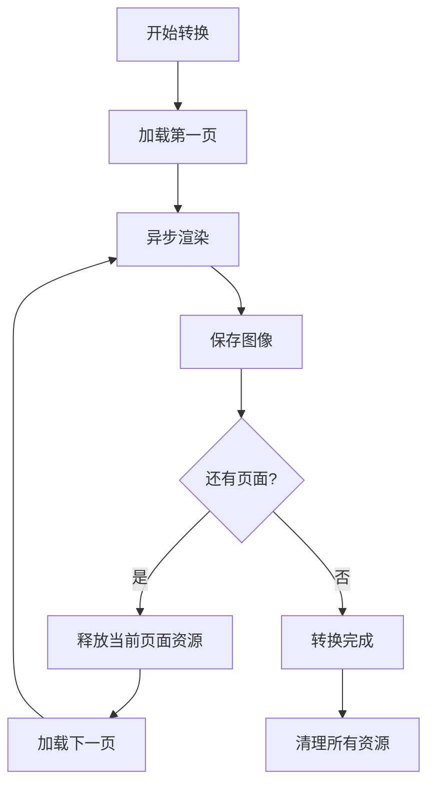

#### 2. 内存监控机制
- 实施动态内存阈值控制
- 监控GC压力指标
- 自动触发强制垃圾回收

### 性能优化策略
- 实现页面预加载队列
- 采用流式处理模式
- 优化Bitmap像素格式选择

## 特定PDF无法打开

### 问题诊断流程

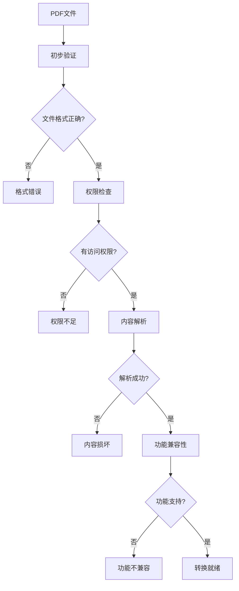

### 常见原因分析

| 问题类型 | 具体表现 | 可能原因 | 解决方案 |
|---------|---------|---------|---------|
| 文件损坏 | 打开时崩溃 | 文件头损坏、数据丢失 | 文件完整性检查、备份恢复 |
| 权限限制 | 无法读取内容 | 密码保护、数字签名 | 权限验证、密码处理 |
| 格式异常 | 解析失败 | 不规范的PDF结构 | 格式标准化、兼容性适配 |
| 功能不支持 | 特殊功能失效 | 新版PDF特性、专有格式 | 功能降级、替代方案 |

### 错误处理策略
- 实施多层次验证机制
- 提供详细的错误信息
- 建立问题报告系统

## O2S.Components.PDFRender4NET兼容性问题

### 库版本分析

当前项目使用的是O2S.Components.PDFRender4NET v4.7.3.0版本，可能存在以下兼容性限制：

1. **PDF版本支持**：对最新PDF标准的支持程度
2. **字体格式兼容性**：对新型字体格式的支持
3. **加密文档处理**：对高级加密算法的支持
4. **图形渲染能力**：对复杂矢量图形的处理

### 兼容性检测机制

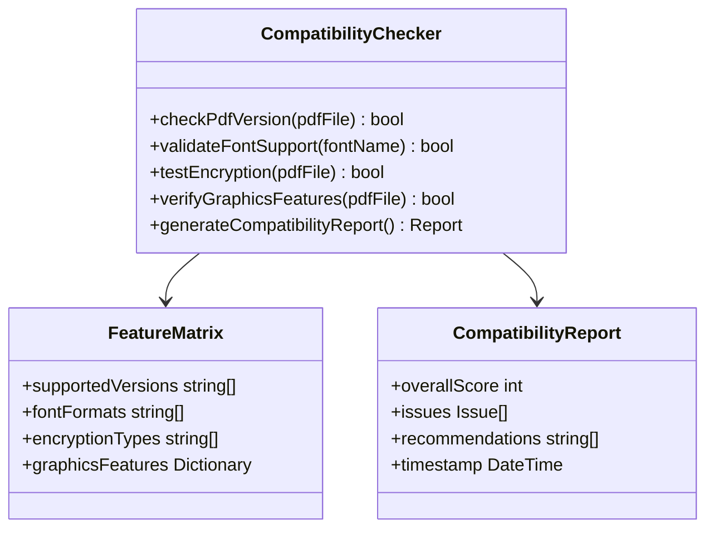

### 升级建议
- 定期检查新版本发布
- 测试关键功能兼容性
- 制定平滑迁移计划

## 高DPI性能瓶颈

### DPI设置对性能的影响

高DPI设置虽然提高图像质量，但显著增加计算和内存需求：

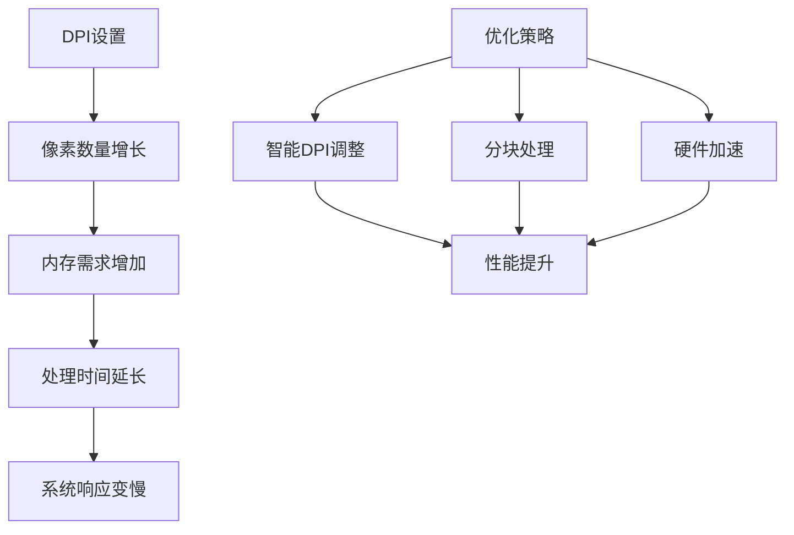

### 性能优化策略

#### 1. 动态DPI调整
根据文档复杂度自动调整DPI设置：
- 简单文本：150-300 DPI
- 混合内容：300-600 DPI  
- 复杂图形：600+ DPI

#### 2. 分块处理技术
将大页面分割为小块进行并行处理：


#### 3. 缓存机制
实施多层缓存策略：
- 页面级缓存：避免重复渲染
- 字符级缓存：重用字体字形
- 图形级缓存：缓存复杂图形元素

### 性能监控指标
- 处理时间 vs DPI关系曲线
- 内存使用峰值记录
- CPU利用率变化趋势

## 内存管理优化

### 资源生命周期管理

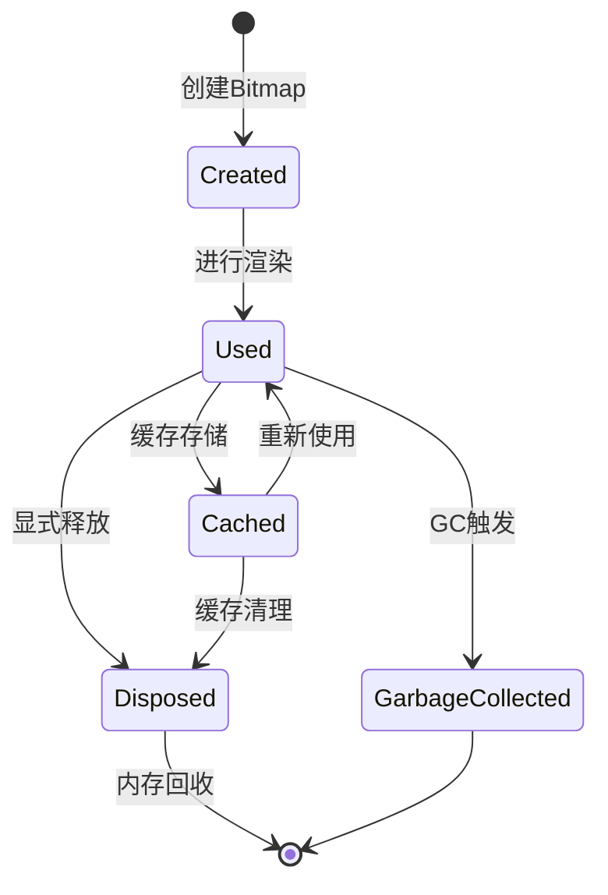

### 优化策略

#### 1. 及时释放机制
确保Bitmap对象在使用后立即释放：

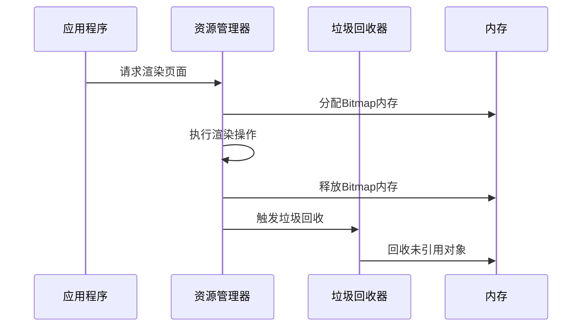

#### 2. 内存池管理
实现Bitmap对象池，减少频繁的内存分配：

| 组件 | 功能 | 配置参数 |
|------|------|---------|
| 对象池 | 管理Bitmap实例 | 最大容量、空闲超时 |
| 内存监控 | 跟踪内存使用 | 阈值设置、告警机制 |
| 自动清理 | 定期清理无用对象 | 清理频率、优先级 |

#### 3. 弱引用策略
对于缓存的Bitmap对象使用弱引用：
- 避免阻止垃圾回收
- 在内存紧张时自动释放
- 保持缓存的智能性

### 内存泄漏预防

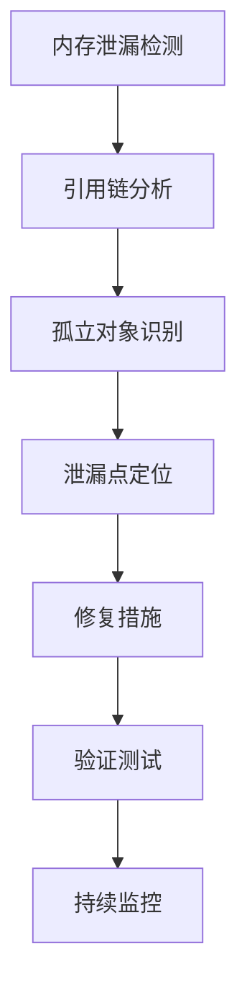

## 错误处理机制

### Try-Catch结构分析

ImagerHelper.cs中的ConvertPdfToImage方法采用了统一的异常处理模式：

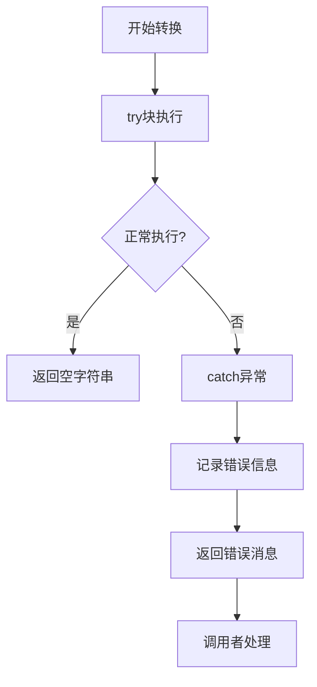

### 异常分类处理

| 异常类型 | 处理策略 | 用户反馈 |
|---------|---------|---------|
| IOException | 文件访问错误 | "文件访问失败，请检查权限" |
| OutOfMemoryException | 内存不足 | "内存不足，请降低DPI或分批处理" |
| ArgumentException | 参数无效 | "参数错误，请检查输入值" |
| Exception | 通用异常 | "转换失败，详情请查看日志" |

### 错误恢复机制

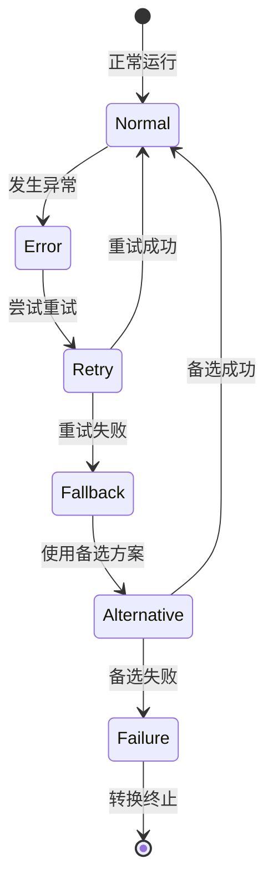

### 日志记录策略
- 结构化日志格式
- 分级日志输出
- 性能指标跟踪

## 日志输出与问题定位

### 日志系统架构

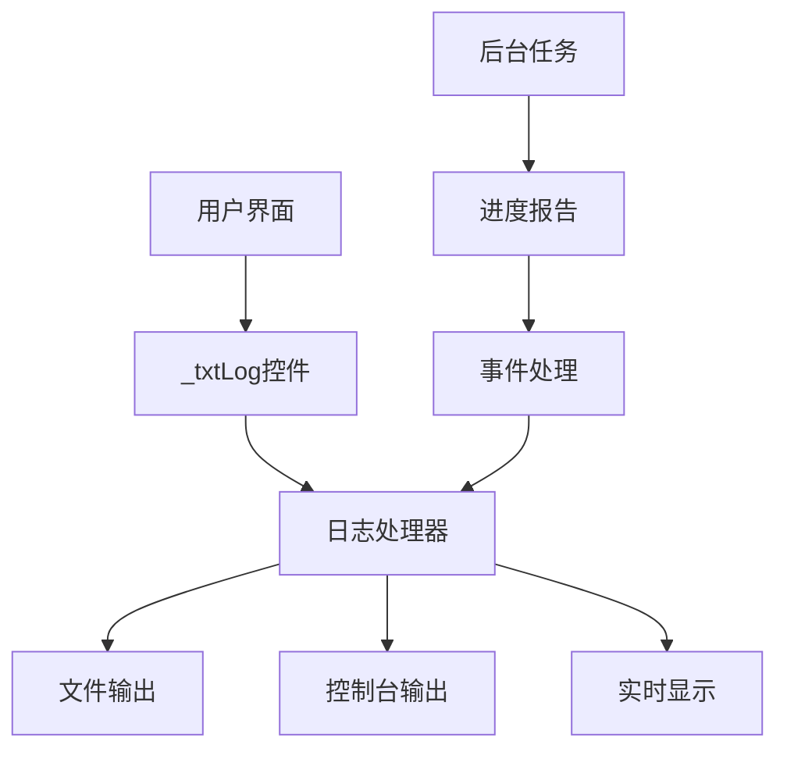

### 日志内容结构

#### 1. 基础信息
- 时间戳：精确到毫秒
- 操作类型：转换、提取、修复等
- 文件路径：完整文件路径
- 参数信息：DPI、格式、页码范围

#### 2. 进度跟踪
- 当前处理状态
- 已完成页面计数
- 预估剩余时间
- 错误发生位置

#### 3. 错误详情
- 异常类型
- 错误消息
- 堆栈跟踪
- 相关上下文

### 问题定位指南

#### 1. 日志分析流程

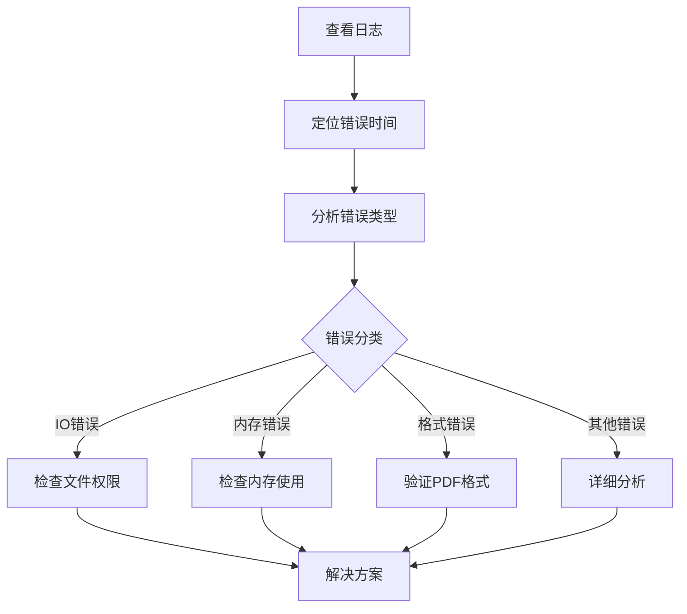

#### 2. 常见错误模式

| 错误模式 | 日志特征 | 解决方案 |
|---------|---------|---------|
| 文件访问失败 | "Access to the path denied" | 检查文件权限、关闭防病毒软件 |
| 内存不足 | "OutOfMemoryException" | 降低DPI、分批处理 |
| 字体缺失 | "Font not found" | 安装缺失字体、使用系统字体 |
| PDF格式错误 | "Invalid PDF structure" | 使用PDF修复工具 |

#### 3. 调试技巧
- 启用详细日志模式
- 使用日志过滤功能
- 结合性能监控工具
- 建立问题重现步骤

### 实时监控

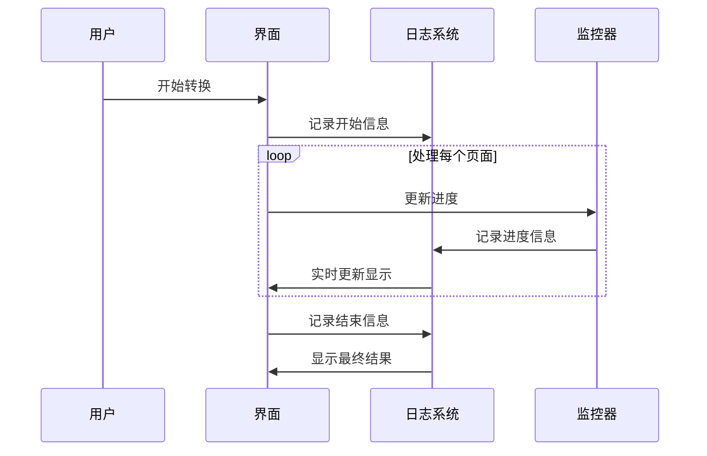

## 解决方案与最佳实践

### 综合优化策略

#### 1. 性能优化清单

```mermaid
mindmap
root((性能优化))
内存管理
及时释放资源
使用对象池
监控内存使用
并发处理
异步处理
分页加载
流式处理
缓存策略
页面缓存
字体缓存
图形缓存
配置优化
DPI设置
图像格式
并发度
```

#### 2. 实施步骤

##### 第一阶段：基础优化
1. 实施分页异步处理
2. 添加内存监控机制
3. 优化资源释放逻辑

##### 第二阶段：高级优化
1. 实现智能DPI调整
2. 添加缓存机制
3. 优化并发处理

##### 第三阶段：全面优化
1. 实施性能基准测试
2. 建立监控体系
3. 持续优化改进

#### 3. 配置建议

| 场景 | DPI设置 | 并发度 | 缓存策略 |
|------|---------|--------|---------|
| 快速预览 | 150-200 | 2-4 | 页面缓存 |
| 标准质量 | 300-600 | 4-8 | 字体+图形缓存 |
| 高质量输出 | 600+ | 2-4 | 全量缓存 |
| 批量处理 | 200-300 | 8-16 | 无缓存 |

### 用户指导手册

#### 1. 常见问题自助解决

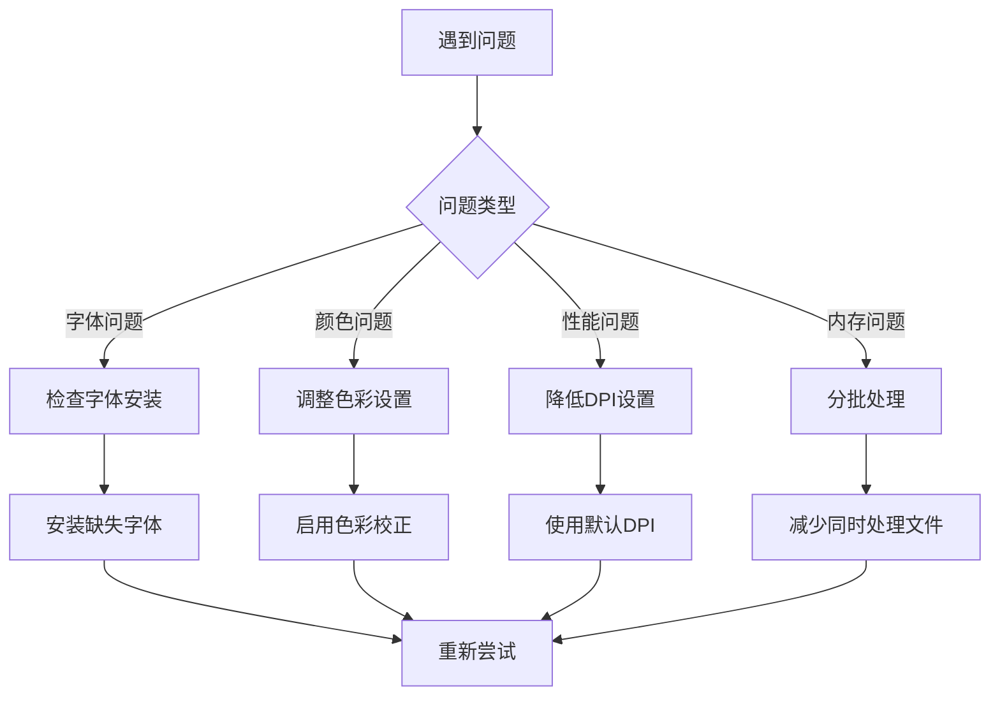

#### 2. 性能调优指南

##### 内存优化
- 根据可用内存调整并发度
- 定期清理临时文件
- 监控内存使用趋势

##### 处理速度优化
- 选择合适的图像格式
- 避免不必要的色彩转换
- 使用SSD存储提高I/O性能

##### 质量平衡
- 根据用途选择DPI设置
- 平衡文件大小与质量
- 考虑输出设备特性

### 故障排除检查清单

#### 转换前检查
- [ ] PDF文件完整性验证
- [ ] 系统内存充足
- [ ] 字体安装完整
- [ ] 输出目录权限正常

#### 转换中监控
- [ ] 实时内存使用情况
- [ ] 处理进度跟踪
- [ ] 错误信息记录
- [ ] 性能指标监控

#### 转换后验证
- [ ] 输出文件质量检查
- [ ] 文件完整性验证
- [ ] 性能统计分析
- [ ] 用户反馈收集

### 技术支持流程


通过系统性的故障排除方法和持续的优化改进，可以显著提升PDF转图器的稳定性和用户体验。建议定期更新系统配置，监控性能指标，并根据用户反馈不断优化解决方案。