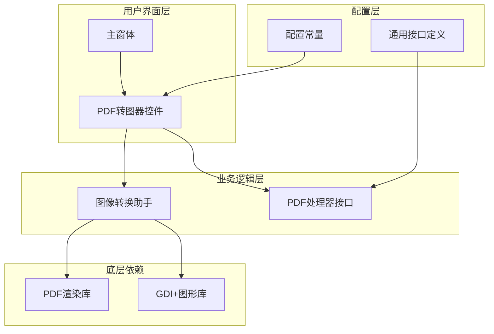
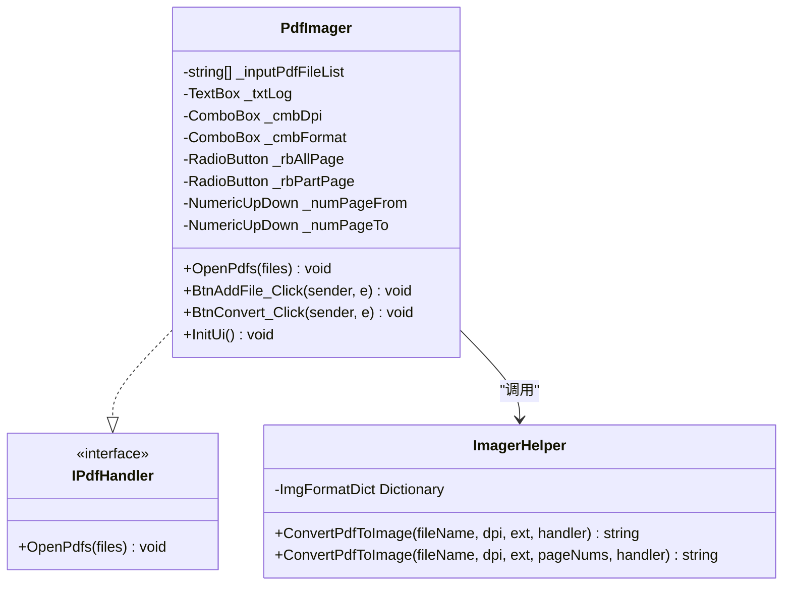
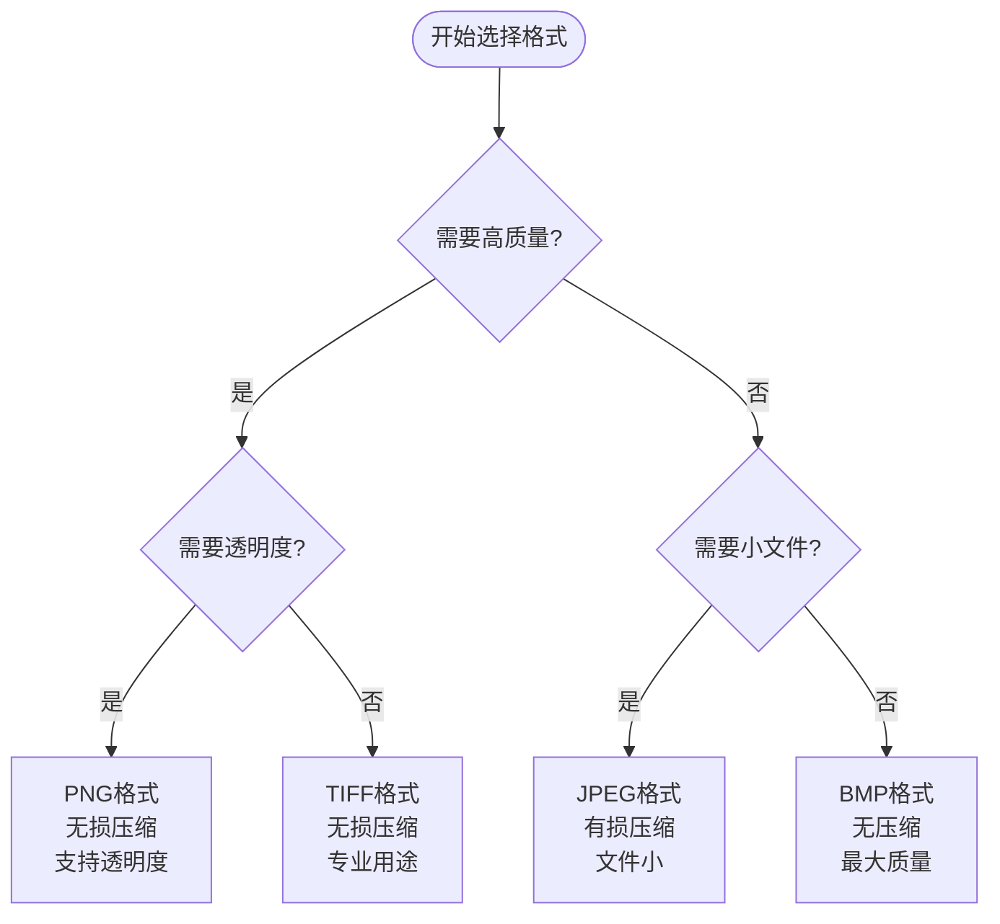
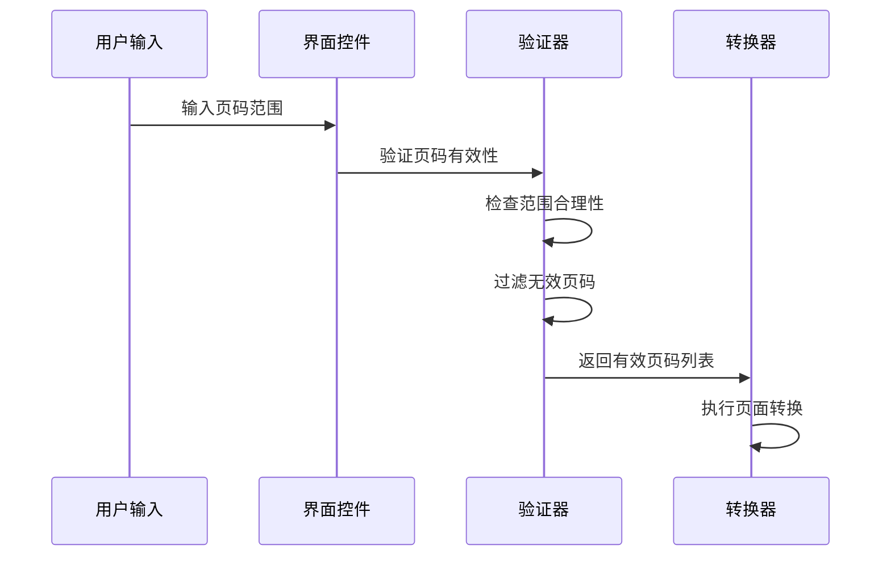
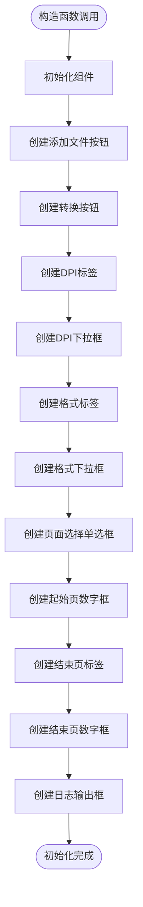
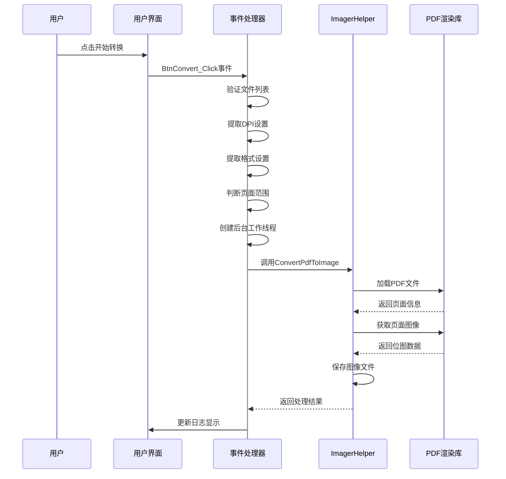
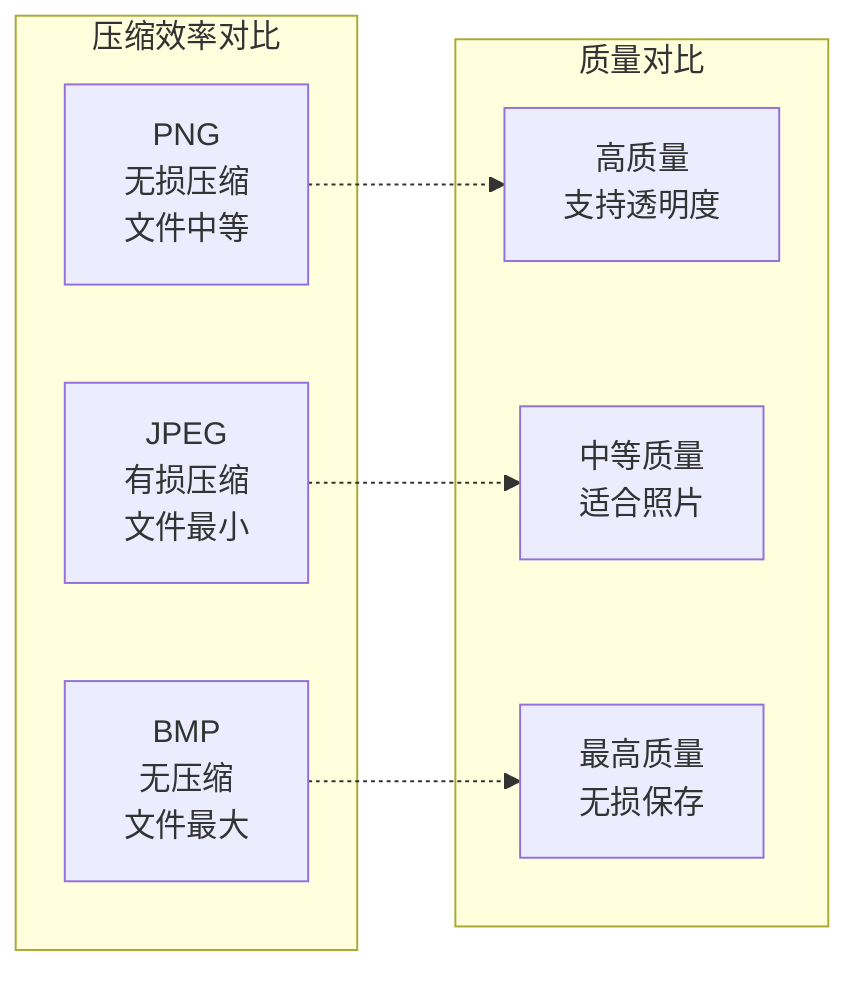
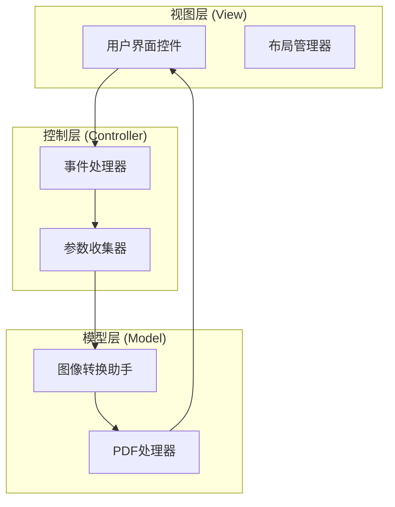
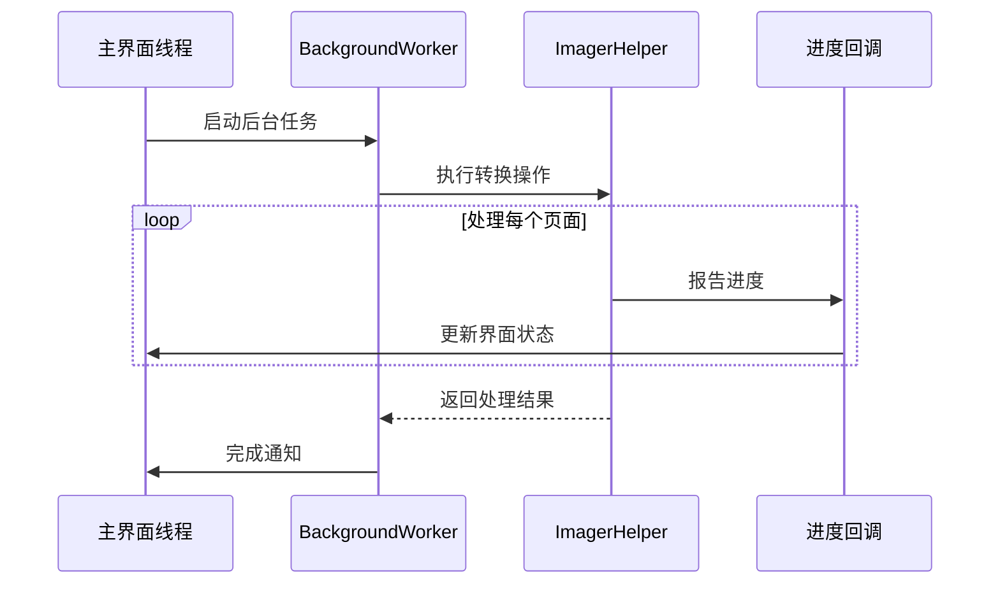

# PDF转图器用户界面配置说明

<cite>
**本文档中引用的文件**
- [PdfImager.cs](file://PdfTool/PdfImager.cs)
- [PdfImager.Designer.cs](file://PdfTool/PdfImager.Designer.cs)
- [ImagerHelper.cs](file://PdfHelperLibrary/ImagerHelper.cs)
- [Config.cs](file://PdfTool/Config.cs)
- [Common.cs](file://PdfTool/Common.cs)
- [MainForm.cs](file://PdfTool/MainForm.cs)
</cite>

## 目录
1. [简介](#简介)
2. [项目结构概述](#项目结构概述)
3. [核心组件分析](#核心组件分析)
4. [用户界面配置项详解](#用户界面配置项详解)
5. [UI初始化流程](#ui初始化流程)
6. [参数传递机制](#参数传递机制)
7. [配置项对输出质量的影响](#配置项对输出质量的影响)
8. [架构设计模式](#架构设计模式)
9. [性能考虑](#性能考虑)
10. [故障排除指南](#故障排除指南)
11. [总结](#总结)

## 简介

PDF转图器是PDF工具套件中的核心功能模块，专门负责将PDF文档转换为各种图像格式。该模块提供了灵活的配置选项，允许用户自定义输出图像的质量、格式和页面范围，满足不同场景下的图像处理需求。

## 项目结构概述

PDF转图器采用模块化架构设计，主要包含以下关键组件：

**图表来源**
- [MainForm.cs](file://PdfTool/MainForm.cs#L128-L163)
- [PdfImager.cs](file://PdfTool/PdfImager.cs#L12-L14)
- [ImagerHelper.cs](file://PdfHelperLibrary/ImagerHelper.cs#L14-L127)

**章节来源**
- [MainForm.cs](file://PdfTool/MainForm.cs#L128-L163)
- [PdfImager.cs](file://PdfTool/PdfImager.cs#L12-L14)

## 核心组件分析

### PdfImager 控制器

PdfImager 是PDF转图器的主要用户界面控制器，实现了IPdfHandler接口，负责管理用户交互和参数收集。

**图表来源**
- [PdfImager.cs](file://PdfTool/PdfImager.cs#L25-L32)
- [Common.cs](file://PdfTool/Common.cs#L12-L16)
- [ImagerHelper.cs](file://PdfHelperLibrary/ImagerHelper.cs#L14-L127)

**章节来源**
- [PdfImager.cs](file://PdfTool/PdfImager.cs#L12-L218)
- [Common.cs](file://PdfTool/Common.cs#L12-L16)

## 用户界面配置项详解

### DPI设置配置

DPI（每英寸点数）是影响输出图像分辨率的关键参数，系统提供100-1200的可选范围，默认值为300。

| 配置项 | 可选值 | 默认值 | 影响因素 |
|--------|--------|--------|----------|
| DPI范围 | 100, 200, 300, 600, 900, 1200 | 300 | 图像清晰度、文件大小 |
| 最小值 | 100 | - | 基本可读性 |
| 最大值 | 1200 | - | 文件存储空间 |

**DPI设置对输出质量的影响：**

- **100 DPI**: 基本质量，适合屏幕显示，文件较小
- **300 DPI**: 标准质量，适合打印和一般用途
- **600 DPI**: 高质量，适合精细印刷
- **1200 DPI**: 超高精度，适合专业印刷和扫描

### 图像格式选择

系统支持多种主流图像格式，每种格式具有不同的特性和适用场景：

| 格式 | 扩展名 | 特点 | 适用场景 |
|------|--------|------|----------|
| PNG | .png | 无损压缩，支持透明度 | 网页显示，图标制作 |
| JPEG | .jpg, .jpeg | 有损压缩，文件小 | 照片存储，网络传输 |
| BMP | .bmp | 无压缩，文件大 | 高质量保存，原始数据 |

**格式选择决策树：**

**图表来源**
- [ImagerHelper.cs](file://PdfHelperLibrary/ImagerHelper.cs#L16-L26)

### 页面范围配置

页面范围配置提供了灵活的转换策略，支持两种模式：

#### 全部页面转换
- **启用条件**: `_rbAllPage.Checked = true`
- **实现方式**: 遍历PDF的所有页面进行转换
- **适用场景**: 需要完整PDF内容的场景

#### 指定页面范围转换
- **启用条件**: `_rbPartPage.Checked = true`
- **参数范围**: `_numPageFrom` 到 `_numPageTo`
- **验证机制**: 自动过滤无效页码（超出范围的页码被忽略）
- **适用场景**: 只需要PDF部分内容的场景

**页面范围验证流程：**

**图表来源**
- [PdfImager.cs](file://PdfTool/PdfImager.cs#L65-L66)
- [ImagerHelper.cs](file://PdfHelperLibrary/ImagerHelper.cs#L70-L96)

**章节来源**
- [PdfImager.cs](file://PdfTool/PdfImager.cs#L133-L200)
- [ImagerHelper.cs](file://PdfHelperLibrary/ImagerHelper.cs#L16-L26)

## UI初始化流程

### InitUi() 方法详解

UI初始化过程在PdfImager构造函数中调用，负责创建和配置所有用户界面控件。

**图表来源**
- [PdfImager.cs](file://PdfTool/PdfImager.cs#L106-L214)

### 控件绑定关系

UI控件与内部字段的绑定关系确保了参数的有效收集和传递：

| 控件类型 | 字段名称 | 功能描述 |
|----------|----------|----------|
| Button | btnAddFile | 添加PDF文件 |
| Button | btnConvert | 触发转换操作 |
| ComboBox | _cmbDpi | DPI设置选择 |
| ComboBox | _cmbFormat | 图像格式选择 |
| RadioButton | _rbAllPage | 全部页面选项 |
| RadioButton | _rbPartPage | 部分页面选项 |
| NumericUpDown | _numPageFrom | 起始页码 |
| NumericUpDown | _numPageTo | 结束页码 |
| TextBox | _txtLog | 转换日志输出 |

**章节来源**
- [PdfImager.cs](file://PdfTool/PdfImager.cs#L106-L214)

## 参数传递机制

### 事件驱动的参数收集

当用户点击"开始转换"按钮时，系统通过BtnConvert_Click事件处理器收集配置参数并启动转换任务。

**图表来源**
- [PdfImager.cs](file://PdfTool/PdfImager.cs#L56-L101)
- [ImagerHelper.cs](file://PdfHelperLibrary/ImagerHelper.cs#L36-L96)

### 参数提取和验证

参数提取过程包含多层验证机制：

1. **文件存在性验证**: 检查输入文件列表是否为空
2. **DPI值解析**: 将字符串DPI值转换为整数
3. **页面范围验证**: 确保页码范围合理且不超出PDF总页数
4. **格式有效性检查**: 验证所选图像格式是否受支持

**参数提取逻辑表**:

| 参数类型 | 提取方式 | 验证规则 | 错误处理 |
|----------|----------|----------|----------|
| DPI值 | `int.Parse(_cmbDpi.Text)` | 必须为100-1200之间的整数 | 使用默认值300 |
| 图像格式 | `_cmbFormat.Text` | 必须在支持的格式列表中 | 使用默认PNG格式 |
| 页面范围 | 条件判断 | 起始页 ≤ 结束页，且在有效范围内 | 显示错误提示 |

**章节来源**
- [PdfImager.cs](file://PdfTool/PdfImager.cs#L56-L101)

## 配置项对输出质量的影响

### DPI设置对图像质量的影响

DPI值直接影响输出图像的分辨率和文件大小：

| DPI值 | 分辨率效果 | 文件大小 | 适用场景 |
|-------|------------|----------|----------|
| 100 | 低分辨率，模糊 | 很小 | 屏幕显示，快速预览 |
| 300 | 标准分辨率，清晰 | 中等 | 日常办公，一般打印 |
| 600 | 高分辨率，精细 | 较大 | 专业打印，细节要求高 |
| 1200 | 超高分辨率，完美 | 很大 | 专业印刷，扫描存档 |

### 图像格式对文件大小的影响

不同格式的压缩效率差异显著：

**图表来源**
- [ImagerHelper.cs](file://PdfHelperLibrary/ImagerHelper.cs#L16-L26)

### 页面范围对处理性能的影响

页面范围配置直接影响处理时间和内存使用：

- **全部页面**: 需要加载整个PDF文件，内存占用较高
- **部分页面**: 只加载指定页面，内存使用较少但可能增加I/O次数
- **连续页面**: 处理效率最高，内存访问局部性好
- **随机页面**: 处理效率较低，可能需要多次文件读取

**章节来源**
- [ImagerHelper.cs](file://PdfHelperLibrary/ImagerHelper.cs#L36-L96)

## 架构设计模式

### MVC模式的应用

PDF转图器采用了经典的MVC（Model-View-Controller）架构模式：

**图表来源**
- [PdfImager.cs](file://PdfTool/PdfImager.cs#L12-L218)
- [ImagerHelper.cs](file://PdfHelperLibrary/ImagerHelper.cs#L14-L127)

### 后台异步处理模式

为了防止界面冻结，系统采用BackgroundWorker实现异步处理：

**图表来源**
- [PdfImager.cs](file://PdfTool/PdfImager.cs#L67-L101)

**章节来源**
- [PdfImager.cs](file://PdfTool/PdfImager.cs#L67-L101)

## 性能考虑

### 内存管理优化

系统在处理大型PDF文件时采用了多项内存优化策略：

1. **延迟加载**: 只在需要时加载PDF页面
2. **缓存机制**: ImagerHelper2类实现了页面图像缓存
3. **及时释放**: 使用using语句确保资源及时释放
4. **分批处理**: 对于大量页面的PDF，采用分批处理策略

### 并发处理能力

系统支持多文件并发处理，但单个文件的处理是串行的：

- **多文件并行**: 不同PDF文件可以同时处理
- **单文件串行**: 单个PDF文件内的页面按顺序处理
- **内存限制**: 根据可用内存动态调整缓存大小

### 性能监控指标

| 指标类型 | 监控方法 | 性能目标 |
|----------|----------|----------|
| 处理速度 | 页面/分钟 | ≥ 10页/分钟 |
| 内存使用 | RSS监控 | < 500MB |
| CPU使用率 | 进程监控 | < 80% |
| 响应时间 | 用户操作响应 | < 2秒 |

## 故障排除指南

### 常见问题及解决方案

#### 转换失败问题

**问题症状**: 转换过程中出现错误提示

**可能原因**:
1. PDF文件损坏或加密
2. 磁盘空间不足
3. 权限不足无法写入目标目录

**解决步骤**:
1. 验证PDF文件完整性
2. 检查磁盘剩余空间
3. 以管理员权限运行程序
4. 更改输出目录位置

#### DPI设置无效

**问题症状**: 设置的DPI值没有生效

**排查方法**:
1. 检查DPI值是否在100-1200范围内
2. 验证PDF文件的实际分辨率
3. 确认图像格式支持指定DPI

#### 页面范围错误

**问题症状**: 指定的页面范围无法转换

**解决方法**:
1. 确认PDF文件的实际页数
2. 检查起始页码是否小于结束页码
3. 验证页码范围是否超出PDF总页数

**章节来源**
- [ImagerHelper.cs](file://PdfHelperLibrary/ImagerHelper.cs#L56-L96)

## 总结

PDF转图器通过精心设计的用户界面配置项和参数传递机制，为用户提供了灵活而强大的PDF图像转换功能。系统采用模块化架构，支持多种图像格式和DPI设置，能够满足从日常办公到专业印刷的各种需求。

### 关键特性总结

1. **灵活的配置选项**: 支持100-1200 DPI范围，多种图像格式选择
2. **智能的页面管理**: 支持全部页面和指定范围页面转换
3. **高效的处理机制**: 异步处理，避免界面冻结
4. **完善的错误处理**: 多层次验证和错误恢复机制
5. **良好的用户体验**: 直观的界面设计和实时进度反馈

### 技术优势

- **模块化设计**: 清晰的职责分离，便于维护和扩展
- **异步处理**: 保持界面响应性，提升用户体验
- **内存优化**: 智能缓存和资源管理
- **格式兼容**: 支持主流图像格式，满足不同需求

通过合理的配置和使用，PDF转图器能够高效地完成各种PDF图像转换任务，是PDF工具套件中不可或缺的重要组件。