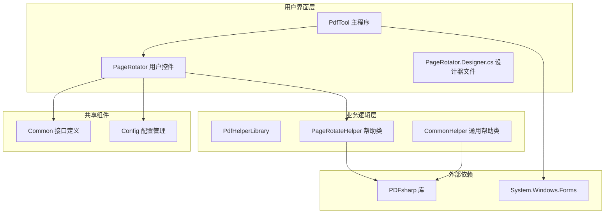
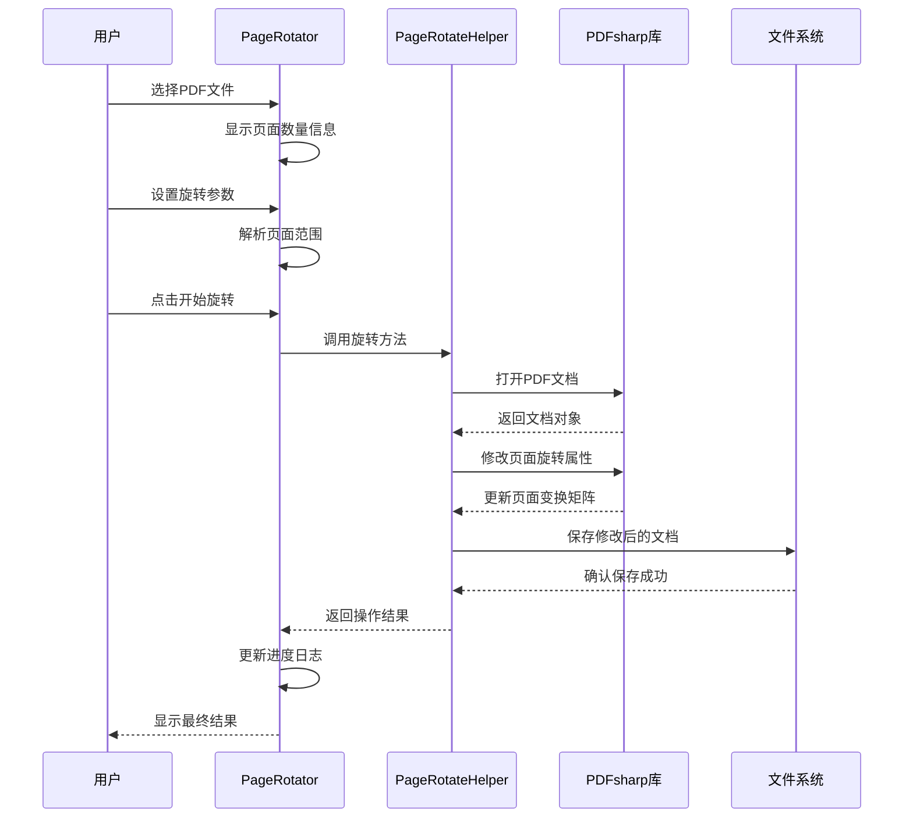
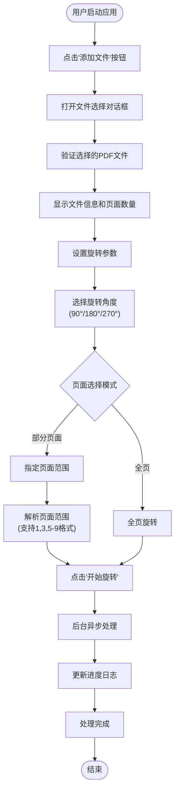
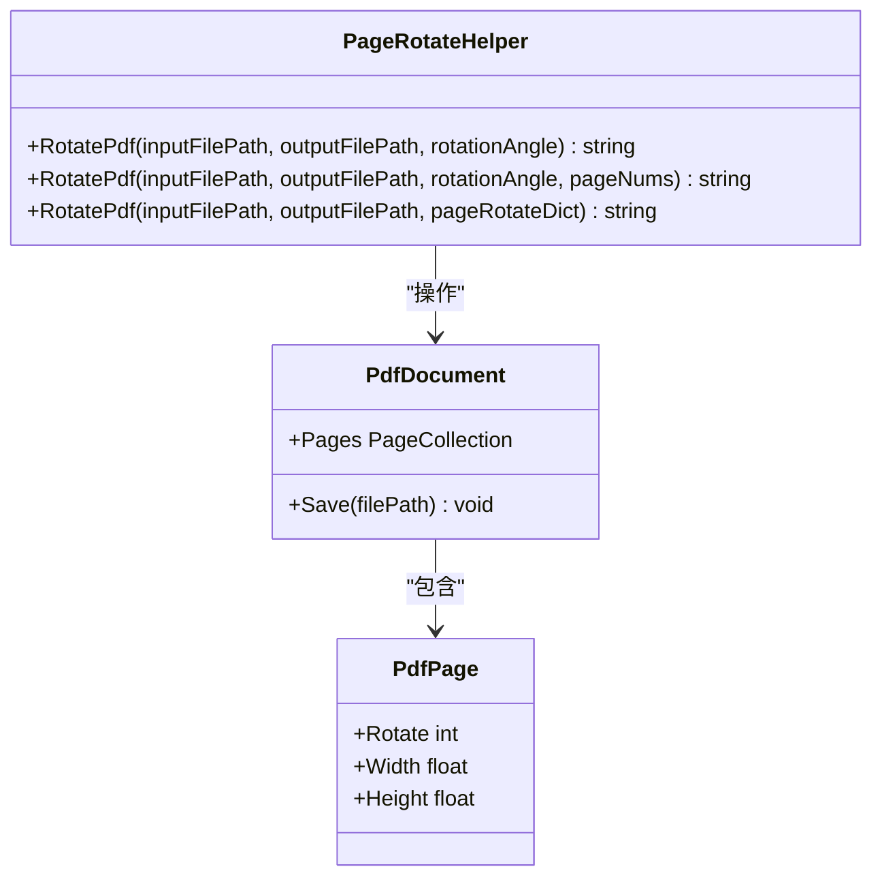
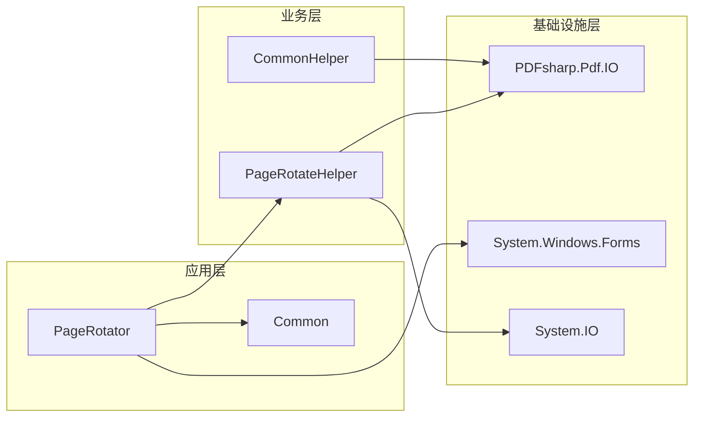
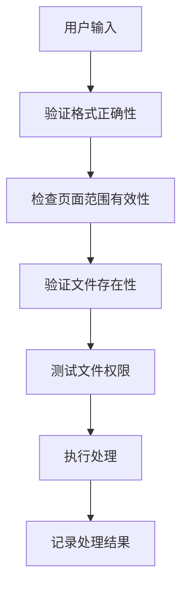

# PDF页面旋转器

<cite>
**本文档中引用的文件**
- [PageRotator.cs](file://PdfTool/PageRotator.cs)
- [PageRotateHelper.cs](file://PdfHelperLibrary/PageRotateHelper.cs)
- [PageRotator.Designer.cs](file://PdfTool/PageRotator.Designer.cs)
- [Common.cs](file://PdfTool/Common.cs)
- [CommonHelper.cs](file://PdfHelperLibrary/CommonHelper.cs)
- [Config.cs](file://PdfTool/Config.cs)
- [PageRotator.cs](file://PdfEditor\Modules\PageRotator.cs)
</cite>

## 目录
1. [简介](#简介)
2. [项目结构](#项目结构)
3. [核心组件](#核心组件)
4. [架构概览](#架构概览)
5. [详细组件分析](#详细组件分析)
6. [依赖关系分析](#依赖关系分析)
7. [性能考虑](#性能考虑)
8. [故障排除指南](#故障排除指南)
9. [结论](#结论)

## 简介

PDF页面旋转器是一个专门用于旋转PDF文档页面的工具，提供了直观的用户界面和强大的批量处理功能。该系统主要由两个核心模块组成：用户界面层（PdfTool）和业务逻辑层（PdfHelperLibrary），通过PDFsharp库实现底层的PDF文档操作。

该工具支持三种标准旋转角度（90°、180°、270°），提供单页和批量页面旋转功能，并具备完善的错误处理和日志记录机制。特别值得一提的是，它能够保持PDF文档的原有属性，如书签、链接和注释等元数据信息。

## 项目结构

PDF页面旋转器项目采用分层架构设计，主要包含以下模块：

**图表来源**
- [PageRotator.cs](file://PdfTool/PageRotator.cs#L1-L213)
- [PageRotateHelper.cs](file://PdfHelperLibrary/PageRotateHelper.cs#L1-L95)
- [Common.cs](file://PdfTool/Common.cs#L1-L18)

**章节来源**
- [PageRotator.cs](file://PdfTool/PageRotator.cs#L1-L213)
- [PageRotateHelper.cs](file://PdfHelperLibrary/PageRotateHelper.cs#L1-L95)

## 核心组件

### 用户界面控制器（PageRotator）

PageRotator是PDF页面旋转器的主要用户界面组件，实现了IPdfHandler接口，负责处理用户交互和业务流程协调。

#### 主要功能特性：
- **多文件支持**：支持同时选择多个PDF文件进行批量处理
- **灵活的页面选择**：提供全页旋转和指定页面范围旋转两种模式
- **直观的角度选择**：通过下拉菜单提供90°、180°、270°三个标准旋转角度
- **实时进度反馈**：使用BackgroundWorker实现异步处理，提供实时进度显示

#### 用户交互设计特点：
- **清晰的布局结构**：采用流式布局设计，控制元素排列整齐有序
- **智能的输入验证**：对页面编号输入进行格式化解析，支持多种分隔符
- **友好的错误提示**：提供详细的错误信息和操作指导

### 业务逻辑处理器（PageRotateHelper）

PageRotateHelper是PDF页面旋转的核心业务逻辑组件，封装了PDFsharp库的操作，实现了高效的页面旋转功能。

#### 核心算法实现：
- **统一的旋转接口**：提供三个重载方法，分别处理全页旋转、指定页面旋转和批量页面旋转
- **异常安全处理**：完整的try-catch机制确保操作的稳定性
- **输出文件管理**：自动生成带旋转角度标识的输出文件名

**章节来源**
- [PageRotator.cs](file://PdfTool/PageRotator.cs#L14-L213)
- [PageRotateHelper.cs](file://PdfHelperLibrary/PageRotateHelper.cs#L14-L95)

## 架构概览

PDF页面旋转器采用经典的三层架构模式，实现了关注点分离和高内聚低耦合的设计原则。

**图表来源**
- [PageRotator.cs](file://PdfTool/PageRotator.cs#L75-L126)
- [PageRotateHelper.cs](file://PdfHelperLibrary/PageRotateHelper.cs#L14-L64)

## 详细组件分析

### PageRotator用户界面组件

PageRotator作为主要的用户交互界面，采用了现代化的Windows Forms设计模式。

#### 控件布局与交互流程

**图表来源**
- [PageRotator.cs](file://PdfTool/PageRotator.cs#L75-L126)
- [PageRotator.cs](file://PdfTool/PageRotator.cs#L46-L71)

#### 页面编号解析算法

PageRotator实现了智能的页面编号解析功能，支持多种输入格式：

| 输入格式 | 示例 | 解析结果 |
|---------|------|----------|
| 单个页面 | "5" | [5] |
| 多个页面 | "1,3,5" | [1,3,5] |
| 连续范围 | "1-5" | [1,2,3,4,5] |
| 混合格式 | "1,3-5,8" | [1,3,4,5,8] |

#### 用户界面设计特点

- **响应式布局**：使用Anchor属性实现窗口大小变化时的自动调整
- **视觉层次**：通过颜色和字体区分不同类型的控件
- **用户体验优化**：提供即时的视觉反馈和状态指示

**章节来源**
- [PageRotator.cs](file://PdfTool/PageRotator.cs#L46-L71)
- [PageRotator.cs](file://PdfTool/PageRotator.cs#L130-L209)

### PageRotateHelper业务逻辑组件

PageRotateHelper是PDF页面旋转功能的核心实现，直接与PDFsharp库交互。

#### 旋转算法实现

**图表来源**
- [PageRotateHelper.cs](file://PdfHelperLibrary/PageRotateHelper.cs#L14-L94)

#### 旋转角度处理机制

PageRotateHelper通过修改PDF页面的Rotate属性来实现旋转效果：

| 方法签名 | 功能描述 | 参数说明 |
|---------|----------|----------|
| `RotatePdf(string, out string, int)` | 全页旋转 | rotationAngle: 90/180/270 |
| `RotatePdf(string, out string, int, List<int>)` | 指定页面旋转 | pageNums: 页面索引列表 |
| `RotatePdf(string, string, Dictionary<int,int>)` | 批量页面旋转 | pageRotateDict: 页面-角度映射 |

#### 错误处理策略

PageRotateHelper实现了多层次的错误处理机制：

1. **文件级错误处理**：捕获文件读取和写入异常
2. **文档级错误处理**：处理PDF文档格式错误
3. **页面级错误处理**：验证页面索引的有效性
4. **输出级错误处理**：确保输出路径的可访问性

**章节来源**
- [PageRotateHelper.cs](file://PdfHelperLibrary/PageRotateHelper.cs#L14-L94)

### PDF文档属性保持机制

PDF页面旋转器在旋转过程中能够保持文档的原有属性，这是通过PDFsharp库的智能处理实现的。

#### 属性保持原理

当调用`page.Rotate += rotationAngle`时，PDFsharp会自动更新以下内容：

- **页面内容变换**：重新计算页面内容的坐标位置
- **边界框更新**：自动调整MediaBox、CropBox等边界框
- **注释位置修正**：保持注释在页面上的相对位置
- **链接区域更新**：确保超链接区域的准确性

#### 典型使用场景

1. **扫描文档校正**：纠正扫描仪自动检测到的页面方向错误
2. **批量文档处理**：一次性旋转多个文档中的特定页面
3. **格式标准化**：将不同方向的文档统一为标准方向
4. **内容重新排版**：为后续编辑做准备

**章节来源**
- [PageRotateHelper.cs](file://PdfHelperLibrary/PageRotateHelper.cs#L22-L25)

## 依赖关系分析

PDF页面旋转器的依赖关系体现了良好的软件工程实践。

**图表来源**
- [PageRotator.cs](file://PdfTool/PageRotator.cs#L1-L10)
- [PageRotateHelper.cs](file://PdfHelperLibrary/PageRotateHelper.cs#L1-L7)

### 关键依赖说明

| 组件 | 依赖项 | 用途说明 |
|------|--------|----------|
| PageRotator | System.Windows.Forms | 提供用户界面控件 |
| PageRotator | PdfHelperLibrary | 调用业务逻辑方法 |
| PageRotateHelper | PDFsharp.Pdf.IO | PDF文档操作 |
| CommonHelper | PDFsharp.Pdf.IO | 获取文档基本信息 |

**章节来源**
- [PageRotator.cs](file://PdfTool/PageRotator.cs#L1-L10)
- [PageRotateHelper.cs](file://PdfHelperLibrary/PageRotateHelper.cs#L1-L7)

## 性能考虑

### 异步处理优化

PageRotator采用BackgroundWorker实现异步处理，避免UI线程阻塞：

- **CPU友好**：将耗时的PDF处理操作移至后台线程
- **响应性保证**：用户界面始终保持响应状态
- **进度反馈**：实时更新处理进度，提升用户体验

### 内存管理策略

- **及时释放**：处理完成后立即释放PDF文档对象
- **流式处理**：对于大文件采用流式读取方式
- **异常安全**：确保异常情况下也能正确释放资源

### 批量处理优化

- **批量验证**：预先验证所有输入参数的有效性
- **错误隔离**：单个文件的错误不影响其他文件处理
- **进度聚合**：汇总所有文件的处理结果

## 故障排除指南

### 常见问题及解决方案

#### 旋转后内容裁剪问题

**问题描述**：旋转后页面内容被裁剪或显示不完整

**原因分析**：
- PDF文档的MediaBox尺寸不足以容纳旋转后的内容
- 页面内容超出了原始边界框

**解决方案**：
1. **启用自动边距调整**：在旋转前检查并扩展边界框
2. **预览确认机制**：提供旋转前后的对比预览
3. **手动调整边界**：允许用户手动设置新的边界框

#### 注释和链接偏移问题

**问题描述**：旋转后注释位置和超链接区域发生偏移

**原因分析**：
- 注释坐标系与页面坐标系的转换不准确
- 边界框更新不完整

**解决方案**：
1. **坐标系同步**：确保注释坐标与页面坐标的一致性
2. **边界框完整性**：完整更新所有相关的边界框属性
3. **测试验证**：对关键注释和链接进行功能测试

#### 大文件处理性能问题

**问题描述**：处理大型PDF文件时出现内存不足或处理缓慢

**解决方案**：
1. **分块处理**：将大文件分割为较小的块进行处理
2. **内存监控**：实时监控内存使用情况
3. **临时文件**：使用临时文件减少内存占用

### 预防措施建议

#### 输入验证增强

#### 输出质量检查

- **完整性验证**：检查输出文件是否完整
- **功能测试**：验证旋转后的功能正常性
- **兼容性检查**：确保与其他PDF工具的兼容性

**章节来源**
- [PageRotator.cs](file://PdfTool/PageRotator.cs#L75-L126)
- [PageRotateHelper.cs](file://PdfHelperLibrary/PageRotateHelper.cs#L32-L36)

## 结论

PDF页面旋转器是一个设计精良、功能完备的PDF文档处理工具。它通过合理的架构设计、完善的错误处理机制和用户友好的界面设计，为用户提供了可靠的PDF页面旋转解决方案。

### 主要优势

1. **简洁易用**：直观的用户界面和明确的操作流程
2. **功能完整**：支持多种旋转角度和页面选择模式
3. **稳定可靠**：完善的错误处理和异常恢复机制
4. **性能优秀**：异步处理和资源管理优化
5. **扩展性强**：模块化设计便于功能扩展

### 技术特色

- **PDFsharp集成**：充分利用PDFsharp库的强大功能
- **异步处理**：提供流畅的用户体验
- **属性保持**：完整保留PDF文档的原有属性
- **错误恢复**：智能的错误处理和恢复机制

该工具不仅适用于个人用户，也可作为企业级PDF处理解决方案的重要组成部分，为PDF文档的标准化处理提供了强有力的支持。