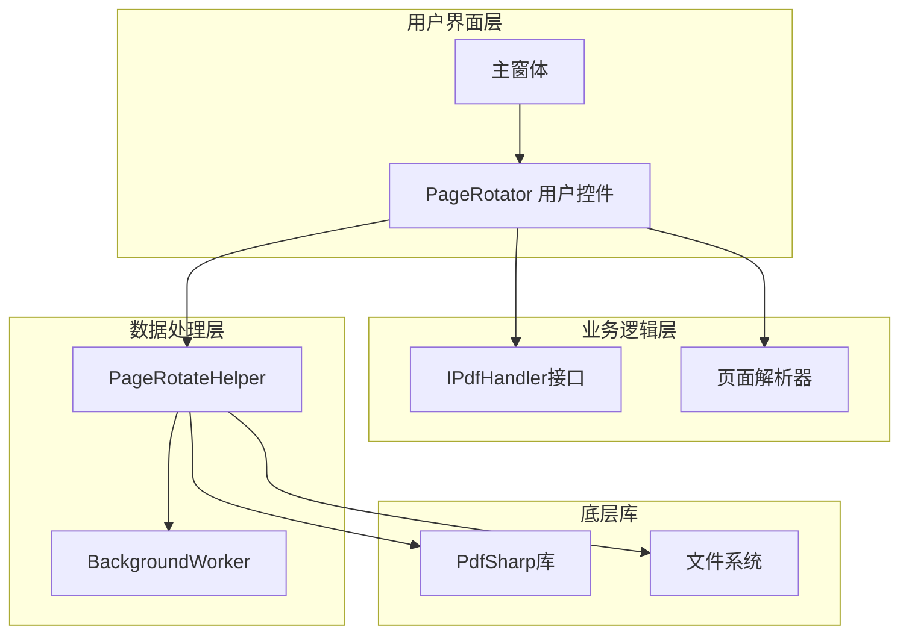
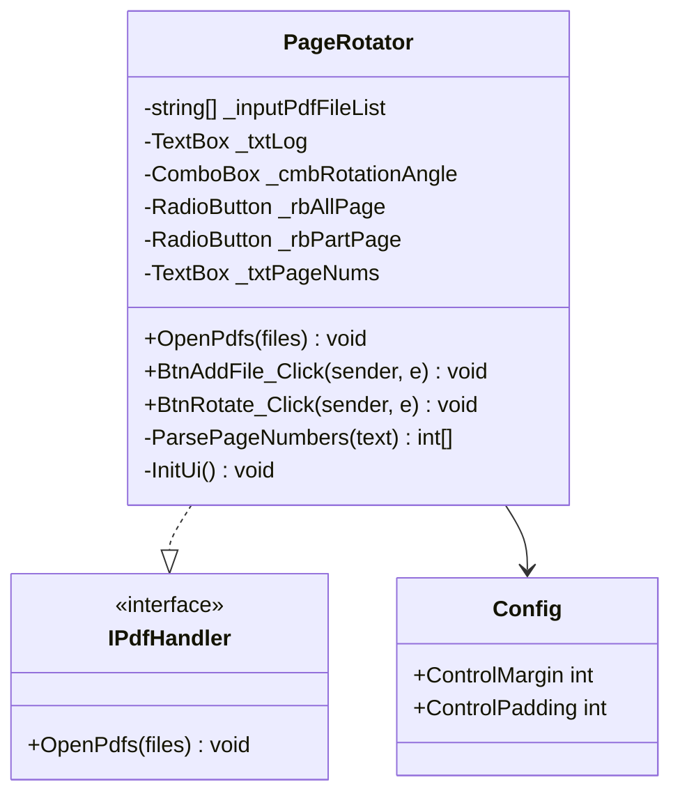
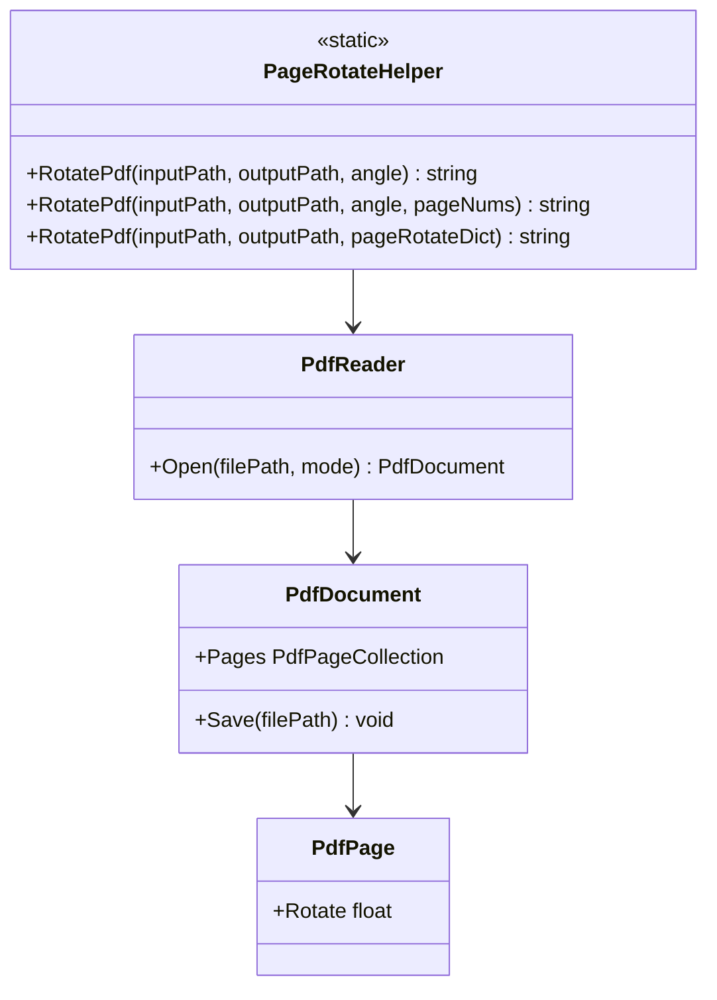
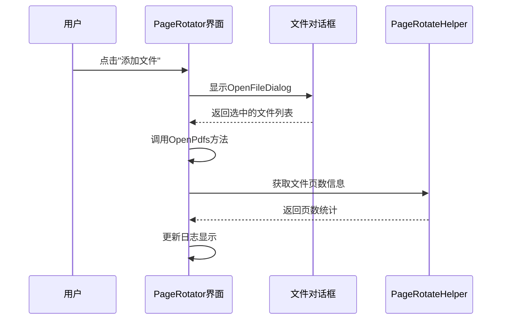
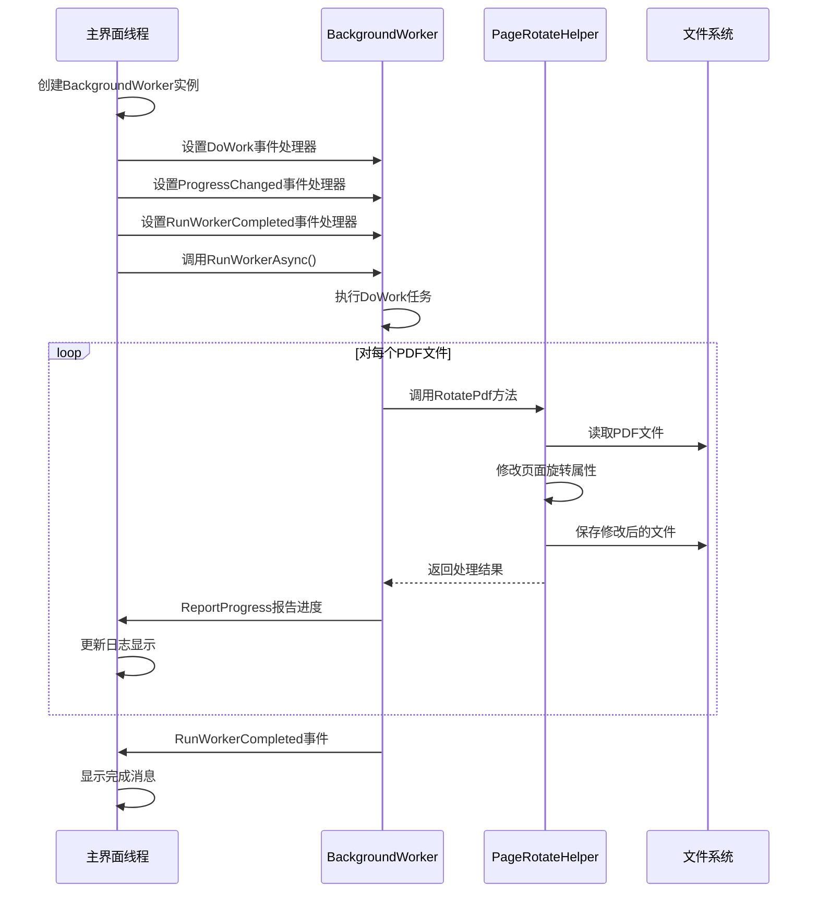
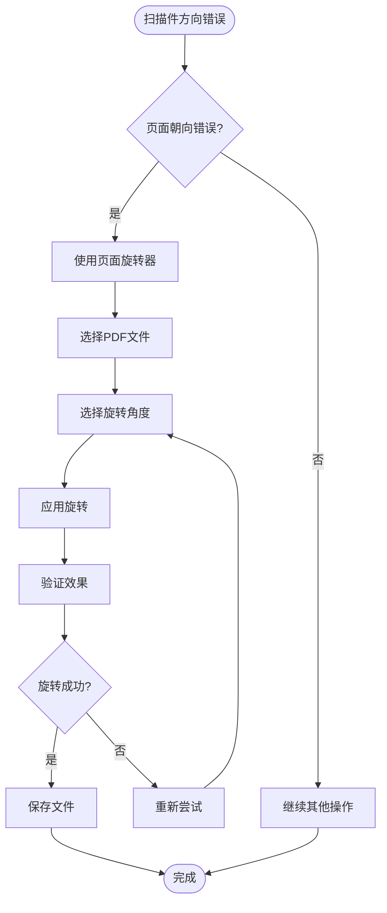
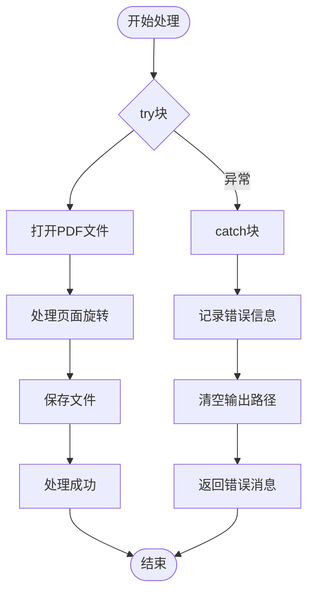

# PDF页面旋转器基本操作指南

<cite>
**本文档引用的文件**
- [PageRotator.cs](file://PdfTool/PageRotator.cs)
- [PageRotator.Designer.cs](file://PdfTool/PageRotator.Designer.cs)
- [PageRotateHelper.cs](file://PdfHelperLibrary/PageRotateHelper.cs)
- [Common.cs](file://PdfTool/Common.cs)
- [Config.cs](file://PdfTool/Config.cs)
- [MainForm.cs](file://PdfTool/MainForm.cs)
</cite>

## 目录
1. [简介](#简介)
2. [系统架构概览](#系统架构概览)
3. [核心组件分析](#核心组件分析)
4. [基本使用流程](#基本使用流程)
5. [异步处理机制](#异步处理机制)
6. [输出文件命名规则](#输出文件命名规则)
7. [实际应用场景](#实际应用场景)
8. [故障排除指南](#故障排除指南)
9. [总结](#总结)

## 简介

PDF页面旋转器是PDF工具套件中的核心功能模块，专门用于对PDF文档的页面进行旋转操作。该工具支持90°、180°、270°三种标准旋转角度，并提供了批量处理能力，能够有效解决扫描件方向错误的问题。

## 系统架构概览

PDF页面旋转器采用分层架构设计，主要包含以下层次：



**图表来源**
- [PageRotator.cs](file://PdfTool/PageRotator.cs#L1-L213)
- [Common.cs](file://PdfTool/Common.cs#L12-L16)
- [PageRotateHelper.cs](file://PdfHelperLibrary/PageRotateHelper.cs#L1-L95)

## 核心组件分析

### PageRotator 用户控件

PageRotator是页面旋转器的主要用户界面组件，实现了IPdfHandler接口，负责：



**图表来源**
- [PageRotator.cs](file://PdfTool/PageRotator.cs#L14-L32)
- [Common.cs](file://PdfTool/Common.cs#L12-L16)
- [Config.cs](file://PdfTool/Config.cs#L3-L7)

### PageRotateHelper 帮助类

PageRotateHelper是核心的数据处理组件，提供PDF旋转的具体实现：



**图表来源**
- [PageRotateHelper.cs](file://PdfHelperLibrary/PageRotateHelper.cs#L12-L94)

**章节来源**
- [PageRotator.cs](file://PdfTool/PageRotator.cs#L1-L213)
- [PageRotateHelper.cs](file://PdfHelperLibrary/PageRotateHelper.cs#L1-L95)
- [Common.cs](file://PdfTool/Common.cs#L1-L18)

## 基本使用流程

### 步骤1：添加PDF文件

用户可以通过以下方式添加PDF文件：

1. 点击"添加文件"按钮
2. 在弹出的文件选择对话框中选择目标PDF文件
3. 支持多文件同时选择
4. 系统自动显示每个文件的页数信息



**图表来源**
- [PageRotator.cs](file://PdfTool/PageRotator.cs#L75-L87)

### 步骤2：选择旋转参数

用户需要配置以下旋转参数：

| 参数类型 | 可选值 | 描述 |
|---------|--------|------|
| 旋转角度 | 90°, 180°, 270° | 从下拉菜单中选择 |
| 旋转范围 | 全部页面 / 部分页面 | 单选按钮选择 |
| 页面编号 | 数字或范围 | 如：1,3,5-9 |

### 步骤3：执行旋转操作

当用户点击"开始旋转"按钮时，系统会：

1. 验证输入文件列表是否为空
2. 解析用户选择的旋转参数
3. 启动后台工作线程进行处理
4. 实时更新进度日志

**章节来源**
- [PageRotator.cs](file://PdfTool/PageRotator.cs#L75-L126)

## 异步处理机制

### BackgroundWorker实现

PDF页面旋转器采用BackgroundWorker实现异步处理，避免UI冻结：



**图表来源**
- [PageRotator.cs](file://PdfTool/PageRotator.cs#L89-L125)

### 异步处理优势

1. **UI响应性**：用户界面保持响应状态
2. **实时反馈**：处理进度实时显示在日志窗口
3. **异常安全**：异常处理不会影响主线程
4. **资源管理**：合理利用系统资源

**章节来源**
- [PageRotator.cs](file://PdfTool/PageRotator.cs#L89-L125)

## 输出文件命名规则

PDF页面旋转器遵循统一的文件命名规则：

### 命名格式
```
{原始文件名} - {旋转角度}.pdf
```

### 示例

| 原始文件名 | 旋转角度 | 输出文件名 |
|-----------|----------|------------|
| document.pdf | 90° | document - 90.pdf |
| report.pdf | 180° | report - 180.pdf |
| image.pdf | 270° | image - 270.pdf |

### 特殊情况处理

1. **文件路径**：输出文件保存在输入文件所在目录
2. **重复检测**：如果输出文件已存在，系统会覆盖原有文件
3. **错误处理**：旋转失败时不会生成输出文件

**章节来源**
- [PageRotateHelper.cs](file://PdfHelperLibrary/PageRotateHelper.cs#L28-L56)

## 实际应用场景

### 扫描件方向校正

最常见的应用场景是纠正扫描件的方向错误：



### 具体使用场景

1. **文档扫描**：扫描仪自动检测方向错误
2. **批量处理**：处理大量扫描文档
3. **格式转换**：配合其他工具进行格式转换
4. **质量检查**：确保文档方向正确后再进行后续处理

### 最佳实践建议

1. **备份原始文件**：在进行批量旋转前备份重要文档
2. **测试小样本**：先对少量文件进行测试
3. **检查输出**：旋转完成后立即检查输出文件
4. **合理规划**：根据文档数量选择合适的处理策略

## 故障排除指南

### 常见问题及解决方案

| 问题描述 | 可能原因 | 解决方案 |
|---------|----------|----------|
| 无法添加文件 | 文件格式不支持 | 确保选择的是PDF文件 |
| 旋转失败 | 文件损坏或权限不足 | 检查文件完整性和访问权限 |
| 输出文件为空 | 处理过程中发生异常 | 查看详细错误信息 |
| UI无响应 | 处理时间过长 | 等待处理完成或重启程序 |

### 错误处理机制

PageRotateHelper提供了完善的错误处理：



**图表来源**
- [PageRotateHelper.cs](file://PdfHelperLibrary/PageRotateHelper.cs#L16-L36)
- [PageRotateHelper.cs](file://PdfHelperLibrary/PageRotateHelper.cs#L42-L64)

**章节来源**
- [PageRotateHelper.cs](file://PdfHelperLibrary/PageRotateHelper.cs#L16-L94)

## 总结

PDF页面旋转器是一个功能完善、设计合理的文档处理工具。它通过以下特点为用户提供优秀的使用体验：

1. **直观的用户界面**：清晰的操作流程和实时的进度反馈
2. **强大的处理能力**：支持批量处理和多种旋转角度
3. **可靠的异步机制**：避免UI冻结，提供流畅的用户体验
4. **智能的文件管理**：规范的命名规则和完善的错误处理

该工具特别适用于需要批量处理扫描文档的场景，能够显著提高工作效率，减少人工操作错误。通过合理的架构设计和完善的异常处理机制，确保了系统的稳定性和可靠性。