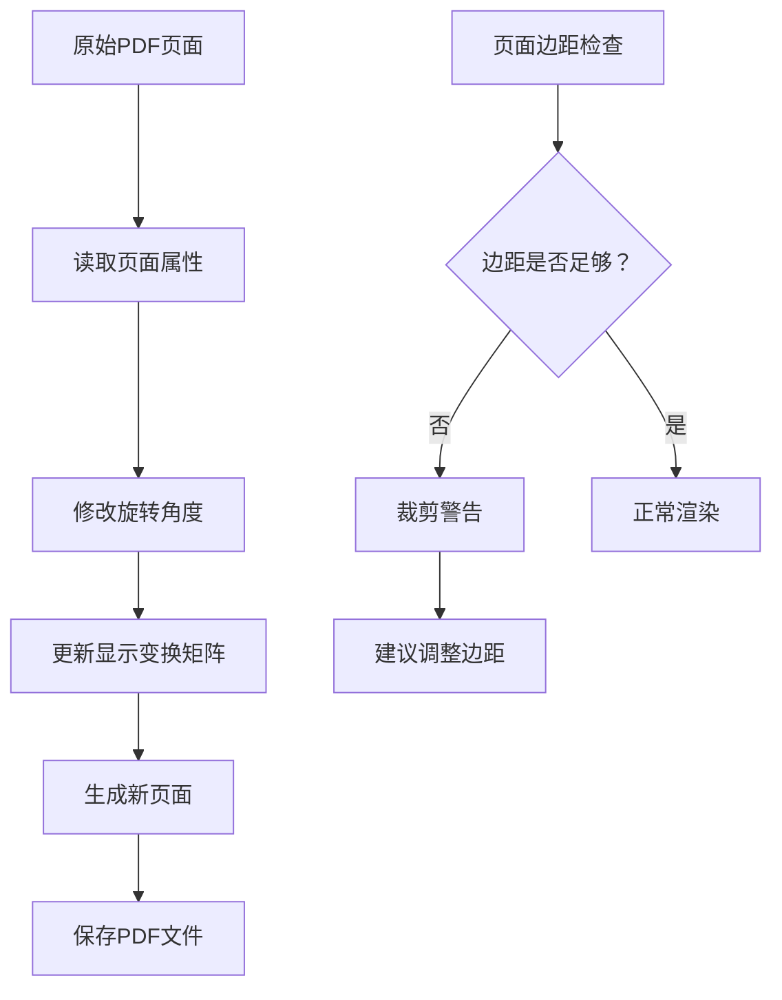
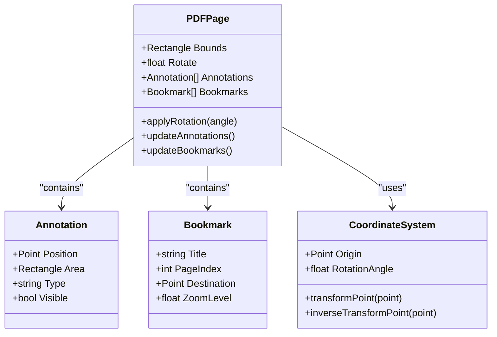
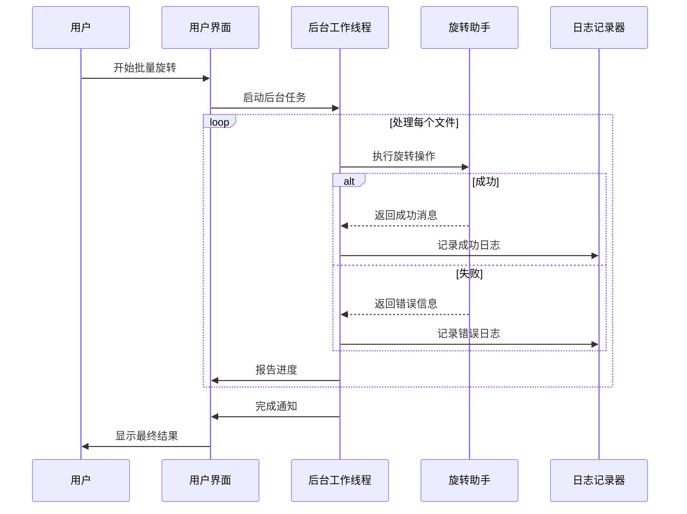
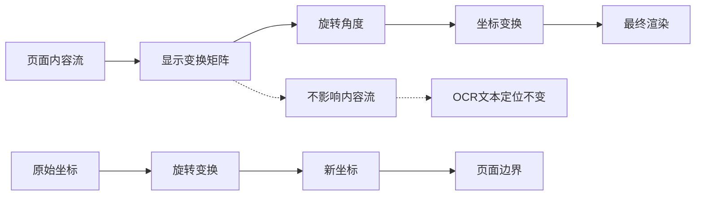
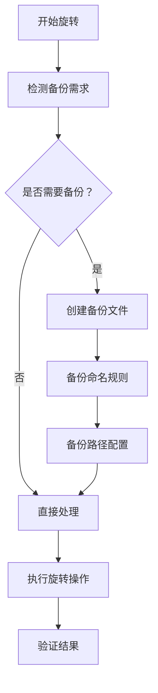

# 常见问题与解决方案

<cite>
**本文档中引用的文件**
- [PageRotateHelper.cs](file://PdfHelperLibrary/PageRotateHelper.cs)
- [PageRotator.cs](file://PdfTool/PageRotator.cs)
- [PageRotator.cs](file://PdfEditor/Modules/PageRotator.cs)
- [PageOperaBase.cs](file://PdfEditor/Modules/PageOperaBase.cs)
- [PagePreviewPanel.cs](file://PdfEditor/Controls/PagePreviewPanel.cs)
- [CommonHelper.cs](file://PdfHelperLibrary/CommonHelper.cs)
- [ImagerHelper.cs](file://PdfHelperLibrary/ImagerHelper.cs)
</cite>

## 目录
1. [简介](#简介)
2. [旋转后文本或图像被裁剪](#旋转后文本或图像被裁剪)
3. [注释/书签位置偏移](#注释书签位置偏移)
4. [批量处理中断](#批量处理中断)
5. [旋转操作的技术原理](#旋转操作的技术原理)
6. [预防性建议](#预防性建议)
7. [故障排除指南](#故障排除指南)
8. [总结](#总结)

## 简介

PDF页面旋转器是PDF工具库中的核心功能模块，用于对PDF文档中的页面进行旋转操作。本文档系统性地列出了使用PDF页面旋转器时可能遇到的各种问题及其解决方案，涵盖了从技术实现到用户体验的各个方面。

## 旋转后文本或图像被裁剪

### 问题描述

在使用PDF页面旋转器进行页面旋转后，用户可能会发现文本或图像内容被裁剪，无法完整显示。这种现象主要发生在以下场景：

- 页面尺寸与内容布局不匹配
- 原始PDF文件的页面边距设置不当
- 旋转后页面边界超出可见区域

### 技术原因分析

PDF页面旋转实际上并不改变页面内容流，而是修改页面的显示变换矩阵。具体来说：



**图表来源**
- [PageRotateHelper.cs](file://PdfHelperLibrary/PageRotateHelper.cs#L14-L30)
- [PageRotator.cs](file://PdfTool/PageRotator.cs#L82-L125)

### 解决方案

#### 1. 检查原始页面边距

**建议步骤：**
1. 使用PDF查看器打开原始文件
2. 检查页面的实际可用空间
3. 确认内容是否接近页面边界
4. 考虑重新设计文档布局

#### 2. 启用预览确认功能

**实现机制：**
- 在旋转操作前提供实时预览
- 允许用户确认旋转效果
- 提供撤销操作选项

**技术实现要点：**
- 使用ImagerHelper2类生成旋转预览图
- 支持动态缩放和实时渲染
- 提供多角度预览对比

#### 3. 调整页面尺寸

**可选方案：**
- 手动调整页面大小以适应内容
- 修改页面边距设置
- 重新排版文档内容

**节来源**
- [PagePreviewPanel.cs](file://PdfEditor/Controls/PagePreviewPanel.cs#L28-L33)
- [PageOperaBase.cs](file://PdfEditor/Modules/PageOperaBase.cs#L66-L71)

## 注释/书签位置偏移

### 问题描述

PDF注释对象和书签在页面旋转后可能出现位置偏移，导致无法准确定位到预期位置。这是由于PDF规范中注释对象的位置坐标是相对于页面的，而页面旋转会改变页面的坐标系。

### 技术原理

PDF注释系统的工作机制：



**图表来源**
- [PageRotator.cs](file://PdfEditor/Modules/PageRotator.cs#L28-L40)
- [PageOperaBase.cs](file://PdfEditor/Modules/PageOperaBase.cs#L24-L26)

### 解决方案

#### 1. 手动修正注释位置

**操作流程：**
1. 识别受影响的注释对象
2. 计算新的坐标位置
3. 更新注释对象属性
4. 验证修正效果

#### 2. 使用专门的注释处理工具

**推荐方法：**
- 导出PDF为中间格式
- 手动调整注释位置
- 重新导入并保存

#### 3. 开发自动化修正脚本

**技术实现：**
- 分析注释对象的坐标系
- 应用反向变换矩阵
- 更新注释位置属性

**节来源**
- [PageRotator.cs](file://PdfEditor/Modules/PageRotator.cs#L28-L40)

## 批量处理中断

### 异常捕获机制

PDF页面旋转器实现了完善的异常处理机制，确保批量处理过程的稳定性：



**图表来源**
- [PageRotator.cs](file://PdfTool/PageRotator.cs#L92-L125)
- [PageRotator.cs](file://PdfEditor/Modules/PageRotator.cs#L61-L85)

### 日志输出策略

#### 1. 实时进度跟踪

**日志格式示例：**
```
【页数：24】document.pdf
正在旋转，请稍候...
document.pdf 旋转完成: document - 90.pdf
```

#### 2. 错误信息记录

**错误分类：**
- 文件访问权限问题
- PDF格式损坏
- 内存不足
- 磁盘空间不足

#### 3. 批量处理状态管理

**状态监控指标：**
- 总文件数量
- 已处理文件数
- 失败文件列表
- 处理时间统计

### 中断恢复机制

#### 1. 断点续传功能

**实现方式：**
- 记录处理进度
- 保存中间状态
- 支持从断点继续

#### 2. 自动重试机制

**重试策略：**
- 指数退避算法
- 最大重试次数限制
- 失败文件隔离

**节来源**
- [PageRotator.cs](file://PdfTool/PageRotator.cs#L95-L112)
- [PageRotator.cs](file://PdfEditor/Modules/PageRotator.cs#L66-L82)

## 旋转操作的技术原理

### 显示变换矩阵

PDF页面旋转的核心在于修改页面的显示变换矩阵，而不是直接改变页面内容。这一技术特性决定了旋转操作的几个重要特点：



**图表来源**
- [PageRotateHelper.cs](file://PdfHelperLibrary/PageRotateHelper.cs#L22-L24)

### OCR文本定位不受影响

**技术保证：**
- 旋转操作只修改显示属性
- 内容流保持不变
- 文本提取算法独立于显示变换

**验证机制：**
- 旋转前后文本提取结果对比
- 坐标系一致性检查
- 内容完整性验证

**节来源**
- [PageRotateHelper.cs](file://PdfHelperLibrary/PageRotateHelper.cs#L14-L30)

## 预防性建议

### 操作前准备

#### 1. 文件备份策略

**建议措施：**
- 自动创建原始文件备份
- 提供手动备份选项
- 支持版本控制集成

**实现方案：**


#### 2. 预检查清单

**检查项目：**
- PDF文件完整性
- 页面数量和结构
- 注释和书签状态
- 页面边距设置

### 用户体验优化

#### 1. 实时预览功能

**功能特性：**
- 旋转角度实时预览
- 多页面同时预览
- 缩放级别自定义

#### 2. 操作确认机制

**确认流程：**
- 关键操作前提示
- 批量操作确认
- 撤销操作支持

**节来源**
- [PageRotator.cs](file://PdfTool/PageRotator.cs#L35-L44)
- [PagePreviewPanel.cs](file://PdfEditor/Controls/PagePreviewPanel.cs#L46-L56)

## 故障排除指南

### 常见错误诊断

#### 1. 文件格式兼容性问题

**症状表现：**
- 无法打开某些PDF文件
- 旋转操作失败
- 输出文件损坏

**解决步骤：**
1. 验证PDF版本兼容性
2. 检查文件完整性
3. 尝试修复损坏文件

#### 2. 内存不足问题

**性能优化：**
- 分批处理大型文件
- 优化内存使用
- 增加垃圾回收频率

#### 3. 权限访问问题

**权限检查：**
- 文件读写权限
- 目录访问权限
- 临时文件夹权限

### 调试技巧

#### 1. 日志分析

**日志级别：**
- 调试信息（Debug）
- 详细信息（Info）
- 警告信息（Warning）
- 错误信息（Error）

#### 2. 性能监控

**监控指标：**
- 处理时间统计
- 内存使用情况
- CPU占用率
- 磁盘I/O性能

**节来源**
- [CommonHelper.cs](file://PdfHelperLibrary/CommonHelper.cs#L13-L25)

## 总结

PDF页面旋转器作为PDF工具库的核心组件，通过精心设计的架构和完善的异常处理机制，为用户提供了稳定可靠的页面旋转功能。本文档详细分析了使用过程中可能遇到的各种问题，并提供了相应的解决方案。

### 关键要点回顾

1. **技术特性**：旋转操作不改变内容流，仅修改显示变换矩阵
2. **常见问题**：文本裁剪、注释偏移、批量处理中断
3. **解决方案**：预览确认、手动修正、异常处理
4. **预防措施**：备份策略、预检查、用户体验优化

### 最佳实践建议

- 始终在操作前备份原始文件
- 使用预览功能确认旋转效果
- 对于包含重要注释的文档，考虑手动修正
- 建立完善的日志记录和错误处理机制
- 定期测试和维护旋转功能

通过遵循这些指导原则和最佳实践，用户可以最大限度地避免常见问题，获得更好的PDF页面旋转体验。