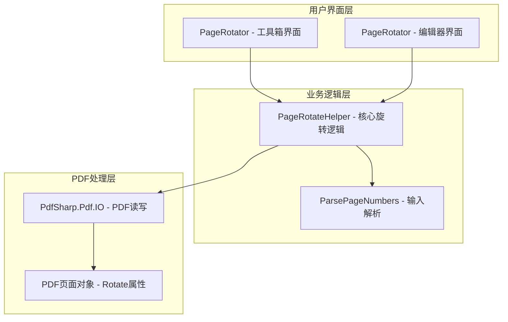
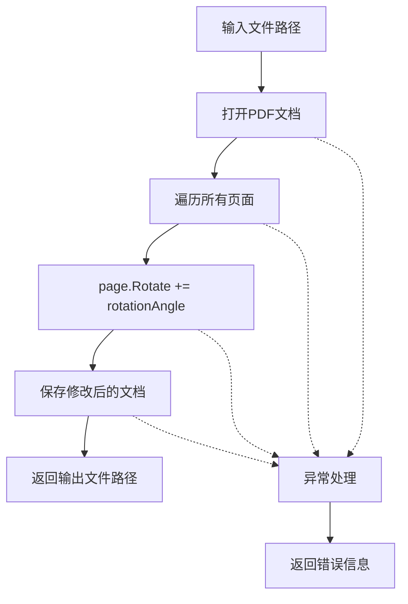
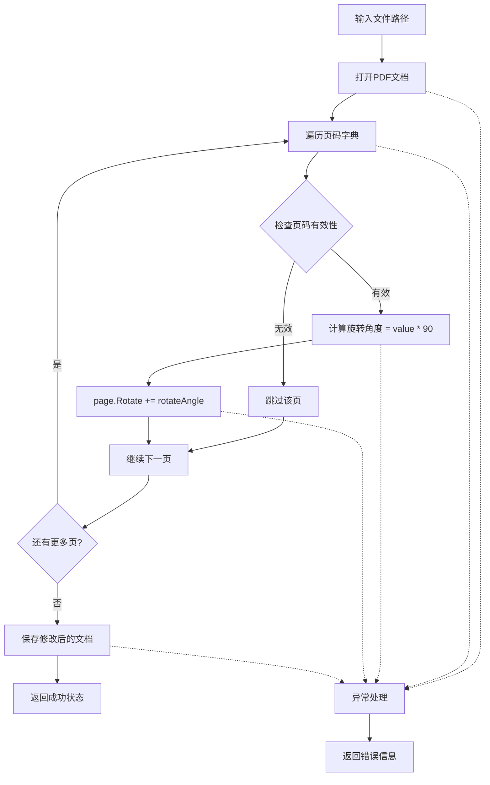
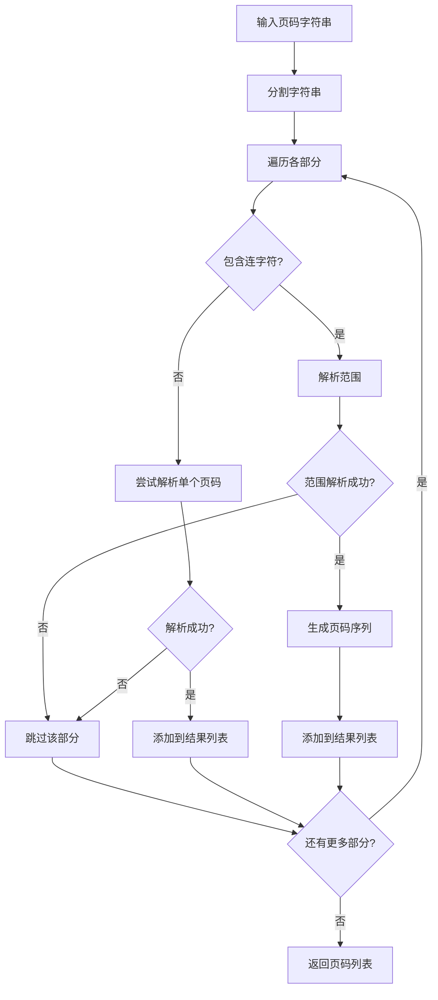
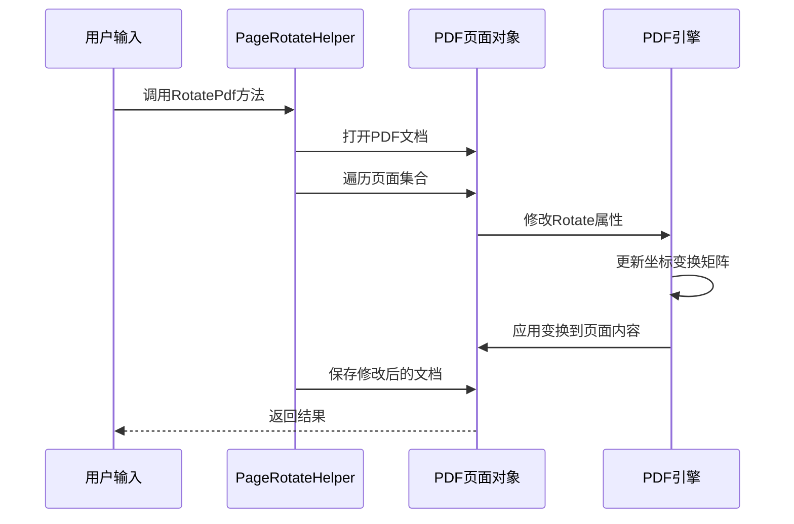
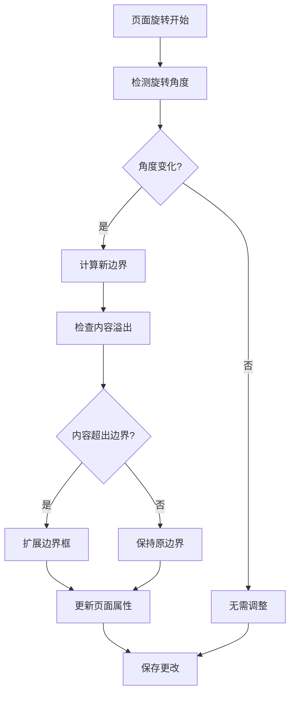
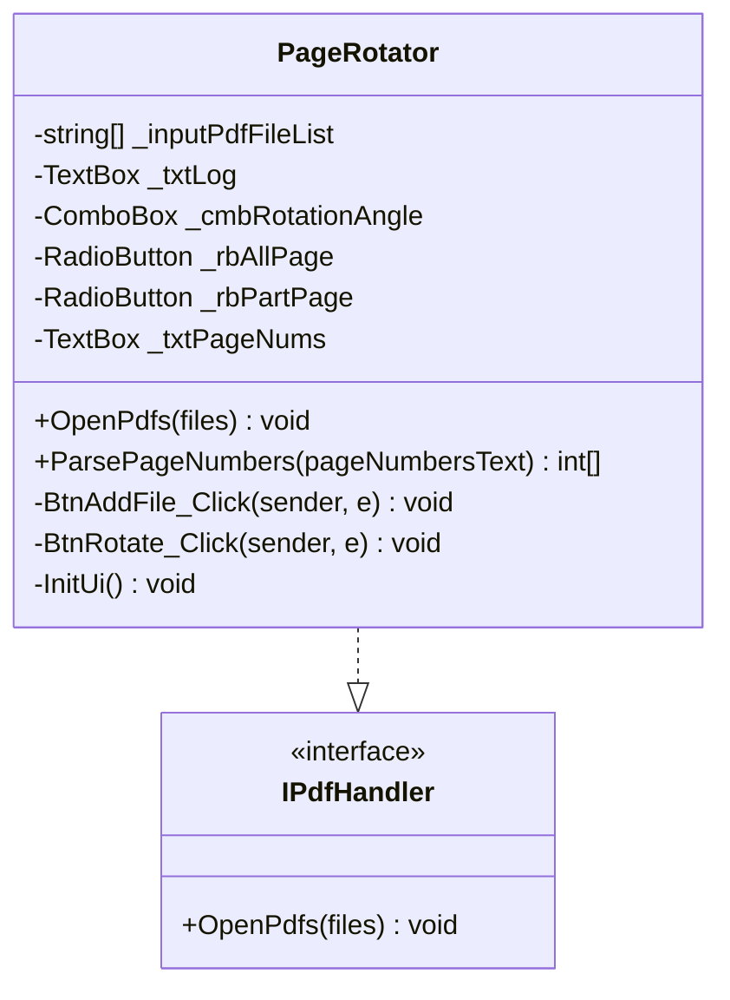
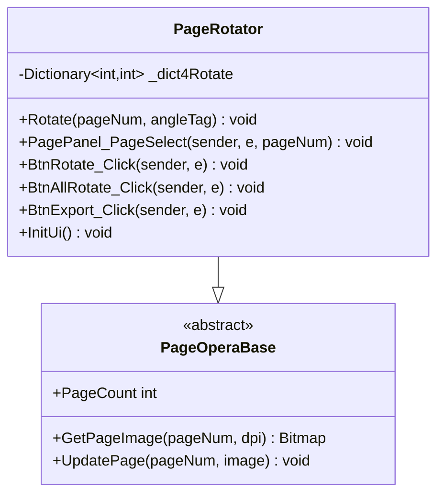

# 高级设置 - 页面旋转功能实现详解

<cite>
**本文档引用的文件**
- [PageRotateHelper.cs](file://PdfHelperLibrary/PageRotateHelper.cs)
- [PageRotator.cs](file://PdfTool/PageRotator.cs)
- [PageRotator.cs](file://PdfEditor/Modules/PageRotator.cs)
- [_txtPageNums](file://PdfTool/PageRotator.cs#L31)
- [ParsePageNumbers方法](file://PdfTool/PageRotator.cs#L46-L70)
- [Rotate方法](file://PdfEditor/Modules/PageRotator.cs#L28-L39)
- [Common.cs](file://PdfTool/Common.cs)
- [Config.cs](file://PdfTool/Config.cs)
</cite>

## 目录
1. [概述](#概述)
2. [项目结构分析](#项目结构分析)
3. [核心组件架构](#核心组件架构)
4. [PageRotateHelper详细分析](#pagerotatehelper详细分析)
5. [_txtPageNums文本框输入格式](#_txtpagenums文本框输入格式)
6. [ParsePageNumbers方法解析](#parsepagenumbers方法解析)
7. [页面旋转底层原理](#页面旋转底层原理)
8. [页面边界框自动调整机制](#页面边界框自动调整机制)
9. [用户界面实现](#用户界面实现)
10. [性能考虑与优化](#性能考虑与优化)
11. [故障排除指南](#故障排除指南)
12. [总结](#总结)

## 概述

PDF页面旋转功能是PDF工具包中的重要特性，支持对PDF文档进行精确的角度旋转操作。该功能通过修改PDF页面的Rotate属性（D0条目）来实现坐标系变换，并自动处理页面边界框的调整。本文档深入分析了页面旋转功能的完整实现，包括多个重载方法的分工、输入格式解析、底层原理以及用户界面设计。

## 项目结构分析

PDF工具包采用模块化架构，主要包含以下关键组件：



**图表来源**
- [PageRotator.cs](file://PdfTool/PageRotator.cs#L1-L213)
- [PageRotator.cs](file://PdfEditor/Modules/PageRotator.cs#L1-L248)
- [PageRotateHelper.cs](file://PdfHelperLibrary/PageRotateHelper.cs#L1-L95)

## 核心组件架构

页面旋转功能的核心架构包含三个主要层次：

### 1. 用户界面层
- **工具箱界面**：提供批量旋转功能，支持多种输入格式
- **编辑器界面**：提供交互式单页旋转功能

### 2. 业务逻辑层
- **PageRotateHelper**：静态工具类，提供三种重载的旋转方法
- **ParsePageNumbers**：专门负责解析页码范围字符串

### 3. PDF处理层
- **PdfSharp框架**：底层PDF文档操作
- **页面属性**：直接修改Rotate属性实现旋转

**章节来源**
- [PageRotator.cs](file://PdfTool/PageRotator.cs#L14-L48)
- [PageRotator.cs](file://PdfEditor/Modules/PageRotator.cs#L12-L25)
- [PageRotateHelper.cs](file://PdfHelperLibrary/PageRotateHelper.cs#L12-L95)

## PageRotateHelper详细分析

PageRotateHelper是页面旋转功能的核心工具类，提供了三个重载方法来满足不同的使用场景：

### 方法一：全页旋转（无条件旋转）



**图表来源**
- [PageRotateHelper.cs](file://PdfHelperLibrary/PageRotateHelper.cs#L14-L36)

### 方法二：指定页码旋转

```mermaid
flowchart TD
A[输入文件路径] --> B[打开PDF文档]
B --> C[验证页码范围]
C --> D[排序页码列表]
D --> E[遍历有效页码]
E --> F[document.Pages[pageNum-1].Rotate += rotationAngle]
F --> G[保存修改后的文档]
G --> H[返回输出文件路径]
I[异常处理] --> J[返回错误信息]
B -.-> I
C -.-> I
D -.-> I
E -.-> I
F -.-> I
G -.-> I
```

**图表来源**
- [PageRotateHelper.cs](file://PdfHelperLibrary/PageRotateHelper.cs#L39-L64)

### 方法三：按页索引字典旋转



**图表来源**
- [PageRotateHelper.cs](file://PdfHelperLibrary/PageRotateHelper.cs#L67-L91)

**章节来源**
- [PageRotateHelper.cs](file://PdfHelperLibrary/PageRotateHelper.cs#L14-L95)

## _txtPageNums文本框输入格式

在工具箱界面中，`_txtPageNums`文本框支持多种灵活的页码输入格式：

### 支持的输入格式

| 格式示例 | 描述 | 示例 |
|---------|------|------|
| 单个页码 | 直接输入数字 | `1`, `5`, `10` |
| 范围表示 | 使用连字符连接起止页码 | `1-5`, `10-20` |
| 混合格式 | 多种格式组合 | `1,3,5-9,12` |
| 分隔符 | 支持多种分隔符 | `1,3,5-9;12` |

### 特殊字符支持

- **逗号**：`,` 和 `，`（英文和中文）
- **分号**：`;` 和 `；`（英文和中文）
- **连字符**：`-`（用于范围表示）

**章节来源**
- [PageRotator.cs](file://PdfTool/PageRotator.cs#L46-L70)

## ParsePageNumbers方法解析

ParsePageNumbers方法是页面旋转功能的关键解析器，负责将用户输入的页码字符串转换为有效的整数列表：

### 解析流程图



**图表来源**
- [PageRotator.cs](file://PdfTool/PageRotator.cs#L46-L70)

### 详细解析步骤

1. **字符串分割**：使用多种分隔符将输入字符串分割成独立部分
2. **范围检测**：识别包含连字符的部分，判断是否为页码范围
3. **范围解析**：将范围字符串拆分为起始和结束页码
4. **数值验证**：确保起始和结束页码都是有效的整数
5. **序列生成**：生成完整的页码序列
6. **单页处理**：直接解析单个页码并添加到结果

### 错误处理机制

- **无效范围**：当范围解析失败时跳过该部分
- **非数字字符**：忽略无法解析的页码
- **空输入**：安全处理空字符串或空白字符

**章节来源**
- [PageRotator.cs](file://PdfTool/PageRotator.cs#L46-L70)

## 页面旋转底层原理

页面旋转的核心原理是通过修改PDF页面对象的Rotate属性来实现坐标系变换：

### Rotate属性的工作机制



**图表来源**
- [PageRotateHelper.cs](file://PdfHelperLibrary/PageRotateHelper.cs#L14-L36)

### 坐标系变换原理

当执行 `page.Rotate += rotationAngle` 时，PDF引擎会：

1. **更新D0条目**：修改PDF页面字典中的Rotate键值
2. **重新计算变换矩阵**：基于新的旋转角度重新计算坐标变换
3. **调整页面内容**：自动调整所有页面元素的位置和方向
4. **保持内容完整性**：确保文本、图像和其他元素正确旋转

### 支持的旋转角度

- **90度**：顺时针旋转90°
- **180度**：顺时针旋转180°  
- **270度**：顺时针旋转270°
- **负角度**：逆时针旋转（等效于正角度的补角）

**章节来源**
- [PageRotateHelper.cs](file://PdfHelperLibrary/PageRotateHelper.cs#L22-L24)
- [PageRotator.cs](file://PdfTool/PageRotator.cs#L158-L163)

## 页面边界框自动调整机制

PDF页面旋转不仅涉及坐标系变换，还需要自动调整页面边界框以适应新的布局：

### 边界框类型

| 边界框类型 | 用途 | 自动调整规则 |
|-----------|------|-------------|
| **MediaBox** | 页面物理尺寸 | 通常不改变，保持原始纸张大小 |
| **CropBox** | 可视区域 | 根据旋转自动调整可见区域 |
| **TrimBox** | 内容实际占用空间 | 自动扩展以容纳旋转后的内容 |
| **BleedBox** | 印刷出血区域 | 根据需要扩展以确保印刷质量 |

### 自动调整流程



### 边界框调整策略

1. **动态扩展**：根据旋转后的内容自动扩展边界框
2. **内容适配**：确保所有内容都能在新的边界内显示
3. **比例保持**：维持页面的宽高比不变
4. **最小化扩展**：只扩展必要的区域，避免浪费空间

**章节来源**
- [PageRotateHelper.cs](file://PdfHelperLibrary/PageRotateHelper.cs#L22-L24)

## 用户界面实现

页面旋转功能提供了两种不同的用户界面，分别针对不同的使用场景：

### 工具箱界面（PdfTool）

工具箱界面专注于批量处理，提供简洁高效的用户体验：



**图表来源**
- [PageRotator.cs](file://PdfTool/PageRotator.cs#L14-L48)
- [Common.cs](file://PdfTool/Common.cs#L13-L16)

### 编辑器界面（PdfEditor）

编辑器界面提供交互式的单页旋转功能：



**图表来源**
- [PageRotator.cs](file://PdfEditor/Modules/PageRotator.cs#L12-L25)

### 界面功能对比

| 功能特性 | 工具箱界面 | 编辑器界面 |
|---------|-----------|-----------|
| **批量处理** | ✅ 支持多文件同时旋转 | ❌ 单文件处理 |
| **实时预览** | ❌ 无预览功能 | ✅ 实时旋转预览 |
| **交互式操作** | ❌ 固定参数 | ✅ 单页旋转控制 |
| **导出选项** | ✅ 批量导出 | ✅ 单文件导出 |
| **进度反馈** | ✅ 后台处理进度 | ✅ 实时进度更新 |

**章节来源**
- [PageRotator.cs](file://PdfTool/PageRotator.cs#L130-L212)
- [PageRotator.cs](file://PdfEditor/Modules/PageRotator.cs#L106-L247)

## 性能考虑与优化

页面旋转功能在设计时充分考虑了性能优化：

### 内存管理优化

1. **延迟加载**：只在需要时加载PDF页面内容
2. **缓存机制**：对频繁访问的页面图像进行缓存
3. **及时释放**：使用using语句确保资源及时释放

### 处理效率优化

1. **批量操作**：支持一次性处理多个页面
2. **异步处理**：使用BackgroundWorker避免界面阻塞
3. **智能验证**：提前验证页码范围，减少无效操作

### 存储优化

1. **增量保存**：只保存修改的部分
2. **临时文件**：使用临时文件避免数据丢失
3. **压缩存储**：保持PDF文件的压缩级别

**章节来源**
- [PageRotator.cs](file://PdfTool/PageRotator.cs#L89-L126)
- [PageRotator.cs](file://PdfEditor/Modules/PageRotator.cs#L62-L109)

## 故障排除指南

### 常见问题及解决方案

| 问题描述 | 可能原因 | 解决方案 |
|---------|---------|---------|
| **旋转失败** | 文件权限不足 | 检查文件访问权限 |
| **页码无效** | 页码超出范围 | 验证页码范围（1-N） |
| **内存不足** | 文件过大 | 分批处理或增加内存 |
| **格式不支持** | PDF版本过高 | 转换为兼容版本 |
| **导出失败** | 输出路径不可写 | 检查目标目录权限 |

### 调试技巧

1. **日志记录**：启用详细的错误日志
2. **进度监控**：观察处理进度了解执行状态
3. **备份保护**：始终保留原始文件备份
4. **测试验证**：小规模测试确认功能正常

**章节来源**
- [PageRotateHelper.cs](file://PdfHelperLibrary/PageRotateHelper.cs#L32-L36)
- [PageRotator.cs](file://PdfTool/PageRotator.cs#L95-L112)

## 总结

PDF页面旋转功能是一个精心设计的系统，通过以下关键特性实现了高效、可靠的页面旋转：

### 核心优势

1. **多方法支持**：三种重载方法满足不同使用场景
2. **灵活输入格式**：支持多种页码输入方式
3. **底层优化**：直接操作PDF属性确保最佳性能
4. **自动调整**：智能处理页面边界框变化
5. **用户友好**：提供直观的图形界面

### 技术亮点

- **坐标系变换**：通过修改Rotate属性实现精确旋转
- **边界框自适应**：自动调整页面边界以适应旋转内容
- **异常处理**：完善的错误处理和恢复机制
- **性能优化**：多层次的性能优化策略

### 应用价值

该功能不仅满足了基本的页面旋转需求，还为更复杂的PDF处理任务奠定了坚实基础，是PDF工具包中不可或缺的重要组件。