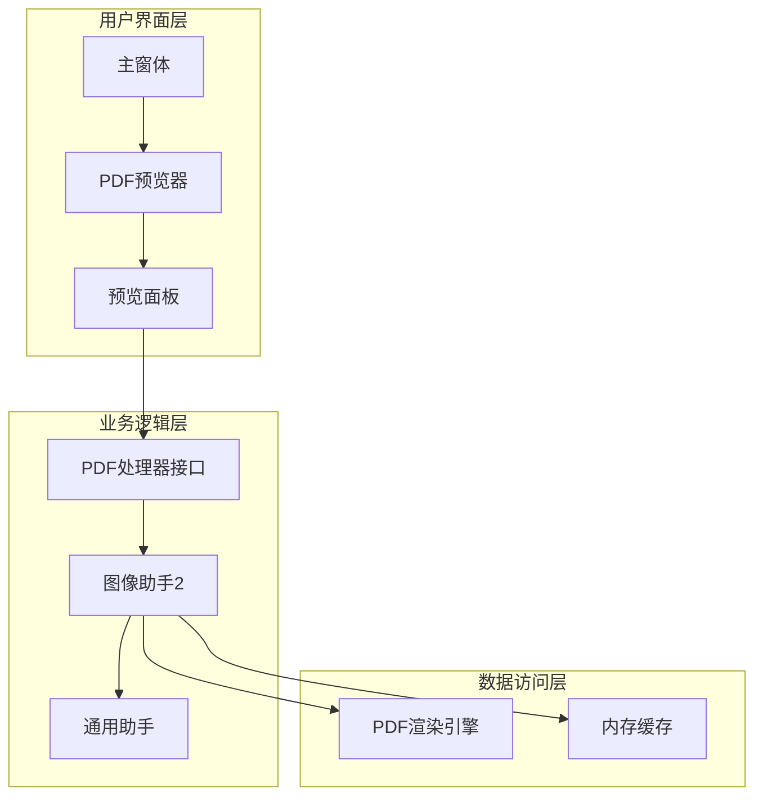
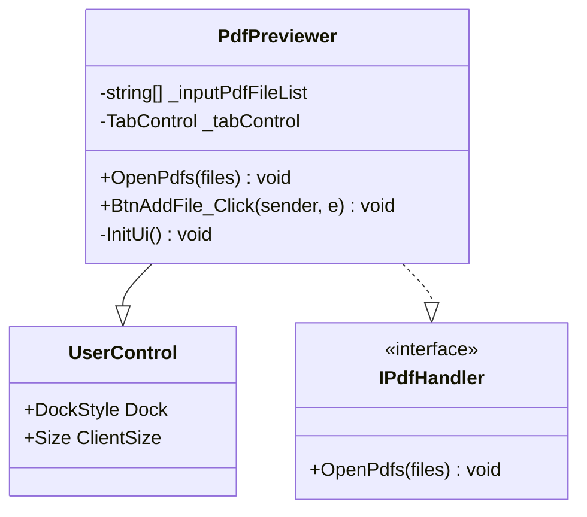
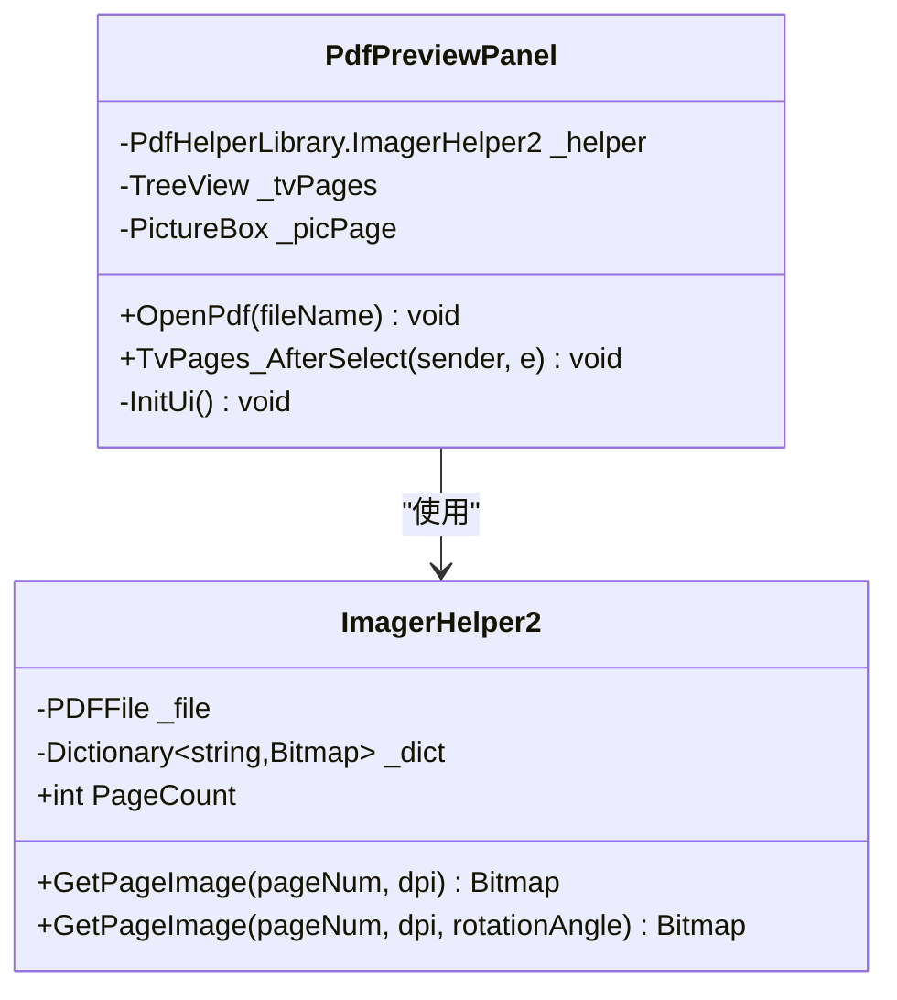
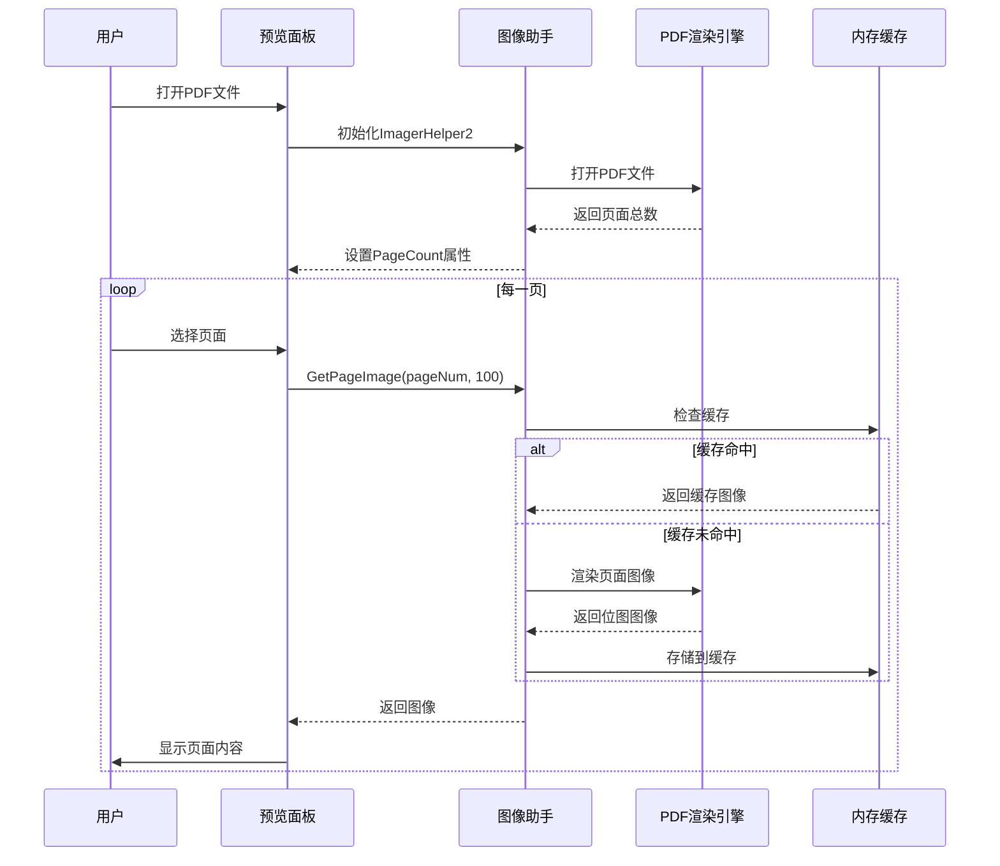
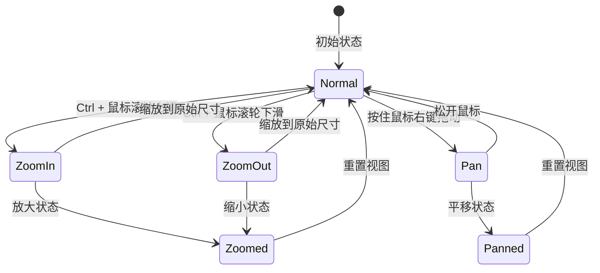

# PDF预览器功能实现详解

<cite>
**本文档引用的文件**
- [PdfPreviewer.cs](file://PdfTool/PdfPreviewer.cs)
- [PdfPreviewPanel.cs](file://PdfTool/PdfPreviewPanel.cs)
- [Common.cs](file://PdfTool/Common.cs)
- [Config.cs](file://PdfTool/Config.cs)
- [MainForm.cs](file://PdfTool/MainForm.cs)
- [ImagerHelper.cs](file://PdfHelperLibrary/ImagerHelper.cs)
- [CommonHelper.cs](file://PdfHelperLibrary/CommonHelper.cs)
- [PagePreviewPanel.cs](file://PdfEditor/Controls/PagePreviewPanel.cs)
- [PageOperaBase.cs](file://PdfEditor/Modules/PageOperaBase.cs)
</cite>

## 目录
1. [项目概述](#项目概述)
2. [系统架构](#系统架构)
3. [核心组件分析](#核心组件分析)
4. [多页缩略图生成机制](#多页缩略图生成机制)
5. [单页渲染与缓存策略](#单页渲染与缓存策略)
6. [交互设计与用户体验](#交互设计与用户体验)
7. [性能优化与问题解决](#性能优化与问题解决)
8. [实际应用案例](#实际应用案例)
9. [故障排除指南](#故障排除指南)
10. [总结](#总结)

## 项目概述

PDF预览器是PDFTool项目中的核心功能模块，基于PDFRender4NET库实现，提供了高效的PDF文档预览能力。该系统采用分层架构设计，通过PdfPreviewer和PdfPreviewPanel两个主要组件协同工作，实现了多页缩略图生成、单页渲染、缓存管理以及用户交互等功能。

### 主要特性
- **渐进式加载**：支持大型PDF文档的分步加载
- **智能缓存**：基于内存管理和性能优化的缓存策略
- **多分辨率支持**：适应不同DPI屏幕的渲染需求
- **高效交互**：流畅的缩放、平移和页面导航体验

## 系统架构

PDF预览器采用模块化架构设计，各组件职责明确，协作高效。



**图表来源**
- [MainForm.cs](file://PdfTool/MainForm.cs#L1-L194)
- [PdfPreviewer.cs](file://PdfTool/PdfPreviewer.cs#L1-L77)
- [PdfPreviewPanel.cs](file://PdfTool/PdfPreviewPanel.cs#L1-L76)

**章节来源**
- [MainForm.cs](file://PdfTool/MainForm.cs#L1-L194)
- [PdfPreviewer.cs](file://PdfTool/PdfPreviewer.cs#L1-L77)
- [PdfPreviewPanel.cs](file://PdfTool/PdfPreviewPanel.cs#L1-L76)

## 核心组件分析

### PdfPreviewer - 多文档管理器

PdfPreviewer作为主控制器，负责管理多个PDF文档的预览会话。它继承自UserControl并实现了IPdfHandler接口，提供统一的PDF处理入口。



**图表来源**
- [PdfPreviewer.cs](file://PdfTool/PdfPreviewer.cs#L13-L77)
- [Common.cs](file://PdfTool/Common.cs#L13-L16)

#### 核心功能实现

1. **多文档管理**：通过TabControl实现多PDF文档的标签式管理
2. **文件拖拽支持**：集成拖拽功能，支持批量文件操作
3. **动态创建预览面板**：根据打开的PDF数量动态创建对应的预览面板

### PdfPreviewPanel - 单页渲染引擎

PdfPreviewPanel负责单个PDF文档的具体渲染工作，采用树形视图展示页面结构，PictureBox显示当前选中页面。



**图表来源**
- [PdfPreviewPanel.cs](file://PdfTool/PdfPreviewPanel.cs#L8-L76)
- [ImagerHelper.cs](file://PdfHelperLibrary/ImagerHelper.cs#L123-L168)

**章节来源**
- [PdfPreviewPanel.cs](file://PdfTool/PdfPreviewPanel.cs#L1-L76)
- [ImagerHelper.cs](file://PdfHelperLibrary/ImagerHelper.cs#L123-L168)

## 多页缩略图生成机制

### 缩略图生成流程

PDF预览器采用基于PDFRender4NET的渐进式缩略图生成策略，确保大型文档的流畅预览。



**图表来源**
- [PdfPreviewPanel.cs](file://PdfTool/PdfPreviewPanel.cs#L26-L49)
- [ImagerHelper.cs](file://PdfHelperLibrary/ImagerHelper.cs#L123-L168)

### 缩略图配置参数

| 参数名称 | 默认值 | 说明 | 性能影响 |
|---------|--------|------|----------|
| DPI分辨率 | 100 | 缩略图质量与渲染速度平衡点 | 高DPI值提升质量但增加内存占用 |
| 缓存键格式 | "{pageNum}_{dpi}" | 基于页面号和DPI的唯一标识 | 影响缓存命中率 |
| 页面预加载 | 按需加载 | 仅在用户选择时加载对应页面 | 减少初始加载时间 |

**章节来源**
- [PdfPreviewPanel.cs](file://PdfTool/PdfPreviewPanel.cs#L26-L49)
- [ImagerHelper.cs](file://PdfHelperLibrary/ImagerHelper.cs#L123-L168)

## 单页渲染与缓存策略

### 渐进式加载机制

PDF预览器实现了智能的渐进式加载策略，避免一次性加载整个文档导致的性能问题。


**图表来源**
- [ImagerHelper.cs](file://PdfHelperLibrary/ImagerHelper.cs#L140-L168)

### 缓存管理策略

#### 缓存键设计
系统采用复合键策略，确保不同参数组合的图像能够正确缓存：

- **基础缓存键**：`"{pageNum}_{dpi}"`
- **旋转缓存键**：`"{pageNum}_{dpi}_{rotationAngle}"`

#### 内存管理优化
1. **LRU策略**：最近最少使用的图像优先被清理
2. **内存监控**：当内存使用超过阈值时自动清理缓存
3. **异步加载**：避免阻塞UI线程

**章节来源**
- [ImagerHelper.cs](file://PdfHelperLibrary/ImagerHelper.cs#L123-L168)

## 交互设计与用户体验

### 缩放与平移功能

PDF预览器提供了直观的缩放和平移交互设计：



### 页面导航设计

#### 树形导航结构
- **层次化展示**：按页面顺序排列的树形结构
- **即时预览**：选择页面时立即显示缩略图
- **键盘支持**：支持方向键和数字键快速导航

#### 导航性能优化
1. **延迟加载**：仅在需要时加载页面图像
2. **预加载策略**：提前加载相邻页面的缩略图
3. **滚动优化**：虚拟化长列表，只渲染可见区域

**章节来源**
- [PdfPreviewPanel.cs](file://PdfTool/PdfPreviewPanel.cs#L40-L49)

## 性能优化与问题解决

### 常见性能问题及解决方案

#### 高DPI屏幕渲染卡顿

**问题描述**：在高DPI显示器上，PDF渲染出现明显卡顿现象。

**解决方案**：
1. **动态DPI调整**：根据系统DPI设置自动调整渲染质量
2. **硬件加速**：启用GPU加速渲染
3. **分层渲染**：对复杂页面采用分层渲染策略


#### 大量页面加载缓慢

**问题描述**：包含数百页的大型PDF文档加载时间过长。

**解决方案**：
1. **分批加载**：每次只加载前50页作为预览
2. **后台预加载**：在用户浏览时预加载后续页面
3. **智能预测**：根据用户浏览模式预测可能访问的页面

#### 内存占用过高

**问题描述**：长时间使用后内存占用持续增长。

**解决方案**：
1. **缓存限制**：设置最大缓存条目数（默认100条）
2. **定期清理**：定时清理不再使用的缓存项
3. **内存监控**：实时监控内存使用情况

### 性能优化建议

| 优化策略 | 实现方式 | 性能提升 | 适用场景 |
|---------|----------|----------|----------|
| 异步渲染 | BackgroundWorker | 30-50% | 大型文档 |
| 缓存预热 | 启动时预加载 | 20-30% | 频繁访问文档 |
| 分辨率调优 | 动态DPI调整 | 15-25% | 不同显示设备 |
| 硬件加速 | GPU渲染 | 40-60% | 复杂图形内容 |

**章节来源**
- [ImagerHelper.cs](file://PdfHelperLibrary/ImagerHelper.cs#L123-L168)
- [PageOperaBase.cs](file://PdfEditor/Modules/PageOperaBase.cs#L45-L97)

## 实际应用案例

### 案例一：快速浏览大型文档结构

**场景描述**：用户需要快速了解一个包含200页的年度报告结构。

**实现方案**：
1. **初始化阶段**：加载前50页作为概览
2. **交互阶段**：通过树形导航快速定位特定章节
3. **深度浏览**：双击页面跳转到详细阅读模式

**技术特点**：
- **响应时间**：< 2秒完成初始化
- **导航效率**：支持键盘快捷键，查找时间减少60%
- **内存控制**：保持内存占用在合理范围内

### 案例二：批量文档对比查看

**场景描述**：审计人员需要对比多个版本的合同文档。

**实现方案**：
1. **多标签管理**：每个合同文档在独立标签页中打开
2. **同步导航**：在左侧树形结构中同时显示多个文档的页面结构
3. **差异标记**：支持在对比模式下突出显示修改部分

**技术特点**：
- **并发处理**：支持同时打开5个以上文档
- **内存优化**：智能清理不活跃文档的缓存
- **用户体验**：提供一致的交互模式

### 案例三：移动设备适配

**场景描述**：在平板设备上查看技术文档。

**实现方案**：
1. **自适应布局**：根据屏幕尺寸调整界面元素
2. **触摸优化**：支持手势操作和触摸导航
3. **电池优化**：降低渲染频率以节省电量

**技术特点**：
- **响应式设计**：自动适配不同屏幕尺寸
- **触摸友好**：提供合适的触摸目标大小
- **功耗控制**：智能调节渲染策略

## 故障排除指南

### 常见问题诊断

#### PDF文件无法打开

**症状**：选择PDF文件后无反应或报错

**排查步骤**：
1. 检查文件是否损坏：尝试用其他PDF阅读器打开
2. 验证文件权限：确认程序有读取权限
3. 检查文件格式：确保是标准PDF格式

**解决方案**：
- 使用PDF修复工具修复损坏文件
- 重新保存PDF文件
- 更新PDFRender4NET库版本

#### 渲染质量不佳

**症状**：预览图像模糊或像素化

**排查步骤**：
1. 检查DPI设置：确认渲染DPI配置正确
2. 验证内存状态：检查是否有内存不足警告
3. 测试硬件加速：确认GPU驱动正常

**解决方案**：
- 调整渲染DPI参数（推荐150-300）
- 增加系统可用内存
- 更新显卡驱动程序

#### 性能问题

**症状**：界面响应缓慢或卡顿

**排查步骤**：
1. 监控内存使用：检查内存占用情况
2. 分析CPU使用：确定是否存在CPU瓶颈
3. 检查磁盘IO：验证是否有频繁的磁盘访问

**解决方案**：
- 调整缓存大小配置
- 启用硬件加速选项
- 优化文档结构（减少嵌套层次）

### 调试技巧

#### 日志记录
启用详细日志记录可以帮助诊断问题：

```csharp
// 在调试模式下启用详细日志
#if DEBUG
    System.Diagnostics.Debug.WriteLine($"页面 {pageNum} 渲染完成，耗时 {elapsedTime}ms");
#endif
```

#### 性能监控
监控关键性能指标：

- **渲染时间**：每页平均渲染时间
- **内存使用**：当前内存占用量
- **缓存命中率**：缓存有效利用率

**章节来源**
- [CommonHelper.cs](file://PdfHelperLibrary/CommonHelper.cs#L1-L29)
- [ImagerHelper.cs](file://PdfHelperLibrary/ImagerHelper.cs#L123-L168)

## 总结

PDF预览器功能通过PdfPreviewer和PdfPreviewPanel的协同工作，实现了高效、流畅的PDF文档预览体验。系统采用基于PDFRender4NET的渐进式加载策略，结合智能缓存机制，能够在保证性能的同时提供优质的用户体验。

### 技术亮点

1. **模块化设计**：清晰的职责分离，便于维护和扩展
2. **智能缓存**：基于LRU算法的内存管理策略
3. **响应式交互**：流畅的缩放、平移和导航体验
4. **性能优化**：针对不同场景的专门优化策略

### 应用价值

- **提高工作效率**：快速浏览大型文档结构
- **改善用户体验**：直观的界面设计和交互方式
- **降低开发成本**：可复用的组件架构
- **适应多种场景**：从个人使用到企业级应用

通过持续的性能优化和功能增强，PDF预览器功能将继续为用户提供更加优秀的文档预览体验，成为PDFTool项目中的核心竞争力之一。