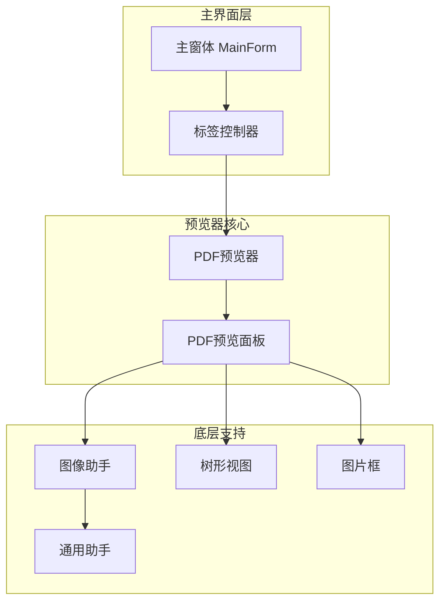
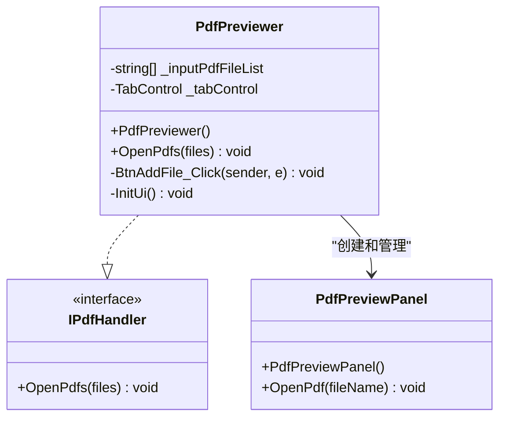
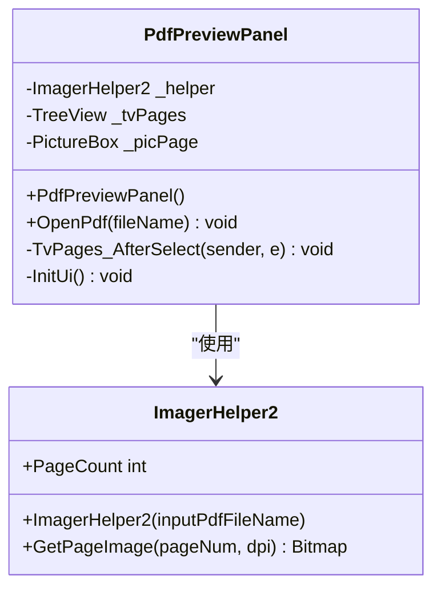
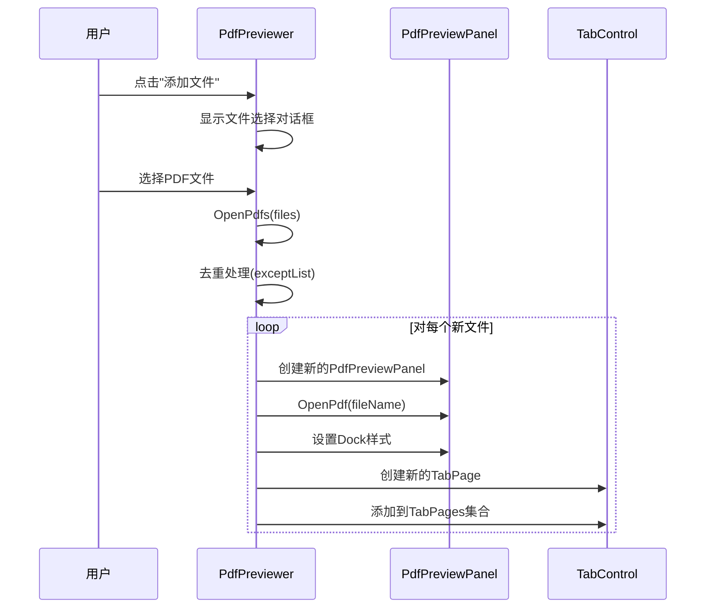
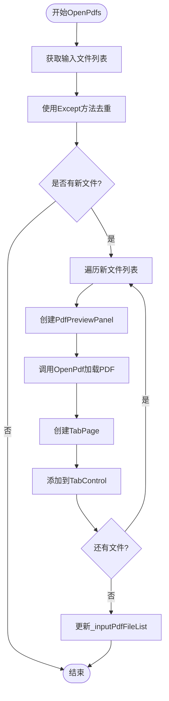
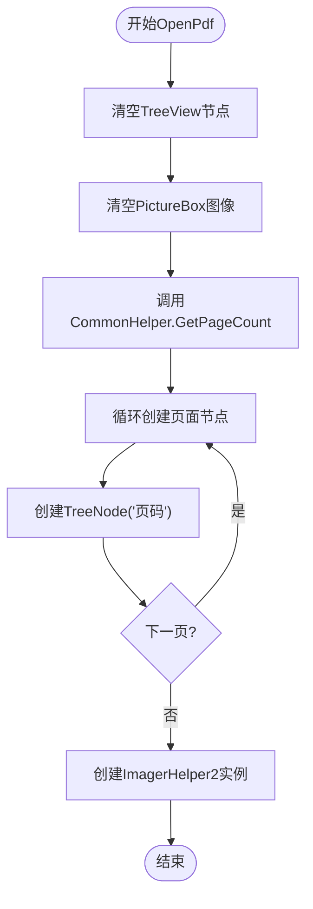
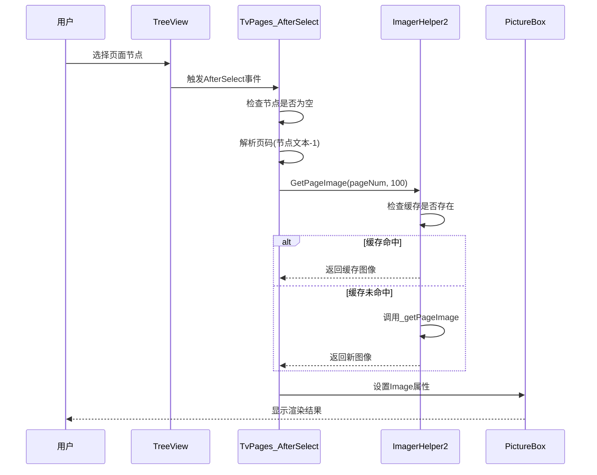
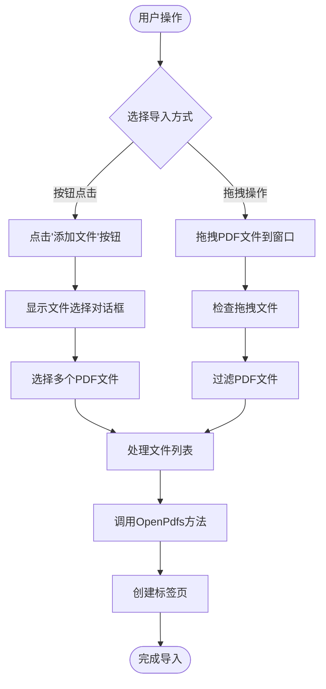
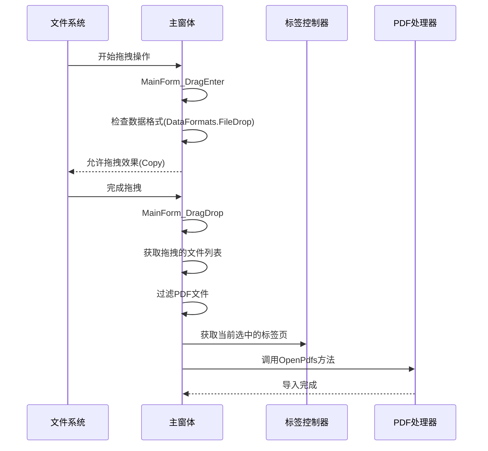
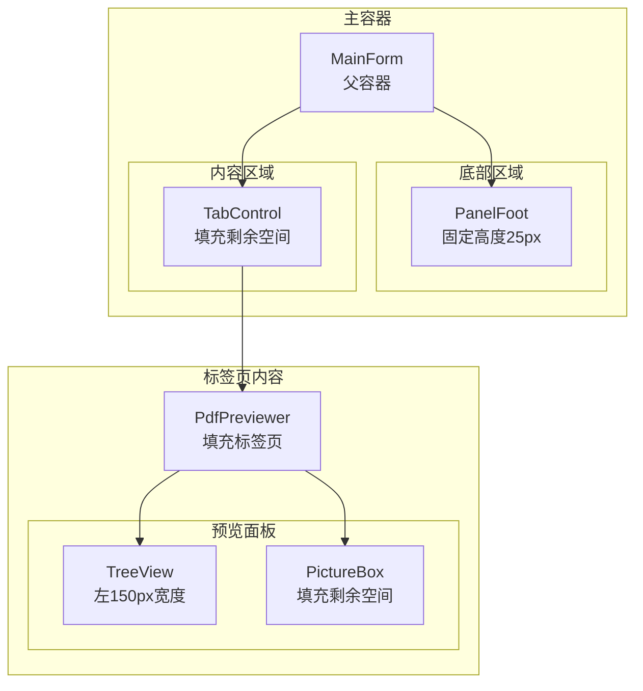

# 基本功能与交互设计

<cite>
**本文档引用的文件**
- [PdfPreviewer.cs](file://PdfTool/PdfPreviewer.cs)
- [PdfPreviewPanel.cs](file://PdfTool/PdfPreviewPanel.cs)
- [MainForm.cs](file://PdfTool/MainForm.cs)
- [Common.cs](file://PdfTool/Common.cs)
- [Config.cs](file://PdfTool/Config.cs)
- [PdfPreviewer.Designer.cs](file://PdfTool/PdfPreviewer.Designer.cs)
- [PdfPreviewPanel.Designer.cs](file://PdfTool/PdfPreviewPanel.Designer.cs)
- [CommonHelper.cs](file://PdfHelperLibrary/CommonHelper.cs)
- [ImagerHelper.cs](file://PdfHelperLibrary/ImagerHelper.cs)
</cite>

## 目录
1. [简介](#简介)
2. [项目架构概览](#项目架构概览)
3. [核心组件分析](#核心组件分析)
4. [多标签页管理系统](#多标签页管理系统)
5. [页面缩略图与渲染机制](#页面缩略图与渲染机制)
6. [用户交互流程](#用户交互流程)
7. [界面布局设计](#界面布局设计)
8. [性能优化考虑](#性能优化考虑)
9. [故障排除指南](#故障排除指南)
10. [总结](#总结)

## 简介

PDF预览器是PDF工具套件中的核心组件，提供了直观的PDF文件预览功能。该系统采用多标签页架构，支持同时打开和预览多个PDF文件，通过TreeView展示页面缩略图列表，并结合PictureBox实现高质量的单页渲染。系统设计注重用户体验，提供了拖拽导入、去重处理等便捷功能。

## 项目架构概览

PDF预览器系统采用模块化架构设计，主要包含以下核心组件：

**图表来源**
- [MainForm.cs](file://PdfTool/MainForm.cs#L135-L163)
- [PdfPreviewer.cs](file://PdfTool/PdfPreviewer.cs#L13-L14)
- [PdfPreviewPanel.cs](file://PdfTool/PdfPreviewPanel.cs#L8-L9)

**章节来源**
- [MainForm.cs](file://PdfTool/MainForm.cs#L135-L163)
- [PdfPreviewer.cs](file://PdfTool/PdfPreviewer.cs#L1-L77)
- [PdfPreviewPanel.cs](file://PdfTool/PdfPreviewPanel.cs#L1-L76)

## 核心组件分析

### PdfPreviewer 预览器组件

PdfPreviewer是整个预览系统的核心控制器，负责管理多个PDF文件的预览会话。该组件实现了IPdfHandler接口，确保与其他PDF处理模块的一致性。

**图表来源**
- [PdfPreviewer.cs](file://PdfTool/PdfPreviewer.cs#L13-L14)
- [Common.cs](file://PdfTool/Common.cs#L12-L16)
- [PdfPreviewPanel.cs](file://PdfTool/PdfPreviewPanel.cs#L8-L9)

### PdfPreviewPanel 预览面板

PdfPreviewPanel是单个PDF文件的预览界面，采用左右布局设计：左侧TreeView展示页面缩略图，右侧PictureBox显示当前选中页面的渲染图像。

**图表来源**
- [PdfPreviewPanel.cs](file://PdfTool/PdfPreviewPanel.cs#L20-L23)
- [ImagerHelper.cs](file://PdfHelperLibrary/ImagerHelper.cs#L123-L168)

**章节来源**
- [PdfPreviewer.cs](file://PdfTool/PdfPreviewer.cs#L13-L77)
- [PdfPreviewPanel.cs](file://PdfTool/PdfPreviewPanel.cs#L8-L76)

## 多标签页管理系统

### 标签页创建机制

PdfPreviewer通过OpenPdfs方法实现多PDF文件的动态管理。系统采用去重策略，避免重复加载相同的PDF文件。

**图表来源**
- [PdfPreviewer.cs](file://PdfTool/PdfPreviewer.cs#L30-L41)
- [PdfPreviewer.cs](file://PdfTool/PdfPreviewer.cs#L46-L50)

### 文件去重逻辑

系统通过LINQ的Except方法实现智能去重，确保同一PDF文件不会在多个标签页中重复出现：

**图表来源**
- [PdfPreviewer.cs](file://PdfTool/PdfPreviewer.cs#L30-L41)

**章节来源**
- [PdfPreviewer.cs](file://PdfTool/PdfPreviewer.cs#L30-L41)

## 页面缩略图与渲染机制

### TreeView页面索引构建

PdfPreviewPanel通过TreeView控件展示PDF页面的缩略图列表。系统首先获取PDF文件的总页数，然后为每一页创建一个TreeNode节点。

**图表来源**
- [PdfPreviewPanel.cs](file://PdfTool/PdfPreviewPanel.cs#L26-L35)

### 页面渲染与缓存机制

当用户在TreeView中选择特定页面时，TvPages_AfterSelect事件处理器被触发，通过ImagerHelper2获取对应页面的图像并显示在PictureBox中。

**图表来源**
- [PdfPreviewPanel.cs](file://PdfTool/PdfPreviewPanel.cs#L40-L48)
- [ImagerHelper.cs](file://PdfHelperLibrary/ImagerHelper.cs#L123-L168)

### 图像缓存优化

ImagerHelper2实现了智能缓存机制，通过字典存储已渲染的页面图像，避免重复计算：

| 缓存键格式 | 描述 | 示例 |
|------------|------|------|
| `{pageNum}_{dpi}` | 基础缓存键 | `0_100` |
| `{pageNum}_{dpi}_{rotationAngle}` | 旋转缓存键 | `0_100_90` |

**章节来源**
- [PdfPreviewPanel.cs](file://PdfTool/PdfPreviewPanel.cs#L26-L48)
- [ImagerHelper.cs](file://PdfHelperLibrary/ImagerHelper.cs#L123-L168)

## 用户交互流程

### 文件导入方式

系统提供多种文件导入方式，满足不同用户的操作习惯：

**图表来源**
- [PdfPreviewer.cs](file://PdfTool/PdfPreviewer.cs#L46-L50)
- [MainForm.cs](file://PdfTool/MainForm.cs#L33-L59)

### 拖拽功能实现

系统实现了完整的拖拽功能，支持从文件资源管理器直接拖拽PDF文件到主窗体：

**图表来源**
- [MainForm.cs](file://PdfTool/MainForm.cs#L33-L59)

**章节来源**
- [PdfPreviewer.cs](file://PdfTool/PdfPreviewer.cs#L46-L50)
- [MainForm.cs](file://PdfTool/MainForm.cs#L33-L59)

## 界面布局设计

### 控件锚点设置

系统采用锚点布局系统，确保界面在不同分辨率下保持良好的适配性：

| 控件类型 | 锚点设置 | 布局策略 |
|----------|----------|----------|
| 添加文件按钮 | `AnchorStyles.Left \| AnchorStyles.Top` | 固定左上角位置 |
| TabControl | `AnchorStyles.Left \| AnchorStyles.Top \| AnchorStyles.Right \| AnchorStyles.Bottom` | 流式布局，随窗口大小变化 |

### 父子容器关系

界面层次结构清晰，遵循Windows Forms的容器控件设计原则：

**图表来源**
- [MainForm.cs](file://PdfTool/MainForm.cs#L87-L133)
- [PdfPreviewer.cs](file://PdfTool/PdfPreviewer.cs#L66-L72)
- [PdfPreviewPanel.cs](file://PdfTool/PdfPreviewPanel.cs#L55-L71)

### 边距与间距配置

系统采用统一的边距配置，确保界面元素之间的协调性：

| 配置项 | 数值 | 用途 |
|--------|------|------|
| ControlMargin | 20px | 控件外边距 |
| ControlPadding | 12px | 控件内边距 |

**章节来源**
- [MainForm.cs](file://PdfTool/MainForm.cs#L87-L133)
- [PdfPreviewer.cs](file://PdfTool/PdfPreviewer.cs#L66-L72)
- [PdfPreviewPanel.cs](file://PdfTool/PdfPreviewPanel.cs#L55-L71)
- [Config.cs](file://PdfTool/Config.cs#L1-L9)

## 性能优化考虑

### 内存管理策略

系统在内存管理方面采用了多项优化措施：

1. **延迟加载**: 只有在用户选择特定页面时才加载对应的图像
2. **智能缓存**: ImagerHelper2使用字典缓存已渲染的页面，避免重复计算
3. **资源释放**: 实现了Dispose模式，确保非托管资源得到及时释放

### 渲染性能优化

- **DPI设置**: 默认使用100 DPI进行页面渲染，在质量和性能之间取得平衡
- **缩放模式**: PictureBox采用Zoom模式，自动调整图像大小以适应容器
- **异步处理**: 对于大型PDF文件，可以考虑引入后台线程处理

## 故障排除指南

### 常见问题及解决方案

| 问题类型 | 症状 | 可能原因 | 解决方案 |
|----------|------|----------|----------|
| 文件无法打开 | 抛出PdfReaderException | PDF文件损坏或格式不支持 | 检查文件完整性，尝试修复 |
| 内存占用过高 | 应用程序响应缓慢 | 缓存过多页面图像 | 实现LRU缓存策略 |
| 渲染速度慢 | 页面切换卡顿 | DPI设置过高 | 降低默认DPI值 |
| 标签页重复 | 同一文件出现在多个标签页 | 去重逻辑失效 | 检查_exceptList逻辑 |

### 调试和监控

系统在调试模式下提供了额外的功能：
- 双击标签页可重新初始化对应模块
- 详细的页面选择日志输出
- 异常信息的完整堆栈跟踪

**章节来源**
- [CommonHelper.cs](file://PdfHelperLibrary/CommonHelper.cs#L1-L28)
- [ImagerHelper.cs](file://PdfHelperLibrary/ImagerHelper.cs#L123-L168)

## 总结

PDF预览器系统通过精心设计的架构和交互流程，为用户提供了高效、直观的PDF文件预览体验。系统的主要优势包括：

1. **模块化设计**: 清晰的组件分离，便于维护和扩展
2. **智能去重**: 避免重复加载相同文件，提高系统效率
3. **缓存机制**: ImagerHelper2的智能缓存显著提升渲染性能
4. **灵活布局**: 响应式设计适应不同屏幕尺寸
5. **多样化输入**: 支持按钮点击和拖拽两种文件导入方式

该系统不仅满足了基本的PDF预览需求，还为后续的功能扩展奠定了坚实的基础。通过合理的架构设计和性能优化，确保了系统的稳定性和用户体验的流畅性。