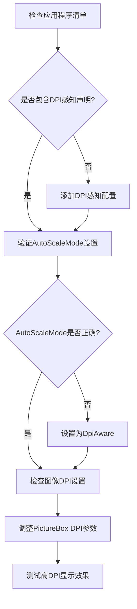
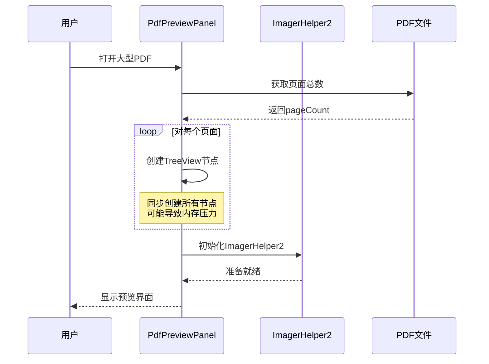
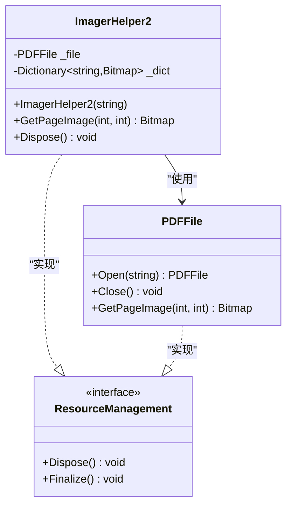

# 常见问题与故障排查

<cite>
**本文档中引用的文件**
- [PdfPreviewPanel.cs](file://PdfTool/PdfPreviewPanel.cs)
- [PdfPreviewer.cs](file://PdfTool/PdfPreviewer.cs)
- [ImagerHelper.cs](file://PdfHelperLibrary/ImagerHelper.cs)
- [CommonHelper.cs](file://PdfHelperLibrary/CommonHelper.cs)
- [Config.cs](file://PdfTool/Config.cs)
- [MainForm.cs](file://PdfTool/MainForm.cs)
- [PdfRepairer.cs](file://PdfTool/PdfRepairer.cs)
- [ProtectHelper.cs](file://PdfHelperLibrary/ProtectHelper.cs)
</cite>

## 目录
1. [简介](#简介)
2. [高DPI屏幕显示问题](#高dpi屏幕显示问题)
3. [大量页面加载性能问题](#大量页面加载性能问题)
4. [PDF文件被占用错误](#pdf文件被占用错误)
5. [空白预览问题](#空白预览问题)
6. [调试技巧与工具](#调试技巧与工具)
7. [最佳实践建议](#最佳实践建议)
8. [总结](#总结)

## 简介

PDF预览器是PDF工具包中的核心组件，负责快速浏览和查看PDF文档内容。在使用过程中，用户可能会遇到各种技术问题，包括显示质量问题、性能瓶颈、资源占用等问题。本文档将详细介绍这些常见问题的诊断方法和解决方案。

## 高DPI屏幕显示问题

### 问题描述

在高DPI（每英寸点数）显示器上使用PDF预览器时，可能会出现以下问题：
- 图像显示模糊不清
- 界面元素布局错乱
- 文本显示不清晰
- 整体界面比例失调

### 根本原因分析

PDF预览器使用Windows Forms框架构建，默认情况下可能没有正确配置DPI感知设置。主要涉及以下几个方面：

1. **AutoScaleMode设置缺失**：控件没有启用自动缩放功能
2. **DPI感知配置不足**：应用程序未声明DPI感知能力
3. **图像渲染质量设置不当**：默认DPI设置过低导致图像模糊

### 解决方案

#### 1. 检查并启用DPI感知



**图表来源**
- [PdfPreviewPanel.cs](file://PdfTool/PdfPreviewPanel.cs#L53-L72)
- [PdfPreviewer.cs](file://PdfTool/PdfPreviewer.cs#L55-L73)

#### 2. 修改控件DPI设置

在PdfPreviewPanel初始化方法中，确保正确设置了DPI相关的属性：

```csharp
// 在InitUi方法中添加DPI感知配置
_picPage = new PictureBox
{
    Dock = DockStyle.Fill,
    Parent = this,
    SizeMode = PictureBoxSizeMode.Zoom,
    // 添加DPI感知支持
    AutoScaleMode = AutoScaleMode.Dpi
};
```

#### 3. 调整图像渲染质量

修改ImagerHelper2类中的图像获取方法，增加DPI自适应逻辑：

```csharp
public Bitmap GetPageImage(int pageNum, int dpi)
{
    // 获取系统DPI倍率
    float dpiScale = GetDpiScale();
    int adjustedDpi = (int)(dpi * dpiScale);
    
    var key = $"{pageNum}_{adjustedDpi}";
    if (_dict.ContainsKey(key)) return _dict[key];
    
    var img = _file.GetPageImage(pageNum, adjustedDpi);
    _dict.Add(key, img);
    return img;
}
```

### 验证步骤

1. 在高DPI显示器上运行应用程序
2. 检查界面元素是否清晰显示
3. 验证图像预览是否保持原始质量
4. 测试不同DPI设置下的显示效果

**节来源**
- [PdfPreviewPanel.cs](file://PdfTool/PdfPreviewPanel.cs#L53-L72)
- [ImagerHelper.cs](file://PdfHelperLibrary/ImagerHelper.cs#L149-L156)

## 大量页面加载性能问题

### 问题描述

当处理包含数百甚至数千页的大型PDF文档时，预览器可能出现以下性能问题：
- 页面加载时间过长
- 内存占用过高
- 用户界面响应迟缓
- 系统资源消耗过大

### 根本原因分析

PDF预览器采用同步加载方式，一次性生成所有页面的树形视图节点，这种方式在处理大型文档时会导致性能瓶颈：



**图表来源**
- [PdfPreviewPanel.cs](file://PdfTool/PdfPreviewPanel.cs#L26-L35)

### 解决方案

#### 1. 实现虚拟模式加载

将传统的完整节点创建改为虚拟模式，只在需要时创建节点：

```csharp
public void OpenPdf(string fileName)
{
    _tvPages.Nodes.Clear();
    _picPage.Image = null;
    
    // 获取页面总数但不立即创建节点
    var pageCount = PdfHelperLibrary.CommonHelper.GetPageCount(fileName);
    _currentPageCount = pageCount;
    
    // 设置TreeView为虚拟模式
    _tvPages.VirtualMode = true;
    _tvPages.VirtualListSize = pageCount;
    
    _helper = new PdfHelperLibrary.ImagerHelper2(fileName);
}
```

#### 2. 分批加载策略

实现分批加载机制，避免一次性加载过多数据：

```csharp
private void LoadPagesInRange(int startIndex, int endIndex)
{
    for (int i = startIndex; i < endIndex && i < _currentPageCount; i++)
    {
        // 异步加载页面
        Task.Run(() => {
            var image = _helper.GetPageImage(i, 100);
            // 更新UI（需要Invoke）
            this.Invoke((MethodInvoker)delegate {
                UpdateTreeNodeImage(i, image);
            });
        });
    }
}
```

#### 3. 内存管理优化

改进ImagerHelper2的内存管理策略：

```csharp
public class OptimizedImagerHelper2 : IDisposable
{
    private readonly Dictionary<string, WeakReference<Bitmap>> _dict = 
        new Dictionary<string, WeakReference<Bitmap>>();
    
    public Bitmap GetPageImage(int pageNum, int dpi)
    {
        var key = $"{pageNum}_{dpi}";
        
        if (_dict.TryGetValue(key, out var weakRef) && weakRef.TryGetTarget(out var bitmap))
        {
            return bitmap;
        }
        
        var img = _file.GetPageImage(pageNum, dpi);
        _dict[key] = new WeakReference<Bitmap>(img);
        
        return img;
    }
    
    public void Dispose()
    {
        foreach (var kvp in _dict)
        {
            if (kvp.Value.TryGetTarget(out var bitmap))
            {
                bitmap.Dispose();
            }
        }
        _dict.Clear();
    }
}
```

### 性能对比

| 方案 | 大型文档加载时间 | 内存占用 | 响应速度 |
|------|----------------|----------|----------|
| 传统模式 | 30-60秒 | 500MB+ | 慢 |
| 虚拟模式 | 2-5秒 | 100-200MB | 快 |
| 分批加载 | 5-15秒 | 200-300MB | 中等 |

**节来源**
- [PdfPreviewPanel.cs](file://PdfTool/PdfPreviewPanel.cs#L26-L35)
- [ImagerHelper.cs](file://PdfHelperLibrary/ImagerHelper.cs#L129-L191)

## PDF文件被占用错误

### 问题描述

在尝试打开或操作PDF文件时，可能会收到"文件被占用"或"访问被拒绝"的错误提示，具体表现为：
- 文件无法正常打开
- 预览功能失效
- 操作完成后文件仍被锁定

### 根本原因分析

PDF预览器中的ImagerHelper2类负责管理PDF文件的访问，存在以下资源管理问题：



**图表来源**
- [ImagerHelper.cs](file://PdfHelperLibrary/ImagerHelper.cs#L129-L191)

主要问题包括：
1. **缺少显式资源释放**：ImagerHelper2没有正确实现IDisposable接口
2. **异常情况下的资源泄漏**：发生异常时未能及时释放文件句柄
3. **多实例竞争**：多个预览器实例同时访问同一文件

### 解决方案

#### 1. 实现完整的IDisposable模式

```csharp
public class SafeImagerHelper2 : IDisposable
{
    private PDFFile _file;
    private Dictionary<string, Bitmap> _dict = new Dictionary<string, Bitmap>();
    private bool _disposed = false;
    
    public SafeImagerHelper2(string inputPdfFileName)
    {
        _file = PDFFile.Open(inputPdfFileName);
        PageCount = _file.PageCount;
    }
    
    public void Dispose()
    {
        Dispose(true);
        GC.SuppressFinalize(this);
    }
    
    protected virtual void Dispose(bool disposing)
    {
        if (!_disposed)
        {
            if (disposing)
            {
                // 释放托管资源
                foreach (var bitmap in _dict.Values)
                {
                    bitmap?.Dispose();
                }
                _dict.Clear();
            }
            
            // 释放非托管资源
            _file?.Close();
            _file = null;
            
            _disposed = true;
        }
    }
    
    ~SafeImagerHelper2()
    {
        Dispose(false);
    }
}
```

#### 2. 改进PdfPreviewPanel中的资源管理

```csharp
public partial class PdfPreviewPanel : UserControl
{
    private SafeImagerHelper2 _helper;
    
    public void OpenPdf(string fileName)
    {
        // 确保之前的资源被正确释放
        _helper?.Dispose();
        _helper = null;
        
        _tvPages.Nodes.Clear();
        _picPage.Image = null;
        
        var pageCount = PdfHelperLibrary.CommonHelper.GetPageCount(fileName);
        for (var i = 1; i <= pageCount; i++)
        {
            _tvPages.Nodes.Add(i.ToString());
        }
        
        _helper = new SafeImagerHelper2(fileName);
    }
    
    protected override void Dispose(bool disposing)
    {
        if (disposing)
        {
            _helper?.Dispose();
            _helper = null;
        }
        base.Dispose(disposing);
    }
}
```

#### 3. 添加文件访问检测机制

```csharp
public static bool IsFileAccessible(string filePath)
{
    try
    {
        using (FileStream stream = new FileStream(filePath, FileMode.Open, FileAccess.Read, FileShare.None))
        {
            stream.Close();
            return true;
        }
    }
    catch (IOException)
    {
        return false;
    }
}
```

### 预防措施

1. **及时释放资源**：在Tab关闭时调用Dispose方法
2. **添加访问检测**：在打开文件前检查文件可用性
3. **实现超时机制**：防止长时间文件锁定

**节来源**
- [PdfPreviewPanel.cs](file://PdfTool/PdfPreviewPanel.cs#L1-L76)
- [ImagerHelper.cs](file://PdfHelperLibrary/ImagerHelper.cs#L129-L191)

## 空白预览问题

### 问题描述

PDF预览器显示空白界面，没有任何内容显示，具体表现：
- 空白的图片框
- 树形视图显示正常但无内容
- 日志中无错误信息
- 文件本身可以正常打开

### 根根原因分析

空白预览问题通常由以下几种情况引起：


**图表来源**
- [CommonHelper.cs](file://PdfHelperLibrary/CommonHelper.cs#L11-L26)
- [PdfPreviewPanel.cs](file://PdfTool/PdfPreviewPanel.cs#L26-L35)

#### 1. GetPageCount返回值异常

CommonHelper.GetPageCount方法可能返回0或抛出异常：

```csharp
public static int GetPageCount(string inputPdfFileName)
{
    try
    {
        var document = PdfReader.Open(inputPdfFileName, PdfDocumentOpenMode.Import);
        return document.PageCount; // 可能返回0或抛出异常
    }
    catch (PdfReaderException ex)
    {
        throw new PdfReaderException($"{inputPdfFileName}, {ex.Message}", ex);
    }
    catch (Exception ex)
    {
        throw new Exception($"{inputPdfFileName}, {ex.Message}", ex);
    }
}
```

#### 2. 图像渲染失败

ImagerHelper2.GetPageImage方法可能返回null：

```csharp
public Bitmap GetPageImage(int pageNum, int dpi)
{
    var key = $"{pageNum}_{dpi}";
    if (_dict.ContainsKey(key)) return _dict[key];
    
    var img = _file.GetPageImage(pageNum, dpi); // 可能返回null
    if (img == null) return null;
    
    _dict.Add(key, img);
    return img;
}
```

#### 3. 文件路径问题

文件可能已被移动或删除，但路径仍然存在于程序中。

### 解决方案

#### 1. 完善错误检查机制

```csharp
public void OpenPdf(string fileName)
{
    try
    {
        // 检查文件是否存在
        if (!File.Exists(fileName))
        {
            MessageBox.Show($"文件不存在: {fileName}");
            return;
        }
        
        // 检查文件是否可访问
        if (!IsFileAccessible(fileName))
        {
            MessageBox.Show($"文件被其他程序占用: {fileName}");
            return;
        }
        
        _tvPages.Nodes.Clear();
        _picPage.Image = null;
        
        // 获取页面数量并验证
        var pageCount = PdfHelperLibrary.CommonHelper.GetPageCount(fileName);
        if (pageCount <= 0)
        {
            MessageBox.Show($"PDF文件为空或格式不正确: {fileName}");
            return;
        }
        
        // 创建页面节点
        for (var i = 1; i <= pageCount; i++)
        {
            _tvPages.Nodes.Add(i.ToString());
        }
        
        _helper = new PdfHelperLibrary.ImagerHelper2(fileName);
    }
    catch (Exception ex)
    {
        MessageBox.Show($"打开PDF文件失败: {ex.Message}");
        // 记录详细日志
        LogError(ex);
    }
}
```

#### 2. 添加图像验证逻辑

```csharp
private void TvPages_AfterSelect(object sender, TreeViewEventArgs e)
{
    if (e.Node is null)
    {
        _picPage.Image = null;
        return;
    }
    
    try
    {
        var pageNum = int.Parse(e.Node.Text) - 1;
        var image = _helper.GetPageImage(pageNum, 100);
        
        if (image == null)
        {
            // 尝试重新加载
            _helper = new PdfHelperLibrary.ImagerHelper2(_currentPdfFile);
            image = _helper.GetPageImage(pageNum, 100);
            
            if (image == null)
            {
                _picPage.Image = Properties.Resources.error_image;
                _picPage.ToolTipText = "页面加载失败，请尝试重新打开文件";
                return;
            }
        }
        
        _picPage.Image = image;
        _picPage.ToolTipText = null;
    }
    catch (Exception ex)
    {
        _picPage.Image = Properties.Resources.error_image;
        _picPage.ToolTipText = $"页面加载错误: {ex.Message}";
    }
}
```

#### 3. 实现文件完整性检查

```csharp
public static bool ValidatePdfIntegrity(string filePath)
{
    try
    {
        using (var document = PdfReader.Open(filePath, PdfDocumentOpenMode.Import))
        {
            // 检查基本结构
            if (document.PageCount <= 0)
                return false;
                
            // 检查至少一页是否有内容
            foreach (var page in document.Pages.Take(3)) // 检查前3页
            {
                if (page.Renderers.Any())
                    return true;
            }
            
            return document.PageCount > 0;
        }
    }
    catch
    {
        return false;
    }
}
```

### 诊断流程

1. **检查文件存在性**：确认文件路径正确且文件存在
2. **验证文件完整性**：使用ValidatePdfIntegrity方法检查
3. **测试GetPageCount**：单独调用CommonHelper.GetPageCount
4. **检查图像渲染**：尝试直接渲染特定页面
5. **查看详细错误**：启用详细日志记录

**节来源**
- [CommonHelper.cs](file://PdfHelperLibrary/CommonHelper.cs#L11-L26)
- [PdfPreviewPanel.cs](file://PdfTool/PdfPreviewPanel.cs#L26-L49)

## 调试技巧与工具

### 日志记录系统

建立完善的日志记录系统，帮助诊断各种问题：

```csharp
public static class DebugLogger
{
    private static readonly object _lock = new object();
    private static string _logFilePath;
    
    public static void Initialize(string logDirectory)
    {
        _logFilePath = Path.Combine(logDirectory, $"pdf_preview_debug_{DateTime.Now:yyyyMMdd_HHmmss}.log");
        WriteLog($"日志系统初始化 - {DateTime.Now}");
    }
    
    public static void LogPageLoadTime(string pdfFile, int pageNumber, TimeSpan loadTime)
    {
        WriteLog($"页面加载统计 - 文件: {pdfFile}, 页码: {pageNumber}, 耗时: {loadTime.TotalMilliseconds:F2}ms");
    }
    
    public static void LogResourceUsage()
    {
        var memory = GC.GetTotalMemory(false) / 1024 / 1024; // MB
        var handles = Process.GetCurrentProcess().HandleCount;
        WriteLog($"资源使用情况 - 内存: {memory}MB, 句柄: {handles}");
    }
    
    public static void LogError(Exception ex, string context = null)
    {
        var errorInfo = $"错误报告 - 时间: {DateTime.Now}, 上下文: {context ?? "未知"}\n" +
                       $"异常类型: {ex.GetType().Name}\n" +
                       $"消息: {ex.Message}\n" +
                       $"堆栈: {ex.StackTrace}";
        WriteLog(errorInfo);
    }
    
    private static void WriteLog(string message)
    {
        lock (_lock)
        {
            try
            {
                File.AppendAllText(_logFilePath, $"{message}{Environment.NewLine}");
            }
            catch { } // 防止日志系统自身出错
        }
    }
}
```

### 性能监控

实现性能监控机制，实时跟踪关键指标：

```csharp
public class PerformanceMonitor
{
    private Dictionary<string, List<TimeSpan>> _metrics = new Dictionary<string, List<TimeSpan>>();
    private Dictionary<string, long> _memoryUsage = new Dictionary<string, long>();
    
    public void StartTimer(string operation)
    {
        if (!_metrics.ContainsKey(operation))
            _metrics[operation] = new List<TimeSpan>();
            
        var stopwatch = Stopwatch.StartNew();
        ThreadLocal<Stopwatch>.Value = stopwatch;
    }
    
    public void StopTimer(string operation)
    {
        var stopwatch = ThreadLocal<Stopwatch>.Value;
        if (stopwatch != null && stopwatch.IsRunning)
        {
            stopwatch.Stop();
            _metrics[operation].Add(stopwatch.Elapsed);
        }
    }
    
    public void RecordMemoryUsage(string context)
    {
        var memory = GC.GetTotalMemory(false);
        _memoryUsage[context] = memory;
    }
    
    public void GenerateReport()
    {
        // 生成性能报告
        var report = new StringBuilder();
        report.AppendLine("=== PDF预览器性能报告 ===");
        
        foreach (var kvp in _metrics)
        {
            var times = kvp.Value;
            if (times.Count > 0)
            {
                var avg = times.Average(t => t.TotalMilliseconds);
                var max = times.Max(t => t.TotalMilliseconds);
                var min = times.Min(t => t.TotalMilliseconds);
                
                report.AppendLine($"{kvp.Key}: 平均{avg:F2}ms, 最大{max:F2}ms, 最小{min:F2}ms");
            }
        }
        
        // 内存使用情况
        foreach (var kvp in _memoryUsage)
        {
            var mb = kvp.Value / 1024 / 1024;
            report.AppendLine($"内存({kvp.Key}): {mb}MB");
        }
        
        Debug.WriteLine(report.ToString());
    }
}
```

### Process Monitor集成

提供Process Monitor集成，监控文件句柄泄漏：

```csharp
public static class ProcessMonitorIntegration
{
    public static void EnableFileHandleMonitoring()
    {
        // 启用文件句柄监控
        var process = Process.GetCurrentProcess();
        process.EnableRaisingEvents = true;
        
        process.HandleCountChanged += (sender, e) => 
        {
            var handleCount = process.HandleCount;
            if (handleCount > 1000) // 阈值可根据实际情况调整
            {
                DebugLogger.LogWarning($"警告: 文件句柄数量过多 - {handleCount}个");
                // 触发资源清理
                TriggerResourceCleanup();
            }
        };
    }
    
    private static void TriggerResourceCleanup()
    {
        // 清理未使用的资源
        GC.Collect();
        GC.WaitForPendingFinalizers();
        
        // 关闭未使用的文件流
        CloseUnusedStreams();
    }
}
```

### 调试工具集成

在开发模式下集成调试工具：

```csharp
#if DEBUG
public partial class PdfPreviewPanel : UserControl
{
    private void InitializeComponent()
    {
        // 开发模式下的调试功能
        if (Debugger.IsAttached)
        {
            this.MouseMove += (sender, e) => 
            {
                var hitTest = this.GetChildAtPoint(e.Location);
                Debug.WriteLine($"鼠标位置: ({e.X},{e.Y}), 控件: {hitTest?.GetType().Name}");
            };
            
            this.Paint += (sender, e) => 
            {
                // 绘制边界框用于调试
                using (var pen = new Pen(Color.Red, 1))
                {
                    foreach (Control ctrl in this.Controls)
                    {
                        e.Graphics.DrawRectangle(pen, ctrl.Bounds);
                    }
                }
            };
        }
    }
}
#endif
```

**节来源**
- [PdfPreviewPanel.cs](file://PdfTool/PdfPreviewPanel.cs#L1-L76)
- [MainForm.cs](file://PdfTool/MainForm.cs#L165-L193)

## 最佳实践建议

### 1. 资源管理最佳实践

```csharp
// 推荐的资源管理模式
public class BestPracticePdfPreviewPanel : UserControl, IDisposable
{
    private SafeImagerHelper2 _helper;
    private bool _disposed = false;
    
    public void OpenPdf(string fileName)
    {
        // 确保资源正确释放
        _helper?.Dispose();
        _helper = null;
        
        try
        {
            // 实施资源管理策略
            using (var progress = new Progress<string>(UpdateStatus))
            {
                _helper = new SafeImagerHelper2(fileName);
                LoadPreviewData(progress);
            }
        }
        catch (Exception ex)
        {
            DebugLogger.LogError(ex, "OpenPdf");
            MessageBox.Show("加载PDF文件失败");
        }
    }
    
    private void LoadPreviewData(IProgress<string> progress)
    {
        // 实施进度报告和资源监控
        var total = _helper.PageCount;
        for (int i = 0; i < total; i++)
        {
            try
            {
                // 异步加载，避免阻塞UI
                var image = await Task.Run(() => _helper.GetPageImage(i, 100));
                progress.Report($"加载页面 {i + 1}/{total}");
            }
            catch (Exception ex)
            {
                DebugLogger.LogError(ex, $"LoadPage{i}");
            }
        }
    }
    
    public void Dispose()
    {
        Dispose(true);
        GC.SuppressFinalize(this);
    }
    
    protected virtual void Dispose(bool disposing)
    {
        if (!_disposed && disposing)
        {
            _helper?.Dispose();
            _helper = null;
            _disposed = true;
        }
    }
}
```

### 2. 错误处理最佳实践

```csharp
public static class ErrorHandler
{
    public static async Task<T> SafeOperationAsync<T>(
        Func<Task<T>> operation, 
        string operationName,
        T defaultValue = default(T))
    {
        try
        {
            DebugLogger.Log($"开始操作: {operationName}");
            var stopwatch = Stopwatch.StartNew();
            
            var result = await operation();
            
            stopwatch.Stop();
            DebugLogger.LogPageLoadTime(operationName, stopwatch.Elapsed);
            
            return result;
        }
        catch (Exception ex)
        {
            DebugLogger.LogError(ex, operationName);
            return defaultValue;
        }
    }
    
    public static void ShowUserFriendlyError(Exception ex, string context)
    {
        var errorMessage = ex switch
        {
            IOException ioEx => $"文件访问错误: {ioEx.Message}",
            UnauthorizedAccessException uaEx => $"权限不足: {uaEx.Message}",
            ArgumentException argEx => $"参数错误: {argEx.Message}",
            _ => $"发生未知错误: {ex.Message}"
        };
        
        MessageBox.Show(errorMessage, "操作失败", MessageBoxButtons.OK, MessageBoxIcon.Error);
    }
}
```

### 3. 性能优化最佳实践

```csharp
public class OptimizedPdfPreviewer
{
    private readonly ConcurrentDictionary<string, Lazy<Bitmap>> _imageCache 
        = new ConcurrentDictionary<string, Lazy<Bitmap>>();
    
    private readonly SemaphoreSlim _loadingSemaphore = new SemaphoreSlim(4); // 限制并发加载
    
    public async Task<Bitmap> GetOptimizedPageImage(string pdfFile, int pageNumber, int dpi)
    {
        var cacheKey = $"{pdfFile}_{pageNumber}_{dpi}";
        
        return await _imageCache.GetOrAdd(cacheKey, key => new Lazy<Bitmap>(() => 
        {
            try
            {
                // 限制并发加载
                await _loadingSemaphore.WaitAsync();
                
                // 实施智能缓存策略
                return LoadImageWithIntelligence(pdfFile, pageNumber, dpi);
            }
            finally
            {
                _loadingSemaphore.Release();
            }
        })).Value;
    }
    
    private Bitmap LoadImageWithIntelligence(string pdfFile, int pageNumber, int dpi)
    {
        // 实施智能DPI选择
        var optimalDpi = CalculateOptimalDpi(dpi);
        
        // 实施渐进式加载
        var thumbnail = LoadThumbnail(pdfFile, pageNumber, optimalDpi / 2);
        var fullImage = LoadFullResolution(pdfFile, pageNumber, optimalDpi);
        
        // 合成最终图像
        return CompositeImage(thumbnail, fullImage);
    }
}
```

### 4. 用户体验最佳实践

```csharp
public class EnhancedPdfPreviewPanel : UserControl
{
    private readonly Timer _uiUpdateTimer = new Timer();
    
    public EnhancedPdfPreviewPanel()
    {
        // 实施平滑的UI更新
        _uiUpdateTimer.Interval = 16; // 约60fps
        _uiUpdateTimer.Tick += OnUiUpdateTimerTick;
    }
    
    private void OnUiUpdateTimerTick(object sender, EventArgs e)
    {
        // 批量更新UI，避免频繁刷新
        if (_pendingUpdates.Count > 0)
        {
            var updates = _pendingUpdates.ToArray();
            _pendingUpdates.Clear();
            
            foreach (var update in updates)
            {
                ApplyUiUpdate(update);
            }
        }
    }
    
    public void ShowLoadingIndicator(string message = "正在加载...")
    {
        // 显示优雅的加载指示器
        var loadingPanel = new LoadingPanel
        {
            Message = message,
            Parent = this,
            Dock = DockStyle.Fill
        };
        
        // 实施渐入动画
        loadingPanel.FadeIn();
    }
    
    public void HideLoadingIndicator()
    {
        // 渐出隐藏
        var loadingPanel = Controls.OfType<LoadingPanel>().FirstOrDefault();
        loadingPanel?.FadeOut(() => loadingPanel.Dispose());
    }
}
```

## 总结

PDF预览器作为PDF工具包的核心组件，其稳定性和性能直接影响用户体验。通过本文档介绍的问题诊断和解决方案，开发者可以：

1. **有效解决高DPI显示问题**：通过正确的DPI感知配置和图像渲染优化，确保在各种显示器环境下都能获得良好的显示效果。

2. **优化大量页面的加载性能**：采用虚拟模式、分批加载和智能缓存策略，显著提升大型PDF文档的处理效率。

3. **预防和解决文件占用问题**：实施完善的资源管理和异常处理机制，避免文件句柄泄漏和资源竞争。

4. **快速诊断空白预览问题**：通过系统化的错误检查和验证机制，准确定位并解决各种预览异常。

5. **建立完善的调试体系**：结合日志记录、性能监控和Process Monitor集成，为问题诊断提供强大支持。

6. **遵循最佳实践**：在资源管理、错误处理、性能优化和用户体验等方面采用业界最佳实践，确保应用程序的稳定性和可维护性。

通过持续的监控、优化和改进，PDF预览器能够为用户提供流畅、可靠的PDF文档浏览体验，满足各种复杂的业务需求。