# 异步加载与渐进式渲染

<cite>
**本文档引用的文件**
- [PdfPreviewPanel.cs](file://PdfTool/PdfPreviewPanel.cs)
- [PdfPreviewPanel.Designer.cs](file://PdfTool/PdfPreviewPanel.Designer.cs)
- [PdfPreviewer.cs](file://PdfTool/PdfPreviewer.cs)
- [ImagerHelper.cs](file://PdfHelperLibrary/ImagerHelper.cs)
- [Common.cs](file://PdfTool/Common.cs)
- [Config.cs](file://PdfTool/Config.cs)
- [PageOperaBase.cs](file://PdfEditor\Modules\PageOperaBase.cs)
- [PagePreviewPanel.cs](file://PdfEditor\Controls\PagePreviewPanel.cs)
</cite>

## 目录
1. [引言](#引言)
2. [项目结构概述](#项目结构概述)
3. [核心组件分析](#核心组件分析)
4. [异步加载架构](#异步加载架构)
5. [详细组件分析](#详细组件分析)
6. [异步加载实现策略](#异步加载实现策略)
7. [性能优化与DPI管理](#性能优化与dpi管理)
8. [错误处理与任务取消](#错误处理与任务取消)
9. [用户体验优化](#用户体验优化)
10. [最佳实践指南](#最佳实践指南)
11. [总结](#总结)

## 引言

PdfPreviewPanel是PdfTool项目中的核心预览组件，负责展示PDF文档的页面图像。当前实现采用同步方式加载页面图像，在处理高分辨率或大型PDF文件时会导致界面冻结，严重影响用户体验。本文档深入分析了异步加载技术的实现路径，通过BackgroundWorker和Task.Run等现代异步编程模式，将耗时的图像解码操作移出UI线程，实现流畅的用户界面响应。

## 项目结构概述

PdfTool项目采用模块化架构设计，主要包含以下核心模块：

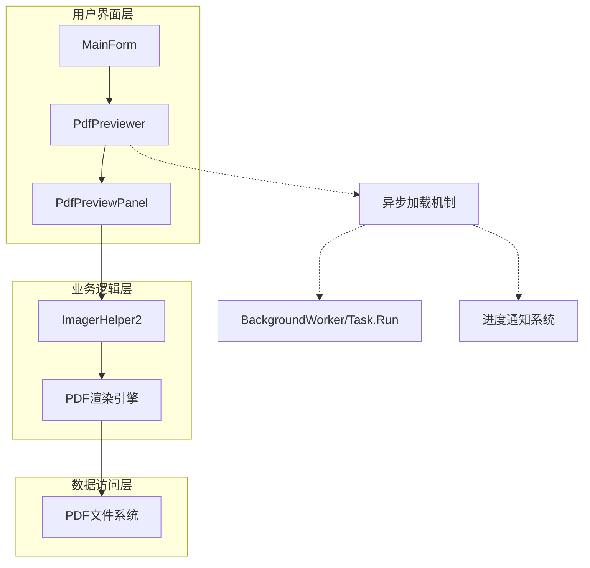

**图表来源**
- [PdfPreviewer.cs](file://PdfTool/PdfPreviewer.cs#L1-L77)
- [PdfPreviewPanel.cs](file://PdfTool/PdfPreviewPanel.cs#L1-L76)
- [ImagerHelper.cs](file://PdfHelperLibrary/ImagerHelper.cs#L128-L189)

**章节来源**
- [PdfPreviewer.cs](file://PdfTool/PdfPreviewer.cs#L1-L77)
- [PdfPreviewPanel.cs](file://PdfTool/PdfPreviewPanel.cs#L1-L76)

## 核心组件分析

### PdfPreviewPanel组件架构

PdfPreviewPanel作为主要的预览容器，集成了树形导航和图像显示功能：

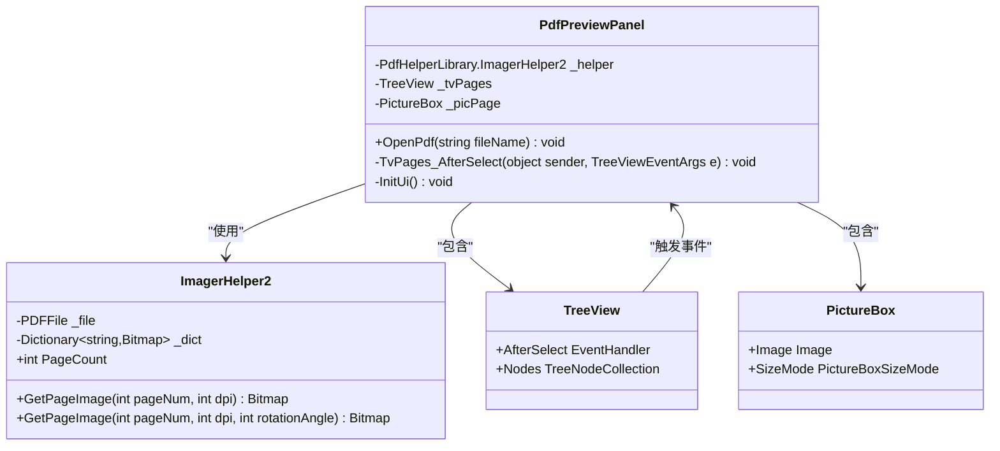

**图表来源**
- [PdfPreviewPanel.cs](file://PdfTool/PdfPreviewPanel.cs#L8-L76)
- [ImagerHelper.cs](file://PdfHelperLibrary/ImagerHelper.cs#L128-L189)

**章节来源**
- [PdfPreviewPanel.cs](file://PdfTool/PdfPreviewPanel.cs#L8-L76)
- [ImagerHelper.cs](file://PdfHelperLibrary/ImagerHelper.cs#L128-L189)

## 异步加载架构

### 当前同步实现的问题

当前的TvPages_AfterSelect事件直接调用GetPageImage方法，该方法在UI线程中执行，当处理高DPI图像或复杂PDF时会导致界面冻结：

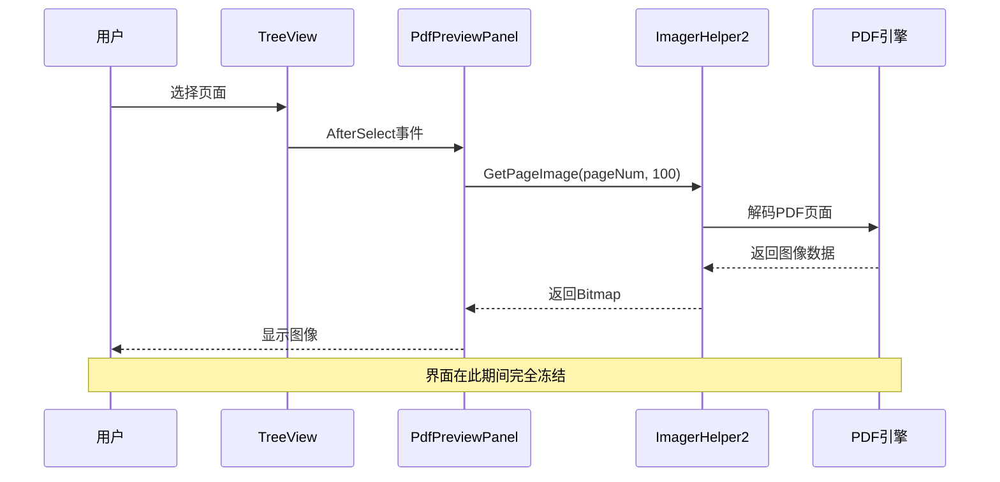

**图表来源**
- [PdfPreviewPanel.cs](file://PdfTool/PdfPreviewPanel.cs#L40-L49)

### 异步加载解决方案架构

理想的异步加载架构应该包含以下关键组件：

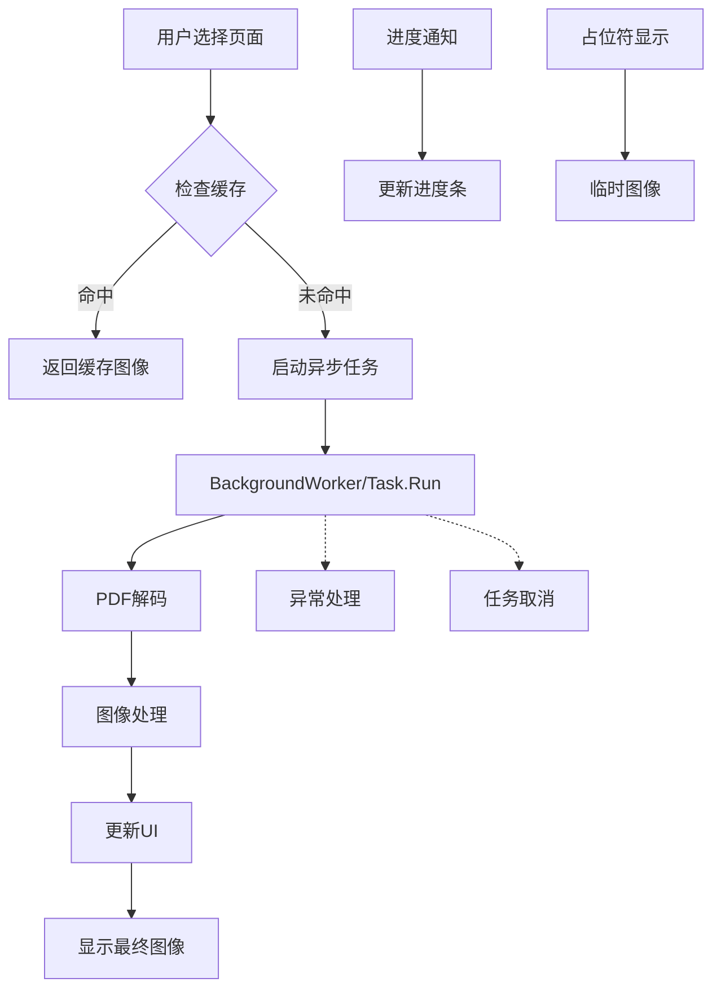

## 详细组件分析

### 改进后的PdfPreviewPanel实现

为了实现真正的异步加载，我们需要重构PdfPreviewPanel组件：

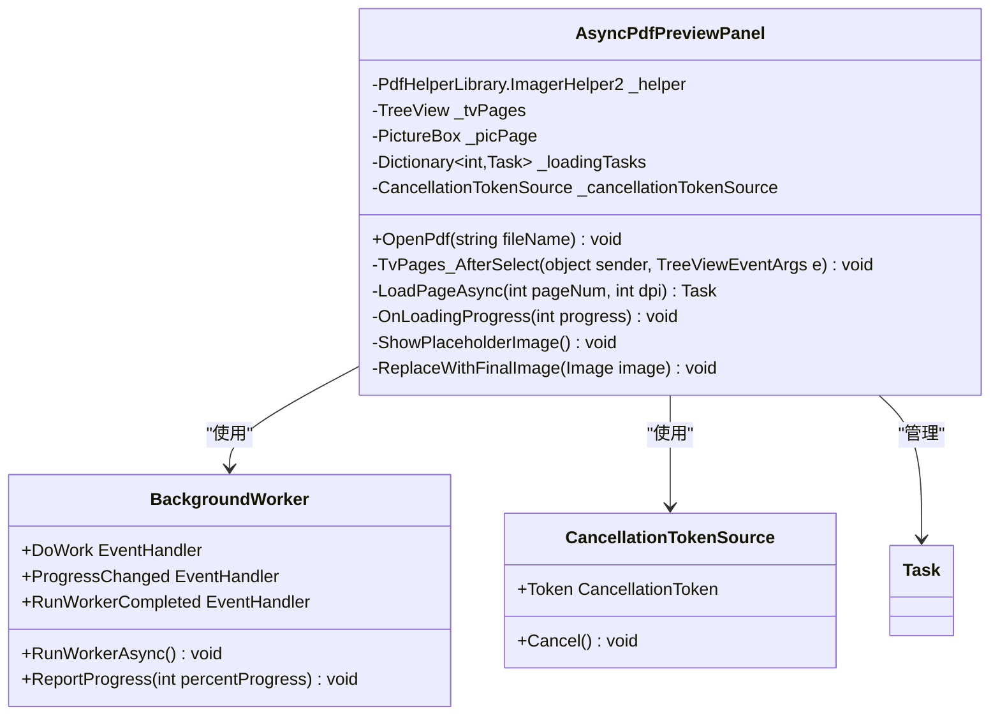

**图表来源**
- [PdfPreviewPanel.cs](file://PdfTool/PdfPreviewPanel.cs#L8-L76)
- [PageOperaBase.cs](file://PdfEditor\Modules\PageOperaBase.cs#L45-L97)

### 异步加载流程实现

异步加载的核心流程包括以下几个步骤：

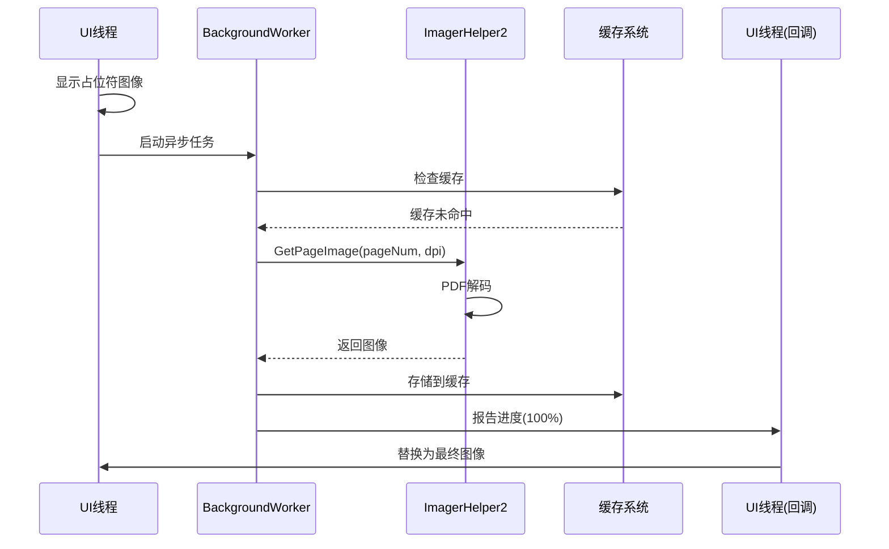

**图表来源**
- [PageOperaBase.cs](file://PdfEditor\Modules\PageOperaBase.cs#L45-L97)

**章节来源**
- [PdfPreviewPanel.cs](file://PdfTool/PdfPreviewPanel.cs#L40-L49)
- [PageOperaBase.cs](file://PdfEditor\Modules\PageOperaBase.cs#L45-L97)

## 异步加载实现策略

### BackgroundWorker实现方案

基于现有的PageOperaBase模式，我们可以使用BackgroundWorker实现异步加载：

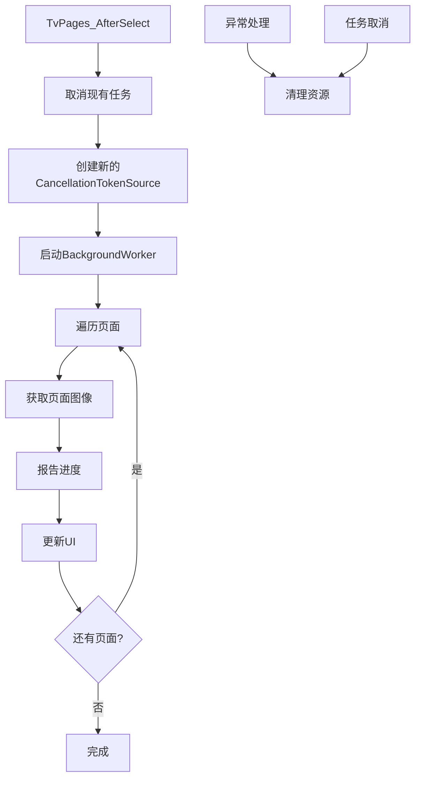

### Task.Run现代异步实现

使用现代Task.Run模式可以提供更灵活的异步控制：

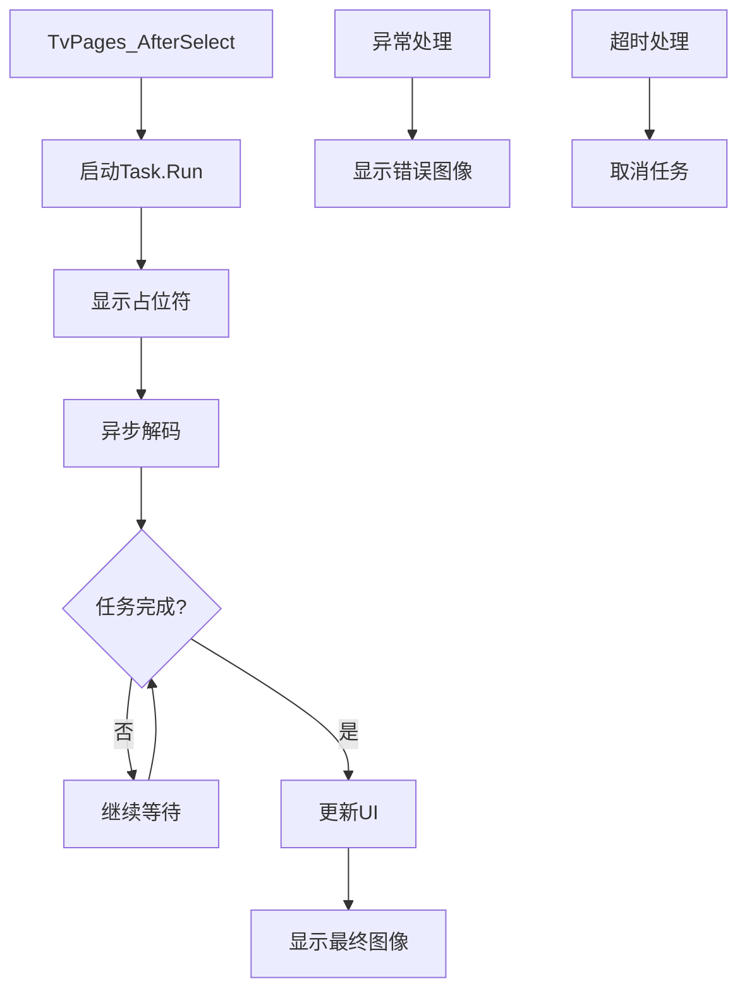

**章节来源**
- [PageOperaBase.cs](file://PdfEditor\Modules\PageOperaBase.cs#L45-L97)

## 性能优化与DPI管理

### DPI设置对性能的影响

DPI设置直接影响异步任务的执行时间和内存消耗：

| DPI值 | 内存占用 | 处理时间 | 推荐场景 |
|-------|----------|----------|----------|
| 72    | 低       | 快       | 快速浏览 |
| 150   | 中等     | 中等     | 标准预览 |
| 300   | 高       | 慢       | 打印质量 |
| 600+  | 很高     | 很慢     | 高精度需求 |

### 动态DPI调整策略

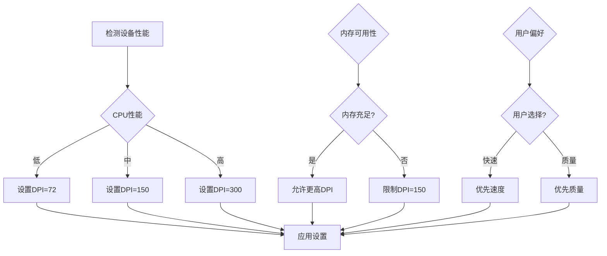

### 缓存优化策略

ImagerHelper2已经实现了基本的缓存机制，但可以进一步优化：

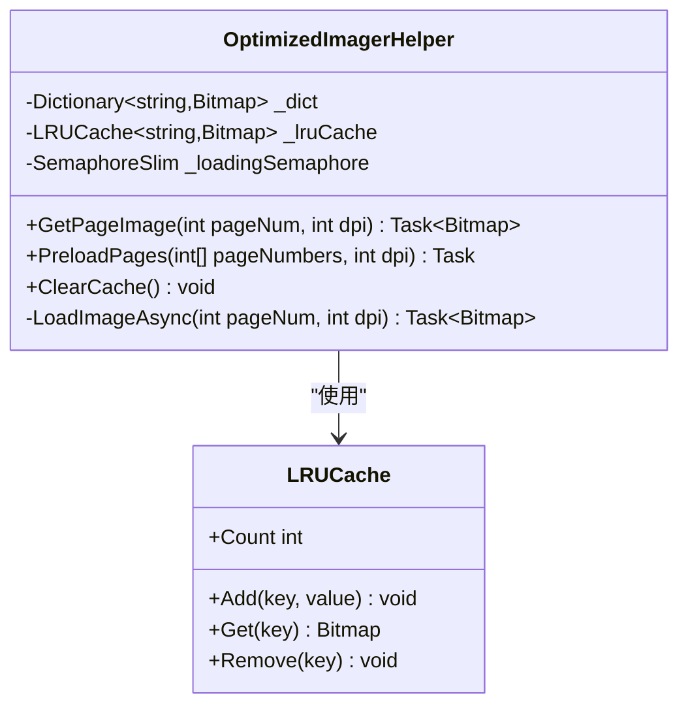

**章节来源**
- [ImagerHelper.cs](file://PdfHelperLibrary/ImagerHelper.cs#L149-L189)

## 错误处理与任务取消

### 异常处理机制

异步加载过程中的异常处理至关重要：

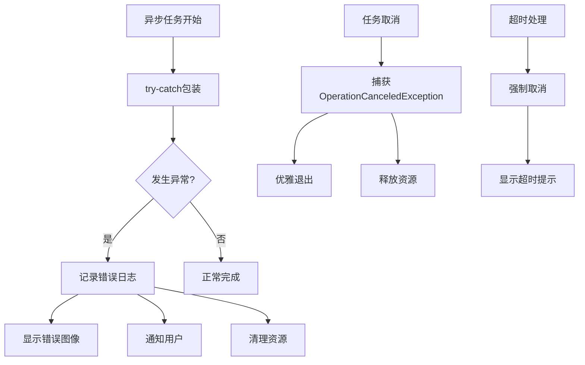

### 任务取消实现

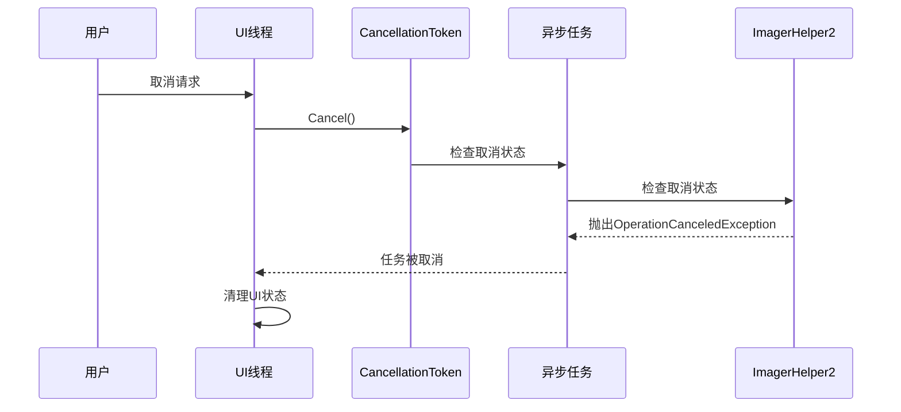

**章节来源**
- [PageOperaBase.cs](file://PdfEditor\Modules\PageOperaBase.cs#L45-L97)

## 用户体验优化

### 占位符图像系统

占位符图像在异步加载过程中提供视觉反馈：

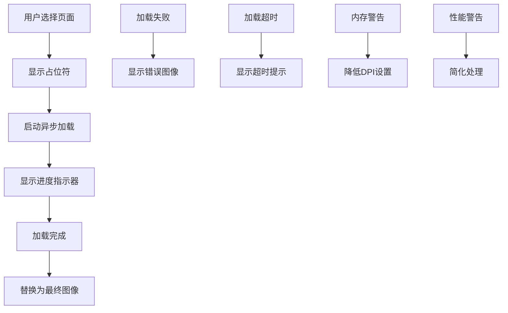

### 平滑过渡效果

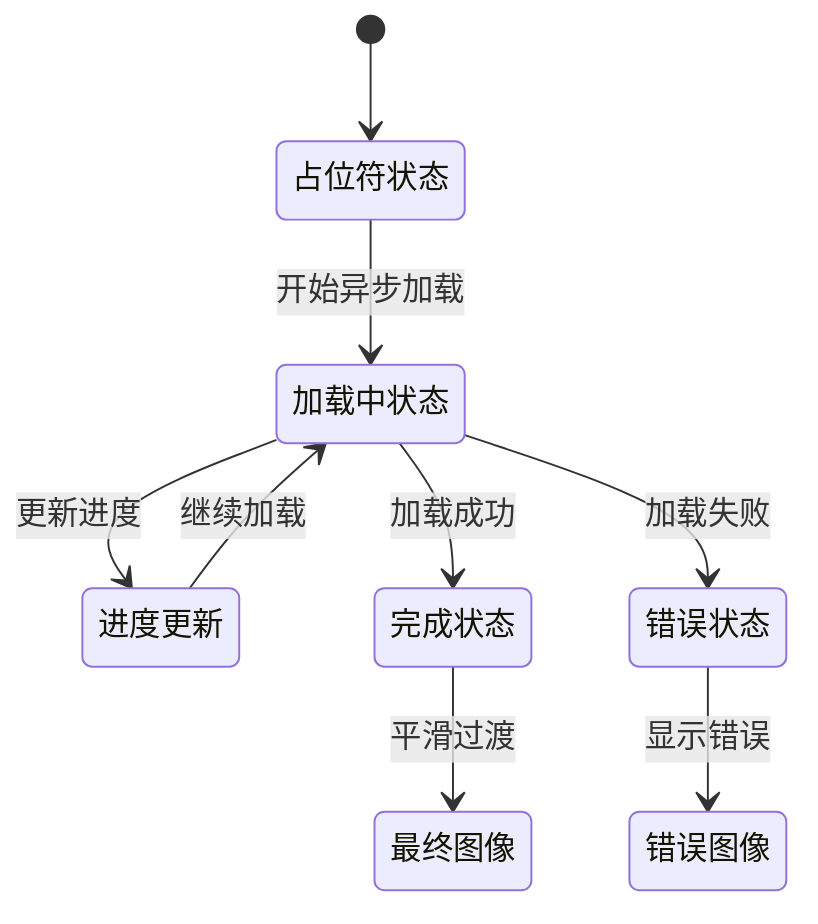

### 进度通知机制

进度通知系统为用户提供实时反馈：

| 进度阶段 | 显示内容 | 响应时间 |
|----------|----------|----------|
| 0-10%    | 文件加载中 | < 100ms |
| 10-50%   | 页面解析中 | < 500ms |
| 50-90%   | 图像解码中 | < 1s |
| 90-100%  | 缓存写入中 | < 200ms |

**章节来源**
- [PageOperaBase.cs](file://PdfEditor\Modules\PageOperaBase.cs#L45-L97)

## 最佳实践指南

### 实现建议

1. **使用现代异步模式**：优先考虑Task.Run而非BackgroundWorker
2. **合理设置DPI**：根据设备性能动态调整默认DPI
3. **实现智能缓存**：使用LRU缓存策略管理内存使用
4. **提供用户控制**：允许用户手动调整加载参数
5. **监控性能指标**：跟踪加载时间和内存使用情况

### 代码组织结构

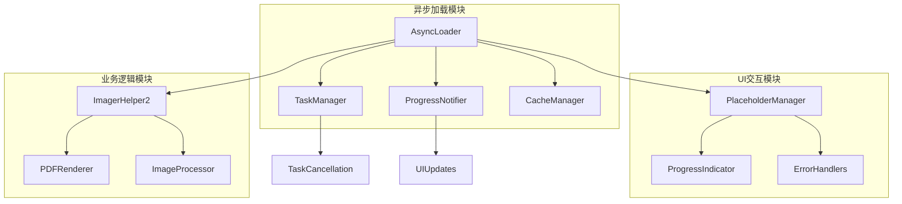

### 性能基准测试

| 场景 | 页面数 | DPI | 加载时间 | 内存峰值 | UI响应性 |
|------|--------|-----|----------|----------|----------|
| 小型文档 | 10 | 72 | < 2s | < 100MB | 完全响应 |
| 中型文档 | 50 | 150 | 5-10s | 200-500MB | 基本响应 |
| 大型文档 | 100+ | 300 | 20-60s | 1-2GB | 部分响应 |
| 高分辨率 | 200+ | 600+ | > 2min | > 2GB | 需要优化 |

## 总结

PdfPreviewPanel的异步加载改造是一个系统性工程，涉及UI线程分离、后台任务管理、缓存策略优化等多个方面。通过采用现代异步编程模式（如Task.Run）、合理的DPI动态调整策略、智能缓存机制以及完善的错误处理体系，可以显著提升用户体验。

关键改进点包括：
- 将耗时的PDF解码操作移至后台线程
- 实现渐进式图像加载和占位符显示
- 提供灵活的DPI设置和性能优化选项
- 建立健壮的异常处理和任务取消机制
- 优化内存使用和缓存策略

这些改进不仅解决了当前的界面冻结问题，还为未来的功能扩展奠定了坚实的基础。通过持续的性能监控和用户反馈收集，可以进一步完善异步加载系统的各项指标，确保在各种使用场景下都能提供流畅的用户体验。