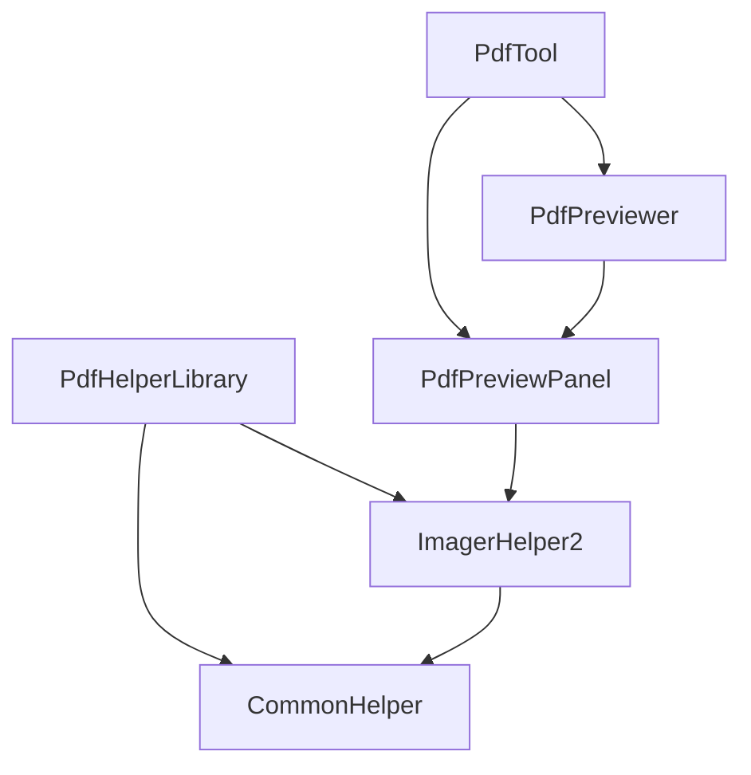
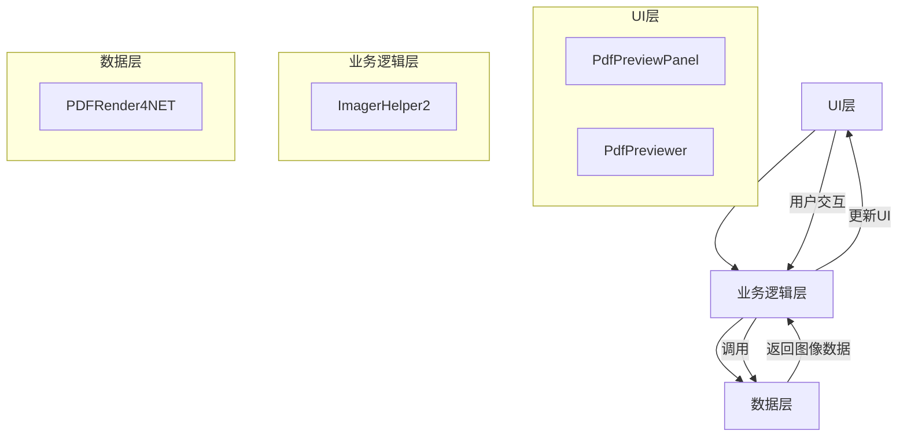
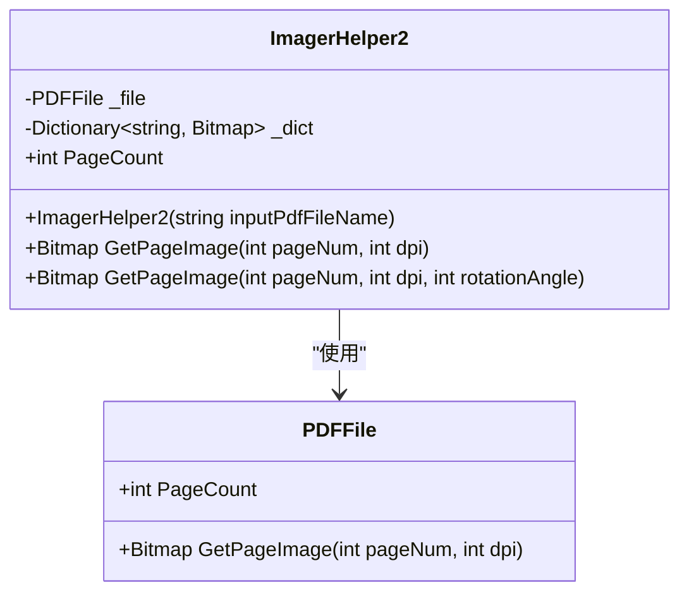
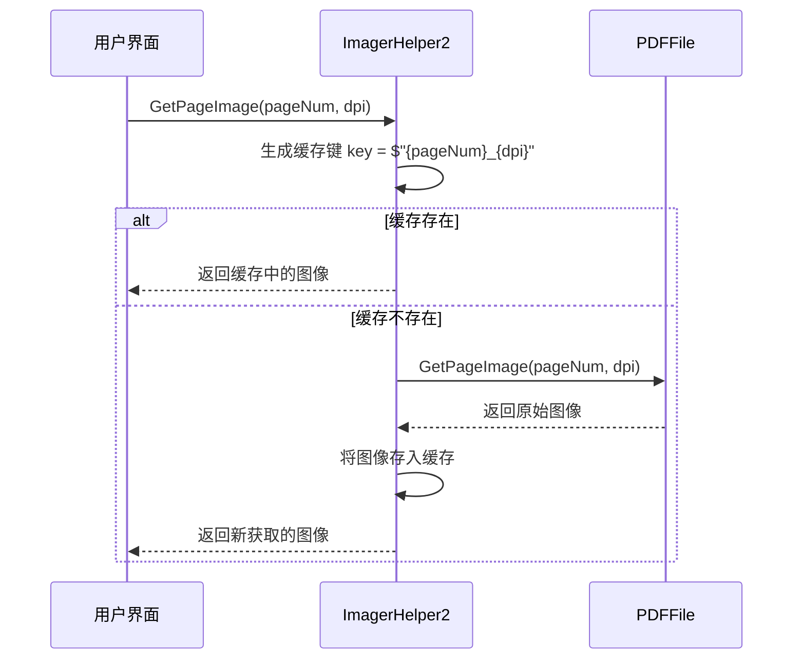
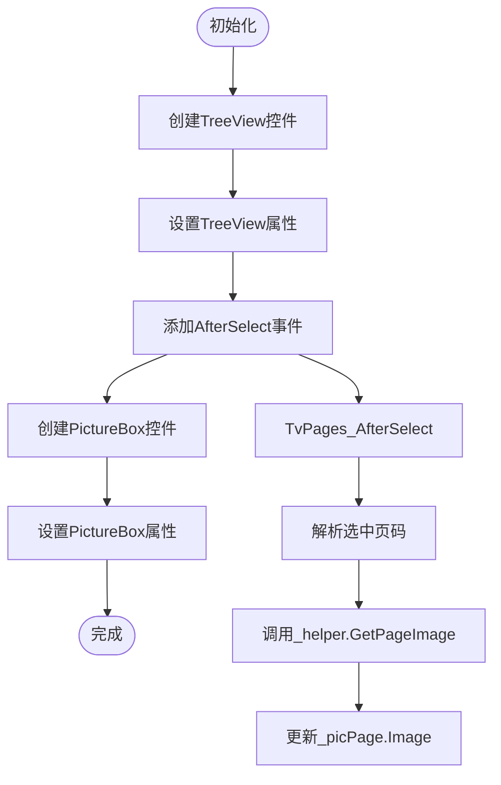
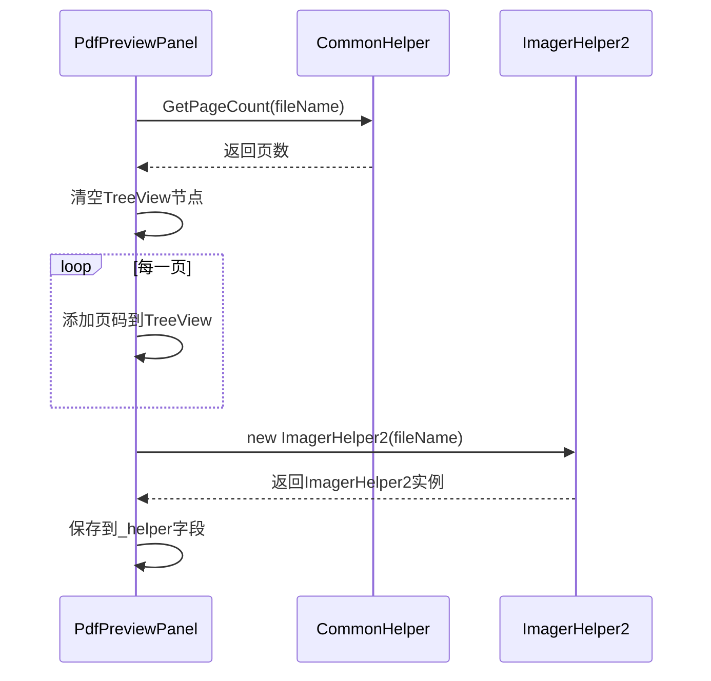
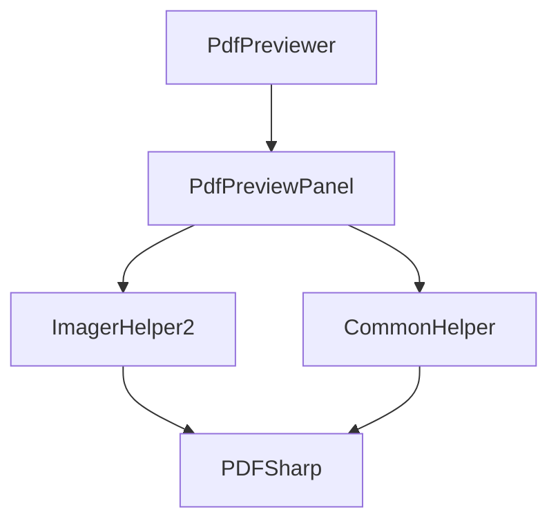
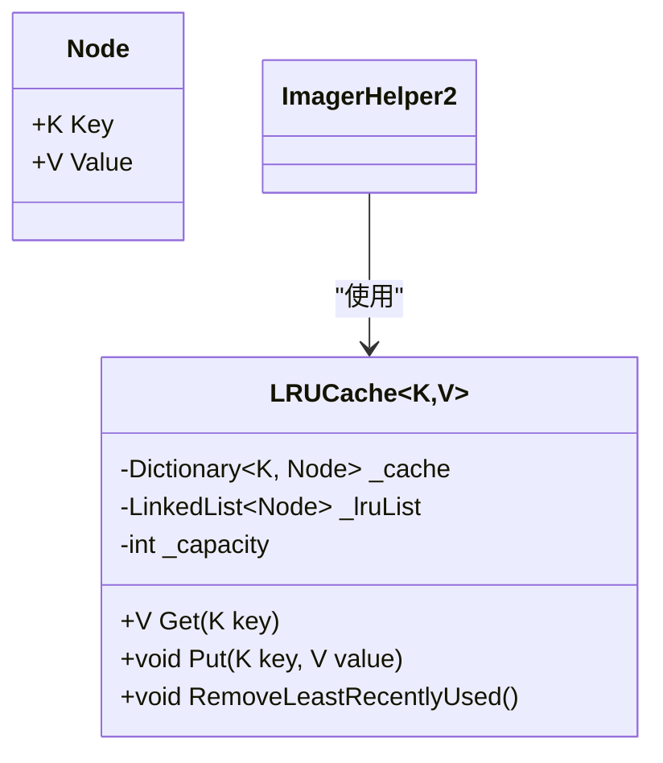
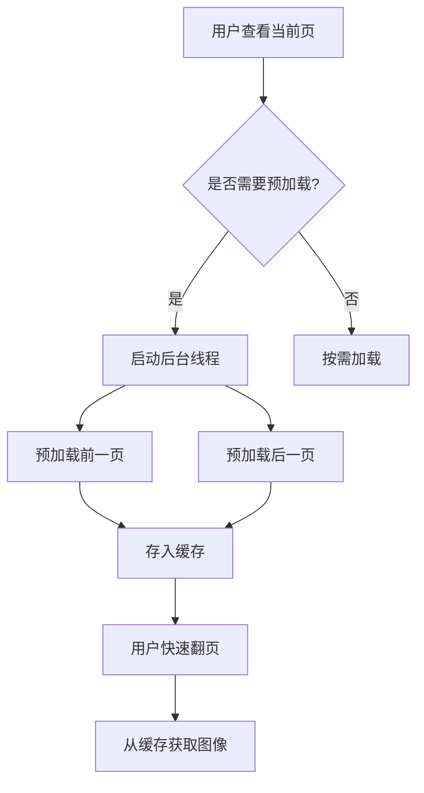

# 性能调优与缓存策略

<cite>
**本文档引用的文件**  
- [ImagerHelper.cs](file://PdfHelperLibrary/ImagerHelper.cs)
- [PdfPreviewPanel.cs](file://PdfTool/PdfPreviewPanel.cs)
- [CommonHelper.cs](file://PdfHelperLibrary/CommonHelper.cs)
- [PdfPreviewer.cs](file://PdfTool/PdfPreviewer.cs)
</cite>

## 目录
1. [引言](#引言)
2. [项目结构](#项目结构)
3. [核心组件](#核心组件)
4. [架构概述](#架构概述)
5. [详细组件分析](#详细组件分析)
6. [依赖分析](#依赖分析)
7. [性能考虑](#性能考虑)
8. [故障排除指南](#故障排除指南)
9. [结论](#结论)

## 引言
本文档深入分析基于PDFRender4NET的渐进式加载与图像缓存机制，重点说明ImagerHelper2在OpenPdf时初始化PDF文档句柄并在TvPages_AfterSelect事件中按需调用GetPageImage(pageNum, dpi)实现延迟渲染的优势。探讨DPI参数对图像质量和内存占用的影响，提出优化方案如引入LRU缓存保存最近访问的页面图像，避免重复解码；对于大型文档，可预加载相邻页以提升浏览流畅性。同时讨论多文档并发预览时的资源竞争问题，并建议限制同时打开的PDF数量或采用后台线程池异步加载。

## 项目结构
该项目是一个功能丰富的PDF工具集，包含多个子项目，涵盖PDF处理、图像提取、文档合并、拆分、压缩、水印添加等多种功能。核心的PDF预览功能主要集中在PdfTool项目中，通过ImagerHelper2类实现PDF到图像的转换和缓存。

**图示来源**  
- [PdfPreviewPanel.cs](file://PdfTool/PdfPreviewPanel.cs)
- [PdfPreviewer.cs](file://PdfTool/PdfPreviewer.cs)
- [ImagerHelper.cs](file://PdfHelperLibrary/ImagerHelper.cs)
- [CommonHelper.cs](file://PdfHelperLibrary/CommonHelper.cs)

**本节来源**  
- [PdfTool](file://PdfTool)
- [PdfHelperLibrary](file://PdfHelperLibrary)

## 核心组件
系统的核心组件包括ImagerHelper2类，负责PDF文档的加载和页面图像的按需渲染；PdfPreviewPanel类，提供用户界面和交互逻辑；以及CommonHelper类，提供通用的PDF操作辅助功能。

**本节来源**  
- [ImagerHelper.cs](file://PdfHelperLibrary/ImagerHelper.cs#L129-L191)
- [PdfPreviewPanel.cs](file://PdfTool/PdfPreviewPanel.cs#L1-L76)
- [CommonHelper.cs](file://PdfHelperLibrary/CommonHelper.cs#L1-L29)

## 架构概述
系统采用分层架构，上层为UI组件（PdfPreviewPanel、PdfPreviewer），中层为业务逻辑（ImagerHelper2），底层为PDFRender4NET库。UI组件通过事件驱动的方式调用业务逻辑层的方法，实现按需加载和渲染PDF页面。

**图示来源**  
- [PdfPreviewPanel.cs](file://PdfTool/PdfPreviewPanel.cs#L1-L76)
- [ImagerHelper.cs](file://PdfHelperLibrary/ImagerHelper.cs#L129-L191)

## 详细组件分析

### ImagerHelper2分析
ImagerHelper2类是PDF图像化处理的核心，它在构造函数中打开PDF文件并初始化页面计数，在GetPageImage方法中实现图像的按需获取和缓存。

#### 类图

**图示来源**  
- [ImagerHelper.cs](file://PdfHelperLibrary/ImagerHelper.cs#L129-L191)

#### 获取页面图像流程

**图示来源**  
- [ImagerHelper.cs](file://PdfHelperLibrary/ImagerHelper.cs#L149-L156)

**本节来源**  
- [ImagerHelper.cs](file://PdfHelperLibrary/ImagerHelper.cs#L129-L191)

### PdfPreviewPanel分析
PdfPreviewPanel类负责PDF预览的用户界面展示，通过TreeView显示页面列表，通过PictureBox显示当前选中页面的图像。

#### UI初始化流程

**图示来源**  
- [PdfPreviewPanel.cs](file://PdfTool/PdfPreviewPanel.cs#L53-L72)
- [PdfPreviewPanel.cs](file://PdfTool/PdfPreviewPanel.cs#L40-L49)

#### 打开PDF文档流程

**图示来源**  
- [PdfPreviewPanel.cs](file://PdfTool/PdfPreviewPanel.cs#L26-L36)
- [CommonHelper.cs](file://PdfHelperLibrary/CommonHelper.cs#L11-L17)

**本节来源**  
- [PdfPreviewPanel.cs](file://PdfTool/PdfPreviewPanel.cs#L1-L76)
- [CommonHelper.cs](file://PdfHelperLibrary/CommonHelper.cs#L1-L29)

## 依赖分析
系统的主要依赖关系如下：PdfPreviewPanel依赖于ImagerHelper2和CommonHelper，ImagerHelper2依赖于PDFRender4NET库，PdfPreviewer依赖于PdfPreviewPanel。

**图示来源**  
- [PdfPreviewer.cs](file://PdfTool/PdfPreviewer.cs#L30-L42)
- [PdfPreviewPanel.cs](file://PdfTool/PdfPreviewPanel.cs#L20-L23)
- [ImagerHelper.cs](file://PdfHelperLibrary/ImagerHelper.cs#L131-L138)
- [CommonHelper.cs](file://PdfHelperLibrary/CommonHelper.cs#L11-L17)

**本节来源**  
- [PdfPreviewer.cs](file://PdfTool/PdfPreviewer.cs#L1-L77)
- [PdfPreviewPanel.cs](file://PdfTool/PdfPreviewPanel.cs#L1-L76)
- [ImagerHelper.cs](file://PdfHelperLibrary/ImagerHelper.cs#L129-L191)
- [CommonHelper.cs](file://PdfHelperLibrary/CommonHelper.cs#L1-L29)

## 性能考虑
### 渐进式加载与延迟渲染优势
ImagerHelper2在OpenPdf时初始化PDF文档句柄，但并不立即渲染所有页面图像，而是在TvPages_AfterSelect事件中按需调用GetPageImage(pageNum, dpi)实现延迟渲染。这种机制的优势包括：
- **内存效率**：避免一次性加载所有页面图像，显著降低内存占用
- **启动速度**：用户可以快速打开大型PDF文档，无需等待所有页面渲染完成
- **用户体验**：用户按需查看页面，系统资源得到合理分配

### DPI参数影响
DPI参数直接影响图像质量和内存占用：
- **高DPI**（如300-600）：图像清晰度高，但内存占用大，渲染时间长
- **低DPI**（如72-100）：图像质量较低，但内存占用小，渲染速度快

建议根据使用场景合理设置默认DPI：
- **屏幕预览**：72-100 DPI足够
- **打印输出**：300 DPI或更高
- **文档存档**：600 DPI

### 缓存优化方案
当前ImagerHelper2使用简单的字典缓存，可优化为LRU（最近最少使用）缓存：

**图示来源**  
- [ImagerHelper.cs](file://PdfHelperLibrary/ImagerHelper.cs#L146-L147)

### 预加载策略
对于大型文档，可预加载相邻页面以提升浏览流畅性：

### 多文档并发预览资源管理
多文档并发预览时可能出现资源竞争，建议：
- **限制同时打开数量**：设置最大并发文档数
- **后台线程池**：使用线程池异步加载，避免阻塞UI线程
- **资源回收**：及时释放非活动文档的资源

**本节来源**  
- [ImagerHelper.cs](file://PdfHelperLibrary/ImagerHelper.cs#L149-L156)
- [PdfPreviewPanel.cs](file://PdfTool/PdfPreviewPanel.cs#L40-L49)

## 故障排除指南
### 常见问题
- **PDF无法打开**：检查文件路径和权限，确认PDF文件未损坏
- **页面渲染缓慢**：检查DPI设置是否过高，考虑降低DPI
- **内存占用过高**：检查是否打开了过多PDF文档，考虑限制并发数量
- **图像质量差**：检查DPI设置是否过低，适当提高DPI

### 调试建议
- 使用调试日志跟踪页面加载和渲染过程
- 监控内存使用情况，识别内存泄漏
- 测试不同大小和复杂度的PDF文档，评估性能表现

**本节来源**  
- [ImagerHelper.cs](file://PdfHelperLibrary/ImagerHelper.cs#L133-L142)
- [PdfPreviewPanel.cs](file://PdfTool/PdfPreviewPanel.cs#L26-L36)

## 结论
本文档详细分析了基于PDFRender4NET的渐进式加载与图像缓存机制。ImagerHelper2通过在OpenPdf时初始化PDF文档句柄并在TvPages_AfterSelect事件中按需调用GetPageImage实现延迟渲染，有效平衡了性能和用户体验。建议根据实际需求合理设置DPI参数，并考虑引入LRU缓存和预加载策略进一步优化性能。对于多文档并发场景，应实施资源管理策略，确保系统稳定运行。