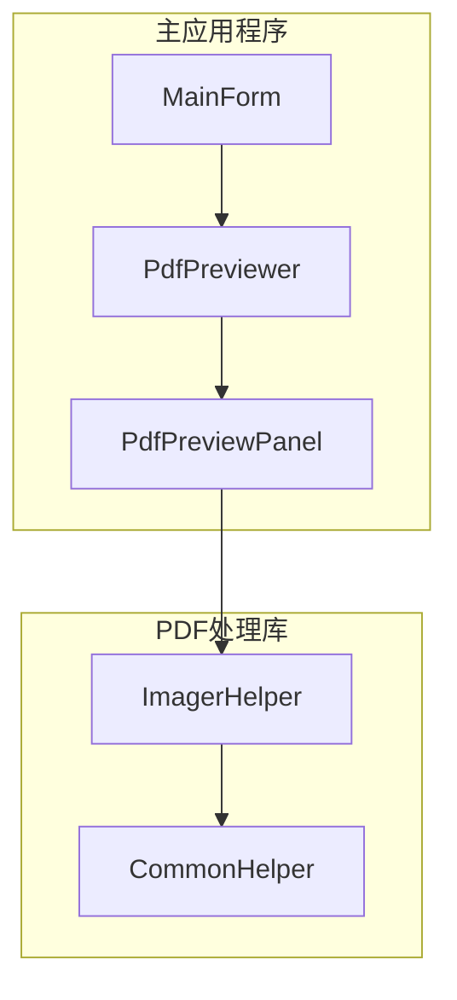
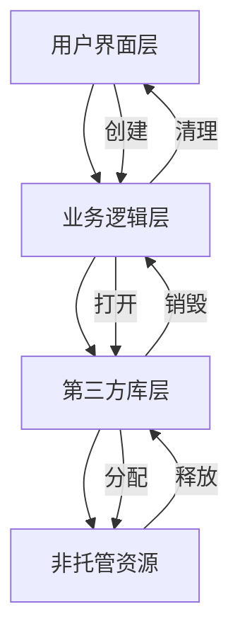
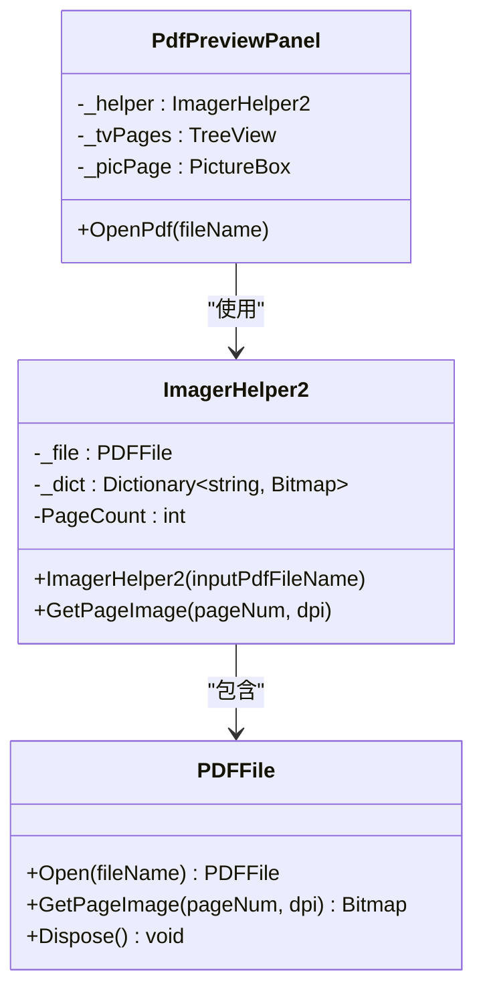
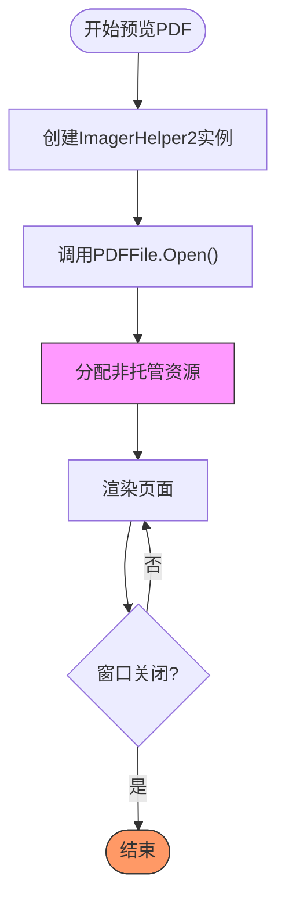
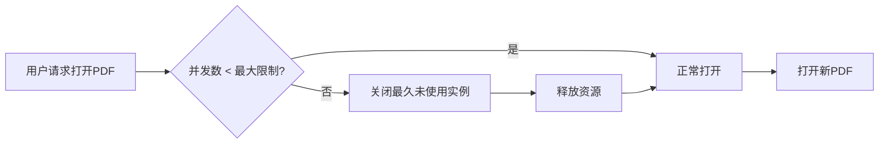

# 资源限制与并发控制

<cite>
**本文档引用的文件**   
- [Config.cs](file://PdfTool/Config.cs)
- [PdfPreviewer.cs](file://PdfTool/PdfPreviewer.cs)
- [PdfPreviewPanel.cs](file://PdfTool/PdfPreviewPanel.cs)
- [MainForm.cs](file://PdfTool/MainForm.cs)
- [ImagerHelper.cs](file://PdfHelperLibrary/ImagerHelper.cs)
- [Common.cs](file://PdfTool/Common.cs)
- [Program.cs](file://PdfTool/Program.cs)
</cite>

## 目录
1. [简介](#简介)
2. [项目结构](#项目结构)
3. [核心组件](#核心组件)
4. [架构概述](#架构概述)
5. [详细组件分析](#详细组件分析)
6. [依赖分析](#依赖分析)
7. [性能考虑](#性能考虑)
8. [故障排除指南](#故障排除指南)
9. [结论](#结论)

## 简介
本文档分析了在多PDF文档并发预览时可能出现的资源竞争问题，特别是由于PDFRender4NET句柄未及时释放导致的内存泄漏风险。文档提出了通过Config.cs配置最大同时打开文档数的限制策略，强制关闭最久未使用的预览实例以释放资源。设计了基于线程池的任务调度机制，限制并发解码任务数量，避免系统资源耗尽。说明了如何监听窗口关闭事件并正确调用PDFFile.Dispose()释放非托管资源，并提供了资源监控日志输出建议，便于排查潜在的性能瓶颈。

## 项目结构
该项目是一个功能丰富的PDF处理工具集，包含多个独立的模块，每个模块专注于特定的PDF处理任务。核心的PDF预览功能位于PdfTool项目中，而PDF处理的核心逻辑则封装在PdfHelperLibrary库中。项目采用模块化设计，各个功能模块（如PDF拆分、合并、转图等）作为独立的用户控件集成在主窗体的选项卡中。

**Diagram sources**
- [MainForm.cs](file://PdfTool/MainForm.cs#L128-L163)
- [PdfPreviewer.cs](file://PdfTool/PdfPreviewer.cs#L13)
- [PdfPreviewPanel.cs](file://PdfTool/PdfPreviewPanel.cs#L20)
- [ImagerHelper.cs](file://PdfHelperLibrary/ImagerHelper.cs#L129)

**Section sources**
- [MainForm.cs](file://PdfTool/MainForm.cs#L12-L193)
- [PdfTool.csproj](file://PdfTool/PdfTool.csproj#L88-L127)

## 核心组件
核心组件包括PdfPreviewer（预览器主控件）、PdfPreviewPanel（单个PDF预览面板）和ImagerHelper2（PDF渲染助手）。PdfPreviewer负责管理多个PDF文档的标签页，每个标签页包含一个PdfPreviewPanel实例。PdfPreviewPanel使用ImagerHelper2来加载和渲染PDF页面。关键的资源管理问题集中在ImagerHelper2类中，它通过PDFRender4NET库的PDFFile对象来访问PDF文档，而该对象持有非托管资源。

**Section sources**
- [PdfPreviewer.cs](file://PdfTool/PdfPreviewer.cs#L13-L76)
- [PdfPreviewPanel.cs](file://PdfTool/PdfPreviewPanel.cs#L8-L75)
- [ImagerHelper.cs](file://PdfHelperLibrary/ImagerHelper.cs#L129-L191)

## 架构概述
系统架构采用分层设计，上层是用户界面层（PdfPreviewer和PdfPreviewPanel），中层是业务逻辑层（ImagerHelper2），底层是第三方库（PDFRender4NET）。用户界面层负责展示和用户交互，业务逻辑层负责PDF文档的加载和页面渲染，底层库负责实际的PDF解析和图像生成。这种架构清晰地分离了关注点，但也引入了跨层的资源管理挑战。

**Diagram sources**
- [PdfPreviewPanel.cs](file://PdfTool/PdfPreviewPanel.cs#L26)
- [ImagerHelper.cs](file://PdfHelperLibrary/ImagerHelper.cs#L134)
- [ImagerHelper.cs](file://PdfHelperLibrary/ImagerHelper.cs#L145)

## 详细组件分析

### PDF预览面板分析
PdfPreviewPanel是实现单个PDF文档预览的核心组件。它在OpenPdf方法中创建ImagerHelper2实例来加载PDF文件，并在TreeView选择改变时调用GetPageImage方法渲染页面。关键问题是该组件没有实现IDisposable接口，也没有在窗体关闭时显式释放ImagerHelper2持有的资源。

#### 对象关系图

**Diagram sources**
- [PdfPreviewPanel.cs](file://PdfTool/PdfPreviewPanel.cs#L8-L75)
- [ImagerHelper.cs](file://PdfHelperLibrary/ImagerHelper.cs#L129-L191)

**Section sources**
- [PdfPreviewPanel.cs](file://PdfTool/PdfPreviewPanel.cs#L8-L75)
- [PdfPreviewer.cs](file://PdfTool/PdfPreviewer.cs#L30-L41)

### 资源管理分析
资源管理的核心在于PDFFile对象的生命周期。该对象由ImagerHelper2在构造函数中通过PDFFile.Open静态方法创建，并持有非托管资源。分析代码发现，ImagerHelper2类本身没有提供释放这些资源的机制，而PDFFile类实现了IDisposable接口，必须显式调用Dispose方法来释放资源。

#### 资源生命周期流程图

**Diagram sources**
- [ImagerHelper.cs](file://PdfHelperLibrary/ImagerHelper.cs#L134-L137)
- [ImagerHelper.cs](file://PdfHelperLibrary/ImagerHelper.cs#L145)

**Section sources**
- [ImagerHelper.cs](file://PdfHelperLibrary/ImagerHelper.cs#L129-L191)

## 依赖分析
项目的主要外部依赖是O2S.Components.PDFRender4NET库，它提供了PDF文件的解析和渲染功能。该库通过PdfHelperLibrary项目进行封装，为上层应用提供更简洁的API。分析发现，该依赖是资源泄漏的根本原因，因为其创建的PDFFile对象必须被正确释放。

**Diagram sources**
- [ImagerHelper.cs](file://PdfHelperLibrary/ImagerHelper.cs#L1)
- [PdfHelperLibrary.csproj](file://PdfHelperLibrary/PdfHelperLibrary.csproj#L1-L27)

**Section sources**
- [ImagerHelper.cs](file://PdfHelperLibrary/ImagerHelper.cs#L1-L191)
- [PdfHelperLibrary.csproj](file://PdfHelperLibrary/PdfHelperLibrary.csproj#L1-L27)

## 性能考虑
当前实现存在严重的性能隐患。当用户打开多个PDF文件时，每个文件都会创建一个ImagerHelper2实例，进而创建一个PDFFile实例并占用大量内存。由于没有限制最大并发数和资源释放机制，长时间运行后可能导致内存耗尽。建议实现一个基于配置的并发控制策略。

### 并发控制策略

**Diagram sources**
- [Config.cs](file://PdfTool/Config.cs#L3-L7)

## 故障排除指南
为排查资源泄漏问题，建议在关键位置添加日志记录。在PDFFile.Open和Dispose调用时记录日志，可以追踪资源的分配和释放情况。同时，监控应用程序的内存使用情况，如果发现内存持续增长而不释放，则表明存在资源泄漏。

**Section sources**
- [ImagerHelper.cs](file://PdfHelperLibrary/ImagerHelper.cs#L134)
- [ImagerHelper.cs](file://PdfHelperLibrary/ImagerHelper.cs#L145)

## 结论
当前PDF预览功能存在资源管理缺陷，主要体现在PDFFile对象的非托管资源未被及时释放。建议修改ImagerHelper2类，实现IDisposable接口，并在PdfPreviewPanel的Dispose方法中调用。同时，应通过Config.cs引入最大并发文档数配置，并实现LRU（最近最少使用）算法来管理预览实例，确保系统资源得到有效控制。