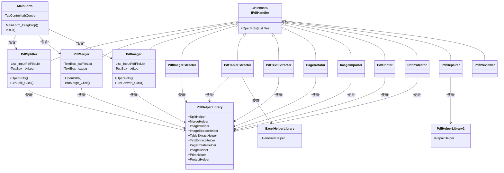

# 功能模块详解

<cite>
**本文档引用的文件**  
- [PdfSplitter.cs](file://PdfTool/PdfSplitter.cs)
- [PdfMerger.cs](file://PdfTool/PdfMerger.cs)
- [PdfImager.cs](file://PdfTool/PdfImager.cs)
- [PdfImageExtracter.cs](file://PdfTool/PdfImageExtracter.cs)
- [PdfTableExtracter.cs](file://PdfTool/PdfTableExtracter.cs)
- [PdfTextExtracter.cs](file://PdfTool/PdfTextExtracter.cs)
- [PageRotator.cs](file://PdfTool/PageRotator.cs)
- [ImageImporter.cs](file://PdfTool/ImageImporter.cs)
- [PdfPrinter.cs](file://PdfTool/PdfPrinter.cs)
- [PdfProtector.cs](file://PdfTool/PdfProtector.cs)
- [PdfRepairer.cs](file://PdfTool/PdfRepairer.cs)
- [PdfPreviewer.cs](file://PdfTool/PdfPreviewer.cs)
- [MainForm.cs](file://PdfTool/MainForm.cs)
- [Common.cs](file://PdfTool/Common.cs)
- [Config.cs](file://PdfTool/Config.cs)
- [SplitHelper.cs](file://PdfHelperLibrary/SplitHelper.cs)
- [MergeHelper.cs](file://PdfHelperLibrary/MergeHelper.cs)
- [ImagerHelper.cs](file://PdfHelperLibrary/ImagerHelper.cs)
- [ImageExtractHelper.cs](file://PdfHelperLibrary/ImageExtractHelper.cs)
- [TableExtractHelper.cs](file://PdfHelperLibrary/TableExtractHelper.cs)
- [TextExtractHelper.cs](file://PdfHelperLibrary/TextExtractHelper.cs)
- [PageRotateHelper.cs](file://PdfHelperLibrary/PageRotateHelper.cs)
- [ImageHelper.cs](file://PdfHelperLibrary/ImageHelper.cs)
- [PrintHelper.cs](file://PdfHelperLibrary/PrintHelper.cs)
- [ProtectHelper.cs](file://PdfHelperLibrary/ProtectHelper.cs)
- [RepairHelper.cs](file://PdfHelperLibrary2/RepairHelper.cs)
</cite>

## 目录
1. [简介](#简介)
2. [核心功能模块](#核心功能模块)
   - [PDF拆分器](#pdf拆分器)
   - [PDF合并器](#pdf合并器)
   - [PDF转图器](#pdf转图器)
   - [PDF图片提取器](#pdf图片提取器)
   - [PDF表格提取器](#pdf表格提取器)
   - [PDF文本提取器](#pdf文本提取器)
   - [PDF页面旋转器](#pdf页面旋转器)
   - [图片导入PDF](#图片导入pdf)
   - [批量打印](#批量打印)
   - [PDF保护器](#pdf保护器)
   - [PDF修复器](#pdf修复器)
   - [PDF预览器](#pdf预览器)
3. [功能实现机制](#功能实现机制)
4. [典型使用场景与最佳实践](#典型使用场景与最佳实践)

## 简介

PdfTool是一款功能丰富的PDF处理工具，提供了一系列核心功能模块，旨在满足用户在日常工作中对PDF文件的各种处理需求。该工具通过直观的图形用户界面，集成了PDF拆分、合并、转换、提取、保护等多种功能，支持拖拽操作和批量处理，极大提升了工作效率。

从代码结构来看，PdfTool采用模块化设计，每个功能模块都封装为独立的UserControl组件，并通过MainForm中的TabControl进行统一管理。所有处理模块均实现了IPdfHandler接口，确保了统一的文件加载机制。业务逻辑与界面分离，通过PdfHelperLibrary等辅助库实现具体功能，保证了代码的可维护性和可扩展性。

**Section sources**
- [MainForm.cs](file://PdfTool/MainForm.cs#L1-L194)
- [Common.cs](file://PdfTool/Common.cs#L1-L18)
- [Config.cs](file://PdfTool/Config.cs#L1-L9)

## 核心功能模块

### PDF拆分器

PDF拆分器提供了三种拆分模式：常规拆分、指定页提取和指定页删除。用户可以将一个PDF文件按页数拆分为多个文档，或提取特定页码范围的内容，也可删除不需要的页面。

在常规拆分模式中，用户设置每份文档的页数，系统会自动将原文件按此页数进行分割。指定页提取允许用户定义起始页和结束页，仅保留该范围内的页面。指定页删除功能则让用户输入要删除的页码（支持逗号或分号分隔），生成不含这些页面的新文件。

**Section sources**
- [PdfSplitter.cs](file://PdfTool/PdfSplitter.cs#L1-L230)

### PDF合并器

PDF合并器用于将多个PDF文件合并为一个文档。用户可通过"添加文件"按钮选择多个PDF文件，系统会显示每个文件的页数信息。合并时可选择是否在合并后自动打开生成的文件，以及是否为每个源文件创建书签。

默认情况下，合并后的文件名为"MergedFile - 时间戳.pdf"，用户也可通过"修改"按钮自定义输出文件名。该功能特别适用于将多个章节或部分的PDF文档整合为完整报告或书籍。

**Section sources**
- [PdfMerger.cs](file://PdfTool/PdfMerger.cs#L1-L154)

### PDF转图器

PDF转图器可将PDF页面转换为图像文件。支持PNG、JPG和BMP三种格式，用户可选择100至1200 DPI的分辨率。功能支持转换全部页面或指定页码范围。

转换过程采用BackgroundWorker实现异步处理，避免界面冻结，并实时显示转换进度。该功能适用于需要将PDF内容嵌入到其他文档或网页中的场景，如制作演示文稿或创建网页内容。

**Section sources**
- [PdfImager.cs](file://PdfTool/PdfImager.cs#L1-L218)

### PDF图片提取器

PDF图片提取器用于从PDF文件中提取嵌入的图片。用户添加PDF文件后，点击"开始提取"即可将所有图片导出到与原文件同名的文件夹中。

该功能利用PdfHelperLibrary中的ImageExtractHelper类实现，能够识别并提取PDF中包含的各种图像对象。提取的图片保持原始质量，适用于需要重用PDF中图片素材的场景。

**Section sources**
- [PdfImageExtracter.cs](file://PdfTool/PdfImageExtracter.cs#L1-L119)

### PDF表格提取器

PDF表格提取器专门用于提取PDF中的表格数据。它不仅能提取表格内容，还能将提取的数据自动转换为Excel文件（.xlsx格式），便于进一步分析和处理。

该功能结合了PdfHelperLibrary的TableExtractHelper和ExcelHelperLibrary的GenerateHelper，实现了从PDF到Excel的无缝转换。特别适用于处理发票、报表等包含表格数据的PDF文档。

**Section sources**
- [PdfTableExtracter.cs](file://PdfTool/PdfTableExtracter.cs#L1-L130)

### PDF文本提取器

PDF文本提取器用于提取PDF文件中的纯文本内容。支持批量处理多个文件，提取的文本会显示在日志区域，并可复制到剪贴板或保存为文本文件。

该功能利用PdfHelperLibrary的TextExtractHelper实现，能够准确识别和提取PDF中的文本流。适用于需要将PDF内容导入到文字处理软件或进行文本分析的场景。

**Section sources**
- [PdfTextExtracter.cs](file://PdfTool/PdfTextExtracter.cs#L1-L119)

### PDF页面旋转器

PDF页面旋转器允许用户旋转PDF页面，支持90°、180°和270°三种旋转角度。可选择旋转全部页面或仅旋转指定页码。

该功能通过PdfHelperLibrary的PageRotateHelper实现，支持批量处理多个文件。对于扫描文档中方向不正确的页面，此功能尤为实用。

**Section sources**
- [PageRotator.cs](file://PdfTool/PageRotator.cs#L1-L213)

### 图片导入PDF

图片导入PDF功能可将BMP、JPG、TIF和PNG格式的图片文件转换为PDF文档。支持批量导入多张图片，每张图片默认占据一页。

该功能通过PdfHelperLibrary的ImageHelper实现，生成的PDF文件保持图片的原始尺寸和质量。适用于创建电子相册或将扫描图片整合为PDF文档。

**Section sources**
- [ImageImporter.cs](file://PdfTool/ImageImporter.cs#L1-L129)

### 批量打印

批量打印功能可将多个PDF文件发送到默认打印机进行打印。采用异步处理机制，避免界面冻结，并实时显示打印任务的进度。

该功能通过PdfHelperLibrary的PrintHelper实现，简化了大量PDF文件的打印流程。适用于需要批量打印合同、报告等文档的办公场景。

**Section sources**
- [PdfPrinter.cs](file://PdfTool/PdfPrinter.cs#L1-L110)

### PDF保护器

PDF保护器提供PDF文件的加密和解密功能。用户可为PDF文件设置密码，生成受保护的副本；也可为已加密的PDF文件解除保护。

加密后的文件需要输入密码才能打开，有效保护敏感信息。该功能通过PdfHelperLibrary的ProtectHelper实现，支持标准的PDF加密算法。

**Section sources**
- [PdfProtector.cs](file://PdfTool/PdfProtector.cs#L1-L171)

### PDF修复器

PDF修复器用于修复损坏或无法正常打开的PDF文件。当检测到文件无法加载时，会自动尝试修复并生成新的可读文件。

该功能通过PdfHelperLibrary2的RepairHelper实现，对于因传输错误或存储问题导致的PDF文件损坏，具有很好的修复效果。是处理重要但损坏的PDF文档的必备工具。

**Section sources**
- [PdfRepairer.cs](file://PdfTool/PdfRepairer.cs#L1-L111)

### PDF预览器

PDF预览器提供多标签页的PDF文件预览功能。支持同时打开和查看多个PDF文件，每个文件在独立的标签页中显示。

该功能通过PdfPreviewPanel实现，提供了流畅的PDF浏览体验。适用于需要快速查看多个PDF文件内容而无需启动完整PDF阅读器的场景。

**Section sources**
- [PdfPreviewer.cs](file://PdfTool/PdfPreviewer.cs#L1-L77)

## 功能实现机制

PdfTool的功能实现遵循清晰的分层架构：界面层（UserControl）、控制层（MainForm）和业务逻辑层（PdfHelperLibrary）。这种设计实现了关注点分离，提高了代码的可维护性。

所有功能模块都实现了IPdfHandler接口，该接口定义了OpenPdfs方法，确保了统一的文件加载机制。MainForm通过拖拽事件检测到PDF文件时，会根据当前激活的标签页获取对应的IPdfHandler实现并调用其OpenPdfs方法。

业务逻辑主要由PdfHelperLibrary提供，该库包含SplitHelper、MergeHelper、ImagerHelper等多个助手类，每个类负责特定功能的实现。这种设计使得核心处理逻辑与用户界面解耦，便于单元测试和功能复用。

对于耗时操作（如文件转换、提取等），系统采用BackgroundWorker实现异步处理，通过ProgressChanged事件更新界面，确保了用户体验的流畅性。日志输出采用统一的TextBox控件，提供操作反馈和结果展示。

**Diagram sources**
- [MainForm.cs](file://PdfTool/MainForm.cs#L1-L194)
- [PdfSplitter.cs](file://PdfTool/PdfSplitter.cs#L1-L230)
- [PdfMerger.cs](file://PdfTool/PdfMerger.cs#L1-L154)
- [PdfImager.cs](file://PdfTool/PdfImager.cs#L1-L218)
- [PdfHelperLibrary/SplitHelper.cs](file://PdfHelperLibrary/SplitHelper.cs)
- [PdfHelperLibrary/MergeHelper.cs](file://PdfHelperLibrary/MergeHelper.cs)
- [PdfHelperLibrary/ImagerHelper.cs](file://PdfHelperLibrary/ImagerHelper.cs)

**Section sources**
- [PdfSplitter.cs](file://PdfTool/PdfSplitter.cs#L1-L230)
- [PdfMerger.cs](file://PdfTool/PdfMerger.cs#L1-L154)
- [PdfImager.cs](file://PdfTool/PdfImager.cs#L1-L218)
- [PdfImageExtracter.cs](file://PdfTool/PdfImageExtracter.cs#L1-L119)
- [PdfTableExtracter.cs](file://PdfTool/PdfTableExtracter.cs#L1-L130)
- [PdfTextExtracter.cs](file://PdfTool/PdfTextExtracter.cs#L1-L119)
- [PageRotator.cs](file://PdfTool/PageRotator.cs#L1-L213)
- [ImageImporter.cs](file://PdfTool/ImageImporter.cs#L1-L129)
- [PdfPrinter.cs](file://PdfTool/PdfPrinter.cs#L1-L110)
- [PdfProtector.cs](file://PdfTool/PdfProtector.cs#L1-L171)
- [PdfRepairer.cs](file://PdfTool/PdfRepairer.cs#L1-L111)
- [PdfPreviewer.cs](file://PdfTool/PdfPreviewer.cs#L1-L77)

## 典型使用场景与最佳实践

### 日常办公文档处理

在日常办公中，PDF拆分器和合并器是最常用的功能。例如，将一份包含多个合同的PDF文件拆分为单独的合同文件，或将多个报告章节合并为完整的年度报告。建议在合并文件前按逻辑顺序排列文件列表，以确保生成文档的结构合理。

### 数据提取与分析

对于包含表格数据的财务报表或发票，PDF表格提取器是理想的选择。提取后生成的Excel文件可直接用于数据分析。建议在提取前预览PDF文件，确保表格边界清晰，以获得最佳提取效果。

### 文档归档与分享

PDF转图器和图片提取器适用于文档归档和内容分享。将PDF转换为高质量图像便于在网页或演示文稿中使用。提取图片时，建议检查生成的文件夹，确认所有图片都已正确提取。

### 安全与保护

PDF保护器为敏感文档提供了安全保障。建议为包含个人信息或商业机密的文档设置强密码。对于需要共享但限制编辑的文档，可考虑使用其他PDF工具添加编辑限制，而PdfTool目前主要提供打开密码保护。

### 批量处理优化

当处理大量文件时，建议使用批量操作功能（如批量打印、批量转换），并确保有足够的磁盘空间和内存。对于特别大的任务，可分批处理以避免系统资源耗尽。

### 故障排除

当遇到无法打开的PDF文件时，PDF修复器往往是第一选择。建议在修复前备份原文件，以防修复过程意外损坏文件。如果修复失败，可能需要尝试其他专业的PDF修复工具。